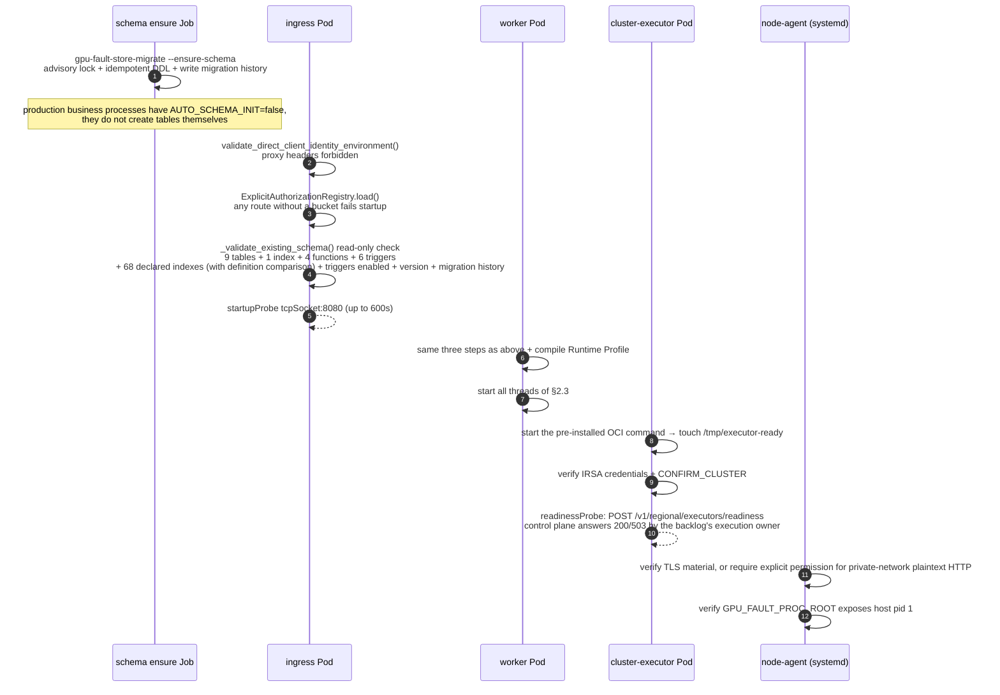
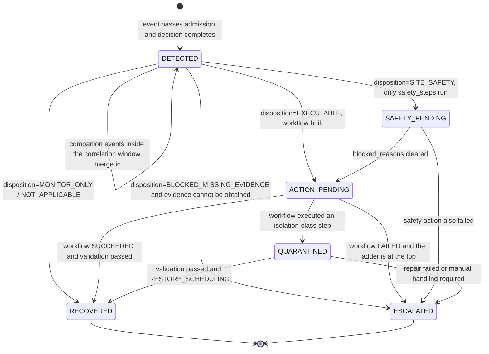
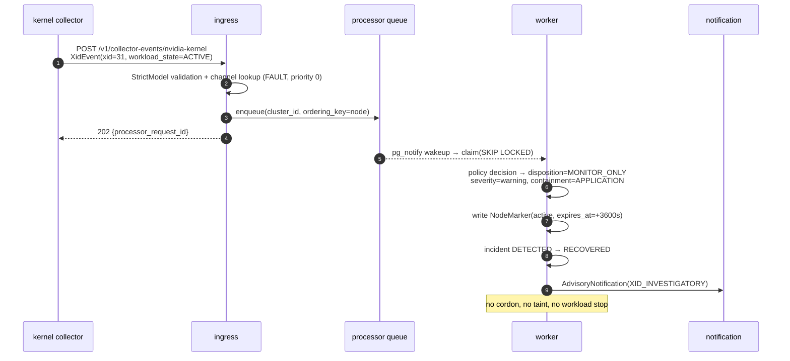
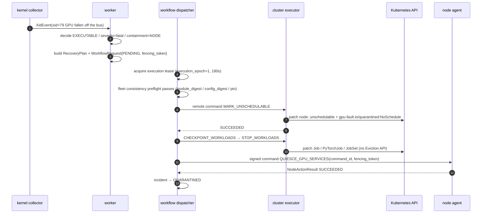
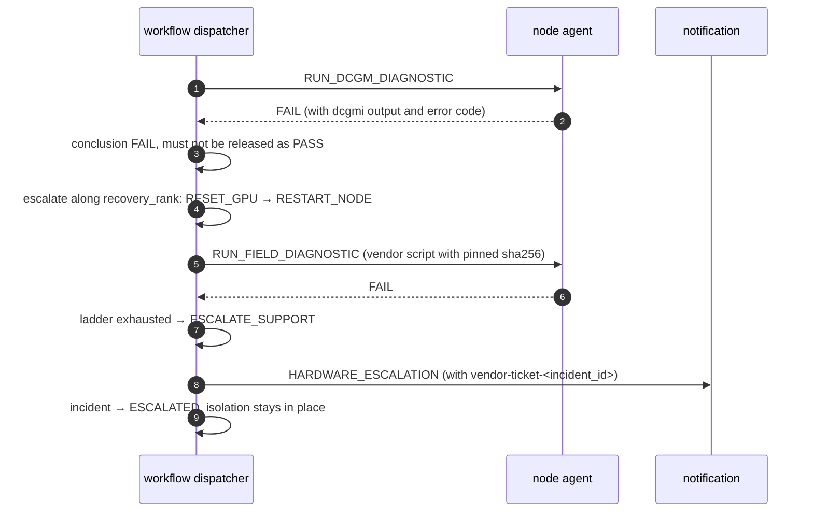
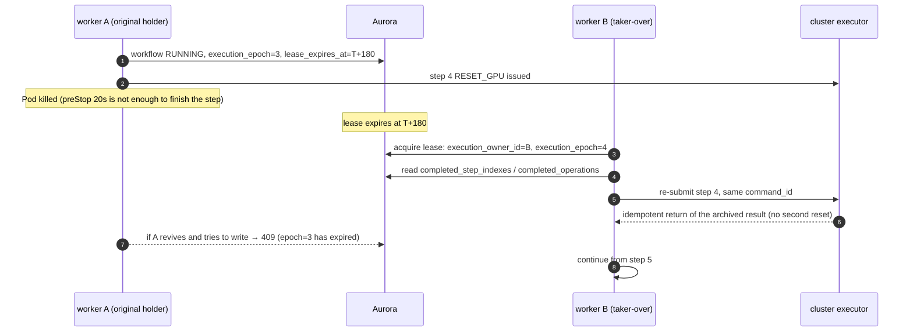

English edition of `docs/详细设计-v2.md`; the Chinese file remains the source of record until both are maintained together.

# GPU Fault Handling System Detailed Design (v2)

## 0. What this edition is

### 0.1 Relationship to the existing documents

| Document | Question it answers | Relationship to this document |
|---|---|---|
| [High-Level Design v2 (closed-loop view)](high-level-design-v2.md) | Detect → decide → isolate → stop workload → repair → validate → return to management / manual handling: who does each link and where the boundaries are | This document is its implementation-level expansion. Wherever a "capability boundary" or "hard constraint" conclusion exists there, this document does not restate it, it only references it |
| [Detailed Design](detailed-design.md) (v1) | Which modules, protocols and state machines the current code has | The factual baseline of this document. v1 is "enumerated by module"; this document is "sunk down by runtime behaviour" |
| [Deployment and Operations Manual](deployment-and-operations-manual.md) | How to install, upgrade, roll back and inspect | This document only writes down what "must be so by design"; concrete command sequences are not copied |
| [Regional-Mode End-to-End Acceptance Test Cases](regional-e2e-acceptance-test-cases.md) | How each behaviour is proven on real machines | The traceability matrix in §10.5 of this document points directly at its case ids |

The section numbers of the v1 Detailed Design are referenced by other documents and by tests (§2.11, §2.14, §2.15–2.17, §2.18, §3.1, §3.3, §4.4, §4.5) and
**will not** change because this document exists. This document is a parallel second detailed design, not a replacement.

### 0.2 Acceptance criteria for this document

After reading this document a developer should be able to code, integrate and test without needing to discuss the following questions again:

1. Which process the module I am changing runs in, how many threads it has, who starts it and who stops it;
2. Which channel its input arrives on, what the field types are and which are mandatory;
3. How long its timeouts are, how many times it retries and which state it lands in after failure;
4. What happens when the same event is delivered twice, or two replicas grab the same node at the same time;
5. Which log fields it writes, which metrics it exposes and which dimensions have **no** metrics at all;
6. After my change, which unit tests and which real-machine case must be rerun.

### 0.3 Sources of fact and writing conventions

Every assertion in this document corresponds to source code or a generated manifest, never to "it is recommended that it should be so". Conventions:

- Counts, thresholds and defaults come from source code or from the generated manifests under `deploy/control-plane/regional/generated/`;
  when the two disagree, the generated manifest is the **production fact**, and the application's bare default is written out explicitly.
- Inventories of "surfaces" such as routes, metrics and capabilities must be taken by assembling the real app and walking it, not by counting decorators.
- Anything that exists in the proposal but not in the implementation is never written as "implemented"; it is collected in §11.
- Performance numbers do not live in this document. Capacity and load-test definitions are in the
  [Performance Load-Test Acceptance Plan](performance-acceptance-plan.md) and [Detailed Design](detailed-design.md) §2.18.5.
- The date of the most recent item-by-item verification against the real app, the Store codec, the generated manifests and the test directory on the current `main`
  is **2026-09-15**; on the same day this branch additionally spot-verified notifications, the persistent registry, deployment identity, monitoring and retention.
  Count-type assertions (route and auth buckets, metric families, codec kinds, notification templates, DDL objects, operation counts) are generated under
  the conditions of the real app assembled by `create_app(build_context())`, the in-memory Store fixture and the regional worker role;
  metric families are counted once each with `regional_mode` off and on, and Postgres-only families and conditional families are not counted. All other facts follow the released source code,
  the generated manifests and the existing fact checks; the numbers in this document are recounted against the current code of this repository and are not replaced by counts from another branch.

---

## 1. About this document

### 1.1 Scope

This document covers the only production form of `gpu-fault-control-plane` **0.10.0**:

- one **CPU control plane** per AWS Region (three Deployments on EKS + Aurora PostgreSQL);
- N **HyperPod EKS GPU clusters** in that Region as the data plane, each cluster with one set of executor and collectors;
- one **systemd collector + signed node-action Agent** per GPU node.

The single-cluster all-in-one form (`GPU_FAULT_DEPLOYMENT_MODE` not `regional`) is only for local development and testing;
its authentication, admission and consumption behaviour differ from production, and **production behaviour must not be inferred from it** (see §8.1,
[Detailed Design](detailed-design.md) §4.5).

### 1.2 Supported hardware and software

| Dimension | Supported range | Source of fact |
|---|---|---|
| GPU vendor | NVIDIA only | No AMD/Intel/ROCm/XGMI implementation anywhere in the repository (§11) |
| GPU product families | `A100`, `H100` (including `GH`), `B100`, `GB200`, matched by model-name prefix `A/H/GH/B/GB` | `productFamilies` in `src/gpu_fault/data/nvidia-xid-catalog-610.generated.yaml` |
| Instance types (expected GPU/EFA counts) | `p5.4xlarge` (1/1), `p5.48xlarge` (8/32), `p5e.48xlarge` (8/32), `p5en.48xlarge` (8/16), `p6-b200.48xlarge` (8/8), `p6-b300.48xlarge` (8/16) | `src/gpu_fault/gpu_instance_inventory.py` (`GPU_INSTANCE_INVENTORY`; `node_installer_reconciler.py` and the release renderer only import it, `src/gpu_fault/collectors/gpu/discovery.py` is the node-side copy with the same values) |
| Basis for XID decisions | NVIDIA Xid Catalog **610**, `coverage: FULL_OFFICIAL_ARTIFACT` | `spec.catalog.version` of the same YAML |
| Basis for SXID decisions | Snapshot of Fabric Manager User Guide tables 21–24 (`2025-11-14`), `coverage: NVIDIA_FM_TABLES_21_24` | `src/gpu_fault/data/nvidia-fabric-manager-sxid-2025-11-14.yaml` |
| Driver version | No version compatibility matrix. The only decision that forks by driver branch is NVLink5 sub-code decoding: `driverBoundary: 575` decides whether the v1 or v2 bit pattern is used | `nvlink5Policy` of the same XID catalog |
| Python | `>=3.12`; the production Runtime Image is based on `registry.access.redhat.com/ubi9/python-312-minimal` (the `RUNTIME_BASE_IMAGE` build-arg of `deploy/image/Dockerfile`, which must be a sha256 digest reference; `scripts/release_image.py` rejects the tag form); `python:3.12-slim` appears only in the manifests of the e2e/perf probe Jobs | `pyproject.toml`, `deploy/image/Dockerfile` |
| Kubernetes client | `kubernetes>=31,<36`; uses `batch/v1` Job, `kubeflow.org` PyTorchJob, `jobset.x-k8s.io` JobSet | `pyproject.toml`, `deploy/dataplane/cluster-action-executor.yaml` |
| Node OS | Requires systemd, `journald`, `/dev/kmsg`, `nvidia-smi`; the node runtime is installed under `/opt/gpu-fault/releases/<artifact-sha>/venv` and selected atomically by `current` | `deploy/systemd/`, `deploy/node/install-gpu-fault-collector.sh` |
| DCGM | `nvcr.io/nvidia/k8s/dcgm-exporter:4.4.1-4.5.2-ubuntu22.04`, connected to the host hostengine via `DCGM_REMOTE_HOSTENGINE_INFO=127.0.0.1:5555` | `deploy/dataplane/hyperpod-dcgm-exporter.yaml` |
| Orchestrator | EKS only. HyperPod Slurm orchestration is not supported | The four hard constraints in High-Level Design v1 §2.1 |
| Database | Aurora PostgreSQL; `psycopg[binary,pool]>=3.2,<4` | `pyproject.toml`, generated manifests |

### 1.3 Explicitly unsupported scenarios

The following are not "not yet tested"; they are **deliberately not done by design**, and the implementation either has a guard or has no code path at all:

| Scenario | Current state | Basis |
|---|---|---|
| Calling `BatchReplaceClusterNodes` to replace a node | Unreachable at the code level. The provider client protocol does not declare the method, and `HyperPodAction.REPLACE` fails immediately on entering provider submit; environment variables, IAM and CloudTrail provide outer-layer disproof on top | `src/gpu_fault/hyperpod.py` and `tests/hyperpod/test_hyperpod.py` |
| HyperPod `NodeRecovery` automatic recovery | Must be `None`; the control plane verifies this at startup | High-Level Design v2 §1.2 |
| Job auto-resume taken over by the platform | The contract requires jobs **without** the `sagemaker.amazonaws.com/enable-job-auto-resume` annotation: when the annotation is missing or false the `workloadStop`/`workloadRestart` capability is `OWN`; when it is true the code yields `DELEGATE` (`src/gpu_fault/hyperpod.py`), and there is **no** startup refusal guard like the one for NodeRecovery | High-Level Design v2 §1.2, `src/gpu_fault/hyperpod.py` |
| Single-GPU-granularity removal (device-plugin stops only one card) | Not implemented. Only the whole GPU/EFA device-plugin DaemonSet Pod can be restarted, so **the isolation granularity is the whole node** | §3.8, §11 |
| MIG-instance-level fault modelling | The MIG UUID prefix is only treated as part of the device identity; there is no MIG-granularity fault model or blast radius | §11 |
| Kubernetes Eviction API eviction | Not used. Node isolation uses cordon + the `gpu-fault.io/quarantined:NoSchedule` taint; stopping the workload is executed by the independent `STOP_WORKLOADS` step | §3.8 |
| Writing Kubernetes Events / custom CRDs | Not written. NodeCondition is read-only | §3.8, §11 |
| A real dry-run | `/simulate` writes to the database and drives the workflow and incident to a terminal state; it is not a read-only rehearsal | §8.5, §11 |
| External ticketing systems (Jira/PagerDuty/Slack/webhook) | None. The "ticket number" is a locally synthesised `vendor-ticket-<incident_id>` string that appears in the SNS/SES notification body | §3.10, §11 |
| PCIe AER decoding | None. On the PCIe side there are only `pcie_replay_total` / `DCGM_FI_DEV_PCIE_REPLAY_COUNTER` and `pci_bdfs` | §11 |

---
## 2. Deployment and Process Design

### 2.1 Full process table

A complete deployment comprises the running or installable roles in the table below (including the 0-replica pressure-relief role and the
NodeLog collector unit, which is disabled by default), distributed across three layers. The business code is split into
three independent wheels, `gpu_fault_control_plane`, `gpu_fault_cluster_executor` and
`gpu_fault_node_runtime`; the node bundle packages only the Node Runtime.
The administrator entry point is delivered separately by the `gpu_fault_deploy_host` wheel, which exists only in the venv of the trusted deploy host and does not enter
the Runtime Image or the application release Manifest. `gpu-fault-control-plane` does not contain
the `gpu-fault-admin` entry point or the administrator deployment source code.
The schema-v4 business wheels and locked dependencies are pre-installed into their respective OCI images when the Runtime Image is built
(`deploy/image/Dockerfile`: CPU and Executor run the entry points under `/opt/gpu-fault/control-plane` and
`/opt/gpu-fault/executor` respectively; the container directly execs the uvicorn/entry point of that venv), and business Pods
do not run `pip install` at startup. The `/artifact` ConfigMap volume stores only xz-compressed wheels
(`<wheel>.whl.xz`, `src/gpu_fault/admin/artifact_configmaps.py`) for digest verification and recovery: it is
part of signed-artifact delivery and audit, not an online dependency installation source, and nothing reads it at runtime; the Node bundle
is additionally paired with an offline dependency image at a fixed digest. The regional
orchestrator judges the blast radius by component `module_digest`, so control-plane changes no longer require rolling GPUs or nodes.

| Layer | Workload | Kind | Replicas | Entry point | Port | ServiceAccount |
|---|---|---|---|---|---|---|
| Control plane | `gpu-fault-api-ha` | Deployment | 3 | `uvicorn gpu_fault.app:create_app --factory --workers 4` | 8080 | `gpu-fault-control-plane` |
| Control plane | `gpu-fault-control-worker` | Deployment | 6 | Same as above, `--workers 4` | 8081 | `gpu-fault-control-plane` |
| Control plane | `gpu-fault-telemetry-spool-worker` | Deployment | **0** | Same as above, `--workers 1` | 8082 | `gpu-fault-control-plane` |
| Data plane | `gpu-fault-cluster-executor` | Deployment | 2 | `gpu-fault-cluster-executor` | **9111**; `/metrics` and `/healthz` (family `gpu_fault_cluster_executor_*`; the port is given by `GPU_FAULT_CLUSTER_EXECUTOR_METRICS_PORT`, must equal the manifest's `metrics` containerPort, 0 disables; `/healthz` and the exec liveness read the same loop-alive file) | `gpu-fault-cluster-executor` |
| Data plane | `gpu-fault-completion-watcher` | Deployment | 1 | `gpu-fault-completion-watcher` | **9109**; `/metrics` and `/healthz`, all three probes read it | `gpu-fault-completion-watcher` |
| Data plane | `gpu-fault-node-installer-reconciler` | Deployment | 1 | `gpu-fault-node-installer-reconciler` | **9110**; `/metrics` and `/healthz` (family `gpu_fault_node_installer_*`; `GPU_FAULT_NODE_INSTALLER_METRICS_PORT`, 0 disables; the liveness probe still reads the heartbeat file, `/healthz` answers the same 300 s freshness question) | `gpu-fault-node-installer-reconciler` |
| Data plane | `gpu-fault-kubernetes-node-resource-collector` | Deployment | 1 | `gpu-fault-collector kubernetes-node-resources` | No listening port | `gpu-fault-kubernetes-node-resource-collector` |
| Data plane | `gpu-fault-dcgm-exporter` | DaemonSet | One per GPU node | dcgm-exporter | 9400 | default |
| Data plane | `gpu-fault-adot-dataplane` | Deployment | 1 per GPU cluster | aws-otel-collector (`deploy/dataplane/adot-dataplane.yaml`) | 8090 (`/health` of the health_check extension, for probes only) | `gpu-fault-adot-dataplane` (IRSA) |
| Node | 5 installable collector systemd units (4 enabled by default in production, NodeLog disabled by default) | systemd | 1 of each per node | `/opt/gpu-fault/current/venv/bin/gpu-fault-collector <mode>` | No listening port | root (see §2.4) |
| Node | `gpu-fault-node-agent` | systemd | 1 per node | `/opt/gpu-fault/current/venv/bin/gpu-fault-node-agent` | **9099**; TLS by default | root |

Before the data-plane review of 2026-09-08 the data-plane components' own metrics had no scrape path at all (the watcher's 9109 could only be
read manually via `kubectl exec`). Now each GPU cluster runs one `gpu-fault-adot-dataplane` collector (1 replica,
`Recreate`, only a get/list/watch Role on `pods` in its own namespace, no ClusterRole):

- **Discovery is declarative**: job `gpu-fault-dataplane` uses `kubernetes_sd_configs role: pod` to look only at
  `gpu-fault-system`, keeps Pods with the `prometheus.io/scrape: "true"` annotation **and** a container port named `metrics`,
  and `prometheus.io/path` decides the path; no component is named explicitly. The watcher (9109), reconciler (9110) and
  executor (9111) Deployments all declare this set of annotations and ports; the node-resource collector does not declare them, by ruling.
- **Keeps `up` and the component metric families**: `up|gpu_fault_completion_.+|gpu_fault_cluster_executor_.+|gpu_fault_node_installer_.+|gpu_fault_node_resource_.+`
  (the last one is reserved), and drops the `otel_scope_*` labels. Three static labels, `control_plane_cluster`
  (the same literal value as the control-plane collector), `region` and `gpu_cluster`, are attached in the target relabel stage, so both the alerts'
  `by` clauses and the raw series can be distinguished per GPU cluster.
- **Writes to the same AMP workspace**: `prometheusremotewrite` + `sigv4auth`, with credentials from the IRSA annotation of ServiceAccount
  `gpu-fault-adot-dataplane` (`aps:RemoteWrite` scoped to that workspace ARN). That IRSA role is created by
  `bootstrap_services.ensure_adot_writer_role` (isomorphic with `ensure_executor_role`: shares the provider from `_ensure_oidc_provider`,
  `irsa_trust_document` generates the trust, `amp_remote_write_policy_document` generates the policy — the control-plane writer also switched to
  the same helper); in the bootstrap task graph it is `adot_writer_role:<cluster>` (depends on `executor_role:<cluster>` and
  `monitoring_resources`); join-cluster executes it serially after the parallel prerequisite tasks and only when `health.amp_workspace_id` is configured;
  the signed release build (`release_repositories.SignedReleaseBuild`) starts in an independent thread right after scope discovery, in parallel with the task graph,
  and only `monitoring_install`/`aurora_refresh`, which need to publish the image, wait for it in their own worker threads; consent verification runs once on first use; the ARN is written
  via `bootstrap_site.cluster_irsa_role_entries` into `spec.clusters[].adotIrsaRoleArn` (`preserve_existing_site_contract`
  preserves operator-explicit values), the resource inventory key is `aws/iam/adot-writer/<cluster>/role`, and `remove-cluster` deletes it through the existing `iam_role` cleanup path;
  its own telemetry goes through the independent job `gpu-fault-adot-dataplane-self` (deliberately not the same name as the control plane's
  `gpu-fault-adot-self`, otherwise one live collector would mask another dead one). The data-plane endpoint is unauthenticated;
  execution tokens do not leave the control plane.
- **Post-deploy verification of the collector's own metrics reads AMP, not the Pod port**: the `service.telemetry`
  Prometheus reader of both collectors is deliberately bound to `127.0.0.1:8889` (the unauthenticated internal counters of the collector are not exposed to the
  namespace), so any read proxied through the API server to the Pod IP necessarily gets connection refused —
  that is exactly how the `adot_self_metrics` verify of deploy #25 on 2026-09-09 failed after COMMITTED.
  `regional_adot_self_metrics.adot_self_metrics_report` (the implementation of `regional_admin_checks.check_adot_self_metrics`) uses `amp_instant_query` (SigV4-signed
  `/api/v1/query`) to check against the site AMP workspace: `up{job="gpu-fault-adot-self"}` is 1, and every `otelcol_*` series referenced by the alert rules and
  the keep list exists under that job; this simultaneously proves the whole chain of self-scrape, keep filter and
  remote_write. `otelcol_exporter_send_failed_metric_points` is created by the exporter only on the first
  send failure, a healthy collector has never published it, `GpuFaultTelemetryRemoteWriteFailing` reads it with
  `rate(...) > 0` where absence counts as 0, so `LAZY_ADOT_SELF_SERIES` accepts its absence.
- **Rendering and skipping**: `regional_release_rendering.render_dataplane_adot_manifest` does placeholder substitution only;
  any empty input or a residual `REPLACE_WITH_…` is a `ReleaseError`; `dataplane_adot_skip_reason` gives the reason when
  `health.amp_workspace_id` is not configured or the cluster has no `clusters[].adot_irsa_role_arn`,
  and the release records that cluster as skipped (the plan's `dataplane_observability[<cluster>]` is an empty list, one stderr line
  "data-plane ADOT collector not applied (<reason>)"), and the Completion Watcher alerts on that cluster remain
  silent — a collector without credentials is a CrashLoop, not telemetry. The application method is paired with the DCGM exporter
  (`preflight_gpu_adot_collector` / `apply_gpu_adot_collector`: server dry-run → apply →
  `rollout status`).
- **Release-engine integration**: `bootstrap_gpu_target` and `join_cluster` apply the collector after the DCGM exporter; the upgrade plan's
  `OBSERVABILITY` node runs `_apply_gpu_adot_collector` on every GPU cluster (the access gate of `upgrade_gpu_clusters` changed to
  `plan.has(*GPU_CLUSTER_COMPONENTS)` — ENDPOINT / DCGM / OBSERVABILITY / EXECUTOR / WATCHER / COLLECTOR /
  RECONCILER / AGENT — so a release that changes only observability also accesses the GPU clusters); the candidate preflight dry-runs it; `remove_cluster`
  and the bootstrap cleanup scale `gpu-fault-adot-dataplane` to 0; rollback is not in the per-cluster compensation (OBSERVABILITY is a global component)
  but in the observability snapshot restore phase: `regional_dataplane_observability.capture_observability_snapshot_with_dataplane`
  adds the data-plane half to the observability snapshot before opening the transaction (`observability.dataplane_adot`: the declared objects and "does not exist" markers
  captured per cluster via its **own** kube context, 8-way parallel, any cluster capture failure refuses to open the transaction; plus the contents of the `gpu-fault-dataplane-expected`
  rule namespace), while the control-plane half is still restored in the `observability_restore` phase: the static rule namespace and the Alertmanager definition each first wait for
  AMP to settle (CREATING/UPDATING/DELETING, 5 s × 60) and then put (create only on ResourceNotFound), waiting until ACTIVE after the put before continuing;
  `CREATION_FAILED` / `UPDATE_FAILED` throw `ReleaseError` with `statusReason` and do not touch the collector further; only when both are ACTIVE is the control-plane
  collector restored (recording `control_plane_collector: restored|restored-unchanged`,
  `dataplane_adot: deferred to dataplane_observability_restore`); the data-plane half is the independent phase
  `dataplane_observability_restore` (checkpoints `rollback-dataplane-observability-restoring` / `-restored`, located between
  `rollback-cpu-restored` and `rollback-restored`, registered in `ROLLBACK_PHASES`), which **by the snapshot's keys** applies the snapshot objects cluster by cluster and deletes objects that do not exist in the snapshot; if the apply output is all `unchanged`
  the restart is skipped (the control-plane collector likewise gates its restart on the apply output); the capture walks the candidate configuration, so a cluster newly added by the candidate release is recorded as non-existent in the snapshot and on rollback is
  `removed`; `scaled-to-zero` is reachable only for clusters added to site.yaml after the transaction opened, and clusters deleted after the transaction opened make the phase refuse; a single cluster failure is recorded as
  `failed: <Type>: <msg>` and the other clusters and the rule namespace continue, and at the end of the phase a single `DataplaneRollbackIncomplete` is thrown
  ("data-plane observability rollback failed on N of M steps: … -- the rest was restored; resume the rollback to
  retry the failed ones", `expected-rules` counts as one step; `fail_phase` persists the record together with `error`; the rollback is truthfully FAILED, and resume reruns the whole
  phase); finally the rule
  namespace is restored or deleted (existence is decided by `ResourceNotFoundException`, other describe failures throw; a non-ACTIVE state first waits to settle, 5 s × 60; on the restore side, after put/create it likewise polls describe at 5 s × 60 until ACTIVE
  (`CREATION_FAILED` / `UPDATE_FAILED` throw `ReleaseError` with `statusReason`; timeout or the namespace disappearing midway also throw), after delete
  it waits for ResourceNotFound, and `restored` / `deleted` are recorded only after the wait completes — both planes share `regional_observability_rollback.wait_for_amp_definition_settled /
  _active / _gone`, the same semantics as the install script's `wait_for_amp_definition` / `wait_for_amp_definition_gone`). The whole snapshot — both planes — is validated before any object is touched; the record returned by the phase is persisted by the phase runner
  (`path: snapshot|previous-image`,
  `clusters: {<id>: restored|restored-unchanged|removed|scaled-to-zero|failed: …|candidate-manifest-with-previous-image}`).
  `bootstrap`, `join_cluster` and `remove_cluster` call `_apply_observability` at the end (the method body is in
  `regional_dataplane_observability.apply_observability`; `remove_cluster` passes `exclude_cluster_ids` to exclude the deregistered
  cluster when rendering) to re-render the per-cluster rules (otherwise a site that came out of bootstrap
  has no absent rule at all until the digest happens to move); `sync_release_state` (the plan-less `_capture_previous()`) likewise reads
  the collector objects of every GPU cluster in parallel. `previous-image`
  is reachable only when the state lacks `dataplane_adot` (transactions older than this version) and is recorded truthfully. The four helpers of `regional_manifest_snapshot` therefore accept
  an optional `kubectl` prefix; the narrative of `REPLAYED_MANIFEST_CHANGES` was changed to hold for both planes. Known limitation (F5): a release that touches only observability
  also records every cluster as CONVERGED and refreshes `converged_at_epoch`. The `observability_adot` digest =
  `sha256({control_plane_manifest, dataplane_manifest, amp_workspace_id, adot_irsa_role_arns: {cluster: arn|null},
  dataplane_expected_rules})` (the last item is the rendered per-cluster rule text):
  adding a role, adding a workspace or changing the collector manifest all become a `CONTROL_PLANE_ONLY` release with an OBSERVABILITY node; `registry_config_digest`
  / `dcgm_digest` / `observability_rules_digest` are not affected by the role. On the first deployment of a release containing this change, `observability_adot`
  moves once because of the formula change. The missing alert `GpuFaultDataplaneCollectorMissing` is split in two halves: the static rule only has "some `gpu_cluster` has
  `max(up) == 0` for 15 minutes"; "not a single series" is rendered by `render_dataplane_expected_rules` during `_apply_observability`
  for the clusters that have a role configured as `absent(up{job="gpu-fault-dataplane", gpu_cluster="<id>"} == 1)` (same alert name, same
  runbook card, description naming the cluster), handed via `run_amp_monitoring_installer` with `--dataplane-expected-rules <tmp>` /
  `--no-dataplane-expected-rules` to `install-amp-monitoring.sh`, which writes it into the independent namespace `gpu-fault-dataplane-expected`
  (idempotently deleted when no cluster has a role configured; a bare run of the script does not touch it). The global `absent(...)` half has been deleted: it would alert permanently on a
  site with "workspace but no role". Per-cluster rendering also closed the previous blind spot (with multiple clusters, one dead and one alive, the dead one had no series at all). The two Completion Watcher rules are grouped by
  `gpu_cluster`.

The production entry point is `uvicorn ... --factory`, **not** the console script `gpu-fault-api`. Reading a process's identity
cannot rely on the Pod name or annotations, only on `module_digest` (`GET /v1/version`):
the `gpu-fault.io/artifact-sha256` annotation and `GPU_FAULT_RELEASE_ID` are pure labels; changing them does not affect the running code.

The historical in-cluster GPU metrics DaemonSet manifest (`gpu-metrics-collector.yaml`) has been deleted from
`deploy/dataplane/` and from the cleanup inventory. Current regional production collects GPU metrics via the node
systemd `gpu-fault-metrics-collector.service`; a DaemonSet of this kind must not be redeployed,
otherwise the same node would have two producers.

### 2.2 The three control-plane roles

The same `create_app()` splits by `GPU_FAULT_SERVICE_ROLE`. Only the values
`all`/`ingress`/`worker`/`spool-worker` are allowed; anything else throws at assembly time
`ValueError: GPU_FAULT_SERVICE_ROLE must be all, ingress, worker, or spool-worker`
(`src/gpu_fault/app/factory.py`). Production does not use `all`.

| Role | Responsibility | Background threads | Key uvicorn parameters | requests / limits |
|---|---|---|---|---|
| `ingress` | Only authentication, decoding, admission, **enqueue**, and returning the receipt | Three: `gpu-fault-collector-metrics-snapshot`, `gpu-fault-regional-registry` (regional mode), `gpu-fault-process-metrics` (when `POD_UID` exists), see §2.3 | `--backlog 8192 --limit-concurrency 4096`; automatic worker recycling by request count is forbidden | 4 CPU / 4Gi → 8 CPU / 8Gi |
| `worker` | Consume the queue, decide, orchestrate, dispatch, periodic tasks, notifications | All (table in §2.3) | `--backlog 1024`, `--limit-max-requests` is **not** set | 3 CPU / 4Gi → 4 CPU / 6Gi |
| `spool-worker` | Only replays the telemetry spool | Common metrics/registry maintenance + `gpu-fault-telemetry-spool` / `-notifications` | `--workers 1 --backlog 1024` | 1 CPU / 2Gi → 4 CPU / 4Gi |

- `background_services_enabled = service_role in {"all","worker"}`.
  The ingress process **still constructs** the Processor object (enqueue, admission and leases all need it) but does not start any
  consumer thread. Therefore "Pod Running with clean logs" does not mean "someone is consuming the queue" — look at the replica count
  of the worker role.
- ingress workers can only be replaced by a checked Deployment rollout, Pod replacement or liveness recovery;
  Uvicorn `--limit-max-requests` is not used. That parameter exits the old worker first and then backfills; when multiple processes
  hit the cumulative request cap at the same time during a burst, service capacity is removed instantaneously and admission waits are pushed past the request budget.
- `spool-worker` enforces two preconditions at assembly time; missing either one gives
  `ValueError: spool-worker role requires queued processor mode and GPU_FAULT_TELEMETRY_SPOOL=true`.
  `replicas: 0` is intentional: the spool is the relief valve for telemetry floods; scale the replicas first when it is needed.
- Capacity must be calculated as "**per process × threads per process × replicas**", not by Pod count: ingress and
  control-worker have 4 uvicorn processes per Pod (`--workers 4`; spool-worker has 1, enforced by the role-split
  verifier). `GPU_FAULT_PROCESSOR_WORKERS=24` is a per-process value: 6 replicas × 4 processes × 24 =
  576 processing slots. ADOT scrapes Pods; the 4 processes in one Pod each hold independent in-memory counters and a scrape lands on
  only one of them, so `/metrics` does shared-file aggregation inside the Pod (each process writes its complete samples to
  `/dev/shm`, the responder merges the live processes and aggregates according to the policy table, see "multi-process aggregation" under §/metrics),
  so the reading is independent of which process the scrape lands on.

The 18 ConfigMaps of the three roles (core/notification/postgres/processor/recovery/telemetry per role)
are generated by the renderer; hand edits are caught by the manifest check of `make docs-check`. Before changing an environment variable you must first confirm it
is not a `valueFrom` — each of the three Deployments has 26 explicit `env` items that come from
Secret/ConfigMap references, and changing `value` directly has no effect; the remaining configuration is injected through 6 `envFrom`
ConfigMaps.

### 2.3 Control-plane thread model

`src/gpu_fault/app/lifespan_workers.py` starts threads by role. All threads are
`threading.Thread` and share one `Event` as the stop signal.

| Thread name | Start condition | Responsibility |
|---|---|---|
| `gpu-fault-collector-metrics-snapshot` | **Unconditional**, all three roles | Collector health snapshot, for `/metrics` and the silence scan |
| `gpu-fault-regional-registry` | All three roles (regional mode assembles `regional_registry_runtime`) | Regional registry durable-head watch and member persistent heartbeat |
| `gpu-fault-process-metrics` | All three roles (`POD_UID` exists; when unset the thread returns immediately without running the publish loop) | Every 5 s writes the rendered full `/metrics` of this process to `/dev/shm` for in-Pod aggregation (§10.2) |
| `gpu-fault-processor-inbox` | `background_services_enabled` | Main consumer loop: claim → process → complete |
| `gpu-fault-processor-notifications` | `background_services_enabled` and the Store supports `listen_processor_queue_notifications` | Listens to `pg_notify('gpu_fault_processor_queue')` and wakes the inbox |
| `gpu-fault-periodic-services` | `background_services_enabled` | The 8 periodic tasks in `PeriodicServiceRunner._JOBS` (§2.3.1) |
| `gpu-fault-workflow-dispatcher` | `background_services_enabled` | Scans runnable workflows and drives the state machine |
| `gpu-fault-workflow-dispatch-wakeups-workflow` / `-remote-command` | dispatcher enabled and the Store has `run_wakeup_listener` | Each listens to the `pg_notify` of one `WakeupChannel` and translates it into `dispatcher.wake()` (§3.7 ④) |
| `gpu-fault-xid-correlation` | `background_services_enabled` | Finalize of the XID correlation window |
| `gpu-fault-processor-diagnostics` | `background_services_enabled` | Diagnostics result publishing |
| `gpu-fault-notification-dispatcher` | `background_services_enabled` and asynchronous delivery and the dispatcher switch is true | Site SNS/SES notification dispatch |
| `gpu-fault-telemetry-spool` / `-notifications` | `telemetry_spool_enabled` | Spool replay |
| `gpu-fault-processor-leadership` | `active_consumers` is **false** | Not started in production — production is `active-active`, **there is no leader** |

Event loop lag is sampled by an asyncio task `monitor_event_loop_lag` and exported as
`gpu_fault_event_loop_lag_seconds`. Synchronous psycopg transactions, Store domain services and potentially blocking
external I/O all run off the event loop, carried by the per-process
`src/gpu_fault/async_store.py::AsyncStoreExecutor`.

#### 2.3.1 Periodic tasks and leases

Periodic tasks do not elect a leader; instead each `task_key` has one periodic-task lease, so an owner failure of any one task
does not block the other tasks (`src/gpu_fault/app/periodic_services.py`).

| `task_key` | Default interval | Environment variable | Notes |
|---|---:|---|---|
| `training-health` | 15s | `GPU_FAULT_TRAINING_HEALTH_SCAN_SECONDS` | Runs only with `GPU_FAULT_ENABLE_TRAINING_HEALTH_MONITOR=true` |
| `spare-health` | 30s | `GPU_FAULT_SPARE_HEALTH_SCAN_SECONDS` | Warm spare patrol |
| `identity-refresh` | 20s | `GPU_FAULT_HYPERPOD_IDENTITY_REFRESH_SECONDS` | HyperPod node identity refresh |
| `processor-cleanup` | 60s | `GPU_FAULT_PROCESSOR_CLEANUP_INTERVAL_SECONDS` | Queue tombstones, evidence TTL, remote command retention; since the control-plane review of 2026-09-08 the same round also runs the four kinds that originally had no retention, `inactive_markers` / `notifications` / `completion_records` / `registry_members` (see below) |
| `control-record-archive` | 600s | `GPU_FAULT_CONTROL_RECORD_ARCHIVE_INTERVAL_SECONDS` | Incident archive-first archiving, at most `GPU_FAULT_CONTROL_RECORD_ARCHIVE_BATCH_SIZE=200` records per round (the original 3600s / 25 records could never catch up with the backlog, F-8) |
| `collector-silence` | 60s | `GPU_FAULT_COLLECTOR_SILENCE_SCAN_SECONDS` | Collector silence check; scope and criteria below; notifications deduplicated by default in 3600s time buckets |
| `processor-lease-reclaim` | 30s | `GPU_FAULT_PROCESSOR_LEASE_RECLAIM_SECONDS` | Reclaims queue rows whose lease has expired but are still LEASED, at most `LEASE_RECLAIM_BATCH=256` rows per round |
| `processor-counter-drift` | 60s | `GPU_FAULT_PROCESSOR_COUNTER_DRIFT_SCAN_SECONDS` | Drift scan between the queue count table/shards and the real row count (`processor_counter_drift_abs`) |

`collector-silence` runs in the background Worker in regional mode. `PeriodicServiceRunner._run_silence`
schedules `notify_silent_collectors` (`src/gpu_fault/app/collector_silence.py`), which reads the collection state
in the Store and does not send probe requests to nodes. `_run_scheduled` starts timing after the end of the current round, so the default
60s is the scheduling interval, not a strict execution period, a loss-of-contact threshold or an upper bound on notification delivery; execution also depends on a healthy
Processor, an available Store and the periodic-task lease.

The scan covers only Agents in active clusters that `agent_is_current` judges to be online, i.e. ACTIVE with a valid heartbeat lease;
then `required_collectors_for_agent` selects the required channels, excluding services explicitly disabled/masked.
A notification is generated when `last_success_at` is missing or the time since it exceeds the threshold of that channel; when the success record is missing,
this scan does not first wait a full threshold window. The thresholds come from `src/gpu_fault/collector_registry.py`:
GPU inventory defaults to 180s, GPU metrics/host telemetry 420s, log channels 900s.
Notifications are deduplicated by cluster, node, channel and the `GPU_FAULT_COLLECTOR_SILENT_ALERT_SECONDS` time bucket,
with a default bucket width of 3600s. This path only generates and delivers an `AdvisoryNotification`; it does not create a recovery workflow,
nor does it write a unified `UNKNOWN` node state. Agent heartbeat loss and the health decisions of the Executor and Watcher
are not part of this collector silence scan.

The cleanup task has a double upper bound: `GPU_FAULT_PROCESSOR_CLEANUP_BATCH_SIZE=1000` and
`GPU_FAULT_PROCESSOR_CLEANUP_BUDGET_SECONDS=20`. The design is "clean one batch per round, never fill the whole period",
so **the cleanup rate is bounded**: when the production rate exceeds `limit ÷ interval` the queue only grows. Capacity calculations must
account for both ratios at once.

The four kinds that originally had no retention at all are now reclaimed by the same cleanup round (F-8 / G-9); each switch set to 0 disables it:
inactive markers (`GPU_FAULT_MARKER_RETENTION_SECONDS`), notifications whose delivery reached SENT/DEAD
(`GPU_FAULT_NOTIFICATION_RETENTION_SECONDS`; PENDING/RETRY/LEASED are never cleaned), decided
completion decisions and their events (`GPU_FAULT_COMPLETION_RECORD_RETENTION_SECONDS`),
the three defaulting to 2,592,000s (30 days); and expired member rows of the regional registry
(`GPU_FAULT_REGISTRY_MEMBER_RETENTION_SECONDS`, default 86,400s). The common rule is: **as long as an
incident still references the record it is kept** — it is packaged by the archiver together with the incident (F-I1); each job's row count,
errors and budget exhaustion are counted respectively in `gpu_fault_periodic_cleanup_rows_total{periodic_job}`,
`gpu_fault_periodic_cleanup_job_errors_total{periodic_job}` and
`gpu_fault_periodic_cleanup_budget_exhausted_total{periodic_job}` (F-F2); an exception thrown by the periodic task body itself is counted in
`periodic_job_errors_total` and triggers `GpuFaultPeriodicServiceErrors`, and `job_last_run` is no longer
refreshed by a failed round (F-1).

The regional registry's member heartbeat no longer writes on every 1s poll: it upserts only when the member row content changes or when more than
`GPU_FAULT_REGISTRY_STALE_SECONDS / 3` (production 90s → 30s) has elapsed since the last write (F-5);
`active_registry_member_ids` still judges liveness by the stale window, allowing two consecutive missed heartbeats.
`RegionalRegistryRuntime.is_ready` requires both the most recent successful refresh and the persistent heartbeat to be within that window,
and the timestamps must not be in the future; a successful database read cannot mask a long-running heartbeat write failure.
`registry_revision_missing_member_ids` is shared by the API status and `registry_revision_converged`:
all currently active processes, including joiners after the release, must be ready and ACK the same generation and content digest.
Once the old heartbeat of a known required member has expired, it need no longer block the remaining ACKed active fleet (2026-09-15 live incident:
an old control-worker that was terminating during the remove-cluster rollout was captured into required by the release of the subsequent join;
convergence stalled for the full 300s and rolled back; after the fix an expired heartbeat no longer counts in `missing_member_ids`); a missing required record
cannot prove departure, and all heartbeats expiring cannot become success. Only when both required and member records are empty is it an empty bootstrap.
`required_member_ids` keeps the original release snapshot; the ACK and missing lists may include processes that joined later.
This proof is based on runtime heartbeat leases of the same release and the same stale window; it is not live proof of Pod termination or of old versions running mixed.
`refresh_once` constrains concurrent read results with an in-process monotonic sequence number, checking the sequence number, generation
and applying the new state inside the same snapshot lock; an earlier request that returns late cannot overwrite a newer snapshot, target or integrity refusal.
A genuine subsequent backend generation regression still fails closed; database reads and writes do not hold the snapshot lock.

### 2.4 Node side: units, directories and ports

The node side runs no containers; `deploy/node/install-gpu-fault-collector.sh` installs it as systemd units.
Except for `gpu-fault-gpu-persistence` (oneshot, only CPUWeight/MemoryHigh/MemoryMax/TasksMax;
none of the four hardening items or the IO weight) and `gpu-fault-dcgm-exporter` in docker mode (the process is in the container, the unit
only limits itself), the collector/Agent units all have `NoNewPrivileges=true`, `ProtectSystem=strict`,
`ProtectHome=true|read-only`, `PrivateTmp=true`, and **each has individual CPU/memory/IO caps** — the design
premise is that these processes must never compete with training jobs for resources.

| Unit | ExecStart | Write permission | CPUQuota | MemoryMax | Notes |
|---|---|---|---:|---:|---|
| `gpu-fault-kernel-collector` | `gpu-fault-collector kernel` | `StateDirectory=gpu-fault` | 50% | 256M | `ReadOnlyPaths=/dev/kmsg /proc/sys/kernel/random/boot_id` |
| `gpu-fault-metrics-collector` | `gpu-fault-collector ${GPU_FAULT_METRICS_MODE}` | `ReadWritePaths=/var/lib/gpu-fault` | 100% | 1G | mode is `dcgm` or `nvidia-smi` |
| `gpu-fault-host-collector` | `gpu-fault-collector host` | `ReadWritePaths=/var/lib/gpu-fault` | 100% | 512M | 15s sampling |
| `gpu-fault-log-collector` | `gpu-fault-collector logs` | `StateDirectory=gpu-fault` | 100% | 768M | `SupplementaryGroups=systemd-journal` |
| `gpu-fault-fabric-manager-collector` | `gpu-fault-collector fabric-manager` | `StateDirectory=gpu-fault` | 50% | 256M | `After=nvidia-fabricmanager.service` |
| `gpu-fault-node-agent` | `gpu-fault-node-agent` | `ReadWritePaths=/var/lib/gpu-fault` | 200% | 1G | Listens on **9099**, requires TLS by default |
| `gpu-fault-certificate-check.timer` | `/opt/gpu-fault/check-control-plane-certificate` | — | — | 256M | `OnBootSec=5m`, `OnUnitActiveSec=12h`, `RandomizedDelaySec=10m` |
| `gpu-fault-gpu-persistence` | `nvidia-smi -pm 1` | — | — | 512M | `Type=oneshot`, `RemainAfterExit=yes` |
| `gpu-fault-dcgm-exporter` | `docker run … dcgm-exporter -a 127.0.0.1:9400 -c 15000` | — | container `--cpus 2 --memory 2g` | 256M (the unit itself) | Rendered and enabled only in installer `--dcgm-exporter docker` mode, `Restart=always RestartSec=10`; regional production defaults to the data-plane DaemonSet (`existing` mode), and the node does not have this unit |

`ProtectSystem=strict` makes `/var` read-only, so **every unit that needs to write the outbox must explicitly declare
`StateDirectory` or `ReadWritePaths`**; otherwise outbox writes get `EROFS`, and XID/SXID whose delivery failed
are silently dropped — and that scenario is precisely why the outbox exists.

Directory and file layout:

| Path | Content | Permissions |
|---|---|---|
| `/opt/gpu-fault/releases/<artifact-sha>/venv/` | Immutable Node Runtime slot, containing the collectors and the Agent | 0755 |
| `/opt/gpu-fault/current` | Atomic symlink to the current signed slot; the only run entry point for systemd | symlink |
| `/opt/gpu-fault/venv/` | Old venv preserved by the first legacy migration; on freshly installed nodes only a `current/venv` compatibility symlink | 0755/symlink |
| `/opt/gpu-fault/tools/py-spy-<version>-<sha>/` | Independent diagnostic tool slot with a fixed binary SHA | 0755 |
| `/opt/gpu-fault/verify`, `verify-certificate-bundle`, `check-control-plane-certificate`, `uninstall` | Operations scripts | 0755 |
| `/etc/gpu-fault/collector.env`, `node-agent.env`, `dcgm-exporter.env` | The units' `EnvironmentFile` | **0600** |
| `/etc/gpu-fault/control-plane-ca.crt` | CA of the private NLB; `SSL_CERT_FILE` points at it | 0644 |
| `/etc/gpu-fault/dcgm-counters.csv` | dcgm-exporter field list | 0644 |
| `/var/lib/gpu-fault/outbox/*.ndjson` | Persistent buffer of failed deliveries per channel | directory 0755 / files 0644 (neither `mkdir` nor `open` passes a mode); only `.lock` is 0600 |
| `/var/lib/gpu-fault/node-actions.db` | Node Agent receipt ledger (source of truth for idempotent replay) | 0644 (`sqlite3.connect` does not chmod, the unit has no `UMask=`) |
| `/var/lib/gpu-fault/quiesce/quiesce-*.json` | Restore state for GPU service quiesce | 0600 |
| `/var/lib/gpu-fault/health-snapshot/{gpu,host}.request` | Request files for `TRIGGER_HEALTH_SNAPSHOT`, deleted after a successful sample | 0644 |
| `/var/lib/gpu-fault/fabric-manager-collector-state.json` | FM log read position | 0644 (`open("w")` + `os.replace`, no mode passed) |

The Node Agent runs as root (the unit has no `User=`), because `RESET_GPU`, `RESTART_NODE` and
driver/firmware actions require host privileges. It holds no dedicated AWS credentials and cannot access the database — node actions only accept
signed commands authorised by the control plane (§3.1); the only AWS call is when `GPU_FAULT_DIAGNOSTIC_S3_URI` is configured
(passed through by the regional install Job), in which case the diagnostics archive is uploaded through the instance role's default credential chain with
`boto3.client("s3").upload_file` (`node_agent/operations/diagnostics.py`);
when it is not configured the AWS API is not touched at all.

### 2.5 Data-plane permissions: one minimal RBAC per workload

The data plane has no database connection. The five workloads each have an independent ServiceAccount; cluster-level read permissions and namespaced
write permissions are separated: the ClusterRole keeps only read-only verbs (plus `nodes patch` for the executor/reconciler), and the write verbs are
rendered by the release renderer `regional_release_gpu_rollout.render_workload_namespace_rbac` into Roles namespace by namespace according to
`allowed_namespaces` (`EXECUTOR_WORKLOAD_RULES` /
`WATCHER_WORKLOAD_RULES` / `DEVICE_PLUGIN_RULES`; the device-plugin's Pod delete permission is declared separately),
so an authorisation such as `pods/exec` that cannot be restricted with resourceNames does not become "a shell into any Pod in the whole cluster":

| ServiceAccount | Resource → verbs | Why these |
|---|---|---|
| `gpu-fault-cluster-executor` | ClusterRole: `nodes`: get/list/watch/**patch**; `pods`, `batch/jobs`, `kubeflow.org/pytorchjobs`, `jobset.x-k8s.io/jobsets`: get/list/watch. Roles rendered per allowed namespace: `pods`: patch/**delete**; `jobs`/`pytorchjobs`/`jobsets`: **create**/patch; plus a `pods delete` Role in `kube-system` (restarting the device-plugin Pod) | Isolation relies on patch (cordon + taint); `pods delete` is used only to restart the device-plugin DaemonSet Pod and to mark terminating Pods. There is **no** `nodes delete` and the Eviction API is not used; out-of-scope writes are refused twice, by the application and by the API server |
| `gpu-fault-completion-watcher` | ClusterRole: `pods`: get/list/watch; `jobs`/`pytorchjobs`/`jobsets`: get; `configmaps` (only the two resourceNames `gpu-fault-completion-watcher-outbox` / `-outbox-active`): get/update/patch, no create. Roles rendered per allowed namespace: `pods`: patch; `pods/exec`: get/create; `pods/log`: get; `jobs`/`pytorchjobs`/`jobsets`: patch | Needs exec to read GPU UUIDs and training progress inside the Pod; patch only, never delete; `pods/exec` cannot be restricted by resourceNames, so it is granted only in the namespaced Role and does not become a shell permission on any Pod in the whole cluster |
| `gpu-fault-node-installer-reconciler` | ClusterRole only `nodes`: get/list/watch/patch; Role in the same namespace: `jobs`: get/list/watch/create/**delete**; `configmaps` (`gpu-fault-node-installer-template` / `-wave`): get; `pods`: get/list | Re-runs the installation by deleting the Job; the delete scope is Jobs only; Pods are read to decide the state of the install Job's Pod |
| `gpu-fault-kubernetes-node-resource-collector` | `nodes`: get/list; `pods`: get/list | Read-only allocatable summary and Pod occupancy |
| `gpu-fault-adot-dataplane` | Only a Role in its own namespace: `pods`: get/list/watch; no ClusterRole | Pod discovery only; the permission to write AMP is in IRSA (`aps:RemoteWrite`), not in RBAC |

The SA annotation `eks.amazonaws.com/role-arn` of `gpu-fault-cluster-executor` must be replaced with the real
IRSA role, using the OIDC trust of this GPU cluster. Only two data-plane workloads hold AWS credentials: the executor
(HyperPod mutations) and `gpu-fault-adot-dataplane` (independent IRSA, granted only `aps:RemoteWrite` on the site AMP,
§2.1) — the Executor can no longer be described as the data plane's only AWS identity.
The control plane performs no HyperPod mutation.
The executor refuses to start when `GPU_FAULT_ENABLE_HYPERPOD_ADAPTER=true` and the credentials cannot be resolved,
so an unreplaced placeholder blows up at deploy time rather than waiting for the next real fault.

The three `ENABLE_*` switches on the executor container must be `true`:

- `GPU_FAULT_ENABLE_NODE_ACTION_ADAPTER=true` — leaving it `false` is not "the safer default";
  it makes the fleet agent product always `None`, and the policy silently downgrades "restart the application" to "isolate the whole node";
- `GPU_FAULT_ENABLE_HYPERPOD_ADAPTER=true`, and it must be possible to resolve
  `GPU_FAULT_HYPERPOD_CONFIRM_CLUSTER`, otherwise fail closed;
- `GPU_FAULT_ENABLE_HYPERPOD_SPARE_FAILOVER=true` — it is not a risk switch but the branch that holds the first lock of "never call the
  replace API"; turn it off and `GPU_FAULT_ALLOW_HYPERPOD_REPLACE=false`
  becomes the last lock before the provider API.

### 2.6 Replicas, anti-affinity, PDB and "no leader election"

The scheduling constraints of the three control-plane Deployments are identical:

- `podAntiAffinity.preferredDuringSchedulingIgnoredDuringExecution` (weight 100,
  `topologyKey: kubernetes.io/hostname`);
- `topologySpreadConstraints`: `maxSkew: 1`, `whenUnsatisfiable: DoNotSchedule`,
  `matchLabelKeys: [pod-template-hash]` — grouped by hash, so the old and new generations do not crowd each other out during a rolling upgrade;
- tolerates `gpu-fault.io/quarantined:NoSchedule` (otherwise the control plane would be driven out by its own taint) and
  `not-ready`/`unreachable:NoExecute`, `tolerationSeconds: 60`;
- `RollingUpdate`, `maxSurge: 1`, `maxUnavailable: 1`;
- PDB: `minAvailable: 2` for ingress, `maxUnavailable: 1` each for worker and spool-worker.

High availability does not rely on a leader but on three layers of leases (§9.3):

1. the lane lease of `gpu_fault_processor_lanes` (owner + epoch + random token + expiry);
2. the workflow execution lease + `execution_epoch` fencing;
3. one periodic-task lease per `task_key`.

### 2.7 Startup order and fail-closed guards



Figure 2-1 Startup order and fail-closed points of each layer

The Watcher entries below describe the persistence and liveness guards; the complete role interaction after a failure is discovered is in
[§7.9 Passive training terminal-state sequence](#passive-terminal-sequence). The branch flowcharts are maintained centrally in
[the Detailed Design's discovery and containment](detailed-design.md#passive-failure-containment) and
[terminal-state decision](detailed-design.md#passive-terminal-decision) and are not redrawn here.

A few points that must be remembered:

- **The schema is built by a one-off Job** (`deploy/migrations/postgres-schema-ensure-job.yaml`);
  the generated manifests set `GPU_FAULT_POSTGRES_AUTO_SCHEMA_INIT` to `false` everywhere, and the business processes only do read-only
  verification. This way the DDL's `LOCK` and `statement_timeout` never appear on the request path.
- **The Runtime Profile is stored once in Aurora per `profile_version`**, shared by all
  regional GPU clusters that reference that version. The `cluster_id` of the registration payload is only an authorisation anchor in the form of a registered cluster,
  not the HyperPod provider name or the storage key of the profile. The regional orchestrator compiles the declared source after the CPU ingress is Ready:
  registers when missing, passes idempotently when the content is identical, fails closed when the content of the same version has drifted
  and requires a new version, avoiding the upgrade silently rewriting the recovery policy. The same version is rendered at once to the CPU fleet
  pin, the Resource Collector and the Node Installer; the Completion Watcher reads the version from the training Pod
  annotation and does not maintain a second static default.
- The Completion Watcher treats an active Observation as a lease that must be continuously refreshed: while Pods exist, every
  reconcile updates `observed_at`; after all Pods disappear it first re-sends the last RUNNING Observation unchanged within `attempt_missing_grace_seconds`
  (default 300 s, `GPU_FAULT_COMPLETION_ATTEMPT_MISSING_GRACE_SECONDS`, unrelated to
  `cleanup_timeout_seconds`), refreshing only
  `observed_at` — during the gap in which the controller recreates Pods the control plane still attributes the attempt to that node — and publishes the `STOPPED` tombstone
  when the grace period expires. But every round with missing Pods reads the owner object once
  (Job/PyTorchJob/JobSet, the read has an upper time bound, and the same snapshot also serves tombstone attribution):
  when all return 404/410 the tombstone is published immediately without waiting for the grace period, because a deleted job will not recreate Pods,
  and continuing to re-send would only let a subsequent host fault compile the already-dead attempt into `STOP_WORKLOADS`; the ownership guard, on reading
  404, refuses with `STOP_OWNERSHIP_IDENTITY_UNKNOWN` and escalates the node isolation; an owner read failure that is
  not 404/410 (RBAC, timeout, no client) is still handled by the grace period, fail-closed. The tombstone does not forge a
  container exit code; the terminal event continues to use the allocation the Watcher has accumulated.
  A non-zero exit while the Pod carries `metadata.deletionTimestamp` is likewise read as STOPPED (`deletion_requested`):
  a user/operator `kubectl delete` of the job first makes torchrun receive SIGTERM and exit with 1 and then makes the Pod disappear;
  this is not a training failure, no failure-detected is sent, no restart budget is consumed, no escalation.
  ownership only accepts Observations whose `ingested_at` is not more than 120 seconds relative to the event; older
  `PENDING/RUNNING` records go into the stale gauge and no longer participate in node-mutation attribution.
  `/v1/workload-observations` is sent directly under normal conditions; after a send failure it is written per attempt, latest-wins, into the
  Completion Watcher ConfigMap outbox and replayed with priority in the next round. failure/terminal still remains strictly
  write-ahead. `active-attempts.json` lives in the separate `-active` ConfigMap (the WAL and steady state are
  separate; no amount of steady state can crowd out terminal events), storing active attempts by a structural digest that ignores `observed_at`,
  and each Pod stores only its attribution identity (uid/rank/node/`gpu_uuids`/`container_id`/`cgroup_path`/
  `host_pid`, about 833 B/Pod), so the normal 3-second refresh does not write the ConfigMap; after a Watcher restart it restores
  spec/allocation and rebuilds the remaining fields from live Pods; when Pods are missing beyond the cleanup timeout it sends `STOPPED` and clears
  the persisted state. The WAL depth is tracked in-process; when known to be empty, replay no longer GETs, and ConfigMap reads on a healthy cluster
  are close to zero. A release rollout preserves the two existing state ConfigMaps and does not replay default empty data. After a terminal event is produced, both the Watcher and the Store map the Observation monotonically to the terminal state; the Store
  rejects a later-arriving active Observation in the same attempt transaction, and cleanup repairs historical contradictions. Persistent delivery
  failure may still produce a stale warning; a database TTL cannot replace the terminal Observation.
- The Completion Watcher's liveness judges **progress**, not "whether a cycle completed". `/healthz` and
  `/metrics` are both on 9109, comparing `last_progress_at` with `progress_stall_budget_seconds`;
  the latter is derived from the delivery timeouts rather than configured: sink receipt polling 120s + HTTP 10s×4 per attempt +
  `Retry-After` cap 30s×3 + 60s margin, about **310s** under this Deployment's values, hard cap 480s,
  and never less than 3 watch timeouts. Therefore an idle cluster (sending nothing but re-listing on every watch timeout),
  a slow pass that keeps completing attempts, and an API server failure that keeps retrying all stay 200;
  only a step that never returns (a watch dropped by the API server without an RST, a stuck LIST) stops the clock
  and turns 503. Cold start is covered by `startupProbe` (30s×20), so `/healthz` keeps only this one criterion.
  `gpu_fault_completion_watcher_last_cycle_completed_timestamp` is for alerting only and is **not**
  a `/healthz` criterion — a full pass may legitimately lag by more than one watch timeout.
  Correspondingly, `GPU_FAULT_COMPLETION_WATCHER_METRICS_PORT=0` (or a port that cannot bind) is no longer "just no
  metrics" but makes the kubelet repeatedly kill the Pod: the probes read exactly this port; the process itself keeps running,
  and the failure shows up in the restart count. Besides the existing controller counters, the watcher also exports two gauges
  `gpu_fault_completion_outbox_depth` and `gpu_fault_completion_outbox_quarantined_depth`
  (refreshed by the outbox replay at the top of every reconcile round, lagging at most one pass; quarantined greater than 0 means
  a record was quarantined — for only two reasons: the control plane returned a non-retryable status (`rejected`), or the buffer was full for 24 hours and still not
  delivered (`expired`, counted in `gpu_fault_completion_outbox_expired_total`, removed from the WAL right after reporting ERROR);
  `rejected` records are kept and evicted oldest-first only when a critical event needs a slot (`…quarantine_evictions_total`),
  so quarantined records do not exhaust the WAL's 256-record cap; replay does **not** quarantine by attempt count;
  however long the control plane is down, it is just a retry every round. Quarantined records are still re-sent by the live path that holds the attempt,
  and an attempt is not evicted while it still has a record in the WAL; after a watcher restart a one-off
  `gpu-fault-completion-watcher --replay-quarantined` is needed. It also exports the gauge
  `gpu_fault_completion_watcher_progress_stall_budget_seconds`, which paired with `last_progress_timestamp`
  gives "how long until the kubelet kills it") and two counters
  `gpu_fault_completion_controller_resumed_attempts_total` (greater than 0 means a `STOPPED` terminal state was once sent for an attempt that was
  actually still alive) and
  `gpu_fault_completion_outbox_append_failures_total` (the write-ahead copy failed to write but delivery went ahead;
  greater than 0 means a restart may lose events or replay already-delivered events).
- **Coverage heartbeat**: after every **completed full** pass in which there were zero running managed Pods,
  zero active attempts and no new reconcile failures, the Watcher POSTs `/v1/attempts/coverage`
  (`telemetry.WorkloadCoverageHeartbeat{cluster_id, observed_at, watched_pods,
  watched_attempts, resource_version, watcher_instance}`, a channel in `CHANNEL_REGISTRY` that is
  ROUTINE, latest-wins and merged per cluster), built-in at most one per 120 s (must stay ≤ 1/5 of the freshness period);
  filtered scans triggered by watch events look only at the touched attempts and send no heartbeat; a watcher that watches only one namespace
  sends no heartbeat; a pass that sees running workloads sends no heartbeat — on a busy cluster the observation stream itself proves the watcher is alive. It is
  fire-and-forget: a send failure is only counted, does not enter the outbox, and the next idle pass naturally overwrites it. The control plane reads only a fresh heartbeat with
  `watched_pods == 0 && watched_attempts == 0` as coverage (`IDLE`); a heartbeat with running workloads
  is still `UNKNOWN` (fail closed). An idle cluster has no managed attempts and therefore no
  `AttemptObservation` at all; previously the control plane could not distinguish "no jobs" from "watcher is dead" and could only fail closed to
  `UNKNOWN`; the heartbeat hands "the cluster has been fully looked at and nothing is running" to the control plane as a fact in its own right (§3.4 ⑦).
- **Diagnostic markers do not own job recovery**: markers that only observe the node, such as `COLLECT_EVIDENCE` / `RUN_DIAGNOSTICS` /
  `VALIDATE_NODE` (`gpu_fault.markers.marker_is_diagnostic`), even when their
  scope intersects the terminal attempt and they point at an existing incident, do not make that incident the owner of job recovery;
  terminal decides on the remaining usable markers, and only when no markers remain does it enter the no-evidence path;
  this filtering does not retire markers. Diagnostic markers not stored on
  an incident are unaffected and still compile the diagnostic plan they request via `from_marker`.
- The executor's `startupProbe` only proves that the pre-installed OCI process has entered the startup gate. **Ready is decided by
  `gpu-fault-cluster-executor-readiness`**: it POSTs `/v1/regional/executors/readiness` with the per-cluster token,
  reporting the execution owner it declares and the age of its most recent successful
  claim; the control plane answers 503 when it finds an open backlog that needs an owner the executor does not declare.
  The anonymous `/healthz` answers 200 even for a completely misconfigured executor, so it cannot serve as readiness.
- The node Agent **must** use TLS by default. Allowing HTTP requires an explicit switch; otherwise startup fails.

### 2.8 Graceful shutdown

The shutdown order is in `src/gpu_fault/app/lifespan.py`, with an overall budget held by `ShutdownCoordinator`:

1. `preStop: sleep 20` — first let the Service endpoints remove this Pod, avoiding still receiving traffic halfway through shutdown;
2. cancel the event-loop lag monitoring task;
3. set the `stop` event → `processor.stop()` → stop further claims; after the Processor worker pool
   converges, actively release `claimed-but-not-started` requests, then `join` each thread one by one. Over budget,
   record `processor shutdown deadline exceeded` and log the names of the failed threads;
4. `join` the training / spare / identity / notification-dispatcher / collector-metrics-snapshot /
   process-metrics publishing thread / regional-registry watch thread / diagnostics / the two dispatch
   wakeup listener threads / xid-correlation;
5. `close()` the four admission batchers and the six store/decode I/O executors;
6. `raise_if_failed()` — if a thread did not stop cleanly, make the shutdown **fail explicitly**, not silently.

`terminationGracePeriodSeconds` differs by role: ingress 120s, worker **240s**,
spool-worker 130s. The worker is longer because it may be executing a multi-step workflow;
when force-killed, another replica takes over through lane/execution lease expiry (§7.6).

### 2.9 Network partition behaviour

A partition is not one behaviour; it splits into three by direction:

| Direction | Symptom | Designed behaviour |
|---|---|---|
| Node → control plane unreachable | Collector POST fails | Events are written to `/var/lib/gpu-fault/outbox/*.ndjson` and retried with backoff; after recovery they are submitted in on-disk order. `Retry-After` is honoured. The Node Agent does nothing on its own — **it only executes signed commands and has no local autonomous action** |
| Control plane → node unreachable | Node action step times out | Once the heartbeat exceeds `GPU_FAULT_AGENT_MAX_HEARTBEAT_AGE_SECONDS` (the data-plane executor sets 90s) it is treated as stale and destructive steps are not dispatched; already-dispatched commands rely on idempotent replay by `command_id` to look up the receipt (§3.1) |
| Data-plane executor → control plane unreachable | Cannot claim/renew/report | Already-leased remote commands are re-dispatched after the lease expires (`GPU_FAULT_CLUSTER_EXECUTOR_LEASE_SECONDS=120`); executor readiness turns fail and the Pod is removed. On the control-plane side, if `GPU_FAULT_REMOTE_COMMAND_CLAIM_DEADLINE_SECONDS=900` passes with no one claiming, the step fails |
| Control plane → Aurora unreachable | Both enqueue and consumption fail | On the ingress side admission returns 503 (`StoreIoCapacityExceeded`) or 429; no state is accumulated in memory. **There is no local degraded mode**, deliberately: the control plane is stateless, state lives only in Aurora |

Missing monitoring cannot serve as evidence of health. Unknown here is a design semantic; it does not mean that
`collector-silence` writes a unified `UNKNOWN` node state. That task only checks collector success-report records within the scope described in §2.3.1,
generates an `AdvisoryNotification` and goes through the existing notification channel;
therefore **collector silence notifications do not depend on AMP**. Nodes whose Agent heartbeat lease has expired are outside the scope of this scan;
look at Fleet readiness and the stale-agent metrics instead, and do not infer their health from the absence of such notifications.

---

### 2.10 Release transactions that change the schema version: `--accept-schema-change`

At startup the new wheel requires `gpu_fault_schema_version.version` to be exactly equal to the in-code registry (the
fail-closed guard of §2.7), so a release that changes the schema cannot roll back: the rolled-back old wheel would refuse to start on the new database.
The release engine (`src/gpu_fault_release/regional_release_orchestration.py`) therefore refuses, before rolling, a transaction with
a `database_schema` change and `auto_rollback=true`, and the `rollback` gate likewise refuses an explicit rollback across
schemas. The past workaround was to change `spec.autoRollback` in `site.yaml` and change it back afterwards; forgetting to change it back
made all subsequent releases lose automatic rollback.

Now `gpu-fault-admin deploy --accept-schema-change` completes it within **a single transaction**
(`src/gpu_fault_release/regional_schema_change.py`):

- **Propagation**: the CLI writes the acceptance as the environment variable `GPU_FAULT_RELEASE_ACCEPT_SCHEMA_CHANGE` (value `snapshot` or
  `no-snapshot`), the same mechanism as `GPU_FAULT_EXPECTED_RELEASE_STATE_SHA256` and the fast-verify evidence path —
  deploy is a chain of five processes, admin CLI → source preparation → admin CLI → release driver → rollout, and every hop inherits
  the environment, so no new parameter is needed at each layer. The three literals are pinned equal by tests.
- **Gate**: `_validate_upgrade_transaction` refuses and names the parameter when acceptance is needed but absent; with acceptance it returns
  the acceptance record (mode, time, schema version), and `upgrade_release` writes it into the transaction's initial state as
  `schema_change_acceptance`; resume reuses the record in the state and ignores a mode passed in again.
- **Snapshot**: the `schema-ready` phase calls `ensure_schema_change_snapshot` before `_ensure_schema`:
  the cluster id is taken from `health.aurora_cluster_id`, otherwise derived from the writer address of the `gpu-fault-aurora` Secret;
  the snapshot name `gpu-fault-pre-v<version>-<first 12 chars of release id>` is fixed per release; if the same name already exists it is reused,
  and it polls until `available` (cap `GPU_FAULT_RELEASE_SCHEMA_SNAPSHOT_WAIT_SECONDS`, default 900 seconds).
  Failure stops before the schema Job; neither the database nor the Pods have changed. The snapshot id is written back to the state and visible in
  `status` under `live_release.schema_change_acceptance`.
- **fail-forward**: the failure branch of `upgrade_release` does not call `rollback` when the state has an acceptance record;
  `scripts/release_failure_recovery.py` (imported by `scripts/release_deploy.py`) mirrors the same decision and
  writes the reason of `SKIPPED_POLICY` as schema acceptance
  rather than `spec.autoRollback is false`. When `_rollback_context` refuses it attaches the snapshot id to restore from.
- **Does not change the site**: `site.yaml` is untouched; after the transaction commits, the next deploy reads `autoRollback` as usual.
- **Superseding a stopped fail-forward transaction** (`--supersede-failed-transaction`, exposed by production deploy #7 on
  2026-09-07): `failed`/`partial-convergence` only resumes the same release; a different candidate is refused in `run_deploy`/`run_resume`
  by `_refuse_foreign_candidate_resume` with both ids and the parameter name, replacing the engine-internal
  `resume release_id does not match the candidate`. The parameter is propagated via `GPU_FAULT_RELEASE_SUPERSEDE_FAILED_TRANSACTION`
  (the two literals in the CLI and `regional_admin_commands` are pinned by tests); `run_deploy` first uses
  `_require_supersede_target` to refuse in any state other than the above, or when the candidate equals the failed id, then calls
  `upgrade_release(resume=False, diff=supersede_release_diff(...), supersede=<failed state>)`.
  `_upgrade_context` goes through `inherit_superseded_previous`: after verifying the phase, that the ids differ, `previous_snapshot_sha256`,
  the Secret backup and cluster membership, it deep-copies the failed transaction's `previous` as the baseline, without calling `_capture_previous`/
  `_backup_release_secrets`; the diff uses `retry_release_diff` (`classify_release` of new candidate vs failed state
  ∪ the persisted `release_diff` ∪ comparison of previous artifact names, which is exactly "changes relative to the committed baseline ∪ components the failed transaction touched");
  the initial state records `superseded_transaction`; `resolve_acceptance(inherited=...)` reuses the record when the schema version accepted by the failed transaction
  equals the candidate's version, otherwise refuses by the normal rules; `approved_manifest_sha256` is produced by this transaction,
  and `autoRollback` is read from the site.
- **A new candidate takes over a live transaction that is `complete` but not committed** (exposed by production deploy #29 on 2026-09-09): when
  verify/stability fails after deployment and no rollback occurs, the transaction stops at `complete`, `transaction_committed=false`; originally only the same candidate
  could resume into commit, but when verify itself is defective (`adot_self_metrics` of deploy #25) it can never pass,
  and a new candidate is refused by the engine with `resume release_id does not match the candidate`, so the site can never be deployed again. Now,
  when `_commit_pending(state) and _foreign_candidate(...)`, `run_deploy` first calls
  `regional_release_transaction.commit_live_release`: it uses `save_recorded_state` to write `transaction_committed=true` under the live release's **own identity**
  (`save_state` cannot be used; it would stamp the candidate's release_id/digest onto the state describing the live
  release), performs the same Secret backup sweep and snapshot cleanup as `commit_release`, then re-reads the state and goes through the normal
  `classify_release` new transaction, with the live release becoming that transaction's `previous`; `next_deploy` reports
  `commits_live_release_id`. The same candidate still resumes into commit as before. Tests:
  `tests/regional/test_release_transaction.py`, `tests/regional/test_regional_admin_commands.py`.

Tests: `tests/regional/test_release_schema_change_acceptance.py` (gate, resume, snapshot create/reuse/
timeout/permission error, cluster id derivation, no rollback on failure, rollback hint, driver mirror), `tests/admin/test_admin_site.py`
(parameter to environment variable), `tests/admin/test_release_deploy.py` (reason of SKIPPED_POLICY).

### 2.11 Aurora diagnostic parameters and log export are reconciled by bootstrap

Regional bootstrap itself creates the Aurora cluster and two `db.serverless` instances (`src/gpu_fault/admin/bootstrap.py`
`_ensure_aurora`, `src/gpu_fault/admin/bootstrap_aurora.py` `ensure_serverless_instances`/`await_aurora_ready`), so the database's
observability configuration is also its responsibility rather than a manual operations step (store review 2026-09-07, item K):

- `ensure_cluster_parameter_group`: one parameter group `<cluster name>-pg` per cluster (the default group cannot be modified, and sharing across sites would let
  one site's change spill into another); when missing it is created by looking up the family for the engine version; for the four diagnostic parameters it reads and compares each before writing, changes only the deviating ones,
  does not touch other parameters set by operations, and sends not a single modification when already aligned.
- `reconcile_cluster_diagnostics`: when the cluster is not attached to that group or `postgresql` log export is not enabled, one
  `modify-db-cluster --apply-immediately` fills the gap, then reuses the settle wait of the capacity reconciliation; no instance is restarted.
  `shared_preload_libraries` is a static parameter; the cluster shows `pending-reboot` until the operations reboot window.
- The database creation path directly carries `--db-cluster-parameter-group-name` and `--enable-cloudwatch-logs-exports postgresql`;
  existing clusters are reconciled on every deploy together with the ACU capacity.

Tests: `tests/admin/test_admin_bootstrap_aurora.py` (group and family creation, no modification when aligned, only deviating parameters changed,
one online modify attaching the group and enabling export at once, never reboots).

## 3. Detailed Module Design

### 3.0 Module Inventory and Template

The suggested outline listed 10 modules, of which "AMD / Intel Adapter" is not implemented (§11), while the implementation has three additional
load-bearing modules that must be spelled out: **Cluster Action Executor** (the only data-plane process that holds HyperPod change credentials and the only one that executes
isolation/shutdown-class Kubernetes changes), **Processor** (the single entry point and lease layer for all writes), and
**Installation Resource Registry** (the source of truth for AWS resources during deployment and uninstallation). This chapter covers
13 modules, each with a fixed set of 12 sections:

① Module responsibilities ② Inputs and outputs ③ Internal components ④ Thread/coroutine model ⑤ Start/stop procedure ⑥ Dependent services
⑦ Timeouts/retries/circuit breakers ⑧ Idempotency and concurrency control ⑨ Configuration parameters ⑩ Logs/metrics/alerts ⑪ Exception handling
⑫ Unit test scope

| § | Module | Process | Code location |
|---|---|---|---|
| 3.1 | Node Agent | node systemd | `src/gpu_fault/node_agent/` |
| 3.2 | NVIDIA adapter layer | node collector + control-plane worker | `src/gpu_fault/collectors/gpu/`, `src/gpu_fault/policy/` |
| 3.3 | Event normalization and channel admission | control-plane ingress | `src/gpu_fault/channel_registry.py`, `src/gpu_fault/app/routes/` |
| 3.4 | Topology and asset service | control-plane worker | `src/gpu_fault/store/`, `src/gpu_fault/fleet.py`, `src/gpu_fault/hyperpod.py`, `src/gpu_fault/spare_health.py` |
| 3.5 | Rules and policy engine | control-plane worker (compiled at assembly time) | `src/gpu_fault/policy/`, `src/gpu_fault/data/` |
| 3.6 | Fault orchestration and state machine | control-plane worker | `src/gpu_fault/orchestration/` |
| 3.7 | Remediation Worker | control-plane worker | `src/gpu_fault/execution/` |
| 3.8 | Kubernetes operation adapter | data-plane executor | `src/gpu_fault/adapters/kubernetes/` |
| 3.9 | Cluster Action Executor | data-plane Deployment | package `src/gpu_fault/cluster_executor/` (`regional_client.py` outbound HTTP and fleet/HyperPod proxy, `lease.py` lease renewal and reporting, `dispatch.py` verification and dispatch, `executor.py` claim loop, `bootstrap.py` assembly and entry point) |
| 3.10 | Proactive diagnostics service | control-plane worker + node Agent | `src/gpu_fault/processor_diagnostics.py`, `src/gpu_fault/node_agent/operations/diagnostics.py` |
| 3.11 | Notification service | control-plane worker | `src/gpu_fault/notifications/` |
| 3.12 | Processor | all control-plane roles | `src/gpu_fault/processor/` |
| 3.13 | Installation Resource Registry | admin CLI + control-plane API | `src/gpu_fault/installation_resources.py`, `src/gpu_fault/admin/resource_registry.py` |

### 3.1 Node Agent

**① Module responsibilities**: executes **signed node actions** on GPU nodes, and executes only signed actions.
It is the landing point for node-owned operations such as diagnostics collection, `QUIESCE_GPU_SERVICES` / `VERIFY_NO_GPU_CLIENTS`, GPU/fabric reset,
`RESTORE_GPU_SERVICES`, `RESTART_FABRIC_MANAGER`, and driver/firmware repair. `RESTART_NODE` / `REPLACE_NODE` do not go through the Node Agent;
they are handled by the HyperPod
lifecycle adapter or the managed recovery observer. The Agent has **no** autonomous decision-making:
it does not read policy, does not look at thresholds, and does not act on its own when disconnected; every "whether to do it" is decided by the control plane.

The regional production Installer enables GPU reset, fabric reset, service quiesce, and Fabric
Manager restart by default; the bare defaults of the generic installer CLI remain off, and a manual production install must explicitly pass the corresponding
four `--allow-*` arguments. Enabling node capabilities does not bypass HMAC signatures, fencing tokens, Agent
generation, the no-GPU-client check, the quiesce maintenance window, workflow ordering, or the control-plane allowlist.
The control plane's `required-agent-config-digest` must be computed with all four production switches set to `true`.

**② Inputs and outputs**

| Direction | Content |
|---|---|
| In | `POST /v1/node-actions/submit`: asynchronously submits an HMAC-signed `NodeActionCommand`; `GET /v1/node-actions/result?command_id=&issued_at=&signature=`: signed result query; also `GET /healthz` |
| In | `NodeActionCommand` first-class fields: `command_id`, `workflow_request_id`, `incident_id`, `fencing_token`, `operation`, `node_id`, `agent_generation`, `gpu_uuids`, `parameters`, `issued_at`, `expires_at`, `ownership_guard` |
| Out | `NodeActionResult` first-class fields: `command_id`, `operation`, `status`, `details`, `error`, `retryable`, `attempt`, `completed_at`; command output, evidence, and operation-specific fields live in `details` |
| Out | The Agent actively `POST /v1/fleet/agents/heartbeat`, reporting `config_digest`, `runtime_profile_version`, `artifact_sha256`, `allowed_operations`, boot/instance/incarnation, and the installed-unit digest; the control plane responds with the current `generation` |
| Out | On-disk evidence: `/var/lib/gpu-fault/diagnostics/`, `/var/lib/gpu-fault/quiesce/`, optional S3 |

Protected actions under Agent protocol 4 carry `ownership_guard=node-final-ownership/v1`.
After the Agent dequeues and reaches the physical checkpoint, it returns an `ownership_challenge` through the original result endpoint; once the Executor
completes the fresh-lease and all-participant ownership checks, it attaches a node-key-signed
`ownership_permit` in the `SignedNodeAction` on the original submit endpoint. No new route is added; a protected action cannot execute without a valid permit.
There are only two ways to sign a permit: the check passes and a release is signed; or the verifier **observes** a violation and signs a denial
(`stop_ownership.CONCLUSIVE_REFUSAL_REASONS`: `STOP_PARTICIPANTS_ACTIVE`,
`STOP_OWNERSHIP_DRIFT`, `STOP_OWNERSHIP_SCOPE_MISMATCH`, `STOP_PARTICIPANTS_CHANGED`,
`STOP_OWNERSHIP_IDENTITY_UNKNOWN`, `STOP_OWNERSHIP_RECEIPT_MISSING`). When the check **cannot be completed**:
a Kubernetes read throws (`STOP_OWNERSHIP_UNVERIFIABLE`, `refusal_cause` records only the exception class name),
this replica has no verifier, the participant list is incomplete (`STOP_PARTICIPANTS_UNKNOWN`), the lease can no longer be guaranteed, or the replica
is shutting down (`LEASE_LOST`); in all of these **no permit of any kind is signed**: that poll returns WAITING with
`node_action_state=OWNERSHIP_RECHECK_DEFERRED` (keeping the Agent pointer), the challenge stays on the
Agent, and the next lease owner (or the next poll of the same replica) reruns the check and releases or denies based on evidence.
A denial on the Agent side is irrevocable (a later release is `OWNERSHIP_PERMIT_STALE`) and makes the action terminal
(`retryable=False`), so "cannot verify" must never be signed as a denial; the wait is still capped by the Agent itself at
`CHALLENGE_SECONDS`, and if nobody answers it fails closed with `OWNERSHIP_RECHECK_TIMEOUT`.
These newly added optional fields are omitted from the wire when `None`, preserving the compatible shape for non-protected actions and existing result queries;
this is not a configuration entry point for turning off the production final check.

**③ Internal components**: `src/gpu_fault/node_agent/app.py` (HTTP surface and rejection mapping),
`executor.py` (operation dispatch and command whitelist), `ledger.py` (SQLite receipt ledger),
`quiesce.py` (service/process/container quiesce and restore), `protocol.py` (command and result models),
`late_ownership.py` (post-dequeue single-use permit and physical check), `late_ownership_http.py` (challenge/permit handling on the original HTTP
endpoints), `heartbeat.py` (signed heartbeat and generation write-back), `operations/` (9
operation mixins; `operations/registry.py` maps 16 operations to handlers),
`config.py` (configuration digest, see ⑧).

**④ Thread/coroutine model**: single-process uvicorn, single worker. HTTP handling is asyncio; the actual actions run
blocking subprocesses (`nvidia-smi`, `systemctl`, diagnostics/repair scripts) in a thread pool. Execution for the same `command_id` is
serialized by the ledger; different `command_id`s run concurrently on `GPU_FAULT_NODE_ACTION_WORKERS` (default 4) threads,
with **no operation-level conflict detection**: the only cross-command barrier is the quiesce window's single-reset declaration
(`quiesce.py`: a second `RESET_GPU` within the same incident returns a FAILED result, not an HTTP rejection);
`ACTION_CONFLICT` is merely the fallback code for a ValueError that matched no other rejection message and cannot be treated as complete operation
conflict detection. Protected actions must still pass quiesce, fencing, device occupancy, and the final ownership permit; a physical-action mutual-exclusion guarantee cannot be derived from thread-pool
concurrency.

**⑤ Start/stop procedure**: systemd `Restart=always RestartSec=5`. On startup: load
`/etc/gpu-fault/node-agent.env` → verify the TLS certificate/private key (required to exist as a pair unless plaintext is explicitly allowed).
The current regional production install has the installer auto-generate a node-local TLS certificate and advertise `https://<node-ip>:9099`: the regional
install Job passes `--node-agent-host <node private IP>` and
`--node-agent-advertise-url https://<node private IP>:9099`, the installer self-signs a
397-day node certificate with openssl, the signed heartbeat delivers the certificate PEM to the Fleet Registry, and the control plane/executor establish exact trust by
pinning that certificate (`adapters/node_action/transport.py`); the mTLS client CA
(`--node-agent-tls-client-ca`) is optional and not enabled in regional production; the explicit plaintext compatibility switch for isolated development environments
does not apply to regional production. Then verify that `GPU_FAULT_PROC_ROOT` can see host pid 1 → open the ledger →
compute `config_digest` → listen on `:9099`. On lifespan shutdown, requests still awaiting the final ownership permit are cancelled and
the heartbeat thread is stopped; the action pool calls `shutdown(wait=False, cancel_futures=False)` and does **not wait** for in-flight
commands; the shutdown budget comes from systemd `TimeoutStopSec=1900` + `KillMode=mixed`, and
`inflight_wait_timeout_seconds` is the duplicate-submission wait, not the shutdown budget. Before an upgrade the installer polls the ledger
to drain in-flight commands (`wait_for_node_action_ledger_idle`, also 1900 s, and bounded by the Job's remaining deadline).
After a restart, rows still IN_PROGRESS in the ledger are rewritten by `NodeActionLedger` to `INTERRUPTED` ("agent
restarted while the action was in progress; manual confirmation is required"); resubmitting the same
`command_id` reads back exactly this INTERRUPTED result: it cannot be retried automatically, requires manual confirmation, and does not prove that
the physical action succeeded or stopped.

**⑥ Dependent services**: `nvidia-smi`, `systemctl`, `journalctl`, the container runtime CLI; when the Agent is enabled
the installer hard-requires `strace`/`timeout`/`ps`/`ss` and always installs SHA-pinned `py-spy`; conditionally
`dcgmi`/`rdma`/`ethtool`; optional vendor field diagnostic scripts. **No dependency** on a database; only when
`GPU_FAULT_DIAGNOSTIC_S3_URI` is configured does it call S3 PutObject via the instance role to upload the diagnostics archive; no other action gains
any AWS management permission from this, nor touches the AWS API.

**⑦ Timeouts/retries/circuit breakers**

| Scenario | Value | Source |
|---|---:|---|
| Command TTL | given by the control plane in the command; expired returns `COMMAND_EXPIRED`(410) | `protocol.py` |
| Result-query clock skew limit | 300s | `RESULT_QUERY_MAX_SKEW_SECONDS` in `src/gpu_fault/node_agent/protocol.py` |
| Quiesce failure protection | `failsafe 420s`, `retry 60s`, `settle 2s`, `restore settle 30s` | install script defaults |
| Container stop/restore | 30s / 180s (valid restore range 30–900s); device sweep 20s | same as above |
| Duplicate-submission wait (how long a resubmission of the same `command_id` waits for the in-flight execution to finish) | 2100s, not the process shutdown deadline | `GPU_FAULT_NODE_INFLIGHT_WAIT_TIMEOUT_SECONDS` (installer usage: "Duplicate command wait") |
| Final ownership challenge | at most 90s, and never beyond the original command deadline | `CHALLENGE_SECONDS` in `src/gpu_fault/node_agent/late_ownership.py` |
| Single-use final permit | at most 3s, and never beyond the challenge deadline; re-verified after the local check | `PERMIT_SECONDS` in `src/gpu_fault/node_agent/late_ownership.py` |
| Reinstall subprocess (driver / firmware; EFA `modprobe` is 30s) | 1800s | `INSTALL_TIMEOUT_SECONDS` in `operations/remediation.py`; killed on timeout or post-install verification probe fails to run → FAILED non-retryable, with `outcome_unknown` + `manual_confirmation_required`; a failure before launch remains retryable |
| Retries | The Agent **does not retry on its own**. Retries are resubmitted by the control plane with the same `command_id`, and the Agent returns idempotently | ⑧ |

**⑧ Idempotency and concurrency control**: five layers:

1. **`command_id` + ledger**: resubmitting the same `command_id` returns the archived result directly without re-executing.
   The ledger retains 2,592,000s (30 days) by default and is additionally bounded by a 10,000-row cap. This is the basis for "a control-plane restart does not reset a GPU
   twice"; but expiry and capacity trimming are not grounds for re-authorizing an action; the command deadline, generation, and physical-outcome-unknown
   gates still apply.
2. **`fencing_token`**: a token smaller than one already seen yields `STALE_FENCING_TOKEN`(409).
3. **`agent_generation`**: assigned by the Fleet Registry; increments when boot/incarnation, endpoint,
   node instance, version, or configuration identity changes. A plain process restart within the same boot does not guarantee an increment.
   Old-generation commands return `STALE_AGENT_GENERATION`(409).
4. **`config_digest`**: the heartbeat reports the value of `agent_config_digest()`; the control plane compares it against
   `GPU_FAULT_REQUIRED_AGENT_CONFIG_DIGEST`, and on mismatch the whole fleet consistency gate fails and
   all node-side steps are refused dispatch. This pin **must** be derived from
   `src/gpu_fault/node_agent/config.py::agent_config_payload`; a field list must not be hand-copied in the deployment
   script. It was hand-copied once: the quiesce service list in the script and the Agent's real list differed in length,
   causing every node action to fail permanently.
5. **Post-dequeue final ownership permit**: bound to the original command, nonce, Agent generation, and fencing;
   the safety conditions, cancellation state, and original deadline are reconfirmed before and after the local client check, and the deadline cannot be extended by receiving a permit again.
   A refusal must be handed to the operator and cannot be escalated to reboot/replace as a reset failure. When the final device-holder recheck
   (`persistent_final_device_clients`) refuses, the `OWNERSHIP_FINAL_CLIENTS_CHANGED` error text appends a `<gpu>:<pid>:<comm>` summary after the
   code and the details carry `persistent_device_clients` (per entry `gpu_uuid`/`pid`/`device`/`process_name`; at most 8 entries, each field at most
   64 printable characters, the remainder marked `(+N more)`) plus `persistent_device_client_count`; only those four identity fields are copied,
   never a command line, environment or cgroup. The node result details travel unchanged into the remote command's `node_results` and the
   workflow step details (`manual_confirmation_required` triggers the full details merge), so an operator can tell a lingering workload from a
   platform daemon (DCGM host engine, exporter, health monitoring agent) without a node login. The Executor signs a denial only for observed
   violations; when a recheck cannot be completed it signs no permit and hands off with `OWNERSHIP_RECHECK_DEFERRED` to the next lease
   owner for recheck (see §3.7 Node Agent ②).
   The sequential Kubernetes reads and the final system call are not an atomic transaction; any change after the last read remains an
   explicit limitation, see [Physical Late-Ownership Acceptance](../components/late-ownership-acceptance.md).

**⑨ Configuration parameters** (`/etc/gpu-fault/node-agent.env`, 0600)

| Variable | Default | Description |
|---|---|---|
| `GPU_FAULT_NODE_AGENT_PORT` | `9099` | Listening port |
| `GPU_FAULT_NODE_AGENT_HOST` | bare default = the first private non-loopback address resolved from the hostname (falls back to `127.0.0.1`, never `0.0.0.0`); the installer writes the node ID when `--node-agent-host` is not passed; the regional Job explicitly passes the node's private IP | Binds to the in-cluster network address; listening on all interfaces is not the production default |
| `GPU_FAULT_NODE_AGENT_TLS_CERT` / `_TLS_KEY` / `_TLS_CLIENT_CA` | cert/key auto-generated by the installer | Certificate and private key must come as a pair; the signed heartbeat carries the server certificate and the control plane verifies by certificate pin |
| `GPU_FAULT_NODE_AGENT_ALLOW_PLAINTEXT` | bare default `false`; the installer always writes `"false"`, and the regional Job no longer passes `--allow-node-agent-plaintext` | Kept only as an explicit compatibility switch for isolated development environments; the production Fleet Policy requires HTTPS |
| `agentEndpointAllowedCidrs` / `RegionalClusterRegistration.agent_endpoint_allowed_cidrs` | each GPU cluster's own node subnet | Regional mode selects by the authenticated `cluster_id`; different clusters may have the same value, but identity boundaries are not merged |
| `GPU_FAULT_AGENT_ENDPOINT_ALLOWED_CIDRS` | — | Kept only for the single-cluster/Canary compatibility path |
| `GPU_FAULT_NODE_HEARTBEAT_INTERVAL_SECONDS` | `30` | Paired with the control plane's 90s stale threshold |
| `GPU_FAULT_NODE_ACTION_DB` | `/var/lib/gpu-fault/node-actions.db` | Ledger |
| `GPU_FAULT_NODE_ACTION_RETENTION_SECONDS` / `_MAX_RESULTS` | `2592000` / `10000` | Retained as append-only rows per `(command_id, attempt)`; schema `PRAGMA user_version=3`, audit columns include `agent_generation`, the Agent's own live generation at the time the command was accepted; rows from before v3 and commands accepted before the first successful heartbeat are NULL. Old ledgers are migrated in place on open: v2 does rename → create new table → `INSERT … SELECT` → drop within a single transaction, rebuilding the old single-row ledger into per-attempt rows (`NodeActionLedger._migrate_to_per_attempt_rows`); v3 only does `ALTER TABLE ADD COLUMN agent_generation`; full table in `node_agent/ledger.py` |
| `GPU_FAULT_NODE_ALLOW_EFA_DRIVER_REMEDIATION` | application bare default false, installer default true | `--disable-efa-driver-remediation` writes false and removes `REMEDIATE_EFA_DRIVER`; the Job input accepts only true/false, and false explicitly passes disable. A collector-only install is not rejected by the NodeAgent guard because of the default |
| `GPU_FAULT_QUIESCE_SERVICES` | 7 units (including `kubelet`) | Quiesce set, included in the digest |
| `GPU_FAULT_QUIESCE_CONTAINERS` | the three HMA / exporter / device-plugin | Container-level quiesce |
| `GPU_FAULT_QUIESCE_FAILSAFE_SECONDS` | `420` | Forced restore after timeout |
| `GPU_FAULT_CERTIFICATE_MIN_VALIDITY_SECONDS` | `2592000` | Alert threshold for the certificate check timer |

**⑩ Logs/metrics/alerts**: logs go to journald, with fields including `command_id`, `operation`,
`node_id`, `fencing_token`, `agent_generation`, `gpu_count`, `attempt`, `duration_ms`;
the rejection line is `node action rejected <fields> reason=<msg>` (the HTTP code is mapped afterwards in `app.py` and is not logged).
A final ownership recheck refused by a device holder adds one WARNING line: `final ownership recheck refused command_id=...
operation=... node_id=... persistent_device_clients=<gpu>:<pid>:<device>:<comm> ...` (same caps and fields as layer 5 of ⑧;
the `node action failed ... error_class=ResetProgressError` line itself carries only the error class).
The Agent **exposes no Prometheus endpoint**; its health can only be observed from the control-plane side (heartbeat age,
`config_digest` match, node action success rate). Therefore the alert chain for "the Agent is down" is
the control plane's stale-agent decision, not the Agent alerting on its own.

**⑪ Exception handling**: all rejections go through `src/gpu_fault/node_agent/app.py::_node_action_rejection`,
with a fixed response body `{code, message, retryable, requires_new_command}`:

| `code` | HTTP | retryable | requires_new_command |
|---|---:|---|---|
| `INVALID_SIGNATURE` | 401 | no | no |
| `TARGET_NODE_MISMATCH` | 422 | no | no |
| `AGENT_GENERATION_UNKNOWN` | 409 | yes | no |
| `STALE_AGENT_GENERATION` | 409 | yes | yes |
| `OPERATION_NOT_ALLOWED` | 403 | no | no |
| `INVALID_ISSUED_AT` | 422 | no | yes |
| `COMMAND_EXPIRED` | 410 | yes | yes |
| `INVALID_TTL` | 422 | no | yes |
| `STALE_FENCING_TOKEN` | 409 | yes | yes |
| `COMMAND_ID_REUSED` | 409 | no | no |
| `ACTION_CONFLICT` | 409 | no | no |

Exceptions during execution are always **converted into results** rather than HTTP 5xx: subprocess non-zero exit → `FAILED`, with the
exit code recorded in the operation details; timeout → `FAILED` + timeout evidence; quiesce restore failure → `FAILED`, with `error` set to the
`RuntimeError` text (there is no details key such as `restore_failed`), the state file `phase` set to
`RESTORE_FAILED` and left in `/var/lib/gpu-fault/quiesce/`, retried by the fail-safe timer per `retry_seconds`.
The state file records the `boot_id` at write time; on Agent startup
`src/gpu_fault/node_agent/quiesce.py::GpuServiceQuiesceManager.reconcile_after_boot`
scans that directory, and files whose `boot_id` differs from the current boot (or that have no `boot_id` and whose timer no longer exists)
are restored as-is and deleted. An out-of-band reboot takes the transient timer with it but leaves the state file behind; without this step the same
incident could never quiesce again, while `assert_quiesced` would release
RESET_GPU on a boot that was never quiesced. Files for the current boot whose timer still exists are in-flight maintenance windows, and an Agent restart must not touch them.

**⑫ Unit test scope**: positive/negative cases for signature verification (including `node_action_key_version` rotation); each of the eleven rejection codes
asserted individually for HTTP and the three boolean bits; resubmitting the same `command_id` returns the same result without a second execution;
`fencing_token` regression is rejected; old-generation commands are rejected after an Agent restart; ledger retention and cap trimming;
the full quiesce → restore round trip (including the failsafe trigger path); `config_digest` changes for
any field change in `agent_config_payload` (preventing a digest from missing fields).

### 3.2 NVIDIA Adapter Layer

**① Module responsibilities**: translates NVIDIA raw signals into structured facts: **XID** in the kernel log,
**SXID** in the Fabric Manager log, DCGM counters, the `nvidia-smi` inventory, EFA/NVLink counts.
The translation **only decodes and attributes; it makes no remediation decisions**. NVIDIA is the only supported vendor (§1.2).

**② Inputs and outputs**

| Channel | Input source | Output payload | Priority |
|---|---|---|---|
| `/v1/collector-events/nvidia-kernel` | `/dev/kmsg` + journald | `XidEvent` (with `xid`, `pci_bdfs`, `gpu_uuid`, raw line) | FAULT (0) |
| `/v1/collector-events/fabric-manager` | FM log + offset file | `SxidEvent` (`sxid`, `nvswitch`, `port`, `error_status`) | FAULT (0) |
| `/v1/collector-events/gpu-inventory` | `nvidia-smi --query-gpu=index,uuid,name` | device inventory (with product) | ROUTINE (100) |
| `/v1/collector-events/gpu-metrics` | dcgm-exporter `127.0.0.1:9400` or `nvidia-smi` | counter samples + `edge_filter_reasons` | EDGE_FILTERED (50/100) |
| `/v1/collector-events/host-telemetry` | `gpu-fault-collector host` (one shared `nvidia-smi` per round, 15 s timeout, 3 consecutive timed-out rounds open a 4-round circuit breaker) | host/storage/network samples + `collection_errors` + `edge_filter_reasons` (`collection-error:<contributor>`, `threshold:*`, `sustained:*`, a standalone `nvidia-smi-breaker-open` in the round that opens the breaker, since otherwise its contributor set would be identical to the timed-out round and get filtered out), `producer` | EDGE_FILTERED |

**③ Internal components**: node side: five collector units, kernel / logs / fabric-manager / metrics / host
(`deploy/systemd/`); gpu-inventory is not a standalone collector but is emitted by the metrics collector at the
`GPU_FAULT_GPU_INVENTORY_INTERVAL_SECONDS` (default 60) cadence; in `collector_registry.py`
the `dcgm`/`nvidia-smi` descriptors declare both the GPU_METRICS and GPU_INVENTORY kinds
(`src/gpu_fault/collectors/gpu/`, `src/gpu_fault/collectors/logs/`). Control-plane side:
XID catalog decoding, SXID table decoding, NVLink sub-code bit-pattern decoding, DCGM composite rules
(`src/gpu_fault/policy/`, `src/gpu_fault/gpu_metrics.py`).

**④ Thread/coroutine model**: each collector is an independent systemd process with a single-threaded sampling loop
(metrics 15s / host 15s / logs 10s / FM 5s / inventory 60s). Control-plane decoding executes synchronously in
Processor worker threads; `GPU_FAULT_INGRESS_DECODE_WORKERS` /
`_MAX_IN_FLIGHT` / `_TIMEOUT_SECONDS` bound the concurrency and timeout of ingress decoding: bare defaults 8 / 128 / 5,
production api-ha (the real ingress) 32 / 1024 / 30, control-worker and spool-worker 4 / 32 / 5.

**⑤ Start/stop procedure**: see §2.4. The FM collector has `After=nvidia-fabricmanager.service` and restores its read offset from
`fabric-manager-collector-state.json` to avoid replaying the whole log after a restart. The offset decides
"same file" by inode (`st_dev` changes across reboots; one reboot once treated the device-number change as a file switch, reset the offset to zero, and replayed the entire log);
lines whose own timestamp is older than the read time by `GPU_FAULT_FABRIC_MANAGER_MAX_LINE_AGE_SECONDS` (default 900 seconds)
only advance the offset and are not reported; the control plane then, using `collected_at - observed_at` exceeding
`GPU_FAULT_FABRIC_LOG_MAX_AGE_SECONDS` (default 900 seconds) as the criterion, records such entries as `rejected-event:`
collector errors and keeps the evidence without opening an incident. The two gates together guarantee that "re-reading historical logs is not a new fault".

**⑥ Dependent services**: `nvidia-smi` (required), dcgm-exporter `127.0.0.1:9400` (required in `dcgm` mode,
degraded mode is `nvidia-smi`), journald, Fabric Manager log files.

The exporter has two launch paths with identical parameters: the DaemonSet `deploy/dataplane/hyperpod-dcgm-exporter.yaml`
and the node systemd unit `deploy/systemd/gpu-fault-dcgm-exporter.service`; both sample with
`-c 15000` (15 seconds) and **bind only to `127.0.0.1:9400`**; the systemd path's value is written into `dcgm-exporter.env` by the installer variable
`GPU_FAULT_DCGM_EXPORTER_COLLECT_INTERVAL_MS`; the DaemonSet's `-c` is rendered by the release
renderer from the same constant `gpu_fault.dcgm_exporter_cadence.DCGM_EXPORTER_COLLECT_INTERVAL_MS` (15000), and
the node-installer reconciler passes it to the node via the install Job's `DCGM_EXPORTER_INTERVAL_MS` and the installer argument
`--dcgm-exporter-interval-ms`, so both `existing` mode (the HyperPod production path) and docker mode
tell the collector in seconds (`GPU_FAULT_DCGM_EXPORTER_INTERVAL_SECONDS`), which the collector uses to verify the duty-cycle
edge-detection premise "exporter refresh period ≤ 8 × collection interval"; out of range only alerts and does not refuse. This constant is expressed in collector periods
(`DCGM_COLLECTOR_INTERVAL_SECONDS = 15` × 1000); the contract test reads the two
15 s defaults from the install script and the collector source and pins the seconds to agree, milliseconds = seconds × 1000, the ≤ 8× upper bound, and the literal 15000 (changing it means re-reviewing
the duty-cycle carry-over window); the unit default and the DaemonSet's `-c` are likewise pinned to this constant. Two caveats:
the legacy all-in-one path `deploy/hyperpod/deploy.sh` only applies a same-value sed to the DaemonSet, and the install Job it creates passes an empty
`DCGM_EXPORTER_INTERVAL_MS`, so `existing`-mode nodes installed through that path do not know the period; the reconciler passes
`--dcgm-exporter-interval-ms` to every install Job, and a `GPU_FAULT_INSTALLER_BUNDLE_SHA256` hand-pinned to a version before this one
makes the old installer exit with "unknown argument" (the install bundle shipped with the same release is unaffected). After splitting the instance-type inventory into
`gpu_fault.gpu_instance_inventory` and counting only it and the cadence constant into the dcgm digest, other reconciler changes no longer
add a dcgm entry to every GPU cluster's release plan, re-apply, and wait for rollout status (this never restarted the exporter Pod before,
it was just one pointless extra apply). Hence 9400 is visible only to the
metrics collector on the same node; Prometheus scraping from outside the cluster or across nodes is no longer available; to see these
counters on the control plane, the only path is the `/v1/collector-events/gpu-metrics` channel. The DaemonSet uses
`nodeAffinity` rather than nodeSelector, listing the supported GPU instance types exactly by `node.kubernetes.io/instance-type`;
this list is rendered by `regional_release_rendering.render_dcgm_exporter_manifest`
from `gpu_fault.gpu_instance_inventory.GPU_INSTANCE_INVENTORY` (one copy with and one without the `ml.` prefix),
and an unreplaced placeholder fails closed with `ReleaseError`, so no exporter starts on an unknown instance type
rather than one that collects nothing.

**⑦ Timeouts/retries/circuit breakers**: delivery failures are written to the outbox, retried with backoff, and honor `Retry-After`.
DCGM scrape failures are reported via `collection_errors` (failures after collector startup and before the first successful scrape are
only logged and retried within the `GPU_FAULT_DCGM_STARTUP_GRACE_SECONDS` (default 300) grace period, because on a freshly booted node the
exporter Pod becomes ready later than the collector, and otherwise every reboot would open a dcgm-fields diagnostics workflow; failures after the grace period or after one success
are reported as usual). Note that this **raises the EDGE_FILTERED channel to
priority 50** (`is_routine_payload` returns False when `collection_errors` is present), meaning
"the collection itself is broken" is not queued at the tail as a routine heartbeat. The control plane records a batch carrying `collection_errors` as
a node-level WARNING finding `dcgm_field_completeness` (`SITE_DCGM_FIELD_COMPLETENESS`),
**and the next clean scrape clears it**: `GpuMetricsService.ingest` reads the existing state of that key together with the sample, and
when the batch has no errors and the existing finding is non-empty it writes `(key, None, observed_at)`. Before 2026-09-09 this step did not exist;
the WARNING left by the one or two failed scrapes when the collector came up before dcgm-exporter after a node reboot stayed active forever, and
every validation recovery by `VALIDATE_GPU` for that node was refused with `active_gpu_health_findings`
(the cleanup in DESTR-014 attempt 10 failed because of this).

**⑧ Idempotency and concurrency control**: XID/SXID events carry an `event_id`; the control plane deduplicates by `event_id`.
The inventory and metrics channels are `latest_wins=True`, so a newer sample from the same node overwrites the older one,
and resubmitting an old sample does not pollute the current decision.

**⑨ Configuration parameters**: all DCGM decision thresholds can be overridden via env; production values are in the
`gpu-fault-control-worker-config-telemetry` ConfigMap, for example
`GPU_FAULT_DCGM_COMPOSITE_CONSECUTIVE_SAMPLES=2` (a composite rule requires two consecutive samples to hold),
`GPU_FAULT_DCGM_CORRELATION_WINDOW_SECONDS=45`,
`GPU_FAULT_DCGM_POWER_LIMIT_RATIO=0.95` with
`GPU_FAULT_DCGM_POWER_CORRELATION_MIN_UTILIZATION_PERCENT=80` (power pegged at the cap under low utilization
does not count as an anomaly), `GPU_FAULT_DCGM_RETIRED_PAGES_DBE_DELTA_CRITICAL=1`. The metric policy version
`site-dcgm-metric-policy/v3` is defined in `src/gpu_fault/gpu_metric_models.py`, increments with decision-semantics
changes, and is carried in events; **interpreting historical events must start with this version number**.

**⑩ Logs/metrics/alerts**: every sample logs `node_id`, `channel`, `sample_count`,
`edge_filter_reasons`, `collection_errors`, `accepted`/`processor_request_id`.
The control plane exports the GPU/EFA/NVLink metric families (§10.2). Collection silence is reported by the
`collector-silence` task as an AdvisoryNotification.

**⑪ Exception handling**: `nvidia-smi` unavailable → the inventory channel reports `collection_errors`,
the control plane sets that node's GPU product to unknown, and thereafter **the policy cannot branch by model** and falls back to the most conservative branch;
DCGM port unreachable → automatically degrades to `nvidia-smi` mode per configuration; FM log missing → the SXID channel goes silent,
and the silence scan alerts instead of pretending health.

The same `nvidia-smi` failure is **not a decision** on the host-side GPU inventory: when not a single UUID is listed
while the driver still has GPUs bound, only a context sample with `failure_mode=DRIVER_QUERY_FAILED` is emitted; neither
`gpu_inventory_mismatch` nor `gpu_inventory_active_count` is emitted. The rationale is that a driver upgrade without a reboot
makes the whole fleet fail NVML at once, and ruling GPUs out on that basis would amount to a fleet-wide `REBOOT_NODE`. The side effect is that
`gpu_inventory_active_count` in latest-metrics stays at its old value during an NVML outage; when interpreting,
look at `collection_errors` and `DRIVER_QUERY_FAILED`; details in the v1 Detailed Design §2.21.1.

**⑫ Unit test scope**: decoding and action mapping for every rule in the XID catalog; NVLink5 sub-codes take
the v1/v2 bit patterns on either side of `driverBoundary`; SXID classification into official/investigatory actions;
the 33 `DCGM_FI_*` field mappings in `dcgm-counters.csv` and the threshold boundaries of the 7 composite rules (including "N consecutive samples" and "low-utilization suppression");
`collection_errors` raises the EDGE_FILTERED priority; outbox write failures and replay order.

### 3.3 Event Normalization and Channel Admission

**① Module responsibilities** — normalize the payloads of the 10 external channels into "one queue request" and perform
admission before enqueueing. This is the control plane's only write gate: **the ingress role goes only this far**.

**② Inputs and outputs** — the inputs are the 4 GPU channels in the §3.2 table, plus
`host-telemetry`, `node-logs`, `collector-health`, `/v1/workload-observations`,
`/v1/training-progress`, `/v1/attempts/coverage` (the 10th: the Completion Watcher's coverage heartbeat,
ROUTINE / latest-wins / receipt), and the FAULT-prefixed paths such as `/v1/gpu-events/*`, `/v1/provider-events/*`,
`/v1/attempts/*`. The output is one row in `gpu_fault_processor_queue`,
plus a synchronous receipt `{processor_request_id, status}`.

**③ Internal components** — `src/gpu_fault/channel_registry.py` is the single source of truth: each channel
(`ProcessorChannel`, 16 attributes besides `path`) declares
`priority_mode`, `pool`, `lane`, `spoolable`, `edge_filtered`, `latest_wins`,
`batchable`, `receipt`, `correlated_fault`, `incident_scoped`, `snapshot_bypass`, `spool_weight`,
`summary_lane_suffix`, `routine_reasons`, `routine_reason_prefixes`, `empty_reasons_are_routine`.
The registry has self-validation
`validate_channel_registry()` (for example "spoolable must be batchable", "edge_filtered must
have a routine vocabulary", "the summary suffix must land in the EDGE_SUMMARY lane", "correlated_fault must be
incident_scoped", "channels in the FAULT/GPU/HOST pools must be incident_scoped except collector-health"), and
`validate_collector_routes()` — **the real route set under the `/v1/collector-events/*` prefix must be exactly equal to the
registry's collector subset (`COLLECTOR_CHANNEL_PATHS`, 7 entries)**; one extra or one missing blows up at startup;
`/v1/workload-observations`, `/v1/training-progress`, `/v1/attempts/coverage` are not within this assertion.
It is the only line of defense against "added a new collector channel and forgot to register its priority".

**④ Thread/coroutine model** — routing is asyncio; decoding and enqueueing are handed to the decode executor and the admission
batcher; synchronous transactions are not on the event loop. Decode pools are split by stream: routine telemetry goes through
`GPU_FAULT_INGRESS_DECODE_WORKERS` (bare default 8 threads, in-flight 128, 5s timeout; production api-ha
32 / 1024 / 30, control-worker 4 / 32 / 5), while the fault path
(FAULT prefixes such as `/v1/gpu-events/*`, `/v1/provider-events/*`, `/v1/attempts/*`) goes through the separate
`GPU_FAULT_FAULT_DECODE_WORKERS` pool (default 8 threads, in-flight 256), so a telemetry flood no longer crowds out the decoding of fault events; the per-item
`cluster_id` verification traversal is also done in the decode pool and does not occupy the event loop.

**⑤ Start/stop procedure** — follows the process; the four admission batchers `close()` on shutdown (§2.8).

**⑥ Dependent services** — Aurora (enqueue); `pg_notify` is used to wake consumers.

**⑦ Timeouts/retries/circuit breakers**

| Gate | Threshold | Behavior |
|---|---:|---|
| Single request body limit | `GPU_FAULT_PROCESSOR_MAX_REQUEST_BYTES=16777216` | 413 when exceeded; rejected early when the declared length exceeds the limit, all other requests are accumulated byte by byte in streaming fashion by `app.request_body.read_bounded_request_body` and stopped when the limit is exceeded; gzip wire bytes and decompressed bytes are bounded separately |
| Request body read deadline | The smaller of the request's remaining budget and the 30-second read limit | Covers regional authentication and ordinary ingestion; chunked or stalled requests cannot occupy receive capacity indefinitely, a timeout returns 503 with `Retry-After`, and half an event never enters the queue |
| NUL character | JSON body contains a `\u0000` escape | 422. PostgreSQL `jsonb` rejects NUL inside strings (22P05); if it were put into the spool it would make up to 63 requests of other clusters in the same stripe fail together; the sink treats 422 as final → outbox dead letter. Counted in `gpu_fault_ingress_decode_rejections_total{reason="nul"}` |
| Global queue depth | `GPU_FAULT_PROCESSOR_MAX_QUEUE_DEPTH=65536` (bare default 10000) | 429 + `Retry-After: 2` when exceeded |
| Per-cluster queue depth | `GPU_FAULT_PROCESSOR_MAX_CLUSTER_QUEUE_DEPTH=4096` (bare default 1000) | Same as above; prevents a single cluster from blowing up the whole region |
| Global admission guard | `GPU_FAULT_PROCESSOR_GLOBAL_ADMISSION_GUARD=256` | Concurrent admission ceiling |
| FAULT reserved depth | `GPU_FAULT_PROCESSOR_FAULT_RESERVED_QUEUE_DEPTH=8192`, `GPU_FAULT_PROCESSOR_FAULT_RESERVED_CLUSTER_DEPTH=512` (bare defaults are each 2/5 of the corresponding limit: 4000 / 400) | When the queue is filled by routine telemetry, the fault channels still have dedicated headroom |
| Store I/O capacity | Throws `StoreIoCapacityExceeded` when exceeded | 503, `detail` is one of two: `store I/O capacity exceeded` (timed out waiting for a slot) or `request deadline exceeded` (the request deadline arrived first); the `Retry-After` of all 429/503 responses comes from `GPU_FAULT_PROCESSOR_RETRY_AFTER_SECONDS` (production 2) |

**⑧ Idempotency and concurrency control** — `latest_wins` channels use `ordering_key` to fold older samples of the same node;
`batchable` channels go through batch enqueue; `correlated_fault` channels enter the XID correlation window (§3.5).
The source of truth for deduplication is `event_id` and `correlation_key`, not request arrival order.

**⑨ Configuration parameters** — see ⑦ and the `gpu-fault-*-config-processor` ConfigMap. Starvation protection
`GPU_FAULT_PROCESSOR_ROUTINE_STARVATION_SECONDS=30`: a ROUTINE request waiting longer than 30s is promoted,
so routine channels are not starved permanently during a fault flood.
When fault pressure squeezes the evidence pool down to one available worker, GPU inventory/metrics and
node-log/host-telemetry take turns claiming with priority within the original limit; a round with no free slot does not consume a rotation turn,
and an empty channel hands its turn to the other channel in the same pool. The mechanism covers the queued path; it does not count
inventory already diverted by the spool as processor backlog, nor does it widen fault-period concurrency or change the priority within the Store.

**⑩ Logs/metrics/alerts** — enqueue log fields `path`, `cluster_id`, `priority`,
`processor_request_id`, `ordering_key`, `admission_decision`. The order for diagnosing a production problem is
**first look at `processor_request.response_status` and the policy disposition, then at the step sequence** —
HTTP 202 only means the enqueue succeeded, not that the payload is valid.

**⑪ Exception handling** — Pydantic `StrictModel(extra="forbid")`, unknown fields are rejected with 422 directly;
`cluster_id` inconsistent with the token identity is 403; admission overload is 429/503; decode timeouts are enqueued as failures and logged.

**⑫ Unit test scope** — every invariant of `validate_channel_registry()` and `validate_collector_routes()`;
the priority computation of each channel (including the EDGE_FILTERED 50/100 fork and the
`collection_errors` lift); `empty_reasons_are_routine=False` (`node-logs` only);
the boundaries of the four depth/size gates; `latest_wins` folding; starvation promotion.

### 3.4 Topology and Asset Service

**① Module responsibilities** — maintains "which clusters this Region has, which nodes, which GPU/EFA devices each node has,
what job each node is currently running, which are warm spares". It is the source of truth for policy attribution
(application vs device) and blast-radius computation.

**② Inputs and outputs** — inputs: the `gpu-inventory` channel, the `kubernetes-node-resources` collector,
the HyperPod identity refresh task, the completion-watcher's job observations, spare inspection. Outputs: the device and node
asset views, the read-only queries `GET /v1/gpu-health-findings/{cluster_id}/{node_id}` and
`GET /v1/gpu-metrics/{cluster_id}/{node_id}/latest` (there is no device-addressed `/v1/devices/*` route),
the target set of workflow plans,
and the `unknown device` decision.

**③ Internal components** — Store domain services (node/device/job/spare), the HyperPod identity adapter,
`SpareHealthState` (5 states, defined in `src/gpu_fault/spare_health.py`).

**④ Thread/coroutine model** — writes happen on Processor worker threads; three periodic tasks
(`identity-refresh` 20s, `spare-health` 30s, `training-health` 15s) each hold their own
periodic-task lease.

**⑤ Start/stop procedure** — starts and stops with the worker role; no local cache needs warming, all state is in Aurora.

**⑥ Dependent services** — Aurora; HyperPod DescribeCluster/ListClusterNodes (proxied by the data-plane executor,
the control plane does not connect directly); the Kubernetes node resources collector.

**⑦ Timeouts/retries/circuit breakers** — `GPU_FAULT_PROCESSOR_GPU_INVENTORY_STALE_SECONDS=180`,
`GPU_FAULT_GPU_INVENTORY_SILENT_AFTER_SECONDS=180`,
`GPU_FAULT_PROCESSOR_OBSERVATION_STALE_SECONDS=120`,
`GPU_FAULT_PROCESSOR_TRAINING_PROGRESS_STALE_SECONDS=120`,
`GPU_FAULT_PROCESSOR_HEALTH_SUMMARY_STALE_SECONDS=420`. Once stale, the value is treated as Unknown,
**not as healthy**.

The IDLE/UNKNOWN decision of `workload_state` (`WorkloadTopologyService.resolve`): when the collector reports
`UNKNOWN`, `IDLE` is backfilled only if the cluster has
**any attempt observation or one coverage heartbeat** within `GPU_FAULT_WORKLOAD_CONTEXT_FRESHNESS_SECONDS` (600s) (§2.7, `get_workload_coverage_heartbeat`) and no observation hits
that node; otherwise it stays `UNKNOWN`, and destructive node-health plans compile to
`BLOCKED NEEDS_OPERATOR`. Before the heartbeat joined the decision, on an idle cluster with no managed jobs every XID
plan would be BLOCKED(UNKNOWN) after 10 minutes — that misjudged "no jobs" as "monitoring lost"; now only a stopped watcher yields
`UNKNOWN`, which is exactly the desired fail-closed. Heartbeats arrive at most once every 120 s (`coverage_heartbeat_interval_seconds`
default 120); by the rule "heartbeat interval ≤ 1/5 of the freshness period", 600 s is already the lower bound of freshness, and tightening it requires
shrinking the heartbeat interval in step. `resolve` reads a **bounded newest-first window**
(`OBSERVATION_SCAN_LIMIT=512` attempt observation states, early-stopped by `observed_at`): the newest one decides
coverage, and matching stops beyond 120s; before 2026-09-08 every event pulled the cluster's entire set of observations and then filtered in Python,
which was O(events × attempts).

**⑧ Idempotency and concurrency control** — device identity is `(cluster_id, node_id, gpu_uuid)`; MIG appears as
a UUID prefix.
Inventory is `latest_wins`; concurrent reports from the same node are resolved by the newest revision. The HyperPod incarnation
takes part in identity: **an incarnation that is REVOKED and retired causes the node to be fenced permanently**; this is
fail-closed by design, not a bug — the remedy is to bring the node back under management with a new incarnation.

**⑨ Configuration parameters** — see ⑦; spare identification uses `GPU_FAULT_HYPERPOD_SPARE_LABEL=gpu-fault.io/spare`
and `_LABEL_VALUE=true`; history retention of GPU discovery results is
`GPU_FAULT_GPU_FINDING_HISTORY_RETENTION_SECONDS=2592000`.

**⑩ Logs/metrics/alerts** — node/device counts, spare health state, identity refresh failure count.
Unknown devices (reported but absent from the asset view) enter the GPU finding history and can trigger a hardware inventory notification.

**⑪ Exception handling** — expected GPU count does not match the instance type (e.g. a `p5.48xlarge` reports only 7 cards)
→ record a finding and handle it as missing hardware; HyperPod identity unresolvable → HyperPod-class actions for that node
fail closed, ordinary Kubernetes actions can still execute.

**⑫ Unit test scope** — expected GPU/EFA count assertions for six instance types; a MIG UUID prefix is not treated as
another card; turning Unknown when the stale threshold is reached; the five-state spare transitions; the fencing behavior of REVOKED/retired
incarnations; device identity stays stable after a node reinstall.

### 3.5 Rules and Policy Engine

**① Module responsibilities** — given a normalized event + the current assets and history, produce a `FaultPolicyDecision`:
the remediation action (`RecoveryAction`), the blast radius (`Containment`), severity, evidence, and the
`policyVersion` on which the decision is based. It **only decides, never executes**.

**② Inputs and outputs** — inputs `XidEvent` / `SxidEvent` / `DistributedXidBatch` / DCGM composite
results / EFA traffic signals (`EfaTrafficSignal`, 8 states). Output `FaultPolicyDecision`
(one of 7 `ActionDisposition` states + one of 17 `RecoveryAction` + one of 6 `Containment`).

**③ Internal components** — `CatalogRule`, `XidPolicy`,
`Nvlink5Policy`, `NvlinkDecodeRule`, `XidCorrelationRecord` in `src/gpu_fault/policy/models.py`; rule data in
`src/gpu_fault/data/`; the action ladder is the `recovery_rank` of each operation in `src/gpu_fault/operation_registry.py`.

**④ Thread/coroutine model** — a purely functional decision, runs on the caller's thread (Processor worker).
The only stateful part is the XID correlation window, finalized by the `gpu-fault-xid-correlation` thread.

**⑤ Start/stop procedure** — rules are **compiled at assembly time** into the Runtime Profile: at worker startup it reads
the YAML packaged into the wheel, verifies the sha256 and structure, compiles it into in-memory structures and computes
`runtime_profile_version`. Hence **there is no runtime hot reload**: changing a rule = a new wheel = a rolling restart
(§5.6, §11).

**⑥ Dependent services** — Store (reads history and markers); no external services.

**⑦ Timeouts/retries/circuit breakers** — the decision itself has no timeout. Window-type parameters: companion correlation window
`correlation.companionWindowSeconds: 30`, marker TTL
`defaults.markerTtlSeconds: 3600`, DCGM correlation window 45s, action freshness
`GPU_FAULT_FAULT_ACTION_MAX_AGE_SECONDS=900` (expired action requests are no longer executed; but when the event's
`source_boot_id` matches the Agent's current `boot_id`, the Agent is ACTIVE and the lease is fresh, the age is only recorded as a
`FAULT_AGE_OVER_LIMIT` annotation and does not block — boot identity is the stronger proof of "same generation", and age is the fallback when
`boot_id` is missing; a processor backlog over 15 minutes no longer turns every fault into isolation).
The circuit breaker is embodied in the ladder: repeated failures on the same target escalate along `recovery_rank`, ending at
`ESCALATE_SUPPORT`/`CHECK_MECHANICALS` instead of retrying the same action indefinitely.

**⑧ Idempotency and concurrency control** — decisions for the same `event_id` are idempotent; repeated events on the same node within the same time window
are folded by markers (§5.4); `DistributedXidBatch` has eight consistency checks (unique event IDs,
same cluster, same runtime profile, job match, attempt match, all ACTIVE, fault nodes within the allocation,
fault GPUs within the allocation),
and if any one fails the whole batch is rejected — **better not to decide than to misattribute to someone else's job**.

**⑨ Configuration parameters** — for thresholds see §3.2 ⑨; `recovery_rank` is the **globally unique** operation ladder
(`operation_registry.py`, by rank value): 10 RUN_DCGM_DIAGNOSTIC / RESTART_FABRIC_MANAGER /
RUN_FIELD_DIAGNOSTIC < 15 RESTART_EFA_DEVICE_PLUGIN / RESTART_GPU_DEVICE_PLUGIN <
20 RESTART_WORKLOAD < 30 RESET_GPU < 35 REMEDIATE_EFA_DRIVER < 40 RESET_ALL_GPUS_NVSWITCHES <
50 RESTART_NODE < 60 QUARANTINE < 70 REMEDIATE_DRIVER / UPDATE_SOFTWARE_FIRMWARE <
75 REPLACE_NODE < 80 CHECK_MECHANICALS / ESCALATE_SUPPORT; the remaining 17 observe/isolate/restore-class
operations have rank 0. `RUN_DIAGNOSTICS` and `DRAIN` are `RecoveryAction` values rather than operations,
and are not on this ladder. There is no second per-cluster override ladder.

**⑩ Logs/metrics/alerts** — every decision logs `event_id`, `xid`/`sxid`, `rule_id`,
`disposition`, `recovery_action`, `containment`, `policy_version`,
`runtime_profile_version`.

**⑪ Exception handling** — an XID not in the catalog → falls to the default branch (investigate rather than a destructive action);
unknown product model → no model-specific fork, take the most conservative action; driver version unreadable → NVLink5 decode is handled on
the conservative side of `driverBoundary`.

**⑫ Unit test scope** — the action mapping of each rule in the XID catalog; SXID table 21–24 entry by entry;
match and non-match of the NVLink 32-bit pattern `[01-]{32}`; a counterexample for each of the eight `DistributedXidBatch`
checks; the same event re-triggers after the marker TTL expires; ladder escalation order; the default branch for unknown XIDs.

### 3.6 Fault Orchestration and State Machine

**① Module responsibilities** — turns one decision into an auditable, recoverable, idempotently replayable process: create the
Incident, generate the Recovery Plan, generate the Workflow and step sequence, and drive the 6-state Incident state machine.

**② Inputs and outputs** — inputs `FaultPolicyDecision` and external operations requests (`/simulate`,
recovery-plan class interfaces). Outputs Incident (`IncidentState`, 6 states), Workflow
(`WorkflowStatus`, 7 states), step list (`WorkflowOperation`, **33** kinds),
the audit facts distributed across `WorkflowStepExecution`, remote command, processor replay and raw evidence,
and notification triggers.

**③ Internal components** — incident lifecycle, plan compilation, workflow construction, marker and
containment computation, audit writes (`src/gpu_fault/orchestration/`).

**④ Thread/coroutine model** — advanced synchronously by the Processor worker thread while it handles one queue request;
long actions are not awaited here but are materialized as steps and handed to §3.7.

**⑤ Start/stop procedure** — no dedicated thread. When the process is killed, unfinished workflows stay in
`PENDING`/`RUNNING` and are taken over by another replica via the execution lease of §3.7 (§7.6).

**⑥ Dependent services** — Aurora; notification service; policy engine.

**⑦ Timeouts/retries/circuit breakers** — a single queue request executes for at most `REQUEST_MAX_EXECUTION_SECONDS=120`,
response timeout 115s, lease 150s, renewed every 10s. Beyond that the request fails and can be re-claimed.
Incident-level circuit breaker: repeated failures escalate along the ladder to `ESCALATED`.

**⑧ Idempotency and concurrency control** — threefold: `event_id` deduplication, `correlation_key` folding,
and workflow `execution_epoch` fencing. A later-arriving decision goes through arbitration on action coverage, node/GPU scope, attempt,
generation and execution state: an unexecuted plan can be replaced, a started plan uses a controlled branch or a successor;
preemption hands over only at safe boundaries and cannot forcibly terminate committed hardware actions. The in-process mutex is
**a reentrant lock keyed by `(cluster_id, node_id)`** (`orchestration/node_locks.py`): ingestion on the same node
is serialized, across nodes it is parallel; multi-node calls (distributed XID batches, placement retention, `simulate`) lock in a uniform
order by sorted keys to prevent deadlocks. Before 2026-09-08 it was a single process-level `RLock` with multiple DB round trips inside the lock, serializing the ingestion of all
nodes and all clusters into one line. Marker correlation uses the marker's own `cluster_id` as the cluster boundary; only
legacy records lacking that field fall back to looking up the incident.

`QUARANTINE` is not a read-only event. `workflow_quarantine` keeps the original node's terminal isolation constraint with
`terminal_quarantine_node_ids` on the step; legacy plans are recognized by the shape of having isolation and no restore
scheduling. A transient `QUARANTINE -> RESTART_NODE -> RESTORE_SCHEDULING` cannot override that constraint.
Merges and successors inherit the constraint and only revoke or narrow restore scheduling that has not yet been committed, preserving committed steps and execution history;
shared restore steps can still serve non-isolated nodes. After a healthy warm spare takes over, validation and restore follow the actual replacement binding,
while the isolation branch still targets the fault node. The Kubernetes restore entry point, before any patch or no-op on a nonexistent node,
refuses to release an original node that is still in the terminal isolation set; a merely planned REPLACE cannot be taken as already switched to the warm spare.

Two additions after the control-plane review of 2026-09-08:

- **Adoption lock order** (`TransactionalWorkflowMixin`): when one event group merges another group's incident/workflow
  rows into itself, the adopted rows are locked **after** the group's own rows (incident first, then workflow, with a real
  `FOR UPDATE`), and are stamped with the stored `merge_revision + 1`, going through the same generation
  guard as `save_incident`. Two groups concurrently adopting each other can still deadlock on PostgreSQL; 40P01 is classified as retryable, and ingest re-reads
  and then retries (C-01).
- **A never-executed `BLOCKED(NEEDS_OPERATOR)` no longer serves as a predecessor** (C-03): such a record is open to the dispatcher,
  the successors queued behind it can never be dispatched, and during idle periods every fault on the same node lengthens the chain. `workflow_merge`
  now targets a NEEDS_OPERATOR record that "has run no steps" with `REPLACE_IN_PLACE` — the next event on the same node
  recompiles in place under the original id (history preserved, generation +1), and once the workload becomes ACTIVE `compile_steps` passes
  naturally. As a result, the operations `compile-blocked` mode only has to handle NEEDS_OPERATOR /
  INTERNAL_ERROR records **that have run steps**.

**⑨ Configuration parameters** — `GPU_FAULT_FAULT_ACTION_MAX_AGE_SECONDS=900`,
`GPU_FAULT_HYPERPOD_MANAGED_RECOVERY_TIMEOUT_SECONDS=1800`,
`GPU_FAULT_HYPERPOD_POST_REBOOT_STABILIZATION_SECONDS=60`,
`GPU_FAULT_AGENT_MAINTENANCE_WINDOW_SECONDS=420`.

Aggregation window: `GPU_FAULT_MULTI_NODE_AGGREGATION_WINDOW_SECONDS=5` (multiplied by ⌈log₂ node count⌉, capped at `GPU_FAULT_MULTI_NODE_AGGREGATION_WINDOW_MAX_SECONDS=30`) is the `not_before` of a new workflow, and `aggregation_max_deadline` = cap + `GPU_FAULT_PROCESSOR_DRAIN_MAX_WAIT_SECONDS`. **The window is set only by families that create rows by group key** (node-scope, attempt, SXID, replacement); the independent incident path never calls `_aggregation_deadlines`: CHECK_MECHANICALS, RESTART_FM, CONTACT_SUPPORT on an idle node and pure diagnostic chains have `not_before=None` and are dispatchable as soon as the row is created. On 2026-09-09 (performance 5) skipping the window by step shape was evaluated — "no window if the official steps contain no `merge_intent`/`multi_node_barrier` operation" — and **rejected**: mergeability is determined by group-key reachability plus `disposition()`, independent of operation semantics. Sibling events of the same attempt within the window ABSORB/WIDEN into any PENDING row that has not been claimed, and this holds alike for the FREEZE_EVIDENCE→CHECK_MECHANICALS, →RESTART_FABRIC_MANAGER and RUN_DCGM_DIAGNOSTIC chains (`_widen_node_action_scope` widens all pending steps to both nodes); `merge_intent` is only an input to the generation fence `_generation_fence`, not a merge gate; squeezing `aggregation_max_deadline` down to `now` would also make `_read_only_branch_window_closed` reclassify read-only candidates as QUEUE_SUCCESSOR. Hence none of the windowed family rows is "never mergeable"; the predicate is "rows created by a group-key family get a window, independent rows do not", and `tests/orchestration/test_aggregation_window_predicate.py` pins both sides.

**⑩ Logs/metrics/alerts** — `incident_id`, `workflow_id`, `node_id`, `cluster_id`,
`state`, `operation`, `execution_epoch`, `disposition`. Note: **the terminal-state, step and milestone metrics in the workflow result
dimension are exported** (§10.2), but the workflow success count cannot be used directly as the
actual training recovery success rate; the latter still needs an explicit business denominator and a post-recovery validation window.

**⑪ Exception handling** — see the per-transition table in §6.4. Key constraint: `INCONCLUSIVE`, `BLOCKED`,
`QUARANTINED` **never downgrade to PASS** — a failed validation is a failed validation; better to remain in the isolated state.

**⑫ Unit test scope** — 6 states × every legal/illegal transition; step construction for the 33 operations;
a more severe event supersedes a running workflow and the old one turns `SUPERSEDED`; `execution_epoch` increments and
writes from an old epoch are rejected; an audit record exists for every action.

Distributed XID batches also reuse `DagBrancher`: all participants of the allocation share one
`STOP_WORKLOADS`, each actually affected node has its own recovery branch with an explicit GPU scope, and the final
`RESTART_WORKLOAD` waits for all valid branches while preserving the original attempt, GPU count and restart budget authorization.
Multi-node reset steps that require the regional Executor to hold a BarrierCoordinator are no longer generated;
the production Executor still does not connect directly to the control-plane database.
Before expansion, the total step count is computed with `execution.config.MAX_DAG_STEPS=256`, the limit shared with the executor.
For example, an ordinary 32-node reset needs 258 steps and cannot be saved as a PENDING automatic recovery plan; when the limit is exceeded, the
compact original intent is kept together with the `DISTRIBUTED_RESET_DAG_STEP_LIMIT` reason, the approved three-step
`FREEZE_EVIDENCE -> MARK_UNSCHEDULABLE -> QUARANTINE` safe path is executed, and then it waits for manual handling.
No nodes are omitted, no Profile is relaxed, and no workload is automatically restarted in order to satisfy the limit.

### 3.7 Remediation Worker

**① Module responsibilities**: the `gpu-fault-workflow-dispatcher` thread plus the executor, responsible for "turning a step into
a real action": take the execution lease, execute steps in order, dispatch remote commands, collect results, advance or fail.

**② Inputs and outputs**: input: workflows whose status in the store is executable (`EXECUTABLE_STATUSES`).
Output: step status and evidence, remote command records, node action commands, incident status advancement.

**③ Internal components**: `src/gpu_fault/execution/dispatcher.py` (scanning and scheduling),
`executor.py` (step execution), `fleet_preflight.py` (consistency gate and held decision),
`restart_budget_preflight.py` (restart budget), `hung_classification.py`,
`transient_errors.py` (retryable error classification). `terminal_state.py` provides pure terminal-state decisions,
`workflow_notifications.py` takes typed input and handles the terminal-state post-effects for notifications and isolation;
the executor remains responsible for leases, persistence order, DAG advancement and resource release, without adding implicit mixin state.
`step_bounds` unifies completion status and fresh-step decisions: after every observed plan update it re-checks the current step,
dependencies, scope and resolved indexes; an old ready list must not be reused directly for subsequent dispatch.
`node_action_uncertainty` preserves the physical progress inside single-step/compound remote WAITING, and re-reads remote evidence after cancellation,
before restoring GPU services, and at terminal-state entry. A LEASED change may have started after the old safety precheck;
a cancel request or a timeout does not prove it has stopped; an unconfirmed action keeps the manual-handling occupancy.
Transient Store errors while reading command evidence follow the existing retry classification; a workflow is not terminated and a node is not released just because a result could not be read.

After a hot-spare failover, actions and diagnostics point at the actual spare, while branch escalation counts and exhaustion still use the original branch attribution,
and only the exact member is retired. The lifecycle family reuses the existing unified arbitration for differing reboot/replacement intents,
keeps the same-action aggregation optimization, and does not let a new event's action overwrite the whole group's existing requirements.

**④ Thread/coroutine model**: 1 scan thread + 2 wakeup listener threads +
`GPU_FAULT_WORKFLOW_DISPATCHER_WORKERS=8` execution threads, each scan taking a batch of
`GPU_FAULT_WORKFLOW_BATCH_SIZE=100`. 6 replicas × 4 processes × 8 = 192 execution threads;
mutual exclusion relies entirely on leases. The cadence of scanning is the wakeup; the `GPU_FAULT_WORKFLOW_POLL_INTERVAL_SECONDS=5` second poll is only
the fallback for lost wakeups (do not lengthen the interval): the two listener threads
`gpu-fault-workflow-dispatch-wakeups-workflow` / `-remote-command` (`lifespan_workers.py`
`dispatcher_wakeup_threads`) each call the Store's
`run_wakeup_listener(channel, stop_event, on_notification)` once (`WakeupChannel`,
`src/gpu_fault/store/contracts.py`), translating notifications into `WorkflowDispatcher.wake()`
(`notify_wakeup`). `gpu_fault_workflow_dispatch` wakes when a workflow row becomes executable
(or when `status`/`not_before`/`merge_revision`/`execution_owner_id`/`fencing_token` changes);
every one wakes (rows whose `not_before` is in the future are still held back by `_eligible` and dispatched at the next poll);
`gpu_fault_remote_command` sends a notification on every remote command status transition, and the dispatcher wakes only on
SUCCEEDED/FAILED (so a WAITING step advances immediately); PENDING/LEASED/WAITING belong to the executor side,
are counted in `wakeups_ignored_total` and not scanned; WAITING write-backs and lease renewals do not send wakeups, otherwise the dispatcher would
spin on the row it just wrote. `wake()` is an Event; any number of wakeups between two scan rounds coalesce into one scan,
and a wakeup that lands during a scan causes exactly one extra scan (F-A8's clear-then-scan order). The `wake()` calls in the routes land in the ingress
process and never reach the scan process; crossing processes relies on these two listener threads. A wakeup is only a hint to "scan now"; losing one merely
falls back to polling. Postgres uses the v14 `gpu_fault_objects` row-level trigger in legacy/dual,
and the equivalent trigger on the v15/v16 dedicated tables in dedicated; memory/sqlite use the in-process `WakeupHub`.

A brand-new database (with no schema at all) is created by the schema Job with `--fresh-control-state-mode dedicated` and starts directly in `dedicated`; remote_command and workflow write to the dedicated tables from the very first record; a database with existing migration history keeps the mode in its record and still migrates explicitly legacy → dual → dedicated.

**⑤ Start/stop procedure**: starts with the worker (a worker with a processor starts the listener threads together via `start_processor_threads`;
a worker without a processor starts them in the lifespan along with `run_forever`); on shutdown the same
stop event collects the listener threads and joins them, and leases of unfinished steps are taken over after they expire.

**⑥ Dependent services**: Aurora; the data-plane Cluster Action Executor (invoked indirectly through the remote command
table); Node Agent (through signed commands).

**⑦ Timeouts/retries/circuit breakers**

| Item | Value |
|---|---|
| workflow execution lease | `GPU_FAULT_WORKFLOW_LEASE_DURATION_SECONDS=180` |
| Lease of a WAITING row | `max(3 × GPU_FAULT_WORKFLOW_POLL_INTERVAL_SECONDS, 30s)` (30s in production, D-7). While a step waits for a remote result the row does not need to be held by the same process for the full 180s; the short lease lets another replica take it over quickly after a dispatcher handover; seeing `execution_lease_expires_at` very close is **not** an anomaly |
| Start of the rule-A wait window | The **first** `HOLD(node under remediation)` event the dispatcher recorded for that row, not `created_at` (D-11): time spent blocked by the `not_before` aggregation window or by non-terminal predecessors does not count as waiting, otherwise the window would already be exceeded at unblocking and the job would fail at first sight. Each step of the sequential loop re-checks whether the job has already been withdrawn (F-N1 §7) |
| Stale-fence commands | Remote commands that are still LEASED after a workflow generation change (fencing token mismatch), whose lease has expired and whose result nobody collects, are set to FAILED by the periodic sweep, `status_source="stale-fence"`; a result the executor reports later is kept in `result_details.post_stale_fence_status/_error`, `stale_fence_swept=true` (D-9). This is an audit signal, not a retry entry point |
| remote command claim deadline | `GPU_FAULT_REMOTE_COMMAND_CLAIM_DEADLINE_SECONDS=900`; if nobody claims, the step fails |
| Compound remote command (performance C) | `GPU_FAULT_REMOTE_STEP_BATCHING=true`: when dispatching a step, if it is the first of a **contiguous** run of node-side steps, mint only one command that carries the whole run. Eligibility predicate: not a DAG (`dag_enabled=false`); contiguous by index starting from that step, truncated at the first ineligible step; every step is within {QUIESCE_GPU_SERVICES, VERIFY_NO_GPU_CLIENTS, RESET_GPU, RESTORE_GPU_SERVICES, TRIGGER_HEALTH_SNAPSHOT} (excluding RESET_ALL_GPUS_NVSWITCHES, RUN_NVLINK74_WORKFLOW, RUN_FIELD_DIAGNOSTIC, REMEDIATE_*, UPDATE_SOFTWARE_FIRMWARE, and also excluding steps owned by other adapters), `node_ids` identical to the first step and exactly one node, same `execution_owner`, no `branch_id`, no `depends_on_step_indexes`, not resolved; the first step's idempotency key must equal `request_id/index/operation` (otherwise no merge); a single step does not count as a batch. Takes effect only once the compatibility policy no longer admits Executors with protocol <3 (see §8.5 item 5) |
| Agent heartbeat freshness | `GPU_FAULT_AGENT_MAX_HEARTBEAT_AGE_SECONDS=90`; when exceeded, destructive steps are not dispatched |
| Quiesce maintenance window | `GPU_FAULT_AGENT_MAINTENANCE_WINDOW_SECONDS=420` (valid range 30–3600). This is the validity period opened **after** `QUIESCE_GPU_SERVICES` succeeds; the effective value is the **smaller** of it and the `failsafe_seconds` reported by each node; once expired, every step except `RESTORE_GPU_SERVICES` fails (`quiesce maintenance window expired at …`) |
| HyperPod managed recovery wait | 1800s (`GPU_FAULT_HYPERPOD_MANAGED_RECOVERY_TIMEOUT_SECONDS`, bare default same as production); 60s stabilization period after restart |
| Circuit breaker | A `FAILED` workflow **must obtain a new fencing token** to run again; an exhausted restart budget only **withholds `RESTART_WORKLOAD`**: the claim preflight pre-writes that step as FAILED (`RESTART_BUDGET_EXHAUSTED`) and sends a BUDGET_EXHAUSTED notification; cordon / stop / reset / validate / restore run as usual, the workflow ends FAILED, and the incident follows "isolated and not released → QUARANTINED, otherwise → ESCALATED" (before 2026-09-08 the preflight abandoned the whole chain: the node was not repaired and the job was not stopped) |
| after_incident restart wait | While the repair workflow it depends on is still open, the passive path's `RESTART_WORKLOAD` wait ceiling follows that workflow's `lifetime_deadline_at` (if not stamped, the step ceiling of `RESTART_WORKLOAD`); when the repair is terminal, has no id or is unreadable, it falls back to `node_busy_wait_seconds=240`. The dispatcher's 240 s for **not-yet-started** job workflows is unchanged |

**⑧ Idempotency and concurrency control**: `execution_epoch` + fencing token are the core: the taker-over increments the epoch,
and any write by the old holder is rejected (409). Node-side idempotency relies on the `command_id` ledger of §3.1.
Idempotency of compound commands (performance C): the `command_id` digest covers the first step and all accompanying steps (a single-step command's digest
is **byte-identical** to before the merge; in-flight commands during an upgrade are not renamed); the command's own `step`/`step_index`/
`idempotency_key` are still the first step, so old readers keep working. When a step covered by some compound command is dispatched again, **no new command is minted**:
first look up `find_remote_command_covering_step` by (workflow, fencing_token, step space, index membership),
and map that step's share in `result_details.batched_results["<step_index>"]` to a result:
SUCCEEDED → step succeeded (details verbatim), FAILED → step failed (with `remote_status_source`),
command not terminal → WAITING (`remote_status`, `batched_step_index`). When the compound command is terminal but **never reached** that step
(it failed or was cancelled at an earlier step), it is treated as not covered and a new command is minted normally: the step never started on the node,
so the RESTORE compensation the chain dispatches after a RESET failure still really runs on the node as it does today; answering "earlier
batched step failed" would turn the compensation into a failure record and leave the node quiesced until the agent's fail-safe timer.
Cancellation: the `remote_command_id` in every covered step's WAITING record is the compound command's id, so the existing
`preemption_boundary` → `cancel_remote_command` path hits the compound command as-is; cancelling a PENDING
compound command fails the whole command, a LEASED one gets `cancellation_requested_at`, and the executor checks the
lease guard between steps and stops before the next step (see §3.9 ⑧).
Multi-node actions have a barrier; fleet-level actions advance by wave.
Region, cluster, node, failure domain and resource class all now have persistent
remediation budget claims; the claim and the workflow lease are acquired in the same transaction. Per executor
`GPU_FAULT_CLUSTER_EXECUTOR_MAX_CONCURRENT_COMMANDS=5`,
multi-node barrier, fleet wave and restart budget (§9.5, §11).

**⑨ Configuration parameters**: see ⑦ and the `*-config-recovery` ConfigMap.

**⑩ Logs/metrics/alerts**: `workflow_id`, `step_index`, `operation`, `execution_epoch`,
`lease_owner`, `remote_command_id`, `disposition`, `held_reason`.
Compound command counts live on the regional adapter: `gpu_fault_remote_command_batched_commands_total`
(number of compound commands minted) and `gpu_fault_remote_command_batched_steps_total` (number of accompanying steps, i.e. round trips saved),
in the same family as `..._open_sibling_holds_total`, keeping the bounded process slot; queries compute per-process deltas first and then sum.
The Dispatcher backlog metric is **not exported** (§10.2). In the event audit, consecutive waits of the same step are **folded** into one
STEP_ATTEMPT (RF-2): `attempt` records the "number of attempts with a change" rather than the number of redispatches; when the wait exceeds
that operation's alert threshold, `details.step_waiting_slow=true` lands on the same record, and the log is
written once at the moment the line is crossed, not repeated on every subsequent redispatch.

**⑪ Exception handling**: three classes:

1. **held**: when `fleet_preflight_reason()` returns a reason,
   `src/gpu_fault/execution/fleet_preflight.py::held_workflow_result` makes the workflow
   stop before destructive steps ("workflow held before destructive steps"). This is not a wait for manual
   approval; it is a **consistency gate that did not pass**.
2. **transient**: errors that `transient_errors.py` recognizes are retried; all others fail directly.
3. **safety**: `SAFETY_PENDING` is in `EXECUTABLE_STATUSES`, meaning "run only
   `safety_steps`" (`is_safety = workflow.executes_safety_steps`, i.e. `safety_only or status is SAFETY_PENDING`); it is **not** a manual approval state.
   The implementation has no approve/cancel endpoints (§8.6, §11).

**⑫ Unit test scope**: lease preemption and epoch fencing (writes by the old owner get 409); the claim deadline
being reached fails the step; a stale Agent blocks destructive steps; the held path executes no destructive step;
transient vs. non-transient error classification; refusal after restart budget exhaustion; advancement order of barrier and wave;
a new token is required after `FAILED`.

### 3.8 Kubernetes Operations Adapter

**① Module responsibilities**: implements isolation, stopping workloads, restarting the device-plugin, and restoring
scheduling through the Kubernetes API. It is the only implementation of the "isolate" action.

**② Inputs and outputs**: input: steps (`MARK_UNSCHEDULABLE`, `QUARANTINE`, `STOP_WORKLOADS`,
`CHECKPOINT_WORKLOADS`, `RESTART_GPU_DEVICE_PLUGIN`, `RESTART_EFA_DEVICE_PLUGIN`,
`RESTORE_SCHEDULING`, `RESTART_WORKLOAD`, etc.). Output: patch results and evidence
(node spec/taints, list of affected Pods and jobs).

**③ Internal components**: node cordon/taint, Pod and job operations, device-plugin DaemonSet Pod
restart, read-only NodeCondition reads (`src/gpu_fault/adapters/kubernetes/`).

**④ Thread/coroutine model**: called synchronously inside the data-plane executor's command execution threads, limited by
`GPU_FAULT_CLUSTER_EXECUTOR_MAX_CONCURRENT_COMMANDS=5`.

**⑤ Start/stop procedure**: with the executor; no dedicated thread.

**⑥ Dependent services**: the in-cluster Kubernetes API, using the RBAC of §2.5.

**⑦ Timeouts/retries/circuit breakers**: governed by API call timeouts and the executor command timeout; on conflict (409 resourceVersion)
re-read and retry the patch.

**⑧ Idempotency and concurrency control**: isolation is idempotent: repeated cordon and taint produce the same result.
Restoring scheduling removes the cordon and the `gpu-fault.io` taint **at the same time**: the passive path once undid only
half, leaving a taint that made the node permanently unschedulable, so "lift isolation" must do both together, and tests must assert
both together.

**⑨ Configuration parameters**: taint key prefix `gpu-fault.io`; `gpu-fault.io/quarantined:NoSchedule`
is the quarantine taint (the control plane itself tolerates it, §2.6).

**⑩ Logs/metrics/alerts**: `node_id`, `operation`, `taints_before/after`,
`unschedulable`, `affected_pods`, `affected_jobs`.

**⑪ Exception handling**: insufficient RBAC → API server 403; `transient_errors.py` classifies it as non-retryable,
and it falls to the `_classify_failure` fallback in `cluster_executor/dispatch.py`: step FAILED,
`status_source="executor-internal-error"`, details contain only `exception_type`, and the missing verb is **not recorded**
(to locate which rule is missing, read the exception text); node already gone at isolation time (404) → step FAILED, details carry
`safety_rejection` + `absent`, and escalation classification goes through `containment_refused`: a node that cannot be seen cannot be treated as isolated;
only a 404 on `RESTORE_SCHEDULING` is treated as nothing to do; device-plugin Pod not found → write the restart marker and return
WAITING (`waiting_for_daemonset_pod: true`) to wait for the DaemonSet to recreate it; only after `restart_timeout_seconds`
(default 180) does it FAIL, never silently skipped.

**⑫ Unit test scope**: idempotency of cordon+taint; lifting isolation must clear both cordon and taint;
node disappearing during isolation → FAILED (`safety_rejection`/`absent`) while 404 when lifting isolation → no-op; RBAC 403 is non-retryable and lands on `executor-internal-error`; `STOP_WORKLOADS` covers the three carriers Job/PyTorchJob/
JobSet; assertion that **the Eviction API is not used** (to prevent someone "casually switching to evict").

### 3.9 Cluster Action Executor

**① Module responsibilities**: the only execution agent on the data plane. It claims the remote commands issued by the control plane,
executes them within the local cluster (Kubernetes operations, HyperPod calls, forwarding signed commands to the Node Agent),
and reports results. The control plane **never directly** touches any cluster or AWS API.

**② Inputs and outputs**: in: the claim/renew/report protocol of `/v1/regional/executors/*`
(per-cluster token). Out: command results, evidence, readiness reports.

**③ Internal components**: claim loop, command dispatch, Kubernetes adapter (§3.8), HyperPod adapter,
Node Agent client, readiness reporting (package `src/gpu_fault/cluster_executor/`: the claim loop in
`executor.py`, dispatch and local checks in `dispatch.py`, lease and reporting in `lease.py`, outbound client and
proxy in `regional_client.py`, environment assembly and `readiness_probe` in `bootstrap.py`).

**④ Thread/coroutine model**: 2 replicas, each with one claim loop + at most
`GPU_FAULT_CLUSTER_EXECUTOR_MAX_CONCURRENT_COMMANDS=5` concurrent commands.

**⑤ Start/stop procedure**: see §2.7: the pre-installed OCI starts directly → `touch /tmp/executor-ready`
→ verify IRSA and `CONFIRM_CLUSTER` → readiness is answered by the control plane. On shutdown the lease is **not returned**; only renewal stops,
letting the lease of in-flight commands expire naturally by the control plane's clock (`lease.py`: "lease left to lapse during shutdown")
to trigger follow-up handling; exit is not equated with the physical action having stopped.

SIGTERM does four things: stop claiming new commands; stop renewing leases for commands already executing; make the lease guard
report shutdown to the execution threads (`lease_hold_reason()` non-empty), so no new node actions are initiated and the executor no longer answers
the Agent's ownership challenge with authority (a compound command stops between two steps,
`status_source=executor-stopped-between-batched-steps`); and hand back immediately as WAITING any command that was obtained by an **in-flight long-poll
claim** only after the signal arrived and was refused admission (`status_source=executor-released-on-shutdown`,
`result_details` written back as-is), instead of leaving it LEASED for a full lease window. Running actions are **not cancelled**,
and completed parts are reported as usual: the lease is still its own, and the WAITING hand-back returned by the adapter (with the Agent pointer, not claiming
`node_action_not_started`) is POSTed as usual, so the sibling replica can take over immediately. The renewal half is what matters for
recovery time: when a process is killed by a rollout mid-command while still renewing, that command stays LEASED for a full lease window (120s)
before the sibling replica may re-claim it, and that time is added directly to fault recovery time. SIGINT is not taken over; in interactive runs
the first Ctrl-C still ends as a KeyboardInterrupt.

**A command whose cancellation is seen at admission reports a no-start.** The workflow deadline only *requests* the cancellation of a
LEASED command; when the executor has just re-claimed a compound command, the admission renewal carries that request and admission is
refused. The lease is confirmed its own and no adapter has run, so the executor posts WAITING at once
(`status_source=executor-cancelled-before-start`, `result_details` echoed with `node_action_not_started`/`cancelled_before_start`);
the control plane ends the command FAILED/`completed-after-cancellation` and the engine reads a known no-start rather than an unknown
outcome. Before this the branch only counted `results_withheld_total` without reporting, the command stayed LEASED for ever, the
compensation RESTORE was refused and the record parked NEEDS_OPERATOR without the support hand-off (DESTR-018 live, 2026-09-28).

**A NEEDS_OPERATOR record settled by receipts is resumed by the dispatcher.** `terminal_decision` parks a record
BLOCKED/NEEDS_OPERATOR when a node action's outcome is unknown (F-A4). When later remote receipts (such as the no-start
above) resolve every unresolved action, no operator confirmation is involved, no remote command is still open and the
incident still points at the record, `resume_receipt_settled_workflows` in `sweep_stuck_records` puts the record back to
PENDING with its failure parked (`pending_failure_*`, event OPERATOR_RECONCILED by the dispatcher) in one compare-and-set
write; the ordinary executor path then runs the RESTORE it owes and ends FAILED with the support hand-off -- the shape the
record would have had one tick later. A batched step with no entry once its carrier ended is read as a known no-start,
replacing the LEASED-time snapshot that marked it unknown, and the WAITING row that snapshot appended at parking time ends FAILED
with the receipt: the refresh merge rewrites a row's status only when the row is WAITING, the snapshot is a confirmed FAILED and
no action is unresolved -- otherwise a step that will never run refuses the incident close as an "unknown provider action" (live 2026-09-28).

**⑥ Dependent services**: control-plane HTTP, Kubernetes API, HyperPod API (IRSA), Node Agent.
**No database connection**: `GPU_FAULT_STORE_URL` is deliberately absent from the manifests, because
`GPU_FAULT_CLUSTER_EXECUTOR_REMOTE_STATE=true` (the bare default is true).

**⑦ Timeouts/retries/circuit breakers**: `GPU_FAULT_CLUSTER_EXECUTOR_LEASE_SECONDS=120` lease,
periodic renewal; control-plane-side claim deadline 900s. `SSL_CERT_FILE`/`REQUESTS_CA_BUNDLE`
**must stay unset**, otherwise boto3 would use the wrong CA and fail only during a real fault.

claim is a **long poll**: the request body carries `wait_seconds` (`GPU_FAULT_CLUSTER_EXECUTOR_CLAIM_WAIT_SECONDS`,
default 20; 0 disables it and falls back to pure polling); the control plane suspends an empty result for at most that long, and as soon as a PENDING
command appears for this cluster it claims once more and returns; therefore after an empty answer the claim loop **no longer sleeps** `GPU_FAULT_CLUSTER_EXECUTOR_POLL_SECONDS`
but claims again immediately. `POLL_SECONDS` is still used in two places: the spin protection when a command returns WAITING,
and the starting point of the exponential backoff when the control plane is unreachable. The HTTP timeout of the claim request is `wait_seconds` + the regular 15s.
When `wait_seconds=0` the field is **not sent at all**, so an executor with long polling disabled still works against an old control plane that does not know the field.

A single command additionally has an execution ceiling: when `GPU_FAULT_CLUSTER_EXECUTOR_MAX_EXECUTION_SECONDS` (default
1800s) is reached and it has still not returned, the executor stops waiting and reports `FAILED`; a Python thread cannot be killed, so that thread
stays in the process. Two different `status_source` values are given by operation type:

| `status_source` | Operations covered | Semantics |
|---|---|---|
| `executor-execution-timeout` | All other operations | Nothing is in flight outside the process; a timeout means it was not done |
| `executor-execution-timeout-outcome-unknown` | Node actions forwarded to the Node Agent, all destructive operations, and `ESCALATE_SUPPORT`/`FREEZE_EVIDENCE`/`CHECKPOINT_WORKLOADS` | The remote side may already have executed, or even still be executing; the result additionally carries `manual_confirmation_required: true` |

The `details` of both carry `execution_timeout: true`, `execution_timeout_seconds` and
`operation`; `outcome_unknown: true` and `manual_confirmation_required: true` appear **only** on the
operations of the outcome-unknown row; timeouts of other operations are definite failures and do not carry these two keys. When a node
action was forwarded it also carries `node_action_command_id`, the only entry point through which an operator can look up the real result in the Agent ledger.
An outcome-unknown command keeps holding its lease before reporting (`abandoned_lease_holds_total`), for at most one
more execution window, to prevent the sibling replica from re-claiming the same destructive command and resetting the same GPU.
The control plane's escalation classification (`orchestration/escalation.py`) **no longer climbs the hardware ladder** for failed steps carrying `manual_confirmation_required`,
`node_action_interrupted` or `outcome_unknown`; it goes directly to
`ESCALATE_OPERATOR` (stage `manual_confirmation_required`): a RESET with unknown outcome does not automatically
become a REBOOT, and a RESTART_NODE with unknown outcome does not automatically become a REPLACE_NODE. The carrier is these flags in details,
not `status_source`: the latter never enters `WorkflowStepExecution.details`.
These two flags are cleared after manual confirmation by the operator: `gpu-fault-admin submit-remediation --disposition confirm-node-action --node <node>`
verifies against fleet/Kubernetes evidence (reboot: node Ready, Agent ACTIVE, kubelet and Agent report the same boot id that differs from the pre-action one; other node actions:
the Agent's terminal answer in the remote command's `node_results`, or the validated restore successor of the same incident has already completed VALIDATE_GPU + RESTORE_SCHEDULING on that node),
sets `outcome_unknown`/`manual_confirmation_required` to false via compare-and-set, records `operator_confirmed` evidence and a `NODE_ACTION_CONFIRMED` event;
the step stays FAILED and the record stays BLOCKED. A subsequent `--disposition restore` restores only nodes still isolated by this incident; a BLOCKED record not driven by a plan can be
closed by `workflow-reconcile` once it has a verified restore successor (a source recovery plan is no longer required), and the dispatcher's periodic sweep closes the same shape automatically.
Three details: (1) the only exceptions are the three operations `ESCALATE_SUPPORT` / `FREEZE_EVIDENCE` / `CHECKPOINT_WORKLOADS`
whose own outcome is unknown: they are still handled as "workflow FAILED, no successor", to avoid opening another support ticket for the same incident; all
other operations (including STOP_WORKLOADS, RESTART_VM, RESTART_FABRIC_MANAGER) go to the operator; when a
STOP_WORKLOADS / RESTART_WORKLOAD acting on all nodes of a job times out, the incident scope is all nodes of that step: they are isolated together and one
support ticket is opened; this is an explicit trade-off: a possibly half-stopped job cannot be released on a guess. (2) In a DAG workflow
that branch is handled as "branch exhausted": no further rungs are appended, sibling branches run to completion as usual (including their own `RESTORE_SCHEDULING`),
the join skips the exhausted branch, and only then does the workflow go FAILED and enter the classification above; the workflow is not
pronounced dead while a sibling node is mid-reboot. (3) The three sources write their own reasons into `node_failures` in details:
`node action interrupted: <error>`, `command_id reused with a different body (HTTP 409)`,
`execution timed out; outcome unknown`, so incident reasons and support mails can distinguish "Agent interrupted", "request body
mismatch (workflow defect)" and "execution timeout", and the operator no longer has to dig through step executions.

There are also recovery and terminal-state restrictions while the node's physical outcome is unconfirmed:
`execution/node_action_uncertainty.py` identifies outcome-unknown and still-waiting
Node Actions from the latest step records; records with different phases cannot cancel each other's uncertainty. Node transport keeps the original command ID
and intent digest, polls unknown requests read-only, and does not take a malformed response, a denied permission or an old-phase result as proof that the current action was not executed.
A later check refusal by the Node Agent keeps the previously granted checkpoint; this is not proof of physical completion.
`step_bounds.workflow_deadline_failure` preserves the uncertainty of existing commands; a timeout cancelling the remote dispatch does not mean
the node process has stopped. `ProductionWorkflowExecutor` refuses automatic
`RESTORE_GPU_SERVICES` while a non-recovery action is unconfirmed; the terminal-state write uses `BLOCKED / NEEDS_OPERATOR` to keep the node occupied,
rather than releasing it as an ordinary `FAILED`. Definite ordinary failures or pre-execution refusals are still compensated by the original logic.
This does not provide atomic mutual exclusion between Kubernetes ownership writes and physical actions; that platform premise is still described in
[Atomic Ownership Fence Design](../components/atomic-ownership-fence-design.md).

**⑧ Idempotency and concurrency control**: command-level lease + `command_id` idempotency; the two replicas exclude each other via the lease.

A compound command (performance C, `RemoteActionCommand.batched_steps` non-empty) is still **one command, one lease**;
`max_concurrent_commands` and renewal are unchanged. The executor runs the first step and the accompanying steps in order
(`src/gpu_fault/cluster_executor/batching.py`): each step builds a `WorkflowStepContext` with **its own** `step_index`/
`idempotency_key`, and the workflow copy's `step_executions` is appended with the SUCCEEDED records of the steps already completed within this command
(`completed_step_indexes`/`completed_operations` kept in sync),
so the QUIESCE evidence read by `_maintenance_generations` is exactly the same as today; after each step,
`POST .../{command_id}/progress` writes one `batched_results["<index>"]` entry (best-effort: 404/network errors are only counted,
and the terminal result still carries the full set). SUCCEEDED → continue; WAITING → the whole command returns WAITING (progress preserved), and the next claim resumes from that step
(already SUCCEEDED steps are skipped; the step's own previous WAITING record is fed back as a synthetic predecessor record, and the attempt count increments as usual);
FAILED → the whole command FAILED, the failed step is recorded, and the remaining steps do not run. Between steps `lease_hold_reason()` is read:
a cancellation given by the control plane in the renewal response (`cancellation_requested_at`), a locally decided lease loss, or a
shutdown request received by this replica (SIGTERM) all stop before the next step begins, reporting the part already run with `status_source=executor-stopped-between-batched-steps`
(on lease loss the result is still withheld as before; on shutdown the lease is still valid and the result is reported as usual so the sibling replica can take over immediately).
The guard interception before the adapter call (`lease_guard_blocked`), like the other executor-generated WAITINGs, carries that step's previous-round
`result_details` as-is, so the resume state is not lost.
Each step's exception is classified **identically** to a single-step command (the same classification in `cluster_executor/dispatch.py`) and lands on that step's own entry.

**⑨ Configuration parameters**: the three `ENABLE_*` must be true, `ALLOW_HYPERPOD_REPLACE=false`,
`ALLOW_WITH_AUTOMATIC_NODE_RECOVERY=false`, `GPU_FAULT_HYPERPOD_CONFIRM_CLUSTER`
must be resolvable (§2.5).

**⑩ Logs/metrics/alerts**: `command_id`, `operation`, `node_id`, `lease_token`,
`claim_age_seconds`, `result_status`. A readiness probe failure removes the Pod, which is the fastest visible signal of
"executor misconfigured". liveness has a separate independent clue: on every turn the claim loop refreshes the
mtime of `/tmp/executor-loop-alive`, and the probe (`deploy/dataplane/cluster-action-executor.yaml`)
restarts the Pod when it decides that file has not been updated for more than 300s. This is distinct from `/tmp/executor-ready`: ready only
says the startup checks passed, loop-alive says the loop is still turning; a replica stuck on a claim/renew is replaced through it.
The same set of counters is now also exported from `:9111 /metrics` (`gpu_fault.cluster_executor.metrics`, family
`gpu_fault_cluster_executor_*`, 27 series: 21 counters: `claims_total`, `results_succeeded_total` /
`results_failed_total` / `results_waiting_total`, `execution_timeouts_total`,
`abandoned_lease_holds_total`, `fleet_fence_holds_total`, `lease_lost_total`,
`transport_retries_total`, `report_failures_total` / `unexpected_failures_total` /
`lease_renewal_failures_total` (the suffix-less keys `reported_failures` / `unexpected_failures` /
`lease_renewal_failures` in the breadcrumb get `_total` when exported), `results_withheld_total`, `cancellations_observed_total`,
`barrier_unavailable_holds_total`, `retryable_adapter_errors_total`, `retryable_transport_errors_total`,
`batched_commands_total`, `batched_steps_total`, `batched_progress_failures_total`,
`spare_reservations_reclaimed_total`; 4 gauges `in_flight_commands`, `claim_loop_alive`, `stuck_executions`,
`consecutive_transport_degraded_cycles`; 2 timestamps `last_claim_timestamp`, `last_loop_iteration_timestamp`).
`increment` is the single write entry point of the executor counters and mirrors synchronously into this family; the two directly assigned keys (the degraded-streak gauge and the spare reclaim count) are hooked
at their own write points, and a guard test pins "every key in the breadcrumb except `last_successful_claim_at` (ISO text, whose numeric twin is `last_claim_timestamp`)
has a corresponding series", so the scrape and the readiness breadcrumb read the same set of numbers. How to read them:
`claim_loop_alive == 0` or `last_loop_iteration_timestamp` aged beyond 300 s = the claim loop has stopped
(the same signal as the exec liveness); loop alive but `last_claim_timestamp` aging = control plane unreachable, not a broken executor;
`claims_total` only counts commands obtained; an empty poll adds 0.

**⑪ Exception handling**: credentials unresolvable → refuse to start; `CONFIRM_CLUSTER` mismatch → fail closed;
Node Agent returns a refusal code from §3.1 ⑪ → decide between re-submitting and reporting failure by `retryable`/`requires_new_command`;
control plane unreachable → see §2.9.

**⑫ Unit test scope**: lease semantics of claim/renew/report; mutual exclusion of two replicas;
the replace path is **unreachable** when `ALLOW_HYPERPOD_REPLACE=false` (this is the regression test for the hard constraint);
`CONFIRM_CLUSTER` mismatch refuses; readiness returns 503 when the owner is missing; upper-layer handling of each Node Agent
refusal code.

### 3.10 Proactive Diagnostics Service

**① Module responsibilities**: proactive evidence collection and validation before and after remediation: `RUN_DCGM_DIAGNOSTIC`,
`RUN_FIELD_DIAGNOSTIC`, `COLLECT_DIAGNOSTIC_BUNDLE`, `COLLECT_HUNG_TRIAGE`,
`FREEZE_EVIDENCE`, `VALIDATE_GPU/HOST/FABRIC`, `TRIGGER_HEALTH_SNAPSHOT`; plus the operations-initiated read-only maintenance step
`COLLECTOR_OUTBOX_MAINTENANCE` (`gpu-fault-admin collector-outbox` remotely runs the node-local
`gpu-fault-collector outbox`; the handler is in `src/gpu_fault/node_agent/operations/collector_outbox.py`,
returns metadata only, takes the lock strictly, no remote `--force`).

**② Inputs and outputs**: in: diagnostic steps. Out: diagnostic verdicts (PASS / FAIL / INCONCLUSIVE /
BLOCKED / QUARANTINED), evidence archives (node-local + optional S3), notification material.

**③ Internal components**: diagnostics orchestration (`src/gpu_fault/node_agent/operations/diagnostics.py`), hung classification
(`src/gpu_fault/execution/hung_classification.py`), sampling execution on the Node Agent side.

**④ Thread/coroutine model**: on the control-plane side the `gpu-fault-processor-diagnostics` thread publishes results;
the actual sampling runs subprocesses in the node Agent's thread pool.

**⑤ Start/stop procedure**: with the worker; on the node side with the Agent.

**⑥ Dependent services**: `dcgmi`, `py-spy` (fixed path, sha256-verified), `strace`,
vendor field diagnostic scripts (each must be sha256 pinned), optional S3.

**⑦ Timeouts/retries/circuit breakers**: hung triage sampling: `py-spy` 3 times × 2s interval × 10s timeout;
`strace` 3 times × 3s each × 2s interval. **`strace` exit code 124 is by design** (the sample ends when its time limit is
reached) and must not be treated as a failure.

**⑧ Idempotency and concurrency control**: diagnostics are idempotent by `command_id`; evidence archives have a retention period and a count ceiling
(`diagnostic_retention_seconds`, `diagnostic_max_archives`, both part of the config digest).

**⑨ Configuration parameters**: `GPU_FAULT_HUNG_PYSPY_SAMPLE_COUNT=3`,
`_SAMPLE_INTERVAL_SECONDS=2`, `_TIMEOUT_SECONDS=10`,
`GPU_FAULT_HUNG_STRACE_SAMPLE_COUNT=3`, `_SAMPLE_DURATION_SECONDS=3`,
`_SAMPLE_INTERVAL_SECONDS=2`.

**⑩ Logs/metrics/alerts**: `diagnostic_id`, `operation`, `verdict`, `duration_ms`,
`archive_path`, `s3_uri`.

**⑪ Exception handling**: four lessons from real hardware must be reflected in code and tests:

1. The NCCL flight recorder dump is **pickle, not JSON**, and must be read with a restricted Unpickler that rejects
   `find_class`;
2. The dump is written to disk **asynchronously**; wait before reading;
3. When the watchdog has not timed out, all ranks are `scheduled` with `start=None`; the culprit is identified by **seq falling
   below the mode**, not by the status field;
4. `work.wait()` returning **does not mean** there is no hang; pair it with `cuda.synchronize`;
   also, `nvidia-smi nvlink --errors` **is not a real option**; do not write it into diagnostic commands.

A diagnostic verdict of `INCONCLUSIVE`/`BLOCKED`/`QUARANTINED` **must not** be released as PASS.

**⑫ Unit test scope**: the downstream behaviour of each of the five verdicts (especially that the three non-PASS verdicts are not released);
`strace` exit code 124 judged as success; the restricted Unpickler rejects arbitrary classes; the wait logic for asynchronous disk writes;
the seq-mode decision picks out the culprit rank; sampling counts and timeout parameters take effect; archive retention and pruning.
### 3.11 Notification Service

**① Module responsibilities**: send out the facts that require human intervention. **There are only two real outbound channels, selected by
`spec.notifications.channel`: an SNS topic (the default for new sites, the same topic used by AMP alerts) or SES email
(legacy sites that declare no channel but already have `emailSender` stay on SES; see
`default_notification_channel` in `admin/site.py`; delivery lives in `notifications/sns.py` / `ses.py`)**. A "ticket" is
a locally synthesised identifier `vendor-ticket-<incident_id>` in the notification body; there is no built-in Jira,
PagerDuty, Slack or webhook integration (§11).

**② Inputs and outputs**: in: notification records produced by orchestration and periodic tasks. Out: SNS publishes or SES emails; the database keeps the notification
records and their delivery status.

**③ Internal components**: `src/gpu_fault/notifications/registry.py` registers **20** notification template kinds
(XID investigation, SXID events, DCGM diagnostics, EFA/RDMA, NVLink7.4 mechanical parts and support, hardware upgrade and inventory,
host resources, HyperPod advisory, warm spare, reboot guard, not-applicable notes, and so on, plus `DIAGNOSTIC_INCONCLUSIVE`, added by the control-plane review of 2026-09-08:
template `diagnostic-inconclusive-zh-v1`, category `ADVISORY`,
emitted when a workflow containing only forensic/diagnostic/validation steps ends FAILED, see §6.3);
`channel.py` selects the channel, `sns.py` / `ses.py` perform delivery, and `common.py` handles convergence and deduplication.

**④ Thread/coroutine model**: the `gpu-fault-notification-dispatcher` thread delivers asynchronously;
`GPU_FAULT_PROCESSOR_NOTIFICATION_SHARDS=24` shards,
`GPU_FAULT_PROCESSOR_NOTIFICATION_FALLBACK_SECONDS=5` fallback polling.

**⑤ Start/stop procedure**: follows the worker; in asynchronous mode, when
`GPU_FAULT_NOTIFICATION_DISPATCHER_ENABLED=false` notifications are only persisted, not delivered by this process.
**Operations note: before re-enabling the dispatcher, shrink the TTL first so that the backlog retires instead of being back-filled**;
otherwise the historical backlog is mailed out in one burst. Retirement is irreversible and safe.

**⑥ Dependent services**: Amazon SNS (`GPU_FAULT_SNS_TOPIC_ARN`) or Amazon SES
(`GPU_FAULT_NOTIFICATION_CHANNEL=ses` + a verified `GPU_FAULT_EMAIL_SENDER` /
`GPU_FAULT_EMAIL_RECIPIENTS`, stored in the controlled configuration or in the optional `gpu-fault-email` Secret).
`adminEmail` is the site contact; it is not the SES sender nor the full recipient list. SNS emails are sent by AWS's
`no-reply@sns.amazonaws.com`; only SES uses the configured sender. When neither is configured or the channel is disabled,
notifications are only persisted and never sent externally, and `AdvisoryNotificationService.describe_delivery_mode` states
"NOT DELIVERED -- no delivery channel is configured" explicitly in the startup log.

**⑦ Timeouts/retries/circuit breakers**: the SNS/SES clients both use a 5s connect and 20s read timeout with boto standard-mode bounded retries,
so a single delivery has an upper bound and cannot hang a dispatcher batch; delivery failures are retried and counted; cooldown windows such as
`GPU_FAULT_HOST_NOTIFICATION_COOLDOWN_SECONDS=3600` and the 3600s collection-silence alert interval
prevent the same fact from being sent over and over.

**⑧ Idempotency and concurrency control**: deduplication and cooldown by notification key; sharding reduces contention; the
owner/epoch/lease of the persistent delivery row is the sole authority for cross-process claim/completion. The in-process SNS/SES caches are hints only;
a delivery failure does not retroactively change a workflow step result, nor is an external delivery whose acknowledgement was lost claimed to be exactly-once.
Completion notifications for remote node actions (`AdvisoryNotificationService.dispatch_remote_completion`, called by
`POST /v1/regional/executors/{command_id}/result` after every report) are emitted **per step, not per command**:
when a compound node command (first step `QUIESCE_GPU_SERVICES`, with `batched_steps` carrying `RESET_GPU` and others) reaches a
terminal state (SUCCEEDED or FAILED), every SUCCEEDED batch member produces, under its **own** idempotency key
`<workflow>/<step_index>/<OPERATION>`, exactly the same notification as a standalone command would (`GPU_RESET_COMPLETED`,
`FABRIC_RESET_COMPLETED`, `FABRIC_MANAGER_RESTARTED`; DCGM diagnostics keep the "also send on failure when a decision is present" rule),
so the deduplication key matches the standalone execution path and the two paths never each send a copy; the first QUIESCE/RESTORE step has no notification type and is never
sent; WAITING/FAILED members are not sent; a FAILED carrier (e.g. `RESTORE_GPU_SERVICES` failing) does not retract notifications for resets that already completed,
and the reset decision may appear only in the terminal report; the progress endpoint `/executors/{command_id}/progress`
only records `batched_results` and sends no notification; the email lands when the carrier command finishes; repeated reports for the same command only get
`DUPLICATE`.

**⑨ Configuration parameters**: `GPU_FAULT_NOTIFICATION_DISPATCHER_ENABLED`,
`GPU_FAULT_ACKNOWLEDGE_NO_ALERT_CHANNEL` (must be set to true when there is no alert channel, otherwise the delivery loop
keeps reporting errors), and the TTL and cooldown parameters.
`spec.notifications.sesConfigurationSet` is optional; the canonical value is 1-64 ASCII letters, digits,
hyphens or underscores; the low-level configuration shares `render_notification_config_maps` with the CPU apply,
renders to `GPU_FAULT_SES_CONFIGURATION_SET`, and only SES requests carry `ConfigurationSetName`.
When not declared, the old notification digest is kept; rollback uses the captured configuration and must not guess the old value from the operator's inherited environment.

**⑩ Logs/metrics/alerts**: `notification_id`, `kind`, `incident_id`, `recipients`,
`delivery_status`, `attempt`. `/metrics` exports notification results and outbox depth: delivery result counts can be read from
`gpu_fault_notification_delivery_total{status}`; there are also `gpu_fault_notification_total{status}`,
`..._outbox_depth`, `..._oldest_pending_age_seconds` and the process-level `..._expired_total` /
`..._dead_lettered_total`; the delivery of a single message must still be verified against the persisted result and the SNS/SES `provider_message_id`;
aggregate metrics cannot prove that a given administrator has read anything.

**⑪ Exception handling**: SNS/SES rejection → record the failure and retry within the existing budget; no channel configured → record and let
`ACKNOWLEDGE_NO_ALERT_CHANNEL` decide whether to suppress noise; template rendering failure → record the raw fact, never swallow the
event. `send` (including `POST /v1/advisory-notifications/{id}/send`) **no longer resurrects DEAD** (F-2):
delivery rows that have backed off (RETRY) or were abandoned (DEAD) stay where the dispatcher left them; `send` only enqueues notifications that have no delivery row or are still
PENDING (asking again for a PENDING row merely refreshes its shelf life); for DEAD it returns `FAILED` with a reason containing
`requeue it explicitly to try again`. Only the service-layer `AdvisoryNotificationService.requeue`
(an explicit operations action) pulls RETRY/DEAD rows back to PENDING and resets the attempt budget; rows already SENT return DUPLICATE
and are not resent. Previously the collection-silence scan repeated `send` on the same notification every 60s, which made the retry budget unbounded and
incremented `dead_lettered_total` by 1 every minute. When the TTL is overridden per category, `ADVISORY` uses
`GPU_FAULT_NOTIFICATION_TTL_SECONDS_ADVISORY`; otherwise the global TTL applies.

**⑫ Unit test scope**: each of the 20 template kinds renders its required fields (including the synthesised ticket number format);
deduplication and cooldown windows; stable shard routing; persist-only behaviour when `GPU_FAULT_NOTIFICATION_DISPATCHER_ENABLED=false` in asynchronous mode;
retirement without delivery when the TTL expires; the loop does not crash when there are no recipients.

### 3.12 Processor

**① Module responsibilities**: the single entry point for all writes, plus queue, leases and the consume loop. All three roles construct it;
only the worker role lets it consume.

**② Inputs and outputs**: in: requests normalised by §3.3. Out: processing results (including the replayable
`response_status`/`response_body_base64`), `not_before`/`retry_count`/
`lane_policy` retry scheduling, lane lease state, cleanup and statistics.

**③ Internal components**: enqueue and admission, claim (`FOR UPDATE SKIP LOCKED`), lane leases,
pooled workers, notification listener, cleanup, counter sharding (`src/gpu_fault/processor/`,
`src/gpu_fault/store/postgres/`). `processor/lane_runtime.py` uniformly handles release,
claimed-not-started tracking and lane hold duration; `processor_completion_runtime.py` handles bounded parallel completion
after grouping by cluster.

The claim candidate window (`store/postgres/processor_claims.py`, F-D2 / B-3): for each include path it
renders **two ordered index walks** joined by `UNION ALL`: the first `window_limit` rows by raw priority, then the oldest ROUTINE rows that have exceeded
`GPU_FAULT_PROCESSOR_ROUTINE_STARVATION_SECONDS`; each segment stops at the window,
so the cost of one claim is bounded by **window × number of include paths**, independent of queue depth; the paths are whitelisted
literals, not parameters. Window size = target batch × `GPU_FAULT_PROCESSOR_CLAIM_WINDOW_MULTIPLIER`
(default 8); the headroom covers same-lane folding and rows discarded because of interlock faults.

**④ Thread/coroutine model**: per process: 1 inbox thread + pooled workers
(`PROCESSOR_WORKERS=24` in total; `FAULT_WORKERS=4`, `GPU_TELEMETRY_WORKERS=4`,
`HOST_TELEMETRY_WORKERS=4`, `OBSERVATION_WORKERS=2`,
`FAULT_PRESSURE_EVIDENCE_WORKERS=1`) + 1 `pg_notify` listener thread.
`GPU_FAULT_PROCESSOR_MODE=active-active`, `QUEUE_STATE_MODE=dedicated`.

**⑤ Start/stop procedure**: starts with the role; shutdown follows §2.8, with `DRAIN_MAX_WAIT_SECONDS=30`,
`EXIT_GRACE_SECONDS=5`, `EXIT_ON_DEADLINE=true` (on timeout the process exits and lets Kubernetes recreate it,
instead of hanging half-dead). After claiming stops, requests the worker pool has not yet started are explicitly released;
requests already started run to completion or are taken over via lease/fencing.
`GPU_FAULT_PROCESSOR_THREAD_DUMP_SIGNAL=SIGUSR2` captures thread stacks on the spot.

**⑥ Dependent services**: Aurora (including `LISTEN/NOTIFY`).

**⑦ Timeouts/retries/circuit breakers**: request lease 150s / renewal 10s / maximum execution 120s / response timeout 115s;
maximum age of a retryable response 300s. 408/425/429/5xx write back
`not_before = now + min(30s, 1s × 2^min(previous_retry_count,16))` instead of re-queuing
immediately; idle backoff at most 2s (FAULT pool 0.5s), busy backoff 0.4s (FAULT pool 0.1s); overload returns
429 + `Retry-After: 2`.

**⑧ Idempotency and concurrency control**: the four-tuple `lease_owner` + `leader_epoch` + random `lease_token` +
`lease_expires_at`, combined with `FOR UPDATE SKIP LOCKED`; completed requests are kept for 600s so the same response can be
replayed (this is the mechanism behind "a client that re-submits gets the same receipt"). The default `STRICT` lane keeps
blocking subsequent requests during a delayed retry; only latest-wins priority 100 requests are
`REORDERABLE`. When releasing a claimed request, the lane row and the queue row are **each CAS'd independently** (B-2): the lane is released as long as
`(ordering_key, owner_id, epoch, lease_token)` still matches, regardless of the queue row; the queue row returns to PENDING as long as
its fence fields match and it is still LEASED, regardless of whether the lane has been taken over by someone else. Neither side is a precondition
for the other; otherwise a queue row completed by a fenced batch would leave the owner's lane locked for nothing until the lease expires (this is the cause of
the "stale processor lane fencing token" and the periodic `depth` of 1, B-1). When one entry in a telemetry batch
returns 408/425/429/5xx, only that entry is rescheduled using **exactly the same** ledger as a single-entry replay (`retry_disposition`,
B-4); the rest of the batch commits as usual; the batch path renews the lease for the whole batch while the handler runs (one renewal thread per batch).
Completion is still one transaction per cluster; different clusters can run in parallel via
`GPU_FAULT_PROCESSOR_COMPLETION_CLUSTER_CONCURRENCY`, legal range
`1..min(8, pool_max_size)`, 1 in production.

**⑨ Configuration parameters**: besides ④⑤⑦ in this section, retries use
`GPU_FAULT_PROCESSOR_RETRY_BACKOFF_SECONDS=1` /
`_MAX_SECONDS=30`, completion uses
`GPU_FAULT_PROCESSOR_COMPLETION_CLUSTER_CONCURRENCY=1`; cleanup is described in §2.3.1.

**⑩ Logs/metrics/alerts**: `processor_request_id`, `path`, `priority`, `cluster_id`,
`lane`, `lease_owner`, `leader_epoch`, `attempt`, `response_status`,
`retry_count`, `not_before`, `duration_ms`. New metrics cover retry reschedule/delay,
lane holder, claimed-not-started and shutdown release (§10.2). The liveness signal of the consume loop is the coordinator's
`processor_consumer_running` flag plus the age of the most recent round (B-6): exported as
`gpu_fault_processor_consumer_running`, and `metrics_snapshot()` gains a `consumer` key; the worker
role's `GET /livez` lists `processor-consumer` in `dead_threads` and returns 503 when the loop has exited or the age of the most recent round exceeds
`max(30s, 6 × GPU_FAULT_PROCESSOR_NOTIFICATION_FALLBACK_SECONDS)`
(before the first round the age is None and counts as alive, so the probe does not restart a process that has not come up yet).

**⑪ Exception handling**: `StoreIoCapacityExceeded` → 503; queue depth over the limit → 429;
write after lease loss → 409; an illegal completion concurrency closes the connection pool during Store initialisation and
raises `ValueError`; a processing exception → record the failure response and decide on re-submission by retryability.

**⑫ Unit test scope**: claim with `SKIP LOCKED` does not double-assign; an expired lease is taken over and the old owner's
writes are rejected; re-submission within 600s gets the same `response_body_base64`; the four depth gates; pooled workers do not
starve each other (including ROUTINE starvation promotion); cleanup batch and budget upper bounds; both `pg_notify` wakeups and fallback polling
advance the queue; STRICT/REORDERABLE overtaking rules; backoff counting; shutdown release; completion
concurrency 1/2/4 partial failures, counters, fencing and the real PostgreSQL deadlock gate.

### 3.13 Installation Resource Registry

**① Module responsibilities**: maintain the source of truth for AWS resources for regional deployment, takeover, adding/removing GPU clusters and full-site uninstall.
Kubernetes objects are managed by each cluster's `gpu-fault-installed-resources` ConfigMap; AWS resources are managed by
this module; neither can substitute for the other.

**② Inputs and outputs**: the input is `InstallationResourceSnapshot(site_id, resources,
source_sha256)`; the output is a stably sorted resource list and state-transition results. A single resource contains ARN/ID,
Region/account, ownership, delete policy, dependencies, non-sensitive attributes and state.

**③ Internal components**: the model lives in `installation_resources.py`; generating the registry from bootstrap/live AWS
state, import/export and digest verification live in `admin/resource_registry.py`; join/remove/
uninstall consume it in `admin/cluster_join.py` (with the split-out modules `cluster_join_state.py`,
`cluster_join_commit.py`, `cluster_join_rollback.py`, `cluster_join_network.py`,
`cluster_join_evidence.py`, `cluster_join_readonly.py`), `admin/cluster_removal.py` and
`admin/uninstall.py` respectively; `admin/deploy_host_binding.py` decides which copy of `gpu-fault-admin`
may act on a managed state dir (see ⑦).

**④ Thread/coroutine model**: no background threads. The administrator CLI discovers and renders synchronously; the control-plane API runs Store calls through
`AsyncStoreExecutor` to avoid blocking the event loop.

**⑤ Start/stop procedure**: synchronised after a successful deploy; read and exported before removing a cluster; at the start of a full-site uninstall the items to delete are first
set to `DELETE_PENDING` and an external snapshot is written, and Aurora is deleted last. `uninstall --aurora-final-snapshot
retain|skip` (default `retain`) decides whether a final snapshot is kept for audit before the database is deleted; `skip` is legal only with
`--cpu-cluster delete` or `--reset-database`: a reinstall that does not reset the database keeps the Aurora cluster,
there is no snapshot to skip, and `admin/uninstall.py` refuses outright. The summary records `aurora_final_snapshot`
(the snapshot id or null) and `aurora_deleted_last`.

**⑥ Dependent services**: Aurora/Store, AWS query APIs, each cluster's Kubernetes installation registry and the locally
persisted admin state.

**⑦ Timeouts/retries/circuit breakers**: no silent guessing. When the old control plane lacks the API, the registry can be rebuilt from bootstrap state,
the live NLB/network and ownership tags and written directly to Aurora; missing evidence or an ownership conflict fails closed.
Four further rules govern "where to resume after a failure, and who resumes":

- When join-cluster fails, `cluster_join_state.note_join_failure` writes
  `failure{error, after_step, recorded_at}` into `state.json` (rollback keeps the key;
  `reset_completed_state` clears it when the next attempt starts), so operations no longer sees just a bare `ROLLED_BACK`.
- The first deploy's `initial_deploy_target` checkpoint (`bootstrap_site.bind_initial_deploy_target`)
  constrains the resume target only while the site document does not yet exist or does not yet cover all target clusters; once the site document manages
  those clusters, or `remove-cluster` has released the clusters that were never reached, the checkpoint becomes `COMPLETE`, and later
  CPU-only upgrades or `deploy --gpu-cluster-arn NEW` are no longer refused with "initial deploy target differs".
- Relative wheel/bundle paths in the release manifest resolve against **the repository root containing the manifest itself**
  (`gpu_fault_release.containing_repository_root`, `regional_release_config.py`), not the engine
  process's own checkout: join-cluster runs the engine in-process inside the operator's worktree, while the artifacts sit under the site's source snapshot at
  `dist/<release-id>/`.
- The deploy-host binding guard (`admin/deploy_host_binding.py`, executed **before** the command log is opened, so a refusal leaves no log in another
  site's directory): the CLI installed by the first `deploy` into `<state-dir>/deployer-venv` carries
  `gpu-fault-managed-state-dir.json` and from then on acts only on its own state dir (`--state-dir` must
  equal the bound value); the source checkout's `.venv` is an unbound CLI and refuses every mutating verb against a site that already has a bound CLI,
  allowing only `deploy` (which prepares the release and then re-execs into the bound CLI) and the read-only verbs
  `status` / `preflight` / `verify`; the refusal message names the
  `<state-dir>/deployer-venv/bin/gpu-fault-admin` that should be used instead; there is no environment-variable override: to act on a site with checkout code
  the only route is a source `deploy` (which prepares the release first and then re-execs into the bound CLI).

**⑧ Idempotency and concurrency control**: the key is `site_id + resource_key`. `immutable_identity()`
covers provider/type/ID/ARN/region/account/ownership/delete policy/dependencies;
identity drift under the same key is rejected. PostgreSQL uses a resource-key advisory transaction to keep check and write
atomic.

**⑨ Configuration parameters**: no dedicated environment variables. The official entry points are the `gpu-fault-admin` site configuration and the
deploy/remove/uninstall commands.

**⑩ Logs/metrics/alerts**: state files and snapshots carry SHA-256; there are no dedicated Prometheus metrics;
residue is decided via status/verify and the final `delete_policy_residuals=0`.

**⑪ Exception handling**: a mismatch between path identity and body returns 409; sensitive attribute keys, duplicate
resource keys, digest mismatches, or a CREATED resource using the disallowed PRESERVE policy are all rejected at the model layer.

**⑫ Unit test scope**: the three Store contracts, the execution-token API, identity immutability, snapshot digests,
rebuild from a legacy environment, cluster removal, uninstall dependency ordering and resume after failure.

Deployment identity and asset location are additionally managed by `admin/deploy_host_binding.py`,
`gpu_fault_release.repository_root` and `load_release_artifacts`: the installed deploy-host
is bound to the managed state-dir; engine assets come from the trusted snapshot, and the Manifest's relative artifact paths are verified against the snapshot
they belong to. AdminConfig has **22** recursively editable leaf fields, not a count of top-level nested containers;
capacity, notifications, Profile, credentials and destructive authorisation remain constrained by their respective contracts.

Private Hosted Zone associations use `(vpc_region, vpc_id)` as the physical identity; the member set is not the resource key;
`resource_registry_dns.zone_vpc_associations` does not acquire delete authority merely by discovering an existing association;
the original ownership and shared consumers must be preserved. Internal batch drain uses
`regional_release_online_registry.drain_registry_clusters` and `RegistryDrainContext`,
placing only the selected clusters into the same DRAINING revision and waiting for ACK, without re-activating other members.
A registry context that does not consume images does not relax the ordinary `RegionalRelease` image pin or clean up the journal.

---
## 4. Core Data Model

### 4.1 Event Model: the Real FaultEvent

The `FaultEvent` in the proposed outline is a vendor-neutral abstraction. The implementation has no such layer: **XID and SXID
each have their own strongly typed model**, with finer-grained fields than proposed (because attribution and forensics need them). Below is
a real instance of `src/gpu_fault/policy/models.py::XidEvent` (a `StrictModel`,
`extra="forbid"`; any field not listed is rejected with 422):

```json
{
  "event_id": "<event-id>",
  "cluster_id": "ml-cluster-usw2",
  "node_id": "ip-10-0-12-34.us-west-2.compute.internal",
  "observed_at": "2026-08-24T03:14:07.412000Z",
  "source_event_time": "2026-08-24T03:14:07.150000Z",
  "source_monotonic_us": 918273645,
  "source_boot_id": "<source-boot-id>",
  "collected_at": "2026-08-24T03:14:08.002000Z",
  "ingested_at": "2026-08-24T03:14:08.431000Z",
  "event_source": "nvidia-kernel",
  "xid": 79,
  "gpu_uuid": "GPU-<gpu-uuid>",
  "pci_bdf": "0000:53:00.0",
  "pod_uid": "<pod-uid>",
  "container_id": "containerd://7c1a...",
  "host_pid": 41207,
  "cgroup_path": "/kubepods.slice/kubepods-burstable.slice/...",
  "product": "NVIDIA H100 80GB HBM3",
  "driver_branch": 575,
  "cuda_version": "12.8",
  "job_id": "llm-pretrain-7b",
  "attempt_id": "llm-pretrain-7b-attempt-14",
  "workload_identity_source": "pod-annotation",
  "fabric_partition": "fp-0",
  "runtime_profile_version": "regional/2026-08-15/7d3c1f",
  "workload_state": "ACTIVE",
  "affected_workload_ids": ["llm-pretrain-7b"],
  "checkpoint_manifest_ref": "s3://.../manifests/attempt-14.json",
  "intr_info": null,
  "error_status": null,
  "registers": [],
  "nvlink_link_id": null,
  "nvlink_link_identity_source": null,
  "nvlink_occurrence_counts": {},
  "xid_154_action": null,
  "uvm_in_use": false,
  "raw_message": "NVRM: Xid (PCI:0000:53:00): 79, pid=..., GPU has fallen off the bus.",
  "evidence_ref": "raw_evidence/ip-10-0-12-34/2026-08-24T03-14-07Z",
  "drill_id": null,
  "synthetic": false
}
```

Only 4 fields are required: `cluster_id`, `node_id`, `observed_at`, `xid`. `event_id`
has a default generator and may be omitted by the client. Everything else is nullable. **This is deliberate**: the collector
reports as much as it can obtain; a missing field makes the policy fall back to a more conservative branch rather than rejecting the event.

Field-by-field mapping from the proposed fields to the implemented fields:

| Proposed field | Implemented field | Notes |
|---|---|---|
| `eventId` | `event_id` | Dedup key for at-least-once delivery (§9.1) |
| `occurredAt` | `observed_at` | Three finer timestamps also exist, `source_event_time` / `collected_at` / `ingested_at`, distinguishing "when the device failed", "when the collector saw it" and "when the control plane received it" |
| `nodeId` | `node_id` | |
| `deviceId` | `gpu_uuid` | MIG appears as a UUID prefix |
| `pciBdf` | `pci_bdf` | Single value for XID; the SXID side also has `switch_id` / `port` |
| `vendor` | **no such field** | NVIDIA only; the vendor dimension is not modelled (§11) |
| `source` | `event_source` | The value is the channel name (`nvidia-kernel` / `fabric-manager` / ...) |
| `vendorCode` | `xid` (or `sxid`) | The type is `int`, not a string |
| `faultType` | **not on the event**; it is in the decision result `FaultPolicyDecision.event_type` (`FaultEventType`, 2 values) | The event records only facts; classification is given by the policy |
| `severity` | Same as above, in `FaultPolicyDecision.severity` (`Severity`, 4 values) | Same as above |
| `scope` | Same as above, in `FaultPolicyDecision.containment` (`Containment`, 6 values) | Same as above |
| `podUid` | `pod_uid`, plus `container_id` / `host_pid` / `cgroup_path` | The four are used together for application-vs-device attribution (§5.5) |
| `evidence` | `raw_message` + `evidence_ref` + `registers` + `intr_info` / `error_status` | Large evidence does not go into the event body; it is stored in `raw_evidence` and pointed to by `evidence_ref` |
| `dedupKey` | **no such field** | Deduplication does not rely on a client-supplied key; it relies on `event_id` + `correlation_keys` + marker (§5.4) |
| `policyVersion` | Not on the event; it is in `FaultPolicyDecision.policy_version`; the event carries `runtime_profile_version` | The event carries "which compiled artifact I reported under"; the decision carries "which policy version I decided under" |

The parts where `SxidEvent` differs: `sxid`, `classification` (`SxidClassification`),
`classification_source`, `link_scope` (`SxidLinkScope`), `link_scope_source`,
`switch_id`, `port`, `participating_gpu_uuids`. **Note that both `classification` and
`classification_source` are required**: reporting an SXID with an "unknown classification" is not allowed, because the blast-radius
computation for NVSwitch faults depends on the classification.

### 4.2 Decision Result: FaultPolicyDecision

| Field | Type | Required | Notes |
|---|---|:-:|---|
| `event_id` | str | Yes | Associated event |
| `event_type` | `FaultEventType`(2) | Yes | XID / SXID |
| `policy_version` | str | Yes | Policy version the decision is based on |
| `source` | `ActionSource`(4) | Yes | Action source: `NVIDIA_CATALOG` / `NVIDIA_XID_154` / `NVIDIA_FABRIC_MANAGER` / `SITE_SAFETY` |
| `disposition` | `ActionDisposition`(7) | Yes | Disposition conclusion |
| `official_action` / `investigatory_action` | str? | No | Catalog action verbatim; vendor wording is kept for reconciliation |
| `action` / `safety_action` | `RecoveryAction`(17)? | No | Concrete action and safety pre-action |
| `severity` | `Severity`(4) | Yes | info / warning / critical / fatal |
| `containment` | `Containment`(6) | Yes | Blast radius |
| `reasons` | list[str] | Yes | Decision reasons; go directly into notifications and logs |
| `pre_actions` | list[`RecoveryAction`] | No | Pre-action sequence |
| `decoded_subcode` / `matched_decode_rules` | int? / list[str] | No | NVLink subcode decode result and the rule IDs that matched |
| `nvlink_link_id` / `nvlink_occurrence_counts` | int? / dict[str, int] | No | NVLink link id used by the decision and per-link cumulative occurrence counts (the basis of the NVLink 7.4 / mechanical-part path) |
| `requires_operator` | bool | No | Human intervention required |
| `marker` | `NodeMarker` | Yes | Node marker written (the carrier for dedup and cooldown) |
| `incident_id` / `workflow_request_id` | str? | No | Orchestration artifacts |
| `advisory_notification_id` / `investigatory_notification_id` | str? | No | Notification artifacts |
| `duplicate` / `correlated_event_id` | bool / str? | No | Hit dedup or correlated to an existing event |

### 4.3 Assets, Rules, Policies, Execution and Audit

The counterparts in the implementation of the 5 proposed models:

| Proposed model | Implemented counterpart | Location |
|---|---|---|
| `GPUDevice` | Four kinds of objects: `gpu_inventory_snapshot` + `gpu_finding_state` + `gpu_finding_history` + `gpu_metric_latest`; device identity is `(node_id, gpu_uuid)` | `gpu_fault_objects` |
| `FaultRule` | `CatalogRule` (XID), SXID rules, `NvlinkDecodeRule`. **Rules are not in the database**; they are YAML inside the wheel, compiled at assembly time | `src/gpu_fault/data/`, `src/gpu_fault/policy/models.py` |
| `RemediationPolicy` | `XidPolicy` / `Nvlink5Policy` + `RuntimeProfile` / `EffectiveRuntimeProfile` (24 `CapabilityName` × 5 `CapabilityMode`) | `src/gpu_fault/models.py`, `src/gpu_fault/capabilities.py` |
| `RemediationRun` | `WorkflowRequest` + list of `WorkflowStepExecution` + `RecoveryPlan`; a failed plan can record `resolved_by_restore_workflow_id`, `reconciliation_reference` and `reconciled_at` | `src/gpu_fault/models.py` |
| `OperationAudit` | **No separate audit table**. Audit facts are spread across `WorkflowStepExecution` (`adapter_operation_id`, `error`, `details`, `started_at`, `updated_at`), `remote_command` objects, the replay columns of `processor_request`, and `raw_evidence` | See §4.4 |

The fields of `WorkflowRequest` deserve a separate look, because "how to resume after a controller restart" depends entirely on them:
`status`, `fencing_token`, `execution_owner_id`, `execution_epoch`,
`execution_lease_expires_at`, `execution_deadline`, `not_before`,
`completed_operations`, `completed_step_indexes`, `superseded_step_indexes`,
`pending_failure_step_index`, `pending_failure_error`, `failure_handled_at`,
`predecessor_workflow_id`, `preempt_predecessor`, `preempted_by_workflow_id`,
`preemption_reason`, `inherited_step_indexes`, `quiesce_handoff_from_workflow_id`.
**"Completed steps are not re-run" relies on `completed_step_indexes` + `completed_operations`**,
not on in-memory progress.

### 4.4 Physical Tables, Indexes and Unique Constraints

The implementation uses a **generic document table + explicit link table + dedicated tables for high-frequency state**, rather than one table per entity. This must be made clear first,
otherwise one would follow the proposal and look for non-existent tables such as `gpu_devices` / `fault_rules`.

| Table | Primary key | Content |
|---|---|---|
| `gpu_fault_objects` | `(kind, key)` | Generic JSONB document table; the Store codec currently registers 47 logical kinds (`record_models()` in `store/shared/record_models.py`), covering the fault closed loop, notifications, fleet/regional, installation resources, telemetry, Processor and policy state |
| `gpu_fault_links` | `(kind, key)` | 5 link kinds; **the unique constraint is the primary key**: `incident_by_event` (`event_id` → `incident_id`, the landing point of at-least-once delivery dedup), `notification_dedup`, `attempt_event`, `sxid_fault_group`, `replacement_fault_group` |
| `gpu_fault_control_state_modes` | `kind` | Migration mode, version and backfill/retirement checkpoints for workflow and remote_command respectively; the database is the single source of truth |
| `gpu_fault_remote_commands` | `command_id` | Status, lease and query-dimension columns; large snapshots stored separately; introduced in v15 |
| `gpu_fault_workflows` | `request_id` | Workflow status, version guards, lease and pagination-dimension columns; introduced in v16 |
| `gpu_fault_gpu_metric_latest` | `key` | Latest GPU metric sample (the physical landing point of latest-wins) |
| `gpu_fault_gpu_metrics_batches` | `key` | Metric batches |
| `gpu_fault_attempt_observations` | `key` | Job attempt observations |
| `gpu_fault_training_progress` | `key` | Training progress |
| `gpu_fault_processor_queue` | `request_id` | Request queue + lease + replay response; `not_before`, `retry_count` and `lane_policy` control delayed retry and strict/reorderable lanes |
| `gpu_fault_processor_lanes` | lane key | Lane leases (owner / epoch / token / expiry) |
| `gpu_fault_processor_queue_counts` | `cluster_id` | Queue counts (maintained by trigger) |
| `gpu_fault_processor_counter_mode` | `singleton` (BOOLEAN, single-row table with `CHECK (singleton)`) | Counting mode `dual` → `partitioned` |
| `gpu_fault_processor_priority_count_shards` | `(cluster_id, priority_bucket, shard_id)` | Count shards, `priority_bucket ∈ {0,50,100}`, `shard_id ∈ [0,16)` |
| `gpu_fault_telemetry_spool` | `spool_key` | Telemetry spool, merged with `INSERT ... ON CONFLICT (spool_key)` |
| `gpu_fault_schema_version` | `singleton` | Single-row version |
| `gpu_fault_schema_migrations` | `version` | Migration history; `name` is unique, `checksum` must be 64 characters |

The 47 codec kinds break down as: control/workflow, 9 kinds (event, decision, marker, plan,
profile, incident, workflow, restart_budget, remote_command); notifications, 4 kinds (notification and its
delivery / result / watermark); fleet/regional/installation lifecycle, 10 kinds (agent, fleet_deployment, barrier,
hyperpod_node_identity, hyperpod_submission, regional_cluster, three regional_registry_*,
`installation_resource`); telemetry and health, 13 kinds (attempt_observation, training_progress,
workload_coverage_heartbeat, collector_status, collector_metrics_snapshot, raw_evidence,
gpu_inventory_snapshot, gpu_finding_state / gpu_finding_history, gpu_metric_latest,
gpu_metrics_batch, telemetry_metric_latest, health_signal_state); Processor/lease, 4 kinds
(processor_request, processor_lane, processor_leadership, periodic_task_lease); policy, XID and
EFA correlation state, 7 kinds (xid_correlation, xid_correlation_event, xid_policy_decision,
xid_metric_baseline, xid74_occurrence_state, efa_traffic_state, efa_traffic_admin_decision).
This number is the set of logical types the Store can decode; it does not mean all 47 have rows in
`gpu_fault_objects` under production `dedicated` mode: GPU hot state, Processor queue/lane, and
workflow/remote_command that have completed the switch land in dedicated tables, while the generic table keeps compatibility or low-frequency objects. There are currently 17 base tables in total,
not counting the three logical read views.

`index_builder.declared_index_statements()` currently declares **81 non-primary-key indexes**, including historical
compatibility indexes and 13 indexes on the two new dedicated tables. The actually required set is filtered by the database retirement state; legacy indexes explicitly
cleaned up after the dedicated-table switch are no longer required to exist and are not re-created by ensure. Index definitions are spread across
`store/postgres/ddl*.py` (`ddl.py`, `ddl_processor_retry.py`, `ddl_spool.py`,
`ddl_control_plane_review.py`, `ddl_remote_command_state.py`, `ddl_workflow_state.py`);
do not count `ddl.py` alone. Triggers include statement-level queue counting, row-level notify (processor_queue,
telemetry_spool, objects, `ddl_wakeups.py`), and the dedicated-table migration's legacy write barrier, dual-write mirror and
native-table barrier; plpgsql functions are likewise spread across these files.
The indexes on `gpu_fault_objects` are **partial expression indexes**, for example
`gpu_fault_marker_incident ON (payload->>'incident_id', payload->>'observed_at', key) WHERE kind='marker'`.
When adding a new query pattern, the corresponding partial index must be added at the same time, otherwise the JSONB will be scanned with a full table scan.

The partial indexes on the queue table (`..._priority_claim`, `..._path_priority_claim`, `..._cluster`,
`..._incomplete_cluster`, `..._lane`, `..._correlation_scopes`, `..._completed`, and
`gpu_fault_processor_queue_available` from `ddl_processor_retry.py`,
`(status, not_before, priority, created_at, request_id)`, on which claims after a delayed retry comes due depend) are
everything claim performance depends on; the claim statement uses `FOR UPDATE SKIP LOCKED`.
`gpu_fault_processor_queue` has a **row-level** trigger
`gpu_fault_processor_queue_notify_pending_trigger` that emits
`pg_notify('gpu_fault_processor_queue', {priority, path, request_id})`;
`gpu_fault_telemetry_spool` has the same. Since schema v14, `gpu_fault_objects` also has a row-level trigger
`gpu_fault_objects_notify_wakeup_trigger` (`ddl_wakeups.py`, `AFTER INSERT OR UPDATE OF payload`):
when `kind='workflow'` and the new status is in `EXECUTABLE_WORKFLOW_STATUSES`, and the row is new or one of
`status`/`not_before`/`merge_revision`/`execution_owner_id`/`fencing_token` changed, it emits
`pg_notify('gpu_fault_workflow_dispatch', {request_id, cluster_id, status, not_before})`
(`cluster_id` is currently null; WorkflowRequest does not carry that field); for `kind='remote_command'` every status transition emits
`pg_notify('gpu_fault_remote_command', {command_id, cluster_id, workflow_request_id, status})`;
other kinds pay only one plpgsql call and two text comparisons. Lease renewals, WAITING write-backs and cancel requests do not emit,
so that consumers are not woken by their own bookkeeping (same as E-8). The listener is the Store's
`run_wakeup_listener` (dedicated LISTEN connection, write-side probing, reconnection, no shard lock: every replica needs every wakeup).
The v15/v16 dedicated tables each have notify triggers with the same semantics, which emit only in `dedicated` mode for the corresponding kind;
in `dual` the legacy table still emits once, and the mirror write does not wake up twice. Lease renewal updates only unindexed columns and does not touch notify fields.
Row-level triggers still have an invocation cost; capacity estimates must include it.

Retryable replay responses (408/425/429/5xx) no longer return immediately to the claim hot loop; instead they back off exponentially per
`GPU_FAULT_PROCESSOR_RETRY_BACKOFF_SECONDS`, bounded by
`GPU_FAULT_PROCESSOR_RETRY_BACKOFF_MAX_SECONDS`. A `STRICT` request continues to act as a lane barrier until its
`not_before` comes due; only latest-wins P100 requests explicitly marked `REORDERABLE`
allow later safe requests in the same lane to pass them.

Multi-cluster completion still keeps "one transaction per cluster", but bounded parallelism within the same batch is available via
`GPU_FAULT_PROCESSOR_COMPLETION_CLUSTER_CONCURRENCY`.
The default value 1 keeps the original behaviour; values 2/4 must first pass the real-PostgreSQL deadlock, counter,
fencing and partial-failure regressions before a canary rollout. On graceful process exit, `claimed-but-not-started` requests are actively released,
so that takeover does not have to wait for the full request lease.

### 4.4.1 Dedicated Table Split for workflow / remote_command

v15/v16 have implemented the remote_command and workflow dedicated tables respectively. The preserved original F2 design, the current implementation differences,
the audited CLI and the release order are in [Dedicated table migration implementation](components/postgres-state-tables.md);
the full DDL has `ddl_remote_command_state.py` and `ddl_workflow_state.py` as its source of truth respectively,
and a second copy of the table-creation SQL is not maintained here. Deployment only creates empty tables; the default remains `legacy`, with no automatic backfill or switch.

**Why it saves writes.** Some expression indexes on the legacy table depend on the whole `payload` column, so a lease renewal changing one field
cannot be a HOT update either. The new tables promote status, identity, version guards and time fields to columns; the remote command's
large `snapshot` and the workflow's remaining `payload` do not participate in lease updates. Both tables use `fillfactor=70`,
lease columns are not indexed, and the `updated_at` that a remote command renewal must change is not indexed either.
`state_table_payload.state_update_columns()` serialises only the updated fields,
and the database patch SETs only those columns, avoiding Python re-walking nested snapshots and PostgreSQL re-writing TOAST.
HOT still depends on page free space and the updated fields; the HOT ratio in unit tests must not be taken as a production guarantee.

The whole-row CAS on the generic table with `expected=` first matches against the JSON text held by the caller; on a miss it reads the current row,
decodes and normalises it via the model, and compares with expected. Only if the semantics are still identical does it retry the UPDATE
conditioned on the raw JSON just read back, which is compatible with old rows lacking default fields added later. The second UPDATE is still protected by the verbatim CAS
and cannot overwrite concurrent changes made between the two reads. The dedicated-table path keeps its own status columns and full expected guard,
and must not degrade to an unconditional write because of the generic-table compatibility logic.

The original F1 half-lease write avoidance, the `merge_revision` / `execution_epoch` /
`fencing_token` guards of `save_workflow`, and the full expected-CAS are all preserved. Workflow lease renewal does not change `updated_at`,
so it neither disturbs the dispatcher cursor nor maintains an index on that time. The lease-expiry condition first narrows candidates by the status/identity index
and then filters; status transitions or step-progress writes may still maintain indexes or large payloads.

**Single source of truth for the mode.** `gpu_fault_control_state_modes` stores independent state per kind;
there is no process switch of the `WORKFLOW_STATE_MODE` kind, and the mode is not cached. Old and new replicas cannot each decide which table to write:

| Mode | Write path | Read path |
|---|---|---|
| `legacy` | Generic table only | Generic table |
| `dual` | Generic table is authoritative; the AFTER trigger mirrors the writes/deletes that actually succeeded in the same transaction | Dedicated table first, rows not yet backfilled fall back to the generic table |
| `dedicated` | Dedicated table only; the database rejects old generic-table writers | Dedicated table only; old rows are not read |

The BEFORE trigger is only a barrier and does no mirroring, preventing `ON CONFLICT DO NOTHING` from writing ghost rows.
All state DML takes the shared migration lock in the fixed order remote_command, workflow; the switch takes the exclusive lock.
The write path re-reads the mode after acquiring the lock; old repeatable-read/serializable snapshots are rejected after the switch;
read views use a single-statement snapshot and a one-time mode condition, and the `dedicated` branch does not scan the legacy heap.

**Operational migration.** `--state-table-kind` of `gpu-fault-store-migrate` selects the object:

1. schema ensure publishes the v15/v16 empty tables and protection functions; large indexes on existing tables still go through the concurrent builder,
   and indexes on new dedicated tables that do not yet exist are deferred until ensure creates the empty table, and are not misreported as buildable online.
2. `--set-state-table-mode dual --expected-state-table-mode legacy` explicitly enables dual write.
   Going back to legacy and then into dual again clears the non-authoritative staging copy, so old contents from the previous attempt cannot be read.
3. `--backfill-state-table` defaults to 100 rows per batch and at most 25 batches per run; row locks and the checkpoint commit in the same transaction;
   it does not skip locked rows and advance the cursor. Old JSON is first normalised against the current model; identity mismatches or invalid objects stop that batch.
4. `--state-table-status` checks for missing, extra, JSON differences and model canonical form. Switching to dedicated additionally requires
   the backfill scan to be complete, open remote commands and active workflow leases to be drained, and re-verification while holding the exclusive barrier;
   locks and checks have timeouts, and `--confirm-state-table-change DEDICATED` is required.
5. dedicated is one-way. Only after observing for at least one release cycle are `--purge-legacy-state-table` and
   `--confirm-state-table-change PURGE_LEGACY` used to delete old rows in batches, then concurrently drop the corresponding old indexes. Business archiving remains
   archive-first; this cleanup entry point only retires shadow copies that have already been migrated.

Delivering the two-phase code in the same candidate does not mean one-shot activation: migrate remote_command first and observe, then migrate
workflow independently. Memory and SQLite keep their original storage shape and shared interface; the three PostgreSQL logical views
`gpu_fault_remote_command_records`, `gpu_fault_workflow_records`, `gpu_fault_control_records`
provide a consistent read point for the Store, archiving, cross-backend export and SQL audit. Archive files continue to use the historical
`gpu_fault_objects` label; deletion locates the real table via database routing and does not execute DELETE against the read-only views.
SQL cleanup first materialises the qualified target set, then calls the routing functions that have side effects.

### 4.5 Retention and Archiving

| Data | Retention | Mechanism |
|---|---|---|
| `raw_evidence` | 24h, and at most 10,000 records per node | `GPU_FAULT_EVIDENCE_RETENTION_HOURS` / `_MAX_RECORDS_PER_NODE`, cleaned by `processor-cleanup` |
| Completed `processor_request` | 600s | `GPU_FAULT_PROCESSOR_COMPLETED_RETENTION_SECONDS`; a redelivery within this window gets the same response |
| Terminal-state `remote_command` | 86,400s | `processor-cleanup` |
| `gpu_metrics_batch` | 86,400s | `GPU_FAULT_GPU_METRICS_BATCH_RETENTION_SECONDS` |
| GPU finding history | 2,592,000s (30 days) | `GPU_FAULT_GPU_FINDING_HISTORY_RETENTION_SECONDS` |
| `incident` / `workflow` | **No bare TTL** | Archived by `control-record-archive`, see below; the site default enables 30-day archive-first (omitting `spec.retention` means `controlRecordRetentionDays: 30`; only an explicit 0 disables it), reclaimed per `GPU_FAULT_CONTROL_RECORD_RETENTION_DAYS`; the full terminal-state/reference conditions must still be satisfied |
| Inactive `marker` / terminal-state `notification` / decided completion decisions | 2,592,000s (30 days); retained while still referenced by an incident | The `inactive_markers` / `notifications` / `completion_records` jobs of `processor-cleanup` (§2.3.1) |
| Expired regional registry member rows | 86,400s | The `registry_members` job of `processor-cleanup` |
| Node-side node action ledger | 2,592,000s (30 days) / 10,000-row cap | Local to the Node Agent, independent of Aurora archiving |
| S3 evidence | 30 days | Bucket lifecycle rule |

Archiving is **archive-first**: `control-record-archive` selects eligible old incidents every 600s by default,
first exports and uploads them to S3, then re-packs inside an advisory lock and a `SERIALIZABLE` transaction,
**verifies the SHA** and deletes the identical records, at most 200 candidates per round (throughput upper bound 200 records / 10 minutes). The retention period
comes from the site: `DEFAULT_CONTROL_RECORD_RETENTION_DAYS=30` in `admin/site.py`; only an explicit
`controlRecordRetentionDays: 0` disables it; the bare default in the runtime `settings.py`, however, is 0, and when >0 it requires
PostgreSQL and `GPU_FAULT_CONTROL_RECORD_ARCHIVE_S3_URI`. When the URI is not declared it is derived from account/region/site
and the bucket is created by bootstrap; the deployer always renders the site retention period together with the archive URI. This retention policy is
audited configuration, not an online environment-variable tuning entry point. The order must not be reversed:
delete-then-write would permanently lose evidence when archiving fails. Non-safety refusal exceptions thrown by the archiver for a candidate incident are counted by type in
`gpu_fault_control_record_archive_errors_total{reason}`, and successful records are counted in
`gpu_fault_control_record_archive_archived_total`; kinds without a dedicated cleanup job (for example
event dedup links, group links) are archived and deleted together with their incident, and **are retained as long as the incident exists**.

The candidate SQL excludes open remote commands and external successors before the LIMIT, keeping the final
SERIALIZABLE re-verification after upload. Stable old records no longer monopolise each round's quota; withheld counts only archives refused after an actual attempt,
not records filtered out in advance. Expiry cleanup of hot state, finding history and legacy Observations
first locks candidates with `FOR UPDATE SKIP LOCKED`; rows being refreshed are left for the next round and a new version must not be deleted by its old key.
`ControlRecordArchiver.archive_one` uses the same retention cutoff instant for both packings, reads the actual
incident's `updated_at` and verifies it; direct calls are subject to the same constraint. A refresh after candidate selection or during upload,
or a missing or malformed timestamp, all block the deletion; the consistency check is not bypassed by rewriting the archive content.

`raw_evidence` records only state changes: `app/ingest/telemetry.py` writes evidence only when a batch carries a finding, a collection error, or
an edge-filter reason other than `health-summary`; steady-state health summaries are not persisted, so a healthy node having 0
`GPU_METRICS` evidence records is by design; the delivery cadence is answered by `collector_status`, which every accepted batch updates
(the `HOST_TELEMETRY` row is updated only by batches with `producer=node`: the control-plane Kubernetes reader posts
`k8s-efa-*` allocatable batches on the same channel tagged `producer=control-plane`, and does not write the node's collector status; otherwise its newer, cleaner
row would mask node-side collection errors and silence, and drop the node's late tick as a replay) (regional acceptance case COLLECT-001 once used the evidence count to prove steady-state suppression, which is exactly the question evidence cannot answer).
The journald `__CURSOR` (typically 150-190 characters) is kept at full length in `entry_id` and `evidence_ref`;
`event_id` uses its digest rather than a truncated value (F-B7 / F-M3).

A historical `BLOCKED` predecessor cannot be "unblocked" by deleting it with SQL. The administrator entry point
`gpu-fault-admin workflow-reconcile` (`--dry-run` only prints the plan; without it, plan and apply are
completed in one go) in its basic form selects BLOCKED records by `--workflow-id`/`--incident-id` and accepts two shapes: **verified recovery**: the same
incident is already `RECOVERED`, the successor is `SUCCEEDED` and has completed `RESTORE_SCHEDULING`; **never mutated the
node**: the record has never completed any operation in `NODE_MUTATING_OPERATIONS` (containment such as cordon/quarantine alone
does not count), and the incident is `ESCALATED` or `RECOVERED`, so no successor is needed. Both
shapes additionally verify fencing and execution epoch, lease, open remote commands, WAITING provider
actions, a source plan that exists and is FAILED (event-driven records without a source plan are never eligible by design),
and that the GPU node has no residual cordon/quarantine. apply recomputes the plan digest, and on drift names the changed fields and
before/after values; the verified-recovery shape, in a Store transaction, simultaneously turns the predecessor into `SUPERSEDED`, keeps the incident
pointing to the successor, and adds recovery associations to the incident and source plan; the never-mutated-node shape writes only the workflow
(`amend_workflow`) and the source plan, and does not blindly write the incident. Each record is written individually, and the result lists
successes, failures and reasons separately. Discovery mode batches by incident / `blocked_kind`, with a batch size and a scan cap; exceeding the cap
is reported rather than refused; records remain in the live store and can only afterwards be archived by the archive-first process above.

The third shape, **never dispatched, node gone** (`never-dispatched`): HyperPod reclaimed a spot node while its last telemetry
was being ingested, the workflows created for its incidents had no Agent to be dispatched to and stay `PENDING` for good (zero
step executions, zero remote commands, no events); the dispatcher sweep leaves `PENDING` alone and the release preflight
`workflow_safety` counts them as live blockers. The Pod side judges them in
`workflow_resolution.never_dispatched_reconciliation_reasons` -- `PENDING`, no step execution / completed or superseded step /
completed operation, no owner or unexpired lease, no budget claim, **no** remote command at all, `created_at` at least
`NEVER_DISPATCHED_GUARD_AGE` (10 minutes) ago, the incident still naming it -- and always adds the reason
`node departure is unproven ...`: the Pod cannot read the node, so the deployed apply refuses it for ever. The admin side
(`admin/workflow_reconcile_never_dispatched.py`) discovers it beside the `BLOCKED` backlog (`never_dispatched_plan_items`;
`--incident-id`/`--max-items`/`--workflow-id` apply alike), takes the node being absent from the Kubernetes Node list **and**
its instance absent from `aws sagemaker list-cluster-nodes` as the only admitting evidence (a node still in Kubernetes is a
blocker and the provider is not asked; still listed, not HyperPod-managed or a failed lookup all fail closed), records each
source's verdict on the item (`sources`, in the digest) and read time (`evidence_read_at`, outside it), and re-plans field
by field before the apply; the write goes through the `apply-never-dispatched` bridge -- existing store primitives only,
re-checking fencing token, execution epoch, `created_at`, every condition and that the evidence's node set equals the
incident's `node_ids`, `amend_workflow` to `SUPERSEDED` with the per-node `departed_node_evidence` on the
`OPERATOR_RECONCILED` event of the same write, and a compare-and-set `save_incident` appending the same audit line and moving
an incident still `DETECTED`/`ACTION_PENDING`/`SAFETY_PENDING` to `ESCALATED` for `--close-incident`. When the deployed
planner predates the shape the script carries the same rule (tests pin the two copies).

The fourth shape, **node gone, Agent record still `ACTIVE`** (`--retire-departed-agents`,
`admin/workflow_reconcile_departed_agents.py`): the Agent process dies with the spot instance and no path revokes its fleet
record (the Agent's lifecycle ends with its last heartbeat; the HyperPod adapter revokes only the nodes it replaces), so the
record stays `ACTIVE` with an expired lease and the release verification's `control_api` reads one Agent more than there are
Ready nodes and rolls back. The command-line side takes every record through a read-only `list-agents` in the Pod; a candidate
is `ACTIVE`/`DRAINING`, has `last_seen_at` at least 10 minutes before the Pod's clock (`DEPARTED_AGENT_GUARD_AGE`) and its node
absent from Kubernetes and from the `list-cluster-nodes` inventory at once (the `never-dispatched` evidence and `sources` shape
are reused; a node still present, an instance still listed, a non-HyperPod cluster, a failed lookup or a cluster not in the site
all fail closed); the item carries the record's keys (`generation`/`lifecycle_state`/`last_seen_at`, ...) and the verdicts in
the digest, the read times outside it, and the re-plan before apply is compared field by field. The write goes through
`FleetRegistry.drain_agent` then `revoke_agent` in the Pod with an `AgentTransitionRequest` whose `transition_id` is
`workflow-reconcile/<reference>/<first 16 of the digest>` and whose `reason` is the audit line with the evidence sources, read
times, operator and plan digest; before writing the Pod compare-and-sets `generation`/`lifecycle_state`/`last_seen_at` and
re-checks the guard and the evidence on its own clock; a `DRAINING` record is revoked under its original transition; the archive
is `workflow-reconcile/departed-agents/<sha>/`. On the verification side `regional_admin_checks_coverage.check_agent_coverage`
leaves `REVOKED` records out of the coverage comparison (and of the Runtime Profile check); coverage drift stays a hard failure,
but when every extra Agent is absent from the Kubernetes Node list (`kubernetes_node_ids`, NotReady included) the refusal
names the switch; the Agent of a NotReady node gets no retire hint.

The same entry point has three more mutually exclusive incident-level switches (`admin/incident_close.py`, all accepting
`--reason`/`--reference`/`--dry-run`): `--close-incident INCIDENT_ID ...` closes the named
`ESCALATED` incident; `--close-escalated [--max-items N]` discovers and closes all `ESCALATED` incidents
(`--dry-run` lists ids and decisions); `--close-quarantined [--max-items N]` closes
`QUARANTINED` incidents whose node isolation no longer exists (ownership annotations left behind by a manually removed taint are stripped as well, see below).

**Retired generation** is another shape, handled automatically by the periodic sweep of `WorkflowDispatcher`,
with no administrator mode. When an incident has already advanced to a higher fencing generation and points to another workflow,
while the old workflow has neither had `predecessor_workflow_id` written nor released its owner, lease and
`remediation_budget_claims`, no path closes it: `_validate_fencing` originally rejected stale tokens only while the incident
still pointed to **this** workflow; once the incident points to someone else, the inconsistency is treated as "a preemption
whose resolution is the successor link's responsibility". The old record is thus dispatched repeatedly forever, and because `WorkflowDispatcher` admits only
one workflow per incident, it simultaneously starves the successor the incident is really waiting for. On 2026-09-04 a generation 1
`STOP_WORKLOADS` survived this way for four and a half hours. None of the three handling layers depends on who wrote this shape:

- `gpu_fault/retired_generation.py` holds the decision; `WorkflowDispatcher` sweeps once per round, **cancelling the remote
  command first and then terminalising**. Any case that cannot be proven keeps its blocking semantics: completed node-mutating operations
  (`NODE_MUTATING_OPERATIONS`; cordon/quarantine alone does not count and is reclaimed by the successor generation),
  `LEASED` commands and local `WAITING` steps are all handed to the administrator and not cleaned up automatically. Refusal reasons are given as structured
  `blocker_codes`, and `cancellable` is decided by code rather than by wording.
- `workflow_resolution.retirement_fences_out_dispatch` is the safety belt, preventing the tick that beats the sweep from
  delivering a destructive step to the adapter again. It reads the Store, because only the successor lookup can distinguish a retired generation from "a preemption
  someone else is handling": wrongly killing the latter loses work, wrongly holding the latter deadlocks the two workflows against each other.
- The same sweep (`WorkflowDispatcher.sweep_stuck_records`) also absorbed the two other modes formerly in
  `workflow-reconcile`: compile-time `BLOCKED` no-op records
  (`gpu_fault.compile_blocked`; the same module also closes a second shape: `BLOCKED` records whose incident has already been collected as `RECOVERED` by an operator or by verified recovery,
  which themselves have no owner/unexpired lease/source plan/open remote command,
  and for which node occupation, unconfirmed node actions and `WAITING` provider actions have been ruled out (after passing the full safety
  predicate, residual budget claims are released together with the close and recorded in the event's `released_budget_claims`),
  for example the `RESTART_BM` left behind by an Always-Fatal SXID; `close_incident` also
  settles it synchronously when closing the incident) and open remote commands left behind by terminal-state workflows
  (`gpu_fault.orphaned_commands`), written with actor `dispatcher` onto
  `OPERATOR_RECONCILED` events. Every actual use of these modes was to unblock a release preflight, and the decisions
  are all Store predicates, so the runtime does them itself; the administrator command keeps only the one shape that needs GPU node evidence.
  In that shape (`--close-quarantined`), when the node has no cordon, no quarantine taint of this incident, yet still carries this
  incident's isolation annotations (the operator manually removed the taint without touching the annotations), the administrator layer first uses a merge patch with a `resourceVersion`
  precondition to strip the three annotations, then re-reads the node and hands it to the Pod decision (`orphaned_isolation_nodes`);
  otherwise restore says there is no isolation to recover while the evidence decision says the annotations still point to this incident, and the incident gets stuck between the two levers.
  `build_retired_generation_plan` is retained as a read-only report; the DESTR-017 acceptance runner records it.

An incident being recovered or a command being cancelled does not prove that the physical action has stopped. A
`BLOCKED / NEEDS_OPERATOR` with unknown result that still occupies the node is not one of the auto-closable shapes above; it keeps its ownership and manual reconciliation requirement;
release probes must use the same exclusion conditions and must not pass that gate on the incident's terminal state alone.

The administrator plan digest **excludes** `workflow_updated_at` (the `DIGEST_EXCLUDED_ITEM_FIELDS` rule, used by both
the runtime and administrator digest layers). A retired generation being dispatched in a loop renews its lease and rewrites that timestamp every tick;
a BLOCKED record has it rewritten by every merge; including it in the digest would inevitably invalidate the plan the administrator has just reviewed.
On 2026-09-04 the apply of `workflow-45c6b6b7` was refused because the two evaluations differed only by 19:25:59→19:26:54.
The digest still covers all decision inputs (status, both fencing tokens, execution epoch, incident status,
successor identity and generation, completed/pending destructive operations, unsettled local steps, budget claims, open
commands), while the write itself is guarded by the fencing token comparison inside the transaction; `workflow-reconcile` rebuilds the
plan before applying and compares it field by field with the reviewed plan (`_plan_drift`). The timestamp is still printed as usual, because "touched a few seconds ago" is exactly what
the administrator uses to judge that this is a live wedge rather than a historical leftover.

The Aurora credential refresh (`src/gpu_fault/aurora_credential_refresh.py`) by default **no longer rolls**
Deployments (CP-3 / H1): the three-role Pods mount the whole `gpu-fault-aurora` Secret at
`/etc/gpu-fault/aurora`, the connection pool re-reads the DSN via `GPU_FAULT_STORE_URL_FILE=/etc/gpu-fault/aurora/postgres-url`
when opening new connections, and recovery follows as soon as kubelet syncs after the Secret update; `--restart-deployments` (or
`GPU_FAULT_AURORA_REFRESH_RESTART_DEPLOYMENTS=true`) is retained as a compatibility switch. Each run writes
`{status, finished_at, error, rotated, restarted, reason}` into `last-refresh-status.json` of the same Secret,
whose age is alerted on by `GpuFaultAuroraCredentialRefreshStale/Failing`.
A refresh failure also creates a Kubernetes Warning Event, which is the earliest visible signal that "the database cannot be reached".

### 4.6 Migrations

- The registry lives in `src/gpu_fault/schema_migrations.py`; each entry is a
  `SchemaMigration(version, name, ddl_checksum, apply, legacy_checksum)`, currently
  **18 versions**; v7 is `processor-retry-schedule-and-lane-policy`, v12 is
  `store-review-hot-query-indexes` (6 hot-query/metrics indexes, drops `gpu_fault_remote_command_workflow`),
  v13 is `control-plane-review-indexes-and-autovacuum` (the indexes and autovacuum parameters from the
  control-plane review of 2026-09-08), v14 is `objects-wakeup-notify-trigger` (adds only the `gpu_fault_objects_notify_wakeup()`
  function and the row-level notify trigger on `gpu_fault_objects`, leaving tables and indexes untouched, §3.7 ④), v15/v16 are the
  two-phase dedicated tables described above (`remote-command-state-table-and-cutover-fences`,
  `workflow-state-table-and-independent-cutover`), v17/v18 correct the dedicated-table migrations' dual-projection conditional delete
  and legacy-copy reset (`control-state-dual-projection-conditional-delete`,
  `control-state-legacy-copy-reset-without-truncate`).
- Large indexes are built online with `gpu-fault-store-migrate --build-indexes-concurrently` (`CREATE INDEX
  CONCURRENTLY`, which does not lock hot tables). The read-only check at replica startup now compares more than the version number: **missing, INVALID
  (left behind by an interrupted concurrent index build), or definition-drifted indexes all make the replica refuse to start**; preflight reports
  `indexes.missing` / `indexes.invalid` / `indexes.drifted` and prints the rebuild command; a drifted index must be
  dropped first and then rebuilt concurrently.
- The dedicated-table startup check also compares schema rows, column types, function body/volatility/execution identity,
  trigger definition and enabled state,
  and logical view definitions. Business processes only build temporary expected views for comparison and refuse to start when drift is found;
  they do not repair the persistent schema in place of the independent ensure Job.
- `validate_migration_registry()` runs four guards at **import time** (versions contiguous from 1, unique names,
  checksum is a 64-character SHA-256, DDL checksum), the most critical of which is
  `postgres_ddl_source_checksum()`: it checksums `src/gpu_fault/store/postgres/ddl*.py`,
  and once the DDL changes without a new migration version, import raises
  `PostgreSQL DDL changed without a new schema migration`. **This is the only line of defence against "changed the table, forgot the migration";
  you will inevitably run into it when changing DDL; do not work around it with comments.**
- Migrations are **forward-only**: there is no down migration. Rollback relies on deploying the previous wheel, on the premise that the new version's
  DDL is backward compatible with old code. New columns must use `ADD COLUMN IF NOT EXISTS` and must let old code insert without supplying
  the new column; they may be nullable, or use a deterministic non-null default as v7's `retry_count`/`lane_policy` do.
- The counter-shard cutover has dedicated operational switches: `gpu-fault-store-migrate`
  `--finalize-processor-counter-shards` / `--restore-legacy-processor-counters` /
  `--processor-counter-shard-status`; the companion Job manifests are
  `deploy/migrations/postgres-counter-shards-finalize-job.yaml` and
  `deploy/migrations/postgres-counter-shards-rollback-job.yaml`.

---

## 5. Policy and Rule Design

### 5.1 Where Rules Come From and How They Are Versioned

Rules are **not in the database** and not in a ConfigMap; they are YAML shipped with the wheel:

| File | `kind` | Coverage declaration | Version field |
|---|---|---|---|
| `src/gpu_fault/data/nvidia-xid-catalog-610.generated.yaml` | `NvidiaXidCatalogPolicy` | `FULL_OFFICIAL_ARTIFACT` | `spec.catalog.version: '610'` |
| `src/gpu_fault/data/nvidia-fabric-manager-sxid-2025-11-14.yaml` | `NvidiaFabricManagerSxidPolicy` | `NVIDIA_FM_TABLES_21_24` | `metadata.sourceLastUpdated: "2025-11-14"` (matches the file name) |

The XID catalog header carries three verifiable fingerprints: `metadata.generatedFrom` (the URL of NVIDIA's original xlsx),
`metadata.sourceSha256`, `metadata.generatedSha256`; the SXID file likewise carries `metadata.generatedFrom`
(the FM user guide URL) and `metadata.sourceSha256`. **Deciding "did we miss a new vendor rule"
can only be done by comparing `sourceSha256`, not by eyeballing row counts; this holds for both files.**

### 5.2 Real Rule Shape

XID rule (excerpt for XID 79, the real counterpart of `nvidia-device-lost` in the proposal):

```yaml
  - xid: 79
    mnemonic: ROBUST_CHANNEL_GPU_HAS_FALLEN_OFF_THE_BUS
    description: GPU has fallen off the bus
    products:
    - A100
    - H100
    - B100
    - GB200
    immediateAction: RESTART_BM
    investigatoryAction: CONTACT_SUPPORT
    xid154Linkage: CUDA 12.7; GPU driver R565
    triggerConditions: 'This event is logged when the GPU driver attempts to
      access the GPU over its PCI Express connection and finds that the GPU is
      not accessible. ...'
```

Global defaults and the correlation window sit at the top of the same YAML:

```yaml
  defaults:
    markerTtlSeconds: 3600
  correlation:
    companionWindowSeconds: 30
```

SXID rule shape: `spec.rules[].{codes, classification, officialAction,
investigatoryAction, applicability}`.

### 5.3 Field-by-Field Mapping from the Proposed YAML to the Implementation

The proposal's example is a custom CRD-style rule with `match` / `decision` / `workflow` /
`approval` / `cooldown` / `maxAttempts`. In the implementation these concerns are **spread across three places**; no single
rule file can express them all at once:

| Proposed field | Implementation location | Notes |
|---|---|---|
| `match.vendorCode` | `catalogRules[].xid` / SXID `rules[].codes` | |
| `match.product` | `catalogRules[].products` + model prefixes in `spec.catalog.productFamilies` | |
| `match.driver` | Only one place, NVLink5: `nvlink5Policy.driverBoundary: 575` | No generic driver matching (§11) |
| `decision.severity` / `scope` | `FaultPolicyDecision.severity` / `containment` computed at decision time | Not hard-coded in the rule |
| `decision.action` | `immediateAction` / `investigatoryAction` (vendor wording) → mapped to `RecoveryAction`(17) | Original text kept for reconciliation against vendor docs |
| `workflow.steps` | `src/gpu_fault/orchestration/workflow_builder.py` generates the `WorkflowOperation`(33) sequence from action and capabilities | **Not a hand-written step list in the rule** |
| `approval` | **Does not exist**. The gate for destructive actions is the fleet consistency preflight (§3.7 ⑪), not approval | §8.6, §11 |
| `cooldown` | `defaults.markerTtlSeconds: 3600` + notification cooldown 3600s | Implemented via markers, not a rule field |
| `maxAttempts` | Restart budget (`src/gpu_fault/execution/restart_budget_preflight.py`) + ladder escalation | Not a rule field |

**Conclusion: to adjust "which action a given XID triggers", change the YAML; to adjust "which steps that action expands into",
change `workflow_builder`; to adjust "how long before the same remediation may repeat", change the marker TTL and cooldown.
These are three independent changes in three places.**

### 5.4 Deduplication and Sliding Windows

Deduplication is four stacked layers; **there is no single `dedupKey`**:

1. **Exact `event_id` deduplication**: `incident_by_event` in `gpu_fault_links`
   (`event_id` → `incident_id`) is a unique key. Re-posting the same `event_id` hits the existing incident,
   and the decision returns `duplicate=true` with `correlated_event_id`. This is the concrete guarantee for at-least-once delivery.
2. **`NodeMarker` + TTL cooldown**: the decision writes a marker (`marker_id`, `scope`, `severity`,
   `recommended_action`, `expires_at`, `correlation_keys`, `active`). The default TTL of 3600s
   determines the evidence validity period; it does not mean every same-class event within the window is exempt from execution. Cross-source correlation preserves the evidence relationship,
   but the candidate still goes through unified workflow arbitration; an old diagnostic on the same GPU cannot swallow a later reset, and a scope widening from A to
   A+B or a change of attempt likewise cannot be absorbed merely because the markers intersect.
3. **companion correlation window 30s**: channels with `correlated_fault=True` (`nvidia-kernel`,
   `fabric-manager`) enter the correlation window: a single fault often emits several XID/SXID lines at once,
   and the companion events inside the window are merged into **one** incident. The window is carried by the
   `xid_correlation` / `xid_correlation_event` objects in `gpu_fault_objects`,
   with `deadline`, `status`(`XidCorrelationStatus`), `lease_owner`, `lease_expires_at`,
   `finalized_at`; **the correlation window is itself lease-protected**, so two replicas do not each finalize it once.
4. **Channel-level folding**: only routine requests that allow latest-wins may overwrite older samples by `ordering_key`;
   anomaly edges and strict-order requests are not all folded merely because they share a channel.

The DCGM side has its own independent window semantics: `GPU_FAULT_DCGM_CORRELATION_WINDOW_SECONDS=45`,
`_COMPOSITE_CONSECUTIVE_SAMPLES=2`,
`_CORRECTABLE_MEMORY_DRAIN_CONSECUTIVE_SAMPLES=3`, i.e. "only N consecutive out-of-bounds samples count";
this is the means of suppressing single-point jitter.

The state key for host metrics remains cluster, node, metric, device; it does not spawn unbounded state copies per remediation semantics.
`HealthSignalState.semantic_fingerprint/semantic_since` record the parsed action, severity,
failure_mode and the start time of the current semantic round; a semantic change while the anomaly persists re-emits a finding without requiring a prior clear,
and without resetting the existing duration. Delivery happens only after the incident is committed, confirmed with the original sample receipt time and the same fingerprint.
A late old confirmation cannot lock in the new semantics, and A -> B -> A likewise distinguishes the two rounds of A. An old row is re-emitted once when it first binds semantics;
an old confirmation without semantics cannot confirm a new state that has semantics bound. The collector's EFA anomaly edge also carries
failure_mode, so the change is not suppressed when the numeric value is unchanged.

GPU fault_class prefers the explicit canonical metric and composite rule ID mapping;
`memory_temperature_c` is `GPU_THERMAL`, not filed under `GPU_MEMORY` because it contains "memory".
Description text does not grant a trusted hardware subcategory. The PCIe joint rule accepts both DCGM's `xid_last_error`
and a trusted kernel XID 32/79 within the window, supporting either arrival order, but a valid PCIe out-of-bounds sample must be present at the same time.
Kernel evidence does not masquerade as a DCGM sample, and the independent XID policy continues to execute; XID history is not read when there is no real PCIe out-of-bounds sample,
and multiple anomalous GPUs share one bounded node/time query.

### 5.5 Attributing Application Faults vs Device Faults

Deciding "did the application crash the GPU, or did the GPU fail on its own" uses a combination of four fields:
`pod_uid` / `container_id` / `host_pid` / `cgroup_path`, plus
`workload_identity_source` (stating how the attribution was obtained: Pod annotation, cgroup parsing, or
exec'd by the completion-watcher). The attribution result decides at which level the action stops:

- Attributable to a specific workload and the XID belongs to the application-inducible class → `RESTART_WORKLOAD` level;
- XID belongs to the application-inducible class (catalog `RESTART_APP`) but `workload_state` is `IDLE` → the policy engine
  rules `MONITOR_ONLY` / `NO_ACTION` directly: there is no managed application on the node to restart, so it only writes an INFO marker and an
  investigation notification, builds no workflow and does not cordon (`policy/engine.py::_direct_resolution`).
  `ACTIVE` but not attributable to a workload still goes to SAFETY_PENDING isolation and waits for a human;
- Not attributable to a workload, or the XID belongs to the hardware class (e.g. 79 GPU fallen off the bus) → goes directly to the
  `RESET_GPU` / `RESTART_NODE` / isolation level;
- `workload_state` is `UNKNOWN` → handled on the conservative side, **never assuming nobody is using it**. The boundary between `UNKNOWN` and `IDLE`
  is decided by the 600s observation/coverage heartbeat window of §3.4 ⑦: a stopped watcher means `UNKNOWN`.

The boundary between `UNKNOWN` and `IDLE` is decided by the **coverage heartbeat**. With no managed job at all, the control plane could originally only
say `UNKNOWN` (no observation within 10 minutes; an idle cluster and a dead watcher look the same to it), so every
XID plan was BLOCKED. The completion watcher now sends a heartbeat to
`POST /v1/attempts/coverage` after every **idle** pass, declaring "I have just fully listed this cluster: zero running
managed Pods, zero active attempts, no new reconcile failures this round"; the control plane reads `UNKNOWN` as `IDLE` only when the heartbeat satisfies
`watched_pods == 0 && watched_attempts == 0` and is no older than
`GPU_FAULT_WORKLOAD_CONTEXT_FRESHNESS_SECONDS` (default 600 s).
Every boundary leans to the fail-closed side: a watcher that watches only one namespace sends no heartbeat; any unfinished Pod
(including phase `Unknown` and those with no `status`) counts as running; a LIST failure aborts the pass and never reaches the publish point;
heartbeats are at most one per 120 s (built into the watcher, must stay ≤ 1/5 of the freshness period; the two settings do not validate each other), and a rejected or failed heartbeat
also consumes that interval, so when the control plane keeps rejecting, the cluster naturally falls back to `UNKNOWN` after about 600 s.

Two premises: (1) the solution stipulates that **every submitted training job must carry the `gpu-fault.io/managed=true` label**;
the definition of a "job" is a Pod carrying that label; the heartbeat is built on this contract, unlabelled workloads are outside the solution's protection
scope, and no coverage needs to be designed for them; the watcher's list/watch selector is therefore fixed to
`gpu-fault.io/managed=true`, with no switch to relax it (the former `GPU_FAULT_COMPLETION_OBSERVE_UNMANAGED`
observe-only mode would count every Pod in the cluster and make the heartbeat never fire; it has been removed as dead surface outside the contract);
(2) the heartbeat hands `IDLE` to the checkpoint-less REBOOT/RESET path, so it would rather under-send than over-send.

`DistributedXidBatch` is for the scenario where multiple ranks report errors at the same time; its eight checks (unique event IDs,
same cluster, same runtime profile, job match, attempt match, all ACTIVE, fault node within the allocation,
fault GPU within the allocation)
essentially prevent "counting someone else's job into the blast radius".

### 5.6 Per-Model/Driver Differences, and "No Hot Reload"

- **Model differences**: rely on `catalogRules[].products` and prefix matching against `productFamilies`.
  When the model is unknown (inventory collection failed), no model branching is done and the most conservative branch is taken.
- **Driver differences**: only one place, NVLink5 sub-code decoding; `driverBoundary: 575` decides whether the v1 or v2
  32-bit pattern is used (`[01-]{32}`, where `-` means don't care).
- **Release and rollback**: **no runtime hot reload, no `/validate`, no `/publish`, no
  policy rollback API** (§11). The complete chain for a rule change is: edit YAML → produce a new wheel →
  roll out in the order of §5.7 → verify `module_digest` and `runtime_profile_version`.
  Rollback = deploy the previous wheel.

This is not a defect entry; it is a design choice: rules participate in `module_digest` and
`runtime_profile_version`, and those two values in turn participate in the fleet consistency gate. If rules could be hot-reloaded,
"nodes report under rule version A while the control plane decides under rule version B" would become possible, and the consistency gate exists precisely to
rule out that state.

### 5.7 The Six Places One Rule Change Must Cover

A rule change = swapping the wheel, and swapping the wheel has six places that must all be changed at once; missing one fails closed:

1. the wheel ConfigMap (**both clusters**; `upload_config_map` runs
   `kubectl create configmap --from-file=<wheel>.whl.xz=<file>` when the object does not exist, and only reads back and compares the digest when it does,
   with no `apply`: the ConfigMap ceiling is 1 MiB and the control-plane wheel has outgrown it, so it is stored xz-compressed, and
   `apply` would also write the whole object into the last-applied annotation and exceed the limit again);
2. the bundle ConfigMap;
3. the references in the template ConfigMap;
4. **every Deployment with `replicas>0`** (including the data-plane executor, completion-watcher,
   reconciler, not just the three control-plane ones);
5. the node-installer-reconciler digest;
6. **only after the nodes have finished installing**, update the control plane's `ARTIFACT_SHA256` pin.

Step 6 cannot be moved earlier: a pin ahead of the fleet makes
`PIN_AHEAD_OF_FLEET` fail every node action closed. The wheel volume is named `artifact`; the
`gpu-fault.io/artifact-sha256` annotation and `GPU_FAULT_RELEASE_ID` are pure labels
(the load-test suite reads the latter); **process identity can only be judged by `module_digest`**.

---

## 6. State Machine Design

### 6.1 The Implementation Has Three State Machines, Not One

The proposal gives a single node-level state machine
(Healthy → Suspected → Quarantined → Draining → Repairing → Validating →
Observing → Healthy, plus ManualRepair / Retired). The implementation has **no node-level state machine**;
instead there are three state machines, each governing one layer:

| Layer | Enum | Values | Carrying object |
|---|---|---|---|
| Event/incident layer | `IncidentState` | 6: `DETECTED`, `ACTION_PENDING`, `SAFETY_PENDING`, `QUARANTINED`, `RECOVERED`, `ESCALATED` | `incident` |
| Execution layer | `WorkflowStatus` | 7: `PENDING`, `SAFETY_PENDING`, `BLOCKED`, `RUNNING`, `SUCCEEDED`, `FAILED`, `SUPERSEDED` | `workflow` |
| Step layer | `WorkflowStepStatus` | 3: `SUCCEEDED`, `WAITING`, `FAILED` | `WorkflowStepExecution` |

A node's "current situation" is not a field but an **inferred value**: the combination of active markers (`NodeMarker.active`,
`expires_at`, `scope`, `severity`) + unfinished workflows + Kubernetes-side
cordon/taint. This must be accepted up front; otherwise one goes looking for a `node.state` column that does not exist.

Two other enums that truly are "state machines": `SpareHealthState` (5: `HEALTHY`, `SUSPECT`,
`REBOOT_PENDING`, `RECHECKING`, `UNAVAILABLE`, governing warm-spare inspection) and
`NodeActionExecutionState` (4: `PENDING`, `SUCCEEDED`, `FAILED`, `INTERRUPTED`,
governing the node-side ledger).

### 6.2 Mapping Proposed States → Implementation

| Proposed state | How the implementation expresses it |
|---|---|
| Healthy | No active marker, no unfinished workflow, node schedulable |
| Suspected | `IncidentState=DETECTED`, or decision `disposition=PENDING_CORRELATION` (still inside the 30s correlation window), or `MONITOR_ONLY` |
| Quarantined | `IncidentState=QUARANTINED` + the `gpu-fault.io/quarantined:NoSchedule` taint on the node + cordon |
| Draining | **Not a separate state**. It is `WorkflowStatus=RUNNING` with the current step being `MARK_UNSCHEDULABLE` / `CHECKPOINT_WORKLOADS` / `STOP_WORKLOADS`. Note that the Eviction API is not used |
| Repairing | `WorkflowStatus=RUNNING` with the current step being `RESET_GPU` / `RESTART_NODE` / `REMEDIATE_DRIVER` / `UPDATE_SOFTWARE_FIRMWARE` etc. |
| Validating | `WorkflowStatus=RUNNING` with the current step being `VALIDATE_GPU` / `VALIDATE_HOST` / `VALIDATE_FABRIC` |
| Observing | **Not a separate state**. The observation-period semantics are carried by the marker's `expires_at` (default 3600s) and the EFA/training health signals |
| ManualRepair | `IncidentState=ESCALATED` + `requires_operator=true` + hardware escalation notification; or `WorkflowStatus=BLOCKED` |
| Retired | **There is no Retired**. Because the replace API is not called (hard constraint), a node is never "retired" by the system; it stays isolated until manual handling. When the HyperPod incarnation is REVOKED and retired the node is permanently fenced, which is semantically closest to Retired, but that is an external fact, not an internal state |

### 6.3 Incident State Machine



Figure 6-1 The six `IncidentState` states

`ACTION_PENDING → ESCALATED` has one exception: when the workflow's planned steps and the steps actually run **all** belong to the observation class
(evidence collection, diagnostics, validation, as decided by the operation registry; containment/destructive/node-level operations do not count), a failure has reached
no conclusion about the node, so the incident moves to `RECOVERED`, `reasons` gets `diagnostic inconclusive[: <error>]` appended,
the TERMINAL event carries `details.diagnostic_inconclusive=true`, the incident's marker is retired, and a
`DIAGNOSTIC_INCONCLUSIVE` notification is sent (§3.11). This solves "a WARNING diagnostic marker from two minutes of CPU at 98%
keeps the job from restarting for an hour": the diagnostic workflow never repaired anything, yet it parked the incident in ESCALATED holding
job recovery hostage. A `VALIDATE_HOST` acting as a gate (followed by a restart) does not count as diagnostics; its failure still escalates.

### 6.4 Transition-by-Transition Table

The 7 values of `ActionDisposition` are the basis for branching at entry: `PENDING_CORRELATION` (waiting for the window),
`EXECUTABLE` (executable), `MONITOR_ONLY` (observe only), `BLOCKED_WORKFLOW` (blocked by a running
workflow), `BLOCKED_MISSING_EVIDENCE` (missing evidence), `NOT_APPLICABLE` (not applicable),
`SITE_SAFETY` (site safety action).

| Transition | Precondition | Action | Success condition | Timeout / failure |
|---|---|---|---|---|
| → `DETECTED` | Event passes admission, decision completes, marker written | Create incident, `incident_by_event` link, send investigation-class notification | Incident persisted | Link conflict → decision `duplicate=true`, no new incident |
| `DETECTED` → `DETECTED` | Correlation window not yet finalized (`companionWindowSeconds: 30`) | Companion events merge into the same incident, `reasons` accumulate | `xid_correlation.status=FINALIZED` | When the window `deadline` is reached the `gpu-fault-xid-correlation` thread force-finalizes; the lease guarantees a single finalize |
| `DETECTED` → `ACTION_PENDING` | `disposition=EXECUTABLE` | Build `RecoveryPlan` + `WorkflowRequest`, issue fencing token | Workflow persisted with `status=PENDING` | Cannot be built (missing capability) → `BLOCKED` |
| `DETECTED` → `SAFETY_PENDING` | `disposition=SITE_SAFETY` or `blocked_reasons` non-empty | Execute only `safety_steps` | Safety steps complete | Failure → `ESCALATED` |
| `DETECTED` → `RECOVERED` | `MONITOR_ONLY` / `NOT_APPLICABLE` | Only write marker and notification, leave the node untouched | Marker persisted | — |
| `ACTION_PENDING` → `QUARANTINED` | Plan contains `MARK_UNSCHEDULABLE` / `QUARANTINE` | One patch writes: `unschedulable=true`, the `gpu-fault.io/quarantined=incident-<sha256[:24]>` taint, and the three ownership annotations (see §9.4); then `STOP_WORKLOADS` | Node `unschedulable=true` and taint present | `resourceVersion` conflict retried; RBAC 403 → step `FAILED` |
| `ACTION_PENDING` / `QUARANTINED` → `RECOVERED` | All steps `SUCCEEDED`, and the `VALIDATE_*` conclusion is PASS (the inventory requirement of `VALIDATE_GPU`/`VALIDATE_FABRIC` is frozen from the finding's configured value; at check time it is capped at the physical count from the instance-type list and `inventory_requirement_clamped` is recorded: a configured value above the physical ceiling is a configuration error and must not turn into a replace/support escalation chain) | `RESTORE_SCHEDULING`: after verifying ownership, one patch clears the taint + restores `unschedulable` to the value recorded before isolation + clears the three annotations; marker set to `active=false`. A workflow containing only evidence/diagnostics/validation (no isolation) likewise leaves the incident RECOVERED on success, and the executor's terminal hook `IncidentClosureService.on_terminal` immediately retires its marker (`retired_at/retired_reason/retired_by`, ARCH-I4) instead of leaving it to the TTL | Node has no `gpu-fault.io/quarantined` taint and scheduling state is back to pre-isolation | Validation conclusion `INCONCLUSIVE`/`BLOCKED`/`QUARANTINED` → **not released**, stays in `QUARANTINED` |
| `ACTION_PENDING` → `RECOVERED` | `CHECK_MECHANICALS` receives the exact incident/fencing annotation | Complete the manual inspection step; this workflow itself neither cordons nor stops workloads | Annotation exactly matches the current incident/fencing | Stays `WAITING` until confirmed |
| Any → `ESCALATED` | `ESCALATE_SUPPORT`, or the escalation ladder reaches the top after repair/validation failure | Send hardware escalation notification (with synthetic ticket number); existing isolation stays unchanged | Notification persisted | Notification failure retried; isolation **not lifted** |
| workflow `PENDING` → `RUNNING` | Execution lease acquired (`execution_owner_id` + `execution_epoch`), `not_before` has passed, fleet consistency gate passed | Execute steps in order | Lease renewal succeeds | Lease not renewed for 180s → taken over, epoch+1 |
| workflow `*` → `SUPERSEDED` | A more severe decision appears on the same node | New workflow records `preempt_predecessor` / `preemption_reason`, old one moves to `SUPERSEDED`, completed steps may be inherited via `inherited_step_indexes` | New workflow `RUNNING` | — |
| workflow `RUNNING` → `FAILED` | Step fails and is not retryable | Record `pending_failure_step_index` / `pending_failure_error` | — | **A rerun must use a new fencing token**; `failure_handled_at` marks the failure as handled |
| workflow `*` → `BLOCKED` | `fleet_preflight_reason()` returns a reason | `held_workflow_result()`: halt **before** the destructive step | — | Becomes executable again once consistency is restored; this is not manual approval |

### 6.5 Two Workers Never Process One Node at the Same Time

No leader election; instead **four layers of database-level mutual exclusion**:

1. **Queue request level**: the claim on `gpu_fault_processor_queue` uses
   `FOR UPDATE SKIP LOCKED` and writes `lease_owner` + `leader_epoch` +
   a random `lease_token` + `lease_expires_at` (150s, renewed every 10s).
2. **Lane level**: `gpu_fault_processor_lanes` guarantees that requests with the same `ordering_key` (same node/same correlation domain)
   are serialized; **this is the direct basis for "one node is processed by only one consumer at a time"**.
3. **Workflow execution level**: `execution_owner_id` + `execution_epoch` +
   `execution_lease_expires_at` (180s). On takeover the epoch increments, and any write from the old holder
   returns 409. This is fencing, not just a lease.
4. **Node action level**: the Node Agent's monotonic `fencing_token` check + `command_id` ledger
   (§3.1 ⑧) guarantee that even if the control plane decides wrongly, nothing executes twice on the node.

Correlation-window finalize and periodic tasks each have their own leases (`xid_correlation.lease_owner`,
periodic-task lease), so "two replicas each send a mail" and "each finalizes the window once" cannot happen.

### 6.6 Unified Terms for Timeouts and Failures

| Layer | Timeout | Behaviour on expiry |
|---|---:|---|
| Queue request execution | 120s (response 115s) | Request fails, may be re-claimed |
| Queue request lease | 150s | Taken over by another consumer |
| workflow execution lease | 180s | Takeover, `execution_epoch`+1 |
| remote command claim | 900s | That step `FAILED` |
| remote command lease | 120s | Re-dispatched |
| Agent heartbeat freshness | 90s | Destructive steps not dispatched |
| Quiet maintenance window | The smaller of 420s and the node's `failsafe_seconds` | Hardware-class step fails; `RESTORE_GPU_SERVICES` still allowed |
| HyperPod managed recovery | 1800s (`GPU_FAULT_HYPERPOD_MANAGED_RECOVERY_TIMEOUT_SECONDS`) | Treated as failed and escalated |
| Post-reboot stabilization | 60s | Validation allowed only afterwards |
| Action validity | 900s | Expired actions are not executed; when the event boot_id matches the Agent's, only an annotation is recorded, no blocking |
| after_incident restart wait | Lifetime of the repair workflow (fallback 240s) | Keeps waiting while the repair is still open; on expiry `NODE_REMEDIATION_TIMEOUT` |
| Per-step wait for reinstall steps | 1900s | `GPU_FAULT_WORKFLOW_INSTALL_STEP_TIMEOUT_SECONDS`, only for `REMEDIATE_DRIVER` / `UPDATE_SOFTWARE_FIRMWARE` / `REMEDIATE_EFA_DRIVER`; on expiry that step fails |
| Execution deadline floor for workflows containing reinstall steps | 1900s + 600s (`GPU_FAULT_WORKFLOW_INSTALL_CONTAINMENT_SECONDS`, 0 allowed), not exceeding the lifetime | Raises the execution deadline only on the stamped claim (DAG re-stamps on every claim), leaving the lifetime untouched; the startup check rejects "reinstall ceiling ≤ lifetime < floor", and the error string names the three variables; sites whose active nodes run `STOP_WORKLOADS` first should raise the margin |
| Agent install subprocess | 1800s | Result unknown, handed to the operator (§3.1 ⑦) |
| Correlation window | 30s | Forced finalize |
| marker TTL | 3600s | Same-class events may trigger remediation again |

---

## 7. Key Sequences

The first eight diagrams correspond to the eight scenarios in the recommendation column; §7.9 adds the role interaction for the passive training terminal state.
Every arrow in the diagrams is a real call or a real state write, not a conceptual sketch.

### 7.1 General Alert: No Isolation



Figure 7-1 A general alert only writes a marker and a notification

### 7.2 Severe Fault: Automatic Isolation and Workload Stop



Figure 7-2 First isolate node scheduling with cordon + taint, then separately stop the affected managed training workload

### 7.3 GPU Reset

```mermaid
sequenceDiagram
    autonumber
    participant D as workflow dispatcher
    participant A as node agent
    participant G as GPU / driver

    D->>A: VERIFY_NO_GPU_CLIENTS
    A->>A: scan /proc/<pid> for processes holding /dev/nvidia*
    Note over A: /proc/<pid>/io mixes in already-reaped child processes; the reading must filter by currently live pids
    A-->>D: SUCCEEDED (no clients)
    D->>A: QUIESCE_GPU_SERVICES
    A->>A: stop 7 units + 3 containers, write state to quiesce-*.json
    A-->>D: SUCCEEDED + failsafe_seconds
    D->>D: record maintenance_window_expires_at = now + min(420s, failsafe_seconds)
    D->>A: RESET_GPU(command_id, fencing_token, ttl)
    A->>G: nvidia-smi resets the target device
    A-->>D: SUCCEEDED + evidence
    D->>A: RESTORE_GPU_SERVICES
    A->>A: restore per quiesce-*.json, settle 30s
    D->>A: TRIGGER_HEALTH_SNAPSHOT → VALIDATE_GPU
    A-->>D: PASS
    D->>D: RESTORE_SCHEDULING: uncordon and clear the taint at the same time
```

Figure 7-3 Before a Reset, the absence of clients must be confirmed and services quiesced; a window expiry or an Agent generation change makes the hardware step
fail and start over (§9.7); a failed restore leaves a quiesce state file that the fail-safe timer retries, and state files left over
across boots are replayed when the Agent starts (§3.1 ⑪)

### 7.4 Node Restart and Recovery from Loss of Contact

```mermaid
sequenceDiagram
    autonumber
    participant D as workflow dispatcher
    participant A as node agent
    participant Nd as node OS

    D->>A: RESTART_NODE(command_id, fencing_token)
    A->>A: ledger writes PENDING
    A->>Nd: reboot
    Note over D,A: connection lost. The Agent returns no result; the control plane sees a timeout
    D->>D: step stays WAITING, lease renewal continues
    Nd->>A: boot, systemd starts node-agent (agent_generation+1)
    A->>A: command_id in the ledger is still PENDING → mark INTERRUPTED
    D->>A: re-submit the same command_id (idempotent replay)
    A-->>D: NodeActionResult INTERRUPTED + new agent_generation
    D->>D: rule "restart has happened", wait 60s stabilisation period
    D->>A: VALIDATE_HOST / VALIDATE_GPU
    A-->>D: PASS → incident RECOVERED
```

Figure 7-4 The outcome of a restart is answered by the ledger, not by whether the connection was kept

The diagram above holds only for a reboot that `RESTART_NODE` **itself initiated**: the reboot is the expected result of that step,
the control plane re-submits with the same `command_id` and rules "already rebooted" from the ledger. A node that is **rebooted from outside the system
within the maintenance window** (an operator's manual reboot, a kernel panic, DESTR-017's out-of-band `systemctl reboot`) takes
a different path and the diagram above must not be applied to it:

- When `QUIESCE_GPU_SERVICES` succeeds it pins each node's `agent_generations` and
  `maintenance_window_expires_at` into the step record
  (`src/gpu_fault/adapters/node_action/step_execution.py`); the subsequent hardware steps and the
  `RESTORE_GPU_SERVICES` compensation both require the generation to be unchanged
  (`src/gpu_fault/adapters/node_action/barriers.py::NodeActionBarrierMixin._maintenance_generations`).
- After the node comes back with a new `boot_id` and the Agent re-registers as generation N+1, the waiting step
  fails closed (`agent generation changed from N to N+1`, or window expired, or wait ceiling reached);
  there is no automatic re-signing, and no success is back-filled for the old generation's `command_id`.
- The three long-running mutating reinstall operations (`REMEDIATE_DRIVER`, `UPDATE_SOFTWARE_FIRMWARE`,
  `REMEDIATE_EFA_DRIVER`) do not go through this generation check: they inherently run for 7 minutes or more, and applying the 420 s maintenance window
  would rule a step that is still installing as expired and trigger RESTORE. Instead the registry field `generation_stable_command_id`
  fixes their `command_id` to `<key>/<node>` (without the `agent-N` suffix); the request body still carries the live generation;
  after an Agent restart the re-submission hits the INTERRUPTED row in the ledger → FAILED with `manual_confirmation_required`,
  and if it had already SUCCEEDED before the restart the result is read back directly and never executed a second time. Diagnostic operations, QUIESCE and RESTART_FABRIC_MANAGER
  keep the generation suffix. Compatibility during the upgrade transition: the Agent ledger may still hold old-format rows written by the previous control-plane version,
  `<key>/<node>/agent-N`; when the new control plane gets a 404 looking up the stable id it first reads back the old id pointer in the step record (exact),
  then reads back `<key>/<node>/agent-<current generation>`; if in flight it waits, if a result exists it folds it in, and only when both are 404 does it actually submit;
  the read-back also scans the old id pointers in every record of that step and carries them to the next
  record via `node_action_legacy_command_ids`, so a single transient transport error overwriting the pointer does not lose it. This read-back code is annotated "delete after one release cycle" (2026-09-09).
  The per-step wait ceiling for these three steps is `GPU_FAULT_WORKFLOW_INSTALL_STEP_TIMEOUT_SECONDS` (default 1900 s),
  not the general 600 s; for a workflow containing these three steps the execution deadline is raised, on the claim that stamps it, to a floor of
  "1900 + `GPU_FAULT_WORKFLOW_INSTALL_CONTAINMENT_SECONDS` (default 600, 0 allowed)" (default 2500 s),
  then capped by the lifecycle (§6.6). The executor's 1800 s execution deadline does **not** span the install: each poll is an independent remote command that returns WAITING
  within seconds, so it only constrains a single command. The install subprocess has its own 1800 s ceiling on the Agent side
  (`INSTALL_TIMEOUT_SECONDS` in `gpu_fault.node_agent.operations.remediation`): killed on timeout, or the post-install
  verification probe cannot run → FAILED, `retryable=false`, `outcome_unknown` + `manual_confirmation_required`;
  when folding, the control plane writes the flags together with `failed_nodes`/`node_failures` into the step record and hands off to the operator under the unknown-outcome rule in `orchestration/escalation.py`
  (the step-level REBOOT request of `REMEDIATE_EFA_DRIVER` also no longer takes effect); a failure before the installer starts
  is still retryable, and a clean non-zero exit is a definite failure. The read-back of the stable id is **one-way**: after a rollback to the old control plane the old code
  still derives suffixed ids and does not read back, so as long as a single reinstall step is in flight in the region, **the release tool refuses** to open a transaction:
  `upgrade_release` (new transactions, resume and supersede all enter here) and `rollback_release` each read the control-plane store once after the Aurora credential refresh and
  before opening the transaction (probe `inflight_installs`, tried in turn against **every** Running Pod of each control-plane role, CPU ingress first;
  the probe source is fed via stdin into `sh -c 'python - 2>&1; echo "__GPU_FAULT_PROBE_EXIT=$?"'`, the wrapper always exits 0, and the trailing marker line proves
  the probe ran; a single read has a 120 s timeout; the probe's `run()` turns any exception from `main()`, including import failures, into `{"probe_error": …}`). The probe only scans the executable states `PENDING` / `SAFETY_PENDING` / `RUNNING`. BLOCKED is not scanned, and the reason is not "BLOCKED cannot hold
  a WAITING reinstall execution" (the dispatcher's internal-error funnel turns a RUNNING workflow into BLOCKED together with its WAITING execution) but that
  **a dispatched BLOCKED row is never executed again**: the executor returns the existing result for BLOCKED directly, the operations lever only closes it to SUPERSEDED and refuses rows that carry
  execution records, and no path moves a dispatched BLOCKED row back to PENDING/RUNNING, so no command id is derived for that step again. An unfinished, non-superseded reinstall step counts as `PENDING` when it has no execution record and as `WAITING` when its latest execution is WAITING;
  plans at any depth and those still in SAFETY_PENDING all count, and they block every release for the whole lifetime of that step; the scan is bounded at 1000 rows, and
  exceeding the bound refuses with "could not bound the scan" rather than reading as 0. The gate classifies failures into three kinds by evidence: **the probe could not run** (`StoreUnreachable`: no Running control-plane Pod at all, or every Pod tried has no
  ready container and exec failed at the kubectl layer, i.e. a CrashLooping control plane); **defective evidence** (the probe ran but exited non-zero, which is not trusted even if valid
  JSON was printed at the same time; no JSON output; self-reported error; no return within 120 s; wrong shape; scan out of bounds); **kubectl-layer failure** (exec failed at the kubectl layer on a Pod
  with a ready container: kubelet down, missing `pods/exec` RBAC, image without `sh`; or `get pod` itself failed;
  `KubectlFailure`), meaning a live dispatcher could not be asked: all modes refuse, the message names kubectl rather than the store, the consent variable can override and records
  `inflight-installs-unchecked reason=exec failed on a ready Pod, consent given` /
  `reason=kubectl could not list the control-plane Pods, consent given`.
  The verdict `{checked, verdict, reason, steps, inflight_count, scanned, checked_at, error?}` is written into the transaction state before the first checkpoint on both the upgrade and the rollback side,
  and the driver's rollback record copies it out (a refusal records `refused`; an engine older than the field records `unrecorded`).
  Defective evidence is refused at every entry point and in every mode, and the consent variable cannot override it either: it means the dispatcher is jammed or the probe is broken, not "no reinstall in flight".
  When the probe could not run, the manual entry points refuse as well; the lever depends on the entry point (`gpu-fault-admin deploy --allow-inflight-installs`, including
  `deploy --rollback`: `admin.rollback_command.run_rollback(site, *, state_dir, environment)` receives
  the mapping from `release_consent.release_consent_environment(arguments)` and layers it as `{**effective_environment(site), **consents}` onto
  the engine rollback and the subsequent `sync-state`, with the flag overriding a legacy export; `ROLLBACK_CONSENTS = {GPU_FAULT_RELEASE_ALLOW_INFLIGHT_INSTALLS}`
  is the only consent rollback recognises; if other consent variables appear in the mapping, `refuse_foreign_consents` refuses by name with a `SiteConfigError` before reading live state,
  and `deploy_command.refuse_rollback_options` refuses once more at the flag layer;
  `rollout-regional-release.sh rollback` uses the environment variable `GPU_FAULT_RELEASE_ALLOW_INFLIGHT_INSTALLS=1`); consent covers only
  three situations: in-flight reinstalls listed by name (records `inflight-installs-overridden steps=…`), the probe could not run (records
  `inflight-installs-unchecked`) and the kubectl-layer failure above (records `inflight-installs-unchecked reason=…, consent given`). Automatic rollback (`rollback_release(automatic=True)`, flagged inside the engine with `--automatic`,
  a flag that does not appear in `--help` and is rejected in non-`rollback` modes) continues after recording `inflight-installs-unchecked` only when the probe could not run,
  since a control plane that is down must not be abandoned instead of being recovered; when a reinstall really is in flight or the evidence is defective it refuses just the same, the transaction stops in `failed`, the engine exits with code 3, and the driver records
  `REFUSED_INFLIGHT_INSTALLS`.
- When a rollback restores the GPU plane, the executor pin preflight compares against **the previous version's own pin window** (the
  `metadata` in the previous snapshot), not the live `gpu-fault-release-metadata`: cpu-finalize has already promoted the live window to the candidate, and if a transaction that fails after that
  checked the old executor artifact against the live window, the rollback would be refused at its first step with "regional executor artifact mismatch" and
  the transaction would stop in `rollback-failed`. When the snapshot has no window, the check still uses the live window (fail-closed, as before).
  Control-plane Pods judge the executor by the window injected at start-up (`gpu-fault-release-metadata` → env), so rolling back
  the executor, like rolling back the Agent, must first do controller staging (`needs_controller`: the rollback components of any cluster include
  AGENT or EXECUTOR), re-rolling the control plane under the previous version's window before restoring the data plane; otherwise the old executor Pods are
  refused with 503 "artifact mismatch" until the rollout times out.
- The `RESTORE_GPU_SERVICES` compensation is likewise refused by the generation check; the workflow is FAILED, the incident
  QUARANTINED, and the hardware escalation opens **one** support successor
  (`FREEZE_EVIDENCE → MARK_UNSCHEDULABLE → QUARANTINE → ESCALATE_SUPPORT`)
  without opening the reboot/replace rungs: a node that changed boot in the middle of maintenance is handed to a human.
- On the node side the GPU services are brought up by systemd at boot according to their enabled state; a leftover QUIESCED state
  file is replayed when the Agent starts (§3.1 ⑪), with no control-plane involvement.

For live acceptance see `GF-REGIONAL-DESTR-017`.

The dual behaviour on the loss-of-contact side: once the heartbeat exceeds 90s, **no destructive step is issued any more**; events on the collector side
queue in the outbox and are submitted late in on-disk order once the node recovers.

### 7.5 Proactive Diagnostic Failure



Figure 7-5 A diagnostic FAIL / INCONCLUSIVE / BLOCKED / QUARANTINED is never released

### 7.6 Controller Restart During Execution



Figure 7-6 Resumption relies on `completed_step_indexes` + `command_id` idempotency; writes from the old epoch are rejected by fencing

### 7.7 Manual Intervention: The Real Shape of Pause, "Approve" and Cancel

**The implementation has no approve / cancel / pause endpoints** (§8.6, §11). The real means of manual intervention are three,
and the diagram below shows how they actually happen:

```mermaid
sequenceDiagram
    autonumber
    participant Op as operations
    participant CM as ConfigMap / Deployment
    participant D as workflow dispatcher
    participant DB as Aurora

    Op->>CM: turn off a switch (e.g. GPU_FAULT_ENABLE_WORKFLOW_DISPATCHER=false)
    CM->>D: after the rolling restart there is no dispatcher thread → global "pause"
    Note over D,DB: existing workflows stop in PENDING/RUNNING, the lease expires naturally, nobody takes over
    Op->>DB: make the fleet consistency gate fail (e.g. revert the pin)
    DB->>D: held_workflow_result(): stops before the destructive step → targeted "pause"
    Op->>CM: restore the switch / restore the pin
    D->>D: re-acquire the lease and resume; a FAILED workflow must get a new fencing token
```

Figure 7-7 "Pause" is an operations action (switch + consistency gate), not an API call

The third means is noise reduction on the notification side: `GPU_FAULT_NOTIFICATION_DISPATCHER_ENABLED=false` +
`GPU_FAULT_ACKNOWLEDGE_NO_ALERT_CHANNEL=true` (the second must be added together with the first, otherwise the delivery loop
keeps reporting errors). **Before re-enabling, the TTL must first be temporarily lowered so that the backlog records retire instead of being sent out all at once**;
retirement is irreversible and safe.

### 7.8 Multi-GPU / Interconnect Fault: Widening the Isolation Scope

```mermaid
sequenceDiagram
    autonumber
    participant FM as fabric-manager collector
    participant Wk as worker
    participant D as workflow dispatcher
    participant Ex as cluster executor

    FM->>Wk: SxidEvent(classification=FATAL, link_scope=TRUNK)
    Wk->>Wk: merge same-origin XID/SXID within the 30s correlation window
    Wk->>Wk: containment=FABRIC_PARTITION (not a single GPU)
    Wk->>Wk: sxid_fault_group link groups events of the same fabric domain together
    Wk->>Wk: target set = all nodes in that fabric_partition
    D->>D: multi-node barrier: the destructive step advances only when all targets are in place
    D->>Ex: MARK_UNSCHEDULABLE node by node (advancing by wave)
    D->>Ex: RESET_ALL_GPUS_NVSWITCHES (higher on the ladder than single-card RESET_GPU)
    D->>Ex: VALIDATE_FABRIC
    Note over D,Ex: Region/cluster/node/failure-domain/resource-class budget<br/>claimed in the same transaction as the workflow lease; restore compensation is not blocked by budget, but cannot bypass unconfirmed physical actions
```

Figure 7-8 An interconnect fault widens scope by `FABRIC_PARTITION`, pacing with barrier and wave rather than a concurrency cap

### 7.9 Passive Training Terminal State: Asynchronous Containment, Idempotent Decision and Controlled Recovery

<a id="passive-terminal-sequence"></a>

For an overview see the [passive training terminal-state overview](high-level-design.md#passive-terminal-overview); for the full conditional branches see
[failure discovery and containment](detailed-design.md#passive-failure-containment) and
[terminal decision and recovery](detailed-design.md#passive-terminal-decision). This diagram only expands the role interaction;
the CPU control plane is shown merged as ingress, processor replay and the Completion Service, omitting queue enqueueing and receipt polling.
The Dispatcher lane contains the control-plane execution thread that runs the workflow; it holds no GPU kubeconfig, and
the cluster Executor operates the local EKS through pull/claim/result.

```mermaid
sequenceDiagram
    autonumber
    participant W as Completion Watcher
    participant CP as CPU control plane
    participant DB as Store
    participant D as Workflow Dispatcher
    participant Ex as GPU cluster Executor

    W->>W: observe managed Pods, maintain rank / node / GPU allocation
    opt training failure confirmed for the first time
        W->>CP: POST /v1/attempts/failure-detected
        CP->>DB: idempotently create the containment incident / workflow by failure event_key
        DB-->>CP: return the existing or newly created record
        CP-->>W: confirm the failure event has been accepted
    end
    Note over W,CP: only when the failure stays unaccepted beyond the fallback timeout does the Watcher suspend as an emergency and keep re-reporting
    par execute the existing containment workflow asynchronously
        D->>DB: claim the containment workflow, obtain lease / fencing
        D->>D: FREEZE_EVIDENCE
        D->>DB: persist the STOP_WORKLOADS remote command
        Ex->>CP: claim this cluster's commands
        CP-->>Ex: STOP_WORKLOADS, carrying the initiator incident
        Ex->>Ex: stop the whole attempt, annotate the stop source
        Ex->>CP: report the step result
        CP->>DB: persist the receipt
        D->>DB: read the receipt, advance the containment workflow / incident
    and terminal-state generation and decision, without waiting for containment to finish
        W->>W: conditions met, such as a critical rank ending or the failure cleanup timeout
        W->>CP: POST /v1/attempts/terminal
        CP->>DB: look up an existing decision by terminal event_key
        alt decision already exists
            CP-->>W: return the original decision, duplicate=true
        else no decision yet
            CP->>DB: check the Profile, read or conditionally back-fill containment
            Note over CP,DB: back-fill uses an independent failure-key transaction, allowing terminal to arrive first
            critical terminal event_key transaction
                CP->>DB: re-check idempotency, save the terminal event
                CP->>DB: read the required incident / marker / Profile
                CP->>CP: decide NO_ACTION or generate a RecoveryPlan
                CP->>DB: if there is a plan, save the compiled incident / workflow and plan
                CP->>DB: save the decision, committed together with the event and the plan
            end
            CP-->>W: return the persisted decision
        end
    end
    opt the new recovery workflow contains remote steps
        D->>DB: claim the workflow after the predecessor releases
        D->>D: check lease / fencing / permissions, preflight the restart budget
        D->>DB: persist the remote steps approved for execution
        Ex->>CP: claim this cluster's remediation commands
        CP-->>Ex: return the authorised steps; restart steps carry a RestartAuthorization
        Ex->>CP: query the current state of the incident premise, if there is one
        CP-->>Ex: return the verifiable incident state
        Ex->>Ex: execute the steps that pass the guards; create a new attempt on restart
        Ex->>CP: report the execution result
        CP->>DB: persist the receipt
        D->>DB: read the receipt, advance the workflow / incident / plan state
    end
```

Figure 7-9 Stopping training and the terminal-state decision can run in parallel; recovery execution is controlled through predecessors and runtime premises.
A plan that contains only control-plane-local steps is executed by the control plane and does not go through the remote claim and receipt shown in the diagram.
The success/user-stop path without a failure skips the containment branch; when terminal arrives first,
`CompletionService._ensure_terminal_containment` back-fills only when the conditions are met,
and the result is likewise executed by the Dispatcher.

- **No duplicate recovery**: a repeated terminal returns the original decision; a termination initiated by another incident does not recurse into
  recovery; when the selected marker's existing workflow contains `RESTART_WORKLOAD`, no second plan is generated.
  A `STOPPED` caused by this attempt's passive containment is not treated as a user stop, even if the initiator annotation is lost.
- **Ordering is not a success premise**: `predecessor_workflow_id` controls scheduling order;
  `restart_after_incident_id` compiles into the restart step's `requires_incident_state=RECOVERED`.
  A plan has at most one incident premise; `after_incident` keeps the node incident premise and does not stack
  a second premise from the containment incident. If the state has not recovered it waits; if isolated, escalated or unverifiable it refuses.
- **Budget constrains only restarts**: when exhausted, the preflight withholds `RESTART_WORKLOAD` and sends a notification,
  the remaining node repairs still execute under the gates, and the workflow ends as `FAILED`; only a missing, conflicting
  or invalid security context fails the whole chain before any adapter executes. See §3.7 and §9.5 for details.

Code basis: `src/gpu_fault/completion_delivery.py::CompletionDeliveryMixin`,
`src/gpu_fault/service.py::CompletionService.handle_terminal`,
`src/gpu_fault/passive.py::PassiveWorkflowCompiler.compile`,
`src/gpu_fault/execution/restart_budget_preflight.py::withhold_exhausted_restart`,
`src/gpu_fault/adapters/kubernetes/restart_operations.py::KubernetesRestartOperationsMixin`.
For the corresponding behaviour coverage see `tests/completion/test_completion_service.py`,
`tests/completion/test_completion_terminal_recovery.py`,
`tests/completion/test_restart_execution_premise.py` and
`tests/execution/test_restart_budget_exhausted_preflight.py`.

---
## 8. Interface Design

The route table in this chapter was obtained by **enumerating the routes one by one after assembling the real app**, not by copying them from the code
(see §0.3 for the counting method). `create_app()` always mounts **89 application routes**
(plus 4 FastAPI built-ins: `/docs`, `/redoc`, `/openapi.json`,
`/docs/oauth2-redirect`); regional production mode installs the five-bucket default-deny middleware on top of them.
`/v1/regional/*` is also mounted in local mode, but that mode is not a supported production authorization boundary.

### 8.1 General Conventions

**Authorization is split into five buckets**; every route must explicitly declare which bucket it belongs to, otherwise it is denied by default:

| Bucket | Count | Credential | Who calls it |
|---|---:|---|---|
| `cluster-token` | 34 | `Authorization: Bearer <cluster token>` + `X-GPU-Fault-Cluster-ID` | Data plane (collector, cluster executor) |
| `execution-token` | 45 | `X-GPU-Fault-Execution-Token` | Operations and the control plane itself |
| `dual-credential` | 7 | Either one, chosen by the credential the request carries: with an execution token header, use the execution token; with only a cluster bearer + cluster header, use the cluster token; with neither, reject as execution token | Interfaces that may be called by either the data plane or operations (fleet queries, drain/revoke, GPU metrics reads) |
| `metrics` | 1 | Loopback is exempt from authentication; non-loopback requires an execution token | `GET /metrics` |
| `public` | 2 | None | `GET /healthz` (readiness, including registry freshness), `GET /livez` (liveness, looks only at process-local state, never touches Aurora) |

Mechanism: `AUTHORIZATION_BUCKETS` is a frozenset; the decorator
`@authorization_bucket("…")` tags a route, and `ExplicitAuthorizationRegistry.load()`
aligns every route with its annotation at startup -- **a missing tag or a tag naming a non-existent bucket both fail startup**. At runtime there is also
`regional_default_deny_authorization`: any request not taken over by one of the buckets above returns 403.
The loopback exemption for `/metrics` relies on `validate_direct_client_identity_environment()`
(run as the very first step of `create_app()`), which guarantees the proxy layer cannot forge the client IP.

**Cluster token isolation is checked per request**: `X-GPU-Fault-Cluster-ID` must match the cluster
the token is bound to; reading another cluster's object (for example a `GET /v1/processor/requests/{id}`
whose `cluster_id` does not match) is a straight 403 with the error text
`authenticated cluster cannot read another cluster's processor request`.

**Custom headers** (complete set):

| Header | Direction | Meaning |
|---|---|---|
| `X-GPU-Fault-Cluster-ID` | In | Declares the caller's cluster; checked against the token binding |
| `X-GPU-Fault-Execution-Token` | In | Operations / control-plane credential |
| `X-GPU-Fault-Processor-Replay` | In | Process-internal token carried when the queue consumer replays a request; **accepted only on loopback addresses** |
| `X-GPU-Fault-Processor-Request-ID` | In/Out | Identifies the request on replay; echoed back when the query completes |
| `X-GPU-Fault-Processor-Owner-ID` / `-Lane-Token` / `-Lane-Key` / `-Lane-Epoch` | In | Lane ownership proof carried by the replay request, used to detect lease ownership changes |
| `X-GPU-Fault-Processor-Retry` | Out | Value `lane-lease-changed`: the lane lease changed during execution; this attempt does not count as a failure and is re-queued |
| `X-GPU-Fault-Processor-Status` | Out | `COMPLETED` |
| `X-GPU-Fault-Server-Duration-Ms` | Out | Server-side elapsed time, used for load-test data collection |
| `Retry-After` | Out | Returned together with 429 / 503; value comes from `GPU_FAULT_PROCESSOR_RETRY_AFTER_SECONDS` (2 in production) |

**Idempotency keys**: different layers use different keys; there is no global `Idempotency-Key` header.

| Layer | Idempotency key | Behavior on conflict |
|---|---|---|
| Event ingress | `event_id` (server-generated if omitted) → stored as an `incident_by_event` link | If it already exists, decide `duplicate=true` and do not create a second incident |
| Queue request | `processor_request_id` (echoed in the response body and in `status_url`) | Repeated queries return the same result; a `COMPLETED` result is replayed verbatim |
| Notification | `notification_dedup` link | On a hit, no further delivery |
| Remote command | `command_id` | On an agent-side ledger hit, the archived result is replayed and nothing is executed a second time |
| Workflow step | `(request_id, step_index)` + `completed_step_indexes` | Skipped if already completed |
| HyperPod submission | `hyperpod-submissions/reserve` held by the control plane | No duplicate submission after an executor restart |

**Timeouts and retries**: clients only need to back off according to `Retry-After`; do not shorten it yourselves. For synchronous-wait requests the
server-side ceiling is `GPU_FAULT_PROCESSOR_RESPONSE_TIMEOUT_SECONDS=115`; when it is reached the server returns 503 +
`{"detail":"processor response timed out","processor_request_id":…}` -- **this does not mean
the request was lost**; use the `processor_request_id` to query `GET /v1/processor/requests/{id}`. This ceiling
is parsed and validated by `AdmissionRuntime` at startup (a non-positive or unparsable value refuses to start), not read from the environment on every
request, so a wrong value in the ConfigMap immediately shows up as a Pod that will not come up, rather than a deployment that looks
healthy but answers 500 to every synchronous request. While waiting, polling of the store uses a backoff starting at 10ms, growing ×1.6,
capped at 250ms, with ±25% jitter added to each interval: the first probe is an order of magnitude earlier than the previous fixed 100ms
(most requests complete within tens of milliseconds), the number of store reads over the whole wait window is less than half of before, and concurrent waiters
do not fire in unison.

**Version compatibility**: the path prefix is fixed at `/v1`. What really needs negotiation is the executor protocol, via
`executor_protocol_version` in the request body (`ge=1`, defaulting to `LEGACY_REGIONAL_EXECUTOR_PROTOCOL_VERSION`),
from which the control plane decides whether to send new fields. Compatibility of event/command payloads is guaranteed in reverse by `StrictModel`
(`extra="forbid"`): **one extra field is a 422**, so new fields must be shipped to the control plane before the data plane.

### 8.2 Route Distribution

| Route module | Count | What it does |
|---|---:|---|
| `src/gpu_fault/app/routes/regional.py` | 16 | All cluster-executor interactions (claim/renew/progress/result, evidence, readiness, spare health, HyperPod submission, drain/revoke) + `GET /v1/regional/clusters` (execution-token) |
| `src/gpu_fault/app/routes/regional_registry.py` | 4 | Online revision, convergence, rollback of the regional registry and cluster state transitions (`/v1/regional/registry/status`, `/revisions`, `/rollback`, `/clusters/{cluster_id}/transition`, all execution-token) |
| `src/gpu_fault/app/routes/fleet.py` | 14 | Agent roster and heartbeats, batch deployments and waves, barrier, readiness |
| `src/gpu_fault/app/routes/collector_events.py` | 10 | 7 collection channels + internal telemetry batch submission + EFA management actions + replacement drill |
| `src/gpu_fault/app/routes/completion.py` | 8 | Attempt terminal-state/failure reporting, decision and recovery-plan queries, restart budget, workload observation and override heartbeats |
| `src/gpu_fault/app/routes/gpu_events.py` | 4 | XID/SXID/distributed XID + correlation query; the HMA provider entry point has been removed |
| `src/gpu_fault/app/routes/telemetry.py` | 8 | Collector status/readiness, evidence, GPU health findings, GPU metrics, training progress and health scans |
| `src/gpu_fault/app/routes/incidents.py` | 8 | Incident list/query/close (`GET /v1/incidents`, `POST /v1/incidents/{incident_id}/close`) and create/query/send/dispatch of advisory notifications plus explicit requeue |
| `src/gpu_fault/app/routes/workflows.py` | 4 | dispatch / query / execute / simulate |
| `src/gpu_fault/app/routes/admin.py` | 4 | `/healthz`, `/livez`, `/v1/version`, `/v1/capabilities/operations` |
| `src/gpu_fault/app/metrics.py` | 2 | `/metrics`, `/v1/internal/metrics/collector-silence` |
| `src/gpu_fault/app/routes/processor.py` | 2 | Queue request receipt query, queue status |
| `src/gpu_fault/app/routes/configuration.py` | 5 | marker, runtime profile, and installation-resource batch sync, query and status update |

All 3 installation-resource routes belong to `execution-token`:
`POST /v1/installation-resources/sync`, `GET /v1/installation-resources`,
`PUT /v1/installation-resources/{site_id}/{resource_key:path}`. The 13 modules in the table above total 89 routes,
equal to the sum of the five buckets in §8.1 (34 + 45 + 7 + 1 + 2); the route total and bucket distribution are governed by this real-assembly count,
and authorization audits must use the `ExplicitAuthorizationRegistry.inventory` of the assembled real app, not
historical incremental estimates or old inventories. After the removal of the four HMA routes, the old addresses return 404;
the response models of the Kernel/FM entry points moved to `gpu_fault.nvidia_logs`, with fields and event identity unchanged.

`POST /v1/advisory-notifications/{notification_id}/requeue` explicitly belongs to the
`execution-token` bucket and keeps the in-handler credential rejection. It calls the existing notification service's requeue method;
`send` does not resurrect DEAD, and notifications already SENT remain idempotent. This entry point grants no write access to arbitrary tasks or clusters.

The 12 routes most used during integration:

| Method | Path | Bucket | Description |
|---|---|---|---|
| POST | `/v1/gpu-events/xid` | cluster-token | Single-node XID event |
| POST | `/v1/gpu-events/sxid` | cluster-token | NVSwitch/fabric event |
| POST | `/v1/gpu-events/xid/distributed` | cluster-token | Submit same-origin XIDs from multiple nodes in one call |
| GET | `/v1/gpu-events/xid/{event_id}/correlation` | cluster-token | Query the result of the 30s correlation window |
| POST | `/v1/collector-events/nvidia-kernel` | cluster-token | Kernel log channel (FAULT priority) |
| GET | `/v1/processor/requests/{request_id}` | cluster-token | Query the admission result of a queue request |
| GET | `/v1/processor/status` | execution-token | Queue depth, leases, consumer view |
| GET | `/v1/incidents/{incident_id}` | execution-token | Incident details (including decision and workflow references) |
| POST | `/v1/workflows/dispatch` | execution-token | Manually dispatch a workflow |
| POST | `/v1/workflows/{request_id}/execute` | execution-token | Advance execution (requires fencing token) |
| GET | `/v1/fleet/agents` | dual-credential | Agent roster and freshness |
| GET | `/v1/version` | execution-token | Version, `module_digest`, Agent/Profile/regional Executor protocol pin |

### 8.3 Event Ingress Fields

`XidEvent` has 40 fields in total, `SxidEvent` 36; both are `StrictModel`, and any field not listed
is a 422. Only a few are required:

| Field | Type | Required | Constraint / enum |
|---|---|---|---|
| `cluster_id` | str | ✅ | Must match `X-GPU-Fault-Cluster-ID` |
| `node_id` | str | ✅ | |
| `observed_at` | datetime | ✅ | Timezone-aware; used for freshness decisions (`FAULT_ACTION_MAX_AGE_SECONDS=900`) |
| `xid` | int | ✅ (XidEvent) | Looked up against the XID catalog |
| `sxid` | int | ✅ (SxidEvent) | |
| `classification` | `SxidClassification` | ✅ (SxidEvent) | `NON_FATAL` / `FATAL` / `ALWAYS_FATAL` |
| `classification_source` | str | ✅ (SxidEvent) | Records the source of the classification so misclassifications can be traced |
| `event_id` | str | ⭕ | Server-generated if omitted; **this is the dedup key** |
| `gpu_uuid` / `pci_bdf` | str | ⭕ | In MIG scenarios `gpu_uuid` carries the MIG prefix |
| `pod_uid` / `container_id` / `host_pid` / `cgroup_path` | | ⭕ | The four elements of application attribution (§5.5) |
| `job_id` / `attempt_id` / `workload_identity_source` | str | ⭕ | Training job attribution |
| `workload_state` | `WorkloadState` | ⭕ | `UNKNOWN` (default) / `IDLE` / `ACTIVE` |
| `affected_workload_ids` | list[str] | ⭕ | Empty by default |
| `fabric_partition` | str | ⭕ | Basis for SXID scope expansion (§7.8) |
| `link_scope` | `SxidLinkScope` | ⭕ | `ACCESS` / `TRUNK` / `UNKNOWN` (default) |
| `xid_154_action` | `DynamicRecoveryAction` | ⭕ | `IGNORE` / `DRAIN_P2P` / `DRAIN_AND_RESET` / `RESTART_APP` / `RESET_GPU` / `RESTART_BM` |
| `driver_branch` / `cuda_version` / `product` | | ⭕ | Used by the catalog to select rules by product family |
| `source_event_time` / `source_monotonic_us` / `source_boot_id` / `collected_at` / `ingested_at` | | ⭕ | Five-stage timestamps, used to distinguish "when the fault happened" from "when we learned of it" |
| `nvlink_link_id` / `nvlink_link_identity_source` / `nvlink_occurrence_counts` | | ⭕ | NVLink localization |
| `intr_info` / `error_status` / `registers` | | ⭕ | Raw register evidence |
| `raw_message` / `evidence_ref` | str | ⭕ | Original text and evidence reference |
| `runtime_profile_version` | str | ⭕ | Participates in the consistency gate |
| `drill_id` / `synthetic` | str / bool | ⭕ | Drill markers. **`synthetic=true` does not block real notifications**; load tests must be paired with the notification-side switch (§7.7) |

### 8.4 Admission Semantics: Three Paths

The same POST may take three different return paths, and clients must handle all of them:

| Path | Trigger condition | Returns |
|---|---|---|
| Asynchronous receipt | The channel declares `receipt=true`, or the path starts with `/v1/attempts/` | `202 {"accepted":true,"processor_request_id":…,"status_url":"/v1/processor/requests/…","coalesced":bool}` |
| Spooled | The channel is spoolable and the body is within the size limit | `202 {"accepted":true,"spooled":true,"coalesced":bool}` |
| Synchronous wait | All other enqueue paths | The business response is returned verbatim once consumption completes; after 115s, 503 + `processor_request_id` |

Rejection paths:

| Status | When | Body |
|---:|---|---|
| 413 | Exceeds `MAX_REQUEST_BYTES=16777216`; rejected early when the declared length exceeds the limit, rejected during streaming read when there is no length declaration; both gzip wire bytes and the decompressed size are checked | `{"detail":"processor request body is too large","max_bytes":…}` |
| 422 | JSON body contains a `\u0000` escape (jsonb cannot store it, E-3) | `{"detail":"JSON request body contains a NUL character (\\u0000), …"}`; the sink treats it as final → outbox dead letter |
| 429 | Queue depth limit exceeded | `{"detail":"processor queue capacity exceeded","scope":"global\|cluster\|global_reserved\|cluster_reserved"}` + `Retry-After` |
| 429 | Spool depth limit exceeded | `{"detail":"telemetry spool capacity exceeded","scope":…}` + `Retry-After` |
| 503 | In-process store I/O or decode concurrency is saturated | `{"detail":"store I/O capacity exceeded"}` (timed out waiting for a slot) / `{"detail":"request deadline exceeded"}` (request deadline arrived first) / `{"detail":"request decode capacity exceeded"}` + `Retry-After` (value from `GPU_FAULT_PROCESSOR_RETRY_AFTER_SECONDS`, 2 in production) |
| 503 | Synchronous wait timed out | See above, carries `processor_request_id`, **not a failure** |

Two easy-to-miss exceptions: `POST /v1/fleet/agents/heartbeat` **does not enter the queue** (otherwise heartbeats would be
starved by their own backlog); `GET`/`HEAD` never enter the queue.

Replay requests carrying `X-GPU-Fault-Processor-Replay` are accepted only when the client address belongs to
`{127.0.0.1, ::1, localhost}` and the internal token matches -- **this is the root reason why "the internal batch submission interface must not
be exposed directly to the outside"**: it short-circuits the two authentication layers before it.

### 8.5 Cluster Executor Protocol

The executor has no local database (`GPU_FAULT_CLUSTER_EXECUTOR_REMOTE_STATE=true`); all state lives in the
control plane, so the protocol itself carries idempotency.

| Step | Endpoint | Key fields |
|---|---|---|
| Claim | `POST /v1/regional/executors/claim` | `executor_id`, `executor_protocol_version≥1`, `execution_owners` (≤32, deduplicated, non-empty, no leading/trailing whitespace), `max_commands` (1–25), `lease_seconds` (10–7200, default 60), `wait_seconds` (0–30, default 0; long polling, see below) |
| Renew | `POST /v1/regional/executors/{command_id}/renew` | `executor_id`, `lease_token`, `lease_seconds` |
| Progress | `POST /v1/regional/executors/{command_id}/progress` | `executor_id`, `lease_token`, `batched_results` (`{"<step_index>": {status ∈ {WAITING, SUCCEEDED, FAILED}, status_source, details, error}}`, at least one entry); lease check same as renew, does not extend the lease or change state; used only by compound commands (protocol ≥3) |
| Report | `POST /v1/regional/executors/{command_id}/result` | `lease_token`, `status ∈ {WAITING, SUCCEEDED, FAILED}`, `status_source`, `details`, `error` (required for `FAILED`) |
| Readiness | `POST /v1/regional/executors/readiness` | In: `executor_id`, `execution_owners`, `last_successful_claim_age_seconds`; out: `ready`, `registered`, `unsupported_execution_owners`, `open_commands`, `pending_commands`, `oldest_unclaimed_age_seconds`, `reasons` |

Three design points that must be understood:

1. **Why `status_source` exists**: to distinguish "the action was refused" from "the executor itself has a bug". Without it,
   an `AttributeError` would be treated as a legitimate repair failure and wrongly advance the escalation ladder.
2. **`RemoteCommandStatus` has 5 values but a result may only report three**: `PENDING` / `LEASED` are
   control-plane-side states; the executor may only report `WAITING` (no conclusion yet, keep waiting) / `SUCCEEDED` / `FAILED`;
   reporting anything else is a 422.
3. **The readiness probe is not `GET /healthz`**: an anonymous health check only proves "some control plane is still alive";
   a wrong token, a broken trust chain, or incomplete `execution_owners` coverage all leave the Pod
   Ready forever while it never claims any command. A non-empty `unsupported_execution_owners` means "these commands can never be claimed
   here".
4. **`wait_seconds` is long polling, not a protocol version change**: when the first claim is empty and `wait_seconds>0`,
   the route subscribes to this cluster on the `RemoteCommandWakeupHub` (`src/gpu_fault/app/remote_command_wakeups.py`)
   -- **the subscription precedes the first claim**, so commands written in between can also wake it -- then `await`s
   a future without occupying a store I/O thread; one LISTEN thread per process runs
   `run_wakeup_listener(REMOTE_COMMAND)`, and on receiving a payload with `status=PENDING` and a matching `cluster_id`
   it wakes via `call_soon_threadsafe`, then claims once more and returns (possibly still empty). The server-side ceiling is 25s
   (below the executor's 20s+15s request timeout; uvicorn `--timeout-keep-alive` only governs idle connections, and the
   NLB is L4). **Liveness rule**: when the listener thread is not connected or drops (`on_state(False)`), the wait is compressed to
   the old 2s polling interval, and all waiters are released at the moment of disconnection -- a deaf listener degrades to today's polling and never
   wedges claims. At most 4 concurrent pending requests per cluster (the deployment shape is 2 replicas); any beyond that are answered immediately with the first result
   without waiting. This field is an **optional new request field**; the response model is unchanged, an old executor that omits it gets the old behavior,
   it is shipped control plane first then data plane per the §8.1 rule, and `CURRENT_REGIONAL_EXECUTOR_PROTOCOL_VERSION` is not bumped.
5. **`batched_steps` is a new response-side field, so the protocol is bumped to 3** (performance item C). The
   `RemoteActionCommand` in the claim response gains `batched_steps: [{step_index, step, idempotency_key}]`;
   the executor decodes with `extra="forbid"`, so an old executor receiving it would 422; unlike the pure request-side field addition of `wait_seconds`,
   this can only rely on version negotiation. Three safeguards: ① on serialization **an empty list is omitted entirely**, so the response for a single-step command
   is byte-for-byte equivalent to the old version and old executors claim as usual; ② the control plane only mints compound commands when the compatibility policy's
   `min({required} ∪ compatible) ≥ 3` (`RemoteStepBatchingPolicy`) --
   on the deploy that switches versions, deploy.sh sets `required=<previous version>`, `compatible=<this version>`, so batching is automatically off within the upgrade window
   and automatically turns on once the next deploy narrows the pin; ③ the claim route filters by the
   `executor_protocol_version` in the request: executors <3 **never receive** compound commands (even if the pin is relaxed again);
   the command waits until the claim deadline and fails rather than crashing an old executor on decode.

### 8.6 Node Agent Interface

Only 3 routes, listening on `:9099`. The bare application default requires TLS or an explicit plaintext allowance; in the current regional production install
the regional installer automatically generates node certificates and advertises the node's private-network HTTPS address:

| Method | Path | Description |
|---|---|---|
| GET | `/healthz` | Liveness |
| POST | `/v1/node-actions/submit` | Returns a `NodeActionSubmission` immediately after submission; reboot-class actions must go through this route |
| GET | `/v1/node-actions/result?command_id=&issued_at=&signature=` | Query the result; the query itself must also be signed |

Rejection semantics are mapped uniformly by `src/gpu_fault/node_agent/app.py::_node_action_rejection`,
with a fixed four-field body `{code, message, retryable, requires_new_command}`:

| code | HTTP | retryable | requires_new_command | Trigger |
|---|---:|---|---|---|
| `INVALID_SIGNATURE` | 401 | ✗ | ✗ | Signature mismatch |
| `OPERATION_NOT_ALLOWED` | 403 | ✗ | ✗ | The operation is not in `allowed_operations` |
| `TARGET_NODE_MISMATCH` | 422 | ✗ | ✗ | The command was addressed to a different node |
| `AGENT_GENERATION_UNKNOWN` | 409 | ✓ | ✗ | The agent does not know its own generation before its first successful heartbeat; the command may be entirely valid, just resubmit it as-is |
| `INVALID_ISSUED_AT` | 422 | ✗ | ✓ | `issued_at` is in the future (clock skew) |
| `INVALID_TTL` | 422 | ✗ | ✓ | TTL exceeds the ceiling |
| `STALE_AGENT_GENERATION` | 409 | ✓ | ✓ | The agent generation in the Fleet Registry has changed |
| `COMMAND_EXPIRED` | 410 | ✓ | ✓ | The command has expired |
| `STALE_FENCING_TOKEN` | 409 | ✓ | ✓ | The fencing token is older than one already seen |
| `COMMAND_ID_REUSED` | 409 | ✗ | ✗ | The same `command_id` came with a different operation, `gpu_uuids` or `parameters`; terminal failure, handed to the operator, no automatic id change |
| `ACTION_CONFLICT` | 409 | ✗ | ✗ | All other conflicts (fallback) |

The control plane (`adapters/node_action/transport.py`) looks only at `requires_new_command`: the five codes where it is true
(`STALE_AGENT_GENERATION`, `COMMAND_EXPIRED`, `STALE_FENCING_TOKEN`, `INVALID_ISSUED_AT`,
`INVALID_TTL`) make the step return WAITING `NEW_COMMAND_REQUIRED`, and the next dispatch **automatically re-signs** a new envelope;
those with `retryable=true` but no new command needed (`AGENT_GENERATION_UNKNOWN`, plus 5xx / transient transport errors) go through
`TRANSPORT_RETRY` and are resubmitted as-is; those with neither (`INVALID_SIGNATURE`, `TARGET_NODE_MISMATCH`,
`OPERATION_NOT_ALLOWED`, `COMMAND_ID_REUSED`, `ACTION_CONFLICT`) require stopping to investigate; retrying only wastes time.

### 8.7 The Four Proposed Endpoints → Real Equivalents

| Proposed | Implementation |
|---|---|
| `POST /api/v1/nodes/{node}/quarantine` | **Does not exist**. Isolation can only happen as a workflow step: `POST /v1/workflows/dispatch` with a plan containing `MARK_UNSCHEDULABLE`. The closest operations-side equivalent is `POST /v1/fleet/agents/{cluster_id}/{node_id}/drain` (which drains the agent-side in-flight actions, not Pods) |
| `POST /api/v1/remediations/{id}/approve` | **Does not exist**. `SAFETY_PENDING` is in `EXECUTABLE_STATUSES`; it is not a manual approval state. The real "release" is to let the consistency gate pass and then `POST /v1/workflows/{request_id}/execute` (with a new fencing token) |
| `POST /api/v1/remediations/{id}/cancel` | **Does not exist**. The equivalent is to let it be preempted (a more severe decision → the old one turns `SUPERSEDED`), or for operations to turn off the dispatcher switch and let it expire naturally (§7.7) |
| `GET /api/v1/devices/{uuid}/health` | An equivalent exists but is addressed by node: `GET /v1/gpu-health-findings/{cluster_id}/{node_id}` and `GET /v1/gpu-metrics/{cluster_id}/{node_id}/latest`. **There is no endpoint for direct lookup by GPU UUID** |

Two more that the proposal did not mention but integration always uses: `POST /v1/workflows/{request_id}/simulate` and
`POST /v1/recovery-plans/{plan_id}/simulate` -- note that they **write to the database**; they are not dry-runs (§11).

### 8.8 Error Code Summary

| Status | Meaning | What the client should do |
|---:|---|---|
| 202 | Accepted (receipt or spool), or the queue request has not yet completed | Poll via `status_url` |
| 400 | Payload semantic error | Fix the request |
| 401 | Invalid credential | Check the token / signature; do not retry |
| 403 | Valid credential but not authorized (including cross-cluster access and default-deny for routes without an authorization bucket annotation) | Check `X-GPU-Fault-Cluster-ID` and the bucket declaration |
| 404 | Object does not exist | It may not have been persisted yet; decide by context whether to poll |
| 409 | Conflict (expired fencing token, lease ownership change, generation mismatch) | Look at `requires_new_command`; on the control-plane side the epoch usually has to be re-fetched |
| 410 | Command has expired | Re-issue it |
| 413 | Body too large | Split the batch |
| 422 | Strict validation failed (extra field, enum out of range, invalid time) | Fix the request; **note that an extra field is also a 422** |
| 429 | Admission rate limit | Back off per `Retry-After` |
| 503 | Capacity full or synchronous wait timed out | Back off per `Retry-After`; for a timeout, query the result with `processor_request_id`; do not resend |

---

## 9. Reliability and Security

### 9.1 At-Least-Once Delivery and Deduplication

The pipeline is at-least-once end to end: collector re-posts, queue re-claims, workflow takeover re-runs, and Agent replays
can each deliver the same thing twice at every layer. Deduplication does not rely on "trying not to resend"; it relies on **each layer having its own natural primary key**:

| Layer | Dedup key | Stored in | Guarantee |
|---|---|---|---|
| Event → incident | `event_id` | `gpu_fault_links(kind='incident_by_event')`, the PK is the unique constraint | The second insert conflicts; the decision is marked `duplicate=true` |
| Correlation window | `(sxid_fault_group / replacement_fault_group)` link | Same as above | The same fault domain forms only one group |
| Attempt → decision | `attempt_event` link | Same as above | One attempt has exactly one decision |
| Notification | `notification_dedup` link | Same as above | The same content is not delivered twice |
| Queue request | `processor_request_id` | `gpu_fault_processor_queue` + `processor_request` object | The `COMPLETED` response body is replayed verbatim; the side effect happens only once |
| Workflow step | `completed_step_indexes` / `completed_operations` | `workflow` object | Completed steps are skipped after takeover |
| Node action | `command_id` | Agent-side ledger (`NODE_ACTION_RETENTION_SECONDS=2592000`, `NODE_ACTION_MAX_RESULTS=10000`) | A re-post returns the archived result of the latest attempt; retryable failures are re-posted by the control plane (`GPU_FAULT_NODE_ACTION_RETRY_LIMIT`, default 3); once the limit is exceeded the terminal state is FAILED |

**Sliding-window correlation** is evidenced by markers, see §5.4; it is a separate matter from primary-key deduplication.
The primary key handles re-posts of the same event; reuse of an action after correlation must still prove complete coverage, and a TTL cannot substitute for arbitration.

### 9.2 Collector-Side Buffering: Capacity, Overflow Direction, Replay Order

While disconnected, events land in the node-local outbox (an NDJSON file; the kernel collector defaults to
`/var/lib/gpu-fault/outbox/kernel.ndjson`; the systemd unit must grant write access to it, otherwise
writes fail with EROFS under `ProtectSystem=strict`, and "the outbox that exists for disconnection" fails precisely when disconnected).

| Property | Value | Notes |
|---|---|---|
| Capacity | `GPU_FAULT_COLLECTOR_OUTBOX_MAX_RECORDS=1000` | |
| Overflow direction | **Drop oldest**: when N is exceeded, compact in one pass down to 0.9N (`OUTBOX_COMPACTION_FLOOR_RATIO=0.9`, by default keeping the newest 900 records); evictions accumulate in `outbox_evictions_total` | New faults take priority over stale backlog; this is not a lossless queue |
| Write path (append) | Take the lock first, `open(..., "a")` append one line + `fsync`; the first append also persists the directory entry first; if the related sync fails, the record is not acknowledged as buffered | On power loss at most this one record is lost, and a half line may remain; read/append skips the half line and appends a newline |
| Write path (rewrite) | Whole-file rewrites for compaction/replay go through `<name>.<pid>.tmp` + `fsync` + `os.replace` + directory `fsync` | Rewrites are atomic against kill and preserve the existing recovery semantics |
| Replay trigger | **One successful real-time delivery wakes it up, or a failed delivery arms a bounded backoff retry** | With no worker running, a successful delivery first runs a bounded batch synchronously and, with backlog left, a single background worker keeps draining; a failed delivery that reached the outbox runs no synchronous batch but starts that same worker, which waits out a backoff before trying; while a worker is waiting out its backoff a successful delivery only wakes it early instead of running a synchronous batch -- no new live event needed |
| Replay order | **Real-time events go first, backlog is caught up afterwards**; not FIFO | The background worker does not hold the real-time POST path; a new XID can be delivered concurrently and does not queue behind historical backlog |
| Replay batching | Per round `outbox_replay_batch_size=10` + a `GPU_FAULT_COLLECTOR_OUTBOX_REPLAY_BUDGET_SECONDS=5` wall-clock budget, with 0.25 s between background rounds that made progress | Each record is tried only once and receipts are not polled; a round with zero successes waits out a backoff (`outbox_replay_retry_initial_seconds=10` doubling to the `outbox_replay_retry_max_seconds=60` cap, jittered within `[base/2, base]`) before the next round, so a down network sees at most one bounded batch per interval; a successful real-time delivery wakes the worker early through an `Event`; `outbox_replay_retry_max_seconds=0` disables the timed retry and restores the delivery-only wake; the worker exits once no replayable record is left |
| Filter | Only records marked `replayable` are replayed | 4xx-class failures are not replayed |

**The cost must be stated clearly**: the design above deliberately sacrifices global ordering. Analysis must sort by the event's
`source_event_time` / `source_monotonic_us` / `source_boot_id`, **never by arrival order**.

### 9.3 Controller Takeover

See the four layers of mutual exclusion in §6.5. Three additional runtime facts:

- Takeover has no "leader-election delay": once `WORKFLOW_LEASE_DURATION_SECONDS=180` expires, any worker can grab the lease;
  there is no need to wait for a leader to be in place.
- Takeover **does not reset progress**: `completed_step_indexes` is authoritative, and a re-run happens only on the last unfinished step.
- Writes from a revived old holder necessarily fail (the epoch has been incremented → 409). This is the key that makes "Pod killed" and "network jitter"
  semantically equivalent: both manifest as lease expiry + the old epoch being rejected.

### 9.4 Idempotency of Each Action Type

| Action | Idempotency mechanism | Consequence of repeated execution |
|---|---|---|
| Isolation (cordon + taint) | Target-state style: patch to "unschedulable + tainted"; if already in that state, no-op | None |
| Stop workload | Patch by workload target state; `STOP_WORKLOADS` does not use the Eviction API. After patch + grace-0 Pod deletion, the workload is **read back within the same call**; if it is no longer active the step is SUCCEEDED; only if it is still active or its state is unknown does it go WAITING for the next round (before 2026-09-08 the first call was unconditionally WAITING, costing at least one extra 5 s tick per stop) | None |
| GPU reset | `command_id` ledger + `VERIFY_NO_GPU_CLIENTS` before execution | A ledger hit means no second reset; only if the ledger has expired (>30 days) can a reset genuinely happen twice |
| Node reboot | `command_id` ledger + `agent_generation` comparison | After the reboot the ledger marks that `command_id` `INTERRUPTED`; the control plane rules "already happened" from this and does not reboot again |
| Un-isolate | Ownership check + target-state style patch (see below) | None. Historical pitfall: clearing only the cordon without clearing the taint leaves the node permanently unschedulable |

**Ownership protocol for isolation/un-isolation** (this section must be understood before writing code, otherwise you will write the
"release someone else's node" bug). Isolation writes three annotations on the node, which together form an ownership credential:

| Annotation | Value |
|---|---|
| `gpu-fault.io/incident-id` | Who isolated it |
| `gpu-fault.io/fencing-token` | Which fencing token isolated it |
| `gpu-fault.io/previous-unschedulable` | Whether the node was already unschedulable **before isolation** |

The taint is `gpu-fault.io/quarantined = incident-<first 24 hex chars of sha256(incident_id)>`; the value
carries the incident identity, so "this taint is mine" can be distinguished from "another incident's taint".

The three hard rules of `RESTORE_SCHEDULING`:

1. **Verify ownership first**: the incident-id and fencing-token in the annotations must both match the current
   incident and workflow, otherwise the whole step fails
   (`node <id> isolation ownership does not match incident/fencing token`).
   This blocks "incident A's workflow lifted incident B's isolation".
2. **Restore the pre-isolation value, not blindly set false**: `unschedulable` is taken from
   `gpu-fault.io/previous-unschedulable`. If operations had manually cordoned this machine before the fault,
   it **stays cordoned** after repair; the system only gives back what it took.
3. **Do all four things in one patch**: clear the taint, restore `unschedulable`, clear the three annotations, and carry
   `resourceVersion` for optimistic concurrency. Splitting into multiple patches produces the intermediate state "taint cleared but cordon remains",
   and nothing in that intermediate state proves who it belongs to.

### 9.5 Concurrency and Blast Radius

The implementation uses a persistent remediation budget claim on the workflow lease. Before the first entry into any node/
workload change, it simultaneously claims the Region, cluster, node, failure domain, and resource class
scopes; if any scope is full, the workflow stays retryable and does not call the adapter. Lease expiry releases the claim naturally,
and a `RESTORE_GPU_SERVICES` that has already entered recovery compensation is not blocked by the budget.

`GPU_FAULT_PROCESSOR_COMPLETION_CLUSTER_CONCURRENCY` is not a counterexample: it only controls
the number of commit threads for different cluster transactions within a PostgreSQL completion batch; it does not limit how many nodes
are in repair workflows at the same time, nor does it change the executor's action concurrency.

| Mechanism | Parameter | What it constrains |
|---|---|---|
| Region remediation budget | `GPU_FAULT_REMEDIATION_MAX_ACTIVE_REGION=20` | Concurrently active remediation workflows in the region |
| Per-cluster remediation budget | `GPU_FAULT_REMEDIATION_MAX_ACTIVE_PER_CLUSTER=5` | Active remediation workflows in a single GPU cluster |
| Node / failure domain / resource class budget | `...PER_NODE=1`, `...PER_FAILURE_DOMAIN=1`, `...PER_RESOURCE_CLASS=2` | Prevents excessive simultaneous changes to the same node, fabric/AZ, or physical resource class |
| In-flight commands per executor | `GPU_FAULT_CLUSTER_EXECUTOR_MAX_CONCURRENT_COMMANDS=5` | Command concurrency of a single data-plane process, sitting behind the persistent budget |
| Multi-node barrier | `barrier` object | Fabric-class faults require all targets to be in place before advancing to destructive steps |
| Batch waves | `POST /v1/fleet/deployments/{id}/next-wave` | Node-side upgrades/changes advance wave by wave; a human releases the next wave |
| Restart budget | Step parameter `restart_budget`, state `RestartBudgetState(budget, restart_count, reservation_ids)`, **counted per job** | Total number of restarts of the same training job; on exhaustion a `BUDGET_EXHAUSTED` notification is sent and only `RESTART_WORKLOAD` is withheld, the remaining node repair continues, and the workflow finishes as `FAILED` (§3.7) |
| Queue admission | `GPU_FAULT_PROCESSOR_MAX_CLUSTER_QUEUE_DEPTH=4096` / `GPU_FAULT_PROCESSOR_FAULT_RESERVED_CLUSTER_DEPTH=512` (bare defaults 1000 / 400) | How many requests a single cluster can have queued at once (this is backpressure, not remediation concurrency) |

The budget controls the total; barrier + wave continue to control fabric coordination and release waves; the two have different responsibilities.

The three checks of `RestartBudgetState` deserve a separate note: `restart_count` must equal
`len(reservation_ids)`, must not exceed `budget`, and `reservation_ids` must be unique. This makes the budget deduction
itself idempotent: reserving the same `reservation_id` again does not deduct more.

### 9.6 Circuit Breaking

There is no standalone circuit-breaker component; circuit-breaking behavior is distributed across four places:

1. **Escalation ladder reaching the top**: after a repair failure escalates to `ESCALATE_SUPPORT`, no further automatic attempts are made; the incident moves to
   `ESCALATED` and keeps the existing isolation. `CHECK_MECHANICALS` is a separate manual-confirmation workflow;
   it stays `WAITING` until confirmed and is not equivalent to escalating to `ESCALATED`.
2. **Restart budget exhausted**: this only stops restarting the training job again; it does not stop node repair, see §3.7 and §9.5.
3. **Fail-closed consistency gate**: when digest / pin do not match, all node actions refuse to execute
   (reasons such as `PIN_AHEAD_OF_FLEET`); better not to repair than to act on an uncertain version.
4. **Admission backpressure**: 429 / 503 make upstream back off, preventing a fault storm from knocking over the control plane itself.

A `FAILED` workflow **is never retried automatically**; a new fencing token is required to run it again, which is itself
a circuit breaker: a repeatedly failing action does not loop by itself.

### 9.7 Security

**Trust boundary**: the control plane holds no kubeconfig for any GPU cluster; there are only outbound TLS connections from the data plane.
All node actions go through pull/claim/lease/result; **the control plane never initiates a connection to a node**.

| Surface | Mechanism |
|---|---|
| Cluster identity | One current token per cluster (during rotation one additional retiring token with a bounded lifetime may be accepted); the database stores only the digest (64 hex), compared with `secrets.compare_digest`; tokens are at least 32 characters |
| Request authorization | Five buckets declared explicitly + default deny (§8.1) |
| Cross-cluster isolation | Every request checks that `X-GPU-Fault-Cluster-ID` is bound to the token; reading another cluster's objects returns 403 |
| Node actions | HMAC signature + monotonic `fencing_token` + `issued_at`/TTL + `allowed_operations` allowlist + target node check |
| Node action keys | v1 = one fleet-wide shared key; v2 = per-node keys (provided explicitly, or HMAC-derived from the fleet master key with the `gpu-fault/node-action/v1\0<cluster>\0<node>` context). Key source is `GPU_FAULT_NODE_ACTION_KEYS_DIR=/etc/gpu-fault/node-action-keys` or `…_KEYS_JSON`, at least 32 characters |
| Transport | The regional install auto-generates node TLS cert/key; the signed heartbeat carries the certificate, and the control plane initiates HTTPS pinned to that certificate. The endpoint CIDR is read from the corresponding cluster registration |
| Internal interfaces | `X-GPU-Fault-Processor-Replay` is accepted only on the loopback address and relies on `validate_direct_client_identity_environment()` to guarantee the client IP cannot be spoofed |
| Credentials on disk | `/etc/gpu-fault/node-agent.env` chmod 0600 |
| Kubernetes permissions | Data-plane RBAC tightened verb by verb (§2.5); NodeCondition is **read-only**, and no Kubernetes Events are written |

**What rotation actually looks like**:

- **Node action keys**: v1 → v2 is a fleet-level migration; `node_action_key_version` participates in the consistency pin,
  and the order must be "control plane first, then nodes, then raise the pin" (the release order in §4.6). Raising it too early fails all actions closed.
- **Cluster token**: `RegionalClusterRegistration` has `token_sha256` and an optional
  `retiring_token_sha256` + `token_rotation_expires_at`. Rotation is **overlapping**: the new token
  written into `token_sha256` takes effect immediately, the old digest moves to `retiring_token_sha256` with a deadline not exceeding
  `MAX_TOKEN_ROTATION_WINDOW` (7 days), so there is no longer a
  401 window between "changing the registration" and "changing the data-plane Secret". The direction of expiry is safe: the window ending naturally only revokes the old credential and does not affect an
  Executor that has already switched over. The cost is that a revoked token remains valid within the window, so the window should be measured in minutes and closed out by confirming the retiring log line of
  `matched_token_slot` (§6.1 of `docs/管理员日常运维.md` (Administrator Daily Operations)).
- **Aurora credentials**: refreshed periodically by `src/gpu_fault/aurora_credential_refresh.py`.

**Audit**: there is no `OperationAudit` table (§4.3). Audit facts come from a combination of three places: the step-by-step execution records in the `workflow`
object (including owner/epoch/time/result), the Agent-side ledger, and the
`request_id`/`lane`/`owner`/`epoch` lines in the logs. Answering "who touched this machine and when" requires cross-referencing all three;
that is the cost of the current form.

**High-risk actions and maintenance windows**: destructive steps are preceded by four gates: `VERIFY_NO_GPU_CLIENTS`, the fleet
consistency gate, Agent heartbeat freshness (`AGENT_MAX_HEARTBEAT_AGE_SECONDS=90`), and the quiesce maintenance window.

The fourth gate needs to be spelled out separately because its name is easily misread: `AGENT_MAINTENANCE_WINDOW_SECONDS=420`
is **not** "a calendar period during which action is allowed", nor is it "an exemption from disconnection judgement while the Agent itself upgrades". It is a validity period written into that step's evidence after
`QUIESCE_GPU_SERVICES` succeeds
(`maintenance_window_started_at` / `maintenance_window_expires_at`,
taking the smaller of 420 s and the `failsafe_seconds` reported by each node). Subsequent hardware actions read this evidence back
before executing:

- Window already expired → the step fails directly, with the text `quiesce maintenance window expired at …`.
  **The only exception is `RESTORE_GPU_SERVICES`**: restoration is idempotent, and the Agent-side failsafe timer
  may already have restored on its own (reporting `already_restored`), so it must still be allowed to execute.
- The `agent_generations` in the evidence are compared node by node: if the Agent restarted in the middle of the window (generation changed) →
  `maintenance agent fence failed for <node>`, likewise refused.

In other words, "quiescing services" and "touching hardware" must be tight enough together; otherwise the system would rather fail and start over than act on a machine
that may already have restored its services on its own. **There is no calendar-style maintenance window such as "02:00–04:00 daily".**

---
## 10. Observability and Acceptance

### 10.1 Logging

Logs are **plain text lines** in the format `%(asctime)s %(levelname)s %(name)s %(message)s`; the level is
controlled by `GPU_FAULT_LOG_LEVEL` / `LOG_LEVEL` (default INFO; a misspelled level name falls back to INFO instead of
crashing the process at startup). There is no JSON logger; fields are embedded in the message as `key=value`. All entry points
share `gpu_fault.logging_setup.configure_logging()`: it does not take over when the root logger already has a handler
(so pytest and embedding callers keep control) -- this is also the historical reason for "misconfigured yet completely silent": before it
existed, uvicorn only configured the `uvicorn*` loggers, and the control plane's own `LOGGER.info` calls were all discarded.

Redaction is centralized, and **attached to the handler rather than the logger**: a filter on the root logger only applies to records
logged directly to the root, whereas `callHandlers` runs the ancestor handler's filter on records bubbling up from child loggers,
and every module in this system uses a child logger. Two mechanisms coexist -- `SecretRedactingFilter` matches the
**literal values** of environment variables selected by name (this is the one that actually catches the cluster token) and matches by shape
(`Bearer`/`Basic` credentials, ServiceAccount JWTs, PEM private key bodies, DSN userinfo, AKIA/ASIA,
`key=value` pairs whose key contains token/password/secret); `RedactingFormatter` then makes a second pass over the formatted
whole line (including the traceback; the filter cannot see `exc_text`). Paths, URLs and ARNs do not count as secrets;
`token_file=/secure/...` is preserved as-is. Lines that want to report a Secret **name** in the log should write
`name=`/`secret_name=`, not `secret=`. **Before logs are shipped off the node (CloudWatch/ADOT),
this centralized redaction is a hard prerequisite.**

**Logs currently stop at the node's local storage; this is a known, written-down trade-off, not an omission.** The troubleshooting entry points are
`journalctl -u gpu-fault-*` on the node and `kubectl logs` for control-plane Pods; when a node is re-imaged or a Pod is
replaced, that stretch of logs is gone. Among the three possible centralization paths the chosen order is:

1. **Delivered (not installed by default)**: install the `amazon-cloudwatch-observability` EKS addon and let its
   Fluent Bit DaemonSet collect container logs. It does not touch any rendered manifest in this repository, so it does not enter
   `module_digest` and can be installed/uninstalled in an independent window without disturbing the release transaction. The entry point is
   `deploy/observability/install-cloudwatch-observability.sh` (the default action is read-only);
   see the runbook in [Administrator Daily Operations §11](administrator-operations.md#11-centralised-container-logs-cloudwatch-container-insights).
   Three boundaries that must be remembered: the retention of the four `/aws/containerinsights/<cluster>/*` log groups
   is set **before** the addon starts, otherwise the log groups Fluent Bit creates itself never expire by default; the `host` group
   collects journald at `PRIORITY=0-6` without excluding by unit, so it **will** carry the journal of the `gpu-fault-*` units,
   while training log files are out of scope (there is no tail input for arbitrary paths), and in any case the control plane
   never reads CloudWatch, so fault evidence still travels only through node-side collection; all inputs start from the tail
   (`READ_FROM_HEAD=Off`), logs from before installation are **not backfilled**, so this path is only a
   centralized view from the moment of installation onward, not a historical archive.
2. **On demand**: add a logs pipeline to ADOT. This needs a new DaemonSet, widening IRSA from
   `aps:RemoteWrite` to `logs:PutLogEvents`/`CreateLogStream`, and
   `deploy/observability/adot-control-plane.yaml` enters the rendered-manifest digest, so it must go through a release
   window. Not done without an explicit requirement.
3. **Never**: attach a CloudWatch handler in-process. Log delivery failures turn into exceptions or blocking on business
   threads, and the moment logs are needed most during a fault is exactly when they are most likely to fail together.

Whichever path is taken, the prerequisite is that the centralized redaction above is already in effect on the handler.

Keys that must be greppable per chain:

| Chain | Key fields |
|---|---|
| Queue admission/consumption | `request_id`, `path`, `lane`, `owner`, `epoch`, `status`, `duration_seconds`, `lease_expires_at` |
| Freshness rejection | `request_id`, `path`, `observed_at`, `age_seconds`, `limit_seconds`, `reason` |
| spool replay | `request_id`, `path`, `status`, `detail` |
| workflow | `request_id` (= workflow request ID), `execution_owner_id`, `execution_epoch`, step index, operation |
| Node actions | `command_id`, `fencing_token`, `agent_generation`, operation name |

**No distributed tracing**: the core runtime dependencies in `pyproject.toml` are only the five fastapi / pydantic / PyYAML /
starlette (explicitly pinned narrowly; the middleware depends on two of its private attributes) / uvicorn, and the production image installs from
`requirements/runtime.lock` (36 distributions: boto3, kubernetes, psycopg/psycopg-pool,
prometheus-client, httptools, uvloop, etc.); none of them is OpenTelemetry, and `traceparent` is not parsed.
The only realistic means of cross-process correlation is
`request_id` and `command_id` -- when troubleshooting, get these two IDs first, then match them across the logs of each process.

### 10.2 Metrics

`GET /metrics` (Prometheus text format; loopback is unauthenticated, non-loopback needs the execution token) rendered on
the real app assembled by `create_app(build_context())` (in-memory Store fixture, worker role)
exports **264 metric families** with `regional_mode` off and **277** with it on (the extra 13 are all emitted only in regional mode:
9 `gpu_fault_remote_command_*`, 2 `gpu_fault_fleet_rollout_*`, 2 `gpu_fault_regional_registry_*`),
all prefixed `gpu_fault_`; under the same fixture ingress is 225/227 and spool-worker is 224/226. Conditional families such as the Postgres connection pool,
spare health, spool consumer and collector snapshot are not in the count; a production worker only has more, never fewer. Distribution in regional mode:

| Prefix | Families | Coverage |
|---|---:|---|
| `gpu_fault_processor_*` | 111 | Queue depth, lane wait/hold, leases, consumption, delayed retries, claimed-not-started, graceful-shutdown release, cleanup, `pg_notify`, priority counts, consume-loop liveness |
| `gpu_fault_telemetry_*` | 40 | spool, batch commits, freshness of each telemetry channel |
| `gpu_fault_workflow_*` | 34 | workflow status census, step/duration/milestone, dispatch wakeups and loop-liveness stamps, scan window and truncation |
| `gpu_fault_notification_*` | 12 | Notification status/delivery result, outbox depth and oldest pending age, expired/dead-lettered/drill suppression, most recent terminal failure time, dispatcher loop liveness |
| `gpu_fault_periodic_*` | 9 | Loop-liveness stamps, job last run/error, lease errors, cleanup rows/errors/budget exhaustion |
| `gpu_fault_remote_command_*` | 9 (only `regional_mode`) | Total commands and per-cluster counts, oldest unclaimed duration, expired unclaimed, executor internal errors (count + latest timestamp), compound-command/accompanying-step counts, `gpu_fault_remote_command_open_sibling_holds_total` (dispatches held because the same workflow step already has an unclosed command; process-level counter, ARCH-D5) |
| `gpu_fault_remediation_budget_*` | 7 | Active budget claims, cluster cap/active/waiting, number of waiting workflows (by scope) |
| `gpu_fault_ingress_*` | 6 | Backpressure rejections, decode rejections, lane in-flight/waiting/rejected/worker counts |
| `gpu_fault_closed_loop_*` | 5 | Milestone summary and the four gauges mean/count/complete/window-end for the six-hour window (see later in §10.2) |
| `gpu_fault_request_decode_*` | 4 | Decode concurrency and rejections |
| `gpu_fault_store_io_*` | 4 | store I/O concurrency, waiting, rejections |
| `gpu_fault_attempt_observation_*` / `gpu_fault_control_record_archive_*` / `gpu_fault_fleet_*` / `gpu_fault_incident_*` / `gpu_fault_metrics_*` | 3 each | Observation scan window; archive success/errors/withheld; pin drift and rollout fence; incident automatic/manual closure and dangling pointers; aggregation process count/degraded/contributor errors |
| `gpu_fault_ambiguous_attempt_ownership_*` / `gpu_fault_capacity_*` / `gpu_fault_completion_*` / `gpu_fault_hardware_escalation_*` / `gpu_fault_ingest_*` / `gpu_fault_regional_registry_*` / `gpu_fault_stale_*` | 2 each | Ownership ambiguity; managed-node capacity; completion decisions/no-decision events; hardware escalation chain terminations/isolation refusals; unresolved fault signals/stale link repairs; registry refresh errors/Secret drift; stale Agents/observations |
| Singletons | 7 | `gpu_fault_event_loop_lag_seconds`, `gpu_fault_gpu_findings_without_incident_total`, `gpu_fault_health_signal_clock_regressions_total`, `gpu_fault_incidents_by_state`, `gpu_fault_orphan_workflows`, `gpu_fault_policy_unknown_product_total`, `gpu_fault_postgres_pool_checkout_wait_seconds` |

Families added after the architecture review (those within the scope of the table above are already counted; families marked as conditionally emitted -- such as the
4 `gpu_fault_collector_*` families rendered only when a collector snapshot exists: snapshot age, time since oldest success, silent/erroring node counts -- are not in the in-memory fixture's count):

| Prefix | Coverage |
|---|---|
| `gpu_fault_processor_*` additions | `gpu_fault_processor_fault_rejections_total` (fault-layer events replayed after the ingress 202 and rejected with 4xx), `gpu_fault_processor_completions_by_path_status_total{path,status_class}` (G1; also writes `CollectorStatus.errors` entries with the `rejected-event:` prefix, merged by the three Stores via `telemetry.merge_collector_status`: sticky timestamps, entries with that prefix are retained until `last_success_at` is later than `last_error_at`, the collector's own errors always follow the latest entry); `gpu_fault_processor_claim_last_round_timestamp_seconds` is emitted only when the processor snapshot carries that key (E3) |
| `gpu_fault_notification_*` additions | `gpu_fault_notification_delivery_total{status}`, `gpu_fault_notification_oldest_pending_age_seconds` (Store-derived); process-level `gpu_fault_notification_expired_total`, `gpu_fault_notification_expired_last_seen_timestamp_seconds`, `gpu_fault_notification_dead_lettered_total`, `gpu_fault_notification_suppressed_drills_total`, `gpu_fault_notification_dispatch_last_cycle_timestamp_seconds` (E1/E3); result=FAILED has terminal-state semantics |
| `gpu_fault_fleet_pin_drift_*` | `gpu_fault_fleet_pin_drift_nodes{cluster_id,kind}`, kind ∈ `NODE_STALE`/`PIN_AHEAD_OF_FLEET` (E5) |
| Loop-liveness stamps | `gpu_fault_workflow_dispatch_last_cycle_timestamp_seconds`, `gpu_fault_periodic_last_cycle_timestamp_seconds`, `gpu_fault_periodic_job_last_run_timestamp_seconds{periodic_job}`, `gpu_fault_telemetry_spool_consumer_last_cycle_timestamp_seconds` (conditionally emitted); each process-level error counter is paired with `*_last_seen_timestamp_seconds` (`gpu_fault_workflow_dispatch_internal_error_*`, `gpu_fault_workflow_dispatch_failure_handling_abandoned_*`, `gpu_fault_periodic_lease_error_*`, `gpu_fault_periodic_job_error_*{periodic_job}`). Event times take MAX, event counts keep the process slot; the former expresses the most recent occurrence time, the latter takes rate/increase first and then sums, never merging the reset domains of different processes first. |
| `gpu_fault_ingest_*` additions | `gpu_fault_ingest_unresolved_fault_signals_total{kind}`, current kinds are `unparsed_xid_line`/`unparsed_sxid_line`/`unclassified_sxid`; `hma_unschedulable_without_code` is kept only for compatibility with historical findings/notifications, there is no longer any HMA input. Not emitted when `fault_ingestion` is not bound to the context (G7). The `COLLECT_EVIDENCE` finding opened by it carries `runtime_profile_version` (source record → workload topology → node Agent registration, falling back in that order), otherwise the health family cannot even compile FREEZE_EVIDENCE (`no executable owner for evidenceCapture`) |
| `gpu_fault_spare_reservations_*` | `gpu_fault_spare_reservations_active` (gauge), `gpu_fault_spare_reservations_reclaimed_total` (counter), taken from `HyperPodSpareHealthController.metrics_snapshot()`; not emitted when the spare health controller is not enabled (A4) |
| `gpu_fault_regional_registry_*` | `gpu_fault_regional_registry_secret_drift{service_role}`: 1 when the startup Secret digest disagrees with the durable head; not emitted for roles that do not run the registry runtime (H2) |
| `gpu_fault_workflow_dispatch_wakeup*` | `gpu_fault_workflow_dispatch_wakeups_total{channel,process}` (channel ∈ `workflow_dispatch`/`remote_command`, the number of wakeups this process translated into early scans, take the per-process increment first and then sum), `gpu_fault_workflow_dispatch_wakeup_last_seen_timestamp_seconds` (most recent, MAX, E4), `gpu_fault_workflow_dispatch_wakeup_listener_connected{channel}` (1 when that channel's LISTEN thread is online, otherwise that channel falls back to pure polling; MIN, the Pod reads 0 if any process is disconnected). Both channels are always emitted, including 0 (performance A, §3.7 ④) |
| Latest scan evidence | `gpu_fault_processor_counter_drift_scan_timestamp_seconds` and `gpu_fault_processor_counter_drift_scan_max_age_seconds`, paired per process with drift_abs/mismatched_clusters. The update time comes only from a real successful scan; the validity period is three configured cycles and at least 120 seconds. |
| Terminal notification events | `gpu_fault_notification_terminal_failure_last_seen_timestamp_seconds` records the time of actual terminal FAILED events from inline/outbox; repeatedly reading historical DEAD does not update it; it is not the count of retained FAILED rows. |

The current census of the same in-memory three-role fixture is ingress 225, worker 264, spool-worker 224 families,
each 3 families more than the 222/261/221 before this round of changes; the processor prefix is 111 in all three,
the notification prefix is 8/12/8 respectively. Conditional metrics that are not enabled -- PostgreSQL, regional, refresh file, etc. --
are not counted in these test-fixture numbers; the production inventory must still be checked separately against the actual assembly.

The **data-plane components' own** families added by the 2026-09-08 data-plane review (scraped by each GPU cluster's `gpu-fault-adot-dataplane`,
series carry `gpu_cluster`; shared implementation `gpu_fault.dataplane_metrics`, stdlib HTTP server,
port ≤ 0 disables it, a bind failure logs a single ERROR line without affecting the main loop):

| Prefix | Port | Coverage |
|---|---|---|
| `gpu_fault_completion_*` | 9109 | Existing watcher family (`completion_metrics_server`), previously scraped by no one |
| `gpu_fault_node_installer_*` | 9110 | reconciler, 12 series; counters count by **event** rather than re-accumulating per state each pass: `reconcile_passes_total` (only counts passes that ran to completion; a fail-closed pass does not move it), `nodes_seen_total`, `jobs_created_total` (counted at `budget.consume()`; a node whose annotation patch failed still counts the Job it received), `jobs_succeeded_total`, `jobs_failed_total` (counted only when Failed is first seen), `retries_scheduled_total`, `errors_total`; gauges `nodes_installed`, `nodes_retrying`, `nodes_pending`, `budget_in_flight`; timestamp `last_pass_completed_timestamp`. `/healthz` = heartbeat file fresh within 300 s |
| `gpu_fault_cluster_executor_*` | 9111 | executor, 27 series (see §3.9 ⑩) |
| `gpu_fault_node_resource_*` | — | Reserved for the node-resource collector; no endpoint yet |

Corresponding new alerts: `GpuFaultProcessorFaultEventsRejected` (warning, 15-minute `increase()`>0,
take the per-process increment first and then sum) and `GpuFaultRegionalRegistrySecretDrift` (warning, drift persisting for 15 minutes).

Comparison of the 7 suggested names with the implementation (checked one by one, **none exists**):

| Suggested metric | Exists in the implementation | Closest substitute |
|---|---|---|
| `fault_events_total` | ✗ | No direct substitute. Ingress volume can only be inferred indirectly from `gpu_fault_processor_*` along the `path` dimension |
| `quarantine_duration_seconds` | ✗ | None. Isolation duration can only be computed from incident/marker timestamps |
| `remediation_runs_total` | ✗ | `gpu_fault_remote_command_total` (command granularity, not workflow granularity) |
| `remediation_step_duration_seconds` | ✗ | None. Step durations exist only in logs |
| `remediation_failures_total` | ✗ | The `gpu_fault_remote_command_executor_internal_errors_total` gauge and `gpu_fault_remote_command_executor_internal_error_last_seen_timestamp_seconds` (covers only the executor's own defects, not repair failures) |
| `unknown_gpu_devices` | ✗ | `gpu_fault_policy_unknown_product_total` (unknown model count, similar semantics) |
| `event_queue_lag_seconds` | ✗ | `gpu_fault_processor_queue_oldest_age_seconds` + `gpu_fault_remote_command_oldest_unclaimed_seconds` (**these two are the most useful lag metrics**) |

The newly added closed-loop metrics include workflow status/step outcome/duration, containment/validation/
readmission/workload-restart milestones, remediation budget claim/wait, notification
result/outbox depth and stale Agent. Still unimplemented are distributed tracing and a unified end-to-end latency from raw signal to
finding.

The notification result metrics are read through a single aggregation call,
`NotificationStore.notification_status_counts()`: PostgreSQL and
SQLite use a single grouped `LEFT JOIN` and two batched reads respectively, and the Memory Store does a single traversal under the lock.
outbox depth takes `notification_delivery_stats()["pending"]` already obtained in the same render, which contains only
PENDING/RETRY/LEASED and no longer adds QUEUED to the retained FAILED results. The notification failure alert reads
actual terminal failure events within 15 minutes; new failures cannot be inferred with `delta(FAILED retained row count)`.
`/metrics` must not first `list_notifications()` and then call
`get_notification_result()` one by one; that N+1 path lets tens of thousands of historical notifications push scrape latency to
tens of seconds, exceeding the 10-second `scrape_timeout` of the regional ADOT `gpu-fault-control-plane` job (15 s interval;
5 seconds is only the timeout of the `gpu-fault-adot-self` job), thereby making the critical alerts on the same
endpoint, such as remote-command, disappear together.

The same constraint applies to whole-table reads of workflows and Agents. `gpu_fault.app.metric_scan_cache`
hangs a shared scan cache on `AppRuntime`:

- The closed-loop and attempt-ownership families both need the entire Agent table; the cache lets one scrape
  read it only once instead of once per family. `EvidenceOperationService.ownership_metric_snapshot`
  therefore accepts `agents=` injection.
- Workflow detail reads go through `ControlPlaneStore.list_recent_workflows()`: non-terminal
  workflows are read in full regardless of age, terminal ones are read only when `updated_at` is within
  `GPU_FAULT_METRICS_WORKFLOW_SCAN_WINDOW_SECONDS` (default 7 days, 0 disables the window),
  non-terminal first, each newest-first; `GPU_FAULT_METRICS_WORKFLOW_SCAN_LIMIT` (default
  20000) is the hard cap on the union, one extra row is fetched to decide truncation, and truncation only means the cap cut off in-window or non-terminal
  rows; old terminal rows outside the window are never read at all, so the scan size does not grow with audit history. On the Postgres side these are two
  index range scans (non-terminal through each state's partial index, in-window terminal through
  `gpu_fault_workflow_updated_all` stopping at the window edge). Exports
  `gpu_fault_workflow_scan_limit`, `gpu_fault_workflow_scan_window_seconds`,
  `gpu_fault_workflow_scan_size` and `gpu_fault_workflow_scan_truncated`.
  The three families step, duration and milestone are recomputed from the slice on every scrape (gauge/summary, stateless),
  so the window is their sample population. The original implementation was `limit=100_000`, which was a memory cap rather than a
  scrape budget.
- `closed_loop_metrics` computes the six-hour milestone window on the same bounded slice by actual success time,
  deduplicating on each workflow's first success; inherited steps add no new samples. Four new gauge families are added: window mean, count,
  complete and window-end timestamp; no delta is taken over the old summary, which evicts history. An empty window is mean=NaN, count=0, complete=1; truncation, lost history, time contradictions and
  scan/retention boundaries shorter than six hours emit unknown. ClosedLoopSlow uses only complete non-empty windows from the past 120 seconds;
  incomplete or missing windows are reported separately by ClosedLoopWindowIncomplete.
- `gpu_fault_workflow_total` is changed to the database-side grouped aggregation `ControlPlaneStore.workflow_status_counts()`,
  so the census value is unaffected by the detail budget; only the three families step,
  duration and milestone are limited by the budget. Truncation persisting for 30 minutes is alerted by
  `GpuFaultWorkflowMetricScanTruncated`.
- The shared window is `GPU_FAULT_METRICS_SCAN_TTL_SECONDS` (default 60 seconds, set 0 to disable; with 4 processes per Pod and ADOT scraping every 15 seconds, each process answers a scrape roughly once a minute, plus the aggregation publish thread every 5 seconds, so a 60-second TTL compresses each process's Store aggregation reads to once per minute, at the cost of reading values up to 60 seconds old).
  Gauges tolerate lag of this magnitude; tests that need strict freshness set it to 0.

The completion count of `processor.rejected_events.record_replay_completion` shares path normalization with the retry and lane metrics:
entity IDs such as workflow, incident, attempt and fleet enter the route-family template and do not become
permanently growing metric labels. Real request paths, queue contents and replay targets are unchanged.

After the 2026-09-08 control-plane review the way `/metrics` is rendered also changed (A-6 / G-2 / G-12 / H2):

- **contributor isolation**: each metric family is rendered by one registered contributor; a contributor that throws
  loses only its own families and is counted in `gpu_fault_metrics_contributor_errors_total{contributor}`, while the remaining families are emitted as
  usual -- one broken read no longer turns the whole scrape into 0 lines and silences the `absent()`-style alerts along with it.
- **`fleet_level` role gating**: contributors that read cluster-level facts (closed loop, completion status, outbox, backlog, etc.)
  render only in roles with `background_services_enabled` (worker); ingress does not re-read
  the same table; alerts on such families must use `max by`, not `sum`.
- **60s cache and two-segment slice**: the TTL of `metric_scan_cache` defaults to 60s (see above); workflow details are no longer
  "all states newest-first" (no corresponding index, whole-kind sort), instead open states go through the executable/BLOCKED
  partial indexes and terminal states take the newest slice through `gpu_fault_workflow_updated_all`; whole-kind aggregations such as the orphan check, notification outbox,
  remote-command backlog and spool depth also enter the same cache, one read per TTL.
- **Dedicated render thread**: `GET /metrics` renders on the per-process `gpu-fault-metrics` thread and does not compete with
  the request path for the store I/O pool -- in the past, when the pool saturated, the scrape itself timed out, and the saturation alert lost samples exactly when it was needed most.
  Concurrent scrapes within the same process queue up (this does not happen at ADOT's 15s interval).
- New families: `gpu_fault_processor_consumer_running` (B-6, see §3.12),
  `gpu_fault_ingress_decode_rejections_total{reason}` (E-3),
  `gpu_fault_postgres_pool_*` (demand/max/requests_waiting/connection errors, G-7;
  the oversubscription ratio is a configuration constant, used only as a Control-plane capacity dashboard reading and a startup WARNING, no alert is set,
  actual queueing is watched via `GpuFaultPostgresPoolCheckoutQueueing`), `gpu_fault_control_record_archive_*` (F-8).
- **Multi-process in-Pod aggregation** (`gpu_fault.app.process_metrics` + `gpu_fault.app.metric_aggregation`):
  ingress and control-worker run 4 uvicorn processes per Pod sharing one port; counters, gauges and timestamps in process memory are all
  process-local, while ADOT scrapes the Pod -- DESTR-018 measured that 16 scrapes of the same Pod
  landed on 7 process fingerprints, and the process that held the lease and actually counted `lifetime_exceeded_total` was never scraped once, so
  alerts depending on that counter worked "by luck". Now every process writes its **complete** render result (family, labels, value) to
  `/dev/shm/gpu-fault-process-metrics/<POD_UID>/<pid>.json` (written on every scrape it answers, plus a
  `gpu-fault-process-metrics` thread writes every 5 seconds, so the counting process need not be the answering process; writes use a
  temporary file + `os.replace`, a half-written file is never read), and the answering process merges its own **fresh** render with the sibling process files that pass the identity,
  publish-clock and completeness checks, emitting family by family according to a **strategy table**:
  - `SUM`: additive gauges, such as in-flight, pending, worker thread counts and pool connection counts;
  - `MAX`: `*_timestamp_seconds` (most recent event within the Pod), "worst process" for age/duration kinds, high-water marks,
    "any process is in this state" flags (fault pressure, registry drift);
  - `MIN`: `healthy/running/connected` kinds where "any unhealthy process means 0" (`gpu_fault_processor_healthy`
    etc., consistent with the alerts' `min by (pod)`), ages where "any fresh process means fresh" (collector snapshot age);
  - `ANY`: values identical across processes -- environment configuration constants (`*_limit`, `*_max_size`, `*_enabled`) and all
    store-derived/fleet_level families (this process's render first, then the lowest slot);
  - `PER_PROCESS`: process-level counters, cumulative summaries/histograms, notification shards and the paired
    counter drift scan facts, exported per process with `process="<slot>"`. Slots are limited to 0..15; a process holds
    `<dir>/slot-<n>.lock` with `flock` until exit, the kernel releases it when the process dies, a restarted worker reuses
    an empty slot, and no PID/UUID labels are added. Queries compute rate/increase over the independent reset domains first and then sum; histogram
    buckets likewise take rate first and then aggregate by le, `_max` high-water marks take max and must not be added.
  The strategy table lives in `metric_aggregation.STRATEGIES`, and **every exportable family must be in the table**:
  `tests/metrics/test_metric_aggregation_registry.py` renders all three roles with the full app fixture and errors if any
  family lacks a strategy or the table holds a name the code no longer declares (drift prevention); plugin contributors declare via
  `metric_aggregation.register()`. The aggregator itself exports two gauges:
  `gpu_fault_metrics_aggregation_processes` (the number of fresh complete publications, including the answerer; compare with the role's process
  configuration, default 4 for ingress/worker and 1 for spool-worker) and
  `gpu_fault_metrics_aggregation_degraded` (1 when the shared directory is unavailable or a live slot lacks a valid publication).
  The normal publish period is 5 seconds, but it cannot be assumed that a live PID's file is always fresh: missing, malformed, older than 60 seconds,
  timestamped in the future or identity mismatch all mark coverage unknown and trigger `GpuFaultMetricsAggregationIncomplete`.
  After dead-process files are pruned, the reset domains of the other processes' counters stay independent; SUM-then-rate must not fabricate phantom events.
  When `POD_UID` is unset or aggregation is off, process-level families still carry `process="0"` with the two aggregation gauges attached;
  `GPU_FAULT_PROCESS_METRICS_DIR` can still override the directory or disable with `off`. The publish thread renders fully every 5 seconds,
  of which the only store read that
  bypasses the 60-second cache is `processor_queue_stats` (the count table); all other whole-table aggregations are inside `metric_scan_cache`,
  once per process per TTL.

The six periodic-task metric families use the `periodic_job` application label, avoiding the collision with Prometheus's target `job`
that would rename it to `exported_job`; `job="gpu-fault-control-plane"` in the scrape configuration is unchanged.
Counter drift first selects the current complete evidence by real scan time, then computes the five-minute stability window; the
frozen value of an old lease owner does not suppress the zero value after the new owner's repair. Missing or expired items are reported separately by
`GpuFaultProcessorCounterDriftScanUnavailable` and must not be filled with zero.
When a DSN file is configured but no valid, non-future refresh status can be read,
`gpu_fault_aurora_credential_refresh_status_unreadable=1` and no success age is emitted;
unconfigured roles keep emitting nothing; a missing status is proof of neither Job failure nor success.
Terminal notification event times are not a persisted event journal; events Prometheus has already scraped may survive
across restarts within the 15-minute window, but events from a process that died before publishing or being scraped are not guaranteed to be reconstructed by metrics; check the persisted notification results.

The same kind of constraint applies to request-path reads of the marker table. The marker table grows "one row per node per observation",
so the following two hot-spot questions must both be answered with scoped reads; a `list_markers()` whole-table read followed by
filtering in Python is forbidden:

- **Termination event correlation** (`CompletionService._matching_markers`) switches to
  `ControlPlaneStore.list_markers_in_scope_window()`: the three-way scope `node_ids`/`gpu_uuids`/
  `fabric_partitions`, the `marker_window` time window, and `active`/`trusted`/
  `recommended_action IS NOT NULL` are all pushed down. The three-way scope is mandatory -- markers for fabric-level
  faults write only the partition, not the nodes hanging under it, so filtering by node alone would miss them.
  Only the `expires_at` decision stays with the caller, because it is relative to that event rather than the current moment.
- **Spare eligibility decision** switches to `gpu_fault.markers.blocking_spare_markers()`, backed by the
  existing `list_active_markers_for_nodes(node_ids, SPARE_BLOCKING_ACTIONS)`.

`gpu_fault.markers` also eliminates the two verbatim-identical private decisions in the local spare selector
(`hyperpod_spares.HyperPodSpareCoordinator`) and the remote spare-health endpoint
(`app/routes/regional.py`). Once the two implementations drift, "a spare refused locally is let through remotely" appears,
and neither side reports the disagreement. In it,
`incident.workflow_request_id is None` (a new event with no workflow attached yet) is now decided explicitly,
no longer caught by `except (KeyError, TypeError)` -- that form would lump genuine parameter type defects and
the normal "no workflow yet" into the same branch.

These metrics have no separate enable switch; they are always registered at app assembly; `GPU_FAULT_ENABLE_AMP` only controls whether
`/metrics` is sent to AMP. Common queries include:

```promql
gpu_fault_workflow_total{status="SUCCEEDED"}
gpu_fault_workflow_step_total{operation="RESTORE_SCHEDULING",status="SUCCEEDED"}
gpu_fault_closed_loop_milestone_seconds_max{milestone="readmission"}
gpu_fault_notification_outbox_depth
gpu_fault_remediation_budget_waiting_workflows
```

Currently these values answer the persisted state/duration of automatic recovery and return to management; signal→finding latency, false-isolation rate
and event loss rate still need a new source timeline, manual adjudication and Collector attempted/dropped denominators,
and must not be impersonated by the workflow failure rate.

These are the concrete list behind the "observability gaps" item in §11; filling them touches `src/`, so they are
folded into the next wheel rotation according to the release cadence (see §4.6).

The ownership alert uses the current fresh candidate gauge rather than the 15-minute historical counter increment;
stale Observation uses a separate warning and requires 2 minutes of persistence. That record has already been excluded from ownership;
the alert is for locating the training Pod, the Completion Watcher and the delivery chain, and does not authorize deleting Store rows directly.
Alertmanager uses a 5-second `group_wait` only for
`GpuFaultExclusiveNodeOwnershipInvariantViolation`;
other alerts keep the 30-second aggregation window.

**Visualization (Amazon Managed Grafana).** Dashboards are not an alert path, but they share the same source of truth with the alerts:
`scripts/build-grafana-dashboards.py` parses each alert's threshold from `amp-rules.yaml` and generates
`deploy/observability/dashboards/*.json` (an overview + one dashboard per AMP rule group; the panel threshold lines are the alert
thresholds, and descriptions carry runbook anchors); `make grafana-dashboards-check` guarantees the JSON is consistent with the rules and with the metric families that really exist
in the exporter. On the deploy side, `gpu-fault-admin deploy` (no switch) takes over after the AMP installation: the region is taken from the CPU cluster
ARN, and resolution order is explicit `--grafana-workspace-id` → site tag → the single ACTIVE workspace in that region (tagged with
`gpu-fault:site-id` on first adoption) → error when several are untagged, create a new one for the site when there is none (Identity Center authentication, with creation
tags, registered as CREATED for uninstall to delete; a region refusing creation only alerts and does not block); then a short-lived service account token is used to create the
`gpu-fault-amp` data source
(SigV4 through the workspace role) and the `gpu-fault-recovery` folder, and all dashboards are imported with overwrite. The result enters
bootstrap state and the resource registry: external workspaces (built by the HyperPod observability component) are only PRESERVE, only self-created ones are deleted with
uninstall; the dashboard JSON enters the checkpoint asset hash, and a change is re-imported on the next deploy; failures not caused by operator input
are logged as WARN and do not block the deployment. Corresponding tests: `tests/test_grafana_dashboards.py`,
`tests/admin/test_admin_grafana.py`, `tests/admin/test_admin_grafana_wiring.py`.

**Administrator auto-grant and Identity Center home Region discovery.** After the import completes, `grafana.grant_admin` derives the Identity Center user from the site administrator
email and grants workspace ADMIN. The Identity Center instance ARN contains no Region, and
`sso-admin list-instances` answers only in the home Region, so `_identity_center_home` first asks the workspace's
Region, and if there is no instance it asks each enabled Region listed by `ec2 describe-regions` in turn (Regions that refuse the call are skipped;
the first one with an instance is the home Region), `identitystore get-user-id` queries the home Region, and Grafana write operations stay in the workspace
Region; the result is recorded in `admin_grant.identity_center_region`, `grafana_site_health` persists it as
`spec.health.identityCenterRegion`, and the next deploy asks it directly without scanning again. When the operator pre-writes that key, only that Region is asked.
On 2026-09-09 the production site's workspace was in us-west-2 and Identity Center in us-east-1; before scanning, deploy could only report
`no IAM Identity Center instance is visible from us-west-2`, and nobody could log in to the dashboards. Corresponding test:
`tests/admin/test_admin_grafana_admin_grant.py`.
### 10.3 Acceptance: Requirements → Case Matrix

The on-site acceptance specification is `docs/区域模式端到端验收测试用例.md` (Regional-Mode End-to-End Acceptance Test Cases),
with the numbering rule `GF-REGIONAL-<domain>-<sequence>`. The current entries and their execution order are
checked jointly by `testcases/fault-scenarios.yaml`, `testcases/regional-execution-order.yaml`
and the generated [Regional Case Index](regional-case-index.md); counts that go stale easily are not copied here.

| Domain | Coverage |
|---|---|
| `PREEMPT` | Preemption, `SUPERSEDED`, inheriting completed steps |
| `BOOT` | Fail-closed boot guard, release artifacts, lifecycle and dedicated-table migration |
| `COLLECT` | Collection channels, freshness, edge filtering, cursor recovery |
| `CMD` | Command signing, lease, idempotency, ledger |
| `AUTH` | Per-cluster credentials, token overlap-window rotation, header/payload anti-forgery, endpoint authentication inventory, TLS |
| `DESTR` | Destructive actions and hard-constraint guards |
| `HA` | Replicas, takeover, rolling exit, processor deadline and Aurora credential rotation |
| `NOTIFY` | Notification dedup, delivery, noise-reduction switches |
| `ISO` | Isolation and de-isolation (including taint/cordon pairing) |
| `CAP` | Queue/Store I/O backpressure, scale throughput and the real-PostgreSQL zero-skip gate |
| `NET` | Network partition, late submission and recovery from lost contact |
| `BLAST` | Blast radius |
| `E2E` | End-to-end closed loop |
| `WORKLOAD` | Workload stop/resume |

The independent `testcases/scenario-requirements.yaml` cross-checks the cases above in reverse from operation, channel, security constraints and
lifecycle; code coverage, scenario design, implementation, local verification and real-machine verification must not be conflated.
Unfinished runners or safety protections stay in the denominator; the exact definitions are in
[Coverage and Scenario Requirements Matrix](../components/scenario-coverage.md).

**Mapping from the chapters of this document → acceptance domains** (pick cases from this table during integration testing):

| Chapter of this document | Primary acceptance domain |
|---|---|
| §2.7 Boot guard | `BOOT` |
| §2.9 Network partition / §7.4 | `NET`, `CMD` |
| §3.1 Node Agent / §8.6 | `CMD` |
| §3.3 Collection channels / §5.4 | `COLLECT` |
| §6 State machine / §7.6 | `HA`, `PREEMPT` |
| §7.2 Isolation / §9.4 | `ISO`, `WORKLOAD` |
| §7.5 Diagnostics failure / §9.6 | `DESTR` |
| §7.8 Widening / §9.5 | `BLAST` |
| §8.1 Authentication | `AUTH` |
| §3.11 Notifications / §7.7 | `NOTIFY` |
| §2.2 Capability modes | `BOOT`, `DESTR` |
| §3.12 Processor / §9.5 | `CAP` |

The ordering is in `docs/区域用例索引.md` (Regional Case Index, a generated artifact); single-machine deterministic assertions are covered by
`tests/regional/test_regional_control_plane.py` and `tests/hyperpod/test_cluster_executor.py`;
the on-site cases **do not replace** them; what they verify is process boundaries, identity boundaries, network boundaries and blast radius.

### 10.4 Five Test Classes per Rule

The recommendation requires every fault rule to have five test classes: normal path / duplicate event / timeout / controller restart / repair failure.
In the implementation these five classes land as follows (**not five tests per XID catalog rule**, but layered
coverage by mechanism + the scenario catalog enumerated entry by entry):

| Class | Where it lands | Decision basis |
|---|---|---|
| Normal path | `testcases/fault-scenarios.yaml` enumerated per scenario + `tests/test_fault_scenario_catalog.py` checks that the catalog and document anchors agree | Expected `RecoveryAction` sequence and `disposition` |
| Duplicate event | `incident_by_event` conflict path + marker TTL cases | `duplicate=true`, no second incident/second remediation produced |
| Timeout | Separate cases for lease/window/command TTL (every row of the table in §6.6 must have a matching assertion) | Takeover or fail after the deadline |
| Controller restart | `HA` domain cases + workflow takeover unit tests | `execution_epoch` increments, old epoch gets 409, `completed_step_indexes` does not regress |
| Repair failure | Ladder escalation and `ESCALATED` cases | Diagnostics FAIL is not released, isolation is not lifted, escalation notification is sent |

**Test checklist when adding a rule** (copy it as-is):

1. Add a normal-path scenario in `testcases/fault-scenarios.yaml`; `procedure` points to an anchor heading that already exists in this document or the acceptance
   manual (renaming it makes `tests/test_fault_scenario_catalog.py` fail).
2. Add one duplicate-event assertion: a second delivery of the same `event_id` → `duplicate=true`.
3. If the rule can trigger a destructive action, add one "must refuse when the heartbeat has expired" assertion.
4. If the rule takes part in correlation, add one assertion that companion events within the window are merged.
5. Run `make docs-check` (generated artifacts and document references) and `make check` (including the full pytest run).

### 10.5 Local Gates

| Command | Content |
|---|---|
| `make check` | `scripts/run_release_gates.py --mode check` in two phases: first `make check-static` (`scripts/run_static_gates.py`, ten gate groups **in parallel**: ruff / mypy / compile / architecture / contracts / safety / deployment / docs / yaml / shell), then `artifact-check` ∥ `test-parallel-release` in parallel (full `pytest -n $(PYTEST_XDIST_WORKERS)`, excluding `tests/test_artifact_consistency.py`); it no longer calls the docs-check / config-check / deploy-check make targets one by one in series |
| `make docs-check` | `docs-static-check`, ten items: `doc-impact-check`, `impact-check`, `env-doc-check`, `case-index-check`, `manual-command-order-check`, `doc-reference-check`, `doc-anchor-check`, `fault-evidence-check`, `doc-facts-check`, `grafana-dashboards-check`, then the document contract test set |
| `make coverage` | Requires an isolated PostgreSQL 16 test URL; collects non-PG coverage in parallel by `PYTEST_XDIST_WORKERS` (default `max(4, min(16, cpu_count//4))`, i.e. 4–16), then appends PG coverage serially, enforces `--cov-fail-under=78` uniformly, and finally runs the per-module floor with `ci_coverage_gate.py module-floors` |
| `make test-postgres` | Requires `GPU_FAULT_TEST_POSTGRES_URL`; without it, exits 2 immediately |
| `make test-postgres-stress` | On top of `test-postgres`, fixed 8 workers × 40 rounds; the CAP-005 runner also creates an isolated database, produces JUnit, requires zero skips and is responsible for deleting it |
| `make release-build` | Runs `check` and the PostgreSQL stress on a clean source tree; reuses or builds the OCI by the full image input digest, generates the Manifest/attestation and signs them |
| `make release-deploy` | By default verifies the signature and consumes `dist/current-attestation.json` and the bundle, then performs the deployment, verification and stability window |

The coverage floor is not a single repository-level number. `coverage.module_floors` in `config/ci-unit-gate.json`
declares a `group_floor` and a `file_floor` for each deployment-only module family:
the former prevents a whole family from sitting near zero coverage while the rest of the repository lifts it past 78%; the latter prevents one well-covered
module in the family from vouching for its siblings. It runs only on the merged report after `coverage combine`,
because these modules are excluded from every runtime shard, and single-shard data says nothing about their true coverage.
Config validation rejects floors that can never fail (`file_floor` of 0, empty globs, `file_floor`
higher than `group_floor`, duplicate ids); a group that matches no file under test also counts as a failure,
and `tests/test_ci_unit_gate.py` guarantees that every newly added deployment-only source file lands in
some group. Only empty modules with no measurable points are excluded from the per-file ratio; a whole group with no measurable points still fails.
The numerator uses the actual `covered_lines + covered_branches`; the partial-branch line count
`num_partial_branches` cannot stand in for all uncovered branches; the 95% improvement targets for statements and branches are reported independently.

The test scale is not hard-coded in this document: `scripts/check-doc-facts.py` forbids the total file count of `tests/` from appearing as a literal
(v1 §8 keeps only the recomputable structural assertion "`tests/regional/` is the largest"). **`make docs-check`
only checks that the few document assertions declared in the `scripts/check-doc-facts.py` table agree with the code**; everything else still only checks that referenced
paths/symbols exist, generated artifacts are in sync, and command order. The numbers in this document (264/277 metric families for the worker role,
`regional_mode` off/on, 89 routes, 47 Store codec kinds, 20 notification types, 33 operations,
81 declared indexes, 18 schema versions) were all obtained by assembling the real app, instantiating the Store codec or reading the
machine sources and recounting; recount them after changing code, no guard will discover they are stale for you.

---

## 11. Differences Between the Recommendations and the Current Implementation

This chapter is an **acceptance checklist**: every item mentioned in the recommendations that the implementation lacks or implements with different semantics is listed here, each with one sentence on
"whether to fill it in". Without this chapter, developers would follow the recommendations and look for things that do not exist.

### 11.1 Scope Differences

| Recommendation | Implementation | Judgment |
|---|---|---|
| NVIDIA / AMD / Intel adapters, all three vendors | **NVIDIA only**. No ROCm, XGMI or Intel related code | Add on demand; the adapter boundary is already in place (§3.2) |
| MIG as a first-class citizen | Appears only as the MIG prefix of `gpu_uuid`; no MIG-instance-level remediation | Gap; priority depends on whether the site uses MIG |
| PCIe AER faults | Only `pcie_replay_total` / `DCGM_FI_DEV_PCIE_REPLAY_COUNTER` + `pci_bdfs`; **AER is not read** | Gap |
| Driver/firmware compatibility matrix | No matrix. The catalog is pinned at 610; the NVLink5 rule uses `driverBoundary: 575` | Gap; cross-generation upgrades need manual confirmation |
| Dry run | The `/simulate` family **writes to the database**; it is not a dry run | Misleading name, watch out during integration testing; renaming touches the API |

### 11.2 Remediation Capability Differences

| Recommendation | Implementation | Judgment |
|---|---|---|
| GPU-level isolation (disable a single card in the device plugin) | **None**. The isolation granularity is the whole node | Intentional (single-card isolation is unreliable on HyperPod), but must be documented clearly |
| Migrate workloads via the Kubernetes Eviction API | Eviction is not used. Node isolation uses cordon + the `gpu-fault.io/quarantined:NoSchedule` taint; stopping managed workloads is done separately by `STOP_WORKLOADS` | Intentional: Eviction would fight with HyperPod's job management |
| Write Kubernetes Events / NodeConditions | NodeCondition is **read-only**; Events are not written | Gap (observability); low risk to fill in |
| CRDs carrying rules and state | No CRDs; everything is in Aurora | Intentional: the control plane does not hold the GPU cluster kubeconfig |
| Leader election | None. Active-active + lease + fencing (§6.5) | Intentional, and more partition-tolerant than a leader |
| Node retirement (Retired) | None. A hard constraint forbids calling the replace API | Hard constraint, not changed |
| Cluster-level / fault-domain repair concurrency cap | Persistent remediation budget implemented (§9.5) | Closed; defaults to be tuned later by capacity evidence |
| Rule hot-reload / validation / publish / rollback API | None. Rules are compile-time artifacts | Intentional: rules take part in `module_digest` and the consistency gate (§5.6) |
| approve / cancel / pause endpoints | None. `SAFETY_PENDING` is **not** a manual approval state | Real gap; if the site requires manual release, new endpoints + a new state are needed |
| Query health by GPU UUID | Only queryable by `(cluster_id, node_id)` | Minor gap |
| Ticketing system integration (Jira / PagerDuty / Slack / webhook) | Only two site channels, SNS topic / SES email (`spec.notifications.channel`); the ticket number is the locally synthesized `vendor-ticket-<incident_id>`; no built-in ticketing API | Gap; the integration point is clear (§3.11) |

### 11.3 Data Model Differences

| Recommendation | Implementation |
|---|---|
| Separate tables for GPUDevice / FaultRule / RemediationPolicy / RemediationRun | Low-frequency objects land in `gpu_fault_objects (kind, key) → JSONB`; the Store codec registers 47 logical kinds; GPU hot state and the Processor queue/lane use dedicated tables in production dedicated mode (§4.4) |
| OperationAudit table | **Does not exist**. Audit facts are spread across three places: workflow objects, the Agent ledger and logs (§9.7) |
| `dedupKey` / `policyVersion` fields on FaultEvent | Field names differ: dedup relies on `event_id` + the link table; versioning relies on `runtime_profile_version` / `SITE_METRIC_POLICY_VERSION` / the catalog version (§4.1 has a field-by-field mapping) |
| The recommended YAML rule file (match/decision/workflow/approval/cooldown/maxAttempts) | The three concerns land in three places: the workflow is generated by `workflow_builder`, the approval equivalent is the fleet preflight, cooldown is the marker TTL (§5.3) |

### 11.4 Observability Differences

| Recommendation | Implementation |
|---|---|
| 7 named metrics | **None of them** (§10.2 has a one-by-one substitution table) |
| Distributed tracing | None. The core runtime depends on 5 packages (production is governed by the 36 distributions in `requirements/runtime.lock`), none of which is OpenTelemetry |
| Structured log fields | Plain text + embedded `key=value` (§10.1) |
| workflow / notification / lost-contact Agent metrics | Exported; a unified signal→finding latency is still owed |

### 11.5 Priority Recommendations

Ranked by "impact × change cost", the top three are worth doing first:

1. **approve endpoint** (if the site requires manual release): the current substitute path (changing the pin / turning off a switch) is an operations
   action, neither auditable nor authorizable to a person.

The rest (AMD/Intel, MIG, AER, Kubernetes Events, query by UUID, ticketing integration) are all additive,
with clear boundaries, and do not affect existing semantics.

---

## 12. Related Documents

| Document | When to read it |
|---|---|
| [high-level-design-v2.md](high-level-design-v2.md) | Read the closed-loop overview and design trade-offs first, then this document |
| [high-level-design.md](high-level-design.md) | v1 high-level design; external references point to its §2.1/§2.2/§2.3/§4.1/§7.1/§8/§10 |
| [detailed-design.md](detailed-design.md) | v1 detailed design. This document does not repeat its §2.11/§2.14/§2.15–2.17/§2.18/§3.1/§3.3/§4.4/§4.5 |
| [regional-e2e-acceptance-test-cases.md](regional-e2e-acceptance-test-cases.md) | On-site acceptance specification; numbering and order are checked by machine fact sources |
| [regional-case-index.md](regional-case-index.md) | Case execution order (generated artifact) |
| [performance-acceptance-plan.md](performance-acceptance-plan.md) | Capacity and load-test criteria; this document does not copy single-round measured numbers |
| [environment-variables-reference.md](environment-variables-reference.md) | Authoritative inventory of all environment variables |
| [deployment-and-operations-manual.md](deployment-and-operations-manual.md) | Release rotation, switch operations, emergency handling |
| [fault-simulation-test-manual.md](fault-simulation-test-manual.md) | Concrete techniques for injecting faults |
| [extension-guide.md](extension-guide.md) | Where new adapters, channels, rules and operations land |
