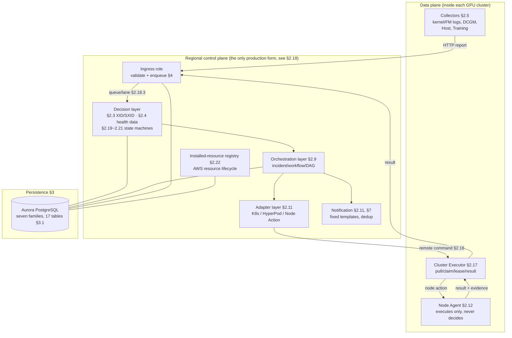
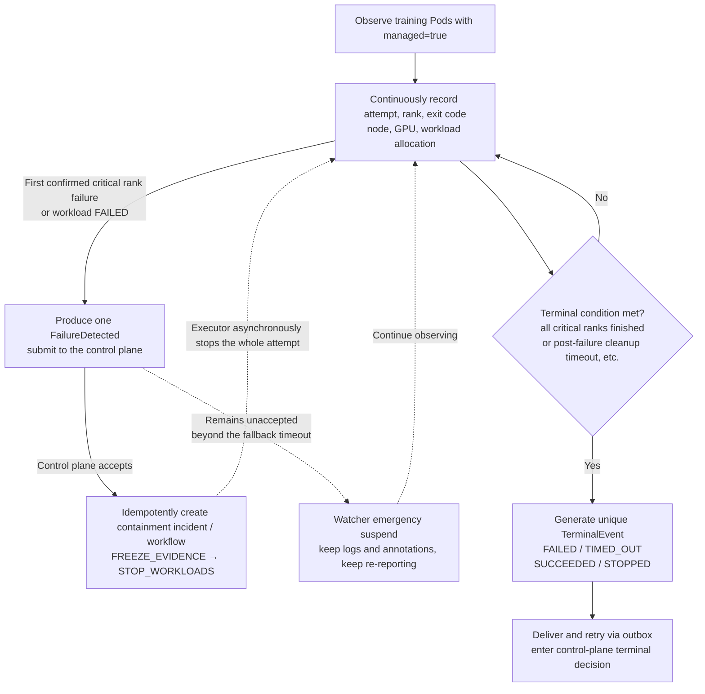
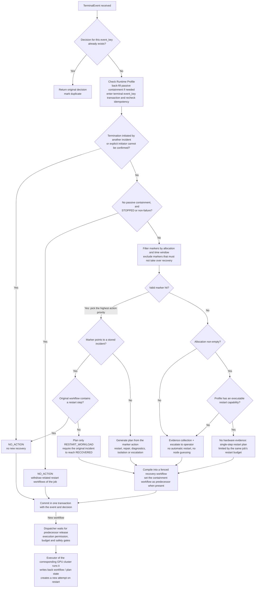
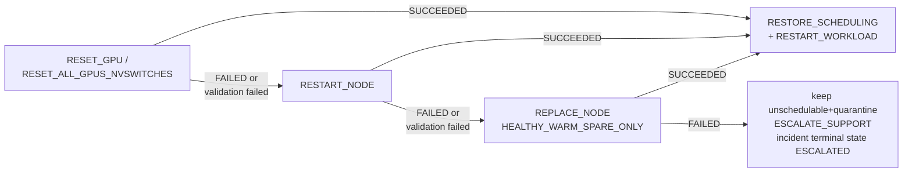
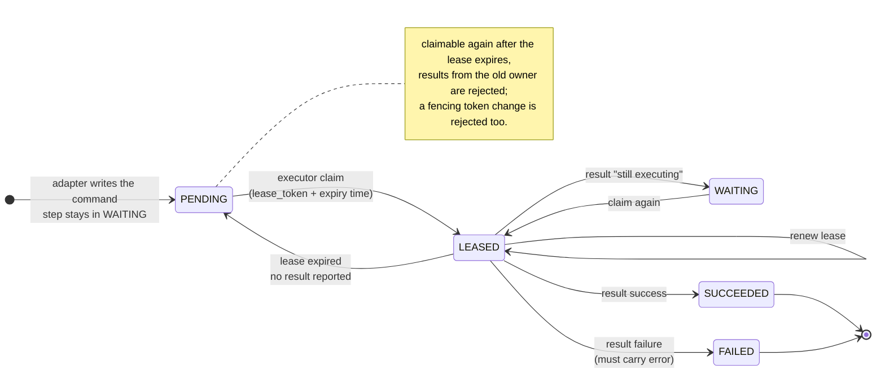
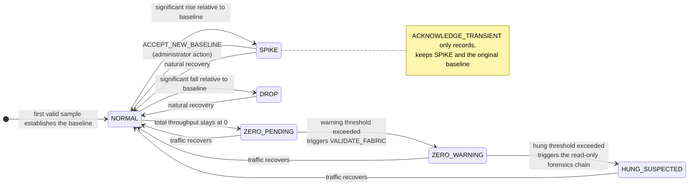
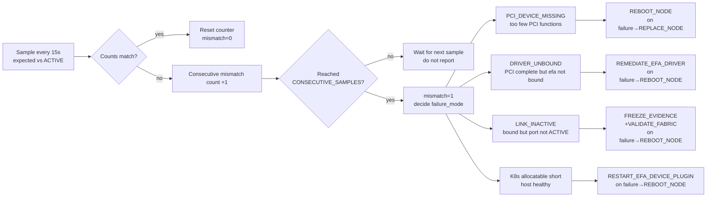
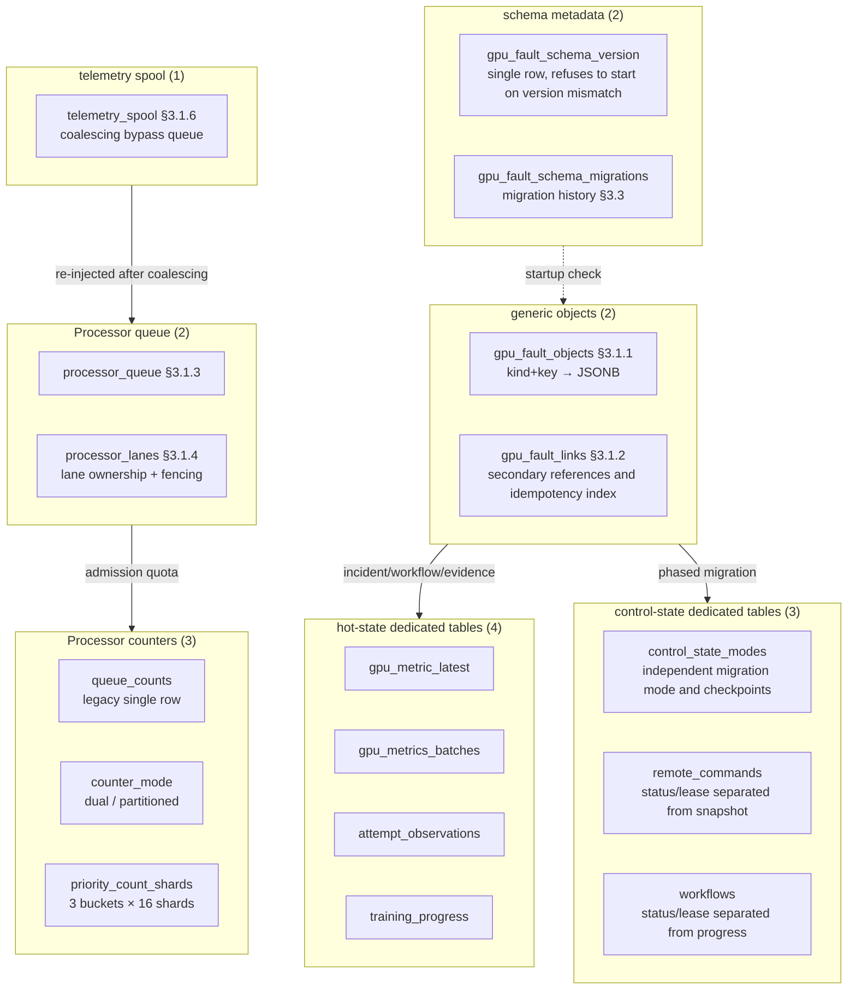

English edition of `docs/详细设计.md`; the Chinese file remains the source of record until both are maintained together.

# GPU Fault Handling System Detailed Design

## 1. Design Baseline

### 1.1 Positioning of This Document and Reading Paths

This is an implementation-level document: it is written for developers who need to change this
code base, and it explains, module by module, the data structures, decision conditions,
state machines, table schemas and interface contracts. It does not repeat the goals, design
trade-offs and hard constraints of the High-Level Design; the division of labour between the two
documents is: **the High-Level Design answers "why it is designed this way", this document answers
"how exactly it is implemented"**.

The recommended reading order depends on your role; there is no need to read from start to finish:

| What you want to do | Suggested reading order |
| --- | --- |
| Build an overall picture first | §1.2 module map → §1.3 lifecycle → §2.18 runtime form |
| Change fault decision rules (XID/SXID/thresholds) | §2.1 domain model → §2.3 XID/SXID policy → §2.4 health data |
| Change collectors or the Node Agent | §2.5 collectors → §2.12 Node Agent → §2.16 remote command protocol |
| Change recovery actions or workflow orchestration | §2.3.1 action ladder → §2.9 workflow → §2.11 adapter |
| Change database tables or migrations | §3.1 table schemas → §3.3 migration and consistency → §3.2 retention and cleanup |
| Change the API or authentication | §4 API design (§4.5 auth buckets and loopback identity) |
| Change deployment, cluster join/remove or uninstall | §2.2 capability compilation and manifests → §2.22 installed-resource registry → §2.23 administrator CLI and deployment assets → Developer Deployment Implementation |
| Diagnose a production problem | §1.3 lifecycle → §2.18 runtime form → §7 logs and metrics |

Two conventions apply throughout the document: first, **every comparison of action strength uses
only the single action ladder of §2.3.1**; no module defines its own ordering; second, **every
path that involves a destructive action is fail-closed**: missing evidence, an identity mismatch
or an expired lease always refuses execution rather than letting it through.

### 1.2 System Layers and Module Map

The system has four layers: collection and execution inside the GPU cluster, decision and
orchestration in the regional control plane, persistence, and external interfaces.
The diagram below maps modules to the sections of this document and can be used as an index
for the whole text.



Figure 1-1 Module map and section index

The administrator CLI and release kernel on the deploy host (§2.23) are not part of the runtime
diagram: they change the four layers above through the execution-token route of §4 and the
Kubernetes/AWS APIs, and take no part in fault decisions themselves.

Two points that are easy to misread: **decisions happen only in the control plane**; neither the
collectors nor the Node Agent on the data plane make policy judgements (the Node Agent does not
even know why it is being asked to reboot); **the control-plane Adapter never connects to nodes
directly**; every action that lands on a node must go through the remote command protocol of
§2.16, be pulled by the in-cluster executor, and then be executed against the target by the local
Adapter inside the executor.

### 1.3 The Complete Lifecycle of One Fault

<a id="proactive-fault-sequence"></a>

The diagram below uses XID handling triggered by the kernel log in the regional production form
as an example and expands asynchronous acceptance, decision, scheduling, remote execution and
wrap-up. It is not a fixed "XID → node reboot → training recovery" template; whether an action is
needed and which branch is taken are decided by evidence and policy. Signals such as metrics and
host logs have their own Finding entry points and must not be treated as the same request model
as the XID decision. A simplified main flow is shown in
[High-Level Design §5.1](high-level-design.md#proactive-fault-overview).

```mermaid
sequenceDiagram
    autonumber
    participant C as GPU Collector
    participant I as CPU API / Ingress
    participant W as CPU Worker<br/>Processor / rules / orchestration
    participant S as Aurora<br/>queue and state store
    participant D as CPU Dispatcher<br/>workflow engine
    participant E as GPU Cluster Executor<br/>local Adapter
    participant T as Kubernetes / Node Agent<br/>or HyperPod

    C->>I: report kernel fault log
    I->>I: authenticate, bind cluster, admission checks
    I->>S: persist ProcessorRequest
    S-->>I: enqueued
    I-->>C: HTTP 202 + request_id<br/>confirms enqueue only, not that handling is complete
    Note over I,W: the enqueue receipt and worker consumption are asynchronous<br/>consumption does not depend on the client receiving 202
    W->>S: claim request by priority and lane lease
    W->>W: replay business routing locally<br/>normalise, correlate evidence and apply policy decision
    alt waiting for accompanying evidence
        W->>S: save PENDING_CORRELATION and correlation deadline
        Note over W,S: no action orchestrated this time; the periodic correlator decides after the deadline<br/>the original Processor request may complete first
    else a remediation decision can be made
        W->>W: generation check, event dedup and workflow arbitration
        alt no new action needed / reuse existing remediation
            W->>S: record NO_ACTION or link to existing incident/workflow
        else formal remediation can execute
            W->>S: atomically create incident + workflow(PENDING) + event index
        else only safety remediation possible / execution conditions missing
            W->>S: create SAFETY_PENDING safety workflow<br/>or BLOCKED record
        end
    end
    W-->>D: wake up scheduling (periodic scan as fallback)
    W->>S: save Processor handling receipt<br/>event handling complete does not mean workflow complete
    Note over W,D: marker, policy result and notification are persisted on their own paths<br/>not one large transaction spanning the whole flow

    opt an executable workflow exists
        D->>S: check predecessors and node conflicts, claim workflow lease and resource budget
        D->>D: pre-check reboot budget after claim<br/>when exhausted, only the reboot step is withheld
        Note over D,E: schedulable: PENDING / RUNNING / SAFETY_PENDING<br/>SAFETY_PENDING or safety_only executes safety steps only; BLOCKED does not execute
        loop each ready step or mergeable batch
            D->>D: verify fencing, permissions and step preconditions
            alt control-plane local step
                D->>D: local Adapter performs evidence capture, sample validation or support escalation
            else GPU cluster remote step
                D->>S: RegionalRemoteWorkflowAdapter<br/>idempotently create/reuse RemoteActionCommand
                Note over D,S: while a new command is incomplete the proxy returns WAITING<br/>the CPU does not operate GPU nodes directly
                E->>I: claim this cluster's commands via the API
                I->>S: atomically claim command lease, verify cluster and version
                I-->>E: command, lease, fencing and execution context
                E->>E: verify Fleet, scope, single Adapter and barrier
                E->>T: local Adapter executes or queries the action<br/>Node Agent requests must be signed
                T-->>E: completed result or still in progress
                E->>I: report SUCCEEDED / WAITING / FAILED
                I->>S: save remote receipt (independent of workflow progress commit)
                D->>S: read the persisted remote result
            end
            alt WAITING
                D->>S: save in-workflow waiting progress and step record under the lease
                D->>D: suspend dependent steps, keep waiting within the time limit
            else FAILED
                D->>D: compensate by failure class, escalate branch/successor or hand to manual handling
                D->>S: save failure/compensation progress<br/>conditional joint commit when a terminal state is needed
            else SUCCEEDED
                alt successful step carries a node rebind
                    D->>S: jointly save workflow / incident under current ownership condition
                else ordinary progress
                    D->>S: save step progress under the lease<br/>ordinary progress usually updates the workflow only
                end
                D->>D: advance subsequent steps or DAG branches
            end
        end
        opt workflow reaches a terminal state
            D->>S: jointly save workflow / incident under ownership condition
            Note over D,S: when the incident has been taken over by a successor, only the original workflow is saved<br/>step records belong to the workflow, not a third table updated atomically on its own
        end
        opt terminal state committed
            D->>S: terminal hooks retire applicable markers, record notifications, etc.
        end
    end
```

Figure 1-2 Detailed sequence of a proactive fault from asynchronous acceptance to workflow wrap-up

The participants in the diagram are a division of responsibilities; one column does not
correspond to one separate Deployment:

| Participant | Corresponding component or implementation | See |
| --- | --- | --- |
| GPU Collector | The kernel log collector on the GPU node | §2.5 |
| CPU API / Ingress | `gpu-fault-api-ha`, responsible for authentication, admission, enqueue and the remote command API | §4, §2.18 |
| CPU Worker | `ProcessorCoordinator`, the business processors, `GpuFaultPolicyEngine` and `IncidentOrchestrator` inside `gpu-fault-control-worker` | §2.3, §2.9, §2.18.3 |
| Aurora | The Aurora PostgreSQL used by the control-plane `PostgresStore`, holding the queue, workflows and remote commands; not the node-side SQLite ledger | §3 |
| CPU Dispatcher | `WorkflowDispatcher` and `ProductionWorkflowExecutor` inside the same `gpu-fault-control-worker`, not an extra Deployment | §2.9, §2.18 |
| GPU Cluster Executor | `gpu-fault-cluster-executor` inside the target GPU cluster and its local Adapter | §2.11, §2.17 |
| Kubernetes / Node Agent / HyperPod | The actual execution target selected per operation; not one unified service, and not all three called in turn for every step | §2.11, §2.12, §2.16 |

Key semantics and implementation basis:

1. **The three completion points differ**: the Ingress `202` only confirms enqueue; the Processor
   handling receipt only confirms handling of this event; only the workflow terminal state means
   that workflow has ended, and successor workflows may still continue.
   `PENDING_CORRELATION` may end the current request first and wait for the correlator to decide. The basis is
   `app/middleware/dispatch.py::dispatch_processor_request`,
   `processor/coordinator.py::ProcessorCoordinator._execute` and
   `app/ingest/faults.py::FaultIngestionService.ingest_xid` (all under `src/gpu_fault/`).
2. **A decision need not produce a new action**: event dedup, reuse, `NO_ACTION`, safety remediation and `BLOCKED`
   cannot be collapsed into "a formal workflow is always created and executed". `safety_only` still constrains
   the executable steps after the state enters `RUNNING`; permissions cannot be judged from the state name alone. The basis is
   `IncidentOrchestrator.ingest`, `IncidentOrchestrator._build_workflow`
   and `workflow.executes_safety_steps`.
3. **Adapters split into a proxy and an actual executor**: the control-plane
   `RegionalRemoteWorkflowAdapter.execute` creates or reuses a command and returns `WAITING` while it is incomplete;
   the cluster Executor claims the command via the API, and `CommandDispatch.execute` then selects the local Adapter.
   The Executor never connects to Aurora directly, and the CPU never holds a GPU kubeconfig.
4. **There is no single transaction spanning the whole chain**: creating the incident, workflow and event index can be committed atomically;
   remote receipts, ordinary workflow progress, markers and notifications each have their own commit boundary.
   `ProductionWorkflowExecutor._save_leased` usually saves only the workflow;
   `_save_leased_state` and `_save_terminal` jointly save both only while the incident still belongs to the current workflow,
   otherwise only the original workflow is saved, to avoid overwriting the successor's remediation.
   Step records are embedded in the workflow, and terminal hooks run after the terminal state is committed.
5. **Failure is not unconditional escalation**: by failure class it enters compensation, an escalation branch, a successor workflow or manual handling;
   when execution conditions are missing it fails closed and guarantees neither automatic isolation nor automatic recovery. When the legitimate reboot budget is exhausted only the
   reboot step is withheld and other approved repair steps may continue; when identity or context verification fails, this continue-executing rule does not apply.

### 1.4 Version and Package Entry Points

This document corresponds to `gpu-fault-control-plane 0.10.0`; notifications, the persistent registry,
deployment identity, monitoring and retention periods were partially re-verified on **2026-09-15**;
all other facts defer to the released source, the generated manifests and the test contracts. The package entry points are:

| Command | Entry point |
|---|---|
| `gpu-fault-api` | `gpu_fault.api:run` |
| `gpu-fault-collector` | `gpu_fault.collectors_cli:main` |
| `gpu-fault-node-agent` | `gpu_fault.node_agent:run` |
| `gpu-fault-restore-gpu-services` | `gpu_fault.node_agent:restore_gpu_services` |
| `gpu-fault-agent-config-digest` | `gpu_fault.node_agent:print_config_digest` |
| `gpu-fault-completion-watcher` | `gpu_fault.completion_controller:main` |
| `gpu-fault-hyperpod` | `gpu_fault.hyperpod_cli:main` |
| `gpu-fault-fleet` | `gpu_fault.fleet_cli:main` |
| `gpu-fault-cluster-executor` | `gpu_fault.cluster_executor:main` |
| `gpu-fault-cluster-executor-readiness` | `gpu_fault.cluster_executor:readiness_probe` |
| `gpu-fault-node-installer-reconciler` | `gpu_fault.node_installer_reconciler:main` |
| `gpu-fault-store-migrate` | `gpu_fault.store_migrate:main` |
| `gpu-fault-aurora-credential-refresh` | `gpu_fault.aurora_credential_refresh:main` |
| `gpu-fault-config` | `gpu_fault.config_cli:main` |
| `gpu-fault-admin` | `gpu_fault.admin.cli:main` |
| `gpu-fault-workload-annotate` | `gpu_fault.workload_annotate_cli:main` |
| `gpu-training-submit` | `gpu_fault.training_submit_cli:main` |

`gpu-fault-api` is the local development entry point; its listen address is controlled by
`GPU_FAULT_API_HOST` / `GPU_FAULT_API_PORT`. The production Deployments do not call this
console script; they run
`uvicorn gpu_fault.app:create_app --factory` directly, explicitly with
`--no-proxy-headers` (the loopback identity decision relies on the directly connected peer, see §4.5). The same wheel splits, according to
`GPU_FAULT_SERVICE_ROLE`, into three role processes, ingress/worker/spool-worker, across three Deployments;
ports and replica counts are given in §2.18.1.

## 2. Module Design

This chapter is ordered by data flow, not alphabetically by package name: first the language shared by all modules (§2.1 domain model,
§2.2 capability compilation), then decision (§2.3–§2.4), collection (§2.5–§2.8), orchestration and execution
(§2.9–§2.12), peripheral services (§2.13–§2.15), the regional protocol (§2.16–§2.17), the runtime form
(§2.18), and finally the three independent continuous state machines (§2.19–§2.21).
The AWS resource source of truth for production deployment and uninstall is covered separately in §2.22; it does not take part in fault decisions, but shares the Store and the authentication boundary with the regional control plane.
The administrator CLI and release kernel on the deploy host are covered separately in §2.23.

The three state machines get their own sections because they differ from the earlier "one event → one decision" model: they
make stateful decisions over **continuously observed quantities**, each needs its own baseline, debounce counters and state-transition rules, and they
produce a finding only on a state **transition**.

### 2.1 Domain Model `src/gpu_fault/models.py`

`StrictModel` sets `extra="forbid"`; all API inputs reject undefined fields. The key enums are as follows:

- Environment: four values, `eks/hyperpod-eks/hyperpod-slurm/kubernetes`; bare `ec2`/`slurm` are no longer legal
  values and are rejected at parse time -- no decision branch consumes them, and a value that loads but silently takes the default path is worse than a missing one.
- RecoveryAction: no action, isolate, drain, stop/restart workload, reset, reboot, replace, diagnostics, quarantine.
- WorkflowOperation: subdivides recovery actions into executable steps.
- CapabilityMode: `OWN/DELEGATE/AUGMENT/OBSERVE/DISABLED`.
- IncidentState: `DETECTED/ACTION_PENDING/SAFETY_PENDING/QUARANTINED/RECOVERED/ESCALATED`.

`TerminalEvent.event_key` is fixed as:

```text
{cluster_id}/{attempt_id}/TrainingAttemptTerminal
```

A repeated terminal state returns the original decision and sets `duplicate=true`.

TerminalEvent also carries `restart_budget`. `RestartBudgetState` uses
`cluster_id + job_id` as its key and stores the immutable budget, the number of reservations already made, and the idempotent reservation ID.

### 2.2 Capability Compilation `src/gpu_fault/capabilities.py`

`compile_runtime_profile()` performs:

1. Filter out `DISABLED` claims.
2. Detect duplicate claims for destructive capabilities.
3. Reject `AUGMENT` for destructive capabilities.
4. Require `OWN/DELEGATE` to specify an Adapter.
5. Determine from observed capabilities whether the owner is available.
6. Degrade to `OBSERVE` when unavailable, and execute no action.

A Profile must first be registered via `POST /v1/runtime-profiles`; the `runtime_profile_version` in an event must be found in the Store.

Release classification uses a normalized Profile policy digest: it ignores `cluster_id/profile_version` and sorts
`claims/observed`. Switching a template to an immutable snapshot or reordering YAML fields does not change that digest, and therefore
does not trigger a `FULL` rollout; the raw source/template SHA is used only for audit and for migrating old release state.

The regional bootstrap's `bootstrap-cleaned` is a hard recovery boundary: automatic cleanup scales the CPU/GPU
Deployments to 0 and clears the completed-cluster progress. When the same deploy command is run again, it must not reuse the old
`resume_phase` or treat a 0-replica Deployment as CPU-ready; it must redeploy the CPU control plane,
then continue from the NLB, DNS/TLS and GPU data-plane gates.

Regional upgrade writes `preflight`, artifact upload, schema, registry, CPU, data plane and verify
progress into the release state. When the high-level deploy sees the same uncommitted release in `failed` or at any persisted
upgrade checkpoint, it must enter resume rather than reclassify as NOOP based on the current partial objects. An explicit
`resume` rebuilds the retry diff from persisted state and checks it item by item against the release ID, the original diff and the execution plan;
it must not omit the diff and fall back to the default `FULL`, otherwise an unchanged PostgreSQL schema would be misjudged as an upgrade.
`rolled-back` and `complete` are terminal states and do not reuse old transaction checkpoints.

previous captures only the surfaces where mutation may occur according to the execution plan. Canonical JSON is deterministically gzip-compressed and written into
immutable, content-addressed ConfigMaps of at most 512 KiB per chunk; the main release state keeps only the digest, the raw/compressed
sizes and the chunk references. All read entry points transparently hydrate and verify chunk by chunk; the old inline format remains compatible. Component
`STARTED/FAILED` is persisted immediately; components within the same GPU action are first batch-updated in memory and then share a single
checkpoint write. `COMPLETED` is merged to disk by the next phase or cluster checkpoint.

Before upgrade begins, `executor_internal_error_total` is also written into the previous snapshot. Post-release verify
rejects only increases of that counter relative to the baseline, which both preserves the audit and 24-hour retention of terminal commands and does not let
already-audited historical errors permanently block later releases; when the baseline is missing it is still treated as 0 and fails closed.

The release manifest carries its own `schema_version` (1–4, `load_release_artifacts()` in
`src/gpu_fault_release/regional_release_config.py`): from v2 on, each component's `module_digest` must be a lowercase SHA-256;
from v3 on, `parse_delivery_identity()` must additionally be able to parse the delivery identity, locked images and node template
digest; v4 is the current release form, requiring `image_layout: split-v1`, plus separate `executor` and
`node_dependencies` image identities (the latter containing three SHA-256 values: wheelhouse, dependency lock, tools lock), and
the runtime/executor images each carry exactly one component and must match that wheel's `wheel_sha256`/`module_digest`;
any missing piece is a `ReleaseError`. Relative paths of wheels/bundles in the manifest are resolved against the checkout or source
snapshot **containing the manifest** (`containing_repository_root()` in `src/gpu_fault_release/__init__.py`, anchored on
the two directories `deploy/control-plane/regional` and `scripts`), not against the running engine's own
`ROOT`: join-cluster runs the engine in-process inside the operator's checkout, and if resolution followed the engine root, `VERIFIED` would
fail to find `dist/<release-id>/` in its own tree and roll back an already successful release.

Where locked images are checked: when `RegionalRelease` is constructed, `resolve_release_image()`
(`regional_release_config.py`) compares environment variables such as `GPU_FAULT_RUNTIME_IMAGE` against the manifest's locked images --
when unset or identical to the locked reference/source reference, the locked value is taken; same digest with a different reference adopts the environment reference; a different digest raises
`ReleaseError` at the construction site, with a message that gives both references and the remedy ("run the site's bound CLI, or deploy this
release first"); there is no deferred "record the conflict now, check later" validation. The only exemption is
`drain-cluster`, which publishes only the registry and reads no image: `IMAGE_LOCK_EXEMPT_MODES = {"drain-cluster"}` in `rollout.py` lets that mode
be served by `RegistryDrainContext` without constructing a `RegionalRelease`, so when uninstall is run from a checkout ahead of the deployment,
its drain is not blocked by the image lock, while modes that apply or verify images
(deploy/upgrade/plan/verify/remove-cluster, etc.) still fail closed. The `--cluster-id` selector is normalized by
`regional_release_arguments.validate_cluster_arguments`: every mode except `drain-cluster` takes exactly
one cluster id; duplicates or empty values are rejected outright.

### 2.3 XID/SXID Policy `src/gpu_fault/policy/`

The default XID policy is loaded from the in-package `data/nvidia-xid-catalog-610.generated.yaml`. SXID is loaded from
`data/nvidia-fabric-manager-sxid-2025-11-14.yaml`, which pins the 92 codes of the NVIDIA
Fabric Manager User Guide Tables 21-24. Both kinds of `mapping_version`
consist of the policy name and the first 16 characters of a digest: XID uses the digest of the canonical generated artifact, SXID uses the pinned
upstream digest. The XID loader verifies the pinned upstream digest, the 172/95/32 entry counts and
`metadata.generatedSha256`; hand-edited rules cannot keep the old policy version.

XID decision order:

1. Check whether the XID exists in the pinned Catalog.
2. Check the GPU product family.
3. Check the minimum driver branch and the reported CUDA version.
4. Prefer the XID 154 dynamic recovery action.
5. Decode IntrInfo/Error Status for XID 144-150.
6. Handle special semantics such as the XID 45 companion, XID 48/63/64, and 94/95.
7. Map to `NO_ACTION/RESTART_WORKLOAD/RESET_GPU/REBOOT_NODE` or the official workflow.
8. When unknown or evidence is insufficient, set blocked/site safety; do not pose as an official NVIDIA action.

Before executing any action, XID first checks the pinned Catalog's `products`. Specific SKUs map to
Catalog product-family columns: H200/GH200 → H100, B200/B300 → B100,
GB200/GB300 → GB200. When the product column does not match, `NOT_APPLICABLE` is returned and the Catalog action is not executed.
Key generation boundaries in the current pinned table:

- XID 74 and 80 are A100/H100 only; XID 136 is H100 only, so they do not apply to the B/GB series.
- XID 126–135, 139, 144–150, 155, 159–166 and 170 are B100/GB200 only,
  so they do not apply to H100/H200/GH200.

The sets above have targeted regressions, and the full Catalog matrix cross-checks every rule/product column.

The `Fatal/Non-fatal` classification of a known SXID must agree with the pinned Catalog; on conflict it is
`BLOCKED_MISSING_EVIDENCE`, only diagnostics are collected and the node is isolated, with no reset/reboot. The
`Access/Trunk` in the log body is only raw evidence and cannot authorize a recovery action. SXID requires an explicit fatal
classification and a trusted access/trunk scope. An `UNKNOWN` scope is first resolved by
`NvSwitchPortTopologyService`, which queries trusted
`nvswitch_port_topology` telemetry from the last five minutes, matched exactly by node, switch ID and port. When multiple data sources
conflict, records are stale or the identity is incomplete, it continues to fail closed. Third-generation single-baseboard H100/H200/H20
has no trunk link; an ordinary `FATAL` with an explicit port may be completed to
`ACCESS` using that platform topology constraint. B200/B300 do not enter the legacy SXID flow.

Fabric Manager SXID messages apply only to Hopper and earlier GPUs. The runtime uses the same product-family
normalization: B100/B200/B300 fold into B100, GB200/GB300 fold into GB200; both
Blackwell families return `NOT_APPLICABLE` and do not enter the SXID Catalog action. A product that is explicitly provided but
whose generation cannot be recognized returns `BLOCKED_MISSING_EVIDENCE` and must not be guessed as Hopper. A missing product field
is still handled along the compatibility path, but production collectors must report the real product.

The SXID Catalog action mapping is as follows:

- Ordinary `FATAL`: a trusted `ACCESS` executes a reset of the participating GPU, a trusted `TRUNK` executes a full
  GPU/NVSwitch reset of this node; when the scope is untrusted, isolate.
- `10003/19084`: independent of the log scope, requires a complete inventory/partition and then executes a full
  GPU/NVSwitch reset of this node.
- Table 23 `ALWAYS_FATAL`: the official semantics are restart host or SBR/service VM; HyperPod
  bare metal maps to `RESTART_NODE` and does not pose as a full-fabric reset.
- `11004/12028`: `RESTART_VM` applies only to shared NVSwitch/vGPU; HyperPod bare metal
  stays blocked.
- `20012`: mechanical connection check; `10004/10005`: cooling or thermal status check.

A repeated request with the same `event_id` returns the existing decision. Cross-source correlation among Fabric Manager, kernel and DCGM requires the same node and error code, and requires an intersection when both sides carry GPU UUIDs or PCI BDFs.

At load time the NVLink catalog verifies that every pattern is 32 characters of `0/1/-` and that errorStatus is a
hexadecimal list; a malformed catalog prevents the process from starting.

### 2.3.1 DCGM/XID/SXID Training Attempt Identity and Cross-Type Arbitration

The current version adopts the constraint "one GPU node runs at most one managed training attempt at a time".
The control plane queries the `AttemptObservation` records persisted by the Completion Watcher for `RUNNING/PENDING` attempts on the event's node within the last
120 seconds. Only when the candidate set contains exactly one
`job-id + attempt-id` is the identity source marked
`SOLE_ACTIVE_ATTEMPT_ON_NODE` and automatic cross-type aggregation allowed. Zero candidates are marked
`NO_ACTIVE_MANAGED_ATTEMPT`; multiple candidates are marked `AMBIGUOUS_ACTIVE_ATTEMPTS`; neither guesses
the training job or enters cross-type aggregation. An explicit event identity must still agree with the AttemptObservation.

The aggregation key is `cluster-id + job-id + attempt-id`, and does not include the metric name, XID/SXID code or
action. DCGM metrics enter arbitration only on the `new_findings` state edge; the same finding from continuous scrapes
does not create incidents repeatedly.
`GPU_FAULT_MULTI_NODE_AGGREGATION_WINDOW_SECONDS` serves as both the cross-node and the cross-type quiet
period; every merged, not-yet-executed event refreshes the workflow's `not_before`. After expiry, if the same
`cluster_id` still has `PENDING/LEASED` processor requests, the dispatcher defers claiming the workflow;
the fixed `aggregation_max_deadline` waits at most another
`GPU_FAULT_PROCESSOR_DRAIN_MAX_WAIT_SECONDS` (default 30 seconds), after which it force-releases to avoid
starvation caused by continuous telemetry. Other clusters and completed requests do not affect that workflow. The action priority is:

```text
RUN_DIAGNOSTICS < RESTART_WORKLOAD < RESET_GPU < RESET_ALL_GPUS_NVSWITCHES
< RESTART_NODE < DRAIN/QUARANTINE < REPLACE_NODE
< CHECK_MECHANICALS/ESCALATE_SUPPORT
```

This ladder is the single global ordering of action strength; cross-type arbitration, workflow merging, preemption and failure escalation all use it
for comparison, and no module keeps its own copy.

Only GPU-class `NodeHealthFinding` records that carry a metric name and whose policy source is DCGM/NVIDIA GPU Memory Error Management
enter this fault group. Ordinary node-health findings for CPU, file system, network and so on
continue to use independent workflows, so that alerts close in time but without a causal relationship are not merged by mistake. Every raw event and
piece of evidence is still stored separately; arbitration unifies only the incident and the final workflow.

The control plane also checks the current workflow state of that attempt:

- `PENDING` and not yet claimed: a higher action upgrades in place; the same action merges; a lower action
  only links the event and evidence.
- `RUNNING`: the same or a lower action is not executed again; a higher action creates a successor with
  `predecessor_workflow_id`.
- The Dispatcher does not execute the successor before the predecessor enters `SUCCEEDED/FAILED/BLOCKED`.
- When a terminal workflow receives an old-attempt event with the same or a lower action, it does not re-execute; a higher action
  creates a successor.
- After the attempt ID changes, a new aggregation key is used. Through the `restart_attempt_id` persisted in the
  `RESTART_WORKLOAD` step execution, the control plane links the new attempt precisely to the old workflow that triggered it;
  `PENDING/RUNNING/SAFETY_PENDING` workflows are linked to the ongoing recovery by the same `cluster-id + job-id`.

The Completion Watcher reports in `AttemptObservation.started_at` the earliest `status.startTime` among all Pods of the current attempt,
falling back to `metadata.creationTimestamp` when the field is missing. The control plane uniformly selects the actual fault occurrence time by
`source_event_time > observed_at > collected_at > ingested_at`.
When `started_at` is later than the event time, the event belongs to the previous attempt generation:

- When the candidate action level is less than or equal to the current recovery workflow, only link the event/evidence to
  the original incident and append a fixed audit reason containing both timestamps, the attempt ID and the action level; do not create,
  update or re-execute a workflow.
- When the candidate action level is strictly higher, create a successor with the current recovery workflow as predecessor.
  Even if the predecessor is already terminal, keep that dependency to form a complete audit chain.
- When `started_at` is untrusted, no recovery workflow for the same job can be found, or the event time is not earlier than the attempt start time,
  do not apply time-based ignoring; keep the original fail-safe handling.

This generation fence also runs on the fast-return path where the provider has already correlated the incident, so that the correlation window does not swallow
a strictly escalating event prematurely.

When the event time is later than the new attempt's `started_at`, the event belongs to the current generation and cannot be ignored just because the old
workflow's action level is higher. If the previous-round workflow for the same `cluster-id + job-id`
is still `PENDING/RUNNING/SAFETY_PENDING`, the control plane keeps the new event's own incident, action and
attempt-id, creates an independent workflow, and writes the previous-round workflow into
`predecessor_workflow_id`. The Dispatcher executes the new workflow only after the predecessor enters
`SUCCEEDED/FAILED/BLOCKED`. This rule implements execution serialization and takes no part in the action-downgrade
decision: for example, when a current-generation XID 11 arrives after a running `RESTART_NODE`, XID 11's
`RESTART_WORKLOAD` is not ignored, but must wait for the `RESTART_NODE` workflow to reach a terminal state.

Serialization by `cluster-id + job-id` covers only two events of the same training job. An idle node has no job,
and findings reported by the host collector carry no trusted job attribution, so another layer of job-independent
per-node exclusive serialization is needed; see 2.9.1. Both layers apply at once, and the first predecessor hit wins.

This constraint does not yet support running multiple training jobs in parallel on the same GPU node. Supporting that scenario in the future requires adding the full
`GPU UUID -> host PID -> cgroup/container ID -> Pod UID -> job/attempt` ownership chain;
the node-unique attempt inference cannot continue to be used.

XID 45 is not decided as solo immediately in the request thread. The control plane first writes the event and a
`PENDING_CORRELATION` decision to the shared Store and waits for the Catalog's fixed 30-second
companion window to close. All replicas can observe the pending record, but only the replica that acquires the PostgreSQL
advisory-lock lease can finalize it. Correlation requires the cluster, node and GPU identity to agree:
GPU UUID is compared first, PCI BDF when it is missing; when both are missing it fails closed and does not correlate. When both sides have a
boot ID it must also agree. If a companion is found after the window closes, XID 45 reuses the primary XID's incident
and workflow; only when none is found is `RESTART_FM` generated. The event, the pending state, the lease and the final
decision are all persisted, so an API Pod restart or a request landing on a different replica does not lose the correlation.

If the policy still returns `PENDING_CORRELATION` after the companion window closes, the coordinator finalizes it as
`BLOCKED_MISSING_EVIDENCE` with an attached `QUARANTINE` safety action and completes the correlation
lease, avoiding endless retries.

XID 154 uses the same shared-Store correlation lease. The raw kernel text is parsed only when it explicitly matches
`GPU recovery action changed ... to 0xN (<label>)`, and the allowed labels are fixed to
`None`, `Drain P2P`, `Drain and Reset`, `GPU Reset Required` and
`Node Reboot Required`; an unknown or missing label must be `BLOCKED_MISSING_EVIDENCE` and must not be guessed from
the hexadecimal value alone. Correlation requires the same cluster, node, GPU UUID/PCI BDF, boot ID and the 30-second window.
When XID 144-150 decodes to `XID_154_EVAL`, it waits for the window to close: if an XID 154 exists the dynamic action is executed;
only if none exists is the Catalog fallback `RESTART_APP` executed. When the primary event arrives before XID 154,
no wrong workflow is created early either; when the window closes, the primary is finalized first, then XID 154 is linked to the same
incident, avoiding a double reset/reboot.

The production normalizer for XID 144-150 parses along the kernel message boundaries defined by the NVIDIA Catalog:
it inspects only the parenthesized payload after the current XID number and before the next XID, and requires the parentheses to contain exactly seven
32-bit hexadecimal registers. The first register maps to `intr_info`, the second maps to
`error_status`; the remaining five debug data values are kept in the raw evidence. The parser accepts
1-8 digit hexadecimal values with `0x`, as well as fixed eight-digit hexadecimal values without a prefix, and fields may be separated by spaces or commas.
When the payload is short, a value exceeds 32 bits, it sits after another XID or the format is ambiguous, no field is guessed; the policy returns
`BLOCKED_MISSING_EVIDENCE` and quarantines. This extraction logic is shared by the Kernel and
Fabric Manager normalization entry points (three in total).

Dedicated actions in the Catalog that already have production adapters compile directly into precise workflows:

- `CONTACT_SUPPORT -> ESCALATE_SUPPORT`, with no unauthorized reset or reboot.
- `CHECK_MECHANICALS -> FREEZE_EVIDENCE -> CHECK_MECHANICALS`. This action is a manual investigation;
  it does not automatically cordon or stop a healthy workload; the step sends a fixed-template notification and waits for the
  `gpu-fault.io/mechanical-inspection-complete=<incident_id>:<fencing_token>`
  annotation. Any subsequent reset/reboot must be another explicit workflow with new fencing.
- `UPDATE_SWFW -> MARK_UNSCHEDULABLE -> [STOP_WORKLOADS] ->
  QUIESCE_GPU_SERVICES -> VERIFY_NO_GPU_CLIENTS -> UPDATE_SOFTWARE_FIRMWARE ->
  RESTORE_GPU_SERVICES -> validation/restore`. Blocks when the target version, command or SHA-256 is missing.

XID 74 uses the fixed register table of the NVIDIA Catalog `WORKFLOW_NVLINK_ERR`. The Kernel
normalizer extracts all `0x...` fields after the XID number and must obtain exactly seven registers; hexadecimal digits in the PCI BDF
do not take part. The link identity is extracted only from an explicit `Link N` or
`NVLink N` field in the raw message; guessing it from the GPU UUID, PCI BDF or node position is forbidden. The control plane applies this table only to
the Hopper family (H100/H200):

- The first, third, fourth and fifth registers are classified by official bit as safe, secondary, ECC/parity,
  mechanical/hardware, marginal channel, fabric reset or corrected threshold.
- The control plane keeps permanent count state in the shared Store keyed by
  `(cluster, GPU UUID/node PCI BDF, Link, register, bit)`;
  the event ID is the idempotency key. PostgreSQL uses a transaction advisory lock, SQLite uses
  `BEGIN IMMEDIATE`; multiple control-plane replicas cannot double-count.
- When a bit that needs a "same link/repeated" decision lacks an explicit Link identity,
  `BLOCKED_MISSING_EVIDENCE` and fail closed; the former GPU-level repetition proxy is not used.
- A non-zero second, sixth or seventh register, any undefined bit, or all seven registers zero: no guessing; compile into the
  evidence/support flow.
- Only safe-ignore and corrected-threshold bits: `MONITOR_ONLY`, training is not stopped.
- An ECC/parity bit on the same Link and same register bit is only monitored on the 1st and 2nd occurrence; on the 3rd
  (`count > 2`) it enters diagnostics and `RESET_GPU`; no direct support before the reset succeeds.
- `report_if_repeated` enters diagnostics and `RESET_GPU` on the 2nd occurrence;
  `field_diag_if_repeated` on the 2nd occurrence sequentially runs the diagnostics bundle, the NVIDIA Field Diagnostic and
  reset. The policy and the workflow must both contain the recovery action; generating only an evidence step is not allowed.
- mechanical/hardware on the 1st occurrence directly executes isolation, quiesce, no-client verification and
  `RESET_GPU`, not letting a manual inspection block a recoverable action; the 2nd occurrence is treated as persistent and adds the
  diagnostics bundle and Field Diagnostic before the reset. Only when it persists after reset/reboot does it enter manual hardware inspection or support.
- marginal-channel executes isolation, Field Diagnostic, `RESET_GPU`, quarantine and
  support, and restores the workload on healthy capacity;
  production-unexpected and secondary-only go directly to support.
- The official semantics of bit 18 of the fourth register are fabric reset. An ordinary XID event does not carry a complete local
  NVSwitch partition inventory, so it stays isolated and sends support, and is never downgraded to a single-GPU reset.
- Although A100 is within the XID 74 product range, the pinned catalog explicitly defines these registers as valid for Hopper;
  A100 events do not apply the Hopper bit decoder.

The diagnostics bundle additionally includes `nvidia-smi nvlink --errorcounters` and `nvidia-smi topo --matrix`; the manifest
stores the Link ID, bit counts, the seven registers, the decoding reason, PCI BDF, policy version and raw
evidence reference.
Direct support uses the fixed `xid74-support-zh-v2` mail and does not reuse the "automatic recovery chain exhausted" template.
`RUN_NVLINK74_WORKFLOW` is generated when the official Field Diagnostic condition is met, carrying the Link ID,
registers and counts; the production Runtime Profile must configure a real owner for `nvlinkDiagnostics`,
otherwise the workflow stays safety pending. The production owner is `gpu-fault-node-agent`:

- The Node Agent executes only administrator-preinstalled absolute-path commands and does not embed or download the NVIDIA Field
  Diagnostic.
- The executable's SHA-256 is verified at Agent startup; the command does not go through a shell, and only the three placeholders
  `{link_id}`, `{gpu_uuid}` and `{pci_bdf}` are allowed.
- `RUN_NVLINK74_WORKFLOW` uses the link-specific command; row-remap failure uses the separate
  `RUN_FIELD_DIAGNOSTIC` and the `memoryDiagnostics` capability. Memory diagnostics do not require a Link
  ID and do not pass an empty value off as a Link ID.
- The operation remains protected by signature, fencing token, allowlist, command TTL and the idempotency ledger.
- Before execution, both NVML compute clients and `/dev/nvidia*` device clients are checked; if any client
  exists, it fails and the Field Diagnostic is not started.

The production owner of `mechanicalInspection` is the Kubernetes adapter. It reads the Node annotation
`gpu-fault.io/mechanical-inspection-complete`, whose value must be the current
`<incident-id>:<fencing-token>`. When it does not match, the step stays `WAITING`; an old incident's confirmation
cannot be reused. This capability is for events where the Catalog explicitly gives `CHECK_MECHANICALS`; the XID 74
mechanical/hardware branch is reset-first and does not create a preceding manual inspection. Later escalations that need a manual inspection
stay quarantined after the Field Diagnostic or automatic recovery fails and enter the fixed support flow.
When the mechanical inspection first enters `WAITING`, it sends the
`xid74-mechanical-zh-v1` fixed-template to-do mail; the notification and delivery result are idempotent per incident
and are not generated by a large language model.

### 2.4 Health Data Processing

#### 2.4.1 GPU Metrics `gpu_metrics.py`

Supports temperature, power, utilization, memory, ECC, retired page, row remap, PCIe, NVLink, violation and XID. Counters compute deltas against the baseline in the Store; a counter reset does not produce a negative increment. PCIe replay further computes a per-minute rate from the timestamps of consecutive samples.

The temperature policy prefers the device limits that the collector reads via `nvidia-smi -q -x`:

| Parameter | Default |
|---|---:|
| GPU warning margin | 5 C below slowdown/max-operating |
| GPU shutdown margin | 3 C below shutdown |
| HBM warning margin | 5 C below memory max-operating |
| GPU fallback warning/critical | 85/90 C |
| HBM fallback warning/critical | 90/95 C |
| Thermal violation consecutive escalation | 2 increasing samples |
| PCIe replay rate warning | `>8/min` |
| NVLink error delta critical | `>=1` |

The DCGM XID gauge only establishes a baseline on its first reading; only later value changes produce an XidEvent, and repeated identical values do not re-alert.
row-remap uses the correctable/uncorrectable remapped-row fields; on environments such as H200 the aggregated
`DCGM_FI_DEV_NVLINK_ERROR_DL_CRC/RECOVERY/REPLAY` fields are preferred. The collector treats
`N/A`, empty values and fields the device does not support as missing and does not coerce them to 0.

A GPU metric finding stores `policy_source`, `policy_version`,
`policy_reference`, `official_action` and `automatic_action`. The control plane preserves these fields when converting to
`NodeHealthFinding` and incident:

- NVIDIA DCGM Health warnings go to diagnostics.
- NVIDIA DCGM Health errors use `DRAIN`: stop the affected jobs, isolate, collect the diagnostic bundle and
  validate the GPU; never reset or replace on the authority of a single raw counter.
- Pending row remap uses the controlled reset workflow.
- Row-remap failure uses drain/quarantine; only after NVIDIA Field Diagnostic validation can it
  proceed to the RMA/replacement decision.
- Device temperature limit derivation rules use `SITE_NVIDIA_DEVICE_LIMIT_DERIVED`; reaching the device operating limit
  uses `DRAIN`, and the fixed temperatures serve only as the `SITE_DCGM_METRIC` fallback when the read fails.
- The first thermal violation increase goes to diagnostics; once consecutive increases reach the configured count it escalates to `DRAIN`.
- When a finding escalates from warning to critical or its automatic action changes, a `new_finding` is emitted again so that the existing
  attempt workflow can escalate in place or create a successor.

The diagnostics for a GPU/HBM temperature warning are not a passive metric read. The control plane generates
`FREEZE_EVIDENCE -> RUN_DCGM_DIAGNOSTIC -> VALIDATE_GPU`; the Node Agent runs the non-destructive
`dcgmi diag -r 1 -j` and writes the raw JSON, stderr, SHA-256 and result status to the root-only evidence directory.
`PASS/WARN` enters cooldown observation; while the warning still exists within
`GPU_FAULT_TEMPERATURE_WARNING_GRACE_SECONDS` (default 120 seconds) validation
stays `WAITING`, and succeeds once it clears. On `FAIL/INCONCLUSIVE`, or when the warning still exists after the observation period ends,
the original workflow fails and idempotently escalates to `DRAIN`: mark unschedulable, stop the affected jobs, isolate the node, collect the full
diagnostic bundle and validate the GPU. This escalation does not include `RESTORE_SCHEDULING` or `RESTART_WORKLOAD`; recovery is only possible after
the fault clears and an administrator has handled it.

DCGM JSON parsing uses bounded structured processing: at most 100 results, each with at most 20 messages of at most 512 characters, are
written into the workflow; the full stdout/stderr is kept only in the evidence file. Each result contains
`test_name/status/entities/error_codes/messages/result_path`. Remediation guidance comes from a fixed rule table,
with no large-model call:

| Action code | Matched category | Fixed remediation direction |
|---|---|---|
| `THERMAL_COOLING_INSPECTION` | thermal/temperature/cooling | Keep drained; inspect airflow, fans, heatsinks, ambient temperature and device temperature limits |
| `NVLINK_NVSWITCH_INSPECTION` | NVLink/NVSwitch/fabric | Inspect link counters, topology and Fabric Manager logs |
| `PCIE_AER_INSPECTION` | PCIe/AER | Inspect the PCIe link, AER, replay counters and mainboard connections |
| `GPU_MEMORY_FIELD_DIAGNOSTIC` | memory/ECC/row-remap | Collect memory evidence and run the configured NVIDIA Field Diagnostic |
| `DRIVER_DCGM_REMEDIATION` | deployment/DCGM/driver/software | Check version compatibility and services; repair through the controlled software maintenance workflow |
| `GPU_CLIENT_DRIVER_CHECK` | context/permission | Check GPU clients, permissions, driver and container runtime |
| `GPU_FIELD_DIAGNOSTIC` | SM/compute/stress | Collect a bug report and run the NVIDIA Field Diagnostic |
| `DEEP_DIAGNOSTIC_REVIEW` | unrecognised test | Keep drained; review the evidence manually and run deep diagnostics |
| `DCGM_EXECUTION_REVIEW` | non-zero exit or unparseable JSON | Check `dcgmi`/hostengine and stderr, then re-run diagnostics |

The `diagnostic_findings`, `recommended_actions`, `evidence_ref` and SHA-256
returned by the Node Agent, together with the control-plane action, are written to the step execution. The incident reasons after a diagnostic-failure escalation
store both the evidence URI and the fixed guidance. Each diagnostic also generates one idempotent
`dcgm-diagnostic-zh-v2` mail whose fields come entirely from the structured result and the rule table above.

#### 2.4.2 DCGM Metric Correlation Analysis State Machine

Single-metric findings keep their existing thresholds and NVIDIA/site provenance. After each batch completes its single-metric updates,
the control plane reads the related active findings and latest metrics by `cluster + node + GPU UUID/PCI BDF`
and runs the `SITE_DCGM_CORRELATION` state machine within the event time window. The default window is 45 seconds; state is persisted
under the key `composite:<rule-id>`, storing active/clear, consecutive count, severity and action.
Repeated samples do not re-trigger; a warning escalating to critical or a change of action produces a new state edge.

| Rule ID | Required correlated signals | Conclusion and action |
|---|---|---|
| `THERMAL_STRESS` | GPU/HBM temperature finding + thermal violation or thermal throttle bit | Diagnostics first; `DRAIN` after 2 consecutive hits by default |
| `POWER_LIMIT_THROTTLING` | power violation + power usage reaching the configured ratio of the limit + high utilization + no temperature finding | Power-limit context, diagnostics; does not directly rule hardware damage |
| `GPU_MEMORY_DEGRADATION` | DBE/uncorrectable remap + pending/failed repair or pending retired page | `DRAIN`, Field Diagnostic/RMA evidence |
| `PCIE_XID_LINK_FAILURE` | PCIe replay rate finding + XID 32/79 on the same GPU | `DRAIN` and retain the combined PCIe/XID evidence |
| `NVLINK_LINK_DEGRADATION` | at least two kinds of NVLink error finding on the same GPU | `DRAIN` and run link/fabric diagnostics |
| `MULTI_GPU_NVLINK_FABRIC_FAILURE` | at least two GPUs on the same node with NVLink error findings | Generate one node-level composite and `DRAIN` |
| `CORRECTABLE_MEMORY_DEGRADATION` | at least two of SBE, retired SBE page and correctable row-remap increasing at the same time | Diagnostics first; `DRAIN` after 3 consecutive hits by default |

Thermal slowdown uses the software/hardware thermal slowdown bits `0x20/0x40` of
`DCGM_FI_DEV_CLOCK_THROTTLE_REASONS`. `SM_CLOCK` and `MEM_CLOCK` serve only as performance-impact context; a low clock on its own may come from
GPU idle, application clocks or a power cap and does not produce a thermal finding.

violation-class counters carry a **dimensional plausibility gate**. The semantics of these fields is "microseconds spent in the violating state",
so the per-minute increment cannot exceed one minute; `MAX_PLAUSIBLE_VIOLATION_US_PER_MINUTE`
is `60_000_000 × 1.05` (the extra margin absorbs sampling skew). After the delta crosses the threshold, `_throttle_decision`
first checks the rate: when it exceeds this upper bound **no finding is produced**, because the counter claims a violation
duration longer than the elapsed time, which shows it is not in this unit on this machine, and an uninterpretable quantity cannot serve as a criterion.
This gate is necessary rather than conservative: a thermal violation crossing the bound 2 consecutive times escalates to `DRAIN`,
so letting an uninterpretable rate through here would **evict a healthy node**. The power finding path
(`POWER_LIMIT_THROTTLING`) does not add this gate: it already requires the power/limit ratio and high
utilization to hold at the same time, and adding the gate would only drop true positives.

GPU validation treats `gpu_temperature_c`, `memory_temperature_c`,
`thermal_violation_total_us`, `clock_throttle_reasons` and
`composite:THERMAL_STRESS` as one thermal cooldown set. Only when every active
finding in the set is Warning does it return `WAITING` within the grace period; if any finding escalates to Critical,
a finding of another category appears, or the grace period expires without clearing, it immediately returns `FAILED` and triggers the existing
`DRAIN` escalation. This way the first thermal throttle cannot bypass the consecutive-sampling state machine.

Corrected-memory counters use the positive increment between adjacent samples, not the cumulative absolute value, so old errors are not misjudged:

- `ecc_sbe_volatile_total`, `ecc_sbe_aggregate_total`: Warning once the increment reaches the configured value.
- `retired_pages_sbe_total`: Warning after a new corrected-ECC retired page.
- `row_remap_correctable_total`: Warning after a new correctable remap.
- `retired_pages_dbe_total`: Critical/DRAIN after a new uncorrectable-ECC retired page.

The first three Warning classes and `CORRECTABLE_MEMORY_DEGRADATION` use the separate
`GPU_FAULT_TRANSIENT_GPU_WARNING_GRACE_SECONDS`. Within the grace period they stay `WAITING`, waiting for the next
full scrape to clear the transient delta; validation fails when the consecutive threshold is reached and escalates to Critical, another fault mixes in, or the grace period
expires without clearing. All of the above thresholds and automatic escalations are configurable site policy,
`policy_source=SITE_DCGM_METRIC/SITE_DCGM_CORRELATION`, and are not declared as official NVIDIA RMA
thresholds.

After a composite hit, the original component findings continue to be stored and participate in validation, but their
`new_finding` for this round is marked in `suppressed_finding_ids` and they do not each create a workflow. Only the composite
finding enters attempt aggregation and highest-action arbitration. The composite stores the rule ID, component finding
IDs, metrics, evidence URI, affected GPUs and confidence; the policy source is fixed to
`SITE_DCGM_CORRELATION` and is never declared as an official NVIDIA composite policy. XID/SXID/host events are still aggregated by the existing
attempt-level cross-source arbitration; this state machine does not infer a common root cause that the rules have not proven merely from temporal proximity.

Exporter raw metrics cannot fully replace the subsystem and error code returned by `dcgmi health`;
this module marks NVIDIA provenance only for rules that can be reliably reconstructed from the fields according to NVIDIA documentation.

#### 2.4.3 Host Health `host_health.py`

Collects and evaluates CPU/load, MCE, memory, OOM, file systems, Lustre, NIC, RDMA/EFA, service status and log patterns. Findings are converted to markers and enter a separate `SITE_NODE_HEALTH` incident.

The host collector only reads InfiniBand devices whose driver is `efa`; mlx5 and other RDMA devices do not enter the EFA
count, traffic or error baselines. The BMC status `nc` means non-critical and is not counted in
`bmc_critical_sensor`; only `cr/critical/nr/non-recoverable` are counted. The SMART device scan ignores
blank lines and records that are not `/dev/*`.

SMART conclusions are cached per drive for 300 seconds, but `smartctl --scan-open` re-enumerates every cycle, so
a swapped or newly attached disk does not have to wait for the cache to expire. The cache covers only queries that actually obtained a conclusion: when `smartctl -H` cannot run
or its output cannot be parsed, this round emits `smart_health_failed=1` with `failure_mode=QUERY_FAILED`,
does not open a cache window, and retries immediately in the next cycle; otherwise a single parse failure would freeze "this disk's health is unknown"
for 300 seconds. A smartctl that returns normally but gives no PASSED/FAILED conclusion does not count as a failure and may be cached.

A single node log message can match several rules at once. The policy first picks the highest severity by `FATAL > CRITICAL > WARNING > INFO`,
then picks the stronger action by the global RecoveryAction rank; on a complete tie it keeps the more specific rule that appears earlier in the rule table. Therefore a single line containing both OOM text and an EFA fatal is ultimately ruled an RDMA
critical quarantine, not the memory warning that matched first.

#### 2.4.4 Training Health `training_health.py`

Each rank heartbeat contains step, throughput, loss, numerical error and checkpoint. Detects:

- heartbeat timeout;
- no progress after the startup grace;
- step regression;
- step lag relative to peers;
- throughput ratio too low;
- `numerical_error=true`.

State transitions are deduplicated by a persisted signal key, so multiple API replicas do not produce the same active finding twice.

### 2.5 Collectors `src/gpu_fault/collectors/`

`HttpEventSink` submits structured events to the control plane. Network errors, 429 and 5xx get bounded retries; other 4xx fail immediately.

The current implementation has 8 Collector classes (the four sub-packages `gpu/`, `host/`, `logs/`, `cloud/` plus
`training_progress.py`), counted by implementation type without double-counting multiple logical channels of the same process:

| Collector | Input | Output API |
|---|---|---|
| KernelLogCollector | `/dev/kmsg` | `/v1/collector-events/nvidia-kernel` |
| FabricManagerLogCollector | Fabric Manager log file/journal | `/v1/collector-events/fabric-manager` |
| DcgmMetricsCollector | Prometheus endpoint | `/v1/collector-events/gpu-metrics`, `/v1/collector-events/gpu-inventory` |
| NvidiaSmiMetricsCollector | `nvidia-smi` CSV | `/v1/collector-events/gpu-metrics`, `/v1/collector-events/gpu-inventory` |
| HostTelemetryCollector | `/proc`, `/sys`, commands | `/v1/collector-events/host-telemetry` |
| NodeLogCollector | journal and files | `/v1/collector-events/node-logs` |
| KubernetesNodeResourceCollector | Node `status.allocatable` (single replica per cluster) | `/v1/collector-events/host-telemetry` (GPU/EFA allocatable reported as host samples) |
| TrainingProgressCollector | application JSON | `/v1/training-progress` |

`GPU_INVENTORY` is a second logical channel inside the GPU metrics collector process (
`src/gpu_fault/collectors/gpu/discovery.py::deliver_gpu_inventory`), not a separate
collector process. The log collectors (kernel, Fabric Manager) additionally report periodically to
`/v1/collector-events/collector-health`, so that the control plane can distinguish "no fault" from
"collection is dead" even during event-free periods. The systemd units enabled by default on each node, the cluster-level replica counts and the items disabled by default are listed in the production-status column of High-Level Design
§4.2.

The `gpu_fault.collector_sinks` entry point registers two sinks: `http` (`HttpEventSink`) and
`sqs` (`SqsEventSink`). The public CollectorContext fields include cluster, profile, GPU
product, driver, CUDA, workload and checkpoint.

#### 2.5.1 Collector-Side Edge Filtering and GPU Identity Snapshot

The DCGM collector maintains metric baselines and a bounded rolling history on the node side. The first sample establishes the control-plane baseline; afterwards
a full batch is sent only on error counter growth/reset, XID change, temperature/retired page/row-remap/power candidates entering
or recovering, consecutive confirmation samples, and the periodic health summary. Fault-candidate batches carry the most recent
`GPU_FAULT_DCGM_HISTORY_MAX_POINTS` history points. The control-plane processor applies latest-wins merging to telemetry of the same node that has not yet been claimed; neither the node-side filtering nor the merge directly produces recovery actions, and the final finding
and workflow are still decided by the versioned control-plane policy.

The GPU identity inventory does not depend on the DCGM edge filter above. By default the node metrics collector additionally runs a read-only
`nvidia-smi --query-gpu=index,uuid,pci.bus_id,name` every 60 seconds and always sends a structured snapshot via
`/v1/collector-events/gpu-inventory`. The snapshot contains node, boot ID,
GPU index, UUID, PCI BDF and product model; Aurora keeps only the latest value per `cluster_id + node_id`.
When an XID log carries only a PCI address, the control plane uses this snapshot to fill in the GPU UUID; when an SXID needs to participate in a GPU set it uses
the same snapshot. The snapshot is valid for 180 seconds by default and the event boot ID must match the snapshot; if it is missing, expired
or the boot does not match, the path fails closed. The old `gpu_metric_latest` identity mapping serves only as a compatibility
fallback during rolling upgrades and is no longer the normal path. Before executing a reset, the Node Agent still re-reads the live local inventory and checks the
target set, so the control plane's identity snapshot cannot bypass the data plane's final safety gate.

A DCGM edge candidate is delivered only once it reaches the confirmation count consecutively; a one-off candidate and its recovery are both suppressed,
while hardware counter changes are still delivered immediately. The previous value and the candidate streak have configured upper bounds so that state does not grow without limit after a device
generation change. Host edges likewise deliver only new appearances, recoveries and the periodic summary; a persistent identical edge is not
rewritten to the control plane every 15 seconds.

When violation-class counters participate in candidate decisions, the duty cycle is computed first (increment in microseconds ÷ sampling interval in microseconds),
and only crossing `GPU_FAULT_DCGM_VIOLATION_DUTY_CYCLE_THRESHOLD` (default 0.05) counts as a candidate.
When the duty cycle is above `DUTY_CYCLE_MAX_PLAUSIBLE` (1.05) it **does not participate in edge decisions**, and a WARNING is logged once for that
device/field: a violation duration cannot be longer than the elapsed time, and exceeding it shows that the field is not in microseconds on this
machine. This gate directly prevents a class of silent missed detections: on production H200s,
`DCGM_FI_DEV_POWER_VIOLATION` advances at about 1.125e9 ns/s even when fully idle, so the duty cycle is permanently out of bounds,
and every card locks into a confirmed candidate within about `GPU_FAULT_DCGM_EDGE_CONFIRMATION_SAMPLES` samples after start-up;
a confirmed candidate is announced only once at the transition, after which **real power throttling
can never again produce a delivery edge**. Refusing to grade an uninterpretable duty cycle both preserves debouncing and prevents an unreadable
counter from masking the fault it should have exposed. `GF-REGIONAL-COLLECT-002` is the live-hardware criterion for this gate.

#### 2.5.2 Delivery Semantics: Retry-After, Backoff and Outbox

The collector HTTP client interprets the server's `Retry-After` as the minimum wait time:

```text
delay = Retry-After + small_jitter
```

Only when that header is absent does it use the exponential backoff range. The User-Agent version comes from the package version, currently
`gpu-fault-collector/0.10.0`.

Each collector subcommand uses its own bounded NDJSON outbox. Records whose 429/5xx or network retries are exhausted are marked
replayable; after the latest live event succeeds, a batch of at most 10 records and at most 5 seconds is first resubmitted synchronously. If that batch had
successful records and a backlog remains, the same sink starts exactly one background worker that keeps resubmitting within the same bounds, without waiting for the
next collection cycle; it stops on a round with zero successes and waits for a later successful live delivery to wake it again. Live events do not wait for the
background worker; permanent rejections such as 400/403/413 are marked as non-replayable dead-letters for audit. By default each file
holds at most 1000 records, at the path `/var/lib/gpu-fault/outbox/<collector>.ndjson`.

### 2.6 Completion Watcher

`watcher.py` provides the runtime-neutral state machine; the Kubernetes-side implementation is split by responsibility into twelve `completion_*.py`
modules: `completion_controller.py` keeps only the `KubernetesCompletionController` host class (reconcile
pass, `resume_tombstoned_attempt`), `controller_from_environment` and the console script entry `main`;
`completion_pod_parsing.py` (label/annotation constants, Pod → Observation parsing),
`completion_workload_stopper.py` (`KubernetesWorkloadStopper`, emergency suspend), `completion_liveness.py` (progress budget, `note_progress`), `completion_delivery.py` (attempt delivery,
failure containment, overdue emergency stop), `completion_reconcile_loop.py` (list/watch loop,
`run_watch_cycle` debounce); `completion_observation.py` (workload object reads and `WorkloadVerdict`,
`MissingAttemptTracker`, `TerminalObservationCache`: a terminal observation distinguishes the two sources "read from Pod status" and "inferred from Pod
absence", and the latter can be evicted by a Pod that appears later); `completion_attempt_state.py` (`AttemptSpec`,
recovery and eviction of persisted attempts, `publish_coverage_heartbeat`) and `completion_attempt_store.py`
(the spec and Pod identity of active attempts persisted to the separate `<outbox-name>-active` ConfigMap, storing no log snapshots/
restart counts and not sharing capacity with critical events); `completion_outbox.py` (`KubernetesCompletionOutbox`: provides
write-ahead records for failure-detected/terminal deliveries) and `completion_outbox_records.py` (the pure functions for its
ConfigMap document merging and capacity); `completion_metrics_server.py` (the Watcher's own `/metrics` +
`/healthz`). The logger name uniformly borrows `gpu_fault.completion_controller`, so log lines are byte-identical before and after the split.

Semantics of the write-ahead outbox: the two critical deliveries `/v1/attempts/failure-detected` and `/v1/attempts/terminal`
are first written to `events.json` in ConfigMap `<outbox-name>` and then delivery is attempted; delivery failures are replayed by `replay`. Permanent rejections
(the control plane's negative ruling on the event) enter quarantine; only ordinary records whose retryable failures persist beyond `DEFAULT_MAX_RETRY_AGE_SECONDS`
(default 24 hours) are recorded as `expired`, counted and deleted, and expired records are not described as still-replayable quarantine.
When capacity is short, the oldest quarantine records are evicted first to make room for new critical events; records still being retried are not discarded for this purpose;
`--replay-quarantined` is the operator entry for a one-off controlled replay of quarantine records and does not start the watch loop; a WAL write
failure and record expiry both do not equal successful delivery. Routine attempt state lives in the second object `<outbox-name>-active`, because of the
ConfigMap per-object 1 MiB limit: when both share one place, the routine state of N running Pods can squeeze terminal events out so they can no longer be written.
The Watcher's `/metrics` exports `gpu_fault_completion_watcher_*` (reconcile failures/counts, outbox depth and
quarantine depth, eviction/expiry counts, coverage heartbeat, progress budget); `/healthz` fails only when not a single pass has completed within the whole delivery budget
(`progress_stall_budget_seconds`), and stays green on idle clusters, during slow passes and during API server
outages.

Attempt states:

```text
PENDING -> RUNNING -> FAILURE_DETECTED
                    -> TERMINAL_FAILED/TIMED_OUT
RUNNING -> TERMINAL_SUCCEEDED/STOPPED
```

ContainerObservation aggregates by Pod UID, container and rank. Allocation completeness:

- `MISSING`: no node information for any critical container.
- `INCOMPLETE`: insufficient rank count, or node or GPU UUID missing.
- `COMPLETE`: the critical rank count reaches the expected value and all have node/GPU UUID.

The first failure produces exactly one `FailureDetectedEvent`; the
`FREEZE_EVIDENCE` / `STOP_DISTRIBUTED_ATTEMPT` returned by the Watcher is an intent; on the normal path the control plane compiles it into a
`FREEZE_EVIDENCE -> STOP_WORKLOADS` workflow, and the Executor then stops the whole attempt.
When a terminal condition is met, such as all critical ranks finishing or the post-failure cleanup timeout expiring, a unique terminal event is generated.

When a failure event remains unaccepted by the control plane for longer than
`GPU_FAULT_PASSIVE_STOP_FALLBACK_SECONDS`, the Watcher performs local emergency
containment:

1. Read the training container logs; when available, gzip the current log snapshot and upload it to S3.
2. Write the deterministic passive failure incident, S3 URI, SHA256 and bounded tail
   manifest into the annotations of the existing Pods.
3. Set PyTorchJob `spec.runPolicy.suspend` and Job/JobSet `spec.suspend`
   to `true`.
4. After the control plane recovers or the Watcher restarts, rebuild
   `FailureDetectedEvent.workload_log_snapshots` from the Pod annotations and idempotently re-report the same incident.

The log order is "upload to S3 -> write Pod annotation -> suspend". Continuous archiving of the complete training logs belongs to the
training platform's logging system; this control plane keeps only the snapshot at fault time and the bounded tail.

The Kubernetes Controller identifies training from the following metadata:

```yaml
metadata:
  labels:
    gpu-fault.io/managed: "true"
    gpu-fault.io/job-id: train-123
    gpu-fault.io/attempt-id: train-123-a1
    gpu-fault.io/role: worker
    gpu-fault.io/critical: "true"
  annotations:
    gpu-fault.io/expected-critical-ranks: "8"
    gpu-fault.io/training-container: trainer
    gpu-fault.io/runtime-profile-version: regional-hyperpod-<digest12>
    gpu-fault.io/checkpoint-manifest: s3://bucket/path/manifest.json
```

Pod `restartPolicy: Never` is recommended. The rank of an Indexed Job comes from `batch.kubernetes.io/job-completion-index`; other workloads should provide the rank explicitly.

<a id="passive-failure-containment"></a>

#### 2.6.1 Failure Detection and Containment Flow



`CompletionWatcher.observe` does not treat a non-zero exit from a deliberate deletion, or a termination initiated by another incident,
as an ordinary failure to be contained again. Terminal generation does not wait for the containment workflow to complete; the dashed lines in the diagram only denote asynchronous effects.
Failure cleanup defaults to 120 seconds; the emergency stop timeout of `controller_from_environment` defaults to 30 seconds.
A delivery that is not yet acknowledged as accepted while in the outbox also keeps the emergency stop timer running.
The code basis is `src/gpu_fault/watcher.py::CompletionWatcher.observe` and
`src/gpu_fault/completion_delivery.py::CompletionDeliveryMixin`.

### 2.7 Completion Service `service.py`

<a id="passive-terminal-decision"></a>

Notification mail templates (`src/gpu_fault/notifications/common.py` and the subjects, guidance and drill banners of the individual notification modules) are uniformly in English so that the solution can be deployed by any team; placeholders, field names and JSON keys are unchanged. Template version tags (such as `restart-guard-zh-v2`) keep their historical `zh` lineage: the deduplication key of several notifications embeds this tag, and renaming it would notify every open incident once more, so it is incremented only when template semantics change, not for wording changes. `tests/notifications/test_templates_are_english.py` guards "no CJK text on the notification path".

Terminal handling logic:

1. When a decision for the same event_key already exists, return the original decision and mark `duplicate=true`, without re-attributing the cause.
   Otherwise check the profile; if the attempt has no passive containment incident yet, the terminal state is `FAILED/TIMED_OUT`,
   `workload_ids` is non-empty and the explicit initiator (if any) is not another incident, idempotently create the
   containment incident and the `FREEZE_EVIDENCE -> STOP_WORKLOADS` workflow from the terminal fields (sharing the same event_key with the failure-detected
   event: the first arrival creates, the later one reuses). `STOPPED/SUCCEEDED` creates no containment,
   even when a rank has a non-zero exit code (rule A / PREEMPT-033).
2. Containment back-fill uses a separate idempotent transaction on the failure event_key; then, inside the terminal event_key transaction,
   the decision is checked again and the event, the plan with its incident/workflow, and the decision are saved, avoiding duplicate delivery
   or a second recovery produced by multi-replica races. The legacy "event exists but no decision" state from older versions can get its decision filled in on redelivery.
3. The recovery workflow points to the containment workflow via `predecessor_workflow_id`, and the scheduler guarantees stop-before-start;
   terminal reporting no longer returns 409 because containment is still open, nor does it wait for containment execution to complete.
4. A termination initiated by another incident (`termination_initiator_incident_id` points to something other than this attempt's
   passive containment incident), or an explicit initiator that cannot be found → `NO_ACTION`, no recursive recovery.
5. Without passive containment, `STOPPED` or a non-failure terminal state → `NO_ACTION` and withdraw the related restart
   workflows of that job. Non-failure is judged by `TerminalEvent.is_failure`, which also checks rank non-zero exit codes.
   A `STOPPED` with a passive containment incident for this attempt (with or without an initiator;
   the DESTR-015 tombstone race drops
   that annotation) continues to recover.
6. Within a window of 10 minutes before and after the default terminal time, match markers that are trusted, active, carry a recommended action, are unexpired at `ended_at`,
   and whose node/GPU/fabric scope intersects the allocation. The query is over already-stored records,
   not a wait for the next 10 minutes; once the decision is persisted, a late marker does not trigger a re-decision of this terminal.
   A diagnostic marker (`COLLECT_EVIDENCE` / `RUN_DIAGNOSTICS` / `VALIDATE_NODE`,
   `gpu_fault.markers.marker_is_diagnostic`) that points to a stored incident **does not let that incident own
   job recovery**: it only observes the node and does not repair it, and the terminal decides by the remaining usable markers; only when no
   marker remains does the no-evidence path apply. Skipped markers are not retired here.
   A diagnostic marker not stored to an incident is still compiled via `from_marker` into the diagnostic plan it requests.
   For the remaining markers, if one points to another attempt's incident and that incident's workflow has already `SUCCEEDED`,
   it is retired here so that the previous repair's evidence is not used for this recovery.
7. With markers present, pick the one with the highest action priority.
8. If the stored incident of the selected marker is associated with a workflow containing `RESTART_WORKLOAD`,
   return `NO_ACTION` and do not create a second recovery; otherwise the stored incident takes the `after_incident` path, planning only
   the restart after that incident reaches `RECOVERED`. Only when the incident is not yet stored does the `from_marker` path apply.
9. With no marker and an allocation present, generate the `no-hardware-evidence:RESTART` plan: a single RESTART_WORKLOAD step, with the restart count limited at execution time by restart_budget; when the profile has no WORKLOAD_RESTART it degrades to evidence collection + escalation.
10. When the allocation is missing, generate a `COLLECT_EVIDENCE + ESCALATE_OPERATOR` plan with an empty node list,
    neither guessing nodes nor restarting automatically. This branch checks whether the allocation is empty, which is not the same as checking
    `AllocationCompleteness.COMPLETE`.



The diagram follows the decision order of `src/gpu_fault/service.py::CompletionService`; no new plan is issued to the Executor before
the transaction commits. The plan must still resolve an executable owner through the Profile, otherwise it fails closed.
For the overview see [High-Level Design](high-level-design.md#passive-terminal-overview); for the role interactions see
[the passive-terminal sequence in Detailed Design v2](detailed-design-v2.md#passive-terminal-sequence).

### 2.8 Planner and Passive Compiler

`PlanBuilder` converts markers into a RecoveryPlan and resolves the owner of each step from the Effective Runtime Profile. A typical hardware-action plan:

```text
MARK_UNSCHEDULABLE
COLLECT_EVIDENCE
RESET_GPU | REBOOT_NODE | REPLACE_NODE
VALIDATE_NODE
RESTART_WORKLOAD
```

The Planner expresses only actions and target nodes; the execution parameters of `RESTART_WORKLOAD`
(cluster/job/attempt/GPU count/budget, avoid_node_ids, `requires_incident_state`)
are derived by the Passive Compiler from the terminal event together with `RecoveryPlan.avoid_node_ids` and
`RecoveryPlan.restart_after_incident_id`. `SimulatedRecoveryExecutor`
likewise reads these premises from the plan fields before simulating.

Restart quotas are reserved only in the control-plane preflight `reserve_restart_budgets`; at dispatch
`issue_restart_authorization` reads the reservation back and issues a `RestartAuthorization`, and the data-plane
`_restart_guard` compares the authorization, incident premise, avoided nodes and GPU count.
On budget exhaustion, `withhold_exhausted_restart` withholds that `RESTART_WORKLOAD`:
it pre-writes a FAILED execution record, adds the step to `superseded_step_indexes` and sends the budget-exhausted notification,
without calling its adapter; the other planned steps such as cordon / stop / reset / validate / restore
continue to execute under the safety gates, and the workflow finally ends as `FAILED`. Only a missing, conflicting or illegal restart context
makes `fail_restart_preflight` fail the whole workflow before any adapter runs.
The code basis is `src/gpu_fault/execution/restart_budget_preflight.py`.

Predecessor dependencies only guarantee execution order and do not prove that the predecessor succeeded. Each plan has at most one incident premise:
when this attempt's passive containment exists, the no-evidence restart and marker plans without another premise take that incident
as their premise (a failed containment STOP makes the incident `ESCALATED`, and the guard refuses the restart); `after_incident`
plans still take only their node incident as the premise, and the containment result adds no extra gating.
`_incident_premise` requires `RECOVERED` at execution time; if not yet recovered it waits, and `QUARANTINED`,
`ESCALATED` or an unverifiable state refuses the restart.

`PassiveWorkflowCompiler` maps RecoveryAction to WorkflowOperation. GPU reset
is always compiled as `QUIESCE_GPU_SERVICES -> VERIFY_NO_GPU_CLIENTS -> RESET_GPU ->
RESTORE_GPU_SERVICES`. The Node Agent refuses reset when the same incident has no persisted `QUIESCED` state.

### 2.9 Incident Orchestrator

After a proactive event enters the Orchestrator:

- the incident is reused by `event_id`;
- the official action/workflow is converted into safety steps and official steps;
- `PENDING/SAFETY_PENDING/BLOCKED` is decided from the workload state, allocation and capability;
- the incident and the workflow share the fencing token;
- when a reset operation or its validation fails, it escalates to reboot;
- when a reboot operation or its validation fails, it escalates to a healthy warm-spare replacement;
- when a replacement operation or its validation fails, the node is permanently quarantined and a vendor support ticket record is created;
- a node that has already completed hardware remediation and again shows a DBE/retired page gets a higher remediation level.

The Orchestrator itself does not call node or cloud APIs.

GPU service quiesce is executed by the signed Node Agent. Before stopping services the Agent records the services that were originally active and
creates a systemd transient timer, then stops kubelet, DCGM and Fabric
Manager in reverse dependency order. The timer calls an independent recovery entry point that does not depend on the control plane or kubelet; when a reset, an Agent request or an explicit
restore fails midway, the state file and the timer are kept and retried periodically. Recovery only starts the services that were active before the quiesce,
verifies each one is active, then cancels the timer and deletes the state. Service names and process names use a strict allowlist
format, and all commands are executed through argument arrays.

The H200 code-specific SXIDs `10003/19084` use a dedicated
`RESET_ALL_GPUS_NVSWITCHES` operation. The control plane generates the complete UUID
inventory from recent GPU metrics of the same node and pins the fabric partition to that node's local NVSwitch domain. The Node Agent
re-runs `nvidia-smi --query-gpu=uuid`; the requested set and the local set must be exactly equal, then it once more
verifies that there is no compute/device client, and executes exactly one
`nvidia-smi --gpu-reset` without `-i`. If the inventory is inconsistent before or after the reset, services are not quiesced, or the feature flag
is not enabled, it fails closed. This implementation does not mistake multiple H200 nodes across EFA for the same local
NVSwitch partition.

Ordinary fatal access/trunk SXIDs, code-specific full-reset SXIDs and XIDs on the same attempt
use the same attempt aggregation key: `cluster_id + job_id + attempt_id`
(`IncidentOrchestrator._attempt_group_key`); `official_action` takes no part in grouping, so
access and trunk events, and SXID and XID events, enter the same workflow. The first event compiles the
SXID plan for its node; each later event first compiles the same single-node plan for its own node, then hands it to
`DispositionApplier` to apply the merge ruling, sharing one implementation with the XID family: every new node -- whether its
reset category is the same as the first node's (two trunk, two access) or different (`RESET_GPU` for access,
`RESET_ALL_GPUS_NVSWITCHES` for trunk, `RESTART_NODE` for XID 79), and whether or not the workflow
has already started executing when it arrives -- is attached as a `branch:<node>` DAG branch next to `branch:initial`; the
reset step inside the branch names only this node and carries only this node's GPU, SXID and fabric partition mappings; no
SXID merge ever produces a reset step whose `node_ids` span nodes (the regional executor has no barrier
coordinator, and `CommandDispatch._barrier_hold` holds such a step fail-closed). A higher-rank event for the same
node replaces the plan in place when the plan has not started, and is queued as a successor of that node's branch once it has started;
additional GPUs for the same node and same category only widen the GPU scope of that node's step. Regardless of how many
nodes or how many reset categories, the whole workflow has exactly one `shared` `STOP_WORKLOADS` and one
`join` `RESTART_WORKLOAD`: the join gate opens only after all branches complete reset/validation, and the whole
training job is restarted only once. The incident's `official_action` takes the action with the higher recovery rank; a later
lower-rank event does not downgrade it. Different attempts are never mixed.

All `FATAL/ALWAYS_FATAL` SXID workflows execute
`COLLECT_DIAGNOSTIC_BUNDLE` before drain, stopping the job or reset. The Node Agent uses fixed commands to collect `nvidia-smi -q`,
NVLink status, DCGM level 1, the Fabric Manager journal, the kernel journal and
`nvidia-bug-report.sh`, and produces a manifest with command return codes and a SHA-256 compressed archive. A single failed diagnostic
command is recorded in the manifest and does not prevent the remaining evidence from being written. The archive is published atomically through a temporary file;
the working directory is deleted afterwards. When S3 is not configured, a node-local `file://` reference is returned; production should configure
`GPU_FAULT_DIAGNOSTIC_S3_URI` to form persistent evidence reachable by the control plane.

Driver and firmware remediation does not use a built-in SXID guess table and is not added to the workflow by default. Only after a site explicitly configures
`GPU_FAULT_SXID_DRIVER_REMEDIATION_CODES` or
`GPU_FAULT_SXID_FIRMWARE_UPDATE_CODES` is `REMEDIATE_DRIVER` or
`UPDATE_SOFTWARE_FIRMWARE` inserted between
`VERIFY_NO_GPU_CLIENTS` and the reset. The control plane only sends the signature-covered target version; the node only executes the absolute-path commands configured
at install time. Both the update command and the firmware verification command require SHA-256 pinning, and the command, SHA and target
version are counted into the Agent config digest. Before execution the quiesce state and zero GPU clients are verified again; after execution
the driver requires all GPUs to be on the same major version branch, and the firmware requires the verification command's stdout to equal the target version exactly.
If any check fails, the workflow fails and goes directly to quarantine/support, without continuing to reset or automatic
reboot, because the software or firmware may be in a partially updated state at that point. The node is not returned to scheduling.

The hardware recovery ladder (reset → reboot → warm-spare replacement) first climbs **within the record**:
when one step of a node branch fails, `BranchEscalator` retires the remaining steps of that branch, appends
the next rung and its validation tail to the same workflow, and records a `BRANCH_ESCALATED` event. A single-node plan compiles to a linear record
with no branches; when one of its steps fails and a next rung exists, `DagBrancher.adopt_linear_plan` first grows it in place
into a single-branch DAG (step indexes, completion and execution records unchanged; only dependencies and the `branch:initial`/`shared`
branch identifiers are filled in), then takes the same in-record rung; so single-node and multi-node faults of the same kind produce the same record shape.
Cases that do not change shape and go directly to the whole-record escalation below: the failed step involves multiple nodes, the result is unknown
(flags such as `manual_confirmation_required`), the operation has no next rung, or the cluster remediation budget
cannot accommodate the new rung (branch exhausted, with a reason containing `remediation budget cannot take the next rung`).

While a node is under a reboot/replace initiated by the product itself (a workflow's `RESTART_NODE`/`REPLACE_NODE`
has been dispatched or completed and the following `RESTORE_SCHEDULING` has not completed), newly arriving node-health findings and kernel
log XID/SXID events on that node are signals that this reboot itself explains (XIDs during device teardown, allocatable mismatch before the plugin
comes back, an empty host inventory); `orchestration/reboot_window.py` absorbs them into the incident that owns the node
as evidence (the event is linked to that incident, and no new incident/workflow is opened); a kernel log event that carries
a boot id the node has already left (the Agent has already heartbeated with the new boot, and the event's kernel time is earlier than that heartbeat) is only recorded as a `RECOVERED`
incident and no action is planned. When ownership cannot be decided, the original behavior is kept.

Whole-record hardware recovery escalation is invoked idempotently by the Dispatcher on `FAILED` workflows:

1. `RESET_GPU/RESET_ALL_GPUS_NVSWITCHES` fails: create a `RESTART_NODE` workflow.
2. `RESTART_NODE` fails: create a `REPLACE_NODE` workflow with
   `replacement_strategy=HEALTHY_WARM_SPARE_ONLY`.
3. Replacement only allows a warm spare that has passed the independent health state machine's validation and has been atomically reserved; the managed/provider
   replacement Adapter rejects this strategy.
4. Replacement fails: keep unschedulable/quarantine, execute `ESCALATE_SUPPORT`,
   create a stable ticket ID, persist the fixed-template email and send the administrator notification. The terminal state of this incident is
   `ESCALATED`; it is not marked `RECOVERED`.
5. When one branch of a multi-node job DAG is exhausted (`exhausted_branch_ids` non-empty), the workflow ends FAILED with
   `node branch escalation exhausted: <branch>`, and that reason is also written to
   `terminal_failure_reason`; the subsequent hardware escalation covers only **the nodes of the exhausted branch** -- the other branch,
   even if it once had a FAILED record (for example `RESET_GPU` failed, escalated in place to reboot and already
   `RESTORE_SCHEDULING`), is not isolated again by the support successor incident
   (`HardwareEscalationService._exhausted_branch_executions`).



Figure 2-9-1 Hardware recovery escalation ladder. Each level is triggered idempotently by the Dispatcher on a `FAILED` workflow;
the escalation direction matches the action ladder of §2.3.1, no level is skipped, and no failure falls back to a weaker
action

`KernelLogCollector` is the current production primary collector for SXIDs. NVIDIA's official documentation states that NVSwitch runtime
errors are written by the driver to the OS kernel/event log; the Collector reads the
`nvidia-nvswitchN: SXid (PCI:<BDF>): <code>, <Fatal|Non-fatal>, Link ...`
summary line from `/dev/kmsg` and delivers it to `/v1/collector-events/nvidia-kernel`. The subsequent `Severity` and
`Data` lines of the same error are diagnostic continuation lines and do not create a separate SXID event or workflow. The event keeps the kernel sequence,
boot ID, monotonic timestamp and a `kmsg://` evidence reference.

kmsg **reading and delivery are two stages**: the reader thread pushes records into an in-process bounded queue (2048 entries), and a
delivery thread drains it. The reader thread never waits for delivery -- `HttpEventSink` spends up to about 47 seconds retrying each record
before handing it to the outbox, and the kernel ring keeps overwriting old records during that time -- so backpressure can only land on the queue:
when the queue is full the **oldest** record is dropped and the newest is kept. On SIGTERM the queue no longer drops; instead it is written synchronously into the outbox within the shutdown budget,
and only what cannot be written counts as lost. A delivery thread that dies on its own is counted and replaced; after more than 3 replacements
it is no longer replaced, and the reader thread delivers inline instead.

All losses on the delivery side go into the kernel collector's periodic health summary, appended to
`edge_filter_reasons` as `<name>:<count>`; a counter of 0 does not appear:

| Counter | Meaning |
| --- | --- |
| `delivery_failures` | number of delivery failures |
| `kmsg_overflow` | read losses caused by kernel ring overwrite |
| `boot_time_reestimates` | number of monotonic→wall clock boot time re-estimates |
| `delivery_queue_drops` | kmsg records dropped when the queue was full -- **if this is non-zero, XID/SXID evidence was really lost** |
| `health_summary_queue_drops` | health summaries dropped when the queue was full; what is lost is a liveness report, not fault evidence, so it is counted separately from the previous item |
| `delivery_buffered_at_shutdown` | number of records handed to the outbox at shutdown and replayed later |
| `delivery_dropped_at_shutdown` | number of records that could neither be delivered nor written to the outbox within the shutdown budget; lost |
| `delivery_thread_deaths` | number of times the delivery thread itself died and was replaced |

Every SXID that enters the unified `ingest_sxid()` and completes the policy decision generates one fixed
`sxid-event-zh-v1` event notification. This notification does not depend on the recovery action, so `MONITOR_ONLY`,
`BLOCKED_MISSING_EVIDENCE`, `NOT_APPLICABLE` and executable events are all covered. The Event ID and the template
version form the idempotency key; subsequent mechanical checks, reset, reboot or training restart results use separate emails.

`FabricManagerLogCollector` is the supplementary collector. NVIDIA documentation states that SXIDs can also appear in the FM
clear-text log/syslog, but does not define another independent FM-native SXID text convention; therefore events are formed only for
records matching the NVIDIA SXID convention above. journald mode checks the
`_SYSTEMD_UNIT/SYSLOG_IDENTIFIER/_COMM` allowlist; file mode resumes by device, inode and byte
offset. The default FM configuration's file path is `/var/log/fabricmanager.log` with
`LOG_USE_SYSLOG=0`; actual deployments must read the node's
`/usr/share/nvidia/nvswitch/fabricmanager.cfg`. The node installer reads that configuration when no file glob is passed explicitly;
the file source is enabled automatically only when `LOG_USE_SYSLOG=0`, `LOG_FILE_NAME` is a safe absolute path and the file exists.
Explicit parameters always take precedence.

The format and logging configuration follow the NVIDIA Fabric Manager User Guide:
<https://docs.nvidia.com/datacenter/tesla/fabric-manager-user-guide/index.html#runtime-nvswitch-and-gpu-errors>
and
<https://docs.nvidia.com/datacenter/tesla/fabric-manager-user-guide/index.html#logging-related-config-items>.

NVIDIA kernel and Fabric Manager collector events wake the dispatcher immediately after normalization and the evidence and policy writes complete.
All node-health findings of the same GPU metrics batch
enter the batch entry point at once, preserving in-batch notification and DAG merge context.

The Fabric Manager collector sets no upper limit on journal lines; records after the cursor are processed in their original order.
The cursor/file offset is persisted immediately after each successful delivery or explicit skip; a later record failure only retries the unconfirmed part.
When a file source appears for the first time, or the state is missing or corrupt, only the current device, inode and EOF are persisted as the baseline,
and historical logs from before installation are not ingested; only subsequent appends form events. With existing valid state it continues from the confirmed offset,
using the ISO timestamp as `observed_at`; both the state temporary file and the parent directory are `fsync`ed.
systemd instance units (for example `nvidia-fabricmanager@0.service`) are legitimate sources.

### 2.9.1 Concurrent Events During Execution and Causality Decisions

While a workflow is executing, the collectors keep sampling on their fixed period and keep reporting what they consider problems to the control plane.
A considerable share of these are **caused by the current action itself**: during `RESET_GPU` the GPU count really is not 8,
and after `STOP_WORKLOADS` the training containers really have exited. The control plane **does not infer causality from temporal order**;
temporal proximity may be causality or coincidence. Causality is carried by four layers of **explicit source markers**,
each solving a different problem.

**Layer one: Marker -- freezing "why I acted" at decision time.**
`NodeHealthFinding.marker()` and the policy-side `decision.marker` write a
`NodeMarker` at the same moment the decision is made, containing `marker_id`, `incident_id`, `scope`
(`node_ids` / `gpu_uuids` / `fabric_partitions`), `observed_at` / `expires_at`
(node-health class TTL defaults to 3600 seconds), `recommended_action`, `action_disposition`,
`raw_reason` and `raw_evidence_ref`. Afterwards, any `TerminalEvent` entering
`service._matching_markers` is matched by **scope intersection + time window**: the marker must be
`active` and `trusted`, `recommended_action` must be non-empty, the TTL must not have expired,
`|observed_at - ended_at|` must not exceed `marker_window` (default 10 minutes),
and at least one of node / GPU / fabric partition must intersect that attempt's allocation.
The criterion is scope, not "close in time". A matched diagnostic-class marker (see §Terminal Handling step 4 above) does not make
its incident the owner of job recovery: a WARNING `RUN_DIAGNOSTICS` marker once hung the job's restart gate
on a diagnostic incident that never repaired anything, until the marker TTL expired an hour later.

The marker must be persisted before the incident -- before ingest decides ownership, no observer may
see a faulty node without a marker, so `marker()` can only guess `inc-<event_id>` first.
But ownership does not necessarily equal this guess: node-health grouping (`NODE_HEALTH_GROUP`) and XID
merging fold the finding into an incident that already holds that attempt or that node, and the latter keeps
its own id. Therefore **once ingest obtains the real incident it must re-point the marker to it**
(`add_marker` upserts by `marker_id`, rewriting rather than adding; the SXID, distributed-XID and
node-health paths all do this). A dangling marker `incident_id` is not a bookkeeping blemish:
`CompletionService.handle_terminal` relies on it to read "recovery is already handled by that incident's workflow"
before it returns `NO_ACTION`; if it cannot read it, it opens a second replacement workflow for the same fault;
`markers.marker_blocks_spare` fails closed when it cannot read it, keeping an already recovered node out of the warm-spare pool for the full
TTL.

**Layer two: the Workflow state machine -- who is occupying this machine.**
What decides "can the new event act now" is `status`, `predecessor_workflow_id`,
`fencing_token`, `not_before`, `aggregation_max_deadline`,
`completed_step_indexes`, `execution_owner_id` and `incident.state`.
The Dispatcher's gate is: the workflow is allowed to execute only when `predecessor_workflow_id` is empty, or the predecessor has entered
`BLOCKED/SUCCEEDED/FAILED`.

The serialization key is **node exclusivity**, not `job_id`. A workflow containing the following operations
acquires exclusive possession of the host and therefore blocks later workflows pointing at the same node:

```text
QUIESCE_GPU_SERVICES  RESET_GPU  RESET_ALL_GPUS_NVSWITCHES
RESTORE_GPU_SERVICES  RESTART_FABRIC_MANAGER  RESTART_NODE
REPLACE_NODE  REMEDIATE_DRIVER  UPDATE_SOFTWARE_FIRMWARE
RESTORE_SCHEDULING
```

Serializing by `job_id` alone is not enough: an idle node has no job, and a host telemetry sample carries whatever workload state the collector **happened
to sample**. As soon as two probes disagree about "whose job this is" for the same machine,
each gets an empty `predecessor_workflow_id`, so a reboot may land between
`QUIESCE_GPU_SERVICES` and `RESTORE_GPU_SERVICES`, taking the fail-safe restore
timer with it; or one workflow's `RESTORE_SCHEDULING` puts back into scheduling a node that another workflow is still
resetting. All four entry points (the non-grouped path of `ingest_node_health`,
`_ingest_grouped_node_replacement`, `_ingest_node_scoped_fault`,
`_ingest_grouped_fault`) perform the same check, and the check scope is
workflows in `PENDING/SAFETY_PENDING/RUNNING` that belong to the same `cluster_id` and whose node sets intersect.

**The reverse must also hold: pure forensic and verification workflows do not block.**
Combinations such as `FREEZE_EVIDENCE + VALIDATE_FABRIC` and
`FREEZE_EVIDENCE + MARK_UNSCHEDULABLE + QUARANTINE`
neither possess the host nor care who possesses it; queuing them only ages the evidence
and leaves the node idle for longer. So the criterion is "does it contain an operation from the table above", not "is any workflow running".

Measured behavior when collector events are injected one by one during reset execution (`QUIESCE` completed, `RESET` not completed):

| Collector report | Decided action | predecessor | Occupies node |
| --- | --- | --- | --- |
| `gpu_inventory_mismatch` | `REBOOT_NODE` | the running reset | yes |
| `efa_inventory_mismatch` | `REBOOT_NODE` | the previous reboot (chained transitively)| yes |
| `bmc_critical_sensor` | `QUARANTINE` | empty | no |
| `rdma_link_down` | `RUN_DIAGNOSTICS` | empty | no |
| `filesystem_used_percent` | `QUARANTINE` | empty | no |

**Configurable preemption by a higher-level workflow.**
`GPU_FAULT_ENABLE_WORKFLOW_PREEMPTION` defaults to `true`. Only for the same attempt,
or when neither side has a job and the nodes intersect, does a successor with a strictly higher recovery rank set
`preempt_predecessor=true`. Same rank, lower rank and different jobs all keep the original serial semantics.

Preemption is step-boundary cooperative preemption, not thread termination:

- A remote `PENDING` command not yet submitted can be atomically set to
  `FAILED/status_source=workflow-preempted`.
- A read-only remote `WAITING` can be cancelled; a reset/reboot/replace that is already `LEASED`
  must not falsely report cancellation, because the physical action may be executing. The preemption request remains in effect, and once the command reaches a terminal state the
  lower-level workflow is truncated immediately and its remaining validation/restart chain is not executed.
- When the lower-level reset has not been submitted after QUIESCE, handoff follows the successor action:
  reset→RESET_ALL inherits the node-wide quiesce but re-runs VERIFY on the larger GPU scope;
  reset→REBOOT hands the quiesce state to the successor, and after the reboot the new-generation Agent
  performs a cleanup-type RESTORE; only a successor that cannot take over the quiesce uses the RESTORE fallback.
- The predecessor terminates safely as `SUPERSEDED`. The Dispatcher treats it as predecessor terminal
  but does not trigger failure escalation.

A successor may only inherit a `MARK_UNSCHEDULABLE` and a `STOP_WORKLOADS` that are still valid. The former expires after
`RESTORE_SCHEDULING`, the latter after `RESTART_WORKLOAD`. Inheritance is explicitly persisted through
`completed_step_indexes`, `inherited_step_indexes` and executions carrying
`inherited_from_workflow_id/preemption_reuse`.
Evidence, checkpoint, verify, hardware actions, restore and validation are never inferred as reusable by operation name.

If the incident already points to the successor while the predecessor is executing, the predecessor's terminal-state transaction only updates
its own workflow row and must not write `workflow_request_id` or the incident state back from a stale incident
snapshot. This also fixes the existing pointer race for non-preempting successors.

**Attempt DAG and resource-domain arbitration.**
The same `cluster/job/attempt` has only one set of shared workload steps:
`CHECKPOINT/STOP_WORKLOADS` executes once, independent recovery branches are kept per physical node, and after all branches
converge `RESTART_WORKLOAD` executes once. Branches of different nodes may run in parallel; for the same node only that node's
branch action, scope and step execution state are compared, and the highest rank of other nodes must not take part in the decision.
When reboot and replacement intents differ, the same `WorkflowMergeService` arbitrates; a newly arrived
reboot action must not be applied to the whole node group, thereby downgrading a previously required replacement. The same action may still be aggregated under the existing
conditions, and committed records, authorizations and suppression markers are not overwritten.

The executor re-reads the step range, dependencies and completed/retired indexes on lease renewal and at every observable dispatch boundary,
and does not keep using an old ready list to submit steps that a new plan has withdrawn. Warm-spare rebinding only changes the target of the physical action;
the branch escalation count, exhaustion and candidate identity follow the original branch ownership. The exhaustion operation is idempotent, retires only the exact branch,
and does not cancel independent sibling branches or later-added isolation steps along with it.

When a same-node, same-level `RESET_GPU` targets different GPUs, the GPU set of the same step is widened if the reset has not been submitted;
a submitted command cannot be rewritten, and the added GPUs enter the subsequent recovery phase. Arbitration compares not only rank but also uses explicit
operation dominance: `RESTART_NODE` covers reset/reset-all/fabric-manager restart,
`REPLACE_NODE` covers node lifecycle and GPU runtime repair; quarantine, mechanical checks and support escalation
are not treated as having repaired other fault domains.

The so-called "node exclusivity" is implemented as resource claims rather than a whole-machine global lock:

- `GPU_RUNTIME_MUTATION`: quiesce/reset/driver/firmware/fabric-manager;
- `NODE_LIFECYCLE_MUTATION`: reboot/replace, conflicts with all mutations on the same node;
- `SCHEDULER_MUTATION`: cordon/quarantine/readmission;
- read-only evidence/validation for CPU, memory, disk, EFA/RDMA and NCCL holds no mutation claim
  and may run in parallel with GPU runtime recovery.

The raw evidence continuously collected by the collectors is already persisted before the event arrives. `FREEZE_EVIDENCE` only pins references
and does not re-collect. The shared STOP waits only for evidence freezing, scheduling isolation, and the short in-flight scene capture with explicit
`capture_process_state=true`; ordinary bundles and host/fabric
validation should not block STOP. If the final branch is a `QUARANTINE` with no recovery plan, the not-yet-executed
readmission and shared restart are both marked superseded, and the training job stays stopped.

Different attempts are not serialized by job ID and do not share an attempt DAG. The scheduling premise of this design is that a GPU node
belongs to only one active attempt; if two attempts briefly appear on the same node, it is an invariant violation caused by the old Pod exiting, the new Pod
starting, delayed events or a scheduling misconfiguration. The control plane first uses the generation fence and
ownership ambiguity checks; when two node mutation workflows still remain, the resource predecessor serves only
as the last line of defense against interleaved physical actions, and an audit alert is recorded.

The XID/SXID attempt group and the node-replacement group have different persistence keys, but the merge semantics must be independent of
arrival order. When any entry point creates a candidate workflow and finds an active
recovery for the same cluster/job/attempt, it should treat it as the existing DAG and perform branch-local arbitration; only different attempts stay independent,
and then the node resource conflict decides whether physical serialization is needed.

When a warm-spare failover is confirmed successful, the executor persists a fixed success
notification to the control plane through the notification sink. Notifications are deduplicated by `incident/operation`, list the faulty node, the spare node and the rebinding mapping, and state explicitly
that the provider replacement API was not called. The regional executor has no local store, so the HyperPod adapter, like the
Kubernetes adapter, uses `RegionalFleetRegistry` as the notification sink.

After a HyperPod reboot completes and passes stabilization, the adapter proactively dispatches an idempotent
`TRIGGER_HEALTH_SNAPSHOT` Node Agent command that restarts the metrics/host collectors and produces new samples.
The RESTART_NODE step is confirmed only after the snapshot completes, and validation then reads the post-reboot samples; when the snapshot
fails, the error information is kept and it falls back to the normal collector freshness gate.

Critical site quarantine is a terminal-state scheduling safety conclusion. Findings such as MCE, persistent storage faults, EFA/RDMA
fatal and BMC critical enter the attempt DAG when an active attempt exists; otherwise they are merged by node
group into the mutation workflow executing on that node. The merge keeps all fault reasons and marks the not-yet-executed
readmission and workload restart as superseded.

`MARK_UNSCHEDULABLE` and `QUARANTINE` hold the `SCHEDULER_MUTATION` node resource claim.
Kubernetes ownership takeover must not only check whether the old workflow is terminal: if the old incident state is
`QUARANTINED`, or the old workflow completed QUARANTINE but did not complete RESTORE_SCHEDULING, a
`quarantine_hold` is formed. An automatic reset/reboot workflow must not take over that node and remove the taint; only a workflow that itself also
keeps a terminal QUARANTINE can take over. The regional executor reads
`incident_state/quarantine_hold` through the incident ownership API and stays fail-closed.

Warm-spare failover is also a node safety hold: even if the incident has entered
`RECOVERED` because training has already recovered on the spare, as long as the workflow execution records `REPLACE_NODE/action=SPARE_FAILOVER`,
`quarantine_hold=true` is still returned. This protects the replaced old node whose Agent is already REVOKED, preventing a later
automatic reset from putting it back into scheduling.

**Two boundaries of the merge group.** The merge keys (node key, attempt key) themselves never expire, so two
explicit criteria are also needed, otherwise a new fault would be silently swallowed:

- Once a workflow in the group has entered `SUCCEEDED/FAILED`, **merging is no longer accepted**. The Dispatcher never
  picks up a terminal workflow again, rewriting steps into it executes no action, and the caller gets back a
  `SUCCEEDED` workflow as if the new fault had been handled. In that case a new incident is opened,
  and the node exclusivity check decides whether it needs to queue.
- Merging is also not accepted whenever any `_NODE_ACTION_OPERATIONS` step **is already in `completed_step_indexes`
  and does not cover the new GPU**. The executor skips completed steps by step index;
  widening an already executed `RESET_GPU` to two cards means the second card is never reset,
  yet the incident and the step both claim to cover it, and the workflow continues to validate and uncordon.
  In that case likewise a new workflow is opened and serialized after the incumbent.

**Layer three: ownership annotations on the node object -- cross-process ownership decisions.**
`src/gpu_fault/adapters/` writes ownership onto the Kubernetes node object:
`gpu-fault.io/incident-id`, `gpu-fault.io/fencing-token`,
`gpu-fault.io/previous-unschedulable`, and the
`gpu-fault.io/quarantined` taint whose value is derived from `incident_id`. `_node_isolation_patch` refuses outright when
`_can_take_over_node_isolation` decides the incumbent has not terminated
(`node is already isolated by another incident/token`);
`_restore` refuses when the annotations do not match
(`node <id> isolation ownership does not match incident/fencing token`).
Even if the state machine is bypassed (another replica, manual operation), workflow A cannot uncordon
a node possessed by workflow B. This layer is a backstop outside the state machine, not a duplicate of it.

**Layer four: `termination_initiator_incident_id` -- distinguishing "I killed it" from "it died on its own".**
Before suspending, `STOP_WORKLOADS` stamps the initiating incident onto the existing
Pods of the source attempt (`gpu-fault.io/termination-initiator-incident-id`), and the Watcher carries it all the way into the
`TerminalEvent`. When `service.handle_terminal` sees this field and the initiating incident is not passive
containment, it returns `NO_ACTION` with the reason
"termination was initiated by incident ...; continue that workflow without
recursive recovery". This specifically breaks the "stop workload → workload exits → another round of recovery" recursion.

**Known limitation: inventory mismatch is a genuine false positive during a normal reset.**
The debounce of `*_inventory_mismatch` is 2 sampling periods (about 30 seconds), while the execution timeout of `RESET_GPU`
is 120 seconds, so **the middle of a normal reset necessarily satisfies the mismatch criterion**.
There is currently no "in-flight suppression" mechanism. Directionally it is not dangerous: whether "the card really dropped" or "the reset failed",
`REBOOT_NODE` is the correct action, and after layer-two serialization it is queued after the reset and
does not slip between `QUIESCE` and `RESTORE`; the cost is only a possibly unnecessary extra reboot.
An optional improvement is to add suppression to inventory-class criteria or lengthen the debounce while the node is held by an in-flight node-exclusive workflow.
### 2.10 Workflow Executor

`ProductionWorkflowExecutor` saves execution state by step index rather than deciding completion by operation name alone. The executor claims the workflow lease through the Store; PostgreSQL increments `execution_epoch` on every takeover, and subsequent writes from the old replica are rejected.

The Adapter returns:

- `SUCCEEDED`: record the receipt and advance to the next step.
- `WAITING`: save `adapter_operation_id` and wait for a trusted observer.
- `FAILED`: the workflow fails and, when necessary, triggers escalation.

Before executing `RESTART_WORKLOAD`, the Kubernetes Adapter:

1. Derives the source GPU count from the unique GPU UUIDs of the failed attempt allocation.
2. Computes the target count from the NVIDIA resource request/limit in the Job, PyTorchJob or JobSet Pod template.
3. Returns `WAITING` when the counts differ or cannot be confirmed, persists the state and attempts to send an administrator notification.
4. After the administrator adjusts the parallelism strategy, global batch size, learning rate and other parameters, they can set
   `gpu-fault.io/approve-gpu-count-change="<source count>:<target count>"` on the workload.
5. Once the counts match or an exact approval exists, it compares the `RestartAuthorization` issued by the control plane (reservation_id, job, attempt, GPU count, budget); the restart budget itself has already been atomically reserved once in the claim preflight `reserve_restart_budgets`, and the Adapter no longer writes the budget.
   A passive-recovery workflow (`no-hardware-evidence:RESTART`) has only the single `RESTART_WORKLOAD` step; the STOP that contains the failed attempt lives in the predecessor containment workflow. The data-plane ownership guard still requires the restart to be bound to a completed STOP receipt, so when the control plane issues the authorization it also signs the predecessor's already-SUCCEEDED STOP receipt into `RestartAuthorization.containment` (the predecessor workflow/incident matches the step's `requires_incident_state=RECOVERED` premise, and the receipt covers the same workload and source attempt); the data plane uses it to re-verify that the source workload is still suspended and the source Pods still do not exist. When this cannot be proven, nothing is signed in and the guard fails closed as before.
6. Budget exhaustion is decided by the control-plane preflight: the workflow goes directly to `FAILED`, the Adapter is not called, no workload is created, and the budget-exhausted notification is sent by the preflight. When the Adapter has no authorization, or the authorization does not match the workload in front of it, it fails closed and marks `restart_submitted=false` in details so the terminal-state write can release the reservation.
7. Job, PyTorchJob and JobSet use the operation ID to generate a deterministic new attempt ID; the new ID,
   restart budget and restart count are written to the workload and the Pod template at the same time.
8. `STOP_WORKLOADS` writes the incident initiator onto the existing Pods of the source attempt before suspending;
   the Completion Service rules these exits as the result of the existing workflow and does not create recursive recovery.
9. A PyTorchJob/JobSet that has already entered the `Failed/Succeeded` terminal state is not reused via a simple
   `suspend=false`; the system copies the full spec, strips UID/status, and creates a deterministically named
   retry object. A repeated execution that meets an object of the same name is treated as idempotent success.
10. `ContainerObservation` stores both the GPU UUIDs and the `nvidia.com/gpu` count declared by the
    Pod template. The UUIDs are used for fault attribution; the declared count continues to protect restart GPU-count
    consistency when the container has already terminated and `nvidia-smi` can no longer be exec'd.
11. `STOP_WORKLOADS` is idempotent containment: if the target Job/PyTorchJob/JobSet has already been deleted by an external
    controller or a cleanup process, the Kubernetes `404` is recorded as
    `already_absent_workloads` and succeeds; it must not be classified as
    `executor-internal-error`. `RESTART_WORKLOAD` still needs to read the source object to copy the spec,
    so it continues to fail closed when the source object is missing. Before comparing the `RestartAuthorization`, the Adapter reads the source object again,
    requires the UID to be unchanged and the object not to be in a deleting state, and performs the mutation with the latest `resourceVersion`; a `404/410` during the
    initial read, the final re-check or the mutation phase, as well as UID drift, all return a structured
    `RESTART_SOURCE_WORKLOAD_*` failure and must not fall into `executor-internal-error`.
12. The restart of a native Job keeps the already-suspended source Job and creates a deterministic retry Job;
    step details must return the new object ID via `restarted_workload_ids`, not merely
    `suspended=false` and the attempt ID.

Retrying the same workflow operation ID does not consume the budget twice. Multiple attempts of the same job share the count;
modifying the annotation cannot raise a budget that is already established.

For multiple `REPLACE_NODE` findings with the same `cluster_id/job_id/attempt_id`, the Store uses
SQLite `BEGIN IMMEDIATE` or a PostgreSQL advisory transaction lock to merge the faulty nodes atomically.
The workflow's `not_before` prevents the dispatcher from executing until the aggregation window ends. Hardware steps act only on
the set of faulty nodes; `STOP_WORKLOADS` and `RESTART_WORKLOAD` are each generated once and cover the full allocation.
Findings arriving after the window closes create a new incident and are not written into a workflow that is already executable or executing.
The replacement coordinator requests an equal number of warm spares at once; if any spare fails its health check or reservation, the nodes already reserved
in this round are rolled back, and partial replacement is forbidden.

The attempt aggregation quiet window scales logarithmically with node count:

```text
window = min(base_seconds * ceil(log2(max(2,node_count))), max_seconds)
```

Defaults are base=5 seconds and max=30 seconds; 1/2/8/512 nodes give 5/5/15/30 seconds respectively. The hard deadline is fixed at
max window plus processor drain (default 60 seconds), so continued jitter cannot delay execution indefinitely.

Workflow step parameters use a single merge semantics: the parameters compiled from the runtime profile form the base, and the authoritative fields
generated at runtime by the incident/action override keys of the same name. STOP initiator, restart identity/budget, GPU scope,
SXID partition and driver/firmware targets must never replace the parameter dictionary wholesale.

XID45 companion arbitration resolves the resolution once for every related candidate and then uses it for both severity ordering and the final
action; it does not form O(N²) repeated policy computation through recursive re-resolution.

Node-health findings that do not enter attempt/resource/replacement grouping likewise do not depend on in-process locks.
The control plane generates a serialization key from `cluster_id + node_id` and, within a single Store transaction:

```text
check the event idempotency link
→ query in-flight node-exclusive workflows on the same node
→ compute predecessor/preemption relationships
→ write the incident, workflow and incident_by_event link
```

PostgreSQL uses `pg_advisory_xact_lock` for cross-replica mutual exclusion; SQLite uses
`BEGIN IMMEDIATE`. Different nodes use different serialization keys and can still run in parallel in PostgreSQL.

Cross-collector correlation does not compare free-text reasons. `NodeMarker` stores:

```text
fault_class
correlation_keys[]
```

Fault domains such as GPU memory, GPU fabric, GPU inventory, GPU thermal and EFA/RDMA network fabric each have their own class; keys use
normalized GPU UUID, PCI BDF, fabric partition, NVLink link, switch/port or device identity. Cross-source events reuse an incident only when
the nodes intersect, the fault class is the same, the device identities intersect and the event falls within a 5-minute window.
Same-source kernel events can still use the monotonic timestamp within the same boot, unaffected by wall-clock skew.
Different fault domains such as EFA and NVSwitch/SXID are never merged even when the PCI or node is the same.

Correlation candidates are queried by the Store by target node, active state and a recent time window, at most 1000 by default; the same boot ID
serves as an additional query condition for monotonic correlation. PostgreSQL no longer loads the full marker history into Python.

The warm-spare health controller isolates anomalies per node. A failure in any step of reading the Node, parsing the health state, parsing the failure count,
querying incident/workflow or writing back the annotation only records that node's result for this round as
`SUSPECT` and logs it; it does not terminate the inspection of the other spares in the same round. An invalid
`gpu-fault.io/spare-health`, a negative or non-integer failure count and a stale incident reference all take the
fail-closed repair path.

`UNAVAILABLE` is not a permanent terminal state. The controller writes:

```text
gpu-fault.io/spare-health-unavailable-at
gpu-fault.io/spare-health-last-alert-at
```

By default the full health check is re-executed every 3600 seconds; when no health reason remains it first enters `RECHECKING`, and returns to
`HEALTHY/AVAILABLE` after the next round confirms again. When a hardware reason persists, the cordon is kept and the next re-check round starts from the current moment;
configuration or observation problems turn into `SUSPECT`, which only notifies the administrator and does not submit a reboot. Persistent unavailability generates
a new time-bucket alert every 86400 seconds by default, so the same spare is never permanently silent, while not re-sending on every 30-second scan cycle.

The Completion Watcher reads the Pod's `gpu-fault.io/gpu-uuids` first. When the field is missing, for running
managed training containers it runs a fixed-argument `nvidia-smi` UUID query via Kubernetes exec and caches it by
Pod UID. This query requires `pods/exec get/create` RBAC; on failure the allocation remains incomplete and the
restart guard must block automatic restart.

The Dispatcher scans at most 100 entries every 5 seconds by default. A single failure is isolated and does not block the other workflows in the same batch.

### 2.11 Runtime Adapters

| Adapter | Default owner | Capability | Regional mode |
|---|---|---|---|
| ControlPlaneEvidenceAdapter | `gpu-fault-control-plane` | Freeze evidence | Executed on the control-plane side |
| KubernetesWorkflowAdapter | `gpu-fault-kubernetes-adapter` | Node isolation/recovery, Job/PyTorchJob/JobSet stop and recovery | **Disabled on the control plane**, delegated to the cluster executor |
| GpuValidationAdapter | `gpu-fault-validation-adapter` | GPU/host/fabric freshness and health gates | Executed on the control-plane side |
| NodeActionWorkflowAdapter | `gpu-fault-node-agent` | Client check, GPU reset | **Disabled on the control plane**, delegated to the cluster executor |
| ManagedRecoveryObserverAdapter | `hyperpod-managed-*` | Observe managed recovery | Observed on the control-plane side |
| HyperPodLifecycleStepAdapter | `gpu-fault-hyperpod-adapter` | HyperPod reboot/replace | **Disabled on the control plane**, delegated to the cluster executor |
| SupportEscalationAdapter | `gpu-fault-support-escalation` | `ESCALATE_SUPPORT`: generates a stable synthetic ticket ID, writes it into the workflow result and the persisted notification, and sends it through the site SNS/SES channel; does not integrate with an external ticketing system | Executed on the control-plane side |
| RegionalRemoteWorkflowAdapter | See `GPU_FAULT_REMOTE_EXECUTION_OWNERS` | Converts steps into remote commands | **Enabled only in regional mode** |

Except for `RegionalRemoteWorkflowAdapter`, the Adapters in the table above are all registered through the
`gpu_fault.workflow_adapters` entry point (key names `control-plane-evidence`,
`kubernetes`, `gpu-validation`, `node-action`, `managed-recovery`, `hyperpod`,
`support`). Which `WorkflowOperation`s each Adapter can handle is given by the single source of truth
`operations_for_adapter()` in `src/gpu_fault/operation_registry.py`,
with no separate literals written inside the Adapters:

| OperationAdapter | Number of operations covered |
|---|---:|
| `control-plane` | 1 (`FREEZE_EVIDENCE`) |
| `kubernetes` | 9 |
| `node-action` | 16 |
| `gpu-validation` | 3 |
| `hyperpod` | 2 (`RESTART_NODE`, `REPLACE_NODE`) |
| `managed-recovery` | 4 |
| `support` | 1 (`ESCALATE_SUPPORT`) |

`SupportEscalationAdapter` selects the email builder by the incident's `official_action`:
`WORKFLOW_NVLINK_ERR` uses `Nvlink74SupportEmailBuilder`, everything else uses
`HardwareEscalationEmailBuilder`; the ticket ID is derived from the incident ID, so repeatedly executing the same
step does not produce a second ticket.

Site notifications are selected by `NotificationSiteConfig.channel`: new sites default to SNS, using the site topic
specified by `health.sns_topic_arn`, sharing the confirmed subscription with AMP Alertmanager.
Legacy sites that declare no channel and already have an `emailSender` keep SES. At runtime
`notification_notifier_from_environment` selects `SnsNotifier` or `SesEmailNotifier`;
when no channel is available, the notification is persisted and recorded as undelivered, and this must not be treated as a successful alert.

SES routing separates the site contact, sender and recipient lists: `adminEmail` is still used for SNS operations alerts,
`emailSender` must correspond to a verified identity, and `emailRecipients[]` allows multiple SES recipients.
The optional `spec.notifications.sesConfigurationSet` flows through the low-level `ses_configuration_set` and
the shared `render_notification_config_maps` into each CPU role's
`GPU_FAULT_SES_CONFIGURATION_SET`, and SES requests then carry `ConfigurationSetName`.
When unset, the legacy notification digest is unchanged; SNS does not consume this setting. Channel, permissions, templates and delivery status are separate check surfaces.
The sending adapter uniformly adds site, Region, AWS account and cluster to the Subject/body context, while the template
Builder renders only event, node and Workflow fields. The GPU-count approval command uses the mandatory
`GPU_FAULT_KUBE_CONTEXT` and must not implicitly use the current kubectl context. The Support template lists only the operations that actually
FAILED; `vendor-ticket-*` is an internal escalation record and does not mean an AWS Support Case has been created.
When the template protocol changes, bump `template_version`; production template tests also reject concrete node names or fixture values.

Kubernetes mutations use `resourceVersion` and a stable operation annotation. Stopping a workload first returns `WAITING`; a new attempt is allowed only after confirming that both the old Pod count and the terminating count are 0.

GPU nodes persistently enable `nvidia-smi -pm 1` via
`gpu-fault-gpu-persistence.service`. This oneshot starts after `nvidia-persistenced` and is added to the
quiesce/restore service set. This way the DCGM deployment test does not produce a false CONFIG-severity
finding for Persistence Mode disabled; the configuration is also re-applied after reset/driver/firmware maintenance completes.

In regional mode (`GPU_FAULT_DEPLOYMENT_MODE=regional`), enabling either of the following on the control plane directly raises
`RuntimeError` and fails process startup; it is not a degraded alert:

- the in-cluster `KubernetesWorkflowAdapter`;
- the HyperPod mutation adapter.

The owner set of `RegionalRemoteWorkflowAdapter` defaults to
`gpu-fault-kubernetes-adapter,gpu-fault-node-agent,gpu-fault-hyperpod-adapter`,
overridden by `GPU_FAULT_REMOTE_EXECUTION_OWNERS`; startup fails when the owner set is empty.

### 2.12 Node Agent `src/gpu_fault/node_agent/`

The Node Agent exposes:

- `GET /healthz`
- `POST /v1/node-actions/submit`
- `GET /v1/node-actions/result?command_id=&issued_at=&signature=`

The historical synchronous route `POST /v1/node-actions` has been removed; submission and result retrieval are split into two actions:
`submit` returns a `NodeActionSubmission` immediately after verification passes, and the action executes in the Agent's internal action pool;
the result is fetched via `result`, and the query itself must also carry `issued_at`+`signature` under the same HMAC secret.
Reboot-class actions may only take this path: the synchronous route inevitably loses its response when the node reboots, and its existence would
lead callers to believe that "no response received" equals "action not executed".

Security verification includes:

1. HMAC signature.
2. Command time window, five minutes by default.
3. Target node alias match.
4. Operation is in the Agent allowlist.
5. The reset master switch is on.
6. Agent generation matches the registry.
7. The local ledger guarantees exactly-once: a replay of the same `command_id` gets the same receipt,
   while a `command_id` reused for **a different request body** returns 409 `COMMAND_ID_REUSED`
   (`retryable=false`, `requires_new_command=false`): this is a workflow defect rather than a hardware
   fault; the step fails terminally and is handed to the operator, and no layer ever mints a new `command_id` automatically.
8. Before reset, call `nvidia-smi` and check the holders of `/dev/nvidiaN`.

The Node Agent stops GPU services only in a quiesce step constrained by signature, allowlist and workflow safety gates:
it first sets an independent recovery timer, then stops kubelet and other services, and terminates the matching HMA,
exporter and device-plugin tasks through containerd. On restore it starts the services and waits for the containers to run again; a container-recovery timeout currently
returns an alert and does not mean HMA is healthy. This is neither the AWS pause API nor an in-place resumption after Pod suspension.

`COLLECTOR_OUTBOX_MAINTENANCE` is the 16th node-action operation and performs metadata-only maintenance:
the administrator command `gpu-fault-admin collector-outbox` dispatches inspection/requeue of the node-local `gpu-fault-collector outbox`
to the node as a NODE_ACTION step, returning only metadata and never moving payloads; `requeue-dead` requires `--yes`, and the remote side does not offer
`--force`.

The Node Agent's unauthenticated `/healthz` returns `status` (`degraded` with a 503 when the ledger is not writable),
`ledger.writable`, the local heartbeat view (consecutive failure count, seconds since last success, for reference only) and
`counters` (accepted/completed/failed/rejected); capabilities, node identity and the mutation
switch enter the control plane only via the authenticated heartbeat. Node action verification rejections return a structured
`code/message/retryable/requires_new_command`, so the control plane can distinguish signature errors, target errors,
expired commands, agent generation and fencing rejections.

The Node Agent heartbeat can load the policy version each round from an externally mounted file via `GPU_FAULT_XID_POLICY_PATH`;
in-place ConfigMap updates need no Agent restart. The maximum recursion depth for DCGM JSON parsing is 64.
`GPU_FAULT_NODE_SINGLE_GPU_RESET_SUPPORTED=false` can fail closed before calling
`nvidia-smi` on topologies that do not support single-GPU reset. The config digest CLI restores every environment variable it set temporarily and does not pollute
subsequent calls in the same process.

The node installer writes the `gpu-fault-*.service/timer` units that actually land in
`/etc/systemd/system` to
`/opt/gpu-fault/installed-units.txt`. The first heartbeat after the Node Agent starts sends the full
unit inventory and its SHA-256; while the inventory is unchanged, subsequent heartbeats send only the digest, and the full inventory is re-sent
when the file content changes. After verifying the digest, the control plane stores the full inventory in `AgentRecord`, so PostgreSQL/
Aurora is the central view during normal operation. A failed send does not confirm the digest, and the full inventory is sent again next time; when the control-plane
record is missing or the digest mismatches, the Agent is asked to re-send. Old Agents without this field remain compatible, and the
existing inventory is retained.

### 2.13 Fleet Registry

The heartbeat reports:

- node, instance UID, boot ID, incarnation;
- Agent version, wheel SHA-256;
- policy version, Runtime Profile;
- configuration digest, operation capabilities, endpoint;
- systemd unit inventory digest; the full unit list is attached at startup or when the inventory changes;
- generation and time.

Readiness must satisfy the compatibility policy, heartbeat freshness and lifecycle state simultaneously. The Agent lifecycle is `ACTIVE -> DRAINING -> REVOKED -> ACTIVE`.

Fleet Deployment forms waves by `max_unavailable`. Multi-node reset uses the `PREPARE -> PREPARED -> COMMITTING -> COMMITTED/ABORTED/FAILED` barrier.

The AgentRecord and the installation resource registry in Aurora serve only as the runtime source of facts; they cannot serve as progress storage
for Aurora's own destruction procedure. All progress of `uninstall` (`src/gpu_fault/admin/uninstall.py`) is written to external
files in the state-dir: `uninstall/state.json` records the phase
`STARTED → REGISTRY_EXPORTED → KUBERNETES_VERIFIED → NON_AURORA_DELETE_IN_PROGRESS →
READY_TO_DELETE_AURORA → COMPLETED`; before stopping the writer, the registry snapshot is exported as `installation-resources-before.json` with a `.sha256` sidecar,
followed in order by `installation-resources-delete-plan.json`,
`installation-resources-pre-aurora-delete.json` and `installation-resources-final.json`;
Kubernetes-side cleanup writes a separate `kubernetes-cleanup.json`, whose phase must reach `CLEANUP_COMPLETED`
before entering `KUBERNETES_VERIFIED`; a cleanup record from a previous round that did not reach that phase is the original journal of this transaction, and a resumed run continues
advancing on top of it rather than reusing it as completed; when `uninstall/` contains only working files but no `state.json`, a new uninstall refuses with
`uninstall transaction files lack their original journal` instead of archiving automatically and continuing.
The Aurora deletion thread (`AuroraDeletion`) is issued immediately after `KUBERNETES_VERIFIED` (disable deletion protection, reader,
writer, cluster) and runs in parallel with the prioritized deletion of non-Aurora resources; `READY_TO_DELETE_AURORA` records the end of the non-Aurora
phase, after which it waits for the Aurora deletion to complete and verifies the retained final snapshot. The final state is closed out by the
`DELETED/DETACHED/PRESERVED` status of every resource in `installation-resources-final.json`; any resource not in a terminal state
makes the uninstall fail.

After `QUIESCE_GPU_SERVICES` succeeds, the control plane writes each node's Agent generation, maintenance window start time and
deadline into the persisted execution evidence of that workflow step. Because quiesce can stop kubelet, the subsequent
`VERIFY_NO_GPU_CLIENTS`, GPU/NVSwitch reset and
`RESTORE_GPU_SERVICES` of the same workflow resolve the original endpoint with the fixed generation within the window, allowing the heartbeat
and lease to expire temporarily. This exception does not apply to workflows that have not completed quiesce; a generation/incarnation
change, an Agent not in `ACTIVE`, version or configuration incompatibility, missing evidence, or exceeding the maintenance window all fail closed.
Every participant in a multi-node barrier pins its generation separately; if any node fails the conditions the whole
barrier aborts, and resetting only some of the nodes is not allowed.

GPU/Fabric validation uses only GPU findings within the current step's GPU inventory and
node-level findings with `gpu_uuid=None` as gates; historical findings on other GPUs must not block this
recovery. When a Fabric reset completes, a fixed-template email is generated immediately; if quiesce made the network unreachable, the failed send
result is persisted and automatically retried with the same notification ID after `RESTORE_GPU_SERVICES` succeeds.
Already-sent notifications are deduplicated by the notification result.
### 2.14 HyperPod

`HyperPodLifecycleAdapter` uses the SageMaker API:

- `DescribeCluster`
- `ListClusterNodes`
- `DescribeClusterNode`
- `BatchRebootClusterNodes`
- `BatchReplaceClusterNodes` (**never called under the design constraint**, see the hard constraint below)

After a managed reboot, HyperPod's node bootstrap rewrites the Node object and clears `spec.unschedulable`
(the audit log attributes this to `hyperpod-service-linked-role` / `bootstrap`), while the ownership annotation is preserved.
In every WAITING poll after the reboot has been submitted, `RESTART_NODE` re-checks against the
`observed_isolation` recorded at submission time: a node that still belongs to this incident but has become schedulable is cordoned again,
and `isolation_reasserted` is recorded in details; if the node cannot be read while rebooting or the patch conflicts, it waits for the next round.
Otherwise the node would be schedulable for several minutes before `RESTORE_SCHEDULING`, and the
`REPLACE_NODE` escalated after a reboot timeout would be refused by the safety check as "not isolated".
When the executor reports a retryable failure (DNS jitter, K8s 409/5xx) as WAITING, it overlays the error keys on top of the existing
`result_details` instead of replacing them: adapter memory that spans rounds, such as `observed_isolation`,
must be kept, otherwise a single jitter would strip the re-check above of its basis; when replaying to the adapter these
error keys are stripped again (`cluster_executor.adapter_facing_details`).

#### 2.14.1 HyperPod identity, permissions and preflight

Node lifecycle actions use `NodeLogicalId` as the HyperPod API primary key.
`HyperPodIdentityRegistry` can resolve the same node from a NodeLogicalId, an EC2 InstanceId, the full private DNS
and the short hostname, but it never treats the InstanceId, which may change after a replacement, as a long-term
primary key. Identity refresh stores the generation together with the retired aliases; warm-spare, fleet fencing and
post-reboot incarnation verification all reuse this ledger.

The minimum SageMaker permissions of the execution role are:

```text
sagemaker:DescribeCluster
sagemaker:ListClusterNodes
sagemaker:DescribeClusterNode
sagemaker:BatchRebootClusterNodes
```

`sagemaker:BatchReplaceClusterNodes` must not be granted. The read-only discovery phase needs only the first three;
the reboot permission is added only after discovery, identity mapping and the isolation procedure have been confirmed.

Before the provider is called, all of the following must hold:

1. the cluster status is `InService`;
2. the orchestrator is EKS and `NodeRecovery=None`;
3. the target node belongs to that cluster and its status is `Running` or `Failure`;
4. a single batch contains at most 25 nodes;
5. every node has a trusted scheduler isolation read-back; the request's own claim is not enough;
6. the operation is on the allowlist;
7. the workflow/incident fencing tokens match;
8. `confirm_cluster_name` matches the target cluster in the executor's environment;
9. the idempotency key has been reserved successfully.

A successful AWS API return only means the request was accepted, not that the node has recovered. The subsequent validation must confirm
that the NodeLogicalId went through the expected state transitions, that the node returned to `Running`, that the Node Agent boot/incarnation
changed, and that the GPU inventory, DCGM, NVLink/NVSwitch, EFA/RDMA and workload
collective gates pass again, before the incident may be marked `RECOVERED`.

**Hard constraint (design level, not a configurable item): `NodeRecovery` of a managed GPU cluster must be `None`,
and this design never calls `BatchReplaceClusterNodes` under any circumstances.**
The reason is that GPU scarcity makes a same-spec allocation on the provider side likely to fail -- after a failed managed replacement
capacity is net reduced, which is worse than not replacing; and managed replacement introduces a second lifecycle writer outside this design.
Node replacement can only go through a warm spare (customer-provided hot standby node; the faulty instance is not destroyed).

A spare parked in the pool **must stay cordoned**: `HyperPodSpareCoordinator` refuses an unreserved yet schedulable candidate with
"unreserved spare is schedulable" -- a node that ordinary Pods can land on cannot be handed over whole to a single failover.
This invariant once collided directly with the release engine's
pre-node-mutation barrier: the barrier read any cordon as "someone is draining or
repairing this machine", so as soon as a site declared a spare pool every upgrade failed at the barrier and rolled back,
and the customer could only choose between "keep the spares" and "accept fixes". The barrier therefore exempts the cordon and the derived
`node.kubernetes.io/unschedulable` taint for nodes that are unreserved and carry
`gpu-fault.io/spare-pool-state=AVAILABLE` (`regional_release_node_preflight.py`):
a parked spare carries no workload, and it can only be assigned if its node agent stays fleet-ready,
so it must be upgraded with the wave; the node installer already tolerates the cordon taint, and the rollout does not
uncordon any node. Nodes that are reserved, in a non-AVAILABLE pool state, carry a quarantine taint, are not Ready,
are being deleted, or whose installer is still running block the whole wave as before.

The spare eligibility decision must separate **"already decided unusable"** from **"not decided yet"**; the two are handled in opposite ways:
the former is a shortage and must make `REPLACE_NODE` FAILED and send the `hyperpod-spare-insufficient` alert;
only the latter may go `SpareHealthPending` → `WorkflowStepOutcome.waiting` and wait for the next lease.
Three rules guarantee that downstream stages cannot erase this distinction:
1. The "wait for the GPU clients to exit on their own" retry semantics of `VERIFY_NO_GPU_CLIENTS` **belong to the faulty node only**
   (this workflow has already run `QUIESCE_GPU_SERVICES` against it). The same operation with
   `parameters.spare_health_check` is a spare eligibility probe; when the node agent answers
   "clients are still active" that is a deterministic conclusion, it goes FAILED directly and does not enter the
   `verify_max_attempts` retry loop (`adapters/node_action/step_execution.py`).
   This has the same rationale as `barriers.py` exempting the same parameter from maintenance generation inheritance.
2. `health_reasons` / `_reserve_and_activate` call `gpu_client_checker` only when **all other checks pass**.
   That checker raises `SpareHealthPending`, and the exception discards every reason collected
   so far -- if a candidate already ruled dead by "active GPU resource pods exist"
   were rewritten as "not decided yet", the shortage would never be reported. A later weak check must not overturn an earlier strong conclusion.
3. The eligibility probe borrows the parent step's `step_index`, and its result is not written back to `step_executions`,
   so `_verify_attempt` cannot read `gpu_client_quiesce_attempt`, the count is always 1 and
   the `attempt-N` in the command idempotency key never changes. Under waiting semantics this makes the engine replay the same
   **completed** node command record over and over (the process exited long ago, the answer is reproduced byte for byte),
   `verify_max_attempts` is never reachable, and `REPLACE_NODE` can only wait until
   `execution_deadline` expires -- during which the faulty node stays isolated, the training job stays suspended,
   and the operations side gets no alert at all. A deterministic answer must therefore end the wait where it is produced.

The sentence "can only wait until `execution_deadline` expires" in rule 3 above was once wrong: **that fallback was
not executable at all at the time**. The only enforcer of `execution_deadline` is the dispatcher's
`_expire_stuck_workflows`, and it must `claim_workflow` first before it can touch the record; the store refuses claims by other owners
while the lease is valid (`WorkflowLeaseError`), and a workflow that keeps being re-dispatched
renews its lease to 180 seconds ahead on every 5-second poll, so the watchdog loses every time and `except
WorkflowLeaseError: continue` skips silently. The watchdog can only collect records the executor no longer touches
(process dead, lease expired); **the workflow that is actually spinning -- the very reason this deadline exists --
is immune to its own deadline**. Measured on 2026-09-05: a workflow 10 minutes past its deadline was still
RUNNING, `execution_owner_id` was a live executor, and the lease pointed constantly 3 minutes ahead.
This is the same predicament already recorded for `_revoke_retired_generations`: the lease holder is this dispatch
loop itself.

The fix has two layers that do not replace each other:

- **workflow layer**: the deadline is enforced by the lease holder itself (`execution/step_bounds.py`
  `workflow_deadline_failure`), and it is returned in the form of **the current step FAILED**, rather than setting a terminal state directly in the
  watchdog -- only via the existing failure path does an unrecovered quiesce get its compensation,
  the incident land in the correct state, and the dispatcher hand the record to the failure handler. Before returning it first calls
  `cancel_remote_commands_for_workflow`: a remote command outlives the workflow record, and
  setting the terminal state first would leave a command behind that the next fence evaluation lets through. The watchdog is kept, responsible for abandoned
  records, and "could not get the lease" changes from a silent `continue` into an alertable warning.
- **step layer**: every step has an independent waiting ceiling `GPU_FAULT_WORKFLOW_STEP_TIMEOUT_SECONDS`
  (default 600) and an alert threshold `GPU_FAULT_WORKFLOW_STEP_WARNING_SECONDS` (default 300).
  It measures **time, not counts**: all per-operation counters (`verify_max_attempts`,
  `gpu_reset_commit_attempt`) are read back from the step execution record, and a record whose key does not advance
  takes the counter ceiling away with it -- rule 3 above is exactly this shape. For this, `started_at` is now preserved across retries
  (previously it was reset on every retry, making it a copy of `updated_at` that nobody in the repository read); for records
  inherited through merge/branch, the start of the current execution window is the lower bound, and inherited time can only push the ceiling later, never trigger earlier.
  The window start must be derived backwards from a deadline that is **stamped only once**: a single-node workflow uses `execution_deadline`
  minus the workflow budget; a job DAG's `execution_deadline` is re-stamped by `claim_deadlines` on **every**
  claim as `now + budget` (the job's true boundary is its lifetime), and deriving from it would pin the start to
  the current claim, `step_waiting_seconds` would read 0 indefinitely, the tiered ceiling could only be reached at the moment the lifetime
  expires, and the `REPLACE_NODE` escalation would never be reached; so the DAG uses `lifetime_deadline_at`
  minus the lifetime budget (sharing the same job/node rule with `claim_deadlines`). When the same index changes
  operation (falling back to
  `safety_steps`) it is not reused. When the alert threshold is exceeded a `step_waiting_slow` latch is set on the record;
  the log appears only on that one crossing, not on every re-dispatch.
- **ceiling tiered by operation**: the default 600 seconds was set for the actions that make up the vast majority (quiesce, verify, reset,
  restore), which complete in seconds to minutes. `REPLACE_NODE` / `RESTART_NODE` are different: the control plane
  submits nothing and just watches HyperPod replace or reboot the machine; it waits on the provider, so their ceiling is **taken directly from**
  `GPU_FAULT_HYPERPOD_MANAGED_RECOVERY_TIMEOUT_SECONDS` (default 1800), rather than a separately configured number.
  It is taken rather than separately configured because once the two can drift independently, a configuration like this appears: a 1800-second ceiling standing in front of a 2700-second
  observation window, so a legitimate managed replacement is ruled a generic step failure 15 minutes early,
  and the escalation notification of `HyperPodManagedRecoveryObserver` (including the AWS Support case draft) -- the only
  actionable product of this kind of timeout -- is never sent. Configuration parsing therefore rejects outright "a tiered ceiling lower than the default ceiling": the point of a tier
  is to raise the ceiling for slower actions, and lower than the default can only be a misconfiguration. The alert threshold shifts with the tier in the same way: keep the
  `ceiling − alert threshold` lead unchanged (default 300 seconds), otherwise a fixed 5-minute threshold would fire on every
  normal 15-25 minute node replacement, and nobody would be watching it anymore when it really gets stuck.
- **who reports the abandonment**: the managed recovery window and the workflow budget are configured separately; at default values they are equal in length, and
  the workflow has already spent time before this step, so what actually arrives first is the workflow deadline. Left unhandled,
  the step would terminate via the generic failure path and the escalation notification above still would not be sent. For this the observer clamps its own deadline to
  `workflow deadline − 60 seconds`: whichever window arrives first, it is the observer that reports the abandonment. These 60 seconds are not margin aesthetics
  -- the deadline is checked **before a step is dispatched**, so an observation that expires exactly together with the deadline never gets its turn to run;
  at the default 5-second poll, 60 seconds is 12 dispatch opportunities.

Each of the two layers exposes one gauge, matching the two alerts in `docs/管理员日常运维.md` (Administrator Daily Operations):
`gpu_fault_workflow_step_waiting_seconds{operation}` is the age of the oldest
WAITING step among non-terminal workflows (`GpuFaultWorkflowStepStalled`); `gpu_fault_workflow_overdue_seconds`
is the number of seconds by which the most overdue non-terminal workflow exceeds its deadline (`GpuFaultWorkflowDeadlineNotEnforced`),
**and its being greater than 0 by itself means a deadline was not enforced**. Both count only non-terminal workflows: a WAITING execution record
left on a terminal record is history, not a hang. Because the threshold is tiered by operation, a
`gpu_fault_workflow_step_waiting_warning_seconds` with the same labels is exported next to the age, and the alert rule subtracts instead of hard-coding
one tier's value; the label sets must be exactly identical, otherwise PromQL vector matching silently drops the very step that should alert.
The default ceiling must be smaller than the workflow budget, otherwise it never fires; configuration parsing rejects impossible values outright (non-positive, alert threshold greater than
the ceiling, tiered ceiling lower than the default ceiling), and only warns on "default ceiling ≥ workflow budget" -- lowering the
workflow budget for a drill is a legitimate operation. This check covers the default ceiling only: a tiered ceiling belongs to an adapter that owns its own waiting window, and that
adapter has already clamped its deadline within the workflow deadline, so it is bounded at both ends; if it were checked as well, the factory defaults
(managed window equal in length to the workflow budget) would make every replica print a warning on every start, which is exactly what makes real alerts
lose credibility.

Therefore `GPU_FAULT_ALLOW_HYPERPOD_REPLACE` and
`GPU_FAULT_ALLOW_WITH_AUTOMATIC_NODE_RECOVERY` **are always `false`; they are invariants, not defaults**,
and there is no legitimate scenario of temporarily enabling them inside a maintenance window; any
`BatchReplaceClusterNodes` appearing in CloudTrail is treated as an anomaly, regardless of who the caller is.
The IAM permission for `BatchReplaceClusterNodes` **should not be granted** to this design's execution role.

**The same hard constraint also requires disabling HyperPod's job auto-resume**: managed training jobs must not set
`sagemaker.amazonaws.com/enable-job-auto-resume=true`, and the Slurm side must not use
`srun --auto-resume=1`; automatic recovery of training jobs is taken over entirely by this design,
the runtime profile's `workloadStop` / `workloadRestart` are always `OWN`,
and must not be `DELEGATE`d to `hyperpod-managed-job-recovery`.
The reason is implementation simplicity: the control loop of managed job recovery lives on the AWS managed side, this design cannot see its retry count,
cannot share the restart budget and checkpoint gate, and the managed side may bring the job back up while the incident is still
`QUARANTINED`. This constraint is enforced in two layers: the deploy-time pre-management preflight check and the runtime
fail-closed guard (guard details below).
See `docs/概要设计.md` (High-Level Design) §2.1 and §2.3 for the full argument.

Before submission it checks the cluster status, node status, isolation evidence, batch not exceeding 25, cluster double confirmation, fencing token and idempotency key. `GPU_FAULT_ALLOW_HYPERPOD_REBOOT` and `GPU_FAULT_ALLOW_HYPERPOD_REPLACE` control provider reboot and replace respectively; this design uses only the reboot side, and the replace side is always off. The old `GPU_FAULT_ALLOW_HYPERPOD_MUTATION` serves only as the compatibility default when the independent switches are not configured.

The cluster double confirmation (`confirm_cluster_name`) is taken from the executor's own
`GPU_FAULT_HYPERPOD_CLUSTER`, not read from the request/command being executed; otherwise the request would be confirming itself,
and the gate would never fail. In regional mode, when the executor does not have this variable configured, all reboot/replace steps go
FAILED directly -- this is the correct state for an executor that does not own HyperPod mutations.

The idempotency key is carried by the persisted `HyperPodSubmissionRecord`, not kept in process memory:
reboot/replace frequently restart the process that submits them, and an in-memory record is bound to be lost in exactly the scenario where it is needed most. The protocol has
two phases -- before calling the provider, `reserve` writes `INTENDED` (only the party that registered successfully may submit), and after the return it writes
`SUBMITTED` or `UNKNOWN`. Both `UNKNOWN` and a leftover `INTENDED` terminate automatic retries and require the
operator to confirm the node's actual state first, avoiding a second `BatchReplaceClusterNodes` destroying another instance.
The regional executor reads and writes the control-plane record through `/v1/regional/executors/hyperpod-submissions{,/reserve,/outcome}`;
the single-cluster and CLI paths use the local store directly.

In-process counters exposed by a multi-worker Pod must either carry a stable `process_id` label or, like
`gpu_fault_store_io_rejections_total`, be aggregated across processes through shared memory and exported by `reason`
(`capacity`/`deadline`/`backend_unavailable`); otherwise scrapes of the same Pod randomly hitting different
uvicorn processes would splice 0/non-zero values into the same counter, producing a persistent false rejection rate.

The provider submission key is generated only by
`gpu_fault.hyperpod.hyperpod_submission_idempotency_key`, in the format
`<workflow request_id>/<operation>/<step_index>`. It is not the same string as the remote command's
`<workflow request_id>/<step_index>/<operation>`. The Executor explicitly returns the actual submission key in the receipt's
`result_details.submission_idempotency_key`; queries and
replays must use that field, or, for old receipts or while still `LEASED`, derive it by calling the same helper; swapping the
field order on one's own is forbidden. Any duplicate replay must first read, by that exact key, an identity-consistent
`SUBMITTED` record carrying a result; if the record is missing it stops immediately and must not call the provider adapter.


**No-op workflows BLOCKED at compile time and open commands left behind by terminal workflows no longer need an administrator command.**
There is one more kind of record that neither of the two layers above touches: when the Runtime Profile lacks an execution owner for some capability, `compile_steps`
marks the workflow `BLOCKED` before any step executes (`blocked_reasons` of the form `no executable owner for
efaDriverRemediation`). It has no lease, no step execution, no remote command, no source
plan, and the containment pre-actions did not run, so there is no isolation of its own on the node; but it contains destructive operations, and both the `workflow_safety`
preflight and the Profile switch finalize gate count it as active, which blocks exactly the release that would add that owner. The adjacent
other shape is the open remote command left behind by a terminal workflow (`FAILED`/`SUCCEEDED`/`BLOCKED`/`SUPERSEDED`):
the old executor, when a step hit its waiting ceiling, only ruled the step failed without cancelling that step's remote command
(`execution/step_bounds.py` now cancels first and then fails), so a `FAILED` `CHECK_MECHANICALS` could leave the
command in `WAITING` forever, while the upgrade gate requires zero open commands.

These two shapes each used to have a `workflow-reconcile --mode compile-blocked/orphaned-commands`; every actual use
was to unblock a release preflight, and every condition they check is a Store predicate, so they are now closed automatically by the dispatcher's periodic sweep
`WorkflowDispatcher.sweep_stuck_records` (`src/gpu_fault/execution/dispatcher.py`), deciding
**by reconciling each record against the full Store predicates, not by record age or terminal-state name**, re-deriving from freshly read records on every tick:
`gpu_fault.compile_blocked` writes compile-time BLOCKED records as
`SUPERSEDED` via a compare-and-set `save_workflow`, `preemption_reason` carries the original `blocked_reasons`, the same write appends an
`OPERATOR_RECONCILED` event with actor `dispatcher`, and no incident is written; `gpu_fault.orphaned_commands` calls the Store's `cancel_remote_commands_for_workflow` only for the open
commands of terminal workflows (`PENDING`/`WAITING` go `FAILED` immediately,
`LEASED` registers a cancellation request fulfilled by the executing side), and never touches commands of live workflows. The same sweep also includes the retired-generation criteria
(`_supersede_abandoned_generations` and `_revoke_retired_generations`). The release preflight's
`workflow_safety` probe uses the same inlined predicates to exclude these shapes from the active count
(`tests/regional/test_release_workflow_safety.py` pins both copies).

Compile-time no-op records and settled records whose incident is already RECOVERED are different shapes; the latter must additionally exclude
an owner, an unexpired lease, a source plan, unsettled commands, node occupancy, unconfirmed node actions and WAITING
provider actions. Command cancellation does not prove the physical action has stopped; a `BLOCKED / NEEDS_OPERATOR` with an unknown result
keeps occupying the node and is handed to manual handling, and must not be released automatically because the incident is terminal.

`gpu-fault-admin workflow-reconcile` therefore keeps only the audited path that needs GPU node evidence: records that are BLOCKED and never touched the node,
or whose incident has been recovered by a **subsequent** workflow and whose node has been put back by `RESTORE_SCHEDULING` -- proving this needs
node evidence the control plane does not have (no cordon, no quarantine taint, no gpu-fault isolation annotation), which
`src/gpu_fault/admin/workflow_reconcile.py` reads through the site's GPU kubeconfig and hands to `gpu_fault.workflow_reconcile` running inside the CPU ingress Pod.
It still verifies fencing, execution epoch, source plan, successor
and the real isolation state, and only performs audited state advancement. A single invocation does plan+apply together: the plan is built inside the Pod, rebuilt immediately before apply
and compared field by field (`_plan_drift`), and apply writes an
`OPERATOR_RECONCILED` event carrying the runtime digest, admin digest and the operator's STS identity; `--dry-run` only prints the plan and writes neither the Pod nor the disk; otherwise the plan and result are archived to
`workflow-reconcile/history/<digest>/`, and `records_deleted` is always 0. It has no `--mode`; the remaining options
`--close-incident/--close-escalated/--close-quarantined` close ESCALATED/QUARANTINED incidents,
the latter requiring that the node isolation has disappeared and stripping the annotations left behind by a manually released taint. Preemption, the runtime sweep and audited reconciliation can all produce
SUPERSEDED; the administrator command is not the only writer of that state; see Detailed Design v2 §4.5 for the exact predicates, and do not abandon workflows with raw SQL.
For the procedure see Administrator Daily Operations §10.1 (automatic closure) and §10.2 (`workflow-reconcile`).

**Node re-imaging and the installer boot id.** `node_installer_reconciler` originally decided whether a node was `current` by annotation + Node UID;
when HyperPod `UpdateClusterSoftware` reinstalls the system disk in place neither changes, yet the Agent
is gone (one fleet-wide update in 2026 made four Agent leases expire simultaneously with nobody reinstalling). The install record now carries
`gpu-fault.io/installer-boot-id`: boot id changed → TCP-probe the Agent port (HTTPS+mTLS, so only the
listener is probed) → on answer, re-stamp the boot id; no answer and Ready longer than the grace → `Retrying` reinstall. See Administrator Daily
Operations §4.0.

#### 2.14.2 HMA retirement and the provider boundary

This design's Kubernetes HMA Node watcher and the CloudWatch/Lambda/SQS forwarding chain have been removed;
the corresponding four `/v1/provider-events/hyperpod-hma/*` routes are no longer mounted, and the old addresses return 404.
Kernel and Fabric Manager share `gpu_fault.nvidia_logs.NvidiaLogNormalizer`;
event IDs, fields, `provider_signals`, and the source/monotonic/collected/ingested time semantics are unchanged.
monotonic is compared only when the boot ID is the same; cross-source correlation uses a bounded wall-clock window and requires
node, error code and the available GPU UUID/PCI BDF to match; a trusted topology must not be guessed from raw text.

The two HMA values of `CollectorKind`, `EvidenceKind.HMA`, the old signal source and the unresolved
reason are kept only for historical data compatibility. The registry marks the old kinds as retired and refuses new producer registrations.
The old Kubernetes resources are kept by the cleanup inventory as cleanup-only entries; when the upgrade candidate preflight
finds an old producer Deployment or cannot confirm its state it refuses to continue, and does not delete queues or evidence automatically.
Stop the flow, drain and retire under the old release first; see Deployment and Operations Manual §7.4 for the exact order.

AWS's built-in HMA, the Node Agent's quiesce container coordination and the warm-spare
`sagemaker.amazonaws.com/node-health-status=Schedulable` check are all kept.
Restoring scheduling still deletes only our own `gpu-fault.io/*` taints; provider health/recovery taints must not be bypassed.
Continuous GPU metrics are still provided by DCGM; metric availability must not be inferred from HMA Pod Ready.

When `NodeRecovery=Automatic`, a second lifecycle writer is forbidden by default. The Managed Observer periodically refreshes the identity mapping from Kubernetes node to HyperPod NodeLogicalId/InstanceId and waits for the managed recovery to complete.

Under this design's hard constraint that fail-closed decision **is a fallback for the pre-management preflight check, not an operating mode**:
clusters with `NodeRecovery=Automatic` are out of the supported range, and the deployment preflight check should refuse to bring them under management first.
The Managed Observer's **node-level** observation path should therefore never be triggered.
Job-level delegation (`workloadRestart` delegated to HyperPod auto-resume) is
**likewise no longer a compliant form** under the hard constraint, so neither of the two hit paths of `ManagedRecoveryObserverAdapter`
should be triggered in a compliant deployment; the value of keeping it is downgraded to a fail-closed fallback --
if someone mistakenly changes the profile to `DELEGATE`, the result is "observe only, do not touch Kubernetes" (failing on the safe side),
rather than "nobody handles it". The identity ledger of `HyperPodIdentityRegistry` is unrelated to this constraint
and must continue to be used on the warm spare path (`hyperpod_spares.py`'s
`HyperPodSpareCoordinator._resolve_targets()` resolves the faulty node's identity by alias/retired alias).

The owner in the production profile is static: a regional site's profile comes from the template
`config/runtime-profile.regional-hyperpod-safe.example.yaml` (`workloadRestart` is
`mode: OWN`, owner `gpu-fault-kubernetes-adapter`), rendered and registered by
`render_runtime_profile_payload()` in `src/gpu_fault_release/regional_runtime_profile.py` through the site release configuration's
`runtime_profile.source`; the old single-cluster script `deploy/hyperpod/deploy.sh` likewise fixes
`workloadRestart` to that owner with an unconditional `"mode": "OWN"`, but it is no longer a runtime path of the regional architecture;
only contract tests still read it. Under the new constraint this static value
**is exactly the only compliant form**, so the profile side needs no change.

**Runtime violation detection** is the job of `KubernetesWorkflowAdapter._managed_job_recovery_conflict()`:
`_set_workloads()` first fetches every workload object via `_read_workload()`,
then immediately re-evaluates `sagemaker.amazonaws.com/enable-job-auto-resume` with
`from_eks_annotations()` from `hyperpod.py`; if any workload is ruled
`ENABLED` it returns `WorkflowStepOutcome.failed(...)`, with details containing
`managed_job_recovery_workloads` (listing only the violating ones), `required_annotation`,
`required_annotation_value` and per-item `kubectl annotate … enable-job-auto-resume-`
`remediation_commands`. Two reasons for choosing this location:

1. the objects are already in hand, so no new RBAC and no extra API call are needed;
2. this moment is exactly the instant before this design would become the second writer -- the guard sits before
   `_mark_terminating_pods()` and all patches, `STOP_WORKLOADS` and
   `RESTART_WORKLOAD` share this entry point, so both are covered.

**A per-workload exemption annotation is deliberately not provided**: a party that can enable auto-resume in violation can equally add an exemption annotation to the
same object, and such a guard would be no guard; the only remedy is to remove the violating annotation.
Also note that `_annotations()` returns `dict(value or {})` rather than `None`,
so at that call site `from_eks_annotations()` never returns `UNKNOWN` --
an unreadable workload manifests as `_read_workload()` raising, before the guard has run.
The manual CLI `hyperpod_cli.py` still calls `resolve_recovery_ownership()`
for the pre-management check; the runtime guard does not depend on it. For acceptance see `GF-REGIONAL-DESTR-012`.

**The kept-but-disabled path has one known gap**, recorded so it is not forgotten if managed replacement is ever reintroduced:
when HyperPod replaces a node **spontaneously** (this design has no corresponding workflow), the background identity refresh thread
(one round every 20 seconds by default, `GPU_FAULT_HYPERPOD_IDENTITY_REFRESH_SECONDS`) correctly updates
`instance_id` / `generation` / `retired_aliases`, but `_retire_old_agent()` and
`_isolate_replacement()` **are called only inside `observe()`**
(the only call site is inside `HyperPodManagedRecoveryObserver.observe()`), and without a workflow step neither happens.
Consequence: the old agent stays `ACTIVE` without being fenced, and the new node enters the scheduling pool without passing this design's checks;
and if the agent on the new instance registers with the same `node_id`, `same_instance_reboot` in the `fleet.py` registration path
`_next_agent_record()` is false because `node_instance_id` has changed, and as long as the old record's lease has not expired and is still
`ACTIVE`, it raises `another agent incarnation holds the node lease` --
the new agent's registration is refused until the old lease expires naturally. The check itself is correct (split-brain prevention),
but it assumes the replacement went through `observe()` so that the old agent has already been revoked.

### 2.15 Regional Cluster Registration `regional.py`

`RegionalClusterRegistration` fields: `cluster_id`, `region`,
`hyperpod_cluster_name`, `eks_cluster_arn`, `token_sha256` (fixed 64 characters,
`min_length=max_length=64`, and must be valid hexadecimal), `retiring_token_sha256`,
`token_rotation_expires_at`, `enabled` (default `True`), `lifecycle_state`
(`RegionalClusterLifecycle`: `PENDING/ACTIVE/FAILED/ROLLED_BACK/DRAINING/REVOKED`, default
`ACTIVE`), `synthetic`/`synthetic_run_id`/`synthetic_expires_at`, `allowed_namespaces`,
`agent_endpoint_allowed_cidrs` (validated as legal networks, sorted and de-duplicated), `created_at`, `updated_at`.

`lifecycle_state` is the state machine for the online join/remove transition, advanced by the transition route of §2.15.1; every
cluster-token request first passes `regional_cluster_request_allowed()` (`src/gpu_fault/regional_registry_runtime.py`):
`ACTIVE` allows everything and is the only state that can claim actions; `REVOKED`/`ROLLED_BACK` reject everything; the remaining states allow `GET/HEAD` and the three
bootstrap paths (`/v1/fleet/agents/heartbeat`, `/v1/fleet/readiness`, `/v1/regional/executors/readiness`);
`PENDING` additionally allows POST to the collection paths registered in the channel registry (§2.18.3) (join needs these events before activation to prove collection is
ready; claim is still refused, so the telemetry let in cannot start a node action); `FAILED` refuses the rest; `DRAINING` only additionally allows
`hyperpod-submissions/outcome` and `{command_id}/renew`, `/result`, so that in-flight commands can wind down. `synthetic_*`
lets acceptance fixtures register synthetic clusters with a TTL; expired synthetic registrations are skipped at load time
(`configured_regional_registrations()`).

Authentication goes through `authenticates(token)`: it takes the SHA-256 of the input and compares it against every currently accepted digest with
`secrets.compare_digest` in constant time, and `enabled=False` is rejected outright.
`cluster_token_sha256(token)` is the single digest entry point; it rejects tokens shorter than 32 characters --
weak credentials are blocked at registration time rather than discovered at authentication time.

The set of accepted digests is given by `accepted_token_slots(now)`: it always contains `token_sha256`
(`current`), and before `token_rotation_expires_at` it additionally contains `retiring_token_sha256`
(`retiring`). This is the overlap window for token rotation: the new token written into `token_sha256` takes effect immediately, the old digest
is demoted to `retiring` and carries a deadline of at most `MAX_TOKEN_ROTATION_WINDOW` (7 days) relative to `updated_at`,
so the control plane accepts the new token first and the data plane switches later, with no 401 window in between. Natural expiry of the window only revokes
the old credential and does not affect Executors that have already switched.

`matched_token_slot(token)` returns the name of the slot that matched, so the control plane can leave an
`authenticated with the retiring token` warning while callers still hold the old token -- this is the only
runtime signal for deciding whether the rotation can be finished. The comparison does not short-circuit at the first match: short-circuiting would let the response time reveal which slot the caller holds.

The window boundary is decided with the stored `updated_at`, not the current time. The registry revision is a persistent object that is
re-validated on every load; if the boundary depended on the wall clock, an old revision would suddenly become invalid days later and leave
the control plane unable to start. For the same reason, when `retiring_token_sha256` and `token_rotation_expires_at` are empty they are not included in
the digest payload of `regional_registry_content_sha256`, keeping the digests of revisions published before the fields were introduced
verifiable.

The control plane persists only digests, never the token plaintext. `GPU_FAULT_REGIONAL_CLUSTERS_JSON` is only the **seed** for the first
bootstrap and a disaster-recovery input: `sync_regional_cluster_registry()` writes it as the first-generation revision only when the Store has no durable head
yet; once a head exists, the head is the source of truth, the Secret does not override it, and a mismatch between the Secret and the head
is only reported as `secret_drift` (§2.15.1). When the variable is missing, regional mode still fails to start, and regional mode does not accept the
single-value `GPU_FAULT_HYPERPOD_CLUSTER`.

Every request requires the `cluster_id` bound to the authenticated identity to match the `cluster_id` in the request payload;
a mismatch returns 403. This check is independent of the token check: a correct token only proves "this is some registered cluster",
not "this is the cluster it claims to be".

#### 2.15.1 Persistent Registry and Online Changes

The registry lives in `gpu_fault_objects` as three kinds (models in `regional.py`): `regional_registry_head`
(`RegionalRegistryHead`: `generation` + `content_sha256`), `regional_registry_revision`
(immutable `RegionalRegistryRevision`: the complete `registrations` of one generation, `previous_generation`, the
`required_member_ids` at publish time, `reason`) and `regional_registry_member` (`RegionalRegistryMember`: one row per
control-plane process, `member_id`, `service_role`, `release_id`, the currently served `generation`/
`content_sha256`, `ready`, `error`, `last_seen_at` persistent heartbeat). The head's digest must equal the digest of the revision it points to,
otherwise `durable regional registry head digest mismatch` refuses startup outright; a head/revision identity or
digest mismatch is a refusal, and a malformed snapshot must not be let through as a transient missing item.

Every role (ingress/worker/spool-worker) runs one `gpu-fault-regional-registry` thread
(`RegionalRegistryRuntime`, `src/gpu_fault/regional_registry_runtime.py`): every
`GPU_FAULT_REGISTRY_POLL_SECONDS` (default 1) it reads the head once, loads the corresponding revision when the generation or digest changes and replaces
the in-process snapshot as a whole; then it writes its own member heartbeat row -- immediately when the content (generation/digest/ready/error) changes,
otherwise rewritten every `stale/3` seconds (production manifest `GPU_FAULT_REGISTRY_STALE_SECONDS=90`, application default 10; under the 90-second
window about 1.2 writes/second site-wide). `is_ready()` requires at the same time that the snapshot is aligned with the head and that the most recent successful refresh and the most recent successful
persistent heartbeat are both within the stale window; future timestamps are invalid; a single transient connection closure no longer counts as not ready, and continued successful database reads
cannot extend an expired write proof. Concurrent refreshes use a sequence number and a heartbeat lock to stop old results from overwriting a newer snapshot. While not ready, cluster-token
requests get 503 + `Retry-After`. At startup it waits for the Store with a budget of `GPU_FAULT_STARTUP_STORE_RETRY_SECONDS` (default 120),
so that a new Pod does not fall into a restart loop that needs Aurora to come up during an Aurora writer failover. A heartbeat row not updated for more than
`GPU_FAULT_REGISTRY_MEMBER_RETENTION_SECONDS` (default 86400) is deleted by periodic cleanup.

Online changes go through four `execution-token` routes (`src/gpu_fault/app/routes/regional_registry.py`):
`GET /v1/regional/registry/status` returns `RegionalRegistryStatus` (current generation and digest, `cluster_states`,
required/acked/missing/active members, `members` and `converged`); `POST /v1/regional/registry/revisions`
publishes the next generation with a CAS on `expected_generation` (409 on mismatch); `POST /v1/regional/registry/rollback` republishes
the registrations of `target_generation` as a new generation without rolling the generation back;
`POST /v1/regional/registry/clusters/{cluster_id}/transition` changes only one cluster's `lifecycle_state`,
retrying the CAS at most 8 times. Every publish records the set of members active at that moment (heartbeat within the stale window) as `required_member_ids`,
which then stays as the publish-time snapshot, and immediately calls `refresh_once`. The convergence rule `registry_revision_converged()` is
`registry_revision_missing_member_ids()` being empty: it checks both the required rows and all currently active processes (including
those that joined after the publish), requiring ready, a valid persistent heartbeat and the same generation/digest. Known required rows with expired heartbeats
(old Pods that were rolling out in the publish-time snapshot) stop blocking only while there is still an active fleet that has fully ACKed; missing required rows,
future heartbeats or a fully disconnected fleet all fail to converge; an expired heartbeat is not interpreted as proof that the old Pod really exited. Only when both required and member records are
empty is it the successful empty fleet of a first bootstrap, which converges on the first poll.

join/remove advance members on this revision protocol (`PENDING → ACTIVE` and `DRAINING → REVOKED`),
and `rotate-token` writes the rotation overlap window through the same publish path. The internal `drain_registry_clusters`, after target validation and the
remote-command idle check, turns the explicitly selected clusters to DRAINING with one CAS revision and waits for the same fleet to
ACK; the lifecycle of unselected members is not re-activated. This entry point is not a shortcut around the deploy-host binding, credentials, approval or journal
cleanup.

### 2.16 Remote Command Protocol `regional.py`

The regional control plane does not connect to GPU clusters on its own initiative and does not hold in-cluster credentials. Every action that lands on a node is written as
one command record, which the in-cluster executor **actively pulls** and acknowledges. This section defines the command's state machine,
self-contained payload and idempotency key; execution-side behaviour is in §2.17.



Figure 2-16-1 The five states of a remote command. `PENDING/LEASED` are not states a result may write

`RemoteCommandStatus` has five states: `PENDING/LEASED/WAITING/SUCCEEDED/FAILED`.
Besides `command_id`, `cluster_id`, `workflow_request_id`,
`incident_id`, `step_index`, `fencing_token` and `idempotency_key`, `RemoteActionCommand`
carries the three complete objects `step`, `workflow`, `incident` and an optional `restart_authorization`,
plus the lease fields `lease_owner`, `last_lease_owner`, `lease_token`,
`lease_expires_at`. The executor therefore completes all local validation without querying the control plane again.

There are three further groups of fields: `batched_steps: list[BatchedStep]` (compound commands, see "Protocol version and progress reporting" below; each entry carries
its own `step_index`, `step` and `idempotency_key`; the command's own `step/step_index/idempotency_key` remain
the first of this sequence of steps, and `covered_step_indexes` gives all covered steps; when empty the field is omitted from serialization as a whole, so that protocol
1/2 executors decoding the claim response with `extra="forbid"` do not get 422); `cancellation_requested_at`/
`cancellation_reason` (for a `LEASED` command the control plane can only register a cancellation request, which the execution side honours between steps via the lease guard;
cancellation of `PENDING/WAITING` sets `FAILED` directly); `result_details`/`error`/`status_source` (written back by the result,
and `result_details` is replayed with the command on the next claim).

The flow of `RegionalRemoteWorkflowAdapter.execute`:

1. Fetch the registration record by the incident's `cluster_id`; unregistered goes straight to `FAILED`;
2. Check that the namespace of every `workload_ids` of the step is within the cluster's `allowed_namespaces`;
3. Compute the de-duplication digest as the `command_id`; if it already exists, return the original command;
4. Write the command and leave the step in `WAITING`, to be advanced by the result.

**The `command_id` digest must cover `request_id`, `step_index`, `fencing_token`,
the operation and the target node set.** Using only the first three collides in two places: `safety_steps` and
`official_steps` are two independent index spaces; the rebinding after a node replacement changes the target node set.
Either collision makes the new target node silently skipped -- because an old command that already `SUCCEEDED` is reused.

`RemoteCommandClaimRequest`: `executor_id`, `execution_owners`
(`max_length=32`, elements must be non-empty, trimmed and mutually distinct), `max_commands`
(1–25, default 1), `lease_seconds` (10–7200, default 60), three compatibility fields
`executor_protocol_version` (defaults to the legacy value 1), `executor_artifact_sha256`,
`executor_compatibility_digest` (the latter two optional, 64 lowercase hexadecimal characters), and the long-poll
`wait_seconds` (0–30, default 0). When `wait_seconds>0` and the cluster has no `PENDING` command, the control plane holds the empty
claim and claims once more after the Store publishes a `REMOTE_COMMAND` wakeup (`src/gpu_fault/app/remote_command_wakeups.py`,
one LISTEN connection per uvicorn process, established only at the first subscription, never opened by the worker/spool roles); the actual wait is
the minimum of the requested value, the server-side cap (`RemoteCommandWakeupHub.max_wait_seconds`, default 25 seconds) and the remaining request budget
(`bounded_claim_wait_seconds()`: `REQUEST_DEADLINE` minus a 3-second reserve); when the listen connection is absent it
degrades to the old 2-second polling interval. It is an additive optional request field and does not count as a protocol version bump. `RemoteCommandClaim` returns
the `commands` list.

`RemoteCommandResult`: `lease_token`, `status`, optional `status_source`,
`details`, `error`. The validator accepts only `WAITING/SUCCEEDED/FAILED` -- `PENDING/LEASED`
are not states a result may write; `FAILED` must carry `error`. `status_source` distinguishes "the executor refused
by rule" (`executor-rejected`) from "a defect in the executor itself", so that an operator does not read an
`AttributeError` as a legitimate recovery failure.

**Protocol version and progress reporting.** `src/gpu_fault/regional_compatibility.py` defines
`CURRENT_REGIONAL_EXECUTOR_PROTOCOL_VERSION = 4`, `REMOTE_STEP_BATCHING_PROTOCOL_VERSION = 3`,
`ACTIVATION_INHIBITION_PROTOCOL_VERSION = 4`, legacy 1; on the Agent side `src/gpu_fault/fleet_compatibility.py`
has `CURRENT_AGENT_PROTOCOL_VERSION = 4`. Protocol 4 adds per-command inhibition of synthetic replacement activation: the presence of the step parameter
`activation_forbidden` is an immutable command permission (a malformed value also counts as present); `command_protocol_eligible()`
and the Store's claim query both refuse to hand a command carrying that parameter to an executor below version 4, so an old executor never receives
a permission it cannot interpret. The content of executor protocol 3 is compound commands: when dispatching one node-action
step, `src/gpu_fault/remote_step_batching.py` packs the consecutive `BATCHABLE_OPERATIONS` that follow it on the same node, with the same `execution_owner`, without branches and without explicit dependencies
(single-node operations such as `QUIESCE_GPU_SERVICES`, `VERIFY_NO_GPU_CLIENTS`, `RESET_GPU`, `RESTORE_GPU_SERVICES`;
excluding multi-node barrier resets, long diagnostics/repairs and operations of other adapters) into the same command's
`batched_steps`, saving one control plane ↔ executor round trip per step. `RemoteStepBatchingPolicy.active` requires
`GPU_FAULT_REMOTE_STEP_BATCHING` (default true) to be on **and** the minimum executor version accepted by the compatibility policy to be ≥ 3 --
the claim response gains a field that old executors would refuse, so this is a version bump rather than an additive field; the control plane mints compound commands only when all accepted
executor versions are ≥ 3. After completing each step the executor
does `POST /v1/regional/executors/{command_id}/progress` with payload
`RemoteCommandProgress(executor_id, lease_token, batched_results)`, where `batched_results` is keyed by step index with
values `BatchedStepResult(status, status_source, details, error)`; it is subject to the same lease fence as lease renewal, and the control plane
wakes the dispatcher immediately on receipt so the next covered step advances; the terminal `/result` still carries the complete `batched_results`, so a lost progress post
(an old control plane answers 404) only costs latency and does not affect correctness.

When the lease has expired, the fencing token has changed or the command is already terminal, the result is rejected by the control plane; a rejected result does not affect
the submission of results for other commands in the same batch. A repeated result with the same idempotency key produces no second side effect, including no second
SNS/SES delivery. Queue and lane arbitration on the control-plane side is in §2.3.1.

**HyperPod submission idempotency is not restated in this section.** §2.14 already gives the complete semantics: `confirm_cluster_name`
taken from the executing side's own `GPU_FAULT_HYPERPOD_CLUSTER`, the two-phase
`reserve`/outcome protocol of `HyperPodSubmissionRecord`, and the termination conditions of automatic retries. This section only lists the corresponding transport models:
`RemoteHyperPodSubmissionRequest` (`cluster_id` + `record`),
`RemoteHyperPodSubmissionReservation` (`reserved` + `record`).

Spare health queries use `RemoteSpareHealthRequest` (`cluster_id`,
`node_aliases` with at least one entry, optional `incident_id`, optional `observed_after`) and
`RemoteSpareHealthReport` (`ready` + `reasons`).

### 2.17 Cluster Action Executor (package `gpu_fault.cluster_executor`)

The original single file `cluster_executor.py` has been split into a package by layer (`__init__` re-exports the same 36 names unchanged, and the
two console scripts `gpu_fault.cluster_executor:main` / `:readiness_probe` are unchanged); currently seven modules:
`regional_client.py` (`RegionalExecutorClient`, `RegionalFleetRegistry`,
`RegionalHyperPodSubmissionStore`, `RegionalIncidentOwnershipProvider`, `ClusterExecutorError`),
`lease.py` (`CommandLeaseWatch`, `CommandLifecycle`: lease renewal thread, result reporting retries, abandoning a held lease),
`dispatch.py` (`CommandDispatch`: local validation `_validate`, fleet preflight, barrier holding, failure classification,
`execute`), `executor.py` (`ClusterActionExecutor` claim loop, counters, SIGTERM,
`SpareReservationSweep`), `bootstrap.py` (`executor_from_environment`, `readiness_probe`, `main`),
`batching.py` (`execute_batched_command`: compound commands executed in order, each step rebuilding its own `WorkflowStepContext`,
querying the lease guard between steps, stopping and reporting the completed part when a cancellation is received or the lease is no longer trusted,
`STOPPED_BETWEEN_STEPS_STATUS_SOURCE`) and `metrics.py` (`ClusterExecutorMetrics`/
`cluster_executor_metrics`: the `gpu_fault_cluster_executor_*` series, the same set of counters the readiness breadcrumb reads;
`start_executor_metrics` exposes `/metrics` and `/healthz` on `GPU_FAULT_CLUSTER_EXECUTOR_METRICS_PORT` (default 9111),
and the container liveness probe reads the latter).
The logger name of every layer is still `gpu_fault.cluster_executor`; the only visible change is that the qualified name of the exception class becomes
`gpu_fault.cluster_executor.regional_client.ClusterExecutorError`.

The process entry point is `gpu-fault-cluster-executor`; it is assembled by `executor_from_environment()` and then
enters the `ClusterActionExecutor.run_once()` polling loop.

`RegionalExecutorClient` handles outbound HTTP: request headers carry
`Authorization: Bearer <cluster-token>` and `X-GPU-Fault-Cluster-ID`, default timeout
15 seconds. The three values `base_url`/`cluster_id`/`token` are checked by `_clean_value` at construction --
an empty value or one containing control characters raises `ClusterExecutorError` immediately. Control characters get swallowed or truncated by HTTP header concatenation;
they must be rejected at the entry point rather than allowed to become a hard-to-attribute 401.

`ClusterActionExecutor` requires every local Adapter to declare a unique `owner`, otherwise construction fails;
`execution_owners` is derived from these owners, sorted and de-duplicated, as the claim's filter condition.

Every command in `_execute` must pass the three gates of `_validate`; failing any one returns `FAILED` without executing:

1. The command's `cluster_id` equals this executor's `cluster_id`;
2. `command.fencing_token` equals both `command.workflow.fencing_token` and
   `command.incident.fencing_token` -- both are compared; comparing only one cannot detect a half-stale command;
3. The namespace of every `workload_ids` of the step is within the local `allowed_namespaces`.

After the three gates, exactly one local Adapter must `supports(step)`; zero or more than one is `FAILED`.
`result_details` already present in the command is replayed as a prior WAITING `WorkflowStepExecution`,
with `adapter_operation_id` taken as `remote/{command_id}`, so that a waiting-type step can continue across rounds.

`confirm_cluster_name` is taken from `GPU_FAULT_HYPERPOD_CLUSTER` in the executor's own environment,
never read from the command -- reading it from the command would let the request confirm itself, and the gate would never fail (see §2.14).

The result path is fail-safe: when a single result is rejected by the control plane (stale lease, stale token, already terminal), it is logged
and submission continues for the remaining commands of the batch; the whole batch is not abandoned -- the control plane is the authority on "whether the result still applies".

Observability counters `claimed_total`, `reported_failures`, `unexpected_failures`,
`last_successful_claim_at`. `last_successful_claim_at` is refreshed after **every successful round trip**,
including round trips with an empty queue: one successful claim proves at the same time that the token, the TLS trust chain and the control-plane routing all work,
which is the executor's only meaningful liveness signal; the readiness marker file can only prove that pip install ran.

Required environment variables (startup fails if missing): `GPU_FAULT_CONTROL_PLANE_URL`,
`GPU_FAULT_CLUSTER_ID`, `GPU_FAULT_CONTROL_PLANE_TOKEN`. Optional ones include
`GPU_FAULT_CLUSTER_EXECUTOR_POLL_SECONDS` (default 2),
`GPU_FAULT_CLUSTER_EXECUTOR_CLAIM_WAIT_SECONDS` (default 20: claim long-poll; 0 falls back to pure polling and does not send
the field, see §2.16), `GPU_FAULT_CLUSTER_EXECUTOR_LEASE_SECONDS` (default 120),
`GPU_FAULT_CLUSTER_EXECUTOR_BATCH_SIZE` (default 5),
`GPU_FAULT_CLUSTER_EXECUTOR_MAX_CONCURRENT_COMMANDS` (default 5),
`GPU_FAULT_CLUSTER_EXECUTOR_LEASE_FAILURE_LIMIT` (default 3),
`GPU_FAULT_CLUSTER_EXECUTOR_TRANSPORT_DEGRADED_BACKOFF_AFTER` (default 3),
`GPU_FAULT_CLUSTER_EXECUTOR_MAX_EXECUTION_SECONDS`,
`GPU_FAULT_CLUSTER_EXECUTOR_METRICS_PORT` (default 9111),
`GPU_FAULT_CLUSTER_EXECUTOR_READINESS_TIMEOUT_SECONDS` (default 8),
`GPU_FAULT_CLUSTER_EXECUTOR_CLAIM_STATE_PATH` (default `/tmp/executor-claim-state.json`),
`GPU_FAULT_CLUSTER_EXECUTOR_ID` (default `<cluster_id>/<hostname>`),
`GPU_FAULT_ENABLE_NODE_ACTION_ADAPTER`, `GPU_FAULT_ENABLE_HYPERPOD_ADAPTER`,
`GPU_FAULT_HYPERPOD_CLUSTER`.

The executor defaults to `GPU_FAULT_CLUSTER_EXECUTOR_REMOTE_STATE=true` and has no database of its own;
`RegionalFleetRegistry` and `RegionalHyperPodSubmissionStore` are both remote proxies for
control-plane endpoints. `RegionalFleetRegistry` must expose `now()`, otherwise
`HyperPodLifecycleStepAdapter` raises `AttributeError`.

Consecutive claim failures of the regional executor use capped exponential backoff, and the full stack is printed only on the first failure and on failures at powers of 2;
intermediate failures print a single-line warning, so that a briefly unreachable control plane does not flood the screen with stack traces.

### 2.18 Control-Plane Service Roles and Processor Channel Tiers

#### 2.18.1 Three service roles

The same wheel and the same `create_app()` split into three kinds of process according to `GPU_FAULT_SERVICE_ROLE`.
The only allowed values are `all`/`ingress`/`worker`/`spool-worker`; any other value raises
`ValueError: GPU_FAULT_SERVICE_ROLE must be all, ingress, worker, or spool-worker` at assembly time
(`src/gpu_fault/app/factory.py`). Production does not use `all`; `all` is only for local use and tests.

| Role | Deployment | replicas | uvicorn `--workers` | Port | Background threads |
| --- | --- | --- | --- | --- | --- |
| `ingress` | `gpu-fault-api-ha` | 3 | 4 | 8080 | Only the four common items (metrics snapshot, event-loop lag, regional registry watch, process metrics publishing, see §2.18.2); does not consume business queues |
| `worker` | `gpu-fault-control-worker` | 6 | 4 | 8081 | All (see §2.18.2) |
| `spool-worker` | `gpu-fault-telemetry-spool-worker` | 0 | 1 | 8082 | Four common items + two spool replay threads |

`background_services_enabled = service_role in {"all", "worker"}`,
`spool_only_services_enabled = service_role == "spool-worker"`. The ingress process still
constructs the Processor object (enqueue, admission and leases all need it), it just does not start any consumer threads --
so "the Pod is up" does not mean "someone is consuming the queue"; what to read when interpreting is the replica count of the worker role.

The `spool-worker` role enforces two prerequisites at assembly time; missing either one raises
`ValueError: spool-worker role requires queued processor mode and GPU_FAULT_TELEMETRY_SPOOL=true`:
the Processor must be in `active-active` queued mode, and `GPU_FAULT_TELEMETRY_SPOOL=true`.
In the generated manifests only the spool-worker's telemetry ConfigMap sets that switch to `true`; ingress explicitly
sets it to `false`, and control-worker does not set it (taking the application default `false`). `replicas: 0` means the role
is disabled by default: the spool is a pressure-relief valve for telemetry floods; scale the replica count up first when it is needed.

Capacity must be computed as "per process × threads per process × replicas", not by Pod count. The control-worker's
`GPU_FAULT_PROCESSOR_WORKERS=24` is a **per-process** value: 6 replicas × 4 uvicorn processes ×
24 = 576 processing slots; within the pool it is further split by channel pool, with the default sub-pool being `worker_count // 4`,
and the generated manifests explicitly give `GPU_FAULT_PROCESSOR_FAULT_WORKERS=4`,
`GPU_FAULT_PROCESSOR_GPU_TELEMETRY_WORKERS=4`,
`GPU_FAULT_PROCESSOR_HOST_TELEMETRY_WORKERS=4` and
`GPU_FAULT_PROCESSOR_OBSERVATION_WORKERS=2`.

#### 2.18.2 Thread inventory

`start_processor_threads()` in `src/gpu_fault/app/lifespan_workers.py` starts, in each
worker process: `gpu-fault-processor-inbox`, `gpu-fault-periodic-services`,
`gpu-fault-workflow-dispatcher`, `gpu-fault-xid-correlation`, plus two conditional threads --
`gpu-fault-processor-notifications` is added when the Store has `listen_processor_queue_notifications`,
and `gpu-fault-telemetry-spool` (plus `-notifications`) is added when `telemetry_spool_enabled`.
`gpu-fault-processor-leadership` is inserted at the very front only when `active_consumers` is false;
production is `active-active`, so there is **no** leadership thread and no single-point leader.

`start_spool_threads()` starts only the two threads `gpu-fault-telemetry-spool-notifications` and
`gpu-fault-telemetry-spool`. `start_nonprocessor_workers()` is used only when
`processor is None` (`direct` mode), which production never reaches. The diagnostics publishing thread
`gpu-fault-processor-diagnostics` and the notification dispatch thread
`gpu-fault-notification-dispatcher` both start only under `background_services_enabled`;
the latter additionally requires asynchronous delivery and the dispatcher switch to be true.

Every role unconditionally starts four common items (assembled in `src/gpu_fault/app/lifespan.py`, implemented in `lifespan_workers.py`):
thread `gpu-fault-collector-metrics-snapshot`; asyncio task `gpu-fault-event-loop-lag` (samples event-loop
lag and exports `gpu_fault_event_loop_lag_seconds`); thread `gpu-fault-regional-registry` (the registry runtime of §2.15.1,
present in all three roles in regional mode); thread `gpu-fault-process-metrics` (every 5 seconds publishes this process's complete
`/metrics` rendering to `/dev/shm/gpu-fault-process-metrics/<POD_UID>/<pid>.json` for the other uvicorn processes in the same Pod
to merge, see §7; the thread returns immediately when `POD_UID` is missing). Ingress having no business consumer threads does not mean it has no background maintenance.

#### 2.18.3 Channel registry

`src/gpu_fault/channel_registry.py` is the single source of truth for all ingestion entry points: 10 channels, each declaring
a priority mode, admission pool, queue lane and a set of behavior flags. A new entry point must be registered here,
otherwise `validate_channel_registry()` fails at import time -- adding a literal only in the route is not enough.

| Channel path | priority_mode | priority | pool | lane | Flags |
| --- | --- | --- | --- | --- | --- |
| `/v1/collector-events/nvidia-kernel` | FAULT | 0 | fault | NODE | receipt, correlated_fault, incident_scoped |
| `/v1/collector-events/fabric-manager` | FAULT | 0 | fault | NODE | receipt, correlated_fault, incident_scoped |
| `/v1/workload-observations` | EVIDENCE | 50 | observation | ATTEMPT | receipt |
| `/v1/training-progress` | ROUTINE | 100 | observation | ATTEMPT | receipt |
| `/v1/attempts/coverage` | ROUTINE | 100 | observation | ATTEMPT | receipt, latest_wins |
| `/v1/collector-events/gpu-inventory` | ROUTINE | 100 | gpu | GPU_INVENTORY | receipt, incident_scoped, spoolable, batchable, latest_wins, snapshot_bypass, weight 1 |
| `/v1/collector-events/gpu-metrics` | EDGE_FILTERED | 100 | gpu | EDGE_SUMMARY | receipt, incident_scoped, spoolable, batchable, latest_wins, weight 2 |
| `/v1/collector-events/host-telemetry` | EDGE_FILTERED | 100 | host | EDGE_SUMMARY | receipt, incident_scoped, spoolable, batchable, latest_wins, weight 1 |
| `/v1/collector-events/node-logs` | EDGE_FILTERED | 100 | host | EDGE_SUMMARY | receipt, incident_scoped, spoolable, batchable, latest_wins, weight 1 |
| `/v1/collector-events/collector-health` | ROUTINE | 100 | host | EDGE_SUMMARY | receipt, latest_wins |

`/v1/attempts/coverage` is the Completion Watcher's `WorkloadCoverageHeartbeat`: one is sent each time a complete pass
finishes without seeing any running Pod (at most one per watcher interval); the payload carries no attempt/node, the ordering key is
cluster, and `latest_wins` keeps only one pending row per cluster -- an old heartbeat losing to a new one is the expected result, not a lost write.
All ten channels carry `receipt` (after enqueue the receipt can be queried via `GET /v1/processor/requests/{request_id}`);
`incident_scoped` marks channels whose payloads may enter `incident.node_ids` (the six
collector channels other than collector-health); the processor must give them a node correlation key so the aggregation gate can see in-flight same-node payloads.

`priority` has only the three values 0/50/100, mapping one-to-one to `priority_bucket` in §3.1.5.
`EDGE_FILTERED` and `ROUTINE` are both 100; the difference is that the former's `routine_reasons`
(`health-summary`, `filter-disabled`, `initial-baseline`, `baseline`, prefix
`baseline:`) decide `is_routine_payload()`: a payload on the same path that carries a fault reason is lifted onto the
non-routine processing path. `node-logs` has `empty_reasons_are_routine=False` -- a log batch with an empty reason
is not treated as routine traffic, whereas the other EDGE_FILTERED channels are the opposite.

`summary_lane_suffix` lets the EDGE_SUMMARY lane be further subdivided by source
(`gpu-metrics-summary`, `host-summary`, `node-log-summary`, `collector-health`),
so the four kinds of 300 s health summaries do not queue behind one another. Only gpu-inventory has `snapshot_bypass`: a whole-machine
inventory snapshot is allowed to bypass the queue and land directly in the hot state table.

Only the four channels with `spoolable=True` can enter the telemetry spool (§3.1.6); the fault channels
(nvidia-kernel, fabric-manager) and the evidence/training channels never enter the spool, because the spool's
`spool_key` merges same-key payloads and fault events must not be merged away.
`TELEMETRY_SPOOL_PATH_SCHEDULE` is a fixed-length 5-tuple expanded by `spool_weight`
(gpu-inventory 1, gpu-metrics 2, host-telemetry 1, node-logs 1); the replay thread rotates through it
so that a higher-weight channel is picked one more time within the same round.

#### 2.18.4 Admission depth and rejection codes

The two-level throttling before enqueue lives in `src/gpu_fault/app/admission_runtime.py`:

| Dimension | Environment variable | Generated manifest value | Application default |
| --- | --- | --- | --- |
| Region-wide queue depth | `GPU_FAULT_PROCESSOR_MAX_QUEUE_DEPTH` | 65536 | 10000 |
| Per-cluster queue depth | `GPU_FAULT_PROCESSOR_MAX_CLUSTER_QUEUE_DEPTH` | 4096 | 1000 |
| Fault reservation (global) | `GPU_FAULT_PROCESSOR_FAULT_RESERVED_QUEUE_DEPTH` | 8192 | 2/5 of the depth |
| Fault reservation (per cluster) | `GPU_FAULT_PROCESSOR_FAULT_RESERVED_CLUSTER_DEPTH` | 512 | 2/5 of the depth |
| Concurrency guard | `GPU_FAULT_PROCESSOR_GLOBAL_ADMISSION_GUARD` | 256 | `min(256, depth)` |
| Per-request bytes | `GPU_FAULT_PROCESSOR_MAX_REQUEST_BYTES` | 16 MiB | 16 MiB |

The meaning of the fault reservation is: routine telemetry starts being rejected once it fills the queue to `depth - reservation`, while the fault channels still have
8192 slots. Exceeding the depth returns 429 with `Retry-After: GPU_FAULT_PROCESSOR_RETRY_AFTER_SECONDS`
(2 seconds in the generated manifests). A full in-process store I/O queue is `StoreIoCapacityExceeded` → 503,
which is the real reason accepted stalled at 11k-13k in the load test; it has nothing to do with database ACU.

The ingress side has one more layer of asyncio semaphores: `GPU_FAULT_INGRESS_FAULT_CONCURRENCY` (256,
waits 30 seconds) and `GPU_FAULT_INGRESS_NORMAL_CONCURRENCY` (runtime default 1000, waits 2 seconds; the renderer derives it
from the declared managed node count as `clamp(ceil(managedNodeCount / 5), 1000, 3584)` -- the 50-cluster preset gets 2560,
see the fourth derivation rule in the administrator capacity configuration). The fault path gets
smaller concurrency but a longer wait; the routine path gets larger concurrency but almost no wait -- routine traffic would rather fail fast
and let the collector side retry, while fault traffic would rather queue than be lost. The end-to-end
`GPU_FAULT_REQUEST_BUDGET_SECONDS` for routine requests is 15 seconds; the fault path uses the independent
`GPU_FAULT_FAULT_REQUEST_BUDGET_SECONDS=30`, so that the 30-second fault wait is not truncated by the routine 15-second deadline.
Startup fails if any of concurrency, wait, or the two request budgets is negative, or if concurrency/wait is non-positive.

#### 2.18.5 Leaderless consumption, lane ownership and in-process store I/O

The previous four subsections covered "which processes, which threads, which channels, how deep the queues". This subsection covers
**how these processes avoid fighting each other**: there is no leader election; mutual exclusion relies on lane leases and fencing.

Every uvicorn process of the worker role is an active consumer, directly competing for the Aurora shared queue
(6 replicas × 4 processes, see §2.18.1). Each `ordering_key` keeps an independent owner, epoch, random token and expiry time in
`gpu_fault_processor_lanes`. A claim locks claimable requests with `FOR UPDATE SKIP LOCKED` in the same transaction, then acquires or takes over the lane
lease; completion and release both verify the token/epoch of the request and the lane. After the old owner loses contact, the new
consumer takes over once the lease expires, and the old owner cannot commit results. This design has no pre-assigned cluster
partitions and no single-processor-leader throughput bottleneck. Table structures are in §3.1.3–§3.1.4.

Retryable replay responses (408/425/429/5xx) within
`GPU_FAULT_PROCESSOR_RETRYABLE_RESPONSE_MAX_AGE_SECONDS=300` do not immediately return to the
claim hot loop. The Processor increments `retry_count` and sets
`not_before = now + min(max_backoff, base_backoff × 2^min(previous_retry_count,16))`;
production uses `base_backoff=1s`, `max_backoff=30s`. A `STRICT` request remains the barrier of its ordering lane until `not_before`
expires; only requests whose channel registry entry has
`latest_wins=true` and priority=100 are created as `REORDERABLE`, allowing later
safe snapshots in the same lane to pass them. Fault, evidence and control requests always stay `STRICT`.

The same completion batch is first grouped by cluster, and each group is still committed in an independent PostgreSQL transaction.
`GPU_FAULT_PROCESSOR_COMPLETION_CLUSTER_CONCURRENCY` controls whether different cluster groups run in parallel;
the legal range is `1..min(8, pool_max_size)`; the production value is 1. Values 2/4 are only rolled out gradually after CAP-005's real
PostgreSQL deadlock, counter, fencing and partial-failure tests pass. This parameter only shortens the tail of the completion
transaction; it does not change the repair concurrency semantics of workflows/remote commands.

The consumer loop also explicitly tracks `claimed-but-not-started` requests. During graceful shutdown it first stops claiming;
after the worker pool finishes it actively releases these requests and increments
`gpu_fault_processor_claimed_not_started_released_total`; requests whose business handler has already started
still converge through the normal completion or lease/fencing takeover path.

The control plane does not elect a global service leader. Every worker process runs the workflow dispatcher and the
XID correlation finalizer; the former is arbitrated by the workflow execution lease/fencing, the latter by the
correlation lease. Training health, spare health, HyperPod identity refresh
and processor cleanup use periodic task leases with different `task_key` values; an owner failure or slow execution of any one task
does not block the other periodic tasks.

XID/SXID, workflows and management changes are serialized by `cluster_id`; the continuously reported `gpu-metrics` and
`host-telemetry` are split into lanes by `cluster_id + node_id + endpoint` and run in parallel, with a claim priority
lower than fault control events (the channel-to-lane mapping is in §2.18.3). Different lanes are claimed dynamically in parallel by multiple processes;
cross-node finding/workflow merging is still made atomic by the Aurora attempt transaction lock.
`/metrics` provides queue depth, oldest wait time, per-cluster backlog, processing duration and rejection counts, and the accompanying
PrometheusRule alerts on backlog, latency, rejections and p95 latency.

Synchronous psycopg transactions, Store-backed domain services and potentially blocking external I/O are never executed on the event
loop; they are carried by a per-process independent `AsyncStoreExecutor`. This executor uses a fixed
thread count and an in-flight semaphore, preserving the complete transaction boundary within one endpoint; an admission timeout
returns `503 Retry-After` and does not occupy the event loop. `/metrics` additionally exposes Store I/O
in-flight, configured capacity and rejections, and the PrometheusRule alerts on 90% saturation and on any rejection.
The bottleneck where accepted stalled at 11k-13k in the load test is in this layer, not in database ACU (see §2.18.4).

### 2.19 Host Resource Persistent Hazard State Machine

`HostTelemetryCollector` collects the following node-level signals every 15 seconds:

- `/proc/stat` to compute `cpu_usage_percent`;
- `/proc/meminfo` to compute `memory_free_percent`, `memory_available_percent` and
  `page_cache_percent`; page cache uses
  `Cached + SReclaimable - Shmem` to avoid double-counting shared memory;
- `nvidia-smi --query-gpu=uuid,utilization.gpu` to produce
  `host_gpu_utilization_percent` per GPU UUID;
- `statvfs` on the mount points in `GPU_FAULT_FILESYSTEMS`, excluding NFS, Lustre, CIFS, Ceph, EFS and S3FS according to
  `/proc/self/mountinfo`, to produce
  `local_filesystem_used_percent`.

The control plane uses `HealthSignalState` in the Aurora/SQLite/in-memory Store to keep
`active_since/notified`. A finding is created only when the abnormality persists for the configured duration; a persistent abnormality notifies only once,
and after returning to normal the active state is cleared and the signal is re-armed. Aurora uses an advisory transaction lock to prevent
the three API replicas from sending duplicate emails.

Low CPU/GPU utilization is timed only when the control plane can resolve exactly one real managed attempt for that node (PENDING/RUNNING in the attempt
observation, and still having non-terminated containers on this node); the collector's
self-reported `ACTIVE` workload state is only an environment-variable-derived pre-filter and is not sufficient to start the timer; failing to resolve, or
resolving to multiple attempts, is treated as an idle sample and resets the persistence window, avoiding false alarms on idle nodes held by placeholder jobs.
The finding carries the resolved `job_id`/`attempt_id`. The default rules are as follows:

| Signal | Default threshold | Duration | Action |
| --- | ---: | ---: | --- |
| CPU utilization near 0 | `<=5%` | 300 seconds | `RUN_DIAGNOSTICS` |
| Single-GPU utilization near 0 | `<=5%` | 300 seconds | `RUN_DIAGNOSTICS` |
| `MemAvailable` very low | `<=5%` | 60 seconds | `RUN_DIAGNOSTICS` |
| page cache very high | `>=90%` | 300 seconds | `RUN_DIAGNOSTICS` |
| Local filesystem usage very high | `>=90%` | 60 seconds | `RUN_DIAGNOSTICS` |

All findings are `WARNING` and never automatically restart or isolate a node. After the control plane creates the incident and the diagnostics
workflow, it immediately sends the administrator email using the fixed `host-resource-event-zh-v1` template; the body comes from
the structured finding, same-batch metrics, workload and workflow, without using a large language model.

Persistent signals are tracked per GPU device (a node may run multiple jobs in the future), but incidents are consolidated per node:
if the same cluster + node already has an incident opened by the same `metric_name` + `signal` that is still in
`ACTION_PENDING` (diagnostics queued or running) or `ESCALATED` (waiting for the administrator to close),
a later same-signal finding (from whichever GPU) only links the event to that incident, appends one bounded reason
and refreshes `updated_at`; it no longer creates a new incident or workflow, nor sends another email;
it is counted in `gpu_fault_workflow_merge_record_only_total{reason="unsettled_host_resource_incident"}`.
Different metrics and different nodes still each open their own; once the incident is `RECOVERED` (administrator has closed it) or
`QUARANTINED`, the next finding opens a new one as usual.

### 2.20 EFA/RDMA Traffic Anomaly and Training Hang Detection

The input of this section is the EFA hardware counter; the output has three tiers: ordinary traffic anomaly (send mail, do not touch the machine),
administrator-confirmed action (change the baseline), and suspected collective hang (read-only deep forensics). The three tiers share the same
state machine stored per `cluster/node/job/attempt`.

#### 2.20.1 Traffic state machine and baseline

`HostTelemetryCollector` reads
`/sys/class/infiniband/<device>/ports/<port>/hw_counters` every 15 seconds. The production implementation prefers
`rx_bytes + tx_bytes` to compute the node's total traffic; when the device does not provide these two counters, it falls back to
`send_bytes + recv_bytes`. The operation counts and byte counts of read/write/send/recv are still kept as independent telemetry per device and port.
The Collector's first sample only establishes the counter baseline; counter resets or
wraparounds are treated as a 0 increment.

The control plane runs the state machine on a node's total throughput only when the following conditions are met:

1. The workload state is `ACTIVE`.
2. The node can be associated with only one active `job-id/attempt-id`.
3. A sample not lower than the minimum valid traffic was observed earlier in the current attempt.

When EFA traffic encounters multiple active attempts it records a warning containing the candidate jobs/attempts and
fails closed, without silently guessing the owner -- this is how condition 2 is implemented.

State is stored per `cluster/node/job/attempt` in InMemory, SQLite or PostgreSQL. The Aurora
implementation uses a PostgreSQL advisory transaction lock to guarantee that multiple API replicas do not advance
the same state twice. Non-anomalous samples update the baseline by EWMA; spike, drop, zero warning and
hung generate findings only on state transitions.



Only state **transitions** generate findings and emails; a persistent anomaly that stays in the same state is not reported repeatedly.

RDMA link/error findings, and the `SPIKE`, `DROP`, `ZERO_WARNING` and
`HUNG_SUSPECTED` EFA traffic findings, generate and attempt to deliver the fixed `efa-rdma-event-zh-v1` administrator email
immediately after the incident and workflow are created. The email fields come from the structured finding,
attempt observation and workflow, without using a large language model. The content includes metric, device/port, current value,
traffic state and baseline, job/attempt, policy action, workflow steps and evidence references. The dedup key is composed of
the Event ID and the template version; a persistent anomaly does not generate findings repeatedly, and redelivery of the same event does not send duplicate mail.

#### 2.20.2 Administrator confirmation and baseline takeover

The model's baseline is adaptive, but "this rise is a normal business change" can only be decided by a human. Therefore
the exit from `SPIKE` has an explicit administrator channel.

After confirming the SPIKE, the administrator submits one of the following actions via
`POST /v1/efa-traffic/admin-actions`, protected by
`X-GPU-Fault-Execution-Token`:

- `ACKNOWLEDGE_TRANSIENT`: records the operator, reason and confirmation time, keeps `SPIKE` and the original
  baseline, and does not change the traffic decision.
- `ACCEPT_NEW_BASELINE`: atomically sets that state's `last_bytes_per_second` as the baseline
  and switches the signal to `NORMAL`.

The state keeps the Event ID of the currently active SPIKE. In the same state transaction the Store verifies
`cluster/node/job/attempt`, that the signal is still `SPIKE`, and that the Event ID is still the active transition; SQLite uses
a write transaction, PostgreSQL/Aurora use an advisory transaction lock. An old email, an old attempt, or an event that has already
recovered naturally returns `409` and cannot overwrite the newer state. The decision uses the Event ID and action as its idempotency key
and is saved as `ADMIN_ACTION` evidence.

#### 2.20.3 Read-only forensics chain for HUNG_SUSPECTED

Zero traffic is the only branch in this section that triggers deep forensics. Its difficulty is that "zero traffic may be a hang, or it may be
a normal data-loading or checkpoint interval", so the whole chain is read-only, forensics-only, and does not touch the machine.

Persistent zero traffic first enters `ZERO_PENDING`; after exceeding the warning threshold, fabric validation is executed;
after exceeding the hung threshold it enters `HUNG_SUSPECTED`, and the workflow is:

```text
0 FREEZE_EVIDENCE             all attempt nodes
1 COLLECT_HUNG_TRIAGE         all attempt nodes, depends_on=[0]
2 COLLECT_DIAGNOSTIC_BUNDLE  selected nodes/PIDs, depends_on=[1]
3 VALIDATE_FABRIC             all attempt nodes, depends_on=[1]
```

The `HUNG_SUSPECTED` finding freezes, from the corresponding `AttemptObservation`, the nodes of all non-exited training containers,
their ranks, host PIDs and per-node GPU UUIDs. `COLLECT_HUNG_TRIAGE` is an independently permitted read-only
Node Agent operation; it does not stop services, modify drivers, or reboot nodes. Within at most 10 seconds per node it
completes the following lightweight collection:

- filters `nvidia-smi --query-compute-apps` results by the attempt's GPU UUIDs;
- triggers the PyTorch NCCL flight recorder dump, returning only a structured digest of the last entry and the unfinished entries;
- runs one round of `py-spy dump --nonblocking` in parallel on every GPU compute PID; the stack signature ignores
  line numbers and arguments;
- samples `/proc/<pid>/{stat,wchan,status,task/*/stat}` twice, one second apart;
- collects GPU utilization/throttle and EFA hardware counter deltas at the same time.

A single unreachable node, an unconfigured pipe, or a py-spy failure only marks that node/rank as `undetermined` and does not leave
the triage step stuck in `WAITING`. `VALIDATE_FABRIC` depends only on step 1, so the fabric conclusion can still be obtained in parallel
when the deep-forensics node is unreachable.

The executor compares the collective sequences within the same process group. A minority of lagging ranks, or ranks at the majority
sequence whose kernel never started, are ruled `CONFIRMED`; a minority with a missing flight recorder or a Python stack
in the minority are ruled `PLAUSIBLE`; inverted CPU/GPU behavior is ruled `WEAK`. When more than 5% of ranks lag at the same time it is ruled
`FABRIC_SUSPECTED`, and when most stacks contain no collective-communication frames it is ruled `NOT_COLLECTIVE_HANG`. Multiple candidates are ordered by
the time the corresponding node first entered `ZERO_PENDING`.

The triage step execution and the rewrite of step 2 are persisted in the same Store save by the executor holding the workflow lease.
`dag_revision` must be incremented on rewrite. `CONFIRMED/PLAUSIBLE/WEAK` selects at most 3
culprit ranks plus 1 majority rank as a control, sets an exact
`target_pids_by_node`, and forbids cgroup expansion. Other conclusions use the lightweight bundle and are marked as requiring administrator escalation.
Under no circumstances does it fall back to a full-node full strace.

For training Python processes, the Agent also reads `/proc/<pid>/cgroup` of the confirmed GPU PIDs and enumerates the other Python PIDs in the same
non-root container cgroup. Thus the
`torchrun` launcher, which holds no CUDA context, is also included, but Python services in other pods/cgroups are not scanned.
Python stack and `strace` use mutually independent sampling phases. The Agent runs 3 rounds of Python
stack sampling by default; each round covers all associated Python PIDs in parallel through a bounded process pool, waits for the round to finish, and then enters
the next round, with a default interval of 2 seconds between rounds. Only after all Python stack rounds finish do the `/proc` and
`strace` sampling begin, so the Python stack interval is not inflated by a single PID's `strace` window. Each run
executes `py-spy dump --nonblocking --pid <host-pid>`, with output
`python-stack-<pid>-sample-NN.txt`. `--locals` is not used, to avoid collecting sensitive
data from process variables. The Node Installer only allows installing the binary wheel `py-spy==0.4.1`, and after installation verifies
the fixed SHA-256 of `/opt/gpu-fault/tools/py-spy-<version>-<sha>/venv/bin/py-spy`;
a version or binary mismatch fails the node installation. The dependency closure of the node runtime venv likewise comes only from
`requirements/node-runtime.lock` (`pip install --require-hashes --no-deps`); that lock
is the complete export of the `collectors` extra and must cover every third-party import at any depth in the node-runtime wheel closure:
`prometheus-client` is imported only inside the DCGM collector function, and on 2026-09-09 a lock that
dropped it was installed on a canary node, after which every collector hit ModuleNotFoundError, the node had zero metrics, and the installation verification
failed; `test_node_runtime_lock_pins_every_third_party_import_of_the_node_closure`
checks the lock by importing the closure one module at a time to prevent a recurrence.
Missing tools, ptrace refusal or timeouts are all written into the manifest. The default 10 seconds only limits a single command from hanging
abnormally; it is not the sampling observation window. The manifest's `python_stack_sampling.mode` is fixed to
`round_parallel`, and records the sample count, inter-round interval, command timeout and number of associated processes.

The cgroup expansion above is used only for the ordinary diagnostics bundle. The deep bundle rewritten by hung triage prefers
`target_pids_by_node` and does not re-enumerate or expand to other Python processes.

The same HUNG bundle also runs `rdma link show` on the spot, discovers interfaces from
`/sys/class/infiniband/<device>/device/net/*` and runs `ethtool -S` on each one.
The Node Agent saves each device/port's `state`, `phys_state`, `counters/*` and
`hw_counters/*` as `infiniband-counters.json`. Command outputs are saved as
`rdma-link-show.txt` and `ethtool-<interface>-statistics.txt` respectively; a missing command, a timeout or a
sysfs read failure is written into the manifest as a partial failure.

The signal itself never automatically stops or restarts training, because data loading, checkpoints and long compute intervals may also have no
EFA traffic. The selected deep bundle saves the process tree, sockets, repeated blocking snapshots and `strace -ff`,
DCGM level 1, NVLink, kernel/Fabric Manager logs and `nvidia-bug-report.sh`.
A single item lacking permission or a failed command is recorded only as a partial failure and does not discard the remaining evidence.
### 2.21 GPU/EFA ACTIVE inventory state machine

This section addresses **count mismatch** problems such as "is the card still there, does EFA still
pass traffic". It differs from the threshold decision in §2.4: there is no continuous variable here,
only "expected count vs actual ACTIVE count". The key design is to tier EFA mismatches by the layer
of the stack, because the same "one EFA missing" calls for completely different correct actions at
different layers -- when the PCI function itself has disappeared, only a reboot or a replacement helps,
whereas an unbound driver only needs the driver reinstalled.



Figure 2-21-1 Tiered decision and first action for an EFA inventory mismatch (a GPU mismatch is uniformly
ruled `CRITICAL + REBOOT_NODE`, without tiers)

#### 2.21.1 Collection and node-level configuration

`HostTelemetryCollector.collect_once()` runs the GPU and EFA inventories as two independent collection
steps in every cycle. The GPU step executes:

```text
nvidia-smi --query-gpu=uuid --format=csv,noheader,nounits
```

The number of deduplicated non-empty UUIDs is `gpu_inventory_active_count`. The EFA step enumerates
the PCI functions under `/sys/bus/pci/devices` with Amazon vendor `0x1d0f` and a device ID of
`0xefa*`, yielding `efa_inventory_discovered_count`; it then enumerates
`/sys/class/infiniband/<device>` and derives `efa_inventory_driver_bound_count` from the
`device/driver` symlink or `DRIVER=efa` in `device/uevent`.
Other RDMA devices such as mlx5 are excluded. A bound device counts toward
`efa_inventory_active_count` when any of its ports satisfies both
`state=4: ACTIVE` and `phys_state=5: LinkUp`.

A mismatch therefore carries an explicit `failure_mode`:

| failure mode | Criterion |
| --- | --- |
| `PCI_DEVICE_MISSING` | PCI discovered `< expected` |
| `DRIVER_UNBOUND` | PCI complete, but driver bound `< expected` |
| `LINK_INACTIVE` | driver complete, but ACTIVE/LinkUp `< expected` |
| `EXCESS_DEVICE` | ACTIVE count greater than the node invariant |

The expected values come from the node-local `GPU_FAULT_EXPECTED_GPU_COUNT` and
`GPU_FAULT_EXPECTED_EFA_DEVICE_COUNT`, not from a global control-plane configuration. The HyperPod
installer resolves the table below from each Kubernetes Node's `node.kubernetes.io/instance-type`;
names with and without the `ml.` prefix are supported:

| Instance type | GPU count | Maximum EFA interfaces |
| --- | ---: | ---: |
| `p5.4xlarge` | 1 | 1 |
| `p5.48xlarge` | 8 | 32 |
| `p5e.48xlarge` | 8 | 32 |
| `p5en.48xlarge` | 8 | 16 |
| `p6-b200.48xlarge` | 8 | 8 |
| `p6-b300.48xlarge` | 8 | 16 |

The values come from AWS EC2 `DescribeInstanceTypes`, verified on 2026-07-27. P6-B300 has
`NetworkCards` of 17 but `EfaInfo.MaximumEfaInterfaces` of 16; this state machine checks the latter.
Unknown types require the deployer to provide both expected values explicitly. Every sample's labels carry
`node_instance_type`, so inventory state is not shared when one control plane handles heterogeneous nodes.

A GPU query failure is recorded in `HostTelemetryBatch.collection_errors` and never fabricates a zero-GPU sample;
the GPU and EFA steps are isolated from each other, and a failure of one does not block the other.

A wholesale `nvidia-smi` failure -- not a single UUID listed, while `/proc/driver/nvidia/gpus/` still holds
bound GPU directories -- is not ruled a mismatch. A driver upgrade without a reboot makes the whole fleet show
"Failed to initialize NVML" at the same time, and treating that as a lost card would amount to a fleet-wide
`REBOOT_NODE`. That round emits only
`gpu_inventory_expected_count` and `gpu_inventory_discovered_count` (the latter taken as the number of bound
GPU directories under `/proc`), both tagged `failure_mode=DRIVER_QUERY_FAILED`; it emits neither
`gpu_inventory_mismatch` nor `gpu_inventory_active_count`, and the consecutive mismatch counter stays untouched.
The cost is that `gpu_inventory_active_count` in latest-metrics stays at the stale value from before the NVML failure:
to read an NVML fault, look at `collection_errors` and the `DRIVER_QUERY_FAILED` samples, not at the ACTIVE
count. Only when some GPUs fail to answer (a subset of UUIDs was still listed) are inventory samples produced as
usual, additionally carrying the same `failure_mode=DRIVER_QUERY_FAILED` label.

#### 2.21.2 Debounce and metrics

The collector maintains in-process consecutive mismatch counters for GPU and EFA separately. A normal sample
resets the corresponding counter to zero; only after the abnormal count reaches
`GPU_FAULT_INVENTORY_MISMATCH_CONSECUTIVE_SAMPLES` is `*_inventory_mismatch` set to 1. After a service
restart the counters start from zero.

| Metric | Meaning |
| --- | --- |
| `*_inventory_expected_count` | Expected count for the node's instance type |
| `*_inventory_active_count` | ACTIVE count in this round |
| `*_inventory_discovered_count` | Number of EFA devices discovered; GPU does not report this item |
| `*_inventory_missing_count` | `max(expected-active, 0)` |
| `*_inventory_excess_count` | `max(active-expected, 0)` |
| `*_inventory_mismatch` | 1 when consecutive abnormal samples reach the threshold |

The labels also pin expected, observed, missing, excess, the current consecutive count and the required count,
for use by incident evidence and the fixed mail template.

#### 2.21.3 Control-plane handling

`NodeHealthPolicy` still rules a GPU mismatch `CRITICAL + REBOOT_NODE`;
EFA is handled by fault layer:

| EFA fault layer | First action | Escalation on failure |
| --- | --- | --- |
| PCI function missing | `REBOOT_NODE` | healthy warm-spare `REPLACE_NODE` |
| PCI present but `efa` not bound | `REMEDIATE_EFA_DRIVER` | `REBOOT_NODE` |
| driver bound but port inactive | `FREEZE_EVIDENCE + VALIDATE_FABRIC` | `REBOOT_NODE` |
| Host EFA healthy but Node allocatable short | `RESTART_EFA_DEVICE_PLUGIN` | `REBOOT_NODE` |

`REMEDIATE_EFA_DRIVER` runs only when the node's PCI inventory is complete. The active attempt first shares
`STOP_WORKLOADS`; the Node Agent runs `modprobe efa` and writes only the unbound EFA PCI BDFs to
`/sys/bus/pci/drivers/efa/bind`; it refuses devices whose PCI is missing or that are already bound to another driver.
After the action, `VALIDATE_FABRIC` must be completed with fresh HostTelemetry.

`gpu-fault-kubernetes-node-resource-collector` reads Node
`status.allocatable` every 15 seconds; it currently checks both `vpc.amazonaws.com/efa` and
`nvidia.com/gpu`, computes the expected value per instance type for each and debounces each independently over two
consecutive samples. It is a single-replica-per-cluster Kubernetes control-plane observer and does not hand out
cluster-wide RBAC to the per-node Host collector.

When the host devices are healthy but allocatable is short, the Kubernetes adapter deletes the EFA or
NVIDIA device-plugin Pod for the target node; the step succeeds only after the DaemonSet recreates it, the Pod is Ready
and the Node allocatable has recovered, and then a Host/GPU telemetry snapshot is triggered proactively for re-validation.
This action does not stop running training,
because the device plugin is only responsible for resource registration; if recovery fails, it escalates to the node reboot
workflow, which stops the attempt first.
The key of `claim_health_signal_transition` includes cluster, node, metric and device, and a finding is created only on
the transition from normal to abnormal; different training jobs, different nodes and different instance types do not
cross-contaminate state. A card lost again after returning to normal can produce a new event.

#### 2.21.4 Recovery workflow and validation gate

This finding carries no trusted job attribution, so serialisation between its workflow and an in-flight reset/reboot on the
same node is decided by node exclusivity, not by the job aggregation key; while `RESET_GPU` is executing, the
mismatch criterion will be satisfied, which is a known false positive. See 2.9.1 for both.

The control plane first persists the marker, the incident and the workflow, then sends mail with the fixed
`hardware-inventory-mismatch-zh-v1` template. The body includes instance type, expected,
ACTIVE, discovered, missing/excess, the consecutive abnormal count, the affected workload and the workflow
steps, without calling a large language model. The template is deduplicated by event ID and template version.

The recovery workflow when PCI is missing is:

```text
FREEZE_EVIDENCE
MARK_UNSCHEDULABLE
QUARANTINE
STOP_WORKLOADS                    # only when workload_state=ACTIVE
RESTART_NODE
VALIDATE_GPU
VALIDATE_FABRIC
RESTORE_SCHEDULING
RESTART_WORKLOAD                  # only when affected_workload_ids exist
```

Evidence freeze, unschedulable, quarantine and workload stop must be completed before `RESTART_NODE`.
The HyperPod preflight additionally checks that the cluster is `InService`, the node identity and status, the execution
allowlist, trusted isolation evidence, the fencing token, the batch ceiling, and that managed NodeRecovery does not
produce a second writer.

After the node recovers, it first confirms that the HyperPod status is `Running`, that the Node Agent boot/incarnation
has changed and is ready, and waits for the configured stability period. Each inventory finding also pins the node's
expected GPU and expected EFA counts. `VALIDATE_GPU` requires a fresh
`gpu_inventory_active_count` later than the reboot completion time, and `VALIDATE_FABRIC` likewise requires a fresh
`efa_inventory_active_count`; each is compared with its expected count. Stale samples, or any missing sample,
keep the step `WAITING`; if any fresh sample count disagrees, validation is `FAILED`.

This gate does not depend on the original event type. For any workflow that contains a completed `RESTART_NODE` or
`REPLACE_NODE`, the Validation Adapter reads the configured
`gpu_inventory_expected_count` and `efa_inventory_expected_count` from the node's latest telemetry and automatically
requires fresh ACTIVE counts after the action completes. Even when the reboot was triggered by XID, SXID, DCGM or another
Host event, a lost card fails the workflow and enters the unified escalator.

The Dispatcher's failure escalator then creates a `REPLACE_NODE` workflow whose predecessor has ended:

```text
FREEZE_EVIDENCE -> MARK_UNSCHEDULABLE -> QUARANTINE
-> STOP_WORKLOADS -> REPLACE_NODE(HEALTHY_WARM_SPARE_ONLY)
-> VALIDATE_GPU -> VALIDATE_FABRIC -> RESTORE_SCHEDULING
-> RESTART_WORKLOAD
```

After replacement the same inventory gate is inherited, and training resumes only after validation succeeds again.
Multiple nodes losing cards at the same time are aggregated under the same
attempt; when there are not enough healthy spares of the same specification, it stays blocked and performs no partial
automatic replacement. Training
resumption remains constrained by the restart budget, attempt predecessor dependencies and the GPU count consistency gate.

### 2.22 Installation resource registry

`src/gpu_fault/installation_resources.py` and
`src/gpu_fault/admin/resource_registry.py` manage the AWS resources that a production deployment creates or takes over.
It takes no part in fault closed-loop decisions; it is the resource source of truth shared by regional deployment,
cluster join, cluster removal and full-site uninstall, solving the problem that "the script knows what it created, but
later processes do not know which resources may be deleted".

The stable key of an `InstallationResource` is `site_id + resource_key`, and the core fields fall into three groups:

| Group | Fields | Constraint |
|---|---|---|
| Immutable identity | `provider`, `resource_type`, `resource_id`, `resource_arn`, `region`, `account_id`, `ownership`, `delete_policy`, `dependencies` | Saving the same stable key again must match the original identity exactly, otherwise `installation resource identity cannot change` is raised |
| Advanceable state | `status`, `updated_at`, `error` | The status set is `PLANNED/CREATING/ACTIVE/DELETE_PENDING/DELETED/DETACHED/PRESERVED/FAILED` |
| Non-sensitive notes | `attributes` | Rejected when a key matches `secret/token/password/private key/credential`; the registry must not become a credential store |

ownership is `CREATED/REUSED/EXTERNAL`, and the delete policy is
`DELETE/DETACH/PRESERVE`. `REUSED` is reserved for compatibility with legacy or takeover manifests; new resources
should state explicitly whether they were created by the solution or are external. `InstallationResourceSnapshot`
requires `resource_key` to be unique within a site and may carry a `source_sha256`; the digest covers the complete
resource list sorted by key, so an exported file that has been modified fails on reload.

Three Store backends implement the same contract. PostgreSQL stores it as
`gpu_fault_objects(kind='installation_resource', key='<site>/<resource>')`
and protects the identity check and update with `_state_transaction("installation_resource/<key>")`;
the SQLite and in-memory backends keep the same immutable identity semantics.

The regional APIs all belong to the `execution-token` bucket:

| Method | Path | Semantics |
|---|---|---|
| POST | `/v1/installation-resources/sync` | Bulk-write one digest-verified site snapshot |
| GET | `/v1/installation-resources?site_id=...` | Query all resources or a single site's resources, stably sorted by site and key |
| PUT | `/v1/installation-resources/{site_id}/{resource_key:path}` | Advance a single record's status; returns 409 when the path identity disagrees with the body |

After a successful deployment or takeover of a legacy environment, `gpu-fault-admin` generates a snapshot from the
bootstrap state, the live NLB/network objects and the
ownership tags and syncs it to Aurora. Before an uninstall begins, pending items are first set to
`DELETE_PENDING` and an external snapshot with SHA-256 is exported; Aurora may be deleted only after verification of the
non-Aurora resources has finished, and the final snapshot may contain only `DELETED/DETACHED/PRESERVED`. Resource
dependencies determine the deletion order, and it fails closed whenever ownership is unclear, the live state conflicts
with the registry, or the final residue is non-zero.

Unit and integration tests cover model validation, identity immutability, the three-backend contract, execution-token
authentication, deploy/takeover sync, cluster removal and full-site uninstall resumption, mainly in
`tests/store/test_installation_resources.py`, `tests/regional/test_api.py` and
`tests/admin/test_admin_*`.

### 2.23 Administrator CLI and deployment assets `src/gpu_fault/admin/`

`gpu-fault-admin` is the site's only change entry point (public verbs `status`, `deploy`, `config`, `workflow-reconcile`,
`failure-domain-map`, `rotate-token`, `submit-remediation`, `collector-outbox`, `join-cluster`,
`remove-cluster`, `uninstall`; `preflight`/`verify` are only internal pass-throughs of the release driver and do not appear in `--help`).
It drives the site lifecycle and takes no part in fault decisions, but shares the Store model, the authentication boundary
(the execution-token routes of §4) and the installation resource registry of §2.22 with the control plane. The administrator
implementation belongs to a separate deploy-host distribution and does not enter the
CPU/Executor/Node Runtime business wheels. The complete contract for building, signing the bundle, Profile approval and
release orchestration is in the Developer Deployment Implementation §8–§9; this section only records the few things in the
runtime shape that are easiest to misread.

**deploy is two hops.** The outer `gpu-fault-admin deploy` (`run_public_deploy` in
`src/gpu_fault/admin/deploy_command.py`) goes through `run_source_deploy` in `src/gpu_fault/admin/source_deploy.py`
to execute `scripts/staging_deploy.py` with the current interpreter: it checks that the source tree carries no live identity,
runs the source impact gate, prepares the source snapshot, builds and
signature-verifies the deploy-host bundle, then installs the bundle into
`<state-dir>/deployer-venv` with `scripts/setup-deploy-host.sh` and writes the binding file `gpu-fault-managed-state-dir.json`
(`{"schema_version": 1, "state_dir": ...}`) at that venv root. It then re-enters the inner layer as `<deployer-venv>/bin/gpu-fault-admin preflight
--state-dir` and `... deploy --prepared-source-release --repo-root <snapshot>`:
`run_prepared_deploy` performs the bootstrap inside `administrator_operation_lock`, then releases automatically, and finally joins
the GPU clusters waiting in `pending_gpu_cluster_arns`. The outer layer holds `site_operation_lock` throughout, and the site is
no longer re-read between classification
(`UNCHANGED`/`DEPLOY_HOST_ONLY`/`APPLICATION_RELEASE`) and application. An installed
deploy-host is constrained by `admin/deploy_host_binding.py` to its bound state-dir: the CLI entry point calls
`enforce_deploy_host_state_dir` before executing any command and rejects any other `--state-dir` outright, while running from a
source checkout (no binding
file) is unconstrained; the checked source preparation then enters the same site transaction lock. A source checkout, an arbitrary
log directory or a same-named binding
file must not be treated as change authorization.

**Release assets resolve against the snapshot that holds the manifest.** The non-Python inputs of the release engine `gpu_fault_release` are located by
`repository_root()` to the currently trusted checkout or the bound site's source snapshot. The AMP
installer and ADOT manifest of data-plane observability use the same locator; a missing trusted root or snapshot asset fails.
Wheel/bundle paths inside the Manifest are normalised, checked and returned by `load_release_artifacts` against the snapshot the
Manifest itself belongs to (§2.2), which does not replace the
schema-v4 standalone image, the offline dependency inventory and signature verification, nor does it guess candidate dependency
identities for legacy rollbacks.

**The bootstrap `initial_deploy_target` checkpoint.** The first deployment records the target
CPU/GPU clusters into `bootstrap-state.json` before `site.yaml` exists (`bind_initial_deploy_target` in
`src/gpu_fault/admin/bootstrap_site.py`): a resume must aim at the same target, otherwise
`initial deploy target differs from the persisted checkpoint`. Once the site document covers all targets -- or a
completed `remove-cluster` journal bound to a cluster identity proves that the unreached cluster was removed (`_initial_target_is_managed`;
a merely same-named `removed_clusters` row cannot prove which provider cluster was removed, so it does not release the commitment) -- the checkpoint is ruled
`COMPLETE`, and from then on
the site document rather than the checkpoint states which clusters the site manages; it no longer sits in `PENDING` waiting for an
upgrade that happens to request the original set, so a CPU-only upgrade after a remove and a `deploy --gpu-cluster-arn NEW`
immediately after the first deployment are no longer rejected.

**join/remove/uninstall each have their own state machine, and progress is written only to external files.** `join-cluster`
(`src/gpu_fault/admin/cluster_join_state.py`) records `completed_steps` in `<state-dir>/join-cluster/<first 12 chars of the ARN digest>/state.json`
(`PRECHECKED → DISCOVERED → LOCAL_INPUTS_READY → PREREQUISITES_READY →
CANDIDATE_READY → RELEASE_STARTED → JOINED → COLLECTORS_READY → VERIFIED`, phase `COMPLETED`;
`ALREADY_MANAGED` directly when already under management) together with per-step evidence; on failure it writes a redacted `failure{error, after_step, recorded_at}`
and the phase enters `ROLLED_BACK`/`ROLLBACK_FAILED`; an in-progress attempt refuses to resume if it finds that non-membership fields of the site have drifted.
`remove-cluster` (`src/gpu_fault/admin/cluster_removal.py`) advances in
`<state-dir>/remove-cluster/<cluster_id>/state.json` through `DISCOVERED → CONTROL_REGISTRY_DRAINING →
KUBERNETES_QUIESCED → KUBERNETES_REMOVED → CONTROL_REGISTRY_REMOVED → AWS_DETACHED →
AURORA_UPDATED → SITE_UPDATED → RELEASE_STATE_UPDATED → VERIFIED → COMPLETED`, with the registry side corresponding to
`DRAINING → REVOKED` of §2.15.1. The options of `uninstall` (state machine in §2.13),
`--cpu-cluster keep|delete`, `--reset-database` and `--aurora-final-snapshot retain|skip`, are constrained by
`UninstallRequest.__post_init__` (`admin/uninstall_types.py`): `skip` is legal only under `delete` or
`--reset-database` (an ordinary reinstall keeps Aurora, so there is nothing to snapshot), and `--reset-database` combines only with `keep`.
These three compete with deploy/bootstrap, Profile approval and AdminConfig for the same state-dir change lock.

**Site configuration and installation resources.** The site configuration uses a strict model. AdminConfig has **22** recursively editable leaf fields, not the number of top-level
nested containers; updates go through the administrator plan/apply and role digest, and environment variables cannot be changed online. Notification configuration, credentials, Profile and
destructive capabilities each have their own source of truth and must not be mixed into capacity fields. The complete contract is in the Developer Deployment Implementation. Installation resources continue to be registered by
`InstallationResource` with a stable identity and ownership. Private Hosted Zone associations are deduplicated by
`(vpc_region, vpc_id)`, and `resource_registry_dns.zone_vpc_associations` separates the member set from the physical association
identity; an existing relationship does not acquire DETACH authorization because of discovery or cluster order. Consumers of a shared CPU/GPU VPC, the original ownership
and the delete policy continue to constrain join/remove/uninstall. Grafana dashboards are imported after the checked deploy creates or reuses the workspace,
read the same AMP, and take no part in workflow execution nor replace proof of notification receipt; their assets and Identity Center authorization are in Detailed Design v2
§10.2.

## 3. Store Design `src/gpu_fault/store/`

The Store exposes persistence interfaces for events, profiles, markers, decisions, diagnostics, plans, incidents, workflows,
Agents, fleet, barriers, installation resources, metric baselines, findings, collector status, evidence
and training progress.

Read-only checks of remote commands uniformly use `get_remote_command()` and
`list_remote_commands()`. The in-memory, SQLite and PostgreSQL backends keep the same contract; test and
diagnostic code must not read backend-internal containers such as `_remote_commands`. Unit tests of the workflow merge decision
target the public `WorkflowMergeService.disposition()` directly and no longer reach through
the private proxy methods of `IncidentOrchestrator`.

### 3.1 Aurora PostgreSQL Physical Tables

Production Aurora uses PostgreSQL. The physical schema is created in one pass by
`create_postgres_schema()` in `src/gpu_fault/store/postgres/ddl.py`;
the application creates **17 base tables** in total, divided into seven groups by responsibility. PostgreSQL system tables,
TOAST tables, logical views and indexes are not counted toward the table count here.

The grouping is based on access pattern, not business concept: the generic object tables are "low-frequency writes, point lookups by kind/key", the hot-state
dedicated tables are "high-frequency overwrite, targeted queries by dimension", and the queue and counter tables are "very high-frequency writes + row-level contention". Putting them in
one table would let high-frequency writes amplify the bloat seen by low-frequency reads, so they must be physically separated.



Figure 3-1 Seven families, 17 tables, grouped by access pattern

| Group | Table | Primary key / core columns | Purpose |
|---|---|---|---|
| schema metadata | `gpu_fault_schema_version` | `singleton BOOLEAN PRIMARY KEY CHECK(singleton)`; `version`, `updated_at` | Single row recording the current schema version; compared against the in-code registry at startup, and startup is refused outright on mismatch. |
| schema metadata | `gpu_fault_schema_migrations` | `version PRIMARY KEY`; `name UNIQUE`, `checksum` (`length=64`), `applied_at` | Versioned migration history, see §3.3. |
| generic objects | `gpu_fault_objects` | `PRIMARY KEY(kind, key)`; `payload JSONB NOT NULL` | Generic domain object storage. incident, workflow, notification, event, marker, evidence, fleet, regional command, `installation_resource` and others are distinguished by `kind`. |
| generic objects | `gpu_fault_links` | `PRIMARY KEY(kind, key)`; `value TEXT NOT NULL` | Secondary references and idempotency index. Holds the mappings event→incident, notification dedup, attempt event and fault group→incident. |
| hot-state dedicated tables | `gpu_fault_gpu_metric_latest` | `key PRIMARY KEY`; `cluster_id`, `node_id`, `observed_at`, `payload` | Latest metric snapshot per GPU/node, replacing kind scans of the generic table. |
| hot-state dedicated tables | `gpu_fault_gpu_metrics_batches` | `key PRIMARY KEY`; `cluster_id`, `node_id`, `created_at`, `payload` | GPU metric batches, with bounded retention by `created_at`. |
| hot-state dedicated tables | `gpu_fault_attempt_observations` | `key PRIMARY KEY`; `cluster_id`, `attempt_id`, `observed_at`, `payload` | Attempt-level workload observations. |
| hot-state dedicated tables | `gpu_fault_training_progress` | `key PRIMARY KEY`; `cluster_id`, `attempt_id`, `rank`, `observed_at`, `payload` | Per-rank training progress, queried by `cluster_id + attempt_id + rank`. |
| Processor queue | `gpu_fault_processor_queue` | `PRIMARY KEY(request_id)`; status, cluster, ordering key, correlation key, priority, lease/fencing, response replay columns and the full JSONB payload | The Processor's high-frequency persistent queue. Supports admission, serial-per-lane and parallel-across-lane processing, claim, response replay and completed retention. |
| Processor queue | `gpu_fault_processor_lanes` | `PRIMARY KEY(ordering_key)`; `owner_id`, `epoch`, `lease_token`, `lease_expires_at` | Distributed ownership and fencing state for each ordering lane, preventing multiple processor processes from handling the same serial domain at once. |
| Processor counters | `gpu_fault_processor_queue_counts` | `cluster_id PRIMARY KEY`; `incomplete_count CHECK(>=0)` | Legacy per-cluster incomplete count, the old source of truth for the admission quota. |
| Processor counters | `gpu_fault_processor_counter_mode` | single row; `mode CHECK(mode IN ('dual','partitioned'))` | Switch for the counter source of truth; greenfield initialization seeds `dual`, see §3.1.5. |
| Processor counters | `gpu_fault_processor_priority_count_shards` | `PRIMARY KEY(cluster_id, priority_bucket, shard_id)`; `priority_bucket CHECK IN (0,50,100)`, `shard_id CHECK 0..15`, `incomplete_count CHECK(>=0)` | Incomplete counts sharded by priority bucket × 16 shards, so that different priorities do not contend for the same counter row. |
| telemetry spool | `gpu_fault_telemetry_spool` | `spool_key PRIMARY KEY`; `path`, `request_id`, `revision`, `attempts`, `lease_owner`, `available_at`, `payload` | Coalescing bypass queue for routine telemetry, see §3.1.6. |
| control-state dedicated tables | `gpu_fault_control_state_modes` | `kind PRIMARY KEY`; `mode`, `revision`, backfill checkpoints and `legacy_purged` | Per-kind migration source of truth for the two kinds; defaults to legacy and is not switched via process environment variables. |
| control-state dedicated tables | `gpu_fault_remote_commands` | `command_id PRIMARY KEY`; identity, status, lease columns and `snapshot` | v15: in dedicated-table mode, lease renewal does not rewrite the workflow/incident snapshot; the lease columns and updated_at are not indexed. |
| control-state dedicated tables | `gpu_fault_workflows` | `request_id PRIMARY KEY`; status, version guard, lease, time columns and `payload` | v16: keeps the pagination, reconcile and CAS/fencing semantics; lease renewal touches only unindexed lease columns. |

The four hot-state dedicated tables take part in the read/write path only when `GPU_FAULT_POSTGRES_HOT_STATE_MODE`
is `dual`/`dedicated`;
in `dedicated` mode, startup verifies that the four tables exist and that backfill is complete, otherwise it refuses to start
(`src/gpu_fault/store/postgres/schema_state.py`). Production is `dedicated`.

The existing hot-state mode above and the newly added control-state mode are independent of each other. The new workflow/remote_command tables are created only by
the standalone schema ensure Job; a normal deploy does not activate them; each kind explicitly passes through legacy, dual and
dedicated. dual mirrors inside the old-table write transaction; dedicated has the database barrier refuse old writes.
Backfill, verification, cutover, retirement of old rows/indexes and failure recovery are described in
[Control-state dedicated table implementation](components/postgres-state-tables.md). The three logical read views uniformly cover both compatibility rows and dedicated-table rows,
add no new logical kind, and do not change the archive file format.

The Processor performs a path-level freshness decision on PENDING requests. XID, SXID, Kernel/Fabric Manager
faults, failure/terminal and administrator actions are safety and audit events and are never discarded because of queue age.
GPU inventory, GPU/Host health summaries without edge/error, and Observation/Training Progress that already have a newer snapshot
may be explicitly completed as `STALE_SUPERSEDED`. This handling keeps the
request ID, receipt and completion reason and releases the lane/counter; it does not delete the queue record directly.
Coalesced requests are aged by the `observed_at` in the payload, not by the earliest request's
`created_at`.

Fault events such as XID/SXID are themselves never deleted by queue TTL. Automatic recovery has a separate generation gate: a destructive
action requires the event age not to exceed `GPU_FAULT_FAULT_ACTION_MAX_AGE_SECONDS`, and when the event carries
`source_boot_id` it must match the boot ID of the current fresh/ACTIVE Agent. Events from a previous boot,
over age, or whose current Agent generation cannot be confirmed still keep the policy decision, incident, notification and official
action, but the marker is deactivated and the workflow enters BLOCKED after executing only `FREEZE_EVIDENCE`; the current node is never
reset/rebooted on stale evidence.

Periodic Collectors use a stable phase to avoid synchronized peaks caused by installation, node reboots or process rollouts:

```text
phase = hash(cluster_id, node_id, channel) % interval
```

On a normal start, the first GPU/Host collection is staggered within the default 15-second startup window; afterwards GPU inventory runs on a
60-second period, and GPU metrics, Host telemetry and the Kubernetes GPU/EFA allocatable summary are each staggered on a
300-second period. The channel does not include the attempt ID, so a training restart does not change the node phase.
XID/SXID, edge/recovered and failure/terminal do not take part in the phase and are still reported immediately.

The delivery reason of the Kubernetes GPU/EFA allocatable summary is chosen by **state transition**, not merely by whether it is
currently a mismatch: the first observation is `baseline:<resource>`, entering a sustained mismatch is
`threshold:<resource>_kubernetes_allocatable_mismatch`, recovering from a sustained mismatch is
`recovered:<resource>`, and a batch that is **healthy and identical to the previous one, delivered only because the summary period expired** is
`health-summary`. This directly determines capacity: `app/ingest/telemetry.py` writes raw evidence only when there is a finding, a
collection error, or a delivery reason other than just `health-summary`, so labelling an unchanged healthy delivery
as `recovered:` would make every healthy node write one evidence record per summary period forever (measured:
an idle node produced 17 records in 40 minutes, efa/gpu alternating roughly every 150 seconds).
`TRIGGER_HEALTH_SNAPSHOT` writes GPU and Host request files under `/var/lib/gpu-fault/health-snapshot/`
and then restarts the Collector; when the Collector detects a request file it skips the startup phase and deletes the
file after a successful sample.

The live snapshot is only a capacity baseline; the numbers change with operation; `pg_total_relation_size` includes the main table, indexes and
TOAST. The table below is the measurement taken on 2026-08-11 of the only four tables that existed at the time; the hot-state dedicated tables,
counter tables and spool table added since have no corresponding snapshot, and capacity assessment must be re-measured:

| Table | Row count measured 2026-08-11 | Total size |
|---|---:|---:|
| `gpu_fault_objects` | 34,300 | 435,077,120 bytes, about 415 MiB |
| `gpu_fault_links` | 1,432 | 876,544 bytes, about 856 KiB |
| `gpu_fault_processor_queue` | 19 | 13,099,008 bytes, about 12.5 MiB |
| `gpu_fault_processor_lanes` | 24 | 98,304 bytes, about 96 KiB |

#### 3.1.1 `gpu_fault_objects`

Table structure:

```sql
CREATE TABLE gpu_fault_objects (
    kind TEXT NOT NULL,
    key TEXT NOT NULL,
    payload JSONB NOT NULL,
    PRIMARY KEY (kind, key)
);
```

`kind + key` is the stable identity of an object; `payload` is encoded and decoded by the corresponding Pydantic model. The main kinds
are grouped as:

- Fault and recovery audit: `incident`, `workflow`, `event`, `decision`, `marker`,
  `diagnostic`, `plan`.
- Mail: `notification`, `notification_delivery`, `notification_result`,
  `notification_watermark`.
- Telemetry and health: `gpu_metric_latest`, `gpu_metrics_batch`, `gpu_finding_state`,
  `gpu_finding_history`, `telemetry_metric_latest`, `health_signal_state`,
  `collector_status`, `raw_evidence`, `efa_traffic_state`.
- Job identity: `attempt_observation`, `restart_budget`, `workload_coverage_heartbeat`.
- Repair budget: `remediation_budget_limits`, `remediation_budget_claims`,
  `remediation_budget_wait_count`, `remediation_budget_last_blocked_scope`,
  `remediation_budget_last_blocked_reason`.
- Fleet/regional execution: `agent`, `hyperpod_node_identity`, `hyperpod_submission`,
  `regional_cluster`, `regional_registry_head`, `regional_registry_revision`,
  `regional_registry_member`, `remote_command`.
- Processor and periodic-task compatibility objects: `processor_request`, `processor_lane`, `processor_leadership`,
  `periodic_task_lease` and partition/member state.
- XID correlation: `xid_correlation_event`, `xid_policy_decision`,
  `xid_correlation`, `xid_metric_baseline`.

`processor_request` is written to both `gpu_fault_processor_queue` and
`gpu_fault_objects`. The former is the authoritative path for current high-frequency claims; the latter serves replicas that still
read the old generic object format during a rolling upgrade. Completed cleanup deletes both records at the same time.

Partial/expression indexes are built for hot queries:

- `gpu_fault_active_workflow_scope`: indexes only
  `PENDING/RUNNING/SAFETY_PENDING` workflows.
- `gpu_fault_incident_scope`: queries incidents by cluster/job.
- `gpu_fault_incident_nodes`: GIN over `incident.payload.node_ids`.
- `gpu_fault_remote_command_claim`: indexes only open remote commands.
- `gpu_fault_remote_command_terminal`: supports terminal-state command retention deletion.
- `gpu_fault_raw_evidence_lookup`: queries evidence by cluster/node/time.
- `gpu_fault_xid_correlation_lookup`: queries the XID correlation window by cluster/node/time.
- `gpu_fault_failed_workflow_updated`: indexes only `FAILED` workflows that have not yet recorded
  `failure_handled_at`. The dispatcher reads them in bounded batches and
  writes `failure_handled_at` after successfully handling the failure escalation, avoiding reprocessing
  all historical failure records on every scan cycle.
- `gpu_fault_active_marker_action`: indexes only the action and
  observed time of active, trusted markers.
- `gpu_fault_active_marker_nodes`: GIN over the `scope.node_ids` of active, trusted markers.
  The warm-spare patrol queries by candidate node and by the actions that would block recovery,
  and no longer loads all historical markers.

The generic JSONB design means a new model does not need a physical table every time, but the database has no foreign keys for references inside JSON.
Cross-object consistency is maintained jointly by Store transactions, advisory locks, fencing tokens and the operations deletion scripts;
single-table deletions that bypass the Store are not allowed.

#### 3.1.2 `gpu_fault_links`

Table structure:

```sql
CREATE TABLE gpu_fault_links (
    kind TEXT NOT NULL,
    key TEXT NOT NULL,
    value TEXT NOT NULL,
    PRIMARY KEY (kind, key)
);
```

Current main link kinds:

- `incident_by_event`: raw event ID → incident ID, guaranteeing idempotent event replay.
- `notification_dedup`: mail deduplication key → notification ID.
- `sxid_fault_group`: attempt/node/fabric grouping key → current incident ID; the name is historical,
  it is not used only for SXID.
- `replacement_fault_group`: replacement aggregation key → incident ID.
- `attempt_event`: attempt-side event correlation.

`PRIMARY KEY(kind, key)` ensures that one idempotency key maps to exactly one value. A link and its target object must be created or deleted in
the same transaction, otherwise a dangling reference "link exists but object does not" appears.

#### 3.1.3 `gpu_fault_processor_queue`

This table splits the processor hot path out of JSONB full-table scans. Core columns:

- Routing: `cluster_id`, `ordering_key`, `correlation_key`.
- Scheduling: `status`, `priority`, `created_at`, `updated_at`.
- Delayed retry: `not_before`, `retry_count`, `lane_policy`; the latter allows only
  `STRICT/REORDERABLE`, default `STRICT`.
- Lease/fencing: `lease_owner`, `leader_epoch`, `lease_token`,
  `lease_expires_at`.
- Replay: the three normalized columns `response_status`, `response_content_type`, `response_body_base64`
  hold the completion response, and `payload JSONB` holds the full request. The three columns are appended by
  `ALTER TABLE ... ADD COLUMN IF NOT EXISTS`, supporting rolling upgrades.

Partial indexes on `status IN ('PENDING','LEASED')` respectively cover the global priority claim
(`..._priority_claim`), per-endpoint pooled claim (`..._path_priority_claim`, indexing the
`payload->>'path'` expression), cluster backlog (`..._cluster`,
`..._incomplete_cluster`), lane busy check (`..._lane`) and correlation promotion
(`..._correlation_scopes`); `..._completed` indexes only `COMPLETED` rows for cleanup.
`gpu_fault_processor_queue_available(status, not_before, priority, created_at,
request_id)` provides the availability scan entry point for delayed retry.
Claim uses `FOR UPDATE SKIP LOCKED`; a completion write must verify both the request lease and the lane
epoch/token. The periodic cleanup task deletes by
`GPU_FAULT_PROCESSOR_COMPLETED_RETENTION_SECONDS`, whose production value is 600 seconds.

The `AFTER INSERT OR UPDATE OF status` row trigger
`gpu_fault_processor_queue_notify_pending_trigger` issues
`pg_notify('gpu_fault_processor_queue', {priority, path, request_id})` when a row enters `PENDING`, so that workers
wake on notification when idle instead of spinning on polls; polling is still kept as a fallback.

#### 3.1.4 `gpu_fault_processor_lanes`

One row per `ordering_key`. `owner_id + epoch + lease_token` identify the current processor
owner, and `lease_expires_at` allows another Pod to take over after the owner fails. On request completion or release, the
fencing fields of both the lane and the request must be verified.

The `gpu_fault_processor_lanes_expiry` index serves expired-lease takeover. expiry is an ownership lease,
not a data TTL; lane rows are reused and updated by subsequent requests. The lane table only grows and never deletes; its row count is bounded by the number of ordering keys that have
ever appeared.

#### 3.1.5 admission Counters: Legacy Row and Priority Shards

The admission quota needs the "current number of incomplete requests". Originally there was only
`gpu_fault_processor_queue_counts` with one row per cluster, so the counter transaction of routine telemetry contended for the same row lock with
priority=0 fault requests. The current implementation shards by priority bucket instead:

```text
gpu_fault_processor_priority_count_shards
  PRIMARY KEY (cluster_id, priority_bucket, shard_id)
  priority_bucket ∈ {0, 50, 100}
  shard_id        ∈ [0, 16)
```

The single row of `gpu_fault_processor_counter_mode` stores the source-of-truth mode:

| mode | Behavior |
|---|---|
| `dual` | Triggers maintain both the legacy row and the three-bucket shards; reads still use the legacy row as the source of truth. Greenfield initialization seeds this value, and it is the only safe mode while old and new code run mixed during a rolling upgrade. |
| `partitioned` | The shards become the source of truth. Must be switched by `gpu-fault-store-migrate --finalize-processor-counter-shards` only after all replicas have finished rolling and the module digests agree. |

Counts are maintained by the statement-level triggers (`_create_processor_triggers`) and the three insert/update/delete triggers of the priority sync function
`gpu_fault_processor_priority_count_sync()`,
with no separate copy computed on the application side. `--restore-legacy-processor-counters` is the rollback direction, and
`--processor-counter-shard-status` prints the current mode and the counts on both sides for reconciliation.

#### 3.1.6 `gpu_fault_telemetry_spool`

With `GPU_FAULT_TELEMETRY_SPOOL=true` enabled, routine telemetry does not enter the main queue but is written to the coalescing
spool bypass (`src/gpu_fault/store/postgres/ddl_spool.py`):

```sql
CREATE TABLE gpu_fault_telemetry_spool (
    spool_key TEXT PRIMARY KEY,
    cluster_id TEXT,
    path TEXT NOT NULL,
    request_id TEXT NOT NULL,
    revision BIGINT NOT NULL DEFAULT 0,
    attempts INTEGER NOT NULL DEFAULT 0,
    lease_owner TEXT,
    available_at TIMESTAMPTZ NOT NULL,
    created_at TIMESTAMPTZ NOT NULL,
    updated_at TIMESTAMPTZ NOT NULL,
    payload JSONB NOT NULL
);
```

The differences from the main queue are deliberate, not simplifications:

- No lane rows, no counter triggers, no `COMPLETED` tombstones. The row is deleted as soon as processing completes,
  so the spool depth equals the real pending volume.
- A lease is simply pushing `available_at` into the future together with `lease_owner`; no separate lease table is needed.
- Coalescing relies on `INSERT ... ON CONFLICT` on the `spool_key` primary key: a new sample for the same `cluster/node/endpoint`
  directly overwrites the old sample and increments `revision`, keeping only the latest copy.
- Only `spoolable` channels may enter the spool (see §2.18). These channels are idempotent and latest-wins under `observed_at`
  comparison, and do not take part in XID/SXID correlation, so overwriting an old sample loses no evidence.

The indexes are `..._available (available_at, spool_key)`,
`..._path_available (path, available_at, spool_key)` and `..._cluster (cluster_id)`;
the `AFTER INSERT OR UPDATE OF available_at, revision` row trigger
`pg_notify('gpu_fault_telemetry_spool', {path})` wakes the spool worker, with polling only as a fallback.

#### 3.1.7 Index and Trigger Totals

`index_builder.declared_index_statements()` currently aggregates the 81 non-primary-key index declarations of `ddl*.py`
(`ddl.py`, `ddl_control_plane_review.py`, `ddl_processor_retry.py`, `ddl_spool.py` and the dedicated-table DDL).
Of these, 13 belong to the workflow/remote_command dedicated tables; legacy indexes whose retirement is complete are excluded from the runtime
required set, and ensure does not rebuild them. v12 added 6:
`gpu_fault_workflow_status_count`, `gpu_fault_incident_state_count`,
`gpu_fault_decision_status_count` (the three /metrics count aggregations changed to one `count(*)` per enum value,
because PostgreSQL does not do Index Only Scans on expression indexes), `gpu_fault_remote_command_workflow_all`
(all-status `workflow_request_id` lookup, replacing `gpu_fault_remote_command_workflow`, which contained only non-terminal rows),
`gpu_fault_workflow_incident` (reverse lookup of workflows by `incident_id`),
`gpu_fault_executable_workflow_dispatch_order` (expression index for the dispatch pagination cursor, previously created only ad hoc in tests).
v13 added 9 (`ddl_control_plane_review.py`: `gpu_fault_workflow_updated_all`,
`gpu_fault_workflow_predecessor`, `gpu_fault_incident_workflow_pointer`,
`gpu_fault_incident_archive_candidate`, `gpu_fault_incident_event`, `gpu_fault_event_ended`,
`gpu_fault_marker_inactive_observed`, `gpu_fault_notification_created_at`,
`gpu_fault_fleet_deployment_terminal`), and set the
`autovacuum_vacuum_scale_factor`/`autovacuum_analyze_scale_factor` of the hot table `gpu_fault_objects` to 0.02/0.01 (issuing `ALTER` only when different from the current
value). v14 added the function `gpu_fault_objects_notify_wakeup()` and the trigger
`gpu_fault_objects_notify_wakeup_trigger` (`ddl_wakeups.py`).
Every declaration first checks `to_regclass` via `_declare_index()` and issues no create-index statement when it already exists, so an unchanged
`--ensure-schema` holds only AccessShareLock and never takes an index-build lock. Functions, triggers and views have their own definition verification:

| Trigger | Level | Role |
|---|---|---|
| `gpu_fault_processor_queue_count_insert/update/delete` | `FOR EACH STATEMENT` + transition table | Maintains the legacy counts in `gpu_fault_processor_queue_counts` |
| `gpu_fault_processor_priority_count_insert/update/delete` | `FOR EACH STATEMENT` + transition table | Maintains the priority shard counts |
| `gpu_fault_processor_queue_notify_pending_trigger` | `FOR EACH ROW` | `pg_notify` wakeup for PENDING rows |
| `gpu_fault_telemetry_spool_notify_available_trigger` | `FOR EACH ROW` | `pg_notify` wakeup when a spool row becomes available |
| `gpu_fault_objects_notify_wakeup_trigger` | `FOR EACH ROW` (`AFTER INSERT OR UPDATE OF payload`) | In legacy/dual mode, when a workflow enters the dispatchable set (a new row, or a change in an ordering/filter field) or a remote_command changes status, `pg_notify` wakes the dispatcher and executor claim; same-status UPDATEs such as lease renewal and cancel requests stay silent, otherwise the dispatcher would be woken by its own bookkeeping and re-dispatch repeatedly |
| `gpu_fault_objects_control_state_fence_trigger` / `gpu_fault_objects_control_state_mirror_trigger` | `FOR EACH ROW` | Old-write barrier and AFTER in-transaction mirroring |
| `gpu_fault_workflows_fence` / `gpu_fault_remote_commands_fence` | `FOR EACH ROW` | Write-mode and identity barrier for the native tables |
| `gpu_fault_workflows_wakeup_trigger` / `gpu_fault_remote_commands_wakeup_trigger` | `FOR EACH ROW` | Wakeup in dedicated mode with the same semantics as the old table; lease renewal sends no notification |

The counter triggers must be statement-level: a bulk enqueue/completion runs the aggregation once, whereas a row-level implementation would turn every row into a
counter row update. The historical `gpu_fault_processor_queue_claim`, `..._partition_claim` and
`..._path_claim` keep only `DROP INDEX IF EXISTS`: they have been replaced by narrower claim indexes, and
duplicate indexes would leave nothing but write amplification.

### 3.2 Retention and Deletion

Aurora/PostgreSQL has no built-in TTL; all expiry is done at the application layer:

- raw evidence defaults to 24 hours and is also bounded by a maximum record count per node;
- completed processor requests are retained for 600 seconds in production;
- `SUCCEEDED/FAILED` remote commands are retained for 86,400 seconds by default;
- core audit records such as incident, workflow and plan do not use a bare TTL, only the archive-first retention described below;
- inactive markers, terminal-state notifications not referenced by an incident (including delivery, result and the dedup link), and
  decided completion records (decision + event) are retained for 2592000 seconds (30 days) by default, controlled respectively by
  `GPU_FAULT_MARKER_RETENTION_SECONDS`, `GPU_FAULT_NOTIFICATION_RETENTION_SECONDS` and
  `GPU_FAULT_COMPLETION_RECORD_RETENTION_SECONDS`; a non-positive value disables that sweep; active deliveries are not cleaned by this TTL,
  and completion records still referenced by an incident wait for archiving;
- regional registry member heartbeat rows are retained for 86400 seconds (`GPU_FAULT_REGISTRY_MEMBER_RETENTION_SECONDS`),
  and Processor lanes for 1 hour (`GPU_FAULT_PROCESSOR_LANE_RETENTION_SECONDS`).

raw evidence queries filter by `expires_at`; in addition, the control-plane replica holding the periodic-task lease
calls `cleanup_expired_raw_evidence()` on the processor cleanup period to delete physically, without depending on
subsequent evidence writes. `WORKLOAD_LOG` tails follow the same 24-hour retention; S3 snapshots are retained independently for 30 days by the bucket
lifecycle.
Cleanup candidates are locked at their old version with `FOR UPDATE SKIP LOCKED`, evidence being refreshed is skipped, and the bounded deletion quota
is spent on other deletable records; the pinned-reference rule for open incidents is unchanged.

Core incident audit records use archive-first retention, not a bare TTL. The background task selects only incidents whose workflows are all
terminal, that have no open remote command, no external successor, and that have exceeded the retention period. It first exports the related
objects/links in a stable order as gzip NDJSON and writes them to S3; it then re-exports under a PostgreSQL advisory lock and a
SERIALIZABLE transaction and deletes the same key set only if the SHA matches. Deletion is refused if the content changed after upload or a
workflow became active again.

The site default retention is 30 days (`DEFAULT_CONTROL_RECORD_RETENTION_DAYS` in `src/gpu_fault/admin/site.py`,
changeable in `site.yaml`; only an explicit `controlRecordRetentionDays: 0` turns it off); on the application side the bare default of
`GPU_FAULT_CONTROL_RECORD_RETENTION_DAYS` is `0`=off, and >0 requires PostgreSQL and
`GPU_FAULT_CONTROL_RECORD_ARCHIVE_S3_URI`; the deployer renders the site setting together, and the archive bucket is created automatically by deploy's
`ensure_control_record_archive_bucket()` (`src/gpu_fault/admin/archive_bucket.py`).
The single replica holding the `control-record-archive` periodic-task lease scans at most 200 candidates every 600 seconds by default; the exact values come from
`PeriodicServiceConfig`.
When audit records must be deleted early or manually, the preview, export and transactional deletion procedure of the "Deployment and Operations Manual" §8.4 still applies.

Of HostTelemetry, only the latest metrics consumed by recovery validation or topology resolution enter Aurora:
GPU/EFA expected/active inventory and NVSwitch port topology. Rule samples such as CPU, memory, disk and network
are still decided in real time and maintain transition state, but no longer write a latest object per sample.

The Aurora credential refresh verifies the new DSN before updating the Secret, and rolls all explicitly configured consumer Deployments.
Failures use bounded exponential retry; a final failure creates a Kubernetes Warning Event so that the CronJob does not fail silently.

The Collector health model distinguishes producer and channel. The producer of both `GPU_INVENTORY` and `GPU_METRICS` is
`DCGM_METRICS_COLLECTOR`; Prometheus labels and the mail body carry both. The control plane's built-in silence scan
goes directly through AdvisoryNotification and the site SNS/SES channels, so it does not depend on AMP to notify.
PostgreSQL status batches are sorted by status key and locked in a transaction before being read, merged and written; nonexistent keys are protected as well.
A newer observation cannot overwrite a just-committed success/error time or an unresolved `rejected-event:` history.

Control-plane process-level counters keep a bounded `process` label; queries compute rate/increase per process first and then sum;
periodic tasks use `periodic_job` and do not mix with the Prometheus-scraped `job` label. Counter drift uses only the latest
valid scan, and the notification-failure alert uses the actual terminal event time rather than the difference in retained record counts.
Missing, expired, malformed and future-dated shared process samples or Aurora refresh state are each reported as unknown and must not be filled in as a healthy zero.
The metric family counts of the same in-memory three-role test fixture are ingress 225, worker 264, spool-worker 224,
excluding the conditional PostgreSQL/regional/refresh-file families; see the multi-process aggregation contract in Detailed Design v2 for details.

Aurora backup retention and row-level retention are two different concepts: deleting from a live table does not immediately delete historical data
in automated backups or manual snapshots.

### 3.3 Schema Versioned Migration, Bootstrap and Consistency

The schema has an independent versioned migration registry, `src/gpu_fault/schema_migrations.py`. Each entry is a
`SchemaMigration(version, name, ddl_checksum, apply, legacy_checksum)`;
`POSTGRES_SCHEMA_MIGRATIONS` currently has **18 versions** (v12 `store-review-hot-query-indexes`,
v13 `control-plane-review-indexes-and-autovacuum`, v14 `objects-wakeup-notify-trigger`,
v15 `remote-command-state-table-and-cutover-fences`, v16 `workflow-state-table-and-independent-cutover`,
v17 `control-state-dual-projection-conditional-delete`, v18 `control-state-legacy-copy-reset-without-truncate`), and `LATEST_POSTGRES_SCHEMA_VERSION`
takes the last version number. Three guards are executed by `validate_migration_registry()` **at module import time**,
not as an optional runtime check:

1. Version numbers must start at 1 and be consecutive, names must be unique, and the checksum must be a 64-character SHA-256;
2. The checksums of released versions are frozen: changing a single character of an already-applied entry raises
   `schema migration checksum mismatch`;
3. `postgres_ddl_source_checksum()` computes a SHA-256 over the file names and contents of `src/gpu_fault/store/postgres/ddl*.py`,
   which must equal the `ddl_checksum` of the **latest** migration entry.
   Changing the DDL without registering a new version directly raises
   `PostgreSQL DDL changed without a new schema migration`, so schema drift is stopped
   at the import stage.

The current v7 `processor-retry-schedule-and-lane-policy` idempotently adds, via
`ddl_processor_retry.py`, `not_before`, a non-negative `retry_count`,
a `STRICT/REORDERABLE lane_policy` and the `gpu_fault_processor_queue_available` index.
`retry_count` and `lane_policy` use non-null defaults, guaranteeing that inserts from older versions that do not supply the new columns still
succeed; the compatibility requirement for new columns is "old code can write and read", which is not equivalent to every column having to be nullable.

Migration application and verification take two paths (`src/gpu_fault/store/postgres/schema_state.py`):

| Path | Trigger condition | Behavior |
|---|---|---|
| `_bootstrap_schema()` | `initialize_schema=True` (`gpu-fault-store-migrate --ensure-schema`, the Job `deploy/migrations/postgres-schema-ensure-job.yaml`, and development environments that have not set `GPU_FAULT_POSTGRES_AUTO_SCHEMA_INIT=false`; the application's bare default is `true`) | Sets `statement_timeout`/`lock_timeout` (defaults 540s/60s), takes `pg_advisory_xact_lock(hashtextextended('gpu_fault_schema_bootstrap', 0))`, executes the idempotent DDL, writes `gpu_fault_schema_migrations` in order (calling an entry's `apply` callback only when the historical entry is missing), and finally upserts `gpu_fault_schema_version` |
| `_validate_existing_schema()` and `validate_state_table_schema()` | `GPU_FAULT_POSTGRES_AUTO_SCHEMA_INIT=false`, i.e. all production processes of the three-tier control plane | Read-only verification: the 10 key relations, 4 plpgsql functions (including `gpu_fault_objects_notify_wakeup()`), 3 notify triggers (including `gpu_fault_objects_notify_wakeup_trigger`) and 3 priority count triggers all exist; `_validate_declared_indexes()` requires every index declared by the DDL to exist, be valid and have an undrifted definition (INVALID indexes left by a failed `CREATE INDEX CONCURRENTLY` and hand-built indexes of the same name are both caught); `_validate_triggers_enabled()` rejects any disabled `gpu_fault_*` trigger; `_validate_counter_trigger_definitions()` compares the table/function/`tgtype`/transition table and function body of the six count triggers verbatim against the DDL declarations (F-D10); the migration history equals the in-code registry row by row; `gpu_fault_schema_version.version` equals `LATEST_POSTGRES_SCHEMA_VERSION`; the workflow/remote_command dedicated tables are verified by `validate_state_table_schema()` for mode, column types and function/trigger/view definitions, rejecting anything missing or drifted; in `dedicated` hot-state mode, `hot_state_backfill_gaps()` (one `EXISTS` per kind, no `count(*)`) additionally confirms the backfill has no gaps. Any mismatch raises `RuntimeError` advising to run `--ensure-schema` first; business processes do not repair persistent structures |

The generated three-tier manifests set `GPU_FAULT_POSTGRES_AUTO_SCHEMA_INIT` to `false` everywhere, so
**production business processes do not create tables themselves**: the schema is built by a one-off Job, ingress/worker only perform
fail-closed verification, and the DDL's `LOCK`/`statement_timeout` never appear on the request path.
The DDL itself remains idempotent (`CREATE TABLE/INDEX IF NOT EXISTS`,
`ALTER TABLE ... ADD COLUMN IF NOT EXISTS`), so the ensure Job can be run repeatedly and old and new code can coexist
during a rolling upgrade.

Migrations are **forward-only**: the registry has no down migrations; rollback relies on the deployment-side dual-write/dual-read modes
(`dual` in `gpu_fault_processor_counter_mode`, `dual` in `GPU_FAULT_POSTGRES_HOT_STATE_MODE`)
and the reconciliation/rollback subcommands of `gpu-fault-store-migrate`, not on reverse DDL.
workflow/remote_command may only fall back from dual to legacy; after dedicated, the database rejects old writers, and
the legacy write path cannot be restored by deploying an old wheel. Such schema releases and dedicated-table cutovers must fail-forward,
and mode activation, backfill, cutover and old-data retirement are independent of a normal deploy.
The Job manifests under `deploy/migrations/` cover schema ensure, counter shards finalize and
rollback, and SQLite→PostgreSQL and PostgreSQL→Aurora data migration.

Consistency strategy:

- event IDs and terminal event keys are unique;
- PostgreSQL locks the metric key when updating a counter baseline;
- claiming a workflow locks the row and writes owner, lease and epoch;
- workflow and incident terminal states are updated in the same transaction;
- Agent heartbeat updates the generation with CAS/transaction locks;
- evidence writes perform TTL and per-node cap cleanup.

A SQLite-to-PostgreSQL or PostgreSQL-to-PostgreSQL migration must stop all writers on the source and requires the target to be empty.

## 4. API Design

`create_app()` currently always mounts **89 application routes**; regional mode
(`GPU_FAULT_DEPLOYMENT_MODE=regional`) additionally installs the five-bucket default-deny authorization middleware. Routes are distributed by
implementation module:

| Module | Route count |
|---|---|
| `src/gpu_fault/app/routes/fleet.py` | 14 |
| `src/gpu_fault/app/routes/regional.py` | 16 |
| `src/gpu_fault/app/routes/regional_registry.py` | 4 |
| `src/gpu_fault/app/routes/collector_events.py` | 10 |
| `src/gpu_fault/app/routes/completion.py` | 8 |
| `src/gpu_fault/app/routes/gpu_events.py` | 4 |
| `src/gpu_fault/app/routes/telemetry.py` | 8 |
| `src/gpu_fault/app/routes/incidents.py` | 8 |
| `src/gpu_fault/app/routes/workflows.py` | 4 |
| `src/gpu_fault/app/routes/admin.py` | 4 |
| `src/gpu_fault/app/routes/configuration.py` | 5 |
| `src/gpu_fault/app/routes/processor.py` | 2 |
| `src/gpu_fault/app/metrics.py` | 2 |

Authorization bucket distribution: `execution-token` 45, `cluster-token` 34, `dual-credential` 7,
`metrics` 1, `public` 2 (model in §4.5). Counting routes must use the really assembled app (
iterate `iter_api_routes(app.routes)` after `create_app()`), not count decorators: `/metrics`
and the documentation routes do not live under the `routes/` directory.

### 4.1 Operations and Configuration

| Method | Path | Bucket | Description |
|---|---|---|---|
| GET | `/healthz` | public | executor, dispatcher, registry status |
| GET | `/livez` | public | Process-local liveness: the event loop answers and the consumer threads indispensable to this role are alive; deliberately does not look at Aurora: a writer failover should only make the Pod NotReady, not restart a process that will need Aurora again once it is up |
| GET | `/metrics` | metrics | Prometheus text; loopback is exempt from authentication, non-loopback requires the execution token |
| GET | `/v1/version` | execution-token | Version, `module_digest`, Agent/Profile/regional Executor protocol pin |
| POST | `/v1/runtime-profiles` | execution-token | Compile and register a profile |
| POST | `/v1/advisory-notifications/{notification_id}/requeue` | execution-token | Explicitly requeue a DEAD/RETRY notification and reset its retry budget; SENT stays idempotent and is not implicitly revived by `send` |
| POST | `/v1/markers` | execution-token | Write an externally trusted marker |
| GET | `/v1/incidents` | execution-token | List incident digests by `state` (required, repeatable) and optional `cluster_id`/`node_id`, `limit`, in descending `updated_at` order, `truncated` marks truncation; without `cluster_id` it iterates over all clusters in the registry |
| GET | `/v1/regional/registry/status` | execution-token | Current generation of the persistent registry, cluster lifecycle, member acks and convergence state (§2.15.1) |
| POST | `/v1/regional/registry/revisions` | execution-token | Publish the next registry generation with an `expected_generation` CAS, 409 on mismatch |
| POST | `/v1/regional/registry/rollback` | execution-token | Republish the registry content of `target_generation` as a new generation |
| POST | `/v1/regional/registry/clusters/{cluster_id}/transition` | execution-token | Single-cluster `lifecycle_state` transition, at most 8 CAS retries |
| POST | `/v1/installation-resources/sync` | execution-token | Bulk-sync a digested snapshot of AWS installation resources |
| GET | `/v1/installation-resources` | execution-token | Query installation resources by optional `site_id` |
| PUT | `/v1/installation-resources/{site_id}/{resource_key:path}` | execution-token | Advance a resource state; returns 409 when the path and body identity disagree |
| GET | `/v1/capabilities/operations` | execution-token | The actual capability set of the operation registry |
| GET | `/v1/processor/status` | execution-token | Queue depth, lane, owner |
| POST | `/v1/internal/processor/telemetry-batch` | execution-token | Internal telemetry batch submission (see §2.18.3) |
| GET | `/v1/internal/metrics/collector-silence` | execution-token | Silent collector details |
| POST | `/v1/admin/test/node-replacement` | execution-token | Node replacement injection for drills |
| POST | `/v1/efa-traffic/admin-actions` | execution-token | EFA/RDMA manual handling |

The `internal` in `/v1/internal/*` only means "not facing the cluster side"; authentication is still the operator execution
token; it is not an unauthenticated path and must not be exposed directly to the collector side.

### 4.2 Cluster-Side Event Entry Points (`cluster-token`, 34 in total)

The following 19 are collector-side and node-side entry points; all require `X-GPU-Fault-Cluster-ID` and the matching per-cluster
token; the other 15 are the executor interfaces of §4.4 (the `GET /v1/regional/clusters` of §4.4 belongs to
`execution-token`).

| Method | Path | Channel/purpose |
|---|---|---|
| POST | `/v1/gpu-events/xid` | Single-node XID |
| POST | `/v1/gpu-events/xid/distributed` | Cross-node XID batch |
| POST | `/v1/gpu-events/sxid` | NVSwitch SXID |
| GET | `/v1/gpu-events/xid/{event_id}/correlation` | XID correlation progress lookup |
| POST | `/v1/collector-events/nvidia-kernel` | FAULT channel |
| POST | `/v1/collector-events/fabric-manager` | FAULT channel |
| POST | `/v1/collector-events/gpu-inventory` | ROUTINE, snapshot_bypass |
| POST | `/v1/collector-events/gpu-metrics` | EDGE_FILTERED |
| POST | `/v1/collector-events/host-telemetry` | EDGE_FILTERED |
| POST | `/v1/collector-events/node-logs` | EDGE_FILTERED |
| POST | `/v1/collector-events/collector-health` | ROUTINE, collector self-check |
| POST | `/v1/workload-observations` | EVIDENCE channel |
| POST | `/v1/training-progress` | ROUTINE channel |
| GET | `/v1/training-progress/{cluster_id}/{attempt_id}` | Node-side lookup of the latest progress |
| POST | `/v1/attempts/failure-detected` | attempt failure report |
| POST | `/v1/attempts/terminal` | attempt terminal-state report |
| POST | `/v1/attempts/coverage` | Completion Watcher coverage heartbeat (ROUTINE, latest_wins, see §2.18.3) |
| POST | `/v1/fleet/agents/heartbeat` | Node Agent heartbeat (30s) |
| GET | `/v1/processor/requests/{request_id}` | Enqueue receipt query (receipt channel) |

Heartbeats, not collection, are the dominant term of steady-state QPS: a single node collects about 0.04 req/s against one heartbeat every 30s,
so compute heartbeats first when sizing capacity.

### 4.3 Queries, Workflows and fleet

Operator side (`execution-token`, 27 routes):

| Method | Path |
|---|---|
| GET | `/v1/incidents` |
| GET | `/v1/incidents/{incident_id}` |
| POST | `/v1/incidents/{incident_id}/close` |
| POST | `/v1/incidents/{incident_id}/advisory-notifications` |
| GET | `/v1/workflows/{request_id}` |
| POST | `/v1/workflows/{request_id}/simulate` |
| POST | `/v1/workflows/{request_id}/execute` |
| POST | `/v1/workflows/dispatch` |
| GET | `/v1/recovery-plans/{plan_id}` |
| POST | `/v1/recovery-plans/{plan_id}/simulate` |
| GET | `/v1/attempts/{cluster_id}/{attempt_id}/decision` |
| GET | `/v1/evidence/{cluster_id}` |
| GET | `/v1/collector-status/{cluster_id}` |
| GET | `/v1/collector-readiness/{cluster_id}` |
| GET | `/v1/gpu-health-findings/{cluster_id}/{node_id}` |
| GET | `/v1/restart-budgets/{cluster_id}/{job_id}` |
| POST | `/v1/training-health/{cluster_id}/scan` |
| POST | `/v1/advisory-notifications/dispatch` |
| GET | `/v1/advisory-notifications/{notification_id}` |
| POST | `/v1/advisory-notifications/{notification_id}/send` |
| GET | `/v1/fleet/barriers` |
| GET | `/v1/fleet/barriers/{barrier_id:path}` |
| GET | `/v1/fleet/deployments` |
| POST | `/v1/fleet/deployments` |
| GET | `/v1/fleet/deployments/{deployment_id}` |
| POST | `/v1/fleet/deployments/{deployment_id}/next-wave` |
| POST | `/v1/fleet/deployments/{deployment_id}/nodes/{node_id}` |

Dual credential (`dual-credential`, 7 routes): decided by the credentials the request actually carries: with
`X-GPU-Fault-Execution-Token` it is judged as an operator execution token; with only
`Authorization: Bearer` + `X-GPU-Fault-Cluster-ID` it is judged as a per-cluster token; with neither it is
still refused as an execution token:

| Method | Path |
|---|---|
| GET | `/v1/fleet/agents` |
| GET | `/v1/fleet/agents/{cluster_id}/{node_id}` |
| POST | `/v1/fleet/agents/{cluster_id}/{node_id}/drain` |
| POST | `/v1/fleet/agents/{cluster_id}/{node_id}/reactivate` |
| POST | `/v1/fleet/agents/{cluster_id}/{node_id}/revoke` |
| POST | `/v1/fleet/readiness` |
| GET | `/v1/gpu-metrics/{cluster_id}/{node_id}/latest` |

These seven are both the node's own read/write endpoints (a node can only carry the token of its own cluster) and the operations query endpoints, so
they cannot be placed in a single bucket.

### 4.4 Regional executor Interface

**17 endpoints** in total, all in `src/gpu_fault/app/routes/regional.py`. The router is also mounted in non-
regional local/test modes, but only regional mode is the supported
production semantics, fully protected by the cluster-token/execution-token middleware:

| Method | Path | Bucket | Source function |
|---|---|---|---|
| GET | `/v1/regional/clusters` | execution-token | `list_regional_clusters` |
| POST | `/v1/regional/executors/claim` | cluster-token | `claim_remote_commands` |
| POST | `/v1/regional/executors/{command_id}/renew` | cluster-token | `renew_remote_command` |
| POST | `/v1/regional/executors/{command_id}/progress` | cluster-token | `report_remote_command_progress` |
| POST | `/v1/regional/executors/{command_id}/result` | cluster-token | `complete_remote_command` |
| POST | `/v1/regional/executors/readiness` | cluster-token | `regional_executor_readiness` |
| GET | `/v1/regional/executors/incident-ownership` | cluster-token | `get_remote_incident_ownership` |
| GET | `/v1/regional/executors/fleet-rollout-fence` | cluster-token | `get_remote_fleet_rollout_fence` |
| POST | `/v1/regional/node-action-keys` | cluster-token | `regional_node_action_keys` |
| POST | `/v1/regional/executors/hyperpod-submissions/reserve` | cluster-token | `reserve_remote_hyperpod_submission` |
| GET | `/v1/regional/executors/hyperpod-submissions` | cluster-token | `get_remote_hyperpod_submission` |
| POST | `/v1/regional/executors/hyperpod-submissions/outcome` | cluster-token | `record_remote_hyperpod_submission` |
| POST | `/v1/regional/executors/spares/health` | cluster-token | `regional_spare_health` |
| POST | `/v1/regional/executors/agents/{node_id}/drain` | cluster-token | `regional_drain_agent` |
| POST | `/v1/regional/executors/agents/{node_id}/revoke` | cluster-token | `regional_revoke_agent` |
| POST | `/v1/regional/executors/evidence` | cluster-token | `regional_capture_evidence` |
| POST | `/v1/regional/executors/advisory-notifications` | cluster-token | `regional_save_advisory_notification` |

`GET /v1/regional/clusters` returns the registration list; `token_sha256` and `retiring_token_sha256`
are redacted to `*_present`/`*_length`; `token_rotation_expires_at` is returned as-is, and the administrator uses it to judge the remaining time in the rotation
window.
`{command_id}/renew` is the executor lease renewal; without it, long-waiting steps would be
re-dispatched because their lease expired. `{command_id}/progress` is the step-by-step result of a compound command (§2.16), subject to the same lease fence as renewal, but
emitted by the execution thread immediately as each step settles, not on the cadence of the renewal heartbeat. `fleet-rollout-fence` lets the executor, before running a
node-action, read the set of deployments of this cluster currently in fleet rollout as a fail-closed fence: the control plane's fence is only
evaluated before dispatch and cannot recall a command already written to the Store, while the executor itself has no Store to query; the cluster is taken from the authentication header and cannot be
read across clusters. `regional_capture_evidence` and `regional_save_advisory_notification` let
the cluster-side executor write evidence and notifications back to the control plane: the cluster side has no database (see §2.17).
`node-action-keys` feeds the executor's node-key sync (`cluster_executor/node_key_sync.py`): body
`{cluster_id, node_ids}` (at most 64, validated like every node id), `cluster_id` enters the cluster
binding check, and the control plane derives the version-2 key from the fleet master only for nodes
this cluster's own data-plane evidence has already reported (an Agent record, a GPU inventory
snapshot or metric, a HyperPod node identity's current name or alias; a rotated value in the CPU
mirror wins). Any unknown node fails the whole request with 404; an unavailable fleet master is
503. The fleet master never leaves the control plane and key values are never logged.

### 4.5 Authorization Model: Explicit Buckets + Default Deny

Authorization no longer relies on a path-prefix allowlist; instead **every route explicitly declares its bucket**
(`src/gpu_fault/app/authorization.py`):

```python
AUTHORIZATION_BUCKETS = frozenset({
    "public", "metrics", "cluster-token", "dual-credential", "execution-token",
})
```

Decorating an endpoint with `@authorization_bucket("...")` writes the bucket onto the function attribute;
`ExplicitAuthorizationRegistry.load()` iterates over all `/v1/*`, `/healthz` and
`/metrics` routes at assembly time, and raises
`RuntimeError: route {path} has no explicit authorization bucket` if any one has no declaration: **forgetting to classify a new route
is a startup failure, not a silent pass-through**. Prefix matching cannot achieve this: a new prefix silently falls into
"everything else", and a new path spelled close to an existing prefix silently falls into the wrong bucket.

| Bucket | Decision |
|---|---|
| `public` | Exempt from authentication. Only `/healthz` and `/livez`, plus `/openapi.json`, `/docs`, `/docs/oauth2-redirect`, `/redoc` passed through by the `declared()` fallback |
| `metrics` | Treated as `public` when the client is `127.0.0.1`/`::1`/`localhost`, otherwise requires the execution token (additionally accepts `Authorization: Bearer`, because most Prometheus scrapers only send this header) |
| `cluster-token` | `X-GPU-Fault-Cluster-ID` + the token registered for that cluster, compared with `secrets.compare_digest` |
| `dual-credential` | Decided by the credentials the request carries: with the execution token header, as `execution-token`; with only `Authorization: Bearer` + the cluster header, as `cluster-token`; with neither, fail closed as `execution-token`. The cluster header is only a routing hint, not a credential; sending it alone cannot select a bucket |
| `execution-token` | Operator `X-GPU-Fault-Execution-Token` |

When the middleware `regional_default_deny_authorization` cannot obtain a bucket (`effective()` returns
`None`) it responds 403 `regional route has no declared authorization bucket` directly, so it also fails closed at
runtime. The regional control plane sits behind an internet-facing NLB; this fallback cannot be omitted.

The loopback decision depends on the **directly connected socket peer**, so
`validate_direct_client_identity_environment()` forbids `FORWARDED_ALLOW_IPS` and
`GPU_FAULT_PROXY_HEADERS_ENABLED=true`: once proxy headers are trusted, any request can claim to be
loopback and thereby read `/metrics` without authentication, and the peer check of Processor replay fails along with it.

After passing authentication, `cluster-token` endpoints additionally check that the `cluster_id` in the payload matches the authenticated identity,
returning 403 on mismatch: otherwise a legitimate token of cluster A could write events for cluster B. Request body decoding has an
upper bound; exceeding the limit/timeout yields 413/503 respectively, and a decode failure yields 400.

Non-regional mode (`all` single-process local run) does not install this middleware and only keeps each route's own
execution token dependency; it is not a production form, and its authentication behavior cannot be used to infer production behavior.

## 5. Configuration Precedence

1. Explicit CLI arguments.
2. The corresponding environment variable.
3. Code defaults.

The Runtime Profile controls "who may execute", `GPU_FAULT_ALLOWED_OPERATIONS` controls "what this process is allowed to run", and the Node Agent allowlist and reset switches control "what the node ultimately allows". All three layers must allow at the same time; a refusal by any layer stops the action.

## 6. Exceptions and Retries

- Collector: bounded retries for network, 429 and 5xx; bad requests are not retried indefinitely.
- API: model errors return 422; conflicts and fencing errors mostly return 409; token errors return 403.
- Processor replay: 408/425/429/5xx within a 300-second age write back a persisted delay,
  `retry_count` increments by one each time, and the backoff is `min(30s, 1s × 2^min(previous_retry_count,16))`;
  `STRICT` requests keep lane order, `REORDERABLE` is used only for latest-wins P100 snapshots.
- Dispatcher: catches the exception of a single workflow and continues scanning.
- Kubernetes: a resourceVersion conflict is not treated as success.
- Provider: a submission return only enters WAITING; the observer is responsible for confirmation.
- Node Agent: receipts are persisted; replaying the same command ID returns the existing result.
- Unknown/incomplete evidence: `INCONCLUSIVE/BLOCKED/QUARANTINED`, never downgraded to PASS.

The node-local Collector uses `nvidia-smi --query-gpu=index,uuid,name` to discover the actual GPU
product. The implementation verifies the UUID and normalized model of all visible GPUs and does not infer the product from the AWS instance type.
Mixed models or an explicit configuration conflict are configuration/hardware evidence errors and prevent the Collector from starting; when the command is unavailable,
`GPU_FAULT_GPU_PRODUCT_DISCOVERY` controls the behavior: `required` refuses to start, `auto` falls back to the explicit configuration,
and without explicit configuration it starts without a product (the product is identity metadata on the batch, not a prerequisite for reading the host; a driver that
cannot answer at startup must not restart-loop the whole host collector into a "silent" node).

## 7. Logging, Metrics and Audit

Current runtime logs use Python logging, uvicorn logs and the systemd journal. The Store keeps:

- the collector's most recent success/failure and errors;
- incident/workflow state;
- step receipts and adapter operation IDs;
- Agent generation, heartbeat and compatibility;
- notification state;
- short-term raw evidence.

When the XID policy returns `NOT_APPLICABLE`, the control plane creates a notification after the incident and safety workflow are created,
using the fixed `xid-not-applicable-zh-v2` template. Template fields come from `XidEvent`,
`FaultPolicyDecision`, the incident, the workflow and the evidence reference; no generative content is used.
The notification is delivered immediately through the unified notifier and deduplicated by the composite key of incident, XID and policy version.

`GET /metrics` outputs Prometheus text. The family count is not hard-coded in this document: `/metrics` is gated in segments by role and Store type
(`src/gpu_fault/app/metrics.py`); to verify, render once with `create_app()` and then count by prefix. Main prefixes:

| Prefix | Coverage |
|---|---|
| `gpu_fault_processor_*` | Queue depth, claim, lane wait/hold, delayed retries, claimed but not started, graceful-shutdown release, admission and batching, leases, cleanup and counting mode (the largest group) |
| `gpu_fault_telemetry_*` | spool depth, merge/supersede, lease bytes, replay duration, channel freshness and notification fallback |
| `gpu_fault_workflow_*` | Dispatch cycles/filters/deferrals, internal errors, failure handling, preemption, budget refusals, un-reconciled BLOCKED |
| `gpu_fault_notification_*` | Delivery totals/errors, outbox depth, oldest pending, expiry and dead-letter, drill suppression |
| `gpu_fault_remediation_budget_*` | Budget ceilings, active claims, waiting workflows (global/per cluster/per scope) |
| `gpu_fault_periodic_*` | Run timestamps, errors, row counts and budget exhaustion of periodic tasks and cleanup |
| `gpu_fault_ingress_*` | Per-lane in-flight count, wait duration, worker count, backpressure and decode rejections |
| `gpu_fault_remote_command_*` | Command state and per-cluster counts, oldest/expired unclaimed, executor internal errors, compound command and batch step counts, sibling hold |
| `gpu_fault_request_decode_*` / `gpu_fault_store_io_*` | Concurrency, waits and rejections of decoding / Store I/O |
| `gpu_fault_metrics_aggregation_*` | The multi-process merge itself: number of processes merged and the degraded flag |
| Other singletons | event-loop lag, PostgreSQL pool checkout, unknown product, attempt ownership ambiguity, stale Agent, closed-loop milestones, incident count by state, control record archival |

`/metrics` merging for multi-process Pods (`src/gpu_fault/app/process_metrics.py`): ingress and control-worker
run with `--workers 4`, each uvicorn process has its own in-process counters, one scrape hits only one of those processes,
and consecutive scrapes of the same Pod jump between different process fingerprints and read counts as 0. Therefore every process writes its complete rendering to
`/dev/shm/gpu-fault-process-metrics/<pid>.json` (on every response, and every 5 seconds by the
`gpu-fault-process-metrics` thread); the responding process merges its own fresh rendering with the files of the other live processes, and each family is aggregated by
the policy registered in `metric_aggregation` (SUM/MAX/MIN/ANY/PER_PROCESS; PER_PROCESS families carry a
`process="<slot>"` label, the slot is held by `flock` and released as soon as the process dies); files whose PID has vanished are deleted on the spot, and
Prometheus reads the resulting decrease in the sum as one counter reset. The directory is derived from `POD_UID` by default;
`GPU_FAULT_PROCESS_METRICS_DIR` can override it or turn it off with `off`; single-process and unit tests merge only their own copy, and the bytes equal
the plain rendering plus two merger gauges.

The main closed-loop metrics still not exported are the unified signal→finding latency, the false-isolation rate and the event-loss-rate denominator.
API end-to-end latency is still mainly measured from response headers and on the load-test side.

## 8. Test Design

`tests/` is organized by domain; `tests/regional/` is the largest group, and the rest are divided by execution, store,
orchestration, admin, processor, node_agent, collectors, hyperpod, metrics, completion
and host_health, with the top-level `tests/` holding cross-domain contract and gate tests. File counts are not hard-coded in this document:
`scripts/check-doc-facts.py` forbids literal counts and only guards the structural assertion "regional is the largest".
Policy, XID/SXID, distributed reset, API, Watcher, Completion, Executor,
PostgreSQL, Fleet, Agent, NVIDIA logs, metrics, evidence and notifications are all covered there.

`make check` is the commit gate; it chains formatting and static checks, `compileall`,
the `scripts/check-*.py` structural guards (including `scripts/check-lazy-exports.py`, which parses every
`_EXPORTS` lazy export table and Lambda `Handler`), `make docs-check` (including
`scripts/check-doc-facts.py`), manifest and YAML/Shell checks,
`make artifact-check` (rebuilds the wheel and proves it is the current source), and finally runs the full `pytest`.
`artifact-check` accepts an interpreter command name or an explicit path; a command name is resolved through the current `PATH`. Therefore when running `make check` directly after activating `.venv` per the root
README, the default `python3` must resolve to that virtual environment;
a non-existent interpreter fails explicitly before the artifact is built.
Documentation-only changes must also run `make docs-check`. `make coverage` requires a real
`GPU_FAULT_TEST_POSTGRES_URL`: it first collects non-PostgreSQL coverage with 4 workers, then serially appends
PostgreSQL backend coverage and enforces a unified 78% floor. The lock-contention stress tier uses
`make test-postgres-stress`, fixed at 8 workers × 40 rounds; the formal entry point of CAP-005,
`scripts/e2e/regional/run_cap005_postgres_suite.py`, creates an isolated
database from `GPU_FAULT_STORE_URL`, requires zero skips after generating JUnit, and deletes the database at the end.

`make docs-check` itself is ten generated-artifact/reference consistency checks (`docs-static-check`: doc-impact, impact,
env-doc, case-index, manual-command-order, doc-reference, doc-anchor, fault-evidence, doc-facts,
grafana-dashboards) plus the 12 documentation contract test files listed in `DOCUMENTATION_TESTS` (including
`tests/test_doc_impact.py` and `tests/test_change_impact.py`). `doc-anchor` parses the `](path#anchor)` links of every public
Markdown file and verifies the target file and anchor by the rendered site's slug rules: a broken anchor
does not render as an error, the reader is just silently left at the top of the document, so only the gate can catch it. Generated documents
(`docs/环境变量参考.md` (Environment Variables Reference), `docs/区域用例索引.md` (Regional Case Index)) and
`deploy/control-plane/regional/generated/` are produced by renderers; manual edits are caught by these checks.

Verification tiers:

1. `make check` (including the full `pytest`);
2. `make test-postgres` (fast store/claim/reconnect contracts against real PostgreSQL);
3. `make test-postgres-stress` or the CAP-005 runner (8×40 lock contention, completion
   cluster concurrency 2/4, counter/fencing/deadlock gates);
4. API and policy validation in simulation mode;
5. Node `/opt/gpu-fault/verify`;
6. Non-destructive passive closed-loop E2E in the regional form;
7. Enable reset/reboot item by item inside a maintenance window and verify fencing and rollback (replace is always disabled,
   see High-Level Design §2.1).
