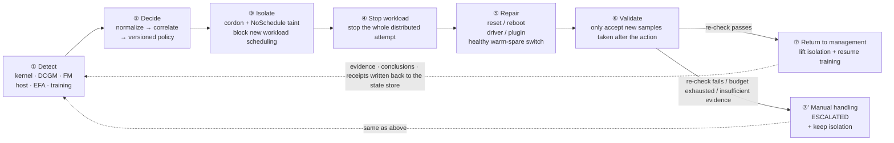
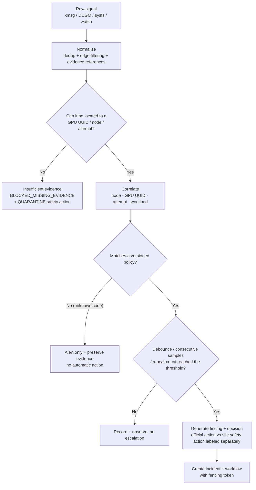
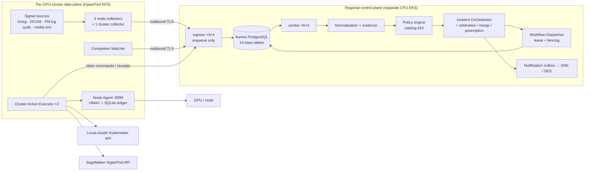
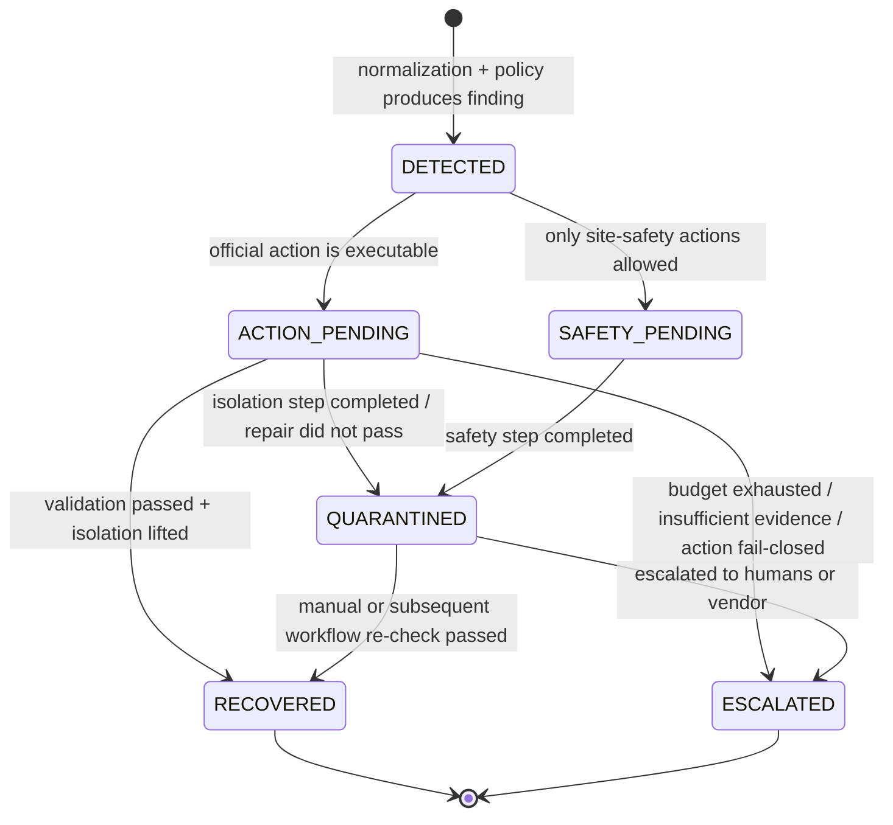
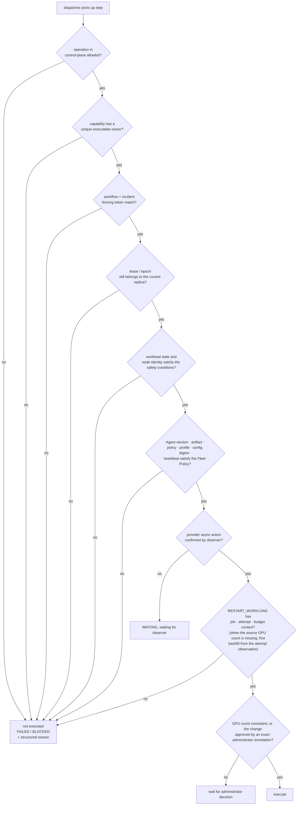

English edition of `docs/概要设计-v2.md`; the Chinese file remains the source of record until both are maintained together.

# GPU Fault Handling System High-Level Design (v2, Closed-Loop Perspective)

## 0. What This Version Is and How It Relates to v1

The [High-Level Design](high-level-design.md) (hereafter v1) is organized as "constraints → architecture → procedures → deployment → security",
and answers "where the production boundary of this system lies". This document is organized by the **fault closed loop**:

```text
Detect → Decide → Isolate → Stop workload → Repair → Validate → Return to management / Manual handling
```

It answers "for a fault from appearance to disappearance, who performs each stage, to what extent, and where it stops when it cannot".

Both documents share the same factual baseline, the same code (0.10.0); there is no case where "v2 describes new features".
The motivation for writing this version: when told module by module, readers easily mistake "can collect metrics" for "can repair the machine";
told by closed loop, whatever is missing at each stage is exposed directly.
The most recent date on which this document was checked item by item against source code, generated manifests and test contracts is **2026-09-15**
(that round focused on notifications, the persistent registry, deployment identity, monitoring and retention; the remaining facts continue to be governed by the released source code,
generated manifests and test contracts).

**Division of labor and precedence:**

| Content | Which document governs |
|---|---|
| The four scheme-level hard constraints (§2.1 v1), go-live gates (§10 v1) | **v1**. These two chapters are externally referenced contracts, mapped by number from the acceptance case document; this document only references them and does not restate the numbers |
| Deployment form inventory, the three interaction topology diagrams, component-credential table | **v1** §1.3, §4.1.1, §7 |
| Module internal implementation, table structures, endpoint inventory, state machine details | [Detailed Design](detailed-design.md) |
| Capability boundary of each closed-loop stage, fault classification matrix, event model fields, state machine mapping, test coverage | **this document** |

**Three writing rules of this document** (hold it to this standard when reading):

1. Every capability is annotated with its **current implementation status**: implemented / implemented but limited / fail-closed / not implemented.
   "The enum value exists", "the manifest has a placeholder", "the configuration item can be set" do **not** count as implemented.
2. Wherever a design intent given in this document disagrees with the code, the code is written as authoritative, and a separate item for the discrepancy is listed in §11.
3. No single load-test or real-machine execution result is copied. Thresholds are written in this document; measured values are governed by the
   [Performance Load-Test Acceptance Plan](performance-acceptance-plan.md) and the private evidence store.

---

## 1. Goals and Scope

### 1.1 The Seven Closed-Loop Stages



These are a different partition of the same chain as the five stages of v1 §2: v1's "④ controlled execution" is split in this document into
the three stages ③ isolate, ④ stop workload, ⑤ repair, with responsibilities distinguished by action target:

- **③ Isolate**: `MARK_UNSCHEDULABLE` / `QUARANTINE` set cordon and our own
  `NoSchedule` taint, blocking new workload scheduling; they are not responsible for stopping training that is already running.
- **④ Stop workload**: `STOP_WORKLOADS` stops the whole affected distributed attempt,
  clearing the execution conditions for subsequent repair; this step does not depend on whether a warm spare exists, nor is it live migration of training.
- **⑤ Repair**: execute reset, reboot, driver/plugin repair, or switch via `REPLACE_NODE`
  to a healthy warm spare already under management. A warm-spare switch restores compute capacity; it does not mean the original faulty node
  has been repaired; the original node stays isolated, and subsequent validation and return to management target the actual recovery target.

The code basis is `src/gpu_fault/orchestration/workflow_builder.py::WorkflowBuilder.catalog_operations`
and `src/gpu_fault/adapters/kubernetes/adapter.py::KubernetesWorkflowAdapter.execute`.
For paths that need node repair while training is still active, isolate first, then stop the workload, then execute the repair;
when there is no active workload, no extra stop step is added. The diagram shows the main-line responsibilities; the concrete steps are still decided by policy, evidence and
the Runtime Profile, and the seven stages must not be read as a fixed template that every event must execute in full.

**The two entrances to the closed loop.** The normal entrance is ① (the signal arrives first); the other entrance is the training process dying first,
with the cause looked up afterwards, see the [passive training terminal-state overview](high-level-design.md#passive-terminal-overview).
After the Watcher detects the failure it asynchronously triggers "collect evidence + stop the whole attempt"; terminal-state reporting and the decision do not wait for containment to finish;
when a new recovery workflow is needed, predecessor dependencies arrange stop-before-start.

The passive entrance branches off from ② and **does not require every terminal state to pass through the node-repair main chain in the diagram above**:
normal success, user stop, or termination initiated by another incident creates no new recovery; a
`STOPPED` caused by this system's passive containment continues into the decision. With a usable marker, it correlates to the existing remediation, and if an existing workflow is responsible for the restart it is not duplicated;
without a marker, when the allocation is non-empty and the Profile allows restart, no hardware root-causing is done and a single restart within budget is planned directly.
When the marker-less path lacks an allocation or has no executable restart capability, it only collects evidence and moves to ⑦',
neither guessing the node nor fabricating node isolation out of nothing. Detailed conditions are in
[Terminal-State Decision and Recovery](detailed-design.md#passive-terminal-decision); the per-role calls are in
[Passive Terminal-State Sequence](detailed-design-v2.md#passive-terminal-sequence).

### 1.2 Environment Scope

| Environment | Status | Notes |
|---|---|---|
| SageMaker HyperPod EKS | **Sole production delivery form** | Regional multi-cluster separated deployment, see v1 §7.1 |
| Single-cluster all-in-one EKS | Historical transition | Migration starting point and limited Canary, not accepted at the same level |
| Generic Kubernetes | **Not implemented** | Manifests removed from the public tree; enum values and placeholder manifests do not indicate support |
| HyperPod Slurm | **Not supported** | No scheduler adapter, no isolation evidence read-back, no workload stop/restart; the bring-under-management precheck should refuse |
| Bare EC2 cluster | Not implemented | The core domain model does not depend on Kubernetes, but there is no corresponding execution path |
| Development and simulation | Implemented | In-memory store + `GPU_FAULT_EXECUTOR_MODE=simulation`, executes no real actions |

### 1.3 Vendor and Device Scope

**NVIDIA only.** Across the whole repository the number of references to ROCm, amdgpu, amd-smi, XGMI and Intel XPU Manager
is zero. All signal sources (kernel XID, Fabric Manager SXID, DCGM fields,
NVML temperature and throttle reasons, `nvidia-smi` UUID enumeration) and all device actions
(GPU reset, all-GPU/NVSwitch reset, Fabric Manager restart) are NVIDIA-specific.
Multi-vendor adaptation requires a new device adapter layer implementation; it is not a configuration item.

**Fault granularity.** Three of the four granularity levels are implemented:

| Granularity | Status | Primary identifier |
|---|---|---|
| Node | Implemented | `cluster_id + node_id`, additionally carrying `node_instance_id` and the agent generation to prevent confusion after replacement |
| Physical GPU | Implemented | **GPU UUID**; PCI BDF is an evidence field only, not a primary key |
| NVLink / NVSwitch interconnect | Implemented | SXID + access/trunk fault domain + NVLink pattern (32-bit `0/1/-`) |
| MIG instance (GI/CI) | **Not implemented** | Only accepts `MIG-`-prefixed values when parsing Pod-visible UUIDs; no MIG-level fault types, no GI/CI fields, no MIG blast-radius computation |

**EFA/RDMA as the fifth device class** forms its own family (AWS-specific): inventory count, traffic anomaly,
driver repair and device plugin restart each have an independent path, see §2.1.

### 1.4 Automation Levels

It is not a binary choice between "fully automatic" and "alert only", but graded action by action. The real grading is as follows:

| Level | Actions | Status |
|---|---|---|
| Alert only | AdvisoryNotification + site notification channel (`GPU_FAULT_NOTIFICATION_CHANNEL`, rendered from `spec.notifications.channel`: new sites default to `sns`, publishing to the site SNS topic; `ses` email is opt-in, and old sites with an existing SES sender keep SES; `disabled` only writes to the outbox) | Implemented, the common foundation of all levels; a persisted notification does not mean it has been sent out |
| Evidence preservation | `FREEZE_EVIDENCE`, `COLLECT_DIAGNOSTIC_BUNDLE`, `COLLECT_HUNG_TRIAGE`, `RUN_DCGM_DIAGNOSTIC` | Implemented |
| Isolation | `MARK_UNSCHEDULABLE`, `QUARANTINE`, `RESTORE_SCHEDULING` | Implemented |
| Stop/resume training | `STOP_WORKLOADS`, `RESTART_WORKLOAD`, `CHECKPOINT_WORKLOADS` | Implemented (Job / PyTorchJob / JobSet) |
| Device-level repair | `RESET_GPU`, `RESET_ALL_GPUS_NVSWITCHES`, `QUIESCE_GPU_SERVICES`, `RESTORE_GPU_SERVICES`, `VERIFY_NO_GPU_CLIENTS` | Implemented, dispatched signed; the installer's bare default disables reset, the current HyperPod production installation enables it explicitly |
| Fabric Manager repair | `RESTART_FABRIC_MANAGER` | Implemented; the node side has an independent switch, the current HyperPod production installation enables it explicitly, and it verifies no compute client before execution and that the service is active after execution |
| Node-level repair | `RESTART_NODE` (HyperPod `BatchRebootClusterNodes`) | Implemented, controlled by `ALLOW_HYPERPOD_REBOOT`; the current regional data-plane production manifest sets it to true |
| Software-plane repair | `REMEDIATE_EFA_DRIVER`, `RESTART_EFA_DEVICE_PLUGIN`, `RESTART_GPU_DEVICE_PLUGIN` | Implemented; the Node installer allows EFA driver remediation by default, and an explicit `--disable-efa-driver-remediation` both disables the permission and removes its operation; does not bypass the Profile, signature and workload-stop gates |
| Site-script repair | `REMEDIATE_DRIVER`, `UPDATE_SOFTWARE_FIRMWARE` | Implemented but configuration-gated; not added to workflows by default, the applicable SXIDs, target version, absolute-path command and SHA-256 must be configured explicitly |
| Manual steps | `CHECK_MECHANICALS`, `ESCALATE_SUPPORT` | Implemented; the former waits for an exact annotation, the latter generates a synthetic ticket ID, persists the notification and sends it through the site SNS/SES channel; there is no external ticketing system |
| Operations maintenance | `COLLECTOR_OUTBOX_MAINTENANCE` | Implemented; `gpu-fault-admin collector-outbox` sends the node-local `gpu-fault-collector outbox {stats,list,requeue-dead}` to the node as a single-step NODE_ACTION workflow, returns metadata only, takes the lock strictly, no remote `--force` (ARCH-G2) |
| Node replacement | `REPLACE_NODE` | **Warm spare only**; never calls `BatchReplaceClusterNodes` (v1 §2.1 constraint 2) |
| Planning placeholder | `RESTART_VM` | Not in the production allowlist; HyperPod EKS converts NVIDIA `RESTART_VM` to `RESTART_NODE` only when the controlled mapping holds |

`WorkflowOperation` in `src/gpu_fault/models.py` has 33 values in total; the production control-plane
`GPU_FAULT_ALLOWED_OPERATIONS` allowlist admits 32 (see
`deploy/control-plane/regional/generated/`); the node-side
application's bare default `GPU_FAULT_NODE_ALLOWED_OPERATIONS` contains only `VERIFY_NO_GPU_CLIENTS`;
the node install script writes 11 base operations when the Agent is enabled, then appends by EFA, Field Diagnostic,
driver and firmware capability. The production HyperPod installation additionally enables GPU reset, fabric reset,
service quiesce and Fabric Manager restart explicitly.
**Present in the allowlist ≠ can actually execute**: the capability must also have a unique executable owner (§7.1).

### 1.5 Out of Scope

| Object not handled | What the system actually does |
|---|---|
| Pure application OOM, killed user processes | Log rules recognize `out of memory` / `oom-kill` / `killed process` and assign them to the host/system-log family, not treated as GPU hardware faults; on the warm-spare side `src/gpu_fault/spare_health.py` classifies non-hardware causes as `CONFIGURATION`, only sets `SUSPECT` and defers, and triggers no hardware repair |
| Model code errors, hyperparameter problems | No causal analysis. When the training terminal state is FAILED/TIMED_OUT with no matching hardware marker, **no diagnosis is done**; a single restart is performed directly within the same job's restart budget (trigger `no-hardware-evidence:RESTART`); when the profile has no executable workload restart capability it only collects evidence and escalates to manual handling (`no-hardware-evidence:ESCALATE`); when the allocation is missing it records `allocation-missing:INCONCLUSIVE` and only escalates, without restarting |
| Training framework performance tuning | Only collects the step/throughput/loss/checkpoint channels (`TrainingProgressCollector` is currently not deployed) |
| Long-term log and metric archiving | The collector's local NDJSON outbox only guarantees event resubmission; it is not a log platform; long-term archiving requires external CloudWatch/S3/shared storage |
| MIG partition management | See §1.3 |

### 1.6 The Real State of SLOs and Acceptance Metrics

**Defined thresholds** ([Performance Load-Test Acceptance Plan](performance-acceptance-plan.md) §6, load-test terms):

| Metric | Threshold |
|---|---|
| P0 (XID/SXID, incident, workflow) acceptance rate | 100% while the hard cap is not reached, `429` = 0 |
| P0 API p99 | Must be recorded and compared against the latency budget approved for this round; no unified fixed veto line |
| processor steady-state oldest waiting time | < 5 s |
| Single-node fault first isolation step p99 | < 10 s |
| Multi-node fault first isolation step | < aggregation window + 10 s |
| Queue returns to steady state after the burst ends | Within 60 s |
| duplicate claim / stale fencing write / PostgreSQL deadlock | All 0 |

**Time constants that are defined but are not SLOs** (configuration defaults, used for decisions rather than commitments):
Agent heartbeat 30 s, expiry 90 s; collector silence thresholds `GPU_INVENTORY` 180 s,
`GPU_METRICS` 420 s, `HOST_TELEMETRY` 420 s; workflow lease 180 s;
dispatcher one round every 5 s, 100 workflows per batch.

**Undefined** (proposed in the recommendation but with no corresponding measurement in either code or documentation):

| Missing metric | Current state |
|---|---|
| Fault detection time (signal→finding end to end) | Each segment has metrics; no end-to-end SLO definition |
| False isolation rate | No denominator definition ("should not have been isolated" has no decision source), `/metrics` has no corresponding counter |
| Automatic recovery success rate | Workflow terminal states, step results and durations are exported; the formal SLO denominator still awaits approval |
| Return-to-management correctness rate | readmission/workload-restart milestones are exported; the recurrence-window SLO still awaits approval |
| Event loss rate | The outbox dead-letter has a counter, but there is no formula converting it into a loss rate |

These five items are **the most worthwhile part to fill in first** among the recommendations here, because they decide "whether the closed loop really closes",
whereas currently we can only prove "no segment timed out".

---

## 2. Fault Classification and Policy Matrix

### 2.1 The Seven Fault Families

Families are grouped by signal source and remediation approach. Within a family, the decision entry point and the starting point of the action ladder are shared.

| Family | Signal source | Collector | Typical decision | Starting action |
|---|---|---|---|---|
| GPU hardware (XID) | `/dev/kmsg` | `KernelLogCollector` | Fixed-version XID Catalog per-code rules | Per catalog: from `RUN_DIAGNOSTICS` to `RESET_GPU` / `RESTART_NODE` |
| NVSwitch / NVLink (SXID) | Fabric Manager file/journal | `FabricManagerLogCollector` | SXID catalog + access/trunk fault domain + product-generation gate | `RESET_ALL_GPUS_NVSWITCHES` (H200) or node reboot |
| Temperature, power and throttling | DCGM / NVML | `DcgmMetricsCollector` | GPU 85/90 ℃ and memory 90/95 ℃ dual thresholds; throttle-reason bitmask; power ratio 0.95 | Escalates to isolation only after 2 consecutive samples cross the critical line |
| Interconnect and network (EFA/RDMA) | Host sysfs, EFA traffic | `HostTelemetryCollector` | inventory count comparison + traffic state machine (8 states) | inventory mismatch → isolation chain; traffic anomaly → collect evidence first |
| Device drop (GPU/EFA ACTIVE inventory) | `nvidia-smi` UUID count + EFA port `4: ACTIVE`+`5: LinkUp` | `HostTelemetryCollector` | Expected values per node instance-type, consecutive anomalies reaching the threshold | Full isolate-reboot-validate chain, see v1 §5.4 |
| Host and software stack | journal, MCE, storage, NIC | `HostTelemetryCollector`, `NodeLogCollector` (disabled by default) | Multi-rule hit arbitration + persistent-hazard state machine | Mostly alerts and evidence collection; MCE and the like escalate to isolation |
| Collector silence (health cannot be confirmed) | Control plane reads the persisted collection status | `collector-silence`, default scan interval 60 s, not a loss-of-contact threshold | In active clusters, a required channel of an ACTIVE Agent with a valid heartbeat lease has no success record, or the time since the last successful report exceeds the channel threshold (§2.5) | AdvisoryNotification + site notification channel; no recovery workflow is created for this, **missing monitoring is not treated as healthy** |
| Training side (terminal state and hang) | Kubernetes watch, EFA zero traffic | `CompletionWatcher`, EFA traffic state machine | Unique TerminalEvent; `HUNG_SUSPECTED`; an idle pass (zero running managed Pods and zero active attempts after a full list) additionally sends a coverage heartbeat `POST /v1/attempts/coverage` (built-in at most one per 120 s), so an idle cluster is judged IDLE rather than UNKNOWN; on a busy cluster the observation stream itself proves the watcher is alive | Terminal states branch per the [passive flow overview](high-level-design.md#passive-terminal-overview): on failure, asynchronous containment, the decision does not wait for the training stop to complete; with a usable marker, reuse/orchestrate the remediation, and if an existing workflow is responsible for the restart there is no duplicate recovery; without a marker, only when the allocation is non-empty and the Profile allows restart does it take a single restart within budget, otherwise it collects evidence and escalates. hang takes the **read-only evidence chain** |

A training-side "usable marker" excludes pure diagnostic markers pointing to an already-stored incident; after skipping one, the
other repair markers must still be checked. An `after_incident` restart waits at execution time for the original incident to reach `RECOVERED`;
a successful match alone does not permit the restart; the complete rules are consolidated in the [detailed decision](detailed-design.md#passive-terminal-decision).

The table above gives only the starting point of each family. The thresholds and actions of each host/DCGM rule, the
NVIDIA official recommendations for the 172 XID codes and all SXID codes, this scheme's decisions and the compiled step chains are listed item by item in
[Fault Categories and Remediation Actions](fault-categories-and-actions.md).

PCIe is covered only up to the `pcie_replay_total` / `DCGM_FI_DEV_PCIE_REPLAY_COUNTER`
counters and the `pci_bdfs` evidence field; **there is no AER / PCIe link fault decision path** (§11).

### 2.2 Severity Levels and the Action Ladder

`Severity` has four levels: `info` / `warning` / `critical` / `fatal`.
Severity does not directly determine the action; the action is determined by a **globally unique strength-ordered ladder**:

```text
RUN_DCGM_DIAGNOSTIC / RUN_FIELD_DIAGNOSTIC / RESTART_FABRIC_MANAGER (10)
< RESTART_GPU_DEVICE_PLUGIN / RESTART_EFA_DEVICE_PLUGIN (15)
< RESTART_WORKLOAD (20) < RESET_GPU (30) < REMEDIATE_EFA_DRIVER (35)
< RESET_ALL_GPUS_NVSWITCHES (40) < RESTART_NODE (50) < QUARANTINE (60)
< REMEDIATE_DRIVER / UPDATE_SOFTWARE_FIRMWARE (70) < REPLACE_NODE (75)
< CHECK_MECHANICALS / ESCALATE_SUPPORT (80)
```

This ladder is expressed in `src/gpu_fault/operation_registry.py` as `recovery_rank`
(the rank value is in parentheses; isolation, evidence collection, validation, GPU service quiesce/restore and similar operations carry no rank
and do not participate in ordering); cross-type arbitration, workflow merging, preemption and failure escalation all use it for comparison.
The planner-layer `RecoveryAction` has a correspondence table in the same order in
`RECOVERY_ACTION_RANK` of `src/gpu_fault/models.py` (`RUN_DIAGNOSTICS` 10,
`MARK_UNSCHEDULABLE` / `STOP_WORKLOAD` 25, `DRAIN` / `QUARANTINE` 60,
`REPLACE_NODE` 70, `ESCALATE_OPERATOR` 80), used by the passive terminal-state path to pick the strongest marker.

### 2.3 Policy Is Versioned Data, Not Hard-Coded

This matches the recommendation, and is implemented more strictly than recommended:

| Mechanism | Implementation |
|---|---|
| XID rules | `src/gpu_fault/data/nvidia-xid-catalog-610.generated.yaml`, generated from the official documentation by `tools/generate_nvidia_xid_policy.py` |
| Version pinning | `src/gpu_fault/policy/catalog_integrity.py` pins the catalog version to `610`; a mismatch refuses to load |
| SXID rules | `src/gpu_fault/data/nvidia-fabric-manager-sxid-2025-11-14.yaml`, versioned by date |
| Product-generation gate | Rules carry product-family conditions; a non-applicable generation returns `NOT_APPLICABLE` and generates a fixed-template notification, instead of applying another generation's rules |
| Decision traceability | Every decision carries `catalog_version`; policy engine error messages include the catalog version |
| Repeat escalation | Two XID sets, `report_if_repeated` and `field_diag_if_repeated`, define the behavior "report only on first occurrence, escalate only on repetition" |
| NVLink pattern check | At catalog load, every pattern must be 32-bit `0/1/-` and errorStatus must be a hexadecimal list; a malformed catalog prevents process startup |

**The driver/firmware dimension has not yet entered the policy key.** The current policy key is "XID/SXID code + product family
(+ whether repeated)"; there is no "driver version → rule set" mapping; the driver version only participates in fleet compatibility decisions
in the form of a pin (§9.6). See §11.

### 2.4 Decision Chain



The three "hands-off" exits (`U`, `A`, `W`) are normal branches by design, not exceptions:
stopping automatic action on unknown faults, missing allocation, capability owner conflicts or insufficient evidence
is one of v1's design principles.

### 2.5 Monitoring Loss of Contact Must Be Unknown

Unknown here expresses "health cannot be confirmed when monitoring is missing"; it is not a unified node-state write.
The current `collector-silence` task only checks collector silence and generates an `AdvisoryNotification`;
it does not write the node as `UNKNOWN` for this, nor does it create a recovery workflow.

The control plane schedules the collector silence check at a **60 s interval** by default, reading persisted successful-report times,
not sending probe requests to nodes. The 60 s is configurable and is the default interval from the end of one round to the scheduling of the next,
not a loss-of-contact decision threshold or an alert delivery deadline; actual execution also depends on the Worker, the Store and the periodic task lease.

The check scope is limited to the required collection channels of **ACTIVE Agents whose heartbeat lease is still valid** in active clusters;
explicitly disabled/masked collection services are not included. When there is no success record, or the time since the last successful report exceeds that channel's threshold,
a notification is generated. Default thresholds are GPU inventory 180 s, GPU metrics/host telemetry 420 s, log classes 900 s;
notifications are deduplicated per cluster, node and channel in a default 3600 s time bucket.

Nodes whose Agent heartbeat has expired do not participate in this silence scan or the corresponding metric statistics; this is not a health conclusion,
and Fleet readiness and stale-agent metrics should be consulted separately. Loss of contact of components such as the Executor and Watcher has its own
criteria; this task must not be described as unified loss-of-contact detection covering all data-plane components. Implementation boundaries are in Detailed Design v2 §2.3.1.

`GET /v1/collector-readiness/{cluster_id}` applies the same lifecycle rule: only `ACTIVE` Agents enter `nodes` and decide
`ready`; `DRAINING`/`REVOKED` records (for example a departed node retired by `workflow-reconcile --retire-departed-agents`)
are listed under `retired_nodes` with `lifecycle_state`, `last_seen_at` and each channel's last successful report, and do not
affect `ready`. Their `collector_status` rows stay in the Store as evidence -- the Store has no deletion path; readers skip them
by Agent lifecycle. When only non-`ACTIVE` records remain after a retirement, `nodes` is empty and `ready` is `false` (fail
closed). An `ACTIVE` Agent whose lease has expired still enters `nodes`: its success record is necessarily past the threshold,
which is exactly the Agent coverage drift shape that must fail the release verification (Administrator Operations §10.2,
fourth shape).

---

## 3. Overall Architecture (Closed-Loop Perspective)

### 3.1 Panoramic Data Flow



Three boundaries that must be remembered (details in v1 §4.1, §4.1.1): cross-boundary connections are **all initiated from the GPU cluster side**;
the control plane holds no kubeconfig of any GPU cluster; `region + cluster_id` is the isolation key for all resources,
events, leases and actions.

### 3.2 Process Inventory Quick Reference

| Side | Component | Replicas × processes | Modifies the environment? |
|---|---|---|---|
| Control plane | ingress `gpu-fault-api-ha` | 3 × 4 (:8080) | No, enqueue only |
| Control plane | `gpu-fault-control-worker` | 6 × 4 (:8081) | No (no direct cluster connection in the regional form) |
| Control plane | `gpu-fault-telemetry-spool-worker` | 0 (:8082, scaled on demand) | No |
| Data plane (node) | metrics / kernel / host / fabric-manager collector | 4 systemd units per node | No |
| Data plane (node) | node-agent | 1 per node, :9099 | **Yes** (reset disabled by default) |
| Data plane (cluster) | cluster-action-executor | 2 | **Yes** |
| Data plane (cluster) | completion-watcher / node-resource-collector / node-installer-reconciler | 1 each | The watcher modifies workloads only as an emergency fallback |

"ingress Pod Ready" does not mean anyone is consuming the queue: the two hand over work only through the Aurora queue.
To judge queue health, look at the worker role.

### 3.3 Why the Fault Event Stream Is Separated from Prometheus

The recommendation states this point explicitly, and the implementation agrees with it, but the boundary is narrower than the recommendation describes:

- **The source of truth for the repair process is Aurora**: incidents, workflows, steps, receipts, fencing tokens and
  evidence references are all in the state store; replay and audit depend on it alone.
- **AMP/ADOT covers the self-metrics of the CPU roles and the configured GPU data-plane components**; it does not take over fault decisions.
  The GPU cluster's ADOT writes to the site AMP with the local cluster's IRSA and carries no execution token;
  Amazon Managed Grafana queries the time series of the same workspace and is not another alert outlet.
  `GPU_FAULT_ENABLE_AMP=false` makes the install script skip the AMP/ADOT resources, but only the legacy script
  path can reach it; `gpu-fault-admin` one-command deploy always writes `true`.
- **Business notifications do not go through Prometheus**: workflow results and fault notifications go through the Aurora outbox and are then sent by the site
  SNS/SES channel. Collector silence has two routes: the control-plane collector silence check (default interval 60 s,
  scope and thresholds in §2.5) → outbox notification (independent of AMP), and the AMP `GpuFaultCollectorSilent`
  rule; on SNS sites both end at **the same site SNS topic**, but their sources of truth are Aurora state
  and the `/metrics` time series respectively. The existence of the metrics chain must not be used to mask an undelivered outbox.
- Therefore "the time-series store dropping points" does not affect repair decisions; only "Aurora unavailable" does.

---

## 4. Module Design: Where the Nine Recommended Modules Land

The recommendation listed nine modules. Each is mapped to its real code location below, plus six that the recommendation did not mention but that actually exist.

| Recommended module | Real implementation | Status |
|---|---|---|
| Device adapter layer (vendor SDK) | `src/gpu_fault/collectors/`, `src/gpu_fault/dcgm_fields.py`, `src/gpu_fault/gpu_metrics.py` | Implemented, **NVIDIA only**; `NvidiaSmiMetricsCollector` is the fallback implementation without DCGM, mutually exclusive with DCGM mode |
| Node agent (Node Fault Agent) | `src/gpu_fault/node_agent/` | Implemented. Note the responsibility is split in two halves: **collection** is done by the 4 collectors, **execution** by the node-agent; they are different processes |
| Asset and topology service | `src/gpu_fault/fleet.py`, `KubernetesNodeResourceCollector`, `src/gpu_fault/hyperpod_spares.py`, NVSwitch topology cache | Implemented |
| Event normalization | `src/gpu_fault/app/ingest/`, edge filtering in each collector | Implemented |
| Correlation analysis | `src/gpu_fault/policy/` (XID companion correlation), `src/gpu_fault/completion_controller.py` and its split-out `completion_pod_parsing.py` / `completion_delivery.py` / `completion_reconcile_loop.py` (attempt correlation) | Implemented |
| Policy engine | `src/gpu_fault/policy/engine.py` + `catalog.py` + `catalog_integrity.py` | Implemented, driven by versioned data |
| Workflow executor | `src/gpu_fault/orchestration/`, `src/gpu_fault/execution/`, `src/gpu_fault/adapters/` | Implemented |
| Validation module | `VALIDATE_GPU` / `VALIDATE_HOST` / `VALIDATE_FABRIC` + `RUN_DCGM_DIAGNOSTIC` | Implemented, new samples enforced (§7.7) |
| Audit and event store | `src/gpu_fault/store/`, `src/gpu_fault/control_record_archive.py` | Implemented |

Six that the recommendation did not mention but that the closed loop or the production lifecycle cannot do without:

| Module | Role | Why it must be listed separately |
|---|---|---|
| Fleet Registry + compatibility policy | `src/gpu_fault/fleet.py`, `src/gpu_fault/fleet_compatibility.py` | Decides "whether this node's agent version/digest/generation is allowed to accept commands". When the pin does not match, all node actions fail closed |
| Restart Guard | The control-plane precheck atomically reserves the restart budget; the data plane compares the authorization + checks GPU counts before and after | The main anti-flapping force, see §6.6 |
| Arbitration and DAG branching | `src/gpu_fault/orchestration/arbitration.py`, `dag_branching.py` | Merge, preemption and `SUPERSEDED` when multiple faults on the same node are concurrent, see §6.5 |
| Notification outbox + Dispatcher | `src/gpu_fault/notification_service.py`, `src/gpu_fault/notifications/` | Notifications must be decoupled from workflow results: an SNS/SES failure must not change step results in reverse |
| Regional Cluster Registry + Remote Command | `src/gpu_fault/regional.py`, package `src/gpu_fault/cluster_executor/` (five layers: `regional_client` / `lease` / `dispatch` / `executor` / `bootstrap`) | The dispatch protocol across the trust boundary; it is how "the control plane holds no kubeconfig" is realized |
| Installation Resource Registry | `src/gpu_fault/installation_resources.py`, `src/gpu_fault/admin/resource_registry.py` | Records the stable identity, ownership, deletion policy, dependencies and state of AWS resources, so that deploy, takeover, remove-cluster and site-wide uninstall use the same source of truth |

---

## 5. Fault Event Model

### 5.1 Stable Identifiers

The recommendation requires "stable identification by UUID/BDF rather than the mutable GPU index". The implementation goes one step further,
because nodes are replaced too:

| Level | Primary identifier | Anti-confusion means |
|---|---|---|
| GPU | **GPU UUID** | The mutable `nvidia-smi` index is not used; PCI BDF is an evidence field only |
| Node | `cluster_id + node_id` | Additionally stores `node_instance_id` (changes after instance replacement) and the agent **generation** |
| Agent | cluster + node + generation | After an old generation is revoked, all its writes are refused (fencing) |
| Training | `cluster_id + attempt_id` | attempt generation time fence, preventing late events from an old attempt from driving a new attempt |
| Cluster | `cluster_id` | Bound to the authenticated identity; a mismatching payload returns 403 |

### 5.2 Recommended Fields Checked One by One

| Recommended field | Implementation status |
|---|---|
| `event_id` | Present, and is the idempotency key |
| Occurrence/report time | Present; kernel events additionally carry sequence, boot ID, monotonic timestamp |
| `node_id` | Present |
| GPU UUID | Present, primary identifier |
| PCI BDF | Present (`pci_bdfs`), evidence field |
| MIG / GI / CI | **Absent** (§1.3) |
| Vendor error code | Present (XID / SXID code, with catalog version) |
| Unified fault type | Present, but expressed as the combination "family + rule + finding type"; there is no single flat `fault_type` enum |
| Severity | Present (`Severity`, four levels) |
| Impact scope | Present: `OperationScope` (NODE / GPU), `node_wide`, `node_exclusive`, `merged_gpu_scope` |
| Associated Pod / Job / attempt | Present (workload topology + attempt observation) |
| Raw evidence reference | Present (`RawEvidenceRecord`, default retention 24 h / 10000 records per node) |
| Occurrence count | Present (the repeat count drives `report_if_repeated` and similar escalations) |
| Recommended action | Present, and **official action and site safety action are labeled separately** |
| Policy version | Present (`catalog_version`) |
| Repair task ID | Present (`incident_id` + `request_id` + `command_id`) |
| Current state | Present, but as three state machines rather than one (§6.1) |

### 5.3 Domain Objects and Isolation Keys

The main domain objects and idempotency keys are in v1 §6.1 (11 objects, including `InstallationResource`, which carries no `cluster_id` and is keyed by
`site_id + resource_key`). The inventory of objects that must be keyed by
`(region, cluster_id, …)`
is in v1 §6.2. Only one **reading rule** is emphasized here:
every place keyed only by an in-cluster ID (node name / job ID / attempt ID) is a defect,
because two clusters using the same name is a scenario the go-live gate must verify specifically (v1 §10 item 2).

---

## 6. State Machines

### 6.1 It Is Actually Three State Machines, Not One

The proposal gives a single chain
`Healthy→Suspected→Quarantined→Draining→Repairing→Validating→Healthy`.
The implementation splits it into three orthogonal state machines + several local debounce states, and this is **intentional**:
"the remediation phase of the machine" and "which step this execution has reached" have different lifecycles; merging them would cause replay ambiguity.

| State machine | Values | Owned by |
|---|---|---|
| `IncidentState` | `DETECTED` / `ACTION_PENDING` / `SAFETY_PENDING` / `QUARANTINED` / `RECOVERED` / `ESCALATED` | the remediation phase of one fault |
| `WorkflowStatus` | `PENDING` / `SAFETY_PENDING` / `BLOCKED` / `RUNNING` / `SUCCEEDED` / `FAILED` / `SUPERSEDED` | the progress state of one execution plan |
| `EfaTrafficSignal` | `WARMUP` / `NORMAL` / `SPIKE` / `DROP` / `ZERO_PENDING` / `ZERO_WARNING` / `HUNG_SUSPECTED` / `RECOVERED` | traffic health of a single node+attempt |
| `SpareHealthState` | `HEALTHY` / `SUSPECT` / `REBOOT_PENDING` / `RECHECKING` / `UNAVAILABLE` | warm spare availability |
| Remote command | `PENDING` / `LEASED` / `WAITING` / `SUCCEEDED` / `FAILED` | one cross-boundary dispatch |



### 6.2 Proposed State → Actual State Mapping

| Proposed state | Actual counterpart | Notes |
|---|---|---|
| Healthy | No incident, or `RECOVERED` with `RESTORE_SCHEDULING` already done | There is no explicit "Healthy" record; health is "no active incident + valid marker" |
| Suspected | `DETECTED`, plus the per-family debounce windows (consecutive sample counts, `ZERO_PENDING`, `SpareHealthState.SUSPECT`) | One proposed state is spread across multiple per-family debouncers in the implementation, because the threshold semantics differ |
| Quarantined | `QUARANTINED` (+ the `gpu-fault.io` taint on the node) | Consistent |
| Draining | **No independent state**. Scheduling is first isolated with cordon + taint, then `STOP_WORKLOADS` stops the managed training; the Eviction API is not called (§7.4) | The proposed Draining corresponds in the implementation to a group of steps within `ACTION_PENDING`, not a node state |
| Repairing | `ACTION_PENDING` + `RUNNING` workflow | Consistent |
| Validating | A `VALIDATE_*` step in `RUNNING`/`WAITING` | Consistent |
| ManualRepair | `ESCALATED` | Consistent |
| Retired | `ESCALATED` + isolation kept + agent revoke | **There is no "retired" terminal state**: nodes are never destroyed (constraint 2); this manifests as permanent isolation |

### 6.3 Idempotency and Recovery After Controller Restart

The proposal requires "idempotency and recovery after controller restart". The implementation has five mechanisms:

1. **Entry idempotency**: API, events and workflows are all handled idempotently by stable IDs; the passive-terminal path creates incident + workflow + event index in the same store
   transaction, PostgreSQL takes a transaction-level advisory lock keyed by event key, so
   under multi-replica concurrency only one creation succeeds and the rest return the same workflow.
2. **Execution idempotency**: remote commands are deduplicated by content digest, and receipts use the same idempotency key; a duplicate receipt produces no second
   side effect, **including no second notification**.
3. **No leader**: no global service leader is elected (this differs from the "Leader Election" in proposal §9).
   Every worker process runs the dispatcher and the correlation finalizer, arbitrated by
   workflow execution lease / epoch, correlation lease, lane lease + fencing.
   After a process crash, the lease expires and another process takes over; commits from the old owner are rejected.
4. **State advances only inside atomic transactions**: step, workflow and incident are updated together;
   there is no intermediate state of "step succeeded but workflow did not move".
5. **Processor retries with persisted scheduling**: 408/425/429/5xx within a 300-second age write back
   `not_before` and an incremented `retry_count`, retrying with exponential backoff starting at 1 second and capped at 30 seconds.
   A `STRICT` request still blocks its lane while waiting; only latest-wins priority 100 requests are marked
   `REORDERABLE`, allowing later safety samples to pass them. On shutdown, requests already claimed but not yet started are released proactively.

### 6.4 Mutual Exclusion, Merging and Concurrency Caps

| Requirement | Implementation |
|---|---|
| Single mutually exclusive repair per node | `node_exclusive` + `node_wide` flags in `operation_registry`; destructive actions on the same node do not run in parallel |
| Merging multiple faults on the same node | `src/gpu_fault/operation_registry.py` declares `MERGE_INTENT_OPERATIONS` and each operation's `merge_intent`; `src/gpu_fault/orchestration/arbitration.py` derives `merged_gpu_scope` from them |
| Preemption (a stronger action suppresses a weaker one) | `src/gpu_fault/orchestration/dag_branching.py` computes `superseded_step_indexes` by `recovery_rank` (the field is defined in `src/gpu_fault/models.py`); suppressed steps enter the `SUPERSEDED` terminal state |
| Coordination of multiple nodes in the same attempt | Within the aggregation window they form **one** workflow; each node is a DAG branch that executes its own node's reset, and a single `join` step restarts the training job only once after all branches complete |
| Repair concurrency cap | The workflow lease claims persistent Region, cluster, node, failure domain and resource class budgets in the same transaction; the executor side additionally has `max_concurrent_commands=5` |
| Processor completion database parallelism | `GPU_FAULT_PROCESSOR_COMPLETION_CLUSTER_CONCURRENCY` only parallelizes completion transactions of different clusters, range `1..min(8, PostgreSQL pool max size)`; production is 1, **not equal to the repair action concurrency cap** |
| Single writer per destructive capability | Runtime Profile compilation rejects multiple writers and `AUGMENT` for destructive capabilities |

### 6.5 Anti-Flapping (Preventing Repeated "Fault-Recover" Cycles)

This is a point the proposal mentions but that is easy to underestimate; the implementation has five layers:

| Layer | Mechanism |
|---|---|
| Collection side | Edge filtering + consecutive sample confirmation (e.g. throttling/temperature requires 2 consecutive samples over the line) |
| Decision side | `report_if_repeated` / `field_diag_if_repeated`: only report the first time, escalate only on repetition |
| Execution side | Two branches, `COOLDOWN_AND_VALIDATE` and `DRAIN_AND_QUARANTINE`: cool down and re-check first, isolate only if the re-check still fails |
| Budget side | The same `cluster_id/job_id` shares a **persisted** restart budget; when exhausted, node repair still completes (cordon / stop / reset / validate run as usual) and only `RESTART_WORKLOAD` is withheld: it is pre-recorded as FAILED and superseded, the workflow ends FAILED and sends a budget-exhausted notification, and the job must be resubmitted manually. The documentation explicitly states "do not raise the restart budget directly to mask repeated faults" |
| Notification side | Deduplication by hourly bucket (`GPU_FAULT_HOST_NOTIFICATION_COOLDOWN_SECONDS`); transient GPU warnings have an independent cooldown; **only state transitions generate findings and notifications**, a persistent anomaly that stays in the same state is not reported repeatedly |

### 6.6 Whether Isolation Is Kept After Failure

It is kept. This is a direct corollary of fail-closed: action failure, insufficient evidence, capability with no owner,
pin mismatch, lease expiry all stop in the not-executed/failed state and **retain** the `gpu-fault.io` taint,
and the incident stays in `QUARANTINED` or `ESCALATED`. The system never "lets it through because it cannot be cleaned up".

The reverse operation has only two paths: the workflow's `RESTORE_SCHEDULING` step,
or an explicit administrator action (§8.2).

---

## 7. Repair Safety Design

### 7.1 Execution Gates

Every step execution must satisfy all nine conditions **simultaneously**; if any one is not met, it does not advance (fail-closed, not skipped):



The "source GPU count" of G8 is not a hard gate: when `source_gpu_count` is missing, it is first backfilled from the observed
GPU count of that attempt (`_observed_source_gpu_count` in
`adapters/kubernetes/restart_operations.py`); only when the backfill fails does it enter G9 and is handled as "GPU count changed":
a notification is sent and the step stays in `WAITING`, waiting for the administrator's exact annotation.

### 7.2 Device Occupancy Check Before Operations

The proposal requires "checking active processes and device occupancy before operating". This is an independent workflow operation,
not a single condition inside an action:

- `VERIFY_NO_GPU_CLIENTS`: re-checks compute clients and device file holders.
  This is the **only** operation allowed on the node side **by default**.
- `QUIESCE_GPU_SERVICES` / `RESTORE_GPU_SERVICES`: stop/start the local GPU services as a pair before and after a reset.
- GPU reset is **off by default**, and occupancy is checked once more before execution (check at submission + re-check before execution).
- The warm spare side checks the same way: "active gpu resource pods exist" / "active gpu clients"
  are classified as a `CONFIGURATION` reason and deferred, not treated as a hardware fault.

### 7.3 Blast Radius Calculation

| Dimension | Implementation |
|---|---|
| GPU-level vs node-level | `OperationScope`; `node_wide` means the action affects the whole node |
| GPU set after merging multiple findings | `merged_gpu_scope` |
| NVSwitch failure domain | Split into access / trunk domains; NVLink pattern decoded as 32 bits; **stays blocked** when the full GPU inventory, fabric partition, quiesce state or no-client evidence is missing |
| Multi-node coordination | Multi-node SXIDs in the same attempt are combined into one workflow within the aggregation window: one reset branch per node, a single join restart |
| MIG blast radius | **Not implemented** (§1.3) |
| Impact of P2P / NVLink topology on other GPUs of the same node | Expressed via the NVSwitch failure domain and "all-GPU/NVSwitch reset"; there is no independent P2P impact graph |

### 7.4 The Real Semantics of "Drain"

This item differs the most from the proposal and must be written clearly, otherwise subsequent features will be designed on a wrong premise.

**Node isolation is implemented by `MARK_UNSCHEDULABLE` / `QUARANTINE` (cordon + own
`NoSchedule` taint); stopping the workload is performed by the independent `STOP_WORKLOADS` step.
The whole codebase never calls the Kubernetes Eviction API and has no `kubectl drain`
equivalent, so problems of the "PodDisruptionBudget causes drain to hang" class do not exist,
and there is no eviction policy for critical business Pods / system Pods / DaemonSets.**

Correspondingly:

- Stopping training is done by patching the workload object (Job / PyTorchJob / JobSet) + marking the terminated Pods;
  the scope is the **managed training job**, not all Pods on the node.
- The cluster executor's RBAC has two layers. The ClusterRole contains only cluster-level read-only (`pods` /
  `jobs` / `pytorchjobs` / `jobsets` get/list/watch; spare activation must prove across namespaces
  that a node is idle) plus `nodes` get/list/watch/**patch** (no delete), see
  `deploy/dataplane/cluster-action-executor.yaml`. The write verbs (`pods`
  patch/**delete**, `jobs`/`pytorchjobs`/`jobsets` create/patch (no
  delete)) are rendered by the GPU rollout as a Role + RoleBinding per managed workload namespace
  (`EXECUTOR_WORKLOAD_RULES` in
  `src/gpu_fault_release/regional_release_gpu_rollout.py`), and
  `pods delete` is granted separately in the device plugin namespace. Therefore `GPU_FAULT_ALLOWED_WORKLOAD_NAMESPACES` is no longer the only boundary:
  a command for an out-of-bounds namespace is rejected by both the executor and the API server.
  Here pod delete is used for `RESTART_*_DEVICE_PLUGIN` (deleting the DaemonSet Pod under `kube-system`
  so it is recreated) and for marking terminated Pods when stopping training.
- This design **writes only its own** `gpu-fault.io/*` taints and annotations,
  never deletes provider-owned taints, and never writes any `sagemaker.amazonaws.com/*`
  label or taint (to avoid accidentally triggering managed recovery).

> The statement in v1 §8.3 that "Kubernetes RBAC does not grant Node/Pod delete permission" holds for Node,
> but not for Pod (the executor has `pods delete` in the managed workload and device plugin
> namespaces). This section is authoritative; see also §11 item 12.

### 7.5 Allowlist and Manual Approval

| Gate | Implementation |
|---|---|
| Automatic action allowlist | Control-plane `GPU_FAULT_ALLOWED_OPERATIONS` (32 items in production) + node `GPU_FAULT_NODE_ALLOWED_OPERATIONS` (bare application default 1 item; the installer writes an 11-item base list and appends by capability). Not on both allowlists → not executed |
| High-risk actions | The application/installer bare defaults turn off GPU reset and HyperPod mutation; the current HyperPod production installation explicitly enables GPU reset, fabric reset, Fabric Manager restart and `RESTART_NODE`. `ALLOW_HYPERPOD_REPLACE` and `ALLOW_WITH_AUTOMATIC_NODE_RECOVERY` are **always false** (an invariant, not a default) |
| Manual approval | A **GPU count change** must be explicitly approved by an administrator with an exact annotation, otherwise `RESTART_WORKLOAD` waits; EFA traffic baseline changes are confirmed by the administrator via `ACCEPT_NEW_BASELINE`/`ACKNOWLEDGE_TRANSIENT` |
| Maintenance window | There is no general "maintenance window" concept. The only similar mechanism is allowing a pinned agent generation to continue within the window during an SXID quiesce |
| Manual and configuration gates | `CHECK_MECHANICALS` waits for an annotation; `ESCALATE_SUPPORT` generates a synthetic ticket ID and a persisted notification; driver/firmware fail closed when the site command or version pin is missing; Fabric Manager restart fails closed when the switch is off, compute clients remain, or service validation fails |

### 7.6 The Real State of Dry-run

**The dry-run required by the proposal (rehearsal without committing) is not implemented.** Two entry points that are easily mistaken for it:

- `POST /v1/workflows/{request_id}/simulate` and
  `POST /v1/recovery-plans/{plan_id}/simulate`: **they write to the state store**. After checking the fencing
  token they push the workflow directly to `SUCCEEDED` (or `SAFETY_PENDING` → `BLOCKED`) and
  the incident to `RECOVERED` (or `QUARANTINED`); they merely do not call any adapter.
  They are fast-forward switches for the simulation/development form, and **must not be used as a rehearsal in production**.
- `GPU_FAULT_EXECUTOR_MODE=simulation`: simulation at the level of the whole deployment form, likewise not
  "rehearsing a single action in the production environment".

The release side does have a real dry-run (`src/gpu_fault_release/rollout.py`
and the training submission CLI), but that is a capability of the operations tooling, not on the fault repair path.

### 7.7 Proactive Diagnostics and Observation Window After Repair

| Mechanism | Implementation |
|---|---|
| Validation must use fresh samples | `VALIDATE_GPU` / `VALIDATE_HOST` / `VALIDATE_FABRIC` must use **new** HostTelemetry/metric samples produced after the action completes; cached samples from before the restart cannot pass |
| Proactive diagnostics | `RUN_DCGM_DIAGNOSTIC`, `RUN_FIELD_DIAGNOSTIC`, `COLLECT_DIAGNOSTIC_BUNDLE`; conclusions `PASS` / `FAIL` / `INCONCLUSIVE` / `NO_ACTION` |
| Observation window | Expressed as "cooldown + re-check" (`COOLDOWN_AND_VALIDATE`) and debounce counts, rather than an explicit "observation window" state |
| Recovery order | Only after validation passes does `RESTORE_SCHEDULING` run, then `RESTART_WORKLOAD`; the order cannot be swapped |
| Read-only forensic chain | `HUNG_SUSPECTED` follows a fully read-only forensic chain (zero traffic may be a hang, but may also be a normal data-loading or checkpoint interval) and **does not touch the machine** |

---

## 8. Interfaces and Integration

### 8.1 API Surface

`create_app()` always mounts **89 application routes**; the regional production form enables on this set of routes
the default-deny model of "every route explicitly declares its bucket". The five buckets
`public` / `metrics` / `cluster-token` / `dual-credential` /
`execution-token` are currently distributed 2 / 1 / 34 / 7 / 45 (`public` is `/healthz` and
`/livez`; the numbers are authoritative as enumerated in-process by `create_app()` + `ExplicitAuthorizationRegistry.load()`).
A new route without a declared bucket
fails startup at application assembly; at runtime, failing to resolve a bucket always yields 403, but **a path that matches no route answers 404**
(`ExplicitAuthorizationRegistry.route_exists`): the collector outbox treats 404 as dead-letter and 403 as a
token-rotation transient to be replayed indefinitely; NET-008's retired-channel records once never dead-lettered because of this.

All three API classes the proposal cares about exist, and the production deployment lifecycle has an additional set of management interfaces:

| Proposed API | Actual entry point |
|---|---|
| Fault event reporting | `/v1/gpu-events/*`, `/v1/collector-events/*` (7 collection channels); the four HMA provider entry points have been removed |
| Health status query | `/v1/collector-status/*`, `/v1/collector-readiness/{cluster_id}`, `/v1/gpu-health-findings/*`, `/v1/gpu-metrics/*`, `/v1/fleet/agents*` |
| Manual isolate/recover/terminate | See §8.2 |
| AWS installation resource lifecycle | `/v1/installation-resources`, `/sync`, `/{site_id}/{resource_key:path}`, all execution-token |

### 8.2 Manual Intervention Surface (Real Inventory)

| Purpose | Entry point |
|---|---|
| Manually advance/execute a workflow | `POST /v1/workflows/{request_id}/execute` (execution-token) |
| Operator queue / close an incident handed to humans | `GET /v1/incidents`, `GET /v1/incidents/{incident_id}`, `POST /v1/incidents/{incident_id}/close` (execution-token; only closes **ESCALATED** to RECOVERED, 409 while a workflow is still open, repeated close is idempotent) |
| Close an incident / finish a BLOCKED record from the administrator shell | `gpu-fault-admin workflow-reconcile --close-incident ID` / `--close-escalated` / `--close-quarantined` (the latter only finishes QUARANTINED incidents whose node no longer has a cordon, no quarantine taint of this incident and no isolation annotation, and strips residual annotations); the same verb also closes BLOCKED records whose subsequent workflow has recovered |
| `CHECK_MECHANICALS` disposition / return a manually repaired node to the state store | `gpu-fault-admin submit-remediation --incident-id ID --disposition {inspected,reset-gpu,reboot-node,quarantine,restore}`: confirms the inspection, compiles a new fenced hardware disposition workflow from the record, or (`restore`) creates a validated restore workflow for a manually repaired QUARANTINED node (`VALIDATE_GPU → VALIDATE_HOST → VALIDATE_FABRIC → RESTORE_SCHEDULING`, same incident and fencing token) |
| Declare / release a warm spare | `gpu-fault-admin config spare --node NODE --declare` / `--release` (label + cordon, with a `--confirm` confirmation string and `--reference`) |
| Write a trusted health marker | `POST /v1/markers` |
| Take a node agent out of service / revoke / reactivate | `POST /v1/fleet/agents/{cluster_id}/{node_id}/drain` `/revoke` `/reactivate` |
| Rolling release and wave control | `/v1/fleet/deployments*`, `/next-wave`, `/v1/fleet/barriers*` |
| Notification resend / immediate dispatch | `POST /v1/advisory-notifications/{id}/send`, `POST /v1/advisory-notifications/dispatch` |
| Confirm EFA traffic false positive / accept new baseline | `POST /v1/efa-traffic/admin-actions` (`ACKNOWLEDGE_TRANSIENT` / `ACCEPT_NEW_BASELINE`) |
| Query restart budget | `GET /v1/restart-budgets/{cluster_id}/{job_id}` |
| Query/sync/advance AWS installation resource state | `GET /v1/installation-resources`, `POST /sync`, `PUT /{site_id}/{resource_key:path}` |
| Approve a GPU count change | Node annotation (exact value), not an API |
| Regional operations (claim/renew/receipt/progress, spare health, evidence and notification write-back, cluster registry) | `/v1/regional/*`, 21 endpoints in total (`executors` 15, `registry` 4, `clusters` 1, `node-action-keys` 1) |

**Gap: there is still no first-class entry point for "isolate an arbitrary node" or "terminate a RUNNING workflow"**. Manual isolation currently relies on
creating/advancing a workflow or cordon+taint directly in the cluster (the latter bypasses the state store and is not recommended);
`POST /v1/incidents/{id}/close` and `workflow-reconcile --close-*` both refuse incidents that still have an active
workflow, and a running workflow can only wait until it fails closed or is `SUPERSEDED` by a stronger action.
Three things have already been filled in: an ESCALATED incident can be closed via `POST /v1/incidents/{id}/close`;
manual repair of a QUARANTINED node returns to the state store via `submit-remediation --disposition restore`;
`WAITING` remote commands left behind by terminal workflows are cancelled automatically by the dispatcher's periodic sweep
(`WorkflowDispatcher.sweep_stuck_records`), no manual command is needed any more.

### 8.3 Integration Surface with Kubernetes

| Proposed integration point | Implementation |
|---|---|
| Node taint | **Written**, but only the own `gpu-fault.io` QUARANTINE_TAINT; provider-owned taints are not removed |
| Node label / annotation | Own annotations are written (including installation markers); `sagemaker.amazonaws.com/*` is read-only |
| NodeCondition | **Read-only**. NodeCondition is not written (differs from the proposal, see §11) |
| Kubernetes Event | **Not written**. Fault conclusions go through the API + site notification channel, not Event objects |
| Device Plugin / scheduler device disabling | Can only **restart the whole** GPU/EFA device plugin DaemonSet Pod; **there is no GPU-level "mark a single card unavailable" injection capability**. The actual isolation granularity of a single-card fault is the whole node |
| CRDs (FaultEvent / RemediationPolicy / RemediationRun) | **No CRDs at all**. The API is REST + Aurora; this is a deliberate choice: the state store must be shared across clusters, and CRDs live only within a single cluster |

### 8.4 Notifications and Tickets

- **Business notifications are sent through the channel chosen by the site, and this is the only business notification channel**: Aurora outbox +
  Notification Dispatcher + `spec.notifications.channel` (rendered as
  `GPU_FAULT_NOTIFICATION_CHANNEL`). New sites default to `sns`, publishing to `spec.health.snsTopicArn`;
  `ses` (opt-in) sends from a verified sender, and legacy sites with no declared channel but an existing `emailSender`
  stay on SES; `disabled` only lands in the outbox. Business processing only creates idempotent notifications; the dispatcher claims
  with owner/epoch/lease and backs off exponentially, an old epoch cannot complete a new lease, and
  **an SNS/SES failure cannot change a workflow step result in reverse**.
  Notifications are still persisted when the channel is disabled at runtime or delivery is disabled; `AdvisoryNotificationService.describe_delivery_mode`
  states whether they are actually sent out; a persisted record must not be counted as a received notification.
- **SNS business notifications and AMP Alertmanager share the site topic** (`spec.health.snsTopicArn`),
  so the administrator confirms the subscription only once. **There is no built-in webhook, Slack, PagerDuty or Jira integration**; to connect them,
  add a subscription on that topic or add a channel on the outbox, not an external call on the workflow business path.
- **The "ticket" is currently a locally synthesized identifier**: `src/gpu_fault/adapters/support_escalation.py`
  generates `vendor-ticket-<incident_id>` and writes it into the notification body; **no ticketing system API is called**.
  When "Ticket ID" appears in a notification, it is a correlation string for humans to reference, not an external ticket number.
- Low-utilization and similar alerts must be aggregated by node/job and must not grow linearly with the GPU count (go-live gate item).

---

## 9. Non-Functional Design

### 9.1 High Availability

- **No leader election** (differs from the proposal). Active-active consumption + lane leases + fencing,
  see §6.3 item 3 and v1 §4.3.
- PDBs are set per role: ingress `minAvailable=2` (3 replicas),
  control-worker and spool-worker `maxUnavailable=1`.
- Aurora is the shared consistency point; the control plane does not allow a separate SQLite per Pod.
  Destructive steps must not be executed twice during an Aurora failover (go-live gate item).
- A single GPU cluster going offline, a credential leak or a data-plane anomaly does not affect other clusters and must not stall
  the control plane's handling of other clusters.
- **The registry head is the runtime source of truth**: the startup Secret serves only as the initial seed and for disaster recovery. All currently active
  CPU processes, including joiners after a release, must confirm the same revision with a valid persisted heartbeat. A missing required
  record, a future-dated heartbeat or all heartbeats expired blocks convergence; readiness also checks refresh and heartbeat write freshness.
  This is not proof that old Pods have exited; see Detailed Design §2.15.1.

### 9.2 Node Network Partition and Local Protection

| Mechanism | Implementation |
|---|---|
| collector local cache | An independent bounded NDJSON outbox per collector subcommand: transient failures are replayed automatically, permanent 4xx go to dead-letter, default at most 1000 entries per file |
| Request body limits | NodeLog default ≤1000 entries / 4 MiB per batch, single entry ≤64 KiB; processor enqueue request body default ≤16 MiB; exceeding the limit returns 413 |
| Node Agent anti-replay | HMAC envelope + command TTL + target node check + agent generation + incident fencing token + local SQLite ledger. The ledger keys exactly-once replay by `(command_id, attempt)`: rows still IN_PROGRESS when the agent restarts are ruled INTERRUPTED, require manual confirmation instead of re-running, and that state is not used to infer that the physical action completed; a reused command_id whose command body (operation / GPU UUID / parameter digest) does not match is rejected with 409 `COMMAND_ID_REUSED`, the step is terminal and not retried |
| Control plane unreachable for a long time | Only the Completion Watcher performs the emergency suspend tagged `passive-stop-mode=emergency-fallback`; the normal path does not modify workloads directly |
| Boundary | The outbox is a capacity-limited catch-up mechanism, **not an indefinite queue**. A long offline period exceeding capacity still requires external alerts and manual intervention |

Note that this differs from the proposal's "fast local protection when the node loses network": **the node side does not isolate itself autonomously**.
The only local autonomous action is the emergency suspend (an in-cluster watcher, not the node agent);
all other actions require control-plane authorization + signature. This is a deliberate single-writer design.

### 9.3 Security

- Transport and identity: private CA server-side TLS + a random Bearer Token of ≥32 bytes per cluster +
  the request `cluster_id` must match the token's registered identity; the control plane stores only SHA-256 digests,
  compared in constant time. **mTLS is currently not enabled** (the NLB terminates TLS, the backend does not get the client certificate);
  this is an accepted staged risk.
- Authorization: five-bucket default-deny model (§8.1).
- Node actions: an independent HMAC envelope, not reusing the API execution token; node key ≥32 characters,
  file permission `0600`.
- The event model is Pydantic `extra=forbid`, rejecting unknown fields.
- `/metrics` is unauthenticated only on direct loopback connections, so `FORWARDED_ALLOW_IPS`
  and trusting proxy headers are forbidden; otherwise any request could claim to be loopback.
- Least privilege: the control-plane role gets only the one permission for the channel the site uses: `sns` sites get only
  `sns:Publish` on the site topic, `ses` sites get only `ses:SendEmail` for the verified sender; the GPU cluster side gets neither.
- Audit: any `BatchReplaceClusterNodes` appearing in CloudTrail **is always treated as an anomaly**
  (a benefit of constraint 2: the assertion simplifies from "must distinguish the caller" to "must be empty").

### 9.4 Retention and Capacity

**Retention** (distinguishing site defaults from bare application defaults; configuration takes effect through the audited administrator entry point, not by changing environment variables online.
For the complete machine-readable list see [Environment Variables Reference](environment-variables-reference.md)):

| Data | Default retention |
|---|---|
| Raw evidence | 24 h, and at most 10000 entries per node |
| attempt observation / fleet deployment / diagnostic | 7 days |
| node action ledger (node-side SQLite) | 30 days, additionally bounded by a 10000-row cap |
| GPU finding history, hot-state latest/terminal | 30 days |
| Core control records (closed incidents and associated workflow / plan / decision / event / notification / marker / remote command) | Site default: archive-first to the site S3 after 30 days, then delete; one batch every 600 s, at most 200 candidates, retained if the complete-terminal-state and reference conditions are not met; an explicit `controlRecordRetentionDays: 0` turns it off |
| GPU metrics batch / terminal remote command | 24 h; audit records still referenced by an incident are archived with the incident |
| processor lane | 1 h |
| processor completed | 600 s |
| fault action maximum age | 900 s |
| GPU inventory maximum age | 180 s |
| SXID inventory / NVSwitch topology | 600 s / 300 s |

The bare application default for control records is `GPU_FAULT_CONTROL_RECORD_RETENTION_DAYS=0`, which does not enable archiving automatically;
the site model defaults to 30 days, and the audited deployment renders the archive URI at the same time. The two defaults are not interchangeable.

**Capacity conversion rule** (the one most easily miscalculated): background threads and database connections exist **per uvicorn process**,
so they must be converted as "per-process value × processes per Pod × replicas", not by Pod count.
The control-worker processing slots are 6 × 4 × 24 = 576. Retire-first per-process recycling such as `--limit-max-requests`
removes serving capacity instantaneously, so it is forbidden on both production ingress and workers;
process lifecycle is managed only by the audited rollout, Pod replacement and liveness.

**Backpressure**: dual limits on the regional total outstanding queue and the per-cluster outstanding queue; when exceeded, the request is not stored and
`429 Retry-After` is returned; both limits each reserve 40% for the priority=0 fault path,
which ordinary telemetry cannot consume. A Store I/O admission timeout returns `503 Retry-After`.

**Retry and completion-phase capacity**: retryable replay is not re-queued immediately; instead the next claimable time is persisted,
avoiding a hot loop that fills the lane and the database; strict requests remain ordered, and only latest-wins routine requests may pass them.
completion is transacted per cluster, committed serially by default in production; parallelism 2/4 is only for canaries after passing the real PostgreSQL
stress gate, and is bounded by the connection pool size.

**Known bottleneck layer**: the throughput ceiling lies in the control plane's **in-process Store I/O admission queueing**,
not in database ACU. Capacity design and load testing must separately cover four classes: admission lock and quota, ordering lane degradation,
hot-path all-kind scans with JSONB decoding, and the HTTP process count × connection pool multiplication;
see Detailed Design §2.18.5 and the [Performance Load-Test Acceptance Plan](performance-acceptance-plan.md).

### 9.5 Health of the Monitoring System Itself

| Object | Means |
|---|---|
| Whether collectors are still reporting successfully | Two paths: the control plane by default checks every 60 s the required channels of online Agents in active clusters, generating AdvisoryNotifications through the outbox based on success records and three-tier channel thresholds (scope and boundaries in §2.5, not dependent on AMP); AMP `GpuFaultCollectorSilent` (`gpu_fault_collector_silent_nodes > 0` for 5 min, critical) and the `GpuFaultDataplaneCollectorMissing` rules generated per configured cluster provide metric-side alerts. Both paths end at the site SNS topic |
| Whether Agents are healthy | Heartbeat 30 s / 90 s expiry + readiness + version/digest/generation checks |
| Whether anyone is consuming the queue | `/metrics` exposes queue depth, oldest wait time, per-cluster backlog, processing duration, rejection counts; PrometheusRule alerts on backlog/latency/rejections/p95 |
| Whether Store I/O is saturated | `/metrics` exposes in-flight, configured capacity, rejection; alert at 90% saturation or any rejection |
| Notifications and closed loop | `/metrics` exports workflow terminal states/steps/durations, closed-loop milestones, notification results/outbox, budget waits and stale Agents |

### 9.6 Compatibility Matrix and Canary

The proposal requires a "driver, firmware, GPU model compatibility matrix" and "upgrade rollback canary". What is implemented is a **different kind** of
compatibility matrix, centered on digest pins rather than version ranges:

| Dimension | Implementation |
|---|---|
| Agent / Executor artifact consistency | `src/gpu_fault/fleet_compatibility.py` and `src/gpu_fault/regional_compatibility.py`; Agent/Executor both check the protocol, the physical artifact SHA and the component compatibility digest |
| Behavior on pin mismatch | Fail closed. A control-plane pin ahead of the fleet (`PIN_AHEAD_OF_FLEET`) makes all node actions fail, so the release order is "install nodes first, then update the control-plane pin" |
| Canary | fleet deployment waves + barriers + explicit `next-wave` advancement; revoke/drain/reactivate control per node |
| Rollback | Schema is forward-only (no down migration), and **every process pins the exact version**: `gpu_fault_schema_version` must equal the process's own `POSTGRES_SCHEMA_VERSION`, otherwise startup raises `RuntimeError`; old processes cannot read a new schema. A release with a schema change cannot be rolled back automatically (the engine refuses outright under `autoRollback: true`) and must use `gpu-fault-admin deploy --accept-schema-change`: Aurora snapshot first, fail-forward within the transaction, recover from the snapshot if something goes wrong; switching straight back to old processes is not possible. `dual` refers only to the legacy/dedicated dual write of the hot-state tables and the workflow/remote-command dedicated tables (a data layout migration), not a general DDL rollback mechanism |
| GPU model | Two places: the product family gate on the policy side (B100/B200/H200 etc.), and the instance type → GPU/EFA expected-value table on the inventory side (unknown instance types must be configured explicitly, otherwise node installation fails) |
| Driver / firmware version | **No version compatibility matrix**. The XID catalog is pinned at 610 and the DCGM field set is fixed; the driver version does not participate in policy selection, and there is no gate of the form "an action is allowed only when driver ≥ X" |

---

## 10. Testing and Acceptance

### 10.1 Case Catalog

The machine-readable case catalog is `testcases/fault-scenarios.yaml`, with `tools/run_fault_test_cases.py` as the entry point.
Currently **340 explicit cases + 2 case families generated per XID catalog
code** (the `xid_catalog_rules` generator, covering every XID in the catalog,
plus B200 context variants, 172 × 2 = 344 cases), 684 cases after expansion, across 49 categories
(47 explicit + 2 generated). The numbers are authoritative as loaded from `testcases/fault-scenarios.yaml`
(`test_cases` + expanded `generated_test_families`);
`--list --include-manual --include-live` lists only 648, because the 36
`automation: command` cases only appear when explicitly selected with `--case`.

Risk classification (the table below counts only the 340 explicit cases and determines whether a case may run on real machines):

| risk | Count | Meaning |
|---|---:|---|
| `non-destructive` | 179 | Pure software path, can run unconditionally |
| `read-only-signal-replay` | 38 | Only replays signals, does not touch the environment |
| `live-non-destructive` | 38 | Runs on real machines without changing state |
| `live-service-action` | 31 | Service-level actions on real machines |
| `destructive` | 24 | Requires manual approval |
| `live-workload-restart` | 9 | Restarts training on real machines |
| `live-kernel-log-injection` | 6 | Writes kmsg on real machines |
| `destructive-provider-reboot` | 5 | Provider reboot on real machines |
| `live-isolation` | 4 | Isolation on real machines |
| `live-node-mutation` | 4 | Modifies nodes on real machines |
| `destructive-warm-spare` | 2 | Warm spare replacement on real machines |

### 10.2 Proposed Injection List vs Actual Coverage

| Proposed injection scenario | Coverage |
|---|---|
| Simulated XID / ECC | **Covered**, and per code (full XID catalog kmsg-format replay + B200 variants + XID 154 + companion XID + NVLink5 decode) |
| Simulated temperature anomaly | Covered (`gpu-metrics` 25 cases, `host-health` 5 cases) |
| Metric loss / killing DCGM / Device Plugin / driver processes | **Partially covered**: `regional-collector` 22 cases cover the silence and loss-of-contact decisions; injection that kills DCGM/device plugin processes is not in the public catalog |
| Dropped GPU and PCIe/NVLink anomalies | Dropped GPU covered; NVLink covered (`xid74-nvlink` 15 cases, `sxid-*`); **PCIe AER not covered** (and not implemented, §11) |
| Drain timeout / Pod cannot be evicted | **Not applicable**: there is no Eviction path (§7.4). The equivalent scenarios are `STOP_WORKLOADS` failure and an unreadable workload |
| Controller restart during repair | Covered (`regional-high-availability` 9 cases, `regional-preemption` 38 cases including lease takeover) |
| Duplicate and out-of-order events | Covered (idempotency, `attempt-generation-fence` 8 cases, `regional-remote-command` 18 cases including duplicate receipts) |
| Manual takeover after repair failure | Covered (`destructive-acceptance`, `regional-destructive-acceptance`, 7/26 cases respectively) |
| Multiple nodes failing simultaneously | Covered (`cross-fault-arbitration` 6 cases, three-node aggregation and reset, two-node SXID quiesce lease) |

### 10.3 Current State of Acceptance Metrics

Those with thresholds are in the upper table of §1.6; the five items without measurements are in the lower table of §1.6.
The item-by-item list of go-live gates and verification steps is in v1 §10 and
[Regional-Mode End-to-End Acceptance Test Cases](regional-e2e-acceptance-test-cases.md);
**the content and order of the entries in that chapter are an external reference contract**, and this document does not copy its numbering.

Real-machine XID verification progresses through four levels, "replay → single node → multi-node → produced by the real driver";
the levels and safety boundaries are in the [Fault Simulation Test Manual](fault-simulation-test-manual.md) §7.

---

## 11. Differences Between the Proposal and the Current Implementation

Sorted by "whether it affects closing the loop". The first 6 items change the system's capability boundary; the remaining ones are differences in expression or integration approach.

| # | Proposal | Current implementation | Impact | Recommended disposition |
|---:|---|---|---|---|
| 1 | Multi-vendor (NVIDIA / AMD / Intel), XGMI interconnect | **NVIDIA only**, zero AMD/Intel/XGMI code | Non-NVIDIA fleets are completely unusable | Requires a new device adapter layer implementation; not a configuration item. Do not promise multi-vendor in documentation for now |
| 2 | MIG instance (GI/CI) granularity and MIG blast radius | Only accepts `MIG-` prefixed UUIDs as identifiers, **no MIG fault model** | On clusters partitioned with MIG, a single-card fault can only isolate the whole node | If customers use MIG, GI/CI fields and blast radius calculation need to be added |
| 3 | Dry-run | `/simulate` **writes to the state store** and pushes the workflow to a terminal state; no production-usable rehearsal | Mistaking it for a rehearsal causes state pollution | Either explicitly disable `/simulate` in production, or add a truly read-only plan-preview |
| 4 | GPU-level device disabling (Device Plugin / scheduler) | Can only restart the whole device plugin DaemonSet Pod | The actual isolation granularity of a single-card fault is the **whole node**; capacity loss is amplified 8× | Evaluate integrating single-card unhealthy injection into the device plugin |
| 5 | False-isolation rate, event loss rate, end-to-end detection latency | workflow/notification/readmission metrics have been added; these three still lack a unified denominator or a signal→finding timeline | Detection quality still cannot be fully quantified | Add denominator definitions and signal/finding milestones |
| 6 | PCIe (AER / link) fault decision | Only the `pcie_replay_total` count and the `pci_bdfs` evidence field | No decision path for PCIe link degradation/link loss | If real cases exist, add a family following the "temperature/throttling" threshold + debounce pattern |
| 7 | Write NodeCondition | NodeCondition is **read-only** | External systems cannot see this design's decisions; the scheduler cannot act on them | Writing NodeCondition would introduce a second writer, conflicting with the single-writer principle; recommend staying read-only and exposing a query API instead |
| 8 | CRDs (FaultEvent / RemediationPolicy / RemediationRun) | **No CRDs**, REST + Aurora | Cannot view faults with `kubectl get` | Deliberate choice: the state store is shared across clusters, CRDs live only within a single cluster. If CRDs are wanted, they can only be a read-only projection |
| 9 | Control-plane Leader Election | **No leader**, lane leases + fencing + active-active | None (this is the stronger design: no single-leader throughput bottleneck and no leader flapping) | Keep as is, but the documentation must state explicitly "there is no leader", otherwise troubleshooting will go looking for a leader that does not exist |
| 10 | Drain policy (critical Pods / system Pods / DaemonSets) | Does not call the Eviction API; first isolates scheduling with cordon + taint, then separately stops managed training jobs | Unmanaged Pods on the node are unaffected | This is a deliberately narrowed blast radius. For a real drain, RBAC and PDB interaction would need to be re-evaluated |
| 11 | Ticketing system integration / Webhook | `vendor-ticket-<incident_id>` is a **locally synthesized string**, written only into the SNS/SES notification body; no built-in webhook | Humans must turn notifications into tickets | For integration, add a subscription on the site SNS topic or a channel on the notification outbox, rather than a call on the business path |
| 12 | — (a wording defect of v1 itself) | v1 §8.3 "RBAC does not grant Node/Pod delete permission" holds for Node but not for Pod (the executor has `pods delete` in the managed workload and device plugin namespaces) | Reviewers will misjudge the permission surface | Correct the wording of v1 §8.3 according to §7.4 of this document |
| 13 | Driver / firmware / GPU model compatibility matrix | There is a product family gate and an instance type expected-value table, but **no driver/firmware version matrix**; the catalog is pinned at 610 | When changing driver major versions, policy applicability relies on human judgment | At least record a list of "verified driver versions", and report the driver version in agent heartbeats for comparison |
| 14 | "Manual isolate/recover/terminate workflow" API | There are markers, agent drain/revoke/reactivate, workflow execute, `POST /v1/incidents/{id}/close` (ESCALATED), `workflow-reconcile --close-*`, `submit-remediation --disposition restore` (return of a manually repaired QUARANTINED node to the store); **still no first-class "isolate an arbitrary node" or "terminate a RUNNING workflow" endpoint** | Manual isolation either bypasses the state store or waits for fail-closed | Add these two explicit endpoints; safer than having people run `kubectl taint` |
| 15 | Observation window as an explicit state | Expressed as cooldown + debounce counts, no explicit state | No functional impact, but operators cannot see "under observation" | Could be exposed as a derived field on the incident |

**Four places with no difference where the implementation is stronger than the proposal**, which need not be discussed again in review:

1. Policy versioning: the proposal requires "no hard-coding"; the implementation achieves "generated + version-pinned + integrity-checked +
   refuse to start on malformed input".
2. Idempotency and recovery: the proposal requires "recoverable after controller restart"; the implementation is lease + epoch + fencing +
   single-transaction advancement, and a duplicate receipt does not even resend the notification.
3. Single writer: the proposal requires "single mutually exclusive repair per node"; the implementation raises it to "each destructive capability
   may have only one writer", enforced at Runtime Profile compilation.
4. Anti-flapping: the proposal mentions it in one sentence; the implementation has five layers (collection debounce / escalate on repetition / cooldown re-check /
   persisted budget / notification deduplication).

---

## 12. Related Documents

- [High-Level Design](high-level-design.md): the authoritative source for hard constraints, deployment forms and go-live gates
- [Detailed Design](detailed-design.md): module-level implementation, table structures and protocol details
- [Deployment and Operations Manual](deployment-and-operations-manual.md): deployment, upgrade, rollback and troubleshooting steps
- [Regional-Mode End-to-End Acceptance Test Cases](regional-e2e-acceptance-test-cases.md): item-by-item verification of go-live gates
- [Fault Simulation Test Manual](fault-simulation-test-manual.md): fault injection entry points and real-machine verification levels
- [Performance Load-Test Acceptance Plan](performance-acceptance-plan.md): capacity model, thresholds and evidence format
- [NVIDIA Policy Supply Chain and Implementation](components/nvidia-policy.md): Catalog sources and runtime gates
- [Environment Variables Reference](environment-variables-reference.md): all configuration items and defaults (generated)
