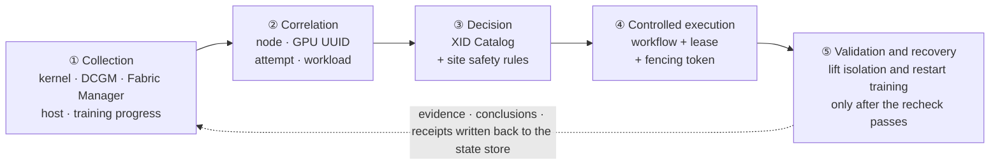
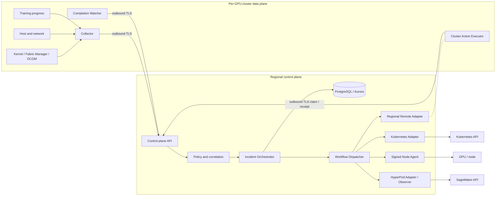
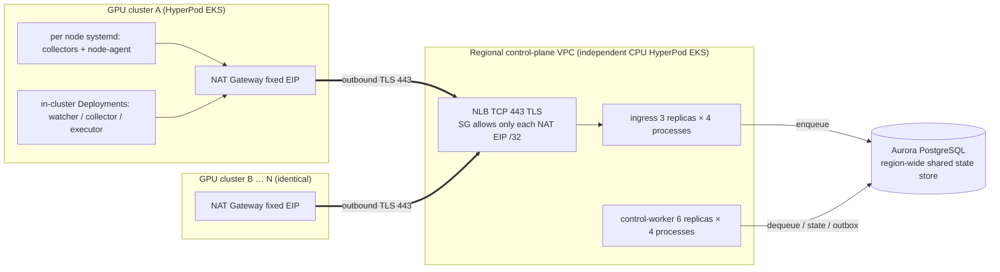
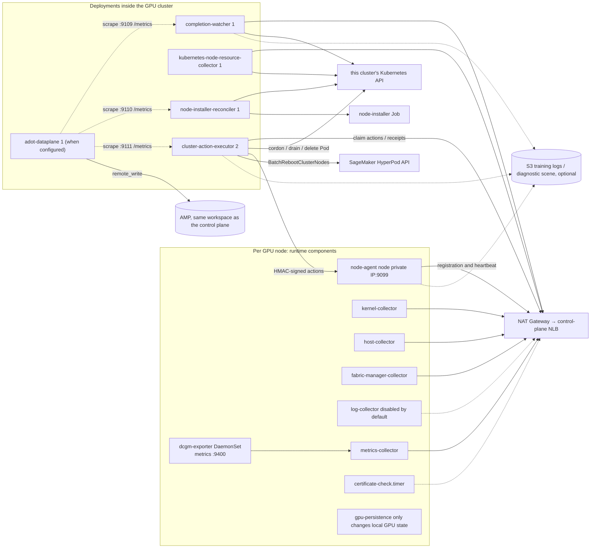
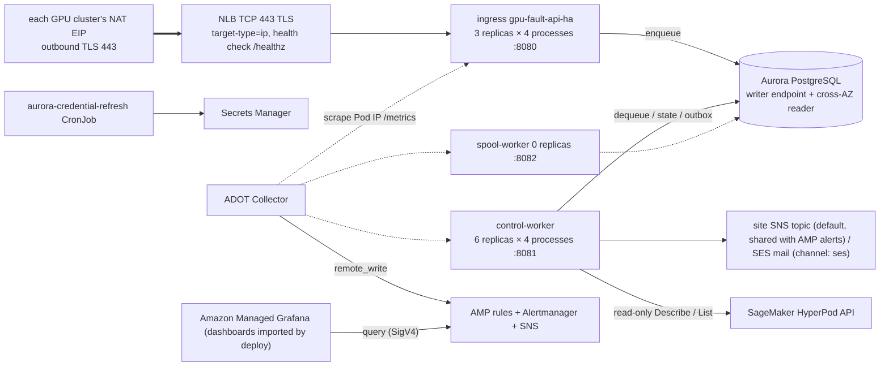
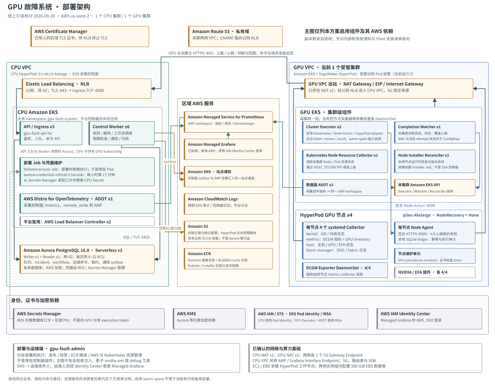
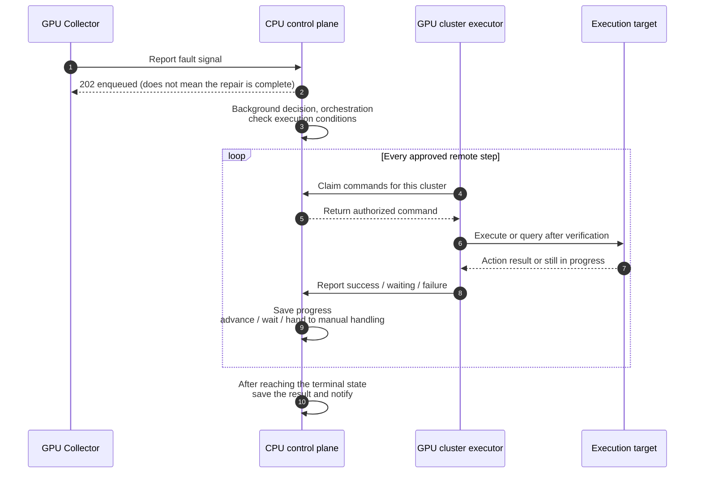
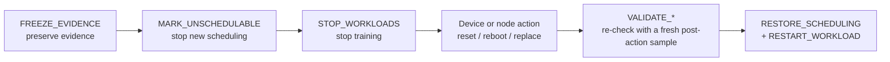
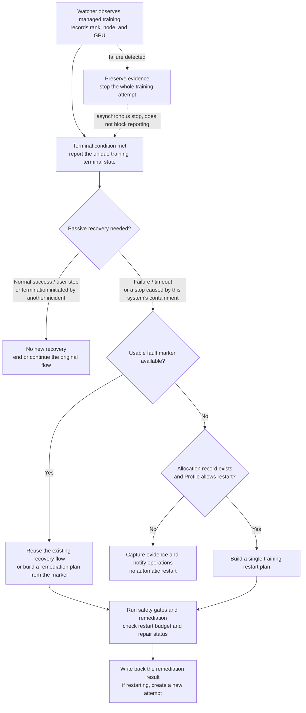
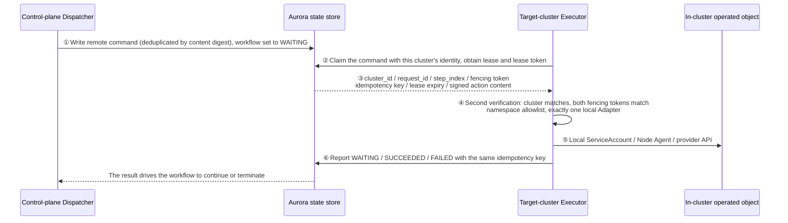

English edition of `docs/概要设计.md`; the Chinese file remains the source of record until both are maintained together.

# GPU Fault Handling System High-Level Design

## 1. Document Information

### 1.1 Basic Information

| Item | Content |
|---|---|
| System name | GPU Fault Control Plane |
| Code version | 0.10.0 |
| Fact-check date | Source code, generated manifests and test contract baseline: 2026-09-15 (partial check: notifications, persistent registry, deployment identity, monitoring and retention); enabled deployment snapshot: 2026-09-20 (§4.1.2); all other facts follow the release source code, generated manifests and test contracts |
| Language and framework | Python 3.12, FastAPI, Pydantic |
| Applicable environments | Kubernetes, EKS, SageMaker HyperPod EKS; the core model can be extended to EC2 and Slurm |
| Document basis | `src/gpu_fault`, `src/gpu_fault_release`, `deploy`, `config`, `pyproject.toml` |

### 1.2 Readers and Reading Paths

This document is written for engineers who develop, review or troubleshoot on this system, and answers four questions: what the system does,
which processes it consists of, which stages a fault passes through from detection to recovery, and which things are constrained as not allowed.
Module internals, table schemas, endpoint lists and state machine details are not in this document; they are in the
[Detailed Design](detailed-design.md).

Recommended reading order:

| Your goal | Read these |
|---|---|
| Build an overall picture first | The five-stage closed loop at the start of §2 → §3 System Context → §5.1 proactive fault flow |
| Change code | §4 Overall Architecture → all flows in §5 → go to the corresponding module in the [Detailed Design](detailed-design.md) |
| Deploy or take over operations | [§4.1.2 Enabled Deployment Architecture](#deployment-architecture-snapshot) → §4.1.1 interaction topology → §7.1 regional form → [Deployment and Operations Manual](deployment-and-operations-manual.md) |
| Review security boundaries | §2.1 hard constraints → §4.1 trust boundary → §8 security design |
| Decide "whether it can go live" | §10 go-live gates → §11 current boundaries and risks |

Three conventions when reading:

- **"Implemented" means the code path exists and is covered by unit/integration tests**; it does not mean it has been accepted in a real HyperPod
  environment. Where the distinction matters, this document explicitly marks maturity.
- This document describes the system the current code has already implemented; long-term plans in `README.md` are not treated as delivered features.
- The content and order of the items in §10 are an **external reference contract** (mapped by number from the acceptance case document);
  read the note at the end of that section before changing them.

### 1.3 Delivery Boundary (Three Things You Must Know Before Reading the Body)

**First, only one production deployment form is currently delivered**: regional multi-cluster split deployment
(`GPU_FAULT_DEPLOYMENT_MODE=regional`), that is, one independent CPU control plane per AWS Region,
managing one or more HyperPod EKS GPU clusters in that Region. Positioning of the other forms:

| Form | Positioning | See |
|---|---|---|
| Regional multi-cluster split | **The only production delivery form** | §7.1 |
| Single-cluster all-in-one | Historical transition, migration starting point, limited Canary; not accepted at the same level as the regional form | §7.2 |
| Generic Kubernetes | **Not implemented**; enum values, sample manifests or placeholder manifests do not mean it is supported | §7.3 |
| Single-replica Canary | Historical design reference, manifests removed | §7.4 |
| Development and simulation | Only validates the API and policy, does not execute real workflows | §7.5 |

systemd is the **installation method** for the Collector/Agent on regional GPU data-plane nodes, not a separate deployment architecture.

**Second, the actions that can actually be executed are a finite set, and "implemented" does not mean "unconditionally enabled"**. What can currently be
executed for real: Kubernetes node isolation, Job/PyTorchJob/JobSet stop and restore, signed GPU reset,
full GPU/NVSwitch reset, Fabric Manager restart, controlled HyperPod reboot, and fixed-template
support escalation. Mechanical inspection is implemented as a `WAITING` step confirmed by notification + incident/fencing annotation,
and does not automatically cordon or stop healthy workloads. Driver and firmware repair also have real executors,
but they are only added to the workflow after the site explicitly configures the applicable SXIDs, target version, absolute-path command and SHA-256;
when the configuration or preconditions are not met they fail closed.

**Third, the maturity of the regional form is "code implemented, real-environment go-live gates not all passed"** (see §10).

## 2. System Goals and Hard Constraints

The system targets multi-node multi-GPU training and turns "detect a GPU fault — determine the impact scope — recover training" from manual
operation into an auditable, idempotently replayable automatic closed loop. The closed loop has five stages, and every module in the system can be
assigned to one of them:



Corresponding build goals:

1. Detect faults from the kernel, DCGM, Fabric Manager, host metrics, logs and training progress.
2. Correlate XID/SXID with the node, GPU UUID, training attempt and workload.
3. Form remediation recommendations according to a pinned version of the NVIDIA XID Catalog and site safety rules.
4. Execute recovery under the constraints of a single writer, permission allowlist, lease and fencing token.
5. Decide the terminal state of a training attempt to avoid duplicate recovery of distributed ranks.
6. Keep short-term raw evidence, incidents, workflows, execution receipts and Agent state.
7. Manage multiple GPU clusters and their multiple training jobs within one Region with a single control plane.
8. Isolate the control plane from the managed GPU clusters by process, identity and failure domain.

Design principles (every design decision below can be traced to one of them):

- Preserve evidence and isolate first, then execute destructive operations.
- NVIDIA official actions and site safety policy are labelled separately.
- GPU UUID is the primary device identifier; the node name and instance UID are used to prevent identity confusion after node replacement.
- Stop automatic actions on unknown faults, missing allocation, capability owner conflicts or insufficient evidence.
- API, events and workflows are all handled idempotently by stable IDs.
- Each destructive capability can have only one writer.
- The same `cluster_id/job_id` shares a persisted restart budget.
- When the GPU count changes or cannot be confirmed before restart, wait for the administrator's decision.
- `region + cluster_id` is the isolation boundary for all resources, events, leases and actions.
- The control plane does not hold the kubeconfig of the managed GPU clusters; cross-cluster actions can only be pulled and executed by that cluster's own executor.
- The control plane does not treat the EKS it is deployed in as a managed GPU cluster just because it is deployed there.

Among these, "each destructive capability can have only one writer" is tightened in the HyperPod environment into four
solution-level hard constraints, which determine the values of all subsequent forms, switches and profiles; hence the constraints are described first,
then the architecture.

### 2.1 Mandatory Constraints: Supported Operating Forms

These are **solution-level hard constraints**, not configurable options:

1. **`NodeRecovery` of a managed GPU cluster must be `None`** (that is, HyperPod
   automatic node recovery is disabled). Clusters with `NodeRecovery=Automatic` are **outside the scope supported by this solution**.
2. **This solution never calls HyperPod's replace-node related APIs under any circumstances**
   (`BatchReplaceClusterNodes`). There is no exception path of "may be called after approval".
   Node replacement can only go through warm spare: migrate to a customer-provided hot standby GPU node,
   while the faulty instance stays isolated and is not destroyed.
3. **HyperPod's job auto-resume must be disabled; job auto-recovery is taken over entirely by this solution.**
   Managed training jobs **must not** set
   `sagemaker.amazonaws.com/enable-job-auto-resume=true`;
   on the Slurm side `srun --auto-resume=1` **must not** be used.
   That is, in the semantics table in §2.3 only the row "this solution is the executor" is the compliant form.
4. **Only HyperPod EKS orchestration is supported; HyperPod Slurm orchestration is not supported yet.**
   `DescribeCluster.Orchestrator` of a managed cluster must be EKS;
   Slurm-orchestrated HyperPod clusters are **outside the current supported scope**, and the management-admission precheck should refuse them.
   This is a **current implementation boundary**, not a permanent design decision — different in nature from constraints 1~3,
   it can be relaxed once the Slurm-side execution path is completed.

#### 2.1.1 Why These Are Hard Constraints

**Constraints 1 and 2 (node replacement)** have two independently valid reasons, either of which is enough on its own:

- **GPU resource scarcity**: HyperPod automatic replacement requires the provider side to allocate a GPU instance of the same specification on the spot.
  Under current supply conditions this allocation is quite likely to fail, so "automatic recovery" degrades into
  "node removed, net capacity reduced, and no replacement brought up" — worse than not replacing at all.
  Warm spare uses nodes **the customer already holds and has brought under monitoring**, so capacity certainty is completely different.
- **Implementation complexity**: managed replacement is another lifecycle writer outside this solution.
  Even if it succeeds, this solution can only observe passively, and the passive observation chain has real gaps
  (see the last paragraph of §2.2). Removing this mode removes an entire class of dual-writer and perception races.

**Constraint 3 (disable job auto-resume)** is justified by implementation simplicity: the control loop of managed job recovery lives on the
AWS managed side; this solution can neither see its retry count nor share the restart budget and
checkpoint gate with it. Only when this solution exclusively owns job recovery is the gate "do not resume training before node remediation completes"
the only effective gate; otherwise the managed side might bring the job up while the incident is still `QUARANTINED`.
This constraint is enforced at two layers, the **deploy-time management-admission precheck** and the **runtime fail-closed guard**;
the enforcement details are in §2.3.

**Constraint 4 (HyperPod EKS only)** is justified by the implementation status: the Slurm-side execution path is not implemented.
Across `src/` there are only four files that reference Slurm, and none of them is an execution path —
`Environment.HYPERPOD_SLURM` in `models.py:99` (the bare `slurm` value has been removed and is refused at parse time),
`from_slurm_auto_resume()` in `hyperpod.py:102-118` (ownership decision, and not wired to the runtime)
and the environment decision at `:398`, the environment branch in `orchestration/coordinator.py:1522`,
and one comment in `watcher.py:181` saying "common to Kubernetes/Slurm".
There is **no** Slurm scheduler adapter, no `scontrol` isolation evidence read-back,
no Slurm workload stop/restart executor, and no Slurm-side Node Agent deployment path.
Therefore every action that needs "isolation evidence" or "job stop/restore" fails closed on a Slurm cluster
and stays at `PENDING`/`BLOCKED` — this is safe, but it does not constitute a usable recovery capability.
The existence of an enum value **does not** mean that orchestration is supported; this is the easiest point to misjudge.

#### 2.1.2 Invariants Derived from the Constraints

Every one of the following must hold at the same time; none may be missing. When development touches a related switch, profile or precheck,
come back to this table and verify first:

| Invariant | Value / requirement |
|---|---|
| `GPU_FAULT_ALLOW_HYPERPOD_REPLACE` | **Always `false`**. It is no longer a "default off, enable on demand" switch but an invariant; there is no legitimate scenario of temporarily enabling it within a maintenance window |
| `GPU_FAULT_ALLOW_HYPERPOD_REBOOT` | May still be `true` — reboot does not destroy the instance and is not affected by this constraint |
| `GPU_FAULT_ALLOW_WITH_AUTOMATIC_NODE_RECOVERY` | **Always `false`**. Its purpose is "still allow submitting batch mutations under `NodeRecovery=Automatic`", and this constraint has already excluded that premise |
| Runtime Profile `nodeReplace` owner | Always `gpu-fault-hyperpod-adapter` (`OWN`); **must not** `DELEGATE` to `hyperpod-managed-node-recovery` |
| Runtime Profile `workloadStop` / `workloadRestart` owner | Always this solution's own adapter (`OWN`); **must not** `DELEGATE` to `hyperpod-managed-job-recovery` |
| Management-admission precheck (cluster) | `DescribeCluster.NodeRecovery == "None"`, and `DescribeCluster.Orchestrator` is EKS; otherwise refuse to bring the cluster under management |
| Management-admission precheck (job) | Training jobs in managed namespaces do not carry `sagemaker.amazonaws.com/enable-job-auto-resume=true` (Slurm submission scripts do not carry `--auto-resume=1`); otherwise refuse to bring that job under management |
| CloudTrail assertion | Any occurrence of `BatchReplaceClusterNodes` **is always treated as an anomaly**, regardless of the caller |

The last row is an extra benefit brought by this constraint: the audit assertion is simplified from "must distinguish the caller" to "must be empty".

The management-admission precheck is a **deploy-time/admission-time** action; at runtime there is another equivalent guard that re-reads the annotation
before the adapter writes the workload and fails closed (see §2.3).

The `hyperpod-slurm` value in the `Environment` enum is only a data-model value and
**does not mean that orchestration is supported**; all Slurm-related descriptions in this document
(`srun --auto-resume`, `scontrol show node` isolation evidence,
`State=FAIL Reason="Action:Reboot|Replace"`)
are **protocol references and notes for future extension**, and do not represent currently available capability.

### 2.2 Which Original Branches These Constraints Removed

The constraints converge the original multi-branch forms into a single one; the historical branches are registered here so that reviews or code changes
do not reintroduce them.

Node level: before the constraints the document described three modes; now only one is kept:

| Original mode | `NodeRecovery` | Status |
|---|---|---|
| A: managed automatic recovery, this solution a pure observer | `Automatic` | **Removed, no longer supported** |
| B: this solution takes over + warm spare | `None` | **The only supported form** |
| C: this solution takes over but without warm spare | `None` | Supported, but can only isolate + alert; replacement relies on manual handling |

Job level: constraint 3 likewise converges two branches into one —
`enable-job-auto-resume=true` (delegated to HyperPod) **is no longer a compliant form**;
only "this solution takes over job recovery" is kept. Semantics and code chain in §2.3.

Orchestration level: constraint 4 converges HyperPod's two orchestrations into one:

| Orchestration | Status |
|---|---|
| HyperPod EKS | **The only supported form** |
| HyperPod Slurm | **Not supported yet** (implementation boundary, not a design decision); the management-admission precheck should refuse it |

Therefore the operating form supported by this solution is **a single one**:
HyperPod EKS orchestration + `NodeRecovery=None` + job recovery taken over by this solution,
with node replacement going through mode B or degrading to mode C depending on whether a warm spare exists.

The code paths corresponding to the removed mode A and job-level delegation
(`ManagedRecoveryObserverAdapter`, `HyperPodManagedRecoveryObserver`,
`HyperPodIdentityRegistry`) **remain in the code**, but their positioning has changed to
a **fail-closed fallback** rather than an operating form:

- `ManagedRecoveryObserverAdapter` is hit only when a managed owner appears in the profile.
  In a compliant deployment all four owners in the profile are the solution's own adapters, so it **should not be triggered**.
  The value of keeping it: if someone mistakenly changes the profile to `DELEGATE`,
  the result is "observe only, do not touch Kubernetes" (failing on the safe side) rather than "nobody handles it".
- The identity ledger of `HyperPodIdentityRegistry` is also used on the warm spare path
  (`hyperpod_spares.py:339-352`); it is unrelated to this constraint and must be kept.

Removing mode A also incidentally eliminated a known gap, recorded here so that it is not forgotten if the mode is reintroduced some day:
when HyperPod replaces a node **spontaneously** (this solution has no corresponding workflow),
the background identity refresh thread correctly updates `instance_id` / `generation` / `retired_aliases`
(`managed_recovery.py:44-107`, one round every 20 seconds by default),
but `_retire_old_agent()` and `_isolate_replacement()`
**are only called inside `observe()`** (`managed_recovery.py:300` and `:308` are the only call sites),
so without a workflow step neither happens. The consequence is that the old agent stays `ACTIVE` without being fenced,
and the new node enters the scheduling pool directly without being checked by this solution; more concretely, if the agent on the new instance registers with the same
`node_id`, `same_instance_reboot` in `fleet.py:535-556` is false because
`node_instance_id` has changed, and as long as the old record's lease has not expired and is still `ACTIVE`
it raises `another agent incarnation holds the node lease`,
**and the new agent's registration is refused until the old lease expires naturally**.
This check itself is correct (split-brain prevention), but it assumes that replacement goes through `observe()` so that the old agent has already been
revoked — spontaneous replacement bypasses exactly that premise.

### 2.3 Job Recovery Ownership: Exclusive to This Solution

After constraint 3, job recovery ownership is no longer a dimension "decided by customer configuration" but fixed:

| `sagemaker.amazonaws.com/enable-job-auto-resume` | Who restarts the training job | Compliance |
|---|---|---|
| Not set / `false` | **This solution** | **The only compliant form** |
| `true` | HyperPod | **Non-compliant**; the management-admission precheck should refuse it; if it slips through, the runtime fails closed |

Corresponding profile: `workloadStop` / `workloadRestart` are always `OWN`,
with the owner being this solution's own adapter. This matches the static hard-coded value currently in the deployment script
(`deploy/hyperpod/deploy.sh:2330-2337`),
that is, **constraint 3 turned a former implementation gap into a constraint-compliant implementation** —
the deployment script unconditionally fills in `OWN`, and the only compliant form is exactly `OWN`.

**First layer of enforcement: management-admission precheck.** At deploy/admission time, walk the managed namespaces and reject violating jobs.
It is a manual process and will miss things, so a second layer is required.

**Second layer of enforcement: runtime fail-closed guard.** The decision capability of `from_eks_annotations()`
is wired into the execution path: `KubernetesWorkflowAdapter._set_workloads()`, after reading each workload
object and before issuing any patch or marking Pods for termination, calls
`_managed_job_recovery_conflict()` to re-evaluate the annotation with `from_eks_annotations()`;
as soon as one workload is decided `ENABLED`, the step goes straight to `FAILED`, with details carrying
`managed_job_recovery_workloads`, `required_annotation`,
`required_annotation_value` and directly executable `remediation_commands`
(`kubectl annotate … enable-job-auto-resume-`).
`STOP_WORKLOADS` and `RESTART_WORKLOAD` go through the same entry point, so both are covered.

Three questions commonly asked about this guard:

- **Why it is placed here**: this method has to call `_read_workload()` to get the object anyway, so the annotation
  is already in hand; no new RBAC and no extra API call is needed; and this moment is exactly the instant before this solution is about to become
  the second writer.
- **Why there is no per-workload exemption annotation**: a party that can turn on auto-resume in violation can just as easily
  add an exemption annotation to the same object, and such a guard would be no guard at all. This is consistent with
  treating `ALLOW_HYPERPOD_REPLACE` as an invariant rather than a default: the only remedy is to
  remove the violating annotation.
- **Why `UNKNOWN` cannot occur here**: `_annotations()` returns `dict(value or {})` and
  **never returns `None`**, so at this call site `from_eks_annotations()` cannot yield
  `UNKNOWN`. The path "unreadable →
  `UNKNOWN` → `OBSERVE`" in `docs/区域模式端到端验收测试用例.md` (Regional-Mode End-to-End Acceptance Test Cases) §2.0.1 is function-level behaviour of `hyperpod.py`; an unreadable workload
  here manifests as `_read_workload()` raising an exception, before the guard has run.

The manual CLI `hyperpod_cli.py:67-83` is still a caller of `resolve_recovery_ownership()`
(`--workload-recovery` is a human-supplied parameter), used for a one-time check before bringing under management; the runtime guard does not depend on it.
The corresponding negative acceptance cases are in
`docs/区域模式端到端验收测试用例.md` (Regional-Mode End-to-End Acceptance Test Cases) §2.0.1 and `GF-REGIONAL-DESTR-012`.

#### 2.3.1 Why It Must Be Disabled on the Platform Side Rather Than Relying on This Solution to "Get There First"

The mechanism being disabled does not belong to this control plane's state machine. This solution can only observe the public node and job contracts,
and cannot read the intermediate state, retry count or scheduling order of managed recovery:

- AWS HMA maintains provider health information such as `sagemaker.amazonaws.com/node-health-status`.
  This solution keeps the health label check in `hyperpod_spares.py` and no longer collects HMA Node or CloudWatch
  fault text; the AWS built-in HMA is not uninstalled because the forwarding chain was retired.
- The trigger contract for node recovery actions is the node label
  `UnschedulablePendingReboot` / `UnschedulablePendingReplacement`
  (EKS side), or Slurm's `State=FAIL Reason="Action:Reboot|Replace"`.
- On the job side only the annotation `enable-job-auto-resume` and the maximum retry parameter are public,
  but these fields do not expose the execution state of the managed control loop.

Therefore the decision "when HyperPod restarts the job" happens on the managed side; this solution can neither observe its intermediate state
nor negotiate ordering with it — this is exactly the basis on which constraint 3 chooses to disable at the source rather than compete at runtime.
Conversely, this solution **does not write** any of the above `sagemaker.amazonaws.com/*` labels or taints
(the whole codebase uses the instance-group / cluster-name / node-health-status selectors read-only:
`hyperpod_spares.py`, `node_installer_reconciler.py`,
`failure_domains.py`, the management-admission, warm-spare and failure-domain modules under `admin/`, and
the preflight in `src/gpu_fault_release`; there are no writes at all), and when restoring scheduling it only deletes its own
`gpu-fault.io/*` taints. So this solution will not accidentally trigger managed recovery.

## 3. System Context

Externally the system interacts with only three kinds of objects: the data sources that produce signals (kernel/DCGM/Fabric Manager/host/training),
the objects being operated on (Kubernetes API, GPU devices, SageMaker API), and the external
systems that receive conclusions (state store, SNS/SES administrator notifications, S3 and AMP).



The division of labour in the Adapter column of the diagram differs between the two forms; this is the easiest place to misread:

- **Regional form (production)**: the `Regional Remote Adapter` only writes actions as commands, which the target cluster's
  Cluster Action Executor pulls and executes with local permissions. On the control plane side the
  `Kubernetes Adapter` and the HyperPod mutation adapter **must be disabled**; if enabled, startup fails;
  the check entry point is `ControlPlaneSettings.from_mapping` (`settings.py`: in regional mode, if either of these two
  switches is true, `RuntimeError`).
- **Single-cluster all-in-one form (historical)**: these two Adapters connect directly to the local API, with no Executor.

## 4. Overall Architecture

§3 gave "who it interacts with"; this section gives "which processes it consists of and how the boundaries between processes are drawn".
Four layers from top to bottom: deployment and trust boundaries (§4.1), the node data plane (§4.2), the control-plane services (§4.3),
and the state storage and capability abstraction they share (§4.4, §4.5).

### 4.1 Deployment boundary and trust boundary

The system is divided into two sides. There is only one channel between the two sides: outbound TLS from the data plane to the control plane.

| | Regional control-plane side | Per-GPU-cluster data-plane side |
|---|---|---|
| Deployment location | Independent CPU HyperPod/EKS, in a different VPC from any GPU cluster | Inside each GPU HyperPod/EKS |
| Responsibilities | Event persistence, correlation, policy, workflow, fencing, notification, audit | Local collection, Kubernetes watch, action execution |
| Credentials held | SHA-256 digest of each cluster's token (plus a retiring digest during rotation), Aurora credentials, permission for the site notification channel: `sns:Publish` on the site SNS topic (default) or `ses:SendEmail` (`channel: ses` sites) | Its own cluster's token, local ServiceAccount, Node Action signing key |
| Not held | The kubeconfig of any GPU cluster | Any credential of other clusters |
| State store | Region-wide shared Aurora PostgreSQL (shared by the three role processes) | None (except the Node Agent's local ledger) |

Three architecture-level invariants:

1. **Isolation key**: every resource, event, lease and action is keyed by `region + cluster_id`. Relying on
   "different clusters manually guarantee that IDs do not collide" as an isolation means is forbidden.
2. **No reverse connections**: the control plane never actively connects to any GPU cluster, nor does it use its own in-cluster
   Kubernetes client to operate a remote cluster. The EKS hosting the control plane is not a managed GPU cluster.
3. **Blast radius**: a single GPU cluster going offline, a credential leak or a data-plane anomaly does not affect other GPU clusters,
   nor can it stall the control plane's handling of other clusters. The control-plane HyperPod's
   `NodeRecovery=Automatic` protects only the control-plane CPU nodes and does not constitute a recovery
   capability for any GPU cluster.

In the single-cluster all-in-one form both sides merge into the same EKS; the invariants above degrade to "the control plane does not cross clusters",
which still holds but produces no process boundary.

**Implementation maturity: the code is implemented; the real-environment go-live gates have not all passed (see §10).**

### 4.1.1 Interaction topology (components and network paths)

The full interaction topology of the regional form (§7.1) is viewed in three diagrams: first the direction of cross-boundary connections (Figure 4-1),
then the components on the GPU cluster side (Figure 4-2) and on the control-plane side (Figure 4-3) separately.
In all three diagrams, solid lines are steady-state data/control flows and dashed lines are optional or bypass components;
the arrow direction is the **direction of TCP connection initiation**.

**Figure 4-1 Overview of cross-boundary connections.** Only one thing needs to be remembered: all cross-boundary connections are initiated by the GPU cluster side,
and the control plane has no arrow pointing at a GPU cluster.



**Figure 4-2 GPU cluster side components.** Collectors/Agent run on the node as systemd units,
dcgm-exporter is provided by a DaemonSet, and cluster-level components run as Deployments;
the node-agent's node-action port is called only by this cluster's executor; the data plane additionally provides local metrics and health ports.



**Figure 4-3 Control-plane side components.** There is no Pod-to-Pod connection between ingress and worker;
work is handed over only through the Aurora queue.



Connection direction, listening surface and identity of each component:

| Component | Deployment form | Outbound connections | Inbound listeners | Identity used |
|---|---|---|---|---|
| kernel / metrics / host / fabric-manager collector | systemd on each GPU node | Control-plane `/v1/...` events and heartbeats (via NAT) | None | That cluster's collector token |
| dcgm-exporter | GPU cluster DaemonSet; the node installer reuses it with `--dcgm-exporter existing` and does not start a second systemd service with the same function | None | `:9400`, scraped by the metrics-collector on the same node | None |
| node-agent | systemd on each GPU node | Control-plane registration and heartbeat (via NAT); when `--diagnostic-s3-uri` is configured, additionally uploads diagnostic bundles to S3 | Node private IP `:9099` | Outbound uses the collector token; inbound verifies the HMAC signature, command TTL, target node, Agent generation and incident fencing token |
| certificate-check.timer | systemd on each GPU node | TLS handshake with the control plane, checking the certificate's remaining validity | None | None (handshake only) |
| gpu-persistence | systemd on each GPU node | No network | None | None (only changes the local GPU persistence state) |
| completion-watcher | GPU cluster Deployment, 1 replica | This cluster's Kubernetes API + control plane (via NAT); uploads terminal-state logs when a training-log S3 URI is configured | `:9109` metrics/health | Local ServiceAccount + that cluster's token |
| kubernetes-node-resource-collector | GPU cluster Deployment, 1 replica | This cluster's Kubernetes API + control plane (via NAT) | None | Same as above |
| cluster-action-executor | GPU cluster Deployment, 2 replicas | Control-plane claim/receipt, this cluster's Kubernetes API, node-agent `:9099`, SageMaker, S3 | `:9111` metrics/health | That cluster's token + local ServiceAccount + IRSA role (this cluster's OIDC trust) + Node Action signing key |
| node-installer-reconciler | GPU cluster Deployment, 1 replica | **Connects only to this cluster's Kubernetes API**, not to the control plane | `:9110` metrics/health | Local ServiceAccount |
| adot-dataplane | Deployment, 1 replica, in configured GPU clusters | Scrapes the declared metrics ports in this namespace (completion-watcher `:9109`, reconciler `:9110`, executor `:9111`), remote_write to the site AMP (same workspace as the control plane) | `:8090` health probe | This cluster's IRSA role, granted `aps:RemoteWrite` only on the site workspace |
| NAT Gateway | GPU VPC | TCP 443 to the public NLB | None | Fixed EIP, registered in the NLB Security Group allowlist |
| NLB | Control-plane VPC | To ingress Pod IP `:8080` | TCP 443 TLS, health check `/healthz` | Server certificate (ACM or private CA) |
| ingress | Control-plane Deployment, 3 replicas × 4 processes | Aurora writer endpoint | `:8080`, the only NLB target | Pod Identity role + Aurora credentials |
| control-worker | Control-plane Deployment, 6 replicas × 4 processes | Aurora, SNS or SES, SageMaker read-only | `:8081`, not an NLB target, accessed only by probes and ADOT | Same as above + the site channel's `sns:Publish` (`ses:SendEmail` when `channel: ses`) |
| spool-worker | Control-plane Deployment, 0 replicas (scaled on demand) | Aurora | `:8082`, same as above | Same as above |
| ADOT Collector (control plane) | Control-plane EKS | Scrapes the three roles' Pod IP `/metrics`, remote_write to AMP | None | execution token (CPU scrape only) + Pod Identity role for writing AMP |
| aurora-credential-refresh | Control-plane CronJob | Secrets Manager | None | Pod Identity role |
| Amazon Managed Grafana | Regional managed service, created or reused by deploy | The workspace IAM role queries AMP via SigV4 | Managed workspace entry | IAM Identity Center user (the user matching the administrator email is granted ADMIN automatically by deploy) |

Five things about the topology that must be remembered:

1. **There is only one entry**: all components on the GPU cluster side (including the node-agent's own registration heartbeat) go outbound through that VPC's
   NAT Gateway to the NLB's 443; the NLB Security Group allows only each GPU VPC's NAT EIP
   `/32`. When CIDRs do not conflict this can be swapped for an internal NLB/PrivateLink; the component relationships do not change.
2. **node-agent is the only inbound port for node actions**, and it is called only inside the GPU VPC by this cluster's
   cluster-action-executor; the metrics/health listeners of other components are not node-action entries.
   The control plane does not know and does not connect directly to `:9099`; it only writes actions as
   commands, which the executor claims and then calls locally (see §5.5).
3. **There is no Pod-to-Pod connection between ingress and worker**; the two hand over work only through the Aurora queue,
   so ingress Ready does not mean someone is consuming the queue (see §4.3).
4. **node-installer-reconciler does not participate in the control-plane protocol**: it only compares the expected installed version/
   configuration digest inside this cluster, creates installer Jobs for missing nodes and writes back node markers.
5. **Metric alerts and business notifications are two independent paths; SNS sites share one topic**:
   ADOT→AMP→Alertmanager→SNS covers the self-metrics of the three control-plane roles and of the data-plane components of configured GPU clusters;
   collector silence, workflow and fault notifications go through the control-plane Aurora outbox and are then sent, according to
   `spec.notifications.channel`, to the same site SNS topic (default for new sites) or SES
   (`channel: ses`). Old sites with no declared channel and an existing `emailSender` keep SES;
   the built-in silence notification does not depend on AMP; in a region without AMP the former is switched off while the latter still works (see §4.2.1).

### 4.1.2 Enabled deployment architecture (verification snapshot of 2026-09-20)

<a id="deployment-architecture-snapshot"></a>

The diagram below records the enabled deployment as of **2026-09-20 UTC, us-west-2**: one independent CPU HyperPod/EKS
control plane and one managed GPU HyperPod/EKS cluster. It was formed from a read-only verification of the Kubernetes manifests, non-sensitive configuration, Fleet,
installation resource registry and AWS metadata, with the internal node responsibilities then compared against the current implementation.
**The node counts, replica counts, ACU and Ready counts are observed values at that point in time, not a fixed configuration every site must use,
nor do they mean that failover, load tests or all go-live gates have passed.**



The control plane of this snapshot is 3 `ml.c5.4xlarge`, running ingress 3 replicas, control-worker 6 replicas and
ADOT 1 replica, and reuses the platform's existing Load Balancer Controller. The GPU cluster is 4
`ml.p5en.48xlarge`, running Executor 2 replicas and Watcher, Node Resource Collector,
Installer Reconciler and data-plane ADOT 1 replica each; DCGM Exporter and NVIDIA/EFA plugins are 4/4 each,
and the four node Collectors are active/enabled. The GPU HyperPod keeps `NodeRecovery=None`.
Managed training Pods are created as business requires; the running count at this query was 0; install and schema Jobs run on demand
and are not counted as resident components.

Regional AWS services and supporting dependencies in the diagram:

| Service | Purpose and boundary confirmed this time |
|---|---|
| Amazon EKS / SageMaker HyperPod | Host the CPU control plane and the GPU data plane respectively; the GPU cluster only has the local Executor execute approved operations |
| Amazon EC2 / EBS | HyperPod worker nodes and data volumes; do not replace the region-wide shared state store |
| Amazon VPC | Independent VPCs, subnets, SGs, routes, IGW and NAT/EIP on both sides; both sides have an S3 Gateway Endpoint, the CPU side additionally has AMP/Grafana Interface Endpoints |
| ELB Network Load Balancer / Route 53 / ACM | Dual-AZ public NLB: TLS 443 terminated then forwarded to ingress TCP 8080; the private Hosted Zone is associated with both VPCs and points at the NLB; uses an imported ACM certificate, not to be mislabelled as AWS Private CA |
| Aurora PostgreSQL / RDS | Serverless v2 PostgreSQL 16.8, one writer/reader each across AZs, 8–32 ACU per instance; stores queues, workflows, leases, receipts and the notification outbox |
| Secrets Manager / KMS | RDS-managed database password, regional PKI and managed encryption; the credential refresh CronJob is deployed and does not hand execution tokens to the GPU side |
| IAM / STS | CPU components use EKS Pod Identity, the GPU Executor/ADOT use their own IRSA; temporary AWS credentials authorised per component |
| Amazon Managed Service for Prometheus / Managed Grafana / IAM Identity Center | ADOT on both sides writes to the site AMP; Grafana queries AMP and logs in through Identity Center |
| Amazon CloudWatch Logs | Control-plane/audit and platform logs of both EKS clusters, distinct from the business AMP metrics path |
| Amazon SNS | The current site notification channel; receives control-plane outbox notifications and AMP alerts, 1 confirmed subscription at this time |
| Amazon S3 / ECR | S3 control-record archiving is configured; HyperPod lifecycle scripts and the existing business CSI mounts use S3; ECR is split into Runtime image and BuildKit cache repositories |

Items not drawn in the resident main diagram include: spool-worker (0 replicas), NodeLogCollector (disabled),
training-progress health monitor (off), MPS DaemonSet (0), and the retired HMA watcher / SQS / Lambda / EventBridge collection chain that releases no longer deploy,
the unselected SES notification and the acceptance injection tools.
The presence of the FSx CSI driver does not mean this solution uses FSx; it was not listed as a storage dependency of the fault system this time.
The Node Agent's diagnostic bundle S3 upload was not confirmed enabled, so the diagram has no such upload arrow.
The warm-spare Adapter being enabled also does not mean spare capacity is currently available.

The code basis for the deployment relationships is `src/gpu_fault_release/regional_deployment_inventory.py`,
`src/gpu_fault_release/regional_release_rendering.py`,
`src/gpu_fault/admin/resource_registry.py` and `deploy/dataplane/`, `deploy/systemd/`.
The SVG is included in the repository as a local documentation diagram source and does not depend on a private S3 link; the diagram omits accounts, ARNs, private addresses and
concrete cluster names. Subsequent updates must re-verify the deployment and update the diagram source and verification date; this snapshot cannot replace the current
`site`, configuration model or installation resource registry.

### 4.2 Node data plane

Collectors are counted by "implementation type"; different event channels produced by the same process are not double-counted as two
collectors. The current code implements 8 Collector classes. Production by default runs 4
systemd collectors per GPU node and additionally 1 cluster-level collector per GPU cluster; NodeLog and
the nvidia-smi fallback are disabled by default.

| Collector | Role and granularity | Current production state |
|---|---|---|
| `KernelLogCollector` | Reads `/dev/kmsg` XID/SXID per node | Enabled by default |
| `DcgmMetricsCollector` | Reads DCGM per node; the same process produces the two logical channels `GPU_METRICS` and the `GPU_INVENTORY` sent unconditionally every 60 seconds | Enabled by default |
| `HostTelemetryCollector` | Per-node CPU/memory/storage/NIC/RDMA and GPU/EFA ACTIVE inventory | Enabled by default |
| `FabricManagerLogCollector` | Reads FM file/journal SXID per node | Enabled by default |
| `KubernetesNodeResourceCollector` | Single replica per GPU cluster reading the GPU/EFA allocatable of all Nodes | Enabled by default |
| `NodeLogCollector` | Per-node generic journal, MCE, storage and training logs | Disabled by default, isolated validation only |
| `NvidiaSmiMetricsCollector` | Alternative GPU metrics implementation without DCGM, mutually exclusive with DCGM mode | Disabled by default |
| `TrainingProgressCollector` | Training step/throughput/loss/checkpoint | Not deployed |

**Physical producers and logical channels must be described separately.** `GPU_INVENTORY` and `GPU_METRICS`
are not two processes, nor cluster-level collectors: they are produced by the same
`gpu-fault-metrics-collector` on each node. The truly cluster-level one is
`KubernetesNodeResourceCollector`. Therefore control-plane state, metrics and notifications must show both at the same time:

```text
Collector: DCGM_METRICS_COLLECTOR
Signal channel: GPU_INVENTORY
```

`GPU_INVENTORY` or `GPU_METRICS` must not be called a physical collector on its own.

Watchers are counted separately:

| Watcher | Role | Current production state |
|---|---|---|
| `CompletionWatcher` / Kubernetes Completion Controller | Watches managed training Pods, publishes attempt observations, failure and terminal | **1/1 active** |

The two optional HMA collection chains have been retired. The Cluster Action Executor and the Node Installer Reconciler
are executors/controllers and are not counted as collectors or watchers.

When NodeLog is first enabled it starts by default from the EOF of the training log and does not replay the tail of historical files; the journal rules have been tightened
so that ordinary operator errors containing the name `efa-plugin` are not misjudged as RDMA faults.

Remaining node data-plane components:

| Component | Role | Deployment side | Modifies the node |
|---|---|---|---|
| Node Action Agent | Executes signed client checks and GPU reset | GPU cluster | Yes, reset off by default |
| Cluster Action Executor | Claims and executes this cluster's Kubernetes/Node Agent/HyperPod actions | GPU cluster, regional form only | Yes |

The Node Agent prevents forgery and duplicate operations through HMAC, command TTL, target node, Agent generation, incident fencing
token and a local SQLite ledger.

The data plane has fixed configuration `AWS_REGION`, `GPU_FAULT_CLUSTER_ID`, the control-plane URL and that cluster's independent credentials.
The Completion Watcher watches only this cluster and writes this cluster's ID into every observation and terminal
event. The Cluster Action Executor can only claim actions that match its own authenticated identity and `cluster_id`.

### 4.2.1 Collector silence alerting in regions without AMP

AMP/ADOT is an optional enhancement, not a required component of collector silence alerting. By default the control plane checks the persisted collection state at a 60-second interval,
with scope limited to the required collection channels of Agents in active clusters that are **ACTIVE with a still-valid heartbeat lease**;
collection services explicitly disabled/masked are not included; nodes historically still marked ACTIVE whose
lease has expired do not participate in metric or notification alerts, avoiding a permanent false silence alert from retired nodes. 60 seconds is
a configurable scan interval, not a loss-of-contact threshold or an alert delivery deadline; the task starts timing after the end of the current round, and actual execution is also affected by the
Worker, the Store and the periodic-task lease.

A notification is generated when there is no success record or the time since the most recent successful report exceeds the corresponding threshold. The default thresholds are:

| Channel | Default silence threshold |
|---|---:|
| `GPU_INVENTORY` | 180 seconds |
| `GPU_METRICS` | 420 seconds |
| `HOST_TELEMETRY` | 420 seconds |
| `NVIDIA_KERNEL` / `FABRIC_MANAGER_LOG` / `NODE_LOGS` (when included in the check) | 900 seconds |

The control plane writes an `AdvisoryNotification`, delivered by the Notification Dispatcher through the site SNS/SES channel,
deduplicated by cluster, node and channel in a default 3600-second time bucket (at most one per hour for the same node, collector and channel).
This scan does not send probe requests to nodes, does not write a unified `UNKNOWN` node state, and does not
create a recovery workflow because of it. Nodes whose Agent heartbeat lease has expired do not participate in this scan or the corresponding metric statistics;
look at Fleet readiness and the stale-agent metrics instead; "no collector silence alert" must not be equated with "node healthy".

In compatible deployments without AMP enabled (`GPU_FAULT_ENABLE_AMP=false`, the install script skips the AMP/ADOT resources),
the built-in notification path still works; `GPU_FAULT_ENABLE_AMP` does not control this notification chain.
With AMP, ADOT also remote-writes the same metrics into AMP and uses rules as a second layer of alerting.

### 4.3 Control-plane services

The control plane is the same wheel and the same FastAPI application, split by `GPU_FAULT_SERVICE_ROLE` into three
role processes:

| Role | Deployment | Replicas | uvicorn processes per replica | Port | Responsibilities |
|---|---|---|---|---|---|
| `ingress` | `gpu-fault-api-ha` | 3 | 4 | 8080 | Receive requests, rate-limit, enqueue; run registry and metrics maintenance, do not start business consumer threads |
| `worker` | `gpu-fault-control-worker` | 6 | 4 | 8081 | Consume the queue, policy, orchestration, dispatch, notification |
| `spool-worker` | `gpu-fault-telemetry-spool-worker` | 0 | 1 | 8082 | Replay relief valve during telemetry floods, not enabled by default |

The only allowed role values are `all`/`ingress`/`worker`/`spool-worker`; other values fail startup; production does not use
`all`. ingress replicas also construct the Processor object (needed for enqueue and admission) but do not start any
consumer thread — **"ingress Pod Ready" does not mean someone is consuming the queue**; look at the worker role to judge.

The worker role process carries the API, policy services and background threads, classified by the five phases of §2 as follows:

| Phase | Component | Responsibility |
|---|---|---|
| ① Collection intake | `NvidiaLogNormalizer` | Normalises Kernel and Fabric Manager logs, preserving event identity, time and raw evidence |
| ② Correlation | Completion Service | Handles the unique training terminal state: correlates trusted markers; without a marker, a single restart within the restart budget; when allocation is missing or the Profile cannot restart, collects evidence and escalates |
| ② Correlation | Fleet Registry | Verifies Agent heartbeat, version, digest, generation and readiness |
| ③ Decision | XID/SXID Policy Engine | Loads the built-in Catalog 610 to generate policy |
| ③ Decision | GPU/Host/Training Health Service | Thresholds, deltas and runtime health decisions |
| ④ Execution | Incident Orchestrator | Creates proactive incidents and fencing-protected workflows |
| ④ Execution | Workflow Dispatcher | Claims persisted workflows and calls Adapters step by step |
| ④ Execution | Regional Remote Adapter | Turns workflow steps into remote commands and waits for the target cluster executor's receipt |
| ④ Execution | Restart Guard | Atomically reserves the restart budget and verifies GPU counts before and after |
| ⑤ Validation and audit trail | Evidence Service | Stores short-term raw evidence |
| ⑤ Validation and audit trail | Notification Service | Generates advisory notifications and delivers them through the site SNS/SES channel |
| All phases | Regional Cluster Registry | Persists per-cluster registration and token digests, verifies data-plane identity |

In the regional form the Processor is `active-active` and does not elect a global service leader: every worker
process runs the workflow dispatcher and the correlation finalizer (6 replicas × 4 processes = 24 copies),
arbitrated respectively by the workflow execution lease/fencing and the correlation lease, so there is
no leadership thread and no single-point leader. Neither ingress nor spool-worker dispatches workflows. The control plane
does not deploy GPU collectors, the DCGM exporter or the GPU Node Agent.

The Processor's retries also do not rely on in-process sleep: when replay gets 408/425/429/5xx and the
300-second retry age is not exceeded, the request is written back with `not_before` and the incremented `retry_count`, and re-opened for claim with exponential backoff starting at 1 second
and capped at 30 seconds. Default `STRICT` requests continue to act as the lane
barrier while waiting; only latest-wins priority 100 requests explicitly marked `REORDERABLE` allow later safe requests in the same lane
to overtake. On graceful shutdown the worker actively releases requests that are claimed but not yet started,
avoiding having to wait for the full request lease before takeover.

PostgreSQL completion still keeps "one cluster, one transaction". Different clusters in the same batch can be
parallelised with a bound by `GPU_FAULT_PROCESSOR_COMPLETION_CLUSTER_CONCURRENCY`; the production generated manifests fix it
at 1, keeping serial commits. Before raising it to 2/4, the deadlock, counter,
fencing and partial-failure regressions on real PostgreSQL must pass; this parameter only optimises the database completion phase and is not the cluster-level concurrency cap for repair actions.

Module-level details of threads and channel tiers are in Detailed Design §2.18.

### 4.4 State storage

| Backend | Use case | Constraints |
|---|---|---|
| Aurora PostgreSQL | Recommended production path for the regional form and HyperPod EKS | Region-wide shared state store; writes to the writer endpoint, the reader is for failover only |
| PostgreSQL | General production multi-replica | Supports transactional claim, lease, epoch and row locks |
| SQLite WAL | Single-replica canary | Shared writes from multiple replicas not allowed |
| InMemoryStore | Unit tests, default simulation | Lost on process exit |

Aurora has 17 base tables in seven families: schema metadata 2, generic objects and relations 2, hot-state
dedicated tables 4, Processor queue and lanes 2, Processor counters 3, telemetry spool 1, control-state dedicated tables and
mode metadata 3. The four hot-state dedicated tables
participate in reads and writes only when `GPU_FAULT_POSTGRES_HOT_STATE_MODE` is `dual`/`dedicated`; production is
`dedicated`, and startup verifies that the tables exist and the backfill has completed, otherwise it refuses to start.

The workflow/remote_command dedicated tables were introduced in v16/v15 respectively, default legacy, with the database as the single
source of truth for the mode. The checked CLI performs staged dual-write, backfill verification and the dedicated cutover; the new tables separate leases from large JSON,
and lease renewal writes only unindexed columns. An ordinary deploy does not automatically migrate or clean old rows; see
[Dedicated table migration implementation](components/postgres-state-tables.md).

The schema is maintained by a **versioned migration framework** (currently 18 versions; v7 added Processor delayed retry and
lane policy, v13 added the control-plane review indexes and autovacuum parameters, v14 added the wakeup NOTIFY trigger on `gpu_fault_objects`,
v15/v16 introduced the remote_command/workflow dedicated tables and their cutover fence,
v17/v18 tightened the conditional delete of the control-state dual projection and the legacy copy reset; registry continuity and
DDL source checksums are verified at import time); production deployments run it separately with
`gpu-fault-store-migrate --ensure-schema`, and the business processes'
`GPU_FAULT_POSTGRES_AUTO_SCHEMA_INIT` is `false` in all production manifests — business processes
do not create tables themselves. Table structure, indexes, triggers and the migration flow are in Detailed Design §3.1 and §3.3.

The AWS resource lifecycle has a separate formal registry: `InstallationResource` is written into `gpu_fault_objects` as the
`installation_resource` kind, with the stable key
`site_id + resource_key`. ARN/ID, Region/account, ownership, delete policy and dependencies are
immutable identity; the state can advance among `ACTIVE → DELETE_PENDING → DELETED/DETACHED/PRESERVED`.
Its division of labour differs from the Kubernetes `gpu-fault-installed-resources` ConfigMap:
the former is responsible for the deployment, takeover, removal and site-wide uninstall of AWS resources, the latter for in-cluster object cleanup.

### 4.5 Runtime Adapter

The core logic does not depend directly on the runtime environment. The Runtime Profile declares capabilities through the following modes:

| Mode | Meaning |
|---|---|
| `OWN` | This system's Adapter is the sole executor |
| `DELEGATE` | An external managed system executes; this system observes the result |
| `AUGMENT` | Supplementary probing only; cannot be used for destructive capabilities |
| `OBSERVE` | Observe only, do not execute |
| `DISABLED` | Disabled |

When the Runtime Profile is compiled it rejects multiple writers and `AUGMENT` for destructive capabilities, and when the observed
capability is missing it downgrades `OWN/DELEGATE` to `OBSERVE` and generates a warning.

Capability modes are independent of the deployment form, but **who executes** depends on the form. In the regional form the control plane must delegate cluster changes
to the target cluster's executor; enabling either of the following on the control-plane side causes startup failure:

- the in-cluster `KubernetesWorkflowAdapter`;
- the HyperPod mutation adapter.

The owners delegated to remote execution by default are `gpu-fault-kubernetes-adapter`,
`gpu-fault-node-agent`, `gpu-fault-hyperpod-adapter`, overridable with
`GPU_FAULT_REMOTE_EXECUTION_OWNERS`. Module-level details are in Detailed Design §2.11 and §2.15–2.17.

## 5. Core Business Flows

Division of labor among the five flows: §5.1 is the normal main line (signal-driven); §5.2 is the other entry point (the training process dies first,
and the cause is checked afterwards); §5.3 is the execution gate shared by the first two; §5.4 is a concrete example that walks the main line end to end
(a missing GPU); §5.5 is the dispatch protocol for every in-cluster action in the regional form.

### 5.1 Proactive Fault Flow

<a id="proactive-fault-overview"></a>

The diagram below summarizes the proactive fault main flow in the regional production form: collector signals are enqueued asynchronously and the control plane decides in the background;
when remediation is needed and the execution conditions are met, a workflow protected by lease/fencing advances the approved steps.



The "CPU control plane" merges the API, rules, orchestration, and scheduling roles; the "execution target" corresponds per step to Kubernetes,
Node Agent, or HyperPod, and not every step calls all three. The diagram omits control-plane-local steps such as evidence capture and sample validation.

- **Acceptance does not mean remediation is complete**: `202` only confirms enqueueing; background consumption does not wait for the client to receive the receipt.
  When no action is needed, an existing remediation is reused, evidence is awaited, or the state is `BLOCKED`, the full repair flow is not run directly.
- **The cluster executor pulls actively**: the CPU side does not operate GPU nodes directly; the local Adapter executes after verification,
  and Node Agent requests must be signed. Safe remediation mode runs only the approved safe steps.
- **Progress and finalization are committed separately**: ordinary progress usually saves only the workflow; the terminal state decides whether to commit jointly
  based on the incident's current ownership, and notification is handled afterwards. A single workflow's terminal state does not necessarily mean the downstream remediation chain has ended.

For the mapping between participants and deployed components, the complete branches, and the storage boundaries, see
[Detailed Design §1.3](detailed-design.md#proactive-fault-sequence).

The basic safety order of a workflow is as follows -- **evidence first, destruction afterwards, restore only after validation passes**:



The actual steps are determined by the official actions, the evidence, and the Runtime Profile; they are not a fixed template.

### 5.2 Passive Training Terminal-State Flow

<a id="passive-terminal-overview"></a>

The Completion Watcher observes only training Pods carrying `gpu-fault.io/managed=true`, and continuously saves the rank,
Pod, node, GPU UUID, and workload mapping.



The dashed lines in the diagram are the asynchronous containment path, not a synchronous precondition of terminal-state reporting. For the complete branches see
[Failure Detection and Containment](detailed-design.md#passive-failure-containment) and
[Terminal-State Decision and Recovery](detailed-design.md#passive-terminal-decision).

1. When a critical rank's non-zero exit is first confirmed, or the workload adapter reports `FAILED`, one
   FailureDetected is produced; deliberate deletion or a termination initiated by another incident is not handled recursively as an ordinary training failure.
2. The Watcher submits the event to the control plane; the control plane idempotently creates the
   `FREEZE_EVIDENCE -> STOP_WORKLOADS` containment workflow.
   The incident, workflow, and event index are created in the same storage transaction; PostgreSQL
   acquires a transaction-level advisory lock keyed by the event key. When multiple control-plane replicas receive the same event concurrently,
   only one replica creates the records; the others return the same workflow and cannot overwrite an already-advanced state.
3. That workflow stops the whole distributed attempt through the unified dispatcher, lease, fencing, and Kubernetes adapter;
   the Watcher's normal path does not modify the workload directly.
4. Only when a failure event remains unaccepted by the control plane beyond the configured timeout does the Watcher perform an emergency suspend tagged
   `passive-stop-mode=emergency-fallback`.
5. When a terminal condition is met, such as all critical ranks finishing or the post-failure cleanup timeout expiring,
   a unique TerminalEvent is produced; delivery failures are retried by the outbox.
6. The terminal state may arrive before FailureDetected. When the conditions are met, the Completion Service idempotently back-fills
   containment and then decides immediately; the recovery workflow's predecessor dependency guarantees execution order, and terminal-state reporting does not wait for the training stop to complete.

After obtaining the unique terminal state, first distinguish the stop source, then decide the follow-up action:

| Terminal-state situation | Handling |
|---|---|
| Termination initiated by another incident, or an explicit initiator that cannot be confirmed | `NO_ACTION`, no recursive recovery creation |
| Normal success, or a deliberate user stop, with no passive containment of this attempt | No automatic recovery, and withdraw the related restart workflows of that job |
| `STOPPED` caused by passive containment of this attempt | Continue the follow-up recovery decision; even if the initiator annotation is lost, query the stored passive containment record |
| Recovery needed, and a trusted, unexpired usable marker exists within the allocation scope | Pick the one with the highest action priority; when an existing workflow is responsible for the restart, do not recover again, otherwise wait for the corresponding incident to recover, or build a remediation plan from the marker |
| Recovery needed, no usable marker but the allocation exists | No hardware root-causing; plan one `RESTART_WORKLOAD` on the same allocation via the no-hardware-evidence path; execution is still constrained by the same job restart budget and the containment-result gate, and when the Profile cannot restart, switch to capturing evidence and escalating to operations |
| Recovery needed, and the allocation is missing | Capture evidence and escalate to manual handling (`allocation-missing:INCONCLUSIVE`); do not guess the node, do not restart training automatically, and do not fabricate a node isolation action from it |

"Normal success" additionally requires that the exit evidence does not point to failure; the concrete decision follows `TerminalEvent.is_failure`.
"Allocation exists" only means the list is non-empty; it does not mean completeness has been verified. For the filtering rules of a "usable marker" see
[the detailed decision](detailed-design.md#passive-terminal-decision). Plan creation does not mean a restart is allowed:
predecessors, authorization, incident prerequisites, and budget are still checked at execution time; budget exhaustion only forbids the restart, the remaining planned
node repair steps continue, and the workflow finally ends as `FAILED`.

The trigger identifiers corresponding to `PlanBuilder.without_hardware_evidence` are
`no-hardware-evidence:RESTART` or `no-hardware-evidence:ESCALATE`. The absence of trusted hardware evidence
does not prove the hardware is healthy; there is currently no in-cluster quick diagnostics path that can be enabled.

### 5.3 Workflow Execution Gates

Workflow states are `PENDING`/`SAFETY_PENDING`/`BLOCKED`/`RUNNING`/`SUCCEEDED`/`FAILED`/
`SUPERSEDED`; the last three and `BLOCKED` are never executed by the dispatcher again, and `SUPERSEDED` is written by
`workflow-reconcile` to indicate that the record's target has been recovered by a later workflow.
Every execution must satisfy all of the following conditions at the same time; if any one is not met, it does not advance (fail-closed, not skipped):

- the operation is in the control-plane allowlist;
- the capability has a unique executable owner;
- the workflow and incident fencing tokens match;
- the PostgreSQL lease/epoch still belongs to the current replica;
- the workload state and node identity satisfy the safety conditions;
- the Agent version, artifact, policy, profile, config digest, and heartbeat satisfy the Fleet Policy;
- provider asynchronous actions must be confirmed by an observer and cannot advance on submission success alone;
- `RESTART_WORKLOAD` must have job, attempt, budget, and source GPU count context;
- a GPU count change must be explicitly approved by an administrator with an exact annotation.

### 5.4 Heterogeneous-Node GPU/EFA Missing-Device Flow

This section is a concrete example of §5.1 walking the whole chain, and also the typical case of "expected values cannot be made a global constant".

The same control plane can manage multiple training jobs running on different instance types. The expected inventory is not a control-plane
global constant; it is configured separately when the Collector is installed on each node, according to that node's
`node.kubernetes.io/instance-type`. The Host Collector carries the cluster,
node, and instance type when reporting, and the control plane's signal key is isolated per node.

**How the ACTIVE count is computed.** The GPU ACTIVE count is the number of unique UUIDs from `nvidia-smi --query-gpu=uuid`;
the EFA inventory first confirms via the PCI driver symlink or `device/uevent` that the RDMA
device is bound to the AWS `efa` driver, then requires at least one port to satisfy both `4: ACTIVE` and
`5: LinkUp`. Ordinary InfiniBand/RoCE NICs such as mlx5 are not counted toward the EFA count. The current built-in AWS
mapping is as follows:

| Instance type | GPU | EFA |
| --- | ---: | ---: |
| `p5.4xlarge` | 1 | 1 |
| `p5.48xlarge` | 8 | 32 |
| `p5e.48xlarge` | 8 | 32 |
| `p5en.48xlarge` | 8 | 16 |
| `p6-b200.48xlarge` | 8 | 8 |
| `p6-b300.48xlarge` | 8 | 16 |

The mapping comes from the GPU count and
`MaximumEfaInterfaces` of AWS EC2 `DescribeInstanceTypes`. P6-B300 has 17 network cards but at most 16 EFA
interfaces; the inventory does not count the dedicated ENA card as EFA. Both HyperPod's `ml.`-prefixed form and
the standard EC2 names are supported; unknown instance types must have GPU/EFA expected values configured explicitly, otherwise node installation fails.

**Decision and remediation.** After consecutive anomalies reach the threshold, the Collector reports `gpu_inventory_mismatch` or
`efa_inventory_mismatch`. The control plane creates a CRITICAL finding, sends the fixed
`hardware-inventory-mismatch-zh-v1` notification, and executes:

```text
FREEZE_EVIDENCE -> MARK_UNSCHEDULABLE -> QUARANTINE
-> [STOP_WORKLOADS] -> RESTART_NODE -> VALIDATE_GPU
-> VALIDATE_FABRIC -> RESTORE_SCHEDULING -> [RESTART_WORKLOAD]
```

Validation must use **new** HostTelemetry produced after the node reboot completes, and must again compare GPU
ACTIVE and EFA ACTIVE against their respective expected counts; samples cached before the reboot cannot pass. If either is still missing devices, the
workflow fails and escalates to `REPLACE_NODE`; the replacement may only choose a healthy warm spare of the same specification,
and validation runs again after the replacement. When spares are insufficient, it stays blocked.

### 5.5 Cross-Boundary Action Dispatch

In the regional form the control plane does not operate GPU clusters directly. Every workflow step that must take effect inside a cluster goes through the
pull/claim/lease/result protocol:



Step by step:

1. The control plane writes the step as one remote command; commands are deduplicated by content digest, and the workflow stops at `WAITING`.
2. The target cluster's Cluster Action Executor claims the pending commands for its own cluster with its own cluster identity,
   obtaining the lease and lease token at the same time.
3. The command carries `cluster_id`, the workflow request ID, step index, fencing token,
   idempotency key, lease expiry time, and the signed action content.
4. The Executor verifies a second time: the command's `cluster_id` matches its own, the fencing token matches both the
   workflow and the incident, the workload namespace is within this cluster's allowlist, and
   exactly one local Adapter supports the step. If any condition is not met it returns `FAILED` and does not execute.
5. The Executor operates the local EKS with the local ServiceAccount, or calls the local Node Agent,
   or calls the provider API.
6. The Executor reports `WAITING`/`SUCCEEDED`/`FAILED` with the same idempotency key. When the lease has expired,
   the fencing token has changed, or the command is already in a terminal state, the old executor's write is rejected.

A duplicate result does not produce a second side effect, including no second notification delivery. For the module-level design of the protocol see Detailed Design
§2.16 and §2.17; for boundaries and invariants see §4.1.

**Implementation maturity: the code is implemented; the real-environment go-live gates have not all passed (see §10).**

## 6. Data and Interface Overview

### 6.1 Main Domain Objects

| Object | Primary key / idempotency key | Purpose |
|---|---|---|
| TerminalEvent | `cluster/attempt/TrainingAttemptTerminal` | Unique training terminal state |
| NodeMarker | `marker_id` | Trusted health marker with a validity period |
| FaultIncident | `incident_id`, `event_id` | Fault lifecycle and fencing token |
| WorkflowRequest | `request_id` | Stepwise execution, safety steps, and results |
| RecoveryPlan | `plan_id` | Immutable plan generated from a passive terminal state |
| AgentRecord | cluster + node | Agent identity, version, generation, endpoint, and the systemd unit inventory/digest actually installed on the node |
| RawEvidenceRecord | `record_id` | Short-term raw evidence |
| RegionalClusterRegistration | `cluster_id` | Cluster registration, token digest (during rotation also the retiring digest and expiry time), and namespace allowlist |
| RemoteActionCommand | `command_id` | Cross-boundary action command, lease, and result |
| HyperPodSubmissionRecord | idempotency key | provider submission intent and result, survives process restarts |
| InstallationResource | `site_id + resource_key` | AWS resource ownership, deletion policy, dependencies, and uninstall status; identity is immutable, status can advance |

### 6.2 Isolation Key Requirements

The following objects must be keyed, or have a unique constraint, on `(region, cluster_id, ...)`; using only an in-cluster ID is forbidden:

- attempt, terminal event, and completion decision;
- incident, marker, and finding;
- node, GPU, Agent, and HyperPod logical-node identity;
- workflow lease, restart budget, and diagnostic request;
- collector status, metrics baseline, and workload topology.

The terminal event, the `attempt_event` link, and the completion decision currently all use
`cluster_id + attempt_id`; the corresponding query is
`GET /v1/attempts/{cluster_id}/{attempt_id}/decision`.

### 6.3 Route Groups

`create_app()` currently always mounts 89 application routes; the regional production form installs the five-bucket default-deny
middleware on top of them. Grouped by function:

- `/v1/gpu-events/*`: XID, distributed XID, SXID, and correlation progress lookup.
- `/v1/collector-events/*`: kernel, Fabric Manager, GPU inventory, GPU metrics,
  host telemetry, node logs, and collector self-check, 7 collection channels in total.
- `/v1/attempts/*`, `/v1/workload-observations`, `/v1/training-progress`:
  training observation, terminal state, and failure reporting.
- `/v1/incidents/*`, `/v1/workflows/*`, `/v1/recovery-plans/*`: faults, execution, and plans.
- `/v1/fleet/*`: Agent, readiness, rolling release, and barrier.
- `/v1/regional/registry/*`: immutable revision publishing, convergence status, and monotonic rollback. Convergence is judged against the set of control-plane members
  active at publish time: every currently active process, including joiners after publishing, must ACK the same generation/digest with a valid persisted heartbeat;
  a missing required record, a future heartbeat, or total loss of contact cannot count as converged, while a member with no heartbeat for more than
  `GPU_FAULT_REGISTRY_STALE_SECONDS` (90 s in production) is treated as having left the fleet and does not block convergence.
- `/v1/evidence/*`, `/v1/collector-status/*`, `/v1/collector-readiness/*`,
  `/v1/gpu-health-findings/*`, `/v1/gpu-metrics/*`: evidence, collection health, and hot-state queries.
- `/v1/advisory-notifications/*`: notification preview, dispatch, and re-send.
- `/v1/installation-resources*`: bulk sync, per-site query, and status update of the AWS installation resource registry.
- `/v1/processor/*`, `/v1/internal/*`, `/v1/capabilities/*`, `/v1/admin/*`:
  queue status, enqueue receipts, internal telemetry batch submission, and operations injection.
- `/v1/regional/*`: cluster registration query, remote command claim/renew/progress/result, HyperPod submission idempotency,
  incident ownership and fleet rollout fence query, spare health, Agent drain/revoke, evidence and
  notification write-back, node-key top-up for replacement nodes, **17 endpoints** in total (another 4 are under `/v1/regional/registry/*`). The routes are also mounted in the local
  `all` mode, but only regional is the supported production semantics and the complete authentication path; see them one by one in
  Detailed Design §4.4.

The OpenAPI page is at `/docs` by default.

### 6.4 Authorization Model

Authorization is a default-deny model in which **every route explicitly declares a bucket**; the five buckets are `public`, `metrics`,
`cluster-token`, `dual-credential`, and `execution-token`, with the current distribution
2/1/34/7/45 (`public` is `/healthz` and `/livez`). If a new route does not declare a bucket, the application fails to start at assembly time;
at runtime a route that exists but has not declared a bucket always returns 403 (fail-closed), and an unknown
path served by no route returns 404, so a retired entry point is not disguised as a credential error.
For model details see Detailed Design §4.5.

## 7. Deployment Forms and Non-Deliverable References

§1.3 gave an overview of the forms; this section expands them one by one. Only §7.1 is the production deliverable form.

### 7.1 Regionally Separated Multi-Cluster (Target Form)

One control plane per AWS Region, managing multiple GPU HyperPod clusters within that Region.

Control-plane side:

- an independent CPU HyperPod instance group hosting three role Deployments: ingress
  `replicas: 3`, control-worker `replicas: 6`, telemetry spool worker
  `replicas: 0` (see §4.3);
- required node affinity bound to the stable node label of the CPU instance group;
- Pod anti-affinity and topology spread use `whenUnsatisfiable: DoNotSchedule`;
  when nodes are insufficient, multiple replicas are not allowed to land on the same node;
- ingress PDB `minAvailable: 2`, control-worker and spool worker PDB
  `maxUnavailable: 1`;
- shared Aurora PostgreSQL; SQLite or local files as the production state store are forbidden;
- workflow, correlation, and dispatcher use database leases, fencing tokens, and idempotency keys;
- no GPU collector, DCGM exporter, or GPU Node Agent is deployed.

Ingress boundary:

- the endpoint uses an internal NLB/PrivateLink, or a public NLB with a source IP allowlist, and TLS is mandatory;
- when GPU VPC CIDRs conflict, each GPU cluster may reach the public NLB through a NAT Gateway;
- without an owned domain name, the NLB's default AWS domain name may be used, with a private CA issuing a server certificate whose SAN matches that full domain name;
  every data plane must install that CA, and disabling hostname or certificate verification is forbidden;
- when an NLB rebuild changes the AWS domain name, the certificate must be re-issued and all data-plane endpoints updated;
- an unauthenticated collector API must not be exposed to the public internet;
- in NLB IP target mode, the API Pod's `preStop` drain wait must be longer than the target deregistration propagation time, and
  `terminationGracePeriodSeconds` must cover both `preStop` and the application's graceful exit time.

For the interaction topology of both sides' components, connection directions, listening ports, and credentials see §4.1.1;
for the checklist snapshot of enabled components and AWS services see [§4.1.2](#deployment-architecture-snapshot).

Each GPU cluster side deploys all components marked "GPU cluster" in the §4.2 table, including the Cluster Action Executor.
The `GPU_FAULT_REGIONAL_CLUSTERS_JSON` Secret is the seed for the first bootstrap and the disaster-recovery input; when Aurora
already has a durable registry head, the head is authoritative (join-cluster/remove-cluster publish immutable
revisions there), and a mismatch between the Secret and the head only reports `secret_drift` and cannot overwrite the runtime members. Regional mode
does not accept the single-valued `GPU_FAULT_HYPERPOD_CLUSTER`. For the mechanism see
`regional_registry.sync_regional_cluster_registry` and `RegionalRegistryRuntime`.

Administrator notifications are sent by the regional control plane: the CPU ServiceAccount's Pod Identity role receives, per site channel, only
`sns:Publish` on the site SNS topic, or `ses:SendEmail` restricted to the verified SES sender (`channel:
ses`); the GPU Executor needs neither. Business processing only creates idempotent notifications; the Aurora outbox
dispatcher uses owner/epoch/lease claims with exponential backoff; an old epoch cannot complete a new lease, and SNS/SES
failures cannot change a workflow step result in reverse. When delivery is not enabled the notification is still saved, but persisting it must not be treated as the administrator
having received it.

Deployment and management are driven by the checked entry points of `gpu-fault-admin` (the single `deploy` command covers first install, upgrade,
adding a cluster, single-step rollback, and profile plan approval; there are also `join-cluster`/`remove-cluster`/`uninstall`/
`rotate-token`/`config`/`status`, etc.), backed by the release engine in `src/gpu_fault_release`: every
release is a recoverable transaction that resumes from persisted checkpoints
(`PREPARING → CPU_STAGED → ROLLING_CLUSTERS → FINALIZING → COMMITTED`, with failure as
`FAILED`/`PAUSED → ROLLING_BACK → ROLLED_BACK`), keeping signed artifacts, per-wave safety checks, and rollback
gates: the control plane rolls one replica at a time, GPU clusters roll one by one according to `upgradeMaxParallelClusters`, and when validation or the
stability window fails it automatically rolls back to the previous release according to `spec.autoRollback`; for releases across schema versions see §11
item 4. Release artifacts (wheel, node bundle) are carried in ConfigMaps, and the wheel is stored `.xz`-compressed.
All state lives under `--state-dir` (site.yaml, checkpoints, and the state.json of join/rotate). The installed
deploy-host is bound to the managed state-dir, and assets are located by `gpu_fault_release.repository_root()` to the
trusted source snapshot; the wheel/bundle relative paths inside the Manifest are additionally resolved by `load_release_artifacts` against the snapshot that
Manifest belongs to; neither replaces signature verification.

**Implementation maturity: the code is implemented; the real-environment go-live gates have not all passed (see §10).**
For deployment steps see the regional chapter of the [Deployment and Operations Manual](deployment-and-operations-manual.md).

### 7.2 Single-Cluster All-in-One HyperPod EKS (Historical Transition, Not a Production Deliverable)

`deploy/hyperpod/deploy.sh` retains the legacy single-cluster automated deployment capability: Aurora PostgreSQL
Serverless v2 Multi-AZ, 3 control-plane replicas, the Completion Watcher, the per-GPU-node DCGM
Exporter/collector/signed Agent, the HyperPod managed-recovery observer (or the self-built lifecycle enabled after
managed recovery is explicitly turned off), and a non-destructive closed-loop E2E.

In this form the control plane and data plane share one GPU EKS, there is no Cluster Action Executor,
and the control plane operates its own cluster directly with the in-cluster client. It is used only for maintaining historical environments, as a migration starting point, and for
limited Canary; it has not undergone complete testing at the same level as the regional form and must not be used as the recommended production topology.

### 7.3 Generic Kubernetes Three Replicas (Not Implemented, Not Delivered)

The historical manifests for generic Kubernetes have been removed from the public tree. There is currently no deliverable that is runnable, upgradable, rollback-capable, and
accepted in a real environment. The following only describes the undelivered historical design intent: 3 control-plane replicas,
external PostgreSQL, Service/Pod anti-affinity/topology spread/PDB, 1 Completion Watcher replica,
node collector as DaemonSet or systemd, and the DCGM Exporter provided by the existing GPU operations system.

These manifests contain placeholders, an unclosed Agent pin/installation flow, and unverified runtime boundaries; they cannot be deployed as-is,
nor can support for plain Kubernetes be claimed on their basis.

### 7.4 Single-Replica Canary (Historical Design Reference, Not Deployable)

The historical single-replica manifests have been removed from the public tree. They lack Agent installation, release pin, and the upgrade and rollback loop,
and must not be used as a delivery path. The historical design included 1 control-plane Pod, a SQLite database stored in an RWO PVC,
minimal Kubernetes RBAC, and the recommendation that "the initial allowlist opens only evidence, isolation, and quarantine".

The current Canary should be trimmed from the regional deployment artifacts; the legacy manifests must not be restored or copied.

### 7.5 Development and Simulation

Single process, in-memory storage, `GPU_FAULT_EXECUTOR_MODE=simulation`. Suitable for API and policy validation;
it does not execute real workflows.

## 8. Security Design

The security design has four layers: who can connect (§8.1 identity and transport), what a connected party can call (§8.2 authorization),
which additional gates a destructive action must pass (§8.3), and where keys and permissions live (§8.4).

### 8.1 Collector Identity and TLS Boundary

The current production path uses:

```text
Server-side TLS issued by a private CA
+ an independent random Bearer Token of at least 32 bytes per GPU cluster
+ the cluster_id in the request must match the Token's registered identity
```

The Collector strictly verifies the control-plane server certificate; the control plane verifies the cluster Token with a constant-time digest comparison.
Different GPU clusters must not share a Token; the Token is stored only in the corresponding cluster Secret (and the token file under the site's `--state-dir`)
and is rotated via `gpu-fault-admin rotate-token`. The data plane must verify the control plane's certificate chain and
hostname; `insecure`/skip-verification switches are forbidden.

**mTLS is currently not enabled.** The reason is that the regional ingress terminates TLS at the NLB, and the FastAPI backend cannot obtain the client certificate.
This is an accepted interim security risk and does not block the current deployment. Later security hardening may choose to:

1. migrate to an ALB that supports mutual-auth;
2. switch the NLB to TCP passthrough and terminate mTLS in Envoy/a service mesh or the control-plane process.

Upgrading to mTLS requires filling in per-cluster/node certificate issuance, SAN identity mapping, rotation, revocation, and a dual-certificate transition.
Until then, when a Token leak is discovered, rotate immediately with `gpu-fault-admin rotate-token --gpu-cluster-arn …
--window-minutes 10`: the registry enters an overlap window in which the old and new digests coexist, the data plane and node Agents
switch over in waves, and the old digest becomes invalid after the window closes; then audit all events of that cluster_id.

### 8.2 Authorization Model

- Regional-mode authorization is default-deny and does not rely on path prefixes: every route explicitly declares one of five buckets with a decorator
  (`public`, `metrics`, `cluster-token`, `dual-credential`, `execution-token`);
  at application assembly time all routes are traversed, and if any one is undeclared, startup fails; at runtime, when no bucket can be obtained, a path
  served by no route returns 404, and a route that exists but has not declared a bucket always returns 403 (fail-closed).
- The server must verify that the `cluster_id` bound to the authenticated identity matches the request payload; a mismatch returns 403.
- The proactive execution API uses `X-GPU-Fault-Execution-Token`; starting in active mode requires an execution token of at least
  32 characters.
- The Node Agent uses an independent HMAC envelope and does not reuse the API execution token.
- The event model uses Pydantic `extra=forbid` and rejects unknown fields.
- `/metrics` is exempt from authentication only when connected directly over loopback; other sources require the operator token; therefore
  `FORWARDED_ALLOW_IPS` and trusting proxy headers are forbidden -- otherwise any request could claim to be loopback.

### 8.3 Gates for Destructive Actions

- Destructive operations must be explicitly added to the allowlist.
- Kubernetes RBAC grants only the verbs an action truly needs: `nodes` gets
  `get,list,watch,patch` (**no Node delete permission is granted**), training objects
  (`jobs`, `pytorchjobs`, `jobsets`) get `get,list,watch,patch,create` (likewise no delete).
  `delete` on `pods` is the only delete permission granted, and it is used in only two places: restarting the GPU/EFA device
  plugin's DaemonSet Pods, and marking the Pods of a managed training job for termination when stopping it. This solution does not call the
  Kubernetes Eviction API, nor does it delete nodes or the training objects themselves.
  These write verbs are not in the ClusterRole: the ClusterRole grants only `nodes` patch and the read verbs of each kind;
  the write verbs are rendered by the release engine as a Role/RoleBinding per allowed workload namespace (executor:
  `pods` patch/delete, training object create/patch; Completion Watcher: `pods` patch,
  `pods/exec` get/create, `pods/log` get, training object patch), and the device plugin's
  `pods delete` is only in `kube-system`. Commands outside the namespace are rejected by both the executor and the API server,
  a double rejection.
- GPU reset is off by default, and compute clients and device-file holders are re-checked before execution.
- HyperPod mutation is off by default; with `NodeRecovery=Automatic`, self-built mutation is rejected by default.
- **`GPU_FAULT_ALLOW_HYPERPOD_REPLACE` and
  `GPU_FAULT_ALLOW_WITH_AUTOMATIC_NODE_RECOVERY` are always `false` (§2.1 hard constraint);
  the managed cluster's `NodeRecovery` must be `None`; managed training jobs must not enable
  `enable-job-auto-resume`, and `workloadStop` / `workloadRestart` are always `OWN`.**

### 8.4 Keys, Credentials, and Least Privilege

- Each GPU cluster uses an independent identity; the token is at least 32 characters, the control plane persists only its SHA-256 digest,
  and comparison uses a constant-time function.
- The node action secret is at least 32 characters, with file permissions `0600`.
- The site notification `sns:Publish`/`ses:SendEmail` is granted only to the control-plane-side ServiceAccount, not to the GPU cluster side.

## 9. Availability and Capacity

### 9.1 High Availability and Timeout Baseline

- The control plane sets a PDB per role: ingress `minAvailable=2` (3 replicas),
  control-worker and spool-worker both `maxUnavailable=1`.
- PostgreSQL is the shared consistency point; the control plane cannot use a per-Pod independent SQLite.
- The default workflow lease is 180 seconds, minimum 30 seconds.
- The default dispatcher scans every 5 seconds, 100 workflows per batch.
- The default Agent heartbeat is 30 seconds; 90 seconds is treated as expired.
- Raw evidence is retained by default for 24 hours, 10000 records per node.
- The site's closed incidents and their workflows and other core control records are retained by default for 30 days
  (`spec.retention.controlRecordRetentionDays`, on by default, write 0 explicitly to turn it off); once the complete
  terminal-state and reference conditions are met, they are first archived to the site S3 bucket and then deleted. The node ledger separately has a 30-day and 10000-row cap,
  which must not be confused with database archiving; the application's bare default for control records is 0, which differs from the site default of 30 days.
- A single GPU cluster going offline does not block processing for other clusters.

### 9.2 Data-Plane Buffering and Request Body Limits

- Besides bounded HTTP retries, the collector maintains an independent, bounded local NDJSON
  outbox per collector subcommand: it replays automatically after transient failures, permanent 4xx goes to the dead-letter, and by default a single file holds at most 1000 records.
  This outbox only guarantees event re-submission; it does not replace training logs or a long-term evidence platform; complete logs still need external
  CloudWatch/S3/shared storage.
- NodeLog defaults to at most 1000 records and 4MiB per batch, at most 64KiB per record; the processor enqueue request body defaults to
  a maximum of 16MiB. Events exceeding the limits return 413; giant JSONB is not allowed to block Aurora or cause API anomalies.

### 9.3 Throughput, Capacity Conversion, and Backpressure

- In the regional form all control-worker processes are active consumers competing directly for the Aurora shared queue;
  each `ordering_key` holds an independent owner, epoch, random token, and expiry in the lane table,
  and a claim locks the earliest request of that lane with `FOR UPDATE SKIP LOCKED`. There is no pre-allocated cluster
  partition and no single-processor-leader throughput bottleneck. This conclusion does not mean the system has no other capacity
  bottlenecks; capacity design and load testing must separately cover the following four classes:
  1. admission locks and regional/single-cluster queue quotas;
  2. serialization of unrelated same-cluster events caused by ordering lane degradation;
  3. hot-path all-kind scans, JSONB decoding, and continuous growth of history tables;
  4. HTTP process count, synchronous results, event-loop blocking, and database connection pool multiplication.
- The production control plane is split into 3 Ingress Pods (4 Uvicorn request processes per Pod, port 8080), 6
  Control Worker Pods (likewise 4 Uvicorn processes per Pod, port 8081, each process with
  `GPU_FAULT_PROCESSOR_WORKERS=24`), and a Telemetry Spool Worker with 0 replicas by default
  (port 8082, scaled up when needed); the NLB selects only the Ingress. The three Deployments must be scaled separately by CPU and
  PostgreSQL connection budget.
- Capacity must be converted as "per-process value × processes per Pod × replica count", not by Pod count: background threads and
  database connections are one set **per Uvicorn process**, and the Control Worker's processing slots are
  6 × 4 × 24 = 576. The production ingress does not use request-count-based automatic worker recycling; the process lifecycle is managed by
  the checked Deployment rollout, Pod replacement, and liveness, avoiding multiple retire-first
  worker replacements overlapping during a burst.
- Capacity protection limits both the regional total outstanding queue and the single-cluster outstanding queue; requests over the limit are not persisted and return
  `429 Retry-After`; the global and single-cluster caps each reserve 40% for the priority=0 XID/SXID,
  incident, and workflow fault paths, and ordinary telemetry/observation cannot occupy that reserved capacity.
  A Store I/O admission timeout returns `503 Retry-After`.

## 10. Go-Live Gates

Before the regional control plane goes live, the following must be verified:

- the API and dispatcher keep working when any one control-plane replica and one CPU node exit;
- state remains fully isolated when two clusters use the same node name, job ID, and attempt ID;
- cluster A's credentials cannot submit cluster B's events or claim cluster B's actions;
- the control-plane EKS is never tainted, drained, or has its Jobs modified by a GPU fault workflow;
- during a network interruption the data plane persistently caches events and re-submits them by idempotency key after recovery;
- expired executor leases, duplicate results, and old fencing tokens are all rejected;
- destructive steps are not executed twice during an Aurora failover;
- a single cluster going offline does not block other GPU clusters;
- each GPU cluster separately completes the Collector -> Control Plane -> Local Executor E2E.
- when notifications are enabled, the XID/SXID notification result is `SENT` with a non-empty `provider_message_id` (SNS or SES MessageId);
  `GPU_FAULT_ALLOW_EMAIL=true` with IAM returning AccessDenied must be treated as a go-live failure.
- `RESET_GPU` and `RESTART_WORKLOAD` each have one success notification; a duplicate remote result must not produce
  a second notification delivery. Low-utilization notifications must be aggregated per node/job and must not grow linearly with the GPU count.

The implementation already has regional multi-cluster isolation and the remote execution protocol, but until the real-environment gates above are complete, it cannot be claimed that
production-grade multi-cluster E2E has been completed.

For the step-by-step verification procedure see the [Regional-Mode End-to-End Acceptance Test Cases](regional-e2e-acceptance-test-cases.md),
whose test domains map to the item numbers of this chapter. **The content and order of the items in this chapter are an external reference contract; before modifying them, the
mapping table in that document must be updated in sync.**

## 11. Current Boundaries and Risks

1. The Completion Watcher's GPU UUID depends on Pod annotations or an upstream mapping; it is not yet directly connected to kubelet PodResources.
2. Generic Kubernetes deployment is currently not implemented as a deliverable capability; the legacy manifests contain `REPLACE_WITH_*`,
   serve only as a development reference, and cannot go live as-is.
3. If some HyperPod example manifests are used directly, the test cluster name, node names, Service name, and
   wheel ConfigMap name in them must be replaced. Normal production releases use `gpu-fault-admin deploy` and the release engine renderer of the trusted source
   snapshot; `deploy/hyperpod/deploy.sh` is only the compatibility entry point of the §7.2 historical single-cluster form
   and cannot replace the regional release transaction.
4. The PostgreSQL schema already has a versioned migration framework (currently 18 versions, see
   `schema_migrations.POSTGRES_SCHEMA_MIGRATIONS` for details: v7 adds Processor `not_before`,
   `retry_count`, `lane_policy`, and availability indexes, v13 adds control-plane review indexes and autovacuum
   parameters, v14 adds the wakeup NOTIFY trigger on `gpu_fault_objects`, v15–v18 introduce and tighten the
   dedicated remote_command/workflow tables; at import time it checks version continuity, name uniqueness, and the DDL source checksum; production runs
   `gpu-fault-store-migrate --ensure-schema` separately with the Job in `deploy/migrations/`, and
   business processes do not create tables themselves). The remaining limitation is **forward-only**: there is no down migration, business processes accept only the exact schema version that
   matches themselves, and cross-version releases cannot be rolled back. The `dual` mode of hot state and the dedicated workflow/remote-command
   tables is not a general DDL rollback mechanism. Such releases must be executed with
   `gpu-fault-admin deploy --accept-schema-change`: the release engine first creates an Aurora manual
   snapshot, then marks this transaction as fail-forward (no automatic rollback on validation failure, `SKIPPED_POLICY`),
   and `spec.autoRollback` is not rewritten; the only way back is to restore the snapshot and then roll back; old processes cannot be
   switched back directly onto the new database.
5. The collector's local outbox is a capacity-limited event re-submission mechanism; a prolonged offline period exceeding its capacity still requires
   external alerts and operations intervention, and it must not be treated as an indefinite message queue or long-term log storage.
6. GPU count changes already have an annotation approval gate, but there is no independent approval UI yet.
7. H200 SXID `10003/19084` already supports a node-local all-GPU/NVSwitch reset;
   it stays blocked when the complete GPU inventory, fabric partition, or quiesce state is missing, or when there is no client evidence.
   Multi-node SXIDs of the same training attempt form one workflow within the aggregation window; each node performs the reset through a barrier,
   and when the heartbeat is briefly lost after quiesce, only the fixed Agent generation is allowed to continue within the maintenance
   window, and the whole training job is recovered only once. The always-fatal SXIDs of Table 23 do not go through this reset
   workflow; HyperPod bare-metal nodes perform the node reboot according to the official host restart semantics.
   B200/B300 continue to use the DCGM/NVSDM platform flow and do not adopt this H200 SXID flow.
8. The code paths of the regionally separated form are implemented and covered by unit and integration tests, but the real-environment gates of §10
   have not all passed, so production-grade multi-cluster E2E cannot be claimed as complete. A first deployment must first pass the
   runnability gate of the deployment manifests themselves.
9. The single-cluster all-in-one code serves only as a historical transition. When maintaining an old environment, the executor of the same capability differs from the regional form
   (direct control-plane access vs. cluster executor), and the Runtime Profile's owner must match the actual environment;
   new production environments must no longer choose this path.
10. **Only HyperPod EKS orchestration is supported; HyperPod Slurm orchestration is not supported for now** (§2.1 constraint 4).
    The Slurm side lacks a scheduler adapter, `scontrol` isolation evidence read-back, and workload
    stop/restart executors; `hyperpod-slurm` in the `Environment` enum
    is only a data-model value. Any Slurm protocol details appearing in the documents are reference and future-extension notes.
11. **Job auto-recovery is owned exclusively by this solution** (§2.1 constraint 3); HyperPod Job Auto Restart
    must be disabled. This constraint is enforced at two layers: the pre-management check (deployment time, manual, may miss)
    and the Kubernetes adapter's fail-closed guard before writing the workload
    (runtime, see §2.3). The runtime guard can only **refuse the action**;
    it cannot change the violating annotation on the customer's behalf, so the pre-management check remains the required first layer --
    otherwise every fault recovery of that job stops at `FAILED`.

## 12. Related Documents

- [Detailed Design](detailed-design.md) -- module-level implementation
- [Deployment and Operations Manual](deployment-and-operations-manual.md) -- deployment, migration, and troubleshooting steps
- [Regional-Mode End-to-End Acceptance Test Cases](regional-e2e-acceptance-test-cases.md) -- step-by-step verification of the §10 gates
- [Fault Simulation Test Manual](fault-simulation-test-manual.md) -- fault scenario catalog and verification tiers
- `COLLECTORS.md`
