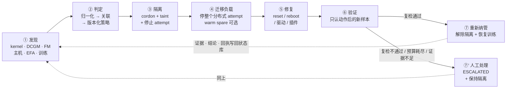
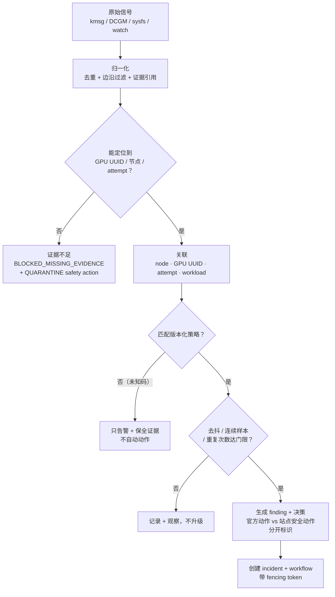
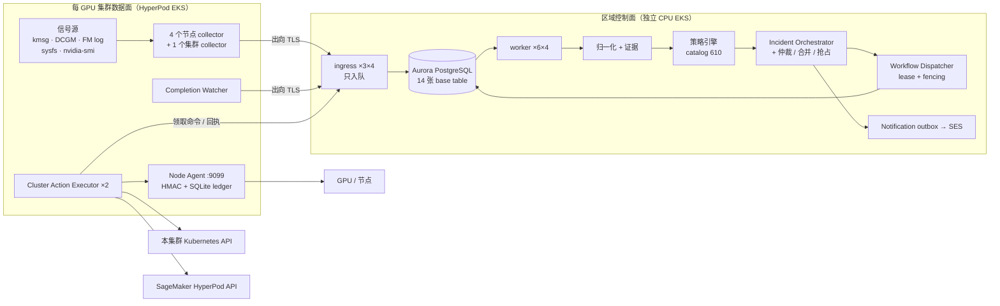
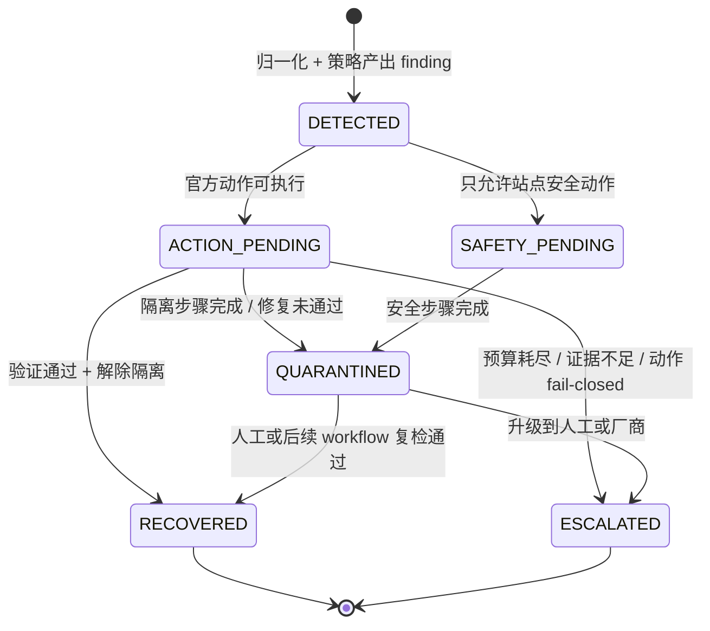
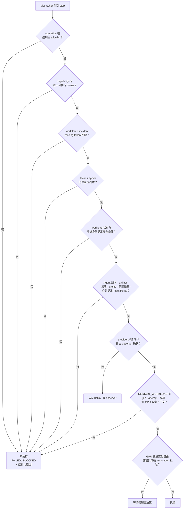

# GPU 故障处理系统概要设计（v2 闭环视角）

## 0. 这一版是什么、和 v1 什么关系

[概要设计](概要设计.md)（下称 v1）按"约束 → 架构 → 流程 → 部署 → 安全"组织，
回答的是"这套系统的生产边界在哪里"。本文按**故障闭环**组织：

```text
发现 → 判定 → 隔离 → 迁移负载 → 修复 → 验证 → 重新纳管 / 人工处理
```

回答的是"一个故障从出现到消失，每一环由谁做、做到什么程度、做不到时停在哪里"。

两份文档的事实基线是同一份代码（0.10.0），不存在"v2 描述了新功能"的情况。
写这一版的动因是：只按模块讲，读者容易把"能采到指标"当成"能修好机器"；
按闭环讲，每一环缺什么会直接暴露出来。
本文最近一次按源码、生成清单和测试契约逐项核对的日期为 **2026-08-27**。

**分工与优先级：**

| 内容 | 以哪份为准 |
|---|---|
| 四条方案级硬约束（§2.1 v1）、上线门禁（§10 v1） | **v1**。这两章是外部引用契约，被验收用例文档按编号映射，本文只引用不重述编号 |
| 部署形态清单、交互拓扑三张图、组件-凭证表 | **v1** §1.3、§4.1.1、§7 |
| 模块内部实现、表结构、端点清单、状态机细节 | [详细设计](详细设计.md) |
| 闭环每一环的能力边界、故障分类矩阵、事件模型字段、状态机映射、测试覆盖 | **本文** |

**本文的三条写作规则**（读的时候按这个标准要求它）：

1. 每一条能力都标注**当前实现状态**：已实现 / 已实现但受限 / fail-closed / 未实现。
   "枚举值存在"、"清单里有占位符"、"配置项可设"都**不算**已实现。
2. 凡是本文给出的设计意图与代码不一致，一律按代码写，并在 §11 单列一条差异。
3. 不复制单次压测或真机执行结果。门槛写在本文，实测值以
   [性能压测验收方案](性能压测验收方案.md)与私有证据库为准。

---

## 1. 目标与范围

### 1.1 闭环七阶段



与 v1 §2 的五阶段是同一条链的不同切分：v1 的"④ 受控执行"在本文拆成
③ 隔离、④ 迁移负载、⑤ 修复三环，因为这三环的**能力成熟度差异很大**——
隔离几乎全部已实现，修复只有一部分能真实执行，迁移负载依赖客户是否备了 warm spare。

**闭环的两个入口。** 常态入口是 ①（信号先到）；另一个入口是训练进程先死、
再回查原因（v1 §5.2 被动终态流程），它从 ② 进入闭环，缺少 allocation 时
直接跳到 ⑦'。

### 1.2 环境范围

| 环境 | 状态 | 说明 |
|---|---|---|
| SageMaker HyperPod EKS | **唯一生产交付形态** | 区域级多集群分离部署，见 v1 §7.1 |
| 单集群一体化 EKS | 历史过渡 | 迁移起点与有限 Canary，未经同等级验收 |
| 通用 Kubernetes | **未实现** | 清单已从公开树移除；枚举值与占位 manifest 不表示支持 |
| HyperPod Slurm | **不支持** | 无 scheduler adapter、无隔离证据回读、无 workload stop/restart；纳管前置检查应拒绝 |
| EC2 裸集群 | 未实现 | 核心领域模型不依赖 Kubernetes，但没有对应执行路径 |
| 开发与仿真 | 已实现 | 内存存储 + `GPU_FAULT_EXECUTOR_MODE=simulation`，不执行真实动作 |

### 1.3 厂商与设备范围

**只支持 NVIDIA。** 全库对 ROCm、amdgpu、amd-smi、XGMI、Intel XPU Manager
的引用数为零。所有信号源（kernel XID、Fabric Manager SXID、DCGM 字段、
NVML 温度与降频原因、`nvidia-smi` UUID 枚举）与所有设备动作
（GPU reset、全 GPU/NVSwitch reset、Fabric Manager restart）都是 NVIDIA 专有的。
多厂商适配需要新增设备适配层实现，不是配置项。

**故障粒度。** 四级粒度中三级已实现：

| 粒度 | 状态 | 主标识 |
|---|---|---|
| 节点 | 已实现 | `cluster_id + node_id`，另带 `node_instance_id` 与 agent generation 防替换后混淆 |
| 物理 GPU | 已实现 | **GPU UUID**；PCI BDF 仅作证据字段，不作主键 |
| NVLink / NVSwitch 互联 | 已实现 | SXID + access/trunk 故障域 + NVLink pattern（32 位 `0/1/-`） |
| MIG 实例（GI/CI） | **未实现** | 只在解析 Pod 可见 UUID 时接受 `MIG-` 前缀的取值；没有 MIG 级故障类型、没有 GI/CI 字段、没有 MIG 爆炸半径计算 |

**EFA/RDMA 作为第五类设备**单独成一族（AWS 特有）：inventory 数量、流量异常、
驱动修复、device plugin 重启都有独立路径，见 §2.1。

### 1.4 自动化程度分级

不是"全自动"或"只告警"的二选一，而是逐动作分级。真实分级如下：

| 级别 | 动作 | 状态 |
|---|---|---|
| 只告警 | AdvisoryNotification + SES 邮件 | 已实现，是所有级别的公共底座 |
| 证据保全 | `FREEZE_EVIDENCE`、`COLLECT_DIAGNOSTIC_BUNDLE`、`COLLECT_HUNG_TRIAGE`、`RUN_DCGM_DIAGNOSTIC` | 已实现 |
| 隔离 | `MARK_UNSCHEDULABLE`、`QUARANTINE`、`RESTORE_SCHEDULING` | 已实现 |
| 停/恢复训练 | `STOP_WORKLOADS`、`RESTART_WORKLOAD`、`CHECKPOINT_WORKLOADS` | 已实现（Job / PyTorchJob / JobSet） |
| 设备级修复 | `RESET_GPU`、`RESET_ALL_GPUS_NVSWITCHES`、`QUIESCE_GPU_SERVICES`、`RESTORE_GPU_SERVICES`、`VERIFY_NO_GPU_CLIENTS` | 已实现，签名下发；安装器裸默认关闭 reset，当前 HyperPod 生产安装显式开启 |
| Fabric Manager 修复 | `RESTART_FABRIC_MANAGER` | 已实现；节点侧有独立开关，当前 HyperPod 生产安装显式开启，并在执行前验证无 compute client、执行后验证服务 active |
| 节点级修复 | `RESTART_NODE`（HyperPod `BatchRebootClusterNodes`） | 已实现，受 `ALLOW_HYPERPOD_REBOOT` 控制；当前区域数据面生产清单为 true |
| 软件面修复 | `REMEDIATE_EFA_DRIVER`、`RESTART_EFA_DEVICE_PLUGIN`、`RESTART_GPU_DEVICE_PLUGIN` | 已实现 |
| 站点脚本修复 | `REMEDIATE_DRIVER`、`UPDATE_SOFTWARE_FIRMWARE` | 已实现但配置门禁；默认不加入 workflow，必须显式配置适用 SXID、目标版本、绝对路径命令与 SHA-256 |
| 人工步骤 | `CHECK_MECHANICALS`、`ESCALATE_SUPPORT` | 已实现；前者等待精确 annotation，后者生成合成 ticket ID、持久通知并可发 SES；没有外部工单系统 |
| 运维维护 | `COLLECTOR_OUTBOX_MAINTENANCE` | 已实现；`gpu-fault-admin collector-outbox` 把节点本地 `gpu-fault-collector outbox {stats,list,requeue-dead}` 作为单步 NODE_ACTION 工作流送到节点，只回传元数据，严格拿锁、无远程 `--force`（ARCH-G2） |
| 节点替换 | `REPLACE_NODE` | **只走 warm spare**；永不调用 `BatchReplaceClusterNodes`（v1 §2.1 约束 2） |
| 规划占位 | `RESTART_VM` | 不在生产 allowlist；HyperPod EKS 只在受控映射成立时把 NVIDIA `RESTART_VM` 转为 `RESTART_NODE` |

`src/gpu_fault/models.py` 的 `WorkflowOperation` 共 33 个取值；生产控制面
`GPU_FAULT_ALLOWED_OPERATIONS` 白名单收了 32 个（见
`deploy/control-plane/regional/generated/`），节点侧
应用裸默认的 `GPU_FAULT_NODE_ALLOWED_OPERATIONS` 只有 `VERIFY_NO_GPU_CLIENTS`；
节点安装脚本在启用 Agent 时写入 11 项基础 operation，再按 EFA、Field Diagnostic、
驱动和固件能力追加。生产 HyperPod 安装还显式开启 GPU reset、fabric reset、
服务静默和 Fabric Manager restart。
**白名单里有 ≠ 能真实执行**：还要该 capability 有唯一可执行 owner（§7.1）。

### 1.5 不在范围内

| 不处理的对象 | 系统实际怎么做 |
|---|---|
| 纯应用 OOM、被 kill 的用户进程 | 日志规则识别 `out of memory` / `oom-kill` / `killed process` 并归到 host/系统日志族，不当作 GPU 硬件故障；warm spare 侧 `src/gpu_fault/spare_health.py` 把非硬件原因归类为 `CONFIGURATION`，只置 `SUSPECT` 并推迟，不触发硬件修复 |
| 模型代码错误、超参问题 | 不做因果分析；表现为训练终态失败且 allocation 完整时发起快速诊断，诊断无硬件结论则不自动重启 |
| 训练框架性能调优 | 只采集 step/吞吐/loss/checkpoint 通道（`TrainingProgressCollector` 当前未部署） |
| 长期日志与指标存档 | collector 本地 NDJSON outbox 只保证事件补交，不是日志平台；长期存档需外接 CloudWatch/S3/共享存储 |
| MIG 分区管理 | 见 §1.3 |

### 1.6 SLO 与验收指标的真实现状

**已定义门槛**（[性能压测验收方案](性能压测验收方案.md) §6，压测口径）：

| 指标 | 门槛 |
|---|---|
| P0（XID/SXID、incident、workflow）接收率 | 未达硬上限时 100%，`429` = 0 |
| P0 API p99 | 必须记录并与本轮批准的延迟预算比较；不设统一固定否决线 |
| processor 稳态最老等待时间 | < 5 s |
| 单节点故障首个隔离 step p99 | < 10 s |
| 多节点故障首个隔离 step | < 聚合窗口 + 10 s |
| 突发结束后队列回到稳态 | 60 s 内 |
| duplicate claim / stale fencing write / PostgreSQL deadlock | 均为 0 |

**已定义但不是 SLO 的时间常数**（配置默认值，用于判定而非承诺）：
Agent 心跳 30 s、90 s 过期；collector 静默阈值 `GPU_INVENTORY` 180 s、
`GPU_METRICS` 420 s、`HOST_TELEMETRY` 420 s；workflow lease 180 s；
dispatcher 5 s 一轮、单批 100 个 workflow。

**未定义**（建议提出但代码与文档都没有对应度量）：

| 缺失指标 | 现状 |
|---|---|
| 故障发现时间（signal→finding 端到端） | 各段有指标，无端到端 SLO 定义 |
| 误隔离率 | 无分母定义（"本不该隔离"没有判定源），`/metrics` 无对应计数 |
| 自动恢复成功率 | 已导出 workflow 终态、步骤结果和耗时；正式 SLO 分母仍待批准 |
| 重新纳管正确率 | 已导出 readmission/workload-restart milestone；复发窗口 SLO 仍待批准 |
| 事件丢失率 | outbox dead-letter 有计数，但没有折算成丢失率的口径 |

这五项是本次建议里**最值得先补的部分**，因为它们决定"闭环是否真的闭合"，
而当前只能证明"每一段都没超时"。

---

## 2. 故障分类与策略矩阵

### 2.1 七个故障族

按信号源和处置方式分族。同一族内共享判定入口与动作阶梯起点。

| 族 | 信号源 | 采集者 | 典型判定 | 起始动作 |
|---|---|---|---|---|
| GPU 硬件（XID） | `/dev/kmsg` | `KernelLogCollector` | 固定版本 XID Catalog 逐码规则 | 按 catalog：从 `RUN_DIAGNOSTICS` 到 `RESET_GPU` / `RESTART_NODE` |
| NVSwitch / NVLink（SXID） | Fabric Manager file/journal | `FabricManagerLogCollector` | SXID catalog + access/trunk 故障域 + 产品代际门禁 | `RESET_ALL_GPUS_NVSWITCHES`（H200）或节点 reboot |
| 温度、功耗与降频 | DCGM / NVML | `DcgmMetricsCollector` | GPU 85/90 ℃、显存 90/95 ℃ 双阈值；降频原因位掩码；功耗比 0.95 | 连续 2 个样本越 critical 线才升级到隔离 |
| 互联与网络（EFA/RDMA） | 主机 sysfs、EFA 流量 | `HostTelemetryCollector` | inventory 数量比对 + 流量状态机（8 态） | inventory 不符 → 隔离链；流量异常 → 先取证 |
| 掉卡（GPU/EFA ACTIVE inventory） | `nvidia-smi` UUID 数 + EFA 端口 `4: ACTIVE`+`5: LinkUp` | `HostTelemetryCollector` | 按节点 instance-type 的期望值，连续异常达门限 | 完整隔离-重启-验证链，见 v1 §5.4 |
| 主机与软件栈 | journal、MCE、存储、NIC | `HostTelemetryCollector`、`NodeLogCollector`（默认禁用） | 多规则命中仲裁 + 持续隐患状态机 | 多为告警与取证；MCE 等升级到隔离 |
| 监控失联（Unknown） | 控制面反向判定 | 控制面 60 s 扫描 | ACTIVE 且 heartbeat lease 仍有效的通道超过静默阈值 | AdvisoryNotification + 邮件；**不视为健康** |
| 训练侧（终态与 hang） | Kubernetes watch、EFA 零流量 | `CompletionWatcher`、EFA 流量状态机 | 唯一 TerminalEvent；`HUNG_SUSPECTED`；空闲 pass（完整 list 后零个在跑 managed Pod、零个活跃 attempt）另发覆盖心跳 `POST /v1/attempts/coverage`（内置最多每 120 s 一条），让空闲集群判为 IDLE 而不是 UNKNOWN；忙集群由观测流本身证明 watcher 活着 | 终态走 containment；hang 走**只读取证链**。匹配 marker 时诊断类 marker（取证/诊断/验证）不使其 incident 拥有作业恢复，terminal 走快速诊断 |

上表只给每族的起点。每条主机/DCGM 规则的阈值与动作、172 个 XID 和全部 SXID 码的
NVIDIA 官方建议、本方案判定与编译出的步骤链，逐项列在
[故障类别与处置动作总表](故障类别与处置动作总表.md)。

上表只给每族的起点。每条主机/DCGM 规则的阈值与动作、172 个 XID 和全部 SXID 码的
NVIDIA 官方建议、本方案判定与编译出的步骤链，逐项列在
[故障类别与处置动作总表](故障类别与处置动作总表.md)。

PCIe 只覆盖到 `pcie_replay_total` / `DCGM_FI_DEV_PCIE_REPLAY_COUNTER`
计数与 `pci_bdfs` 证据字段，**没有 AER / PCIe link 故障判定路径**（§11）。

### 2.2 严重级别与动作阶梯

`Severity` 四级：`info` / `warning` / `critical` / `fatal`。
严重级别不直接决定动作，动作由**全局唯一的强弱序阶梯**决定：

```text
RUN_DIAGNOSTICS < RESTART_WORKLOAD < RESET_GPU < RESET_ALL_GPUS_NVSWITCHES
< RESTART_NODE < DRAIN/QUARANTINE < REPLACE_NODE
< CHECK_MECHANICALS/ESCALATE_SUPPORT
```

该阶梯在 `src/gpu_fault/operation_registry.py` 里以 `recovery_rank` 表达，
跨类型仲裁、workflow 合并、抢占和失败升级都用它比较，不在各模块另写一份。

### 2.3 策略是版本化数据，不是硬编码

这一点与建议一致，且已实现得比建议更严：

| 机制 | 实现 |
|---|---|
| XID 规则 | `src/gpu_fault/data/nvidia-xid-catalog-610.generated.yaml`，由 `tools/generate_nvidia_xid_policy.py` 从官方文档生成 |
| 版本固定 | `src/gpu_fault/policy/catalog_integrity.py` 把 catalog version 钉死在 `610`，不匹配即拒绝加载 |
| SXID 规则 | `src/gpu_fault/data/nvidia-fabric-manager-sxid-2025-11-14.yaml`，按日期版本化 |
| 产品代际门禁 | 规则带产品家族条件；非适用代际返回 `NOT_APPLICABLE` 并生成固定模板通知，而不是套用别代规则 |
| 决策可追溯 | 每个决策带 `catalog_version`；策略引擎的报错信息里包含 catalog 版本 |
| 重复升级 | `report_if_repeated`、`field_diag_if_repeated` 两组 XID 集合定义"首次只报告、重复才升级"的行为 |
| NVLink pattern 校验 | catalog 加载时校验每个 pattern 必须为 32 位 `0/1/-`、errorStatus 必须为十六进制列表；畸形 catalog 阻止进程启动 |

**驱动/固件维度尚未进入策略键。** 当前策略键是"XID/SXID 码 + 产品家族
（+ 是否重复）"，没有"驱动版本 → 规则集"的映射；驱动版本只以 pin 的形式
参与 fleet 兼容性判断（§9.6）。见 §11。

### 2.4 判定链



三个"不动手"的出口（`U`、`A`、`W`）是设计上的常态分支，不是异常：
未知故障、缺少 allocation、能力所有者冲突或证据不足时停止自动动作，
是 v1 的设计原则之一。

### 2.5 监控失联必须是 Unknown

建议特别强调"监控失联不能视为健康"，这一条已实现且有一个容易踩的坑：
控制面只对**ACTIVE 且 heartbeat lease 仍有效**的通道判静默。历史上仍标 ACTIVE
但 lease 已过期的节点不参与指标或邮件告警——否则已退役节点会形成永久静默误报。
同一节点、collector、channel 每小时最多一封邮件。

---

## 3. 总体架构（闭环视角）

### 3.1 全景数据流



三条必须记住的边界（详见 v1 §4.1、§4.1.1）：跨边界连接**全部由 GPU 集群侧发起**；
控制面不持有任何 GPU 集群的 kubeconfig；`region + cluster_id` 是一切资源、
事件、租约和动作的隔离键。

### 3.2 进程清单速查

| 侧 | 组件 | 副本 × 进程 | 是否修改环境 |
|---|---|---|---|
| 控制面 | ingress `gpu-fault-api-ha` | 3 × 4（:8080） | 否，只入队 |
| 控制面 | `gpu-fault-control-worker` | 6 × 4（:8081） | 否（区域形态下不直连集群） |
| 控制面 | `gpu-fault-telemetry-spool-worker` | 0（:8082，按需扩） | 否 |
| 数据面（节点） | metrics / kernel / host / fabric-manager collector | 每节点 4 个 systemd 单元 | 否 |
| 数据面（节点） | node-agent | 每节点 1 个，:9099 | **是**（默认关闭 reset） |
| 数据面（集群） | cluster-action-executor | 2 | **是** |
| 数据面（集群） | completion-watcher / node-resource-collector / node-installer-reconciler | 各 1 | watcher 仅紧急兜底时改 workload |

"ingress Pod Ready"不代表有人在消费队列——两者只通过 Aurora 队列交接工作。
判读队列健康要看 worker 角色。

### 3.3 为什么故障事件流与 Prometheus 分离

建议里明确提出这一点，实现与之一致，但边界比建议描述的更窄：

- **修复流程的事实来源是 Aurora**：incident、workflow、step、回执、fencing token、
  证据引用都在状态库里，重放与审计只依赖它。
- **AMP/ADOT 只覆盖控制面自身指标**，且是可选增强。没有 AMP 的 region 设
  `GPU_FAULT_ENABLE_AMP=false`，安装脚本跳过 AMP/ADOT 资源。
- **业务告警不走 Prometheus**：collector 静默、workflow 结果和故障通知走
  控制面 Aurora outbox + SES 邮件。ADOT→AMP→Alertmanager→SNS 与 SES 是
  两条独立路径，不互为备份。
- 因此"时序库丢点"不影响修复决策，"Aurora 不可用"才影响。

---

## 4. 模块设计：建议的九个模块落在哪里

建议列了九个模块。逐个映射到真实代码位置，并补上建议没提但实际存在的六个。

| 建议模块 | 真实实现 | 状态 |
|---|---|---|
| 设备适配层（厂商 SDK） | `src/gpu_fault/collectors/`、`src/gpu_fault/dcgm_fields.py`、`src/gpu_fault/gpu_metrics.py` | 已实现，**仅 NVIDIA**；`NvidiaSmiMetricsCollector` 是无 DCGM 时的替代实现，与 DCGM 模式互斥 |
| 节点代理（Node Fault Agent） | `src/gpu_fault/node_agent/` | 已实现。注意职责拆成两半：**采集**由 4 个 collector 做，**执行**由 node-agent 做，二者是不同进程 |
| 资产与拓扑服务 | `src/gpu_fault/fleet.py`、`KubernetesNodeResourceCollector`、`src/gpu_fault/hyperpod_spares.py`、NVSwitch 拓扑缓存 | 已实现 |
| 事件归一化 | `src/gpu_fault/app/ingest/`、各 collector 的边沿过滤 | 已实现 |
| 关联分析 | `src/gpu_fault/policy/`（XID companion 关联）、`src/gpu_fault/completion_controller.py` 及其拆出的 `completion_pod_parsing.py` / `completion_delivery.py` / `completion_reconcile_loop.py`（attempt 关联） | 已实现 |
| 策略引擎 | `src/gpu_fault/policy/engine.py` + `catalog.py` + `catalog_integrity.py` | 已实现，版本化数据驱动 |
| 工作流执行器 | `src/gpu_fault/orchestration/`、`src/gpu_fault/execution/`、`src/gpu_fault/adapters/` | 已实现 |
| 验证模块 | `VALIDATE_GPU` / `VALIDATE_HOST` / `VALIDATE_FABRIC` + `RUN_DCGM_DIAGNOSTIC` | 已实现，强制用新样本（§7.7） |
| 审计与事件存储 | `src/gpu_fault/store/`、`src/gpu_fault/control_record_archive.py` | 已实现 |

建议没提但闭环或生产生命周期缺不了的六个：

| 模块 | 作用 | 为什么必须单列 |
|---|---|---|
| Fleet Registry + 兼容性策略 | `src/gpu_fault/fleet.py`、`src/gpu_fault/fleet_compatibility.py` | 决定"这个节点的 agent 版本/摘要/代际是否允许接命令"。pin 不匹配时所有 node action fail closed |
| Restart Guard | 控制面预检原子预留重启预算，数据面比对授权 + 前后 GPU 数量校验 | 抗震荡的主力，见 §6.6 |
| 仲裁与 DAG 分支 | `src/gpu_fault/orchestration/arbitration.py`、`dag_branching.py` | 同节点多故障并发时的合并、抢占与 `SUPERSEDED`，见 §6.5 |
| Notification outbox + Dispatcher | `src/gpu_fault/notification_service.py`、`src/gpu_fault/notifications/` | 邮件必须与 workflow 结果解耦：SES 故障不能反向改变 step 结果 |
| Regional Cluster Registry + Remote Command | `src/gpu_fault/regional.py`、包 `src/gpu_fault/cluster_executor/`（`regional_client` / `lease` / `dispatch` / `executor` / `bootstrap` 五层） | 跨信任边界下发协议，是"控制面不持有 kubeconfig"的落地方式 |
| Installation Resource Registry | `src/gpu_fault/installation_resources.py`、`src/gpu_fault/admin/resource_registry.py` | 记录 AWS 资源的稳定身份、归属、删除策略、依赖和状态，使部署、接管、移除集群与全站卸载使用同一事实源 |

---

## 5. 故障事件模型

### 5.1 稳定标识

建议要求"用 UUID/BDF 稳定标识而非可变 GPU 序号"。实现比这更进一步，
因为节点也会被替换：

| 层级 | 主标识 | 防混淆手段 |
|---|---|---|
| GPU | **GPU UUID** | 不使用 `nvidia-smi` 的可变 index；PCI BDF 只作证据字段 |
| 节点 | `cluster_id + node_id` | 另存 `node_instance_id`（实例替换后变化）与 agent **generation** |
| Agent | cluster + node + generation | 旧 generation 被 revoke 后写入一律拒绝（fencing） |
| 训练 | `cluster_id + attempt_id` | attempt 代际时间栅栏，防旧 attempt 的迟到事件驱动新 attempt |
| 集群 | `cluster_id` | 与认证身份绑定，payload 不一致返回 403 |

### 5.2 建议字段逐条核对

| 建议字段 | 实现情况 |
|---|---|
| `event_id` | 有，且是幂等键 |
| 发生/上报时间 | 有；kernel 事件另带 sequence、boot ID、monotonic timestamp |
| `node_id` | 有 |
| GPU UUID | 有，主标识 |
| PCI BDF | 有（`pci_bdfs`），证据字段 |
| MIG / GI / CI | **无**（§1.3） |
| 厂商错误码 | 有（XID / SXID 码，带 catalog 版本） |
| 统一故障类型 | 有，但表达为"族 + 规则 + finding 类型"的组合，没有单一扁平 `fault_type` 枚举 |
| 严重级别 | 有（`Severity` 四级） |
| 影响范围 | 有：`OperationScope`（NODE / GPU）、`node_wide`、`node_exclusive`、`merged_gpu_scope` |
| 关联 Pod / Job / attempt | 有（workload topology + attempt observation） |
| 原始证据引用 | 有（`RawEvidenceRecord`，默认保留 24 h / 每节点 10000 条） |
| 出现次数 | 有（重复计数驱动 `report_if_repeated` 等升级） |
| 建议动作 | 有，且**官方动作与站点安全动作分开标识** |
| 策略版本 | 有（`catalog_version`） |
| 修复任务 ID | 有（`incident_id` + `request_id` + `command_id`） |
| 当前状态 | 有，但分三个状态机而不是一个（§6.1） |

### 5.3 领域对象与隔离键

主要领域对象与幂等键见 v1 §6.1（11 个对象，含不带 `cluster_id`、按
`site_id + resource_key` 建键的 `InstallationResource`）。必须以
`(region, cluster_id, …)`
建键的对象清单见 v1 §6.2。这里只强调一条**判读规则**：
凡是只用集群内 ID（node name / job ID / attempt ID）建键的地方都是缺陷，
因为两个集群使用相同名字是上线门禁要专门验证的场景（v1 §10 第 2 条）。

---

## 6. 状态机

### 6.1 实际是三个状态机，不是一个

建议给的是一条单链
`Healthy→Suspected→Quarantined→Draining→Repairing→Validating→Healthy`。
实现把它拆成三个正交状态机 + 若干局部去抖状态，这是**有意的**：
"机器的处置阶段"和"这次执行到第几步"生命周期不同，合并会导致重放歧义。

| 状态机 | 取值 | 归谁 |
|---|---|---|
| `IncidentState` | `DETECTED` / `ACTION_PENDING` / `SAFETY_PENDING` / `QUARANTINED` / `RECOVERED` / `ESCALATED` | 一次故障的处置阶段 |
| `WorkflowStatus` | `PENDING` / `SAFETY_PENDING` / `BLOCKED` / `RUNNING` / `SUCCEEDED` / `FAILED` / `SUPERSEDED` | 一条执行计划的推进状态 |
| `EfaTrafficSignal` | `WARMUP` / `NORMAL` / `SPIKE` / `DROP` / `ZERO_PENDING` / `ZERO_WARNING` / `HUNG_SUSPECTED` / `RECOVERED` | 单个 node+attempt 的流量健康 |
| `SpareHealthState` | `HEALTHY` / `SUSPECT` / `REBOOT_PENDING` / `RECHECKING` / `UNAVAILABLE` | warm spare 可用性 |
| 远端命令 | `PENDING` / `LEASED` / `WAITING` / `SUCCEEDED` / `FAILED` | 跨边界一次下发 |



### 6.2 建议状态 → 实际状态映射

| 建议状态 | 实际对应 | 说明 |
|---|---|---|
| Healthy | 无 incident，或 `RECOVERED` 且已 `RESTORE_SCHEDULING` | 没有显式 "Healthy" 记录；健康是"没有活跃 incident + marker 有效" |
| Suspected | `DETECTED`，以及各族的去抖窗口（连续样本计数、`ZERO_PENDING`、`SpareHealthState.SUSPECT`） | 建议的一个状态在实现里按族分散成多个去抖器，因为门限口径不同 |
| Quarantined | `QUARANTINED`（+ 节点上 `gpu-fault.io` taint） | 一致 |
| Draining | **无独立状态**。隔离 = cordon + taint + `STOP_WORKLOADS`，不调 Eviction API（§7.4） | 建议的 Draining 在实现里是 `ACTION_PENDING` 中的一个 step，不是节点状态 |
| Repairing | `ACTION_PENDING` + `RUNNING` workflow | 一致 |
| Validating | `VALIDATE_*` step 处于 `RUNNING`/`WAITING` | 一致 |
| ManualRepair | `ESCALATED` | 一致 |
| Retired | `ESCALATED` + 保持隔离 + agent revoke | **没有"退役"终态**：节点不会被销毁（约束 2），表现为永久隔离 |

### 6.3 幂等性与控制器重启恢复

建议要求"幂等性与控制器重启后的恢复"。实现的五道机制：

1. **入口幂等**：API、事件与工作流均按稳定 ID 幂等处理；被动终态路径在同一存储
   事务里创建 incident + workflow + event 索引，PostgreSQL 按 event key 取事务级
   advisory lock，多副本并发只有一个创建成功，其余返回同一 workflow。
2. **执行幂等**：远端命令按内容摘要去重，回执用同一幂等键；重复回执不产生第二次
   副作用，**包括不产生第二封邮件**。
3. **无 leader**：不选举全局 service leader（这与建议 §9 的 "Leader Election" 不同）。
   每个 worker 进程都跑 dispatcher 和 correlation finalizer，靠
   workflow execution lease / epoch、correlation lease、lane lease + fencing 仲裁。
   进程崩溃后 lease 到期由其他进程接管，旧 owner 的提交被拒绝。
4. **状态只在原子事务里推进**：step、workflow、incident 一起更新，
   不存在"step 成功但 workflow 没动"的中间态。
5. **Processor 重试持久化调度**：408/425/429/5xx 在 300 秒年龄内写回
   `not_before` 与递增的 `retry_count`，按 1 秒起步、30 秒封顶的指数退避重试。
   `STRICT` 请求等待时仍阻塞同 lane；只有 latest-wins priority 100 请求标记为
   `REORDERABLE`，允许后续安全样本越过。停机时已 claim 但未开始的请求会主动释放。

### 6.4 互斥、合并与并发上限

| 要求 | 实现 |
|---|---|
| 同节点单一互斥修复 | `operation_registry` 的 `node_exclusive` + `node_wide` 标记；同节点破坏性动作不并行 |
| 同节点多故障合并 | `src/gpu_fault/operation_registry.py` 声明 `MERGE_INTENT_OPERATIONS` 与每个 operation 的 `merge_intent`；`src/gpu_fault/orchestration/arbitration.py` 据此算出 `merged_gpu_scope` |
| 抢占（更强动作压制更弱动作） | `src/gpu_fault/orchestration/dag_branching.py` 按 `recovery_rank` 计算 `superseded_step_indexes`（字段定义在 `src/gpu_fault/models.py`），被压制的 step 进 `SUPERSEDED` 终态 |
| 多节点同一 attempt 的联动 | 聚合窗口内形成**一个** workflow；各节点通过 barrier 执行 reset，整个训练任务只恢复一次 |
| 修复并发上限 | workflow lease 同事务领取 Region、cluster、node、failure domain、resource class 持久预算；executor 侧另有 `max_concurrent_commands=5` |
| Processor completion 数据库并行度 | `GPU_FAULT_PROCESSOR_COMPLETION_CLUSTER_CONCURRENCY` 只并行不同 cluster 的完成事务，范围为 `1..min(8, PostgreSQL pool max size)`；生产为 1，**不等于修复动作并发上限** |
| 每项破坏性能力单 writer | Runtime Profile 编译期拒绝破坏性能力的多 writer 与 `AUGMENT` |

### 6.5 抗震荡（防"故障—恢复"反复）

这是建议里点到但很容易被低估的一环，实现有五层：

| 层 | 机制 |
|---|---|
| 采集侧 | 边沿过滤 + 连续样本确认（如降频/温度需连续 2 个样本越线） |
| 判定侧 | `report_if_repeated` / `field_diag_if_repeated`：首次只报告，重复才升级 |
| 执行侧 | `COOLDOWN_AND_VALIDATE` 与 `DRAIN_AND_QUARANTINE` 两条分支：先冷却复检，复检仍失败才隔离 |
| 预算侧 | 同一 `cluster_id/job_id` 共享**持久化** restart budget；耗尽即升级人工。文档明确写了"不要直接提高 restart budget 掩盖重复故障" |
| 通知侧 | 按小时桶去重（`GPU_FAULT_HOST_NOTIFICATION_COOLDOWN_SECONDS`）；瞬时 GPU warning 有独立 cooldown；**只有状态转换才生成 finding 和邮件**，停在同一状态的持续异常不重复上报 |

### 6.6 失败后是否保持隔离

保持。这是 fail-closed 的直接推论：动作失败、证据不足、能力无 owner、
pin 不匹配、lease 过期，一律停在未执行/失败状态并**保留** `gpu-fault.io` taint，
incident 停在 `QUARANTINED` 或 `ESCALATED`。系统从不"清理不掉就放行"。

反向操作只有两条路径：workflow 的 `RESTORE_SCHEDULING` step，
或管理员显式动作（§8.2）。

---

## 7. 修复安全设计

### 7.1 执行门禁

每次 step 执行必须**同时**满足九条，任一不满足即不推进（fail-closed，不是跳过）：



### 7.2 操作前的设备占用检查

建议要求"操作前检查活动进程与设备占用"。这是独立的 workflow operation，
不是动作内部的一句判断：

- `VERIFY_NO_GPU_CLIENTS`：重新检查 compute client 与设备文件持有者。
  这是节点侧**默认唯一**被允许的 operation。
- `QUIESCE_GPU_SERVICES` / `RESTORE_GPU_SERVICES`：reset 前后成对停/起本机 GPU 服务。
- GPU reset **默认关闭**，且执行前再检查一次占用（提交时检查 + 执行前复检）。
- warm spare 侧同样检查："active gpu resource pods exist" / "active gpu clients"
  会被归类为 `CONFIGURATION` 原因并推迟，不当作硬件故障。

### 7.3 影响范围计算

| 维度 | 实现 |
|---|---|
| GPU 级 vs 节点级 | `OperationScope`；`node_wide` 表示动作影响整节点 |
| 多 finding 合并后的 GPU 集合 | `merged_gpu_scope` |
| NVSwitch 故障域 | access / trunk 分域；NVLink pattern 32 位解码；缺完整 GPU inventory、fabric partition、quiesce 状态或无客户端证据时**保持 blocked** |
| 多节点联动 | 同一 attempt 的多节点 SXID 在聚合窗口内合成一个 workflow + barrier |
| MIG 爆炸半径 | **未实现**（§1.3） |
| P2P / NVLink 拓扑对同节点其他 GPU 的影响 | 通过 NVSwitch 故障域与"全 GPU/NVSwitch reset"表达，没有独立的 P2P 影响图 |

### 7.4 "Drain" 的真实语义

这一条与建议差异最大，必须写清楚，否则会按错误的前提设计后续功能。

**实现的隔离 = cordon（`MARK_UNSCHEDULABLE`）+ 自有 taint（`QUARANTINE`）+
`STOP_WORKLOADS`。全库不调用 Kubernetes Eviction API，没有 `kubectl drain`
等价物，因此不存在"PodDisruptionBudget 导致 drain 卡住"这一类问题，
也没有针对关键业务 Pod / 系统 Pod / DaemonSet 的驱逐策略。**

对应地：

- 停止训练是按 workload 对象（Job / PyTorchJob / JobSet）patch + 标记终止 Pod，
  作用域是**受管训练任务**，不是节点上所有 Pod。
- 集群 executor 的 RBAC 是：`nodes` get/list/watch/**patch**（无 delete）；
  `pods` get/list/watch/patch/**delete**；`jobs`/`pytorchjobs`/`jobsets`
  get/list/watch/patch/create（无 delete）。见 `deploy/dataplane/cluster-action-executor.yaml`。
  其中 pod delete 用于 `RESTART_*_DEVICE_PLUGIN`（删 `kube-system` 下的
  DaemonSet Pod 让它重建）与停止训练时标记终止 Pod。
- 本方案**只写自有** `gpu-fault.io/*` taint 与 annotation，
  从不删除 provider 自有的 taint，也不写任何 `sagemaker.amazonaws.com/*`
  label 或 taint（避免误触发托管恢复）。

> v1 §8.3 写的"Kubernetes RBAC 不授予 Node/Pod 删除权限"对 Node 成立，
> 对 Pod 不成立。以本节为准，并见 §11 第 12 条。

### 7.5 白名单与人工审批

| 门 | 实现 |
|---|---|
| 自动动作白名单 | 控制面 `GPU_FAULT_ALLOWED_OPERATIONS`（生产 32 项）+ 节点 `GPU_FAULT_NODE_ALLOWED_OPERATIONS`（应用裸默认 1 项；安装器写入 11 项基础列表并按能力追加）。两层都不在白名单 → 不执行 |
| 高风险动作 | 应用/安装器裸默认关闭 GPU reset 与 HyperPod mutation；当前 HyperPod 生产安装显式开启 GPU reset、fabric reset、Fabric Manager restart 和 `RESTART_NODE`。`ALLOW_HYPERPOD_REPLACE` 与 `ALLOW_WITH_AUTOMATIC_NODE_RECOVERY` **恒为 false**（不变量，不是默认值） |
| 人工审批 | **GPU 数量变化**必须由管理员用精确 annotation 显式批准，否则 `RESTART_WORKLOAD` 等待；EFA 流量 baseline 变化由管理员 `ACCEPT_NEW_BASELINE`/`ACKNOWLEDGE_TRANSIENT` 确认 |
| 维护窗口 | 没有通用"维护窗口"概念。唯一类似机制是 SXID quiesce 期间允许固定 agent generation 在窗口内继续 |
| 人工与配置门禁 | `CHECK_MECHANICALS` 等待 annotation；`ESCALATE_SUPPORT` 生成合成 ticket ID 和持久通知；驱动/固件在站点命令或版本 pin 缺失时 fail-closed；Fabric Manager restart 在开关关闭、仍有 compute client 或服务验证失败时 fail-closed |

### 7.6 Dry-run 的真实现状

**建议要求的 dry-run（预演不落地）没有实现。** 容易误认的两个入口：

- `POST /v1/workflows/{request_id}/simulate` 与
  `POST /v1/recovery-plans/{plan_id}/simulate`：**会写状态库**。它校验 fencing
  token 后把 workflow 直接推到 `SUCCEEDED`（或 `SAFETY_PENDING` → `BLOCKED`）、
  把 incident 推到 `RECOVERED`（或 `QUARANTINED`），只是不调用任何 adapter。
  它是仿真/开发形态的快进开关，**不能在生产上当预演用**。
- `GPU_FAULT_EXECUTOR_MODE=simulation`：整个部署形态级的仿真，同样不是
  "生产环境里预演单个动作"。

发布侧另有真正的 dry-run（`src/gpu_fault_release/rollout.py`
与训练提交 CLI），但那是运维工具的能力，不在故障修复路径上。

### 7.7 修复后的主动诊断与观察窗口

| 机制 | 实现 |
|---|---|
| 验证必须用新样本 | `VALIDATE_GPU` / `VALIDATE_HOST` / `VALIDATE_FABRIC` 必须使用动作完成后产生的**新** HostTelemetry/指标样本；重启前的缓存样本不能通过 |
| 主动诊断 | `RUN_DCGM_DIAGNOSTIC`、`RUN_FIELD_DIAGNOSTIC`、`COLLECT_DIAGNOSTIC_BUNDLE`；结论 `PASS` / `FAIL` / `INCONCLUSIVE` / `NO_ACTION` |
| 观察窗口 | 表达为"冷却 + 复检"（`COOLDOWN_AND_VALIDATE`）与去抖计数，而非一个显式的 "observation window" 状态 |
| 恢复顺序 | 验证通过才 `RESTORE_SCHEDULING`，再 `RESTART_WORKLOAD`；顺序不可交换 |
| 只读取证链 | `HUNG_SUSPECTED` 走全程只读的取证链（零流量既可能是 hang，也可能是正常的数据加载或 checkpoint 区间），**不动机器** |

---

## 8. 接口与集成

### 8.1 API 面

`create_app()` 始终挂载 **84 条应用路由**；区域生产形态在这组路由上启用
"每条路由显式声明桶"的默认拒绝模型。五桶
`public` / `metrics` / `cluster-token` / `dual-credential` /
`execution-token` 当前分布 1 / 1 / 36 / 7 / 39。新增路由未声明桶，
应用装配期即启动失败；运行期取不到桶一律 403——但**没有任何路由匹配的路径答 404**
（`ExplicitAuthorizationRegistry.route_exists`）：采集器 outbox 把 404 判为死信、把 403 当
token 轮换瞬态无限重放，2026-09-10 NET-008 的 retired-channel 记录曾因此永不死信。

建议关心的三类 API 都有，生产部署生命周期另有一组管理接口：

| 建议的 API | 实际入口 |
|---|---|
| 故障事件上报 | `/v1/gpu-events/*`、`/v1/collector-events/*`（7 条采集通道）、`/v1/provider-events/*` |
| 健康状态查询 | `/v1/collector-status/*`、`/v1/collector-readiness/{cluster_id}`、`/v1/gpu-health-findings/*`、`/v1/gpu-metrics/*`、`/v1/fleet/agents*` |
| 手工隔离/恢复/终止 | 见 §8.2 |
| AWS 安装资源生命周期 | `/v1/installation-resources`、`/sync`、`/{site_id}/{resource_key:path}`，全部为 execution-token |

### 8.2 人工介入面（真实清单）

| 目的 | 入口 |
|---|---|
| 手工推进/执行一条 workflow | `POST /v1/workflows/{request_id}/execute`（execution-token） |
| 写入可信健康标记 | `POST /v1/markers` |
| 让某节点 agent 退出服务 / 吊销 / 恢复 | `POST /v1/fleet/agents/{cluster_id}/{node_id}/drain` `/revoke` `/reactivate` |
| 滚动发布与波次控制 | `/v1/fleet/deployments*`、`/next-wave`、`/v1/fleet/barriers*` |
| 通知补发 / 立即派发 | `POST /v1/advisory-notifications/{id}/send`、`POST /v1/advisory-notifications/dispatch` |
| EFA 流量误报确认 / 接受新 baseline | `POST /v1/efa-traffic/admin-actions`（`ACKNOWLEDGE_TRANSIENT` / `ACCEPT_NEW_BASELINE`） |
| 查询重启预算 | `GET /v1/restart-budgets/{cluster_id}/{job_id}` |
| 查询/同步/推进 AWS 安装资源状态 | `GET /v1/installation-resources`、`POST /sync`、`PUT /{site_id}/{resource_key:path}` |
| 批准 GPU 数量变化 | 节点 annotation（精确值），不是 API |
| 区域运维（领取/续租/回执、spare 健康、证据与通知回写） | `/v1/regional/*` 共 14 个端点 |

**缺口：没有"手工隔离某节点"的一等 API**。人工隔离当前靠创建/推进 workflow 或
直接在集群里 cordon+taint（后者绕过状态库，不推荐）。也没有"终止正在跑的
workflow"的显式端点——只能等它 fail-closed 或被更强动作 `SUPERSEDED`。

### 8.3 与 Kubernetes 的集成面

| 建议的集成点 | 实现 |
|---|---|
| Node taint | **写**，但只写自有 `gpu-fault.io` QUARANTINE_TAINT；不删 provider 自有 taint |
| Node label / annotation | 写自有 annotation（含安装标记）；`sagemaker.amazonaws.com/*` 只读 |
| NodeCondition | **只读**。不写 NodeCondition（与建议不同，见 §11） |
| Kubernetes Event | **不写**。所有对外可见结论走 API + 邮件，不写 Event 对象 |
| Device Plugin / 调度器设备禁用 | 只能**整体重启** GPU/EFA device plugin DaemonSet Pod；**没有 GPU 级"标记单卡不可用"的注入能力**。单卡故障的实际隔离粒度是整节点 |
| CRD（FaultEvent / RemediationPolicy / RemediationRun） | **没有任何 CRD**。API 是 REST + Aurora；这是有意选择：状态库要跨集群共享，CRD 只在单集群内 |

### 8.4 通知与工单

- **邮件是唯一的业务通知通道**：Aurora outbox + Notification Dispatcher + SES。
  业务处理只创建幂等 notification；dispatcher 用 owner/epoch/lease claim 并
  指数退避；旧 epoch 不能完成新 lease，**SES 故障不能反向改变 workflow step 结果**。
- **没有 webhook、Slack、PagerDuty、Jira 集成**。SNS 只出现在
  AMP/Alertmanager 侧，覆盖控制面自身指标，不是故障通知通道。
- **"工单"目前是本地合成的标识**：`src/gpu_fault/adapters/support_escalation.py`
  生成 `vendor-ticket-<incident_id>` 并写进邮件正文，**不调用任何工单系统 API**。
  邮件里出现 "Ticket ID" 时，它是一个可供人工引用的关联串，不是外部工单号。
- 低利用率与同类告警必须按节点/任务聚合，不能按 GPU 数量线性增长（上线门禁项）。

---

## 9. 非功能设计

### 9.1 高可用

- **无 leader election**（与建议不同）。active-active 消费 + lane 租约 + fencing，
  见 §6.3 第 3 条与 v1 §4.3。
- PDB 按角色分设：ingress `minAvailable=2`（3 副本），
  control-worker 与 spool-worker `maxUnavailable=1`。
- Aurora 是共享一致性点；控制面不允许每 Pod 独立 SQLite。
  Aurora failover 期间不得重复执行破坏性 step（上线门禁项）。
- 单个 GPU 集群离线、凭证泄露或数据面异常不影响其他集群，也不能让控制面
  对其他集群的处理停滞。

### 9.2 节点断网与本地保护

| 机制 | 实现 |
|---|---|
| collector 本地缓存 | 每个 collector 子命令独立的有界 NDJSON outbox：瞬时失败自动重放，永久 4xx 进 dead-letter，默认单文件最多 1000 条 |
| 请求体上限 | NodeLog 每批默认 ≤1000 条 / 4 MiB，单条 ≤64 KiB；processor 入队请求体默认 ≤16 MiB；超限返回 413 |
| Node Agent 防重放 | HMAC envelope + 命令 TTL + 目标节点校验 + agent generation + incident fencing token + 本地 SQLite ledger |
| 控制面长时不可达 | Completion Watcher 才执行带 `passive-stop-mode=emergency-fallback` 标记的紧急 suspend；正常路径不直接改 workload |
| 边界 | outbox 是容量受限的补交机制，**不是无限期队列**。长时间离线超容量仍需外部告警与人工介入 |

注意这里与建议的"节点断网时本地快速保护"不同：**节点侧不会自主隔离自己**。
唯一的本地自主动作是紧急 suspend（集群内 watcher，不是节点 agent），
其余动作全部要控制面授权 + 签名。这是刻意的单 writer 设计。

### 9.3 安全

- 传输与身份：私有 CA 服务端 TLS + 每集群 ≥32 字节随机 Bearer Token +
  请求 `cluster_id` 必须与 token 注册身份一致；控制面只存 SHA-256 摘要，
  常量时间比较。**当前不启用 mTLS**（NLB 终止 TLS，后端拿不到客户端证书），
  这是已接受的阶段性风险。
- 授权：五桶默认拒绝模型（§8.1）。
- 节点动作：独立 HMAC envelope，不复用 API execution token；节点密钥 ≥32 字符、
  文件权限 `0600`。
- 事件模型 Pydantic `extra=forbid`，拒绝未知字段。
- `/metrics` 只在直连 loopback 免鉴权，因此禁止 `FORWARDED_ALLOW_IPS`
  和信任代理头——否则任何请求都能自称 loopback。
- 最小权限：`ses:SendEmail` 只给控制面 SA；GPU 集群侧不给。
- 审计：CloudTrail 出现任何 `BatchReplaceClusterNodes` **一律视为异常**
  （约束 2 带来的收益：断言从"要区分调用方"简化为"必须为空"）。

### 9.4 保留期与容量

**保留期**（默认值，均可用环境变量覆盖，完整表见[环境变量参考](环境变量参考.md)）：

| 数据 | 默认保留 |
|---|---|
| 原始证据 | 24 h，且每节点最多 10000 条 |
| attempt observation / fleet deployment / node action / diagnostic | 7 天 |
| GPU finding 历史、热状态 latest/terminal | 30 天 |
| GPU metrics batch / processor lane / remote command | 24 h |
| processor completed | 600 s |
| fault action 最大年龄 | 900 s |
| GPU inventory 最大年龄 | 180 s |
| SXID inventory / NVSwitch 拓扑 | 600 s / 300 s |

**容量折算规则**（最容易算错的一条）：后台线程和数据库连接是**每 uvicorn 进程**
各一份，必须按"每进程值 × 每 Pod 进程数 × 副本数"折算，不能按 Pod 数折算。
control-worker 的处理槽位是 6 × 4 × 24 = 576。`--limit-max-requests` 之类的
retire-first每进程回收会瞬时移除服务容量，因此生产 ingress/worker 均禁止使用；
进程生命周期只由受检 rollout、Pod replacement 和 liveness 管理。

**背压**：区域总未完成队列与单集群未完成队列双限，超限不入库返回
`429 Retry-After`；两个上限各预留 40% 给 priority=0 的故障路径，
普通遥测不能占用该预留。Store I/O 准入超时返回 `503 Retry-After`。

**重试与完成阶段容量**：retryable 回放不是立即重排，而是把下一次可领取时间持久化，
避免热循环占满 lane 和数据库；严格请求仍保序，latest-wins routine 请求才允许越过。
completion 按 cluster 分事务，生产默认串行提交；并行度 2/4 只用于通过真实 PostgreSQL
压力门禁后的灰度，且受连接池大小约束。

**已知瓶颈层**：吞吐天花板落在控制面**进程内 Store I/O admission 排队**，
不在数据库 ACU。容量设计与压测必须分别覆盖准入锁与配额、ordering lane 退化、
热路径全 kind 扫描与 JSONB 解码、HTTP 进程数 × 连接池乘法四类，
详见详细设计 §2.18.5 与[性能压测验收方案](性能压测验收方案.md)。

### 9.5 监控系统自身的健康

| 对象 | 手段 |
|---|---|
| collector 是否还在上报 | 控制面 60 s 扫描 + 三档静默阈值 + AdvisoryNotification 邮件（§2.5），不依赖 AMP |
| Agent 是否健康 | 心跳 30 s / 90 s 过期 + readiness + 版本/摘要/代际校验 |
| 队列是否有人消费 | `/metrics` 暴露队列深度、最老等待时间、每集群积压、处理耗时、拒绝计数；PrometheusRule 对积压/延迟/拒绝/p95 告警 |
| Store I/O 是否饱和 | `/metrics` 暴露 in-flight、配置容量、rejection；90% 饱和或任何 rejection 告警 |
| 通知与闭环 | `/metrics` 导出 workflow 终态/步骤/耗时、闭环 milestone、通知结果/outbox、预算等待和 stale Agent |

### 9.6 兼容矩阵与灰度

建议要求"驱动、固件、GPU 型号兼容矩阵"和"升级回滚灰度"。实现的是**另一种**
兼容矩阵——以摘要 pin 为中心，而不是以版本区间为中心：

| 维度 | 实现 |
|---|---|
| Agent / Executor 制品一致性 | `src/gpu_fault/fleet_compatibility.py` 与 `src/gpu_fault/regional_compatibility.py`；Agent/Executor 均校验 protocol、物理 artifact SHA 和组件 compatibility digest |
| pin 不匹配的行为 | fail closed。控制面 pin 领先于机队（`PIN_AHEAD_OF_FLEET`）会让所有 node action 失败——所以发布顺序是"先装节点，再更新控制面 pin" |
| 灰度 | fleet deployment 的 wave + barrier + `next-wave` 显式推进；revoke/drain/reactivate 逐节点控制 |
| 回滚 | schema 只向前（无 down migration），靠 `dual` 双写模式过渡；新版本上线前必须确认旧版本进程仍能读新 schema |
| GPU 型号 | 有两处：策略侧的产品家族门禁（B100/B200/H200 等），inventory 侧的实例类型 → GPU/EFA 期望值表（未知机型必须显式配置，否则节点安装失败） |
| 驱动 / 固件版本 | **没有版本兼容矩阵**。XID catalog 钉在 610，DCGM 字段集固定；驱动版本不参与策略选择，也没有"driver ≥ X 才允许某动作"的门禁 |

---

## 10. 测试与验收

### 10.1 用例目录

机器可读的用例目录是 `testcases/fault-scenarios.yaml`，入口是
`tools/run_fault_test_cases.py`。当前 **296 条显式用例 + 2 个按 XID catalog
逐码生成的用例族**（`xid_catalog_rules` 生成器，覆盖 catalog 里每个 XID，
另有 B200 上下文变体），展开后 640 条，共 49 个 category。

风险分级（下表只统计 296 条显式用例，决定能不能在真机跑）：

| risk | 条数 | 含义 |
|---|---:|---|
| `non-destructive` | 176 | 纯软件链路，可无条件执行 |
| `read-only-signal-replay` | 35 | 只重放信号，不动环境 |
| `live-non-destructive` | 27 | 真机执行但不改变状态 |
| `destructive` | 20 | 必须人工批准 |
| `live-service-action` | 19 | 真机服务级动作 |
| `live-kernel-log-injection` | 3 | 真机写 kmsg |
| `live-workload-restart` | 7 | 真机重启训练 |
| `live-isolation` | 3 | 真机隔离 |
| `destructive-provider-reboot` | 3 | 真机 provider reboot |
| `destructive-warm-spare` | 2 | 真机 warm spare 替换 |
| `live-node-mutation` | 1 | 真机改节点 |

### 10.2 建议的注入清单 vs 实际覆盖

| 建议的注入场景 | 覆盖情况 |
|---|---|
| 模拟 XID / ECC | **已覆盖**，且是逐码覆盖（XID catalog 全量 kmsg 格式重放 + B200 变体 + XID 154 + companion XID + NVLink5 decode） |
| 模拟温度异常 | 已覆盖（`gpu-metrics` 25 条、`host-health` 5 条） |
| 指标失联 / 杀 DCGM / Device Plugin / 驱动进程 | **部分覆盖**：`regional-collector` 17 条覆盖静默与失联判定；杀 DCGM/device plugin 进程的注入不在公开目录里 |
| 掉卡与 PCIe/NVLink 异常 | 掉卡已覆盖；NVLink 已覆盖（`xid74-nvlink` 15 条、`sxid-*`）；**PCIe AER 未覆盖**（也未实现，§11） |
| Drain 超时 / Pod 无法驱逐 | **不适用**：没有 Eviction 路径（§7.4）。对应的等价场景是 `STOP_WORKLOADS` 失败与 workload 读不到 |
| 控制器修复中重启 | 已覆盖（`regional-high-availability` 7 条、`regional-preemption` 31 条含 lease 接管） |
| 重复与乱序事件 | 已覆盖（幂等、`attempt-generation-fence` 8 条、`regional-remote-command` 16 条含重复回执） |
| 修复失败人工接管 | 已覆盖（`destructive-acceptance`、`regional-destructive-acceptance` 各 7/15 条） |
| 多节点同时故障 | 已覆盖（`cross-fault-arbitration` 6 条、三节点聚合与 reset、双节点 SXID quiesce 租约） |

### 10.3 验收指标现状

有门槛的见 §1.6 上表；没有度量的五项也在 §1.6 下表。
上线门禁的逐条清单与验证步骤见 v1 §10 与
[区域模式端到端验收测试用例](区域模式端到端验收测试用例.md)——
**该章条目的内容与顺序是外部引用契约**，本文不复制其编号。

真机 XID 验证按"重放 → 单节点 → 多节点 → 真实驱动产生"四级递进，
分级与安全边界见[故障模拟测试手册](故障模拟测试手册.md) §7。

---

## 11. 建议与当前实现的差异

按"是否影响闭环闭合"排序。前 6 条会改变系统能力边界，后面几条是表达或集成方式差异。

| # | 建议 | 当前实现 | 影响 | 处置建议 |
|---:|---|---|---|---|
| 1 | 多厂商（NVIDIA / AMD / Intel），XGMI 互联 | **仅 NVIDIA**，零 AMD/Intel/XGMI 代码 | 非 NVIDIA 机队完全不可用 | 需要新增设备适配层实现；不是配置项。当前不要在文档里承诺多厂商 |
| 2 | MIG 实例（GI/CI）粒度与 MIG 爆炸半径 | 只接受 `MIG-` 前缀 UUID 作为标识，**无 MIG 故障模型** | 用 MIG 切分的集群，单卡故障只能整节点隔离 | 若客户用 MIG，需要补 GI/CI 字段与影响范围计算 |
| 3 | Dry-run | `/simulate` **会写状态库**并把 workflow 推到终态；没有生产可用的预演 | 误以为可以预演会造成状态污染 | 要么明确禁用生产环境的 `/simulate`，要么新增真正只读的 plan-preview |
| 4 | GPU 级设备禁用（Device Plugin / 调度器） | 只能整体重启 device plugin DaemonSet Pod | 单卡故障的实际隔离粒度是**整节点**，容量损失被放大 8 倍 | 评估接入 device plugin 的单卡 unhealthy 注入 |
| 5 | 误隔离率、事件丢失率、端到端发现时延 | workflow/notification/readmission 指标已补；这三项仍缺统一分母或 signal→finding 时间线 | 仍不能完整量化检测质量 | 补分母定义和 signal/finding milestone |
| 6 | PCIe（AER / link）故障判定 | 只有 `pcie_replay_total` 计数与 `pci_bdfs` 证据字段 | PCIe 链路降级/掉链无判定路径 | 若有真实案例，按"温度/降频"那套阈值+去抖模式补一族 |
| 7 | 写 NodeCondition | NodeCondition **只读** | 外部系统看不到本方案的判定；调度器无法据此决策 | 写 NodeCondition 会引入第二个 writer，与单 writer 原则冲突；建议保持只读，改为暴露查询 API |
| 8 | CRD（FaultEvent / RemediationPolicy / RemediationRun） | **无 CRD**，REST + Aurora | 无法用 `kubectl get` 看故障 | 有意选择：状态库跨集群共享，CRD 只在单集群内。若要 CRD，只能做只读投影 |
| 9 | 控制面 Leader Election | **无 leader**，lane 租约 + fencing + active-active | 无（这是更强的设计：没有单 leader 吞吐瓶颈，也没有 leader 抖动） | 保持现状，但文档要明确写"没有 leader"，否则排障时会去找不存在的 leader |
| 10 | Drain 策略（关键 Pod / 系统 Pod / DaemonSet） | 不调 Eviction API；隔离 = cordon + taint + 停受管训练任务 | 节点上的非受管 Pod 不受影响 | 这是刻意收窄的爆炸半径。若要真 drain，需要重新评估 RBAC 与 PDB 交互 |
| 11 | 工单系统集成 / Webhook | `vendor-ticket-<incident_id>` 是**本地合成串**，只写进邮件；无 webhook | 需要人工把邮件转成工单 | 若要集成，在 notification outbox 上加 channel，而不是在业务路径上加调用 |
| 12 | —（v1 自身的表述缺陷） | v1 §8.3 "RBAC 不授予 Node/Pod 删除权限"对 Node 成立、对 Pod 不成立（executor 有 `pods delete`） | 评审时会误判权限面 | 按本文 §7.4 修正 v1 §8.3 的措辞 |
| 13 | 驱动 / 固件 / GPU 型号兼容矩阵 | 有产品家族门禁与实例类型期望值表，但**没有驱动/固件版本矩阵**；catalog 钉死 610 | 换驱动大版本时策略适用性靠人判断 | 至少记录"已验证驱动版本"清单，并在 agent 心跳里回传驱动版本用于比对 |
| 14 | "手工隔离/恢复/终止工作流" API | 有 marker、agent drain/revoke/reactivate、workflow execute；**没有一等的"隔离某节点"与"终止 workflow"端点** | 人工操作要么绕状态库，要么等 fail-closed | 补两个显式端点，比让人 `kubectl taint` 更安全 |
| 15 | 观察窗口作为显式状态 | 表达为冷却 + 去抖计数，无显式状态 | 无功能影响，但运维看不到"正在观察中" | 可在 incident 上加派生字段暴露 |

**没有差异、且实现强于建议的四处**，评审时不必再讨论：

1. 策略版本化：建议要求"不硬编码"，实现做到了"生成 + 钉版本 + 完整性校验 +
   畸形即拒绝启动"。
2. 幂等与恢复：建议要求"控制器重启可恢复"，实现是 lease + epoch + fencing +
   单事务推进，且重复回执连邮件都不重发。
3. 单 writer：建议要求"同节点单一互斥修复"，实现把它上升为"每项破坏性能力
   只能有一个 writer"，并在 Runtime Profile 编译期强制。
4. 抗震荡：建议提了一句，实现有五层（采集去抖 / 重复升级 / 冷却复检 /
   持久化预算 / 通知去重）。

---

## 12. 相关文档

- [概要设计](概要设计.md)——硬约束、部署形态与上线门禁的权威来源
- [详细设计](详细设计.md)——模块级实现、表结构与协议细节
- [部署和运维手册](部署和运维手册.md)——部署、升级、回滚与排障步骤
- [区域模式端到端验收测试用例](区域模式端到端验收测试用例.md)——上线门禁逐条验证
- [故障模拟测试手册](故障模拟测试手册.md)——故障注入入口与真机验证分级
- [性能压测验收方案](性能压测验收方案.md)——容量模型、门槛与证据格式
- [NVIDIA 策略供应链与实现](components/nvidia-policy.md)——Catalog 来源与运行时门禁
- [环境变量参考](环境变量参考.md)——全部配置项与默认值（生成物）
