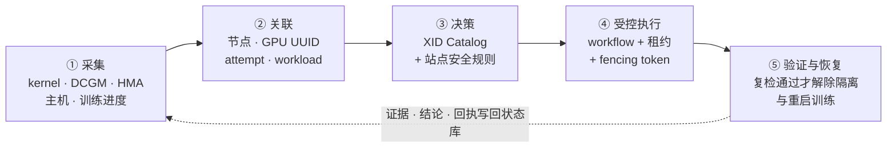
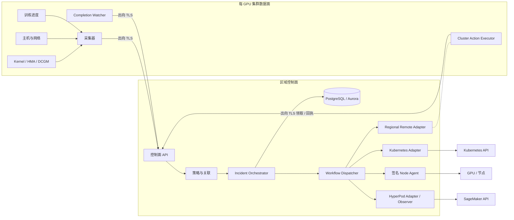
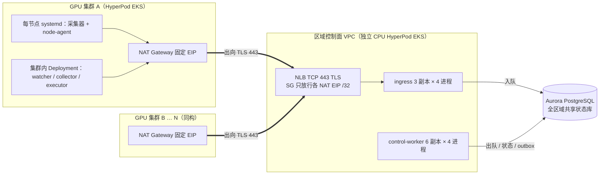
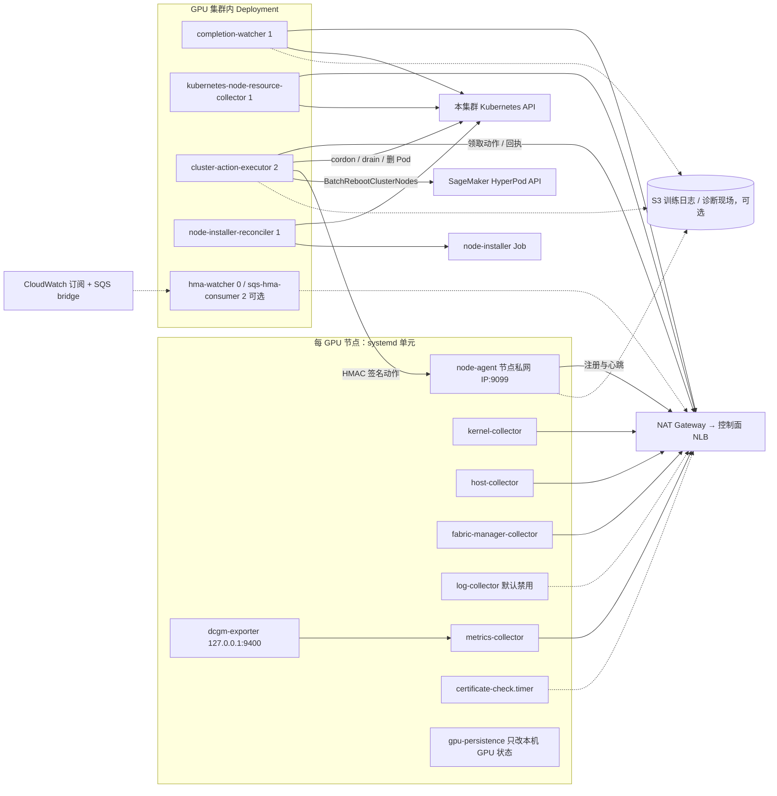
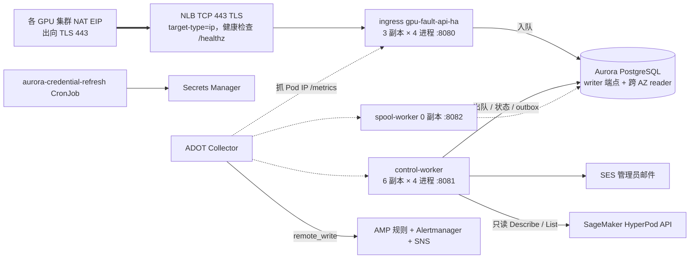
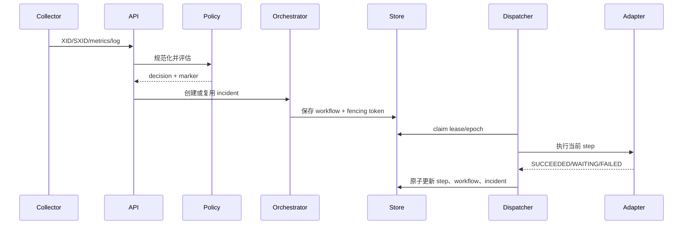
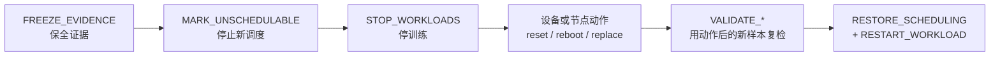
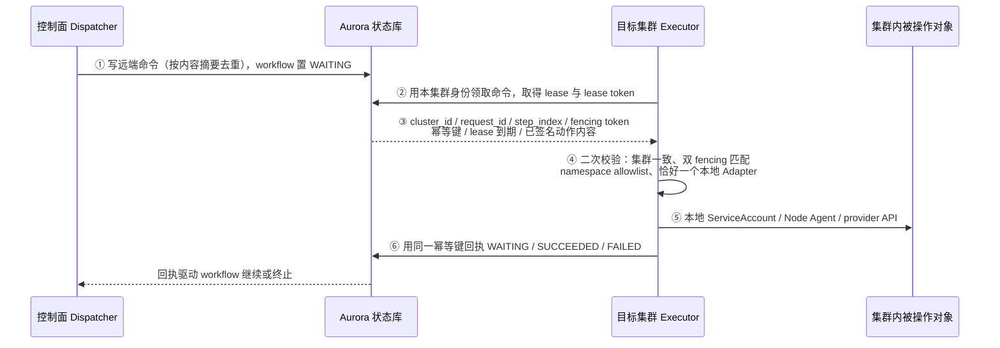

# GPU 故障处理系统概要设计

## 1. 文档信息

### 1.1 基本信息

| 项目 | 内容 |
|---|---|
| 系统名称 | GPU Fault Control Plane |
| 代码版本 | 0.10.0 |
| 事实核对日期 | 2026-08-27（以当前 `main` 的源码、生成清单和测试契约为准） |
| 语言与框架 | Python 3.12、FastAPI、Pydantic |
| 适用环境 | Kubernetes、EKS、SageMaker HyperPod EKS；核心模型可扩展到 EC2、Slurm |
| 文档依据 | `src/gpu_fault`、`deploy`、`config`、`pyproject.toml` |

### 1.2 读者与阅读路径

本文写给要在这套系统上开发、评审或排障的工程师，回答四个问题：系统做什么、
由哪些进程组成、一次故障从发现到恢复经过哪些环节、哪些事情被约束成不许做。
模块内部实现、表结构、端点清单和状态机细节不在本文，在
[详细设计](详细设计.md)。

推荐阅读顺序：

| 你的目的 | 读这些 |
|---|---|
| 先建立整体印象 | §2 开头的闭环五阶段 → §3 系统上下文 → §5.1 主动故障流程 |
| 要动代码 | §4 总体架构 → §5 全部流程 → 转[详细设计](详细设计.md) 对应模块 |
| 要部署或接管运维 | §4.1.1 交互拓扑 → §7.1 区域形态 → [部署和运维手册](部署和运维手册.md) |
| 要评审安全边界 | §2.1 硬约束 → §4.1 信任边界 → §8 安全设计 |
| 要判断"能不能上线" | §10 上线门禁 → §11 当前边界与风险 |

阅读时的三个约定：

- **"已实现"指代码路径存在且有单元/集成测试覆盖**，不代表已在真实 HyperPod
  环境验收。需要区分的地方本文会显式标注成熟度。
- 本文描述当前代码已经实现的系统，不把 `README.md` 里的长期规划视为已交付功能。
- §10 的条目内容与顺序是**外部引用契约**（被验收用例文档按编号映射），
  改动前先看该节末尾的说明。

### 1.3 交付边界（读正文之前必须知道的三件事）

**第一，当前只交付一种生产部署形态**：区域级多集群分离部署
（`GPU_FAULT_DEPLOYMENT_MODE=regional`），即一个 AWS Region 一套独立 CPU
控制面，纳管该 Region 内一个或多个 HyperPod EKS GPU 集群。其余形态的定位：

| 形态 | 定位 | 详见 |
|---|---|---|
| 区域级多集群分离 | **唯一生产交付形态** | §7.1 |
| 单集群一体化 | 历史过渡、迁移起点、有限 Canary；未经区域形态同等级验收 | §7.2 |
| 通用 Kubernetes | **未实现**；枚举值、示例清单或占位 manifest 不表示已支持 | §7.3 |
| 单副本 Canary | 历史设计参考，清单已移除 | §7.4 |
| 开发与仿真 | 只验证 API 与策略，不执行真实工作流 | §7.5 |

systemd 是区域 GPU 数据面节点上 Collector/Agent 的**安装方式**，不是独立部署架构。

**第二，能真实执行的动作是有限集合，且"已实现"不等于"无条件启用"**。当前可真实
执行 Kubernetes 节点隔离、Job/PyTorchJob/JobSet 停止与恢复、签名 GPU reset、
全 GPU/NVSwitch reset、Fabric Manager restart、受控 HyperPod reboot，以及固定模板
的 support escalation。机械检查已实现为通知 + incident/fencing annotation 确认的
`WAITING` step，不会自动 cordon 或停止健康 workload。驱动与固件修复也有真实执行器，
但只有站点显式配置适用 SXID、目标版本、绝对路径命令和 SHA-256 后才加入 workflow；
配置或前置条件不满足时才 fail-closed。

**第三，区域形态的成熟度是"代码已实现，真实环境上线门禁未全部通过"**（见 §10）。

## 2. 系统目标与硬约束

系统面向多机多卡训练，把"发现 GPU 故障—判断影响范围—恢复训练"这件事从人工
操作变成一条可审计、可幂等重放的自动闭环。闭环分五个阶段，全系统的模块都可以
归到其中一个阶段里：



对应的建设目标：

1. 从 kernel、DCGM、HMA、主机指标、日志和训练进度发现故障。
2. 将 XID/SXID 与节点、GPU UUID、训练 attempt 和 workload 关联。
3. 按固定版本的 NVIDIA XID Catalog 和站点安全规则形成处置建议。
4. 在单写者、权限白名单、租约和 fencing token 约束下执行恢复。
5. 判断训练 attempt 终态，避免分布式 rank 重复恢复。
6. 保存短期原始证据、incident、workflow、执行回执和 Agent 状态。
7. 在一个 Region 内以单一控制面纳管多个 GPU 集群及其多个训练任务。
8. 控制面与被管 GPU 集群进程隔离、身份隔离、故障域隔离。

设计原则（后面每一处设计都能追溯到其中一条）：

- 先保全证据和隔离，再执行破坏性操作。
- NVIDIA 官方动作与站点安全策略分开标识。
- GPU UUID 是设备主标识，节点名和实例 UID 用于防止节点替换后的身份混淆。
- 未知故障、缺少 allocation、能力所有者冲突或证据不足时停止自动动作。
- API、事件与工作流均按稳定 ID 幂等处理。
- 每项破坏性能力只能有一个 writer。
- 同一 `cluster_id/job_id` 共享持久化 restart budget。
- 重启前 GPU 数量变化或无法确认时等待管理员决策。
- `region + cluster_id` 是一切资源、事件、租约和动作的隔离边界。
- 控制面不持有被管 GPU 集群的 kubeconfig；跨集群动作只能由该集群自己的执行器拉取执行。
- 控制面不因为部署在某个 EKS 中，就把该 EKS 视为受管 GPU 集群。

其中"每项破坏性能力只能有一个 writer"这一条在 HyperPod 环境里被收紧成四条
方案级硬约束，它们决定了后续所有形态、开关和 profile 的取值，因此先讲约束，
再讲架构。

### 2.1 强制约束：受支持的运行形态

这是**方案级硬约束**，不是可配置选项：

1. **受管 GPU 集群的 `NodeRecovery` 必须为 `None`**（即禁用 HyperPod
   节点自动恢复）。`NodeRecovery=Automatic` 的集群**不在本方案支持范围内**。
2. **本方案在任何情况下都不调用 HyperPod 的 replace node 相关 API**
   （`BatchReplaceClusterNodes`）。不存在"经批准后可以调"的例外路径。
   节点替换只能走 warm spare：迁移到客户自备的热备 GPU 节点，
   故障实例保持隔离且不被销毁。
3. **HyperPod 的任务自动恢复必须禁用，任务自动恢复完全由本方案接管。**
   受管训练任务**不得**设置
   `sagemaker.amazonaws.com/enable-job-auto-resume=true`；
   Slurm 侧**不得**使用 `srun --auto-resume=1`。
   即 §2.3 语义表中只有"本方案是执行者"这一行是合规形态。
4. **只支持 HyperPod EKS 编排，暂不支持 HyperPod Slurm 编排。**
   受管集群的 `DescribeCluster.Orchestrator` 必须是 EKS；
   Slurm 编排的 HyperPod 集群**不在当前支持范围内**，纳管前置检查应拒绝。
   这是**当前实现边界**，不是永久设计决策——与约束 1~3 性质不同，
   后续补齐 Slurm 侧执行路径后可以放开。

#### 2.1.1 为什么是硬约束

**约束 1、2（节点替换）** 有两条独立成立的理由，任一条都足以支撑：

- **GPU 资源紧缺**：HyperPod 自动替换需要 provider 侧当场分配同规格 GPU 实例。
  在当前供给条件下这个分配很可能失败，于是"自动恢复"退化为
  "节点被摘掉、容量净减少、且没有替换上来"——比不做替换更糟。
  warm spare 用的是**客户已经持有并纳入监控**的节点，容量确定性完全不同。
- **实现复杂度**：托管替换是本方案之外的另一个 lifecycle writer。
  即使它成功，本方案也只能被动观测，且被动观测链存在真实缺口
  （见 §2.2 末段）。删掉这个模式即删掉一整类双写者与感知竞态。

**约束 3（禁用任务自动恢复）** 的理由是实现简洁性：托管任务恢复的控制循环在
AWS 托管侧，本方案既看不到它的重试计数，也无法与它共享 restart budget 和
checkpoint 门禁。让本方案独占任务恢复后，"节点 remediation 未完成前不恢复训练"
这条门禁才是唯一生效的门禁；否则托管侧可能在 incident 仍为 `QUARANTINED`
时就把任务拉起来。该约束由**部署期纳管前置检查**与**运行期 fail-closed 守卫**
两层落实，落实细节见 §2.3。

**约束 4（只支持 HyperPod EKS）** 的理由是实现现状：Slurm 侧的执行路径没有实现。
`src/` 全库对 Slurm 的引用只有三处，且都不是执行路径——
`models.py:19,21` 的 `Environment` 枚举值（`hyperpod-slurm`、`slurm`）、
`hyperpod.py:108-125` 的 `from_slurm_auto_resume()`（归属判断，且未接到运行时）、
以及 `watcher.py:149` 一句"Kubernetes/Slurm 通用"的注释。
**没有** Slurm scheduler adapter、没有 `scontrol` 隔离证据回读、
没有 Slurm workload stop/restart 执行器、没有 Slurm 侧的 Node Agent 部署路径。
因此凡是需要"隔离证据"或"任务停止/恢复"的动作在 Slurm 集群上都会 fail-closed
停在 `PENDING`/`BLOCKED`——是安全的，但不构成可用的恢复能力。
枚举值存在**不等于**该编排受支持，这是最容易误判的一点。

#### 2.1.2 由约束推出的不变量

以下每一条都必须同时成立，缺一不可。开发时改到相关开关、profile 或前置检查，
先回到这张表核对：

| 不变量 | 取值 / 要求 |
|---|---|
| `GPU_FAULT_ALLOW_HYPERPOD_REPLACE` | **恒为 `false`**。它不再是"默认关、按需开"的开关，而是不变量；不存在维护窗口内临时打开的合法场景 |
| `GPU_FAULT_ALLOW_HYPERPOD_REBOOT` | 仍可为 `true`——reboot 不销毁实例，不受本约束影响 |
| `GPU_FAULT_ALLOW_WITH_AUTOMATIC_NODE_RECOVERY` | **恒为 `false`**。它的作用是"在 `NodeRecovery=Automatic` 下仍允许提交 batch mutation"，而本约束已排除该前提 |
| Runtime Profile `nodeReplace` owner | 恒为 `gpu-fault-hyperpod-adapter`（`OWN`），**不得** `DELEGATE` 给 `hyperpod-managed-node-recovery` |
| Runtime Profile `workloadStop` / `workloadRestart` owner | 恒为本方案自建 adapter（`OWN`），**不得** `DELEGATE` 给 `hyperpod-managed-job-recovery` |
| 纳管前置检查（集群） | `DescribeCluster.NodeRecovery == "None"`，且 `DescribeCluster.Orchestrator` 为 EKS，否则拒绝纳管 |
| 纳管前置检查（任务） | 受管命名空间内训练任务不带 `sagemaker.amazonaws.com/enable-job-auto-resume=true`（Slurm 提交脚本不带 `--auto-resume=1`），否则拒绝纳管该任务 |
| CloudTrail 断言 | 出现任何 `BatchReplaceClusterNodes` **一律视为异常**，无论调用方是谁 |

最后一条是本约束带来的额外收益：审计断言从"要区分调用方"简化为"必须为空"。

纳管前置检查是**部署期/纳管期**动作；运行期另有一道等效守卫，在 adapter 写
workload 前重读 annotation 并 fail-closed（见 §2.3）。

`Environment` 枚举里的 `hyperpod-slurm` / `slurm` 只是数据模型取值，
**不表示这两种编排受支持**；本文所有 Slurm 相关描述
（`srun --auto-resume`、`scontrol show node` 隔离证据、
`State=FAIL Reason="Action:Reboot|Replace"`）
均为**协议参考与未来扩展说明**，不代表当前可用能力。

### 2.2 本约束移除了哪些原有分支

约束把原本的多分支形态收敛成唯一一条，历史分支在此登记，避免评审或改代码时
重新引入。

节点级：约束前文档描述过三种模式，现在只保留一种：

| 原模式 | `NodeRecovery` | 现状 |
|---|---|---|
| A：托管自动恢复，本方案纯 observer | `Automatic` | **已移除，不再支持** |
| B：本方案接管 + warm spare | `None` | **唯一支持形态** |
| C：本方案接管但无 warm spare | `None` | 支持，但只能隔离 + 告警，替换靠人工 |

任务级：约束 3 同样把两分支收敛为一种——
`enable-job-auto-resume=true`（委派给 HyperPod）**不再是合规形态**，
只保留"本方案接管任务恢复"。语义与代码链见 §2.3。

编排级：约束 4 把 HyperPod 的两种编排收敛为一种：

| 编排 | 现状 |
|---|---|
| HyperPod EKS | **唯一支持形态** |
| HyperPod Slurm | **暂不支持**（实现边界，非设计决策）；纳管前置检查应拒绝 |

因此本方案受支持的运行形态是**唯一的一条**：
HyperPod EKS 编排 + `NodeRecovery=None` + 任务恢复由本方案接管，
节点替换视有无 warm spare 走模式 B 或退化为模式 C。

被移除的模式 A 与任务级委派对应的代码路径
（`ManagedRecoveryObserverAdapter`、`HyperPodManagedRecoveryObserver`、
`HyperPodIdentityRegistry`）**保留在代码中**，但定位已变为
**fail-closed 兜底**而非运行形态：

- `ManagedRecoveryObserverAdapter` 只在 profile 里出现托管 owner 时才被命中。
  合规部署下 profile 的四项 owner 全是自建 adapter，故它**不应被触发**。
  保留它的价值是：若有人误把 profile 改成 `DELEGATE`，
  结果是"只观测、不动 Kubernetes"（安全侧失败），而不是"没人处理"。
- `HyperPodIdentityRegistry` 的身份台账在 warm spare 路径同样被使用
  （`hyperpod_spares.py:339-352`），与本约束无关，必须保留。

模式 A 被移除也顺带消除了一处已知缺口，记录在此以免日后重新引入该模式时忘记：
HyperPod **自发**替换节点（本方案没有对应 workflow）时，
后台身份刷新线程会正确更新 `instance_id` / `generation` / `retired_aliases`
（`managed_recovery.py:44-107`，默认 20 秒一轮），
但 `_retire_old_agent()` 与 `_isolate_replacement()`
**只在 `observe()` 内被调用**（`managed_recovery.py:283`、`:291` 是唯一调用点），
没有 workflow step 就都不会发生。后果是旧 agent 停在 `ACTIVE` 不被 fence、
新节点不经本方案校验直接进调度池；更具体地，若新实例上的 agent 沿用同一
`node_id` 注册，`fleet.py:392-424` 的 `same_instance_reboot` 因
`node_instance_id` 已变而为假，只要旧记录 lease 未过期且仍 `ACTIVE`
就会抛 `another agent incarnation holds the node lease`，
**新 agent 注册被拒直到旧 lease 自然过期**。
这道检查本身是对的（防脑裂），但它假定替换会经过 `observe()` 从而旧 agent 已被
revoke——自发替换恰好绕过该前提。

### 2.3 任务恢复归属：本方案独占

约束 3 之后，任务恢复归属不再是"按客户配置决定"的维度，而是固定的：

| `sagemaker.amazonaws.com/enable-job-auto-resume` | 谁重启训练任务 | 合规性 |
|---|---|---|
| 不设置 / `false` | **本方案** | **唯一合规形态** |
| `true` | HyperPod | **不合规**，纳管前置检查应拒绝；若漏过则运行期 fail-closed |

对应 profile：`workloadStop` / `workloadRestart` 恒为 `OWN`，
owner 为本方案自建 adapter。这与部署脚本当前的静态写死值一致
（`deploy/hyperpod/deploy.sh:1527-1530`、`:1579-1586`），
即**约束 3 把原先的一处实现缺口变成了符合约束的实现**——
部署脚本无条件填 `OWN`，而唯一合规形态正是 `OWN`。

**第一层落实：纳管前置检查。** 部署期/纳管期遍历受管命名空间拒收违规任务。
它是人工流程、会漏，所以必须有第二层。

**第二层落实：运行期 fail-closed 守卫。** `from_eks_annotations()` 的判断能力
已接到执行路径：`KubernetesWorkflowAdapter._set_workloads()` 在读到每个 workload
对象之后、在发出任何 patch 或标记终止 Pod 之前，调用
`_managed_job_recovery_conflict()` 用 `from_eks_annotations()` 复判 annotation；
只要有一个 workload 判成 `ENABLED`，该步骤直接 `FAILED`，details 带
`managed_job_recovery_workloads`、`required_annotation`、
`required_annotation_value` 与可直接执行的 `remediation_commands`
（`kubectl annotate … enable-job-auto-resume-`）。
`STOP_WORKLOADS` 与 `RESTART_WORKLOAD` 走同一入口，两者都被覆盖。

关于这道守卫，三点容易问到：

- **为什么放在这里**：该方法本来就要 `_read_workload()` 取到对象，annotation
  已在手上，既不需要新 RBAC 也不多一次 API 调用；而这一刻正是本方案即将成为
  第二个 writer 的前一瞬。
- **为什么没有 per-workload 豁免注解**：能违规打开 auto-resume 的一方，同样能
  顺手给同一对象加豁免注解，那样的守卫等于没有守卫。这与
  `ALLOW_HYPERPOD_REPLACE` 被当作不变量而非默认值的处理一致：唯一的补救是
  移除违规 annotation。
- **为什么这里不会出现 `UNKNOWN`**：`_annotations()` 返回 `dict(value or {})`，
  **永不返回 `None`**，所以在这个调用点上 `from_eks_annotations()` 不可能给出
  `UNKNOWN`。`docs/区域模式端到端验收测试用例.md` §2.0.1 里"读不到 →
  `UNKNOWN` → `OBSERVE`"那一路是 `hyperpod.py` 函数级的行为；读不到 workload
  在这里表现为 `_read_workload()` 抛异常、守卫尚未执行。

手工 CLI `hyperpod_cli.py:67-83` 仍是 `resolve_recovery_ownership()` 的调用方
（`--workload-recovery` 是人传参数），用于纳管前的一次性核对；运行期守卫不依赖它。
对应的负向验收用例见
`docs/区域模式端到端验收测试用例.md` §2.0.1 与 `GF-REGIONAL-DESTR-012`。

#### 2.3.1 为什么必须由平台侧禁用，而不能靠本方案"抢先一步"

被禁用的这个机制不属于本控制面的状态机。本方案只能观察公开的节点和任务契约，
不能读取托管恢复的中间状态、重试计数或调度顺序：

- HMA 在故障节点写 `sagemaker.amazonaws.com/node-health-status`
  及 `/fault-types`、`/fault-reasons`、`/fault-details`，并打 `NoSchedule` taint
  和 NodeCondition（`src/gpu_fault/hma.py`）。
- 节点恢复动作的触发契约是节点 label
  `UnschedulablePendingReboot` / `UnschedulablePendingReplacement`
  （EKS 侧），或 Slurm 的 `State=FAIL Reason="Action:Reboot|Replace"`。
- 任务侧只公开了 annotation `enable-job-auto-resume` 与最大重试参数，
  但这些字段不暴露托管控制循环的执行状态。

因此"HyperPod 何时重启任务"这一判定发生在托管侧，本方案既不能观测其中间状态，
也不能与之协商顺序——这正是约束 3 选择在源头禁用而非运行期竞争的依据。
反过来，本方案**不写**上述任何 `sagemaker.amazonaws.com/*` label 或 taint
（全库仅 `hyperpod_spares.py:302`、`node_installer_reconciler.py:120` 以只读方式
用到 instance-group / cluster-name 选择器），恢复调度时也只删除自有
`gpu-fault.io/*` taint。所以本方案不会意外触发托管恢复。

## 3. 系统上下文

系统对外只有三类交互对象：产生信号的数据源（kernel/DCGM/HMA/主机/训练）、
被操作的对象（Kubernetes API、GPU 设备、SageMaker API），以及承接结论的外部
系统（状态库、邮件、可选的 S3 与 AMP）。



图中 Adapter 一栏在两种形态下的分工不同，这是最容易看错的地方：

- **区域形态（生产）**：`Regional Remote Adapter` 只把动作写成命令，由目标集群的
  Cluster Action Executor 拉取并用本地权限执行。控制面侧的
  `Kubernetes Adapter`、HyperPod mutation adapter 和 in-cluster quick diagnostics
  **必须禁用**，启用则启动失败。
- **单集群一体化形态（历史）**：这三个 Adapter 直连本地 API，没有 Executor。

## 4. 总体架构

§3 给的是"和谁交互"，本节给的是"由哪些进程组成、进程之间怎么划边界"。
自上而下四层：部署与信任边界（§4.1）、节点数据面（§4.2）、控制面服务（§4.3）、
它们共用的状态存储与能力抽象（§4.4、§4.5）。

### 4.1 部署边界与信任边界

系统分为两侧。两侧之间只有一条通道：数据面出向 TLS 连到控制面。

| | 区域控制面侧 | 每 GPU 集群数据面侧 |
|---|---|---|
| 部署位置 | 独立 CPU HyperPod/EKS，与任何 GPU 集群不同 VPC | 每个 GPU HyperPod/EKS 内 |
| 职责 | 事件持久化、关联、策略、workflow、fencing、通知、审计 | 本地采集、Kubernetes watch、动作执行 |
| 持有的凭证 | 每集群 token 的 SHA-256 摘要、Aurora 凭证、SES 权限 | 自己集群的 token、本地 ServiceAccount、Node Action 签名密钥 |
| 不持有 | 任何 GPU 集群的 kubeconfig | 其他集群的任何凭证 |
| 状态库 | 全区域共享 Aurora PostgreSQL（三类角色进程共用） | 无（Node Agent 本地 ledger 除外） |

三条架构级不变量：

1. **隔离键**：一切资源、事件、租约、动作以 `region + cluster_id` 建键。禁止依赖
   "不同集群人工保证 ID 不重复"作为隔离手段。
2. **无反向连接**：控制面不主动连接任何 GPU 集群，也不使用自身 in-cluster
   Kubernetes client 操作远端集群。控制面所在 EKS 不是受管 GPU 集群。
3. **爆炸半径**：单个 GPU 集群离线、凭证泄露或数据面异常，不影响其他 GPU 集群，
   也不能使控制面对其他集群的处理停滞。控制面 HyperPod 的
   `NodeRecovery=Automatic` 只保护控制面 CPU 节点，不构成任何 GPU 集群的 recovery
   capability。

单集群一体化形态下两侧合并进同一个 EKS，上述不变量退化为"控制面不跨集群"，
仍然成立但不产生进程边界。

**实现成熟度：代码已实现，真实环境上线门禁未全部通过（见 §10）。**

### 4.1.1 交互拓扑（组件与网络路径）

区域形态（§7.1）的完整交互拓扑分三张图看：先看跨边界的连接方向（图 4-1），
再分别展开 GPU 集群侧（图 4-2）与控制面侧（图 4-3）的组件。
三张图里实线是常态数据/控制流，虚线是可选或旁路组件；
箭头方向就是 **TCP 连接发起方向**。

**图 4-1 跨边界连接总览。** 只需记住一件事：所有跨边界连接都由 GPU 集群侧发起，
控制面没有任何指向 GPU 集群的箭头。



**图 4-2 GPU 集群侧组件。** 节点上是 systemd 单元，集群内是 Deployment；
只有 node-agent 有入向监听，且只被本集群的 executor 调用。



**图 4-3 控制面侧组件。** ingress 与 worker 之间没有 Pod 间连接，
只通过 Aurora 队列交接工作。



各组件的连接方向、监听面和身份：

| 组件 | 部署形态 | 出向连接 | 入向监听 | 使用的身份 |
|---|---|---|---|---|
| kernel / metrics / host / fabric-manager collector | 每 GPU 节点 systemd | 控制面 `/v1/...` 事件与心跳（经 NAT） | 无 | 该集群 collector token |
| dcgm-exporter | 每 GPU 节点 systemd，生产用 `--dcgm-exporter existing` | 无 | `127.0.0.1:9400`，仅本机 metrics-collector 抓取 | 无 |
| node-agent | 每 GPU 节点 systemd | 控制面注册与心跳（经 NAT）；配了 `--diagnostic-s3-uri` 时另上传诊断包到 S3 | 节点私网 IP `:9099` | 出向用 collector token；入向校验 HMAC 签名、命令 TTL、目标节点、Agent generation 与 incident fencing token |
| certificate-check.timer | 每 GPU 节点 systemd | 控制面 TLS 握手，检查证书剩余有效期 | 无 | 无（只做握手） |
| gpu-persistence | 每 GPU 节点 systemd | 无网络 | 无 | 无（只改本机 GPU persistence 状态） |
| completion-watcher | GPU 集群 Deployment 1 副本 | 本集群 Kubernetes API + 控制面（经 NAT）；配了训练日志 S3 URI 时上传终态日志 | 无 | 本地 ServiceAccount + 该集群 token |
| kubernetes-node-resource-collector | GPU 集群 Deployment 1 副本 | 本集群 Kubernetes API + 控制面（经 NAT） | 无 | 同上 |
| cluster-action-executor | GPU 集群 Deployment 2 副本 | 控制面领取/回执、本集群 Kubernetes API、node-agent `:9099`、SageMaker、S3 | 无 | 该集群 token + 本地 ServiceAccount + Pod Identity role + Node Action 签名密钥 |
| node-installer-reconciler | GPU 集群 Deployment 1 副本 | **只连本集群 Kubernetes API**，不连控制面 | 无 | 本地 ServiceAccount |
| hma-watcher / sqs-hma-consumer | GPU 集群 Deployment，可选 | Kubernetes API 或 SQS + 控制面 | 无 | 该集群 token |
| NAT Gateway | GPU VPC | 到公网 NLB 的 TCP 443 | 无 | 固定 EIP，登记进 NLB Security Group allowlist |
| NLB | 控制面 VPC | 到 ingress Pod IP `:8080` | TCP 443 TLS，健康检查 `/healthz` | 服务端证书（ACM 或私有 CA） |
| ingress | 控制面 Deployment 3 副本 × 4 进程 | Aurora writer 端点 | `:8080`，NLB 唯一 target | Pod Identity role + Aurora 凭证 |
| control-worker | 控制面 Deployment 6 副本 × 4 进程 | Aurora、SES、SageMaker 只读 | `:8081`，不在 NLB target 中，只被探针与 ADOT 访问 | 同上 + `ses:SendEmail` |
| spool-worker | 控制面 Deployment 0 副本（按需扩） | Aurora | `:8082`，同上 | 同上 |
| ADOT Collector | 控制面 EKS | 抓三类角色 Pod IP `/metrics`，remote_write 到 AMP | 无 | execution token（Bearer） |
| aurora-credential-refresh | 控制面 CronJob | Secrets Manager | 无 | Pod Identity role |

拓扑上必须记住的五条：

1. **只有一条入口**：GPU 集群侧所有组件（含 node-agent 自己的注册心跳）都经该 VPC 的
   NAT Gateway 出向到 NLB 的 443；NLB Security Group 只放行各 GPU VPC 的 NAT EIP
   `/32`。CIDR 不冲突时也可换成内部 NLB/PrivateLink，组件关系不变。
2. **node-agent 是唯一有入向监听的数据面组件**，且只在 GPU VPC 内被本集群的
   cluster-action-executor 调用；控制面不认识、也不连接 `:9099`。控制面只把动作写成
   命令，由 executor 领取后再本地调用（见 §5.5）。
3. **ingress 与 worker 之间没有 Pod 间连接**，两者只通过 Aurora 的队列交接工作，
   因此 ingress Ready 不代表队列有人消费（见 §4.3）。
4. **node-installer-reconciler 不参与控制面协议**：它只在本集群内比对期望的安装版本/
   配置摘要，给缺失节点创建 installer Job 并回写节点标记。
5. **AMP/ADOT 与 SES 是两条独立告警路径**：ADOT→AMP→Alertmanager→SNS 只覆盖控制面
   自身指标，collector 静默、workflow 与故障通知走控制面 Aurora outbox + SES（见
   §4.2.1）。无 AMP 的 region 关掉前者，后者仍然生效。

### 4.2 节点数据面

Collector 按"实现类型"计数，不把同一进程产生的不同事件通道重复算成两个
collector。当前代码实现 10 个 Collector 类。生产默认每个 GPU 节点运行 4 个
systemd collector，每个 GPU 集群另运行 1 个集群级 collector；NodeLog 与
nvidia-smi fallback 默认禁用。

| Collector | 作用与粒度 | 当前生产状态 |
|---|---|---|
| `KernelLogCollector` | 每节点读取 `/dev/kmsg` XID/SXID | 默认启用 |
| `DcgmMetricsCollector` | 每节点读取 DCGM；同一进程产生 `GPU_METRICS` 和每 60 秒必发的 `GPU_INVENTORY` 两条逻辑通道 | 默认启用 |
| `HostTelemetryCollector` | 每节点 CPU/内存/存储/NIC/RDMA 及 GPU/EFA ACTIVE inventory | 默认启用 |
| `FabricManagerLogCollector` | 每节点读取 FM file/journal SXID | 默认启用 |
| `KubernetesNodeResourceCollector` | 每 GPU 集群单副本读取所有 Node 的 GPU/EFA allocatable | 默认启用 |
| `NodeLogCollector` | 每节点通用 journal、MCE、存储和训练日志 | 默认禁用，仅隔离验证 |
| `NvidiaSmiMetricsCollector` | 无 DCGM 时的 GPU metrics 替代实现，与 DCGM 模式互斥 | 默认禁用 |
| `TrainingProgressCollector` | 训练 step/吞吐/loss/checkpoint | 未部署 |
| `KubernetesHmaNodeCollector` | Kubernetes HMA Node 对象 | `gpu-fault-hma-watcher` 为 0 副本 |
| `CloudWatchHmaCollector` | CloudWatch HMA 订阅事件 | 当前集群未部署；可经 SQS bridge 接入 |

**物理 producer 与逻辑通道必须分开表述。** `GPU_INVENTORY` 与 `GPU_METRICS`
不是两个进程，也不是集群级 collector：它们由每节点同一个
`gpu-fault-metrics-collector` 产生。真正集群级的是
`KubernetesNodeResourceCollector`。因此控制面状态、指标和邮件必须同时显示两者：

```text
Collector: DCGM_METRICS_COLLECTOR
Signal channel: GPU_INVENTORY
```

不得把 `GPU_INVENTORY` 或 `GPU_METRICS` 单独称为一个物理 collector。

Watcher 单独计数：

| Watcher | 作用 | 当前生产状态 |
|---|---|---|
| `CompletionWatcher` / Kubernetes Completion Controller | watch managed 训练 Pod，发布 attempt observation、failure 和 terminal | **1/1 active** |

`gpu-fault-hma-watcher` 虽以 watcher 命名，领域职责属于
`KubernetesHmaNodeCollector`，不计入 Completion Watcher 数量。Cluster Action
Executor 和 Node Installer Reconciler 是执行器/控制器，也不计入 collector 或
watcher。

NodeLog 首次启用默认从训练日志 EOF 开始，不回放历史文件尾部；journal 规则已收紧，
不会把包含 `efa-plugin` 名称的普通 operator 错误误判为 RDMA 故障。

其余节点数据面组件：

| 组件 | 作用 | 部署侧 | 是否修改节点 |
|---|---|---|---|
| Node Action Agent | 执行签名的 client 检查和 GPU reset | GPU 集群 | 是，默认关闭 reset |
| Cluster Action Executor | 领取并执行本集群 Kubernetes/Node Agent/HyperPod 动作 | GPU 集群，仅区域形态 | 是 |

Node Agent 通过 HMAC、命令 TTL、目标节点、Agent generation、incident fencing
token 和本地 SQLite ledger 防止伪造及重复操作。

数据面固定配置 `AWS_REGION`、`GPU_FAULT_CLUSTER_ID`、控制面 URL 和该集群独立凭证。
Completion Watcher 只 watch 本集群，并把本集群 ID 写入所有 observation 与 terminal
event。Cluster Action Executor 只能领取与自身认证身份和 `cluster_id` 匹配的动作。

### 4.2.1 无 AMP 区域的 collector 静默告警

AMP/ADOT 是可选增强，不是 collector 健康告警的必需组件。控制面每 60 秒扫描
**ACTIVE 且 heartbeat lease 仍有效**的 Agent 连续型通道；历史上仍标为 ACTIVE 但
lease 已过期的节点不参与指标或邮件告警，避免已退役节点形成永久静默误报：

| 通道 | 静默阈值 |
|---|---:|
| `GPU_INVENTORY` | 180 秒 |
| `GPU_METRICS` | 420 秒 |
| `HOST_TELEMETRY` | 420 秒 |

超时后控制面直接写 `AdvisoryNotification` 并通过现有 Notification Dispatcher/SES
邮件发送；同一节点、collector 和 channel 每小时最多一封。没有 AMP 的 region 设置
`GPU_FAULT_ENABLE_AMP=false`，安装脚本跳过 AMP/ADOT 资源，内置邮件路径仍生效。
有 AMP 时，ADOT 同时把相同指标远程写入 AMP 并使用规则做第二层告警。

### 4.3 控制面服务

控制面是同一份 wheel、同一个 FastAPI 应用，按 `GPU_FAULT_SERVICE_ROLE` 拆成三种
角色进程：

| 角色 | Deployment | 副本 | 每副本 uvicorn 进程 | 端口 | 职责 |
|---|---|---|---|---|---|
| `ingress` | `gpu-fault-api-ha` | 3 | 4 | 8080 | 只收请求、限流、入队，不跑后台线程 |
| `worker` | `gpu-fault-control-worker` | 6 | 4 | 8081 | 消费队列、策略、编排、派发、通知 |
| `spool-worker` | `gpu-fault-telemetry-spool-worker` | 0 | 1 | 8082 | 遥测洪峰时的重放泄压阀，默认不启用 |

角色取值只允许 `all`/`ingress`/`worker`/`spool-worker`，其余值启动失败；生产不用
`all`。ingress 副本也会构造 Processor 对象（入队和 admission 需要），但不启动任何
消费线程——**"ingress Pod Ready"不代表有人在消费队列**，判读要看 worker 角色。

worker 角色进程承载 API、策略服务和后台线程，按 §2 的五个阶段归类如下：

| 阶段 | 组件 | 职责 |
|---|---|---|
| ① 采集接入 | HMA Normalizer | 规范化 Kubernetes Node、CloudWatch 与 kernel 信号 |
| ② 关联 | Completion Service | 处理唯一训练终态，关联 marker 或发起快速诊断 |
| ② 关联 | Fleet Registry | 验证 Agent 心跳、版本、摘要、代际与 readiness |
| ③ 决策 | XID/SXID Policy Engine | 加载内置 Catalog 610 生成策略 |
| ③ 决策 | GPU/Host/Training Health Service | 阈值、增量和运行态健康判断 |
| ④ 执行 | Incident Orchestrator | 创建主动 incident 和受 fencing 保护的 workflow |
| ④ 执行 | Workflow Dispatcher | 领取持久化工作流并按 step 调用 Adapter |
| ④ 执行 | Regional Remote Adapter | 把 workflow step 转为远端命令，等待目标集群执行器回执 |
| ④ 执行 | Restart Guard | 原子预留重启预算，并校验前后 GPU 数量 |
| ⑤ 验证与留痕 | Evidence Service | 保存短期原始证据 |
| ⑤ 验证与留痕 | Notification Service | 生成并可选发送 HyperPod advisory 邮件 |
| 全阶段 | Regional Cluster Registry | 持久化每集群注册与 token 摘要，校验数据面身份 |

区域形态下 Processor 是 `active-active`，不选举全局 service leader：每个 worker
进程都运行 workflow dispatcher 和 correlation finalizer（6 副本 × 4 进程 = 24 份），
由 workflow execution lease/fencing 与 correlation lease 分别仲裁，因此没有
leadership 线程也没有单点 leader。ingress 与 spool-worker 都不派发工作流。控制面
不部署 GPU collector、DCGM exporter 或 GPU Node Agent。

Processor 的重试也不依赖进程内 sleep：回放得到 408/425/429/5xx 且未超过
300 秒重试年龄时，请求写回 `not_before` 与递增后的 `retry_count`，按 1 秒起步、
30 秒封顶的指数退避重新开放 claim。默认 `STRICT` 请求在等待期间继续充当 lane
barrier；只有显式标记为 `REORDERABLE` 的 latest-wins priority 100 请求允许同 lane
后续安全请求越过。worker 优雅停机时主动释放已 claim 但尚未开始执行的请求，
避免等待完整 request lease 才能接管。

PostgreSQL completion 仍保持“一 cluster 一事务”。同一 batch 的不同 cluster 可由
`GPU_FAULT_PROCESSOR_COMPLETION_CLUSTER_CONCURRENCY` 做有界并行；生产生成清单固定
为 1，保持串行提交。提高到 2/4 前必须通过真实 PostgreSQL 的 deadlock、counter、
fencing 与部分失败回归；该参数只优化数据库完成阶段，不是修复动作的集群级并发上限。

线程与通道分级的模块级细节见详细设计 §2.18。

### 4.4 状态存储

| 后端 | 使用场景 | 约束 |
|---|---|---|
| Aurora PostgreSQL | 区域形态与 HyperPod EKS 推荐生产路径 | 全区域共享的状态库；writer endpoint 写入，reader 仅作故障切换 |
| PostgreSQL | 通用生产多副本 | 支持事务 claim、lease、epoch 和行锁 |
| SQLite WAL | 单副本 canary | 不允许多副本共享写入 |
| InMemoryStore | 单元测试、默认 simulation | 进程退出丢失 |

Aurora 上共 14 张 base table，分六族：schema 元数据 2、通用对象与关系 2、热状态
专表 4、Processor 队列与 lane 2、Processor 计数 3、遥测 spool 1。热状态四张专表
只在 `GPU_FAULT_POSTGRES_HOT_STATE_MODE` 为 `dual`/`dedicated` 时参与读写，生产为
`dedicated`，启动时校验表存在且 backfill 已完成，否则拒绝启动。

Schema 由**版本化迁移框架**维护（当前 12 个版本；v7 增加 Processor 延迟重试与
lane policy，导入期校验注册表连续性与 DDL 源码校验和），生产部署用
`gpu-fault-store-migrate --ensure-schema` 单独执行，业务进程
的 `GPU_FAULT_POSTGRES_AUTO_SCHEMA_INIT` 在所有生产清单里都是 `false`——业务进程
不自行建表。表结构、索引、触发器和迁移流程见详细设计 §3.1 与 §3.3。

AWS 资源生命周期另有一套正式注册表：`InstallationResource` 以
`installation_resource` kind 写入 `gpu_fault_objects`，稳定键为
`site_id + resource_key`。ARN/ID、Region/账号、ownership、delete policy 和依赖属于
不可变身份，状态可在 `ACTIVE → DELETE_PENDING → DELETED/DETACHED/PRESERVED`
之间推进。它与 Kubernetes 的 `gpu-fault-installed-resources` ConfigMap 分工不同：
前者负责 AWS 资源的部署、接管、移除和全站卸载，后者负责集群内对象清理。

### 4.5 Runtime Adapter

核心逻辑不直接依赖运行环境。Runtime Profile 通过以下模式声明能力：

| 模式 | 含义 |
|---|---|
| `OWN` | 本系统 Adapter 是唯一执行者 |
| `DELEGATE` | 外部托管系统执行，本系统观察结果 |
| `AUGMENT` | 仅补充探测；不能用于破坏性能力 |
| `OBSERVE` | 只观察，不执行 |
| `DISABLED` | 禁用 |

Runtime Profile 编译时会拒绝破坏性能力的多 writer 和 `AUGMENT`，缺失 observed
capability 时将 `OWN/DELEGATE` 降为 `OBSERVE` 并生成 warning。

能力模式与部署形态无关，但**谁来执行**取决于形态。区域形态下控制面必须把集群变更
委派给目标集群执行器，以下三项在控制面侧启用会导致启动失败：

- in-cluster `KubernetesWorkflowAdapter`；
- HyperPod mutation adapter；
- in-cluster quick diagnostics。

默认委派给远端执行的 owner 为 `gpu-fault-kubernetes-adapter`、
`gpu-fault-node-agent`、`gpu-fault-hyperpod-adapter`，可用
`GPU_FAULT_REMOTE_EXECUTION_OWNERS` 覆盖。模块级细节见详细设计 §2.11 与 §2.15–2.17。

## 5. 核心业务流程

五条流程的分工：§5.1 是常态主线（信号驱动）；§5.2 是另一个入口（训练进程先死，
再回查原因）；§5.3 是前两者共用的执行门禁；§5.4 是一个把主线走完整的具体例子
（掉卡）；§5.5 是区域形态下所有集群内动作的下发协议。

### 5.1 主动故障流程

信号从 collector 进来，经策略决策后落成一个受 fencing 保护的 workflow，
再由 dispatcher 按 step 派发。



workflow 的基本安全顺序如下——**证据在前、破坏在后、验证通过才恢复**：



实际步骤由官方动作、证据和 Runtime Profile 决定，不是固定模板。

### 5.2 被动训练终态流程

Completion Watcher 只观察带 `gpu-fault.io/managed=true` 的训练 Pod，持续保存 rank、
Pod、node、GPU UUID 和 workload 映射。

1. 首个关键 rank 非零退出时产生一次 FailureDetected。
2. Watcher 将事件提交到控制面；控制面幂等创建
   `FREEZE_EVIDENCE -> STOP_WORKLOADS` containment workflow。
   incident、workflow 和 event 索引在同一存储事务中创建；PostgreSQL
   按 event key 获取事务级 advisory lock。多个控制面副本并发收到同一事件时，
   只有一个副本创建记录，其余副本返回同一 workflow，不能覆盖已推进的状态。
3. 该 workflow 通过统一 dispatcher、lease、fencing 和 Kubernetes adapter
   停止整个分布式 attempt，Watcher 正常路径不直接修改 workload。
4. 只有控制面连续不可达超过配置超时，Watcher 才执行带
   `passive-stop-mode=emergency-fallback` 标记的紧急 suspend。
5. 全部关键 rank 结束，或超过 cleanup timeout，产生唯一 TerminalEvent。

拿到唯一终态后，怎么定因决定了后续动作，四种情况互斥：

| 终态情形 | 处理 |
|---|---|
| 成功，或用户主动停止 | 不自动恢复 |
| 失败，且 allocation 范围内有可信且未过期的 marker | 优先关联该 marker 定因 |
| 失败，无 marker 但 allocation 完整 | 发起快速诊断 |
| 失败，且 allocation 缺失 | 形成隔离计划；不猜测节点，不自动重启训练 |

### 5.3 工作流执行门禁

工作流状态为 `PENDING`/`SAFETY_PENDING`/`BLOCKED`/`RUNNING`/`SUCCEEDED`/`FAILED`。
每次执行必须同时满足下列条件，任一不满足即不推进（fail-closed，不是跳过）：

- operation 在控制面 allowlist 中；
- capability 有唯一可执行 owner；
- workflow 和 incident fencing token 匹配；
- PostgreSQL lease/epoch 仍属于当前副本；
- workload 状态和节点身份满足安全条件；
- Agent 版本、artifact、策略、profile、配置摘要和心跳满足 Fleet Policy；
- provider 异步动作必须由 observer 确认，不能仅凭提交成功推进；
- `RESTART_WORKLOAD` 必须有 job、attempt、预算和源 GPU 数量上下文；
- GPU 数量变化必须由管理员用精确 annotation 显式批准。

### 5.4 异构节点 GPU/EFA 掉卡流程

这一节是 §5.1 走完整条链的具体例子，也是"期望值不能做成全局常量"的典型。

同一控制面可以纳管运行在不同实例类型上的多个训练任务。期望 inventory 不是控制面
全局常量，而是在每个节点安装 Collector 时根据该节点
`node.kubernetes.io/instance-type` 单独配置。Host Collector 上报时携带 cluster、
node 和 instance type，控制面的 signal key 按节点隔离。

**怎么算 ACTIVE 数量。** GPU ACTIVE 数量来自 `nvidia-smi --query-gpu=uuid` 的唯一
UUID 数；EFA inventory 先通过 PCI driver symlink 或 `device/uevent` 确认 RDMA
device 绑定 AWS `efa` driver，再要求至少一个端口同时满足 `4: ACTIVE` 和
`5: LinkUp`。mlx5 等普通 InfiniBand/RoCE NIC 不计入 EFA 数量。当前内置 AWS
映射如下：

| 实例类型 | GPU | EFA |
| --- | ---: | ---: |
| `p5.4xlarge` | 1 | 1 |
| `p5.48xlarge` | 8 | 32 |
| `p5e.48xlarge` | 8 | 32 |
| `p5en.48xlarge` | 8 | 16 |
| `p6-b200.48xlarge` | 8 | 8 |
| `p6-b300.48xlarge` | 8 | 16 |

映射来自 AWS EC2 `DescribeInstanceTypes` 的 GPU count 和
`MaximumEfaInterfaces`。P6-B300 有 17 张 network card，但最多 16 个 EFA
interface，inventory 不把专用 ENA card 计为 EFA。HyperPod 的 `ml.` 前缀形式与
标准 EC2 名称都支持；未知机型必须显式配置 GPU/EFA 期望值，否则节点安装失败。

**判定与处置。** 连续异常达到门限后，Collector 上报 `gpu_inventory_mismatch` 或
`efa_inventory_mismatch`。控制面创建 CRITICAL finding，发送固定
`hardware-inventory-mismatch-zh-v1` 邮件，并执行：

```text
FREEZE_EVIDENCE -> MARK_UNSCHEDULABLE -> QUARANTINE
-> [STOP_WORKLOADS] -> RESTART_NODE -> VALIDATE_GPU
-> VALIDATE_FABRIC -> RESTORE_SCHEDULING -> [RESTART_WORKLOAD]
```

验证必须使用节点 reboot 完成后产生的**新** HostTelemetry，同时重新比较 GPU
ACTIVE、EFA ACTIVE 与各自 expected 数量，重启前缓存样本不能通过。任一仍掉卡时
workflow 失败并升级为 `REPLACE_NODE`；替换只能选择同规格健康 warm spare，
替换后再次验证。spare 不足时保持 blocked。

### 5.5 跨边界动作下发

区域形态下控制面不直接操作 GPU 集群。每个需要在集群内生效的 workflow step 走
pull/claim/lease/result 协议：



逐条说明：

1. 控制面把 step 写成一条远端命令，命令按内容摘要去重，workflow 停在 `WAITING`。
2. 目标集群的 Cluster Action Executor 用自己的集群身份领取本集群待执行命令，
   同时取得 lease 与 lease token。
3. 命令携带 `cluster_id`、workflow request ID、step index、fencing token、
   幂等键、lease 到期时间和已签名的动作内容。
4. Executor 二次校验：命令 `cluster_id` 与自身一致、fencing token 同时匹配
   workflow 与 incident、workload namespace 在本集群 allowlist 内、
   恰好有一个本地 Adapter 支持该 step。任一不满足即回 `FAILED`，不执行。
5. Executor 用本地 ServiceAccount 操作本地 EKS，或调用本地 Node Agent，
   或调用 provider API。
6. Executor 用同一幂等键回执 `WAITING`/`SUCCEEDED`/`FAILED`。lease 过期、
   fencing token 变化或命令已终态时，旧 executor 的写入被拒绝。

重复回执不产生第二次副作用，包括不产生第二封邮件。协议的模块级设计见详细设计
§2.16 与 §2.17；边界与不变量见 §4.1。

**实现成熟度：代码已实现，真实环境上线门禁未全部通过（见 §10）。**

## 6. 数据与接口概要

### 6.1 主要领域对象

| 对象 | 主键/幂等键 | 作用 |
|---|---|---|
| TerminalEvent | `cluster/attempt/TrainingAttemptTerminal` | 唯一训练终态 |
| NodeMarker | `marker_id` | 带有效期的可信健康标记 |
| FaultIncident | `incident_id`、`event_id` | 故障生命周期与 fencing token |
| WorkflowRequest | `request_id` | 分步执行、安全步骤和回执 |
| RecoveryPlan | `plan_id` | 被动终态生成的不可变计划 |
| AgentRecord | cluster + node | Agent 身份、版本、代际、endpoint，以及节点实际安装的 systemd unit inventory/digest |
| RawEvidenceRecord | `record_id` | 短期原始证据 |
| RegionalClusterRegistration | `cluster_id` | 集群注册、token 摘要与 namespace allowlist |
| RemoteActionCommand | `command_id` | 跨边界动作命令、lease 与回执 |
| HyperPodSubmissionRecord | 幂等键 | provider 提交意图与结果，跨进程重启存活 |
| InstallationResource | `site_id + resource_key` | AWS 资源归属、删除策略、依赖与卸载状态；身份不可变，状态可推进 |

### 6.2 隔离键要求

以下对象必须以 `(region, cluster_id, ...)` 建键或建立唯一约束，禁止只用集群内 ID：

- attempt、terminal event 与 completion decision；
- incident、marker 与 finding；
- node、GPU、Agent 与 HyperPod logical-node identity；
- workflow lease、restart budget 与 diagnostic request；
- collector status、metrics baseline 与 workload topology。

terminal event、`attempt_event` link 和 completion decision 当前均使用
`cluster_id + attempt_id`，对应查询为
`GET /v1/attempts/{cluster_id}/{attempt_id}/decision`。

### 6.3 路由分组

`create_app()` 当前始终挂载 87 条应用路由；区域生产形态会在其上安装五桶默认拒绝
中间件。按功能分为：

- `/v1/gpu-events/*`：XID、分布式 XID、SXID 与关联进度回查。
- `/v1/collector-events/*`：kernel、Fabric Manager、GPU inventory、GPU 指标、
  host 遥测、节点日志、采集器自检，共 7 条采集通道。
- `/v1/provider-events/*`：HyperPod HMA 的 CloudWatch、节点、K8s Node、能力发现。
- `/v1/attempts/*`、`/v1/workload-observations`、`/v1/training-progress`、
  `/v1/triage-results`：训练观察、终态与节点自检结论。
- `/v1/incidents/*`、`/v1/workflows/*`、`/v1/recovery-plans/*`：故障、执行与计划。
- `/v1/fleet/*`：Agent、readiness、滚动发布与 barrier。
- `/v1/regional/registry/*`：不可变 revision 发布、收敛状态与单调 rollback。
- `/v1/evidence/*`、`/v1/collector-status/*`、`/v1/collector-readiness/*`、
  `/v1/gpu-health-findings/*`、`/v1/gpu-metrics/*`：证据、采集健康与热状态查询。
- `/v1/advisory-notifications/*`：通知预览、派发与补发。
- `/v1/installation-resources*`：AWS 安装资源注册表的批量同步、按站点查询与状态更新。
- `/v1/processor/*`、`/v1/internal/*`、`/v1/capabilities/*`、`/v1/admin/*`：
  队列状态、入队回执、内部遥测批提交与运维注入。
- `/v1/regional/*`：集群注册查询、远端命令领取/续租/回执、HyperPod 提交幂等、
  spare 健康、Agent drain/revoke、证据与通知回写，共 **14 个端点**。路由在本地
  `all` 模式也会挂载，但只有 regional 是受支持的生产语义与完整鉴权路径，逐个见
  详细设计 §4.4。

OpenAPI 页面默认位于 `/docs`。

### 6.4 授权模型

授权是**每条路由显式声明桶**的默认拒绝模型，五个桶为 `public`、`metrics`、
`cluster-token`、`dual-credential`、`execution-token`，当前分布依次为
1/1/36/7/39。新增路由若未声明桶，应用装配期即启动失败；运行期取不到桶一律 403。
模型细节见详细设计 §4.5。

## 7. 部署形态与非交付参考

§1.3 给了形态一览，本节逐个展开。只有 §7.1 是生产交付形态。

### 7.1 区域分离多集群（目标形态）

一个 AWS Region 一套控制面，纳管该 Region 内多个 GPU HyperPod 集群。

控制面侧：

- 独立 CPU HyperPod instance group，承载三类角色 Deployment：ingress
  `replicas: 3`、control-worker `replicas: 6`、telemetry spool worker
  `replicas: 0`（见 §4.3）；
- required node affinity 绑定 CPU instance group 的稳定节点 label；
- Pod anti-affinity 与 topology spread 使用 `whenUnsatisfiable: DoNotSchedule`，
  节点不足时不允许多个副本落到同一节点；
- ingress PDB `minAvailable: 2`，control-worker 与 spool worker PDB
  `maxUnavailable: 1`；
- 共享 Aurora PostgreSQL，禁止 SQLite 或本地文件作为生产状态库；
- workflow、correlation 与 dispatcher 使用数据库 lease、fencing token 和幂等键；
- 不部署 GPU collector、DCGM exporter 或 GPU Node Agent。

接入边界：

- endpoint 使用内部 NLB/PrivateLink，或带来源 IP allowlist 的公网 NLB，必须配 TLS；
- GPU VPC CIDR 冲突时，各 GPU 集群可经 NAT Gateway 访问公网 NLB；
- 无自有域名时可用 NLB 默认 AWS 域名，并用私有 CA 签发 SAN 与该完整域名一致的
  服务端证书；各数据面必须安装该 CA，禁止关闭主机名或证书校验；
- NLB 重建导致 AWS 域名变化时，必须重新签发证书并更新所有数据面 endpoint；
- 不得把无鉴权的 collector API 暴露到公网；
- NLB IP target 模式下 API Pod 的 `preStop` 排空等待必须长于 target 注销传播时间，
  `terminationGracePeriodSeconds` 必须覆盖 `preStop` 与应用优雅退出时间。

两侧组件、连接方向、监听端口与凭证的完整拓扑见 §4.1.1。

每 GPU 集群侧部署 §4.2 表中标注"GPU 集群"的全部组件，含 Cluster Action Executor。
集群注册使用 `GPU_FAULT_REGIONAL_CLUSTERS_JSON`，区域模式不接受单值
`GPU_FAULT_HYPERPOD_CLUSTER`。

管理员邮件由区域控制面发送：控制面 EKS ServiceAccount 的 Pod Identity role 把
`ses:SendEmail` 限定到已验证 sender identity；GPU 集群 executor 不需要 SES 权限。
邮件走 Aurora outbox——业务处理只创建幂等 notification，dispatcher 用
owner/epoch/lease claim 并指数退避；旧 epoch 不能完成新 lease，SES 故障不能反向
改变 workflow step 结果。

**实现成熟度：代码已实现，真实环境上线门禁未全部通过（见 §10）。**
部署步骤见[部署和运维手册](部署和运维手册.md)的区域章节。

### 7.2 单集群一体化 HyperPod EKS（历史过渡，非生产交付）

`deploy/hyperpod/deploy.sh` 保留旧版单集群自动部署能力：Aurora PostgreSQL
Serverless v2 Multi-AZ、3 个控制面副本、Completion Watcher、每 GPU 节点的 DCGM
Exporter/采集器/签名 Agent、HMA 信号复用、HyperPod 托管恢复 observer（或在明确
关闭托管恢复后启用自建 lifecycle）、非破坏性闭环 E2E。

该形态控制面与数据面同处一个 GPU EKS，没有 Cluster Action Executor，
控制面直接用 in-cluster client 操作本集群。它只用于历史环境维护、迁移起点和
有限 Canary；没有经过区域形态同等级的完整测试，不得作为推荐生产拓扑。

### 7.3 通用 Kubernetes 三副本（未实现，不交付）

通用 Kubernetes 的历史清单已从公开树移除。当前没有形成可运行、可升级、可回滚和
经过真实环境验收的交付方案。以下内容只描述未交付的历史设计意图：3 个控制面副本、
外部 PostgreSQL、Service/Pod 反亲和/拓扑分布/PDB、Completion Watcher 1 副本、
节点采集器 DaemonSet 或 systemd、DCGM Exporter 由现有 GPU 运维体系提供。

这些清单包含占位符、未闭合的 Agent pin/安装流程和未验证的运行边界，不能原样部署，
也不能据此宣称支持普通 Kubernetes。

### 7.4 单副本 Canary（历史设计参考，不可部署）

历史单副本清单已从公开树移除。它缺少 Agent 安装、release pin、升级和回滚闭环，
不得作为交付路径。历史设计包括 1 个控制面 Pod、SQLite 数据库存入 RWO PVC、
最小 Kubernetes RBAC，以及"初始 allowlist 仅开放证据、隔离和 quarantine"的建议。

当前 Canary 应从区域部署产物裁剪，不得恢复或复制该 legacy 清单。

### 7.5 开发与仿真

单进程、内存存储、`GPU_FAULT_EXECUTOR_MODE=simulation`。适合 API 和策略验证，
不执行真实工作流。

## 8. 安全设计

安全设计分四层：谁能连进来（§8.1 身份与传输）、连进来能调什么（§8.2 授权）、
调到破坏性动作时还要过哪些门（§8.3）、密钥与权限怎么放（§8.4）。

### 8.1 Collector 身份与 TLS 边界

当前生产链路采用：

```text
私有CA签发的服务端TLS
+ 每个GPU集群独立、至少32字节的随机Bearer Token
+ 请求中的cluster_id必须与Token注册身份一致
```

Collector 严格验证控制面服务端证书；控制面使用常量时间摘要比较验证集群 Token。
不同 GPU 集群不得共享 Token，Token 只保存在对应集群 Secret 中，并按凭证轮换流程
更新。数据面必须校验控制面证书链与主机名；禁止 `insecure`/跳过校验开关。

当前**不启用mTLS**。原因是区域入口由NLB终止TLS，FastAPI后端无法获得客户端证书。
这是已接受的阶段性安全风险，不阻断当前部署。后续安全增强可选择：

1. 迁移到支持mutual-auth的ALB；
2. NLB改为TCP透传，由Envoy/service mesh或控制面进程终止mTLS。

升级mTLS时需要补齐每集群/节点证书签发、SAN身份映射、轮换、吊销和双证书过渡。
在此之前，发现Token泄露必须立即禁用对应regional registration、轮换Token并审计该
cluster_id的全部事件。

### 8.2 授权模型

- 区域模式授权默认拒绝，且不靠路径前缀：每条路由用装饰器显式声明五个桶之一
  （`public`、`metrics`、`cluster-token`、`dual-credential`、`execution-token`），
  应用装配期遍历全部路由，任一条未声明即启动失败；运行期取不到桶一律 403。
- 服务端必须校验认证身份绑定的 `cluster_id` 与请求 payload 一致；不一致返回 403。
- 主动执行 API 使用 `X-GPU-Fault-Execution-Token`；active mode 启动必须提供至少
  32 字符 execution token。
- Node Agent 使用独立 HMAC envelope，不复用 API execution token。
- 事件模型使用 Pydantic `extra=forbid`，拒绝未知字段。
- `/metrics` 只在直连 loopback 时免鉴权，其余来源要 operator token；因此禁止
  `FORWARDED_ALLOW_IPS` 和代理头信任——否则任何请求都能自称 loopback。

### 8.3 破坏性动作的门禁

- 破坏性 operation 必须显式加入 allowlist。
- Kubernetes RBAC 只给到动作真正需要的动词：`nodes` 为
  `get,list,watch,patch`（**不授予 Node 删除权限**），训练对象
  （`jobs`、`pytorchjobs`、`jobsets`）为 `get,list,watch,patch,create`（同样无 delete）。
  `pods` 的 `delete` 是唯一被授予的删除权限，且只用于两处：重启 GPU/EFA device
  plugin 的 DaemonSet Pod，以及停止受管训练任务时标记终止其 Pod。本方案不调用
  Kubernetes Eviction API，也不删除节点或训练对象本身。
- GPU reset 默认关闭，并在执行前重新检查 compute client 和设备文件持有者。
- HyperPod mutation 默认关闭；`NodeRecovery=Automatic` 时默认拒绝自建 mutation。
- **`GPU_FAULT_ALLOW_HYPERPOD_REPLACE` 与
  `GPU_FAULT_ALLOW_WITH_AUTOMATIC_NODE_RECOVERY` 恒为 `false`（§2.1 硬约束）；
  受管集群 `NodeRecovery` 必须为 `None`；受管训练任务不得开启
  `enable-job-auto-resume`，`workloadStop` / `workloadRestart` 恒为 `OWN`。**

### 8.4 密钥、凭证与最小权限

- 每个 GPU 集群使用独立身份，token 至少 32 字符，控制面只持久化其 SHA-256 摘要，
  比对使用常量时间函数。
- 节点 action secret 至少 32 字符，文件权限为 `0600`。
- `ses:SendEmail` 只授予控制面侧 ServiceAccount，GPU 集群侧不授予。

## 9. 可用性与容量

### 9.1 高可用与超时基线

- 控制面按角色分别设 PDB：ingress `minAvailable=2`（3 副本），
  control-worker 与 spool-worker 均为 `maxUnavailable=1`。
- PostgreSQL 是共享一致性点；控制面不能使用每 Pod 独立 SQLite。
- 默认 workflow lease 为 180 秒，最小 30 秒。
- 默认 dispatcher 每 5 秒扫描，单批 100 个 workflow。
- 默认 Agent 心跳 30 秒，90 秒视为过期。
- 原始证据默认保留 24 小时、每节点 10000 条。
- 单个 GPU 集群离线不阻塞其他集群的处理。

### 9.2 数据面缓冲与请求体上限

- collector 除有界 HTTP 重试外，还按collector子命令维护独立、有界的本地NDJSON
  outbox：瞬时失败后自动重放，永久4xx进入dead-letter，默认单文件最多1000条。
  该outbox只保证事件补交，不替代训练日志或长期证据平台；完整日志仍需外接
  CloudWatch/S3/共享存储。
- NodeLog每批默认最多1000条、4MiB，单条最多64KiB；processor入队请求体默认
  最大16MiB。超过上限的事件返回413，不允许巨型JSONB阻塞Aurora或导致API异常。

### 9.3 吞吐、容量折算与背压

- 区域形态所有 control-worker 进程都是 active consumer，直接竞争 Aurora 共享队列；
  每个 `ordering_key` 在 lane 表中持有独立 owner、epoch、随机 token 和过期时间，
  claim 用 `FOR UPDATE SKIP LOCKED` 锁定该 lane 最早的请求。无预分配 cluster
  partition，无单 processor leader 吞吐瓶颈。该结论不代表系统不存在其他容量
  瓶颈；容量设计和压测必须分别覆盖以下四类：
  1. 准入锁和区域/单集群队列配额；
  2. ordering lane 退化导致的同集群无关事件串行；
  3. 热路径全kind扫描、JSONB解码及历史表持续增长；
  4. HTTP进程数、同步回执、事件循环阻塞和数据库连接池乘法。
- 生产控制面拆分为3个Ingress Pod（每Pod 4个Uvicorn请求进程，端口8080）、6个
  Control Worker Pod（每Pod同样4个Uvicorn进程，端口8081，每进程
  `GPU_FAULT_PROCESSOR_WORKERS=24`）和默认0副本的Telemetry Spool Worker
  （端口8082，需要时再扩容）；NLB只选择Ingress。三类Deployment必须按CPU和
  PostgreSQL连接预算分别扩缩。
- 容量必须按"每进程值 × 每Pod进程数 × 副本数"折算，不能按Pod数折算：后台线程和
  数据库连接是**每Uvicorn进程**各一份，Control Worker 的处理槽位是
  6 × 4 × 24 = 576。生产 ingress 不使用按请求数自动回收 worker；进程生命周期由
  受检 Deployment rollout、Pod replacement 和 liveness 管理，避免多个 retire-first
  worker replacement 在 burst 中重叠。
- 容量保护同时限制区域总未完成队列与单集群未完成队列，超限请求不入库并返回
  `429 Retry-After`；全局和单集群上限分别预留40%给priority=0的XID/SXID、
  incident和workflow故障路径，普通遥测/observation不能占用该预留容量。
  Store I/O 准入超时返回 `503 Retry-After`。

## 10. 上线门禁

区域控制面上线前必须验证：

- 任意一个控制面副本和一个 CPU 节点退出时 API 与 dispatcher 继续工作；
- 两个集群使用相同 node name、job ID 和 attempt ID 时状态仍完全隔离；
- 集群 A 的凭证不能提交集群 B 的事件或领取集群 B 的动作；
- 控制面 EKS 不会被 GPU 故障 workflow taint、drain 或修改 Job；
- 网络中断时数据面持久缓存事件，恢复后按幂等键补交；
- executor lease 过期、重复结果和旧 fencing token 均被拒绝；
- Aurora 故障转移期间不会重复执行破坏性 step；
- 单集群离线不会阻塞其他 GPU 集群；
- 每个 GPU 集群分别完成 Collector -> Control Plane -> Local Executor 的 E2E。
- 启用邮件时，XID/SXID notification result 为 `SENT` 且具有非空 SES MessageId；
  `GPU_FAULT_ALLOW_EMAIL=true` 但 IAM 返回 AccessDenied 必须视为上线失败。
- `RESET_GPU` 和 `RESTART_WORKLOAD` 各有一条成功通知；重复 remote result 不得产生
  第二次 SES 投递。低利用率邮件必须按节点/任务聚合，不能按 GPU 数量线性增长。

实现已具备区域多集群隔离和远端执行协议，但在上述真实环境门禁完成前，不能宣称
已经完成生产级多集群 E2E。

逐条验证步骤见[区域模式端到端验收测试用例](区域模式端到端验收测试用例.md)，
其测试域按本章条目编号映射。**本章条目的内容与顺序是外部引用契约，修改前必须同步
更新该文档的映射表。**

## 11. 当前边界与风险

1. Completion Watcher 的 GPU UUID 依赖 Pod 注解或上游映射，尚未直接接入 kubelet PodResources。
2. 通用 Kubernetes 部署当前未实现为交付能力；遗留清单含 `REPLACE_WITH_*`，
   只作开发参考，不能原样上线。
3. 若直接使用部分 HyperPod 示例清单，必须替换其中的测试集群名、节点名、Service 名和 wheel ConfigMap 名；推荐使用 `deploy/hyperpod/deploy.sh` 动态生成。
4. PostgreSQL schema 已有版本化迁移框架（当前 12 个版本，v7 增加 Processor
   `not_before`、`retry_count`、`lane_policy` 与可用性索引；导入期校验版本连续、
   名称唯一和 DDL 源码校验和，生产用 `gpu-fault-store-migrate --ensure-schema`
   配合 `deploy/migrations/` 的 Job 单独执行，业务进程不自建表）。残留限制是
   **只向前**：没有 down migration，回滚依赖 `dual` 双写模式过渡而不是降级 DDL，
   因此新版本上线前必须确认旧版本进程仍能读新 schema。
5. collector本地outbox是容量受限的事件补交机制；持续长时间离线超过其容量时仍需
   外部告警和运维介入，不能将其视为无限期消息队列或长期日志存储。
6. GPU 数量变化已提供 annotation 审批门禁，但尚无独立审批 UI。
7. H200 的 SXID `10003/19084` 已支持节点本地全 GPU/NVSwitch reset；
   缺完整 GPU inventory、fabric partition、quiesce 状态或无客户端证据时保持 blocked。
   同一训练 attempt 的多节点 SXID 在聚合窗口内形成一个 workflow；各节点通过 barrier
   执行 reset，quiesce 后短暂失去 heartbeat 时仅允许固定 Agent generation 在维护窗口
   内继续，整个训练任务只恢复一次。Table 23 的 always-fatal SXID 不走该 reset
   workflow；HyperPod 裸金属节点按官方 host restart 语义执行节点 reboot。
   B200/B300 继续使用 DCGM/NVSDM 平台流程，不套用该 H200 SXID 流程。
8. 区域分离形态的代码路径已实现且有单元与集成测试覆盖，但 §10 的真实环境门禁
   未全部通过，不能宣称已完成生产级多集群 E2E。首次部署必须先通过部署清单本身的
   可运行性门禁。
9. 单集群一体化代码只作历史过渡。维护旧环境时，同一能力的执行方与区域形态不同
   （控制面直连 vs. 集群执行器），Runtime Profile 的 owner 必须匹配实际环境；
   新生产环境不得再选择该路径。
10. **只支持 HyperPod EKS 编排，HyperPod Slurm 编排暂不支持**（§2.1 约束 4）。
    Slurm 侧缺 scheduler adapter、`scontrol` 隔离证据回读和 workload
    stop/restart 执行器；`Environment` 枚举中的 `hyperpod-slurm` / `slurm`
    只是数据模型取值。文档中出现的 Slurm 协议细节均为参考与未来扩展说明。
11. **任务自动恢复由本方案独占**（§2.1 约束 3），HyperPod Job Auto Restart
    必须禁用。该约束由两层落实：纳管前置检查（部署期，人工，会漏）
    与 Kubernetes adapter 在写 workload 前的 fail-closed 守卫
    （运行期，见 §2.3）。运行期守卫只能**拒绝动作**，
    不能替客户改掉违规 annotation，因此纳管前置检查仍是必需的第一层——
    否则该任务的每一次故障恢复都会停在 `FAILED`。

## 12. 相关文档

- [详细设计](详细设计.md)——模块级实现
- [部署和运维手册](部署和运维手册.md)——部署、迁移与排障步骤
- [区域模式端到端验收测试用例](区域模式端到端验收测试用例.md)——§10 门禁的逐条验证
- [故障模拟测试手册](故障模拟测试手册.md)——故障场景 catalog 与验证分级
- `COLLECTORS.md`
