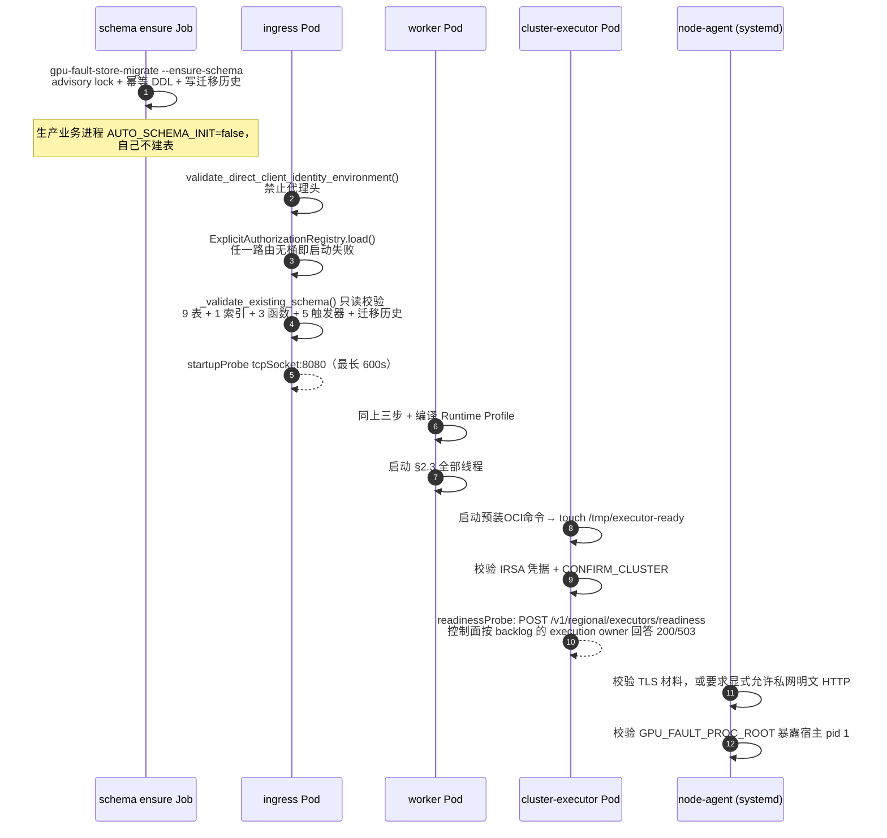
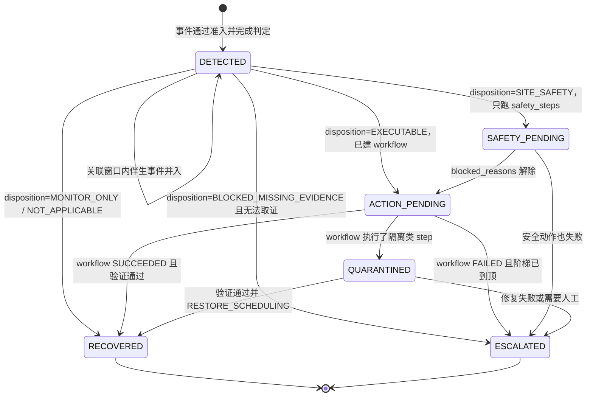
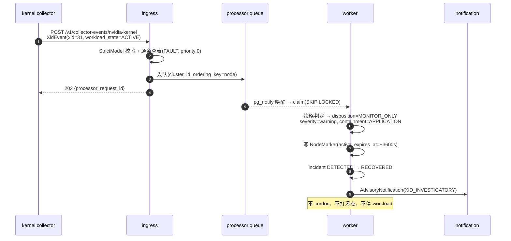
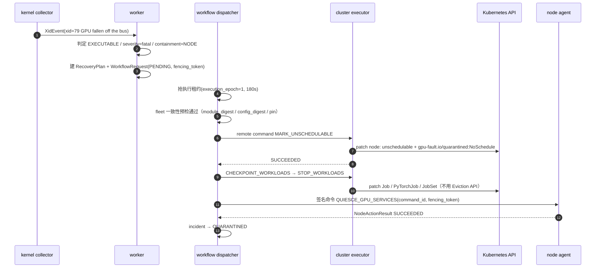
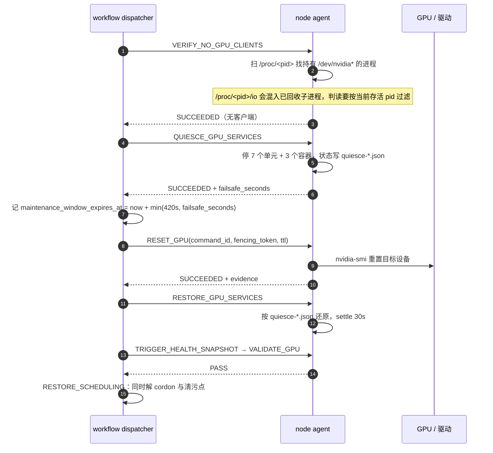
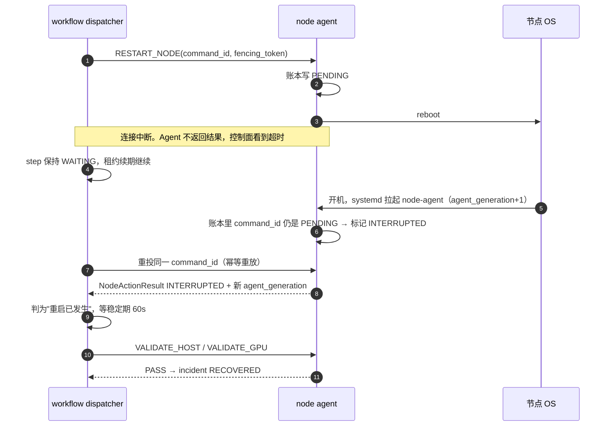
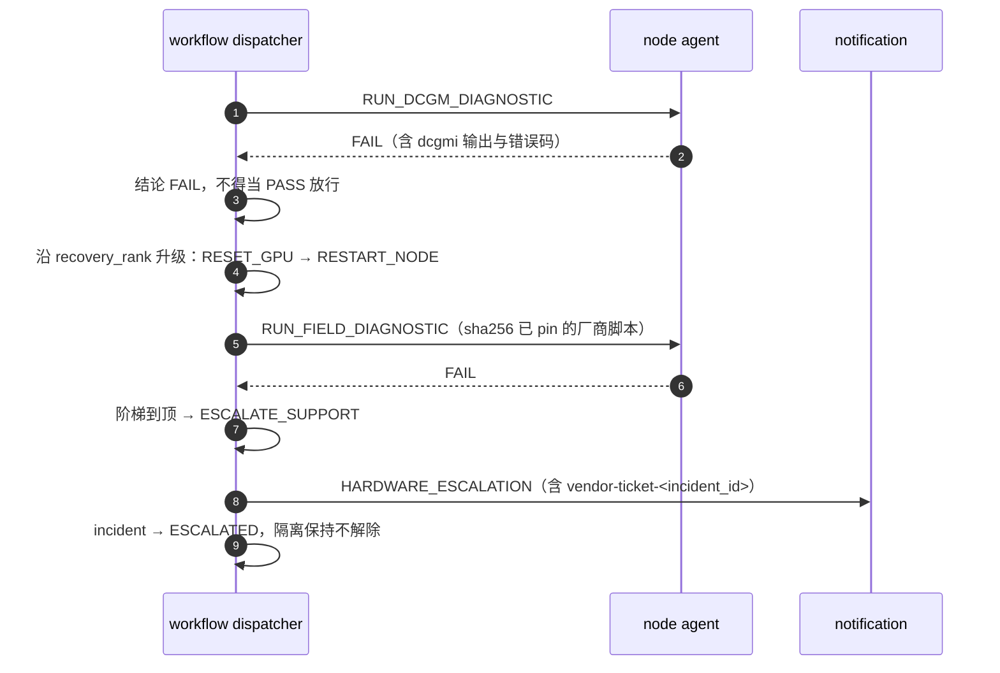
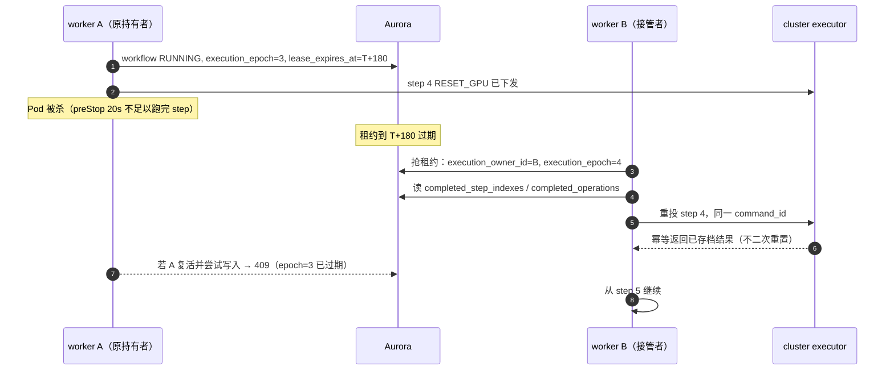
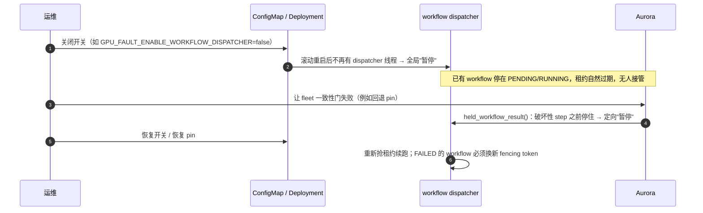
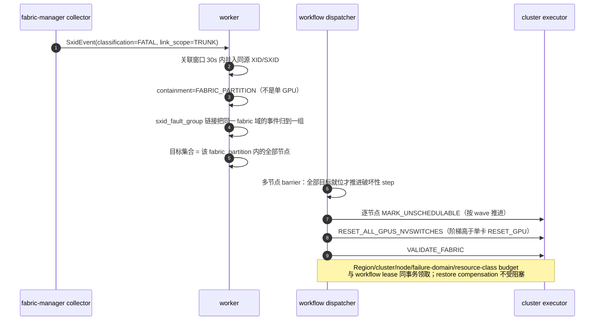

# GPU 故障处理系统详细设计（v2）

## 0. 这一版是什么

### 0.1 与既有文档的关系

| 文档 | 回答的问题 | 与本文的关系 |
|---|---|---|
| [概要设计 v2（闭环视角）](概要设计-v2.md) | 发现 → 判定 → 隔离 → 迁移负载 → 修复 → 验证 → 重新纳管，每一环由谁做、边界在哪 | 本文是它的实现层展开。凡是"能力边界"和"硬约束"结论，本文不重述，只引用 |
| [详细设计](详细设计.md)（v1） | 当前代码有哪些模块、协议和状态机 | 本文的事实基线。v1 是"按模块罗列"，本文是"按运行时行为下沉" |
| [部署和运维手册](部署和运维手册.md) | 怎么装、怎么升、怎么回滚、怎么查 | 本文只写"设计上必须如此"，具体命令序列不复制 |
| [区域模式端到端验收测试用例](区域模式端到端验收测试用例.md) | 每条行为怎么在真机上证明 | 本文 §10.5 的追溯矩阵直接指向它的用例编号 |

v1 详细设计的章节号被其他文档和测试引用（§2.11、§2.14、§2.15–2.17、§2.18、§3.1、§3.3、§4.4、§4.5），
**不会**因为本文存在而改动。本文是并列的第二份详细设计，不是替换。

### 0.2 本文的验收标准

开发人员读完本文，应当不需要再讨论以下问题就能编码、联调和测试：

1. 我要改的模块跑在哪个进程里、有几个线程、谁启动它、谁停止它；
2. 它的输入从哪条通道进来、字段是什么类型、哪些必填；
3. 它超时多久、重试几次、失败后落到哪个状态；
4. 同一个事件被投两次、两个副本同时抢一个节点，会发生什么；
5. 它写哪些日志字段、暴露哪些指标、哪些维度**根本没有**指标；
6. 我改完之后，哪些单元测试和哪条真机用例必须重跑。

### 0.3 事实来源与写法约定

本文每一条断言都对应源码或生成清单，不对应"建议应该如此"。约定：

- 数量、阈值、默认值来自源码或 `deploy/control-plane/regional/generated/` 的生成清单；
  两者不一致时以生成清单为**生产事实**，并显式写出应用裸默认值。
- 路由、指标、能力这类"面"的清点，必须装配真实 app 后遍历，不能数装饰器。
- 建议方案里存在、实现里不存在的东西，一律不写成"已实现"，集中在 §11 列出。
- 性能数字不落在本文。容量与压测口径见
  [性能压测验收方案](性能压测验收方案.md) 和 [详细设计](详细设计.md) §2.18.5。
- 最近一次按当前 `main` 的真实 app、Store codec、生成清单和测试目录逐项核对的日期
  为 **2026-08-27**。

---

## 1. 文档说明

### 1.1 适用范围

本文覆盖 `gpu-fault-control-plane` **0.10.0** 的唯一生产形态：

- 一个 AWS Region 一套 **CPU 控制面**（EKS 上的三个 Deployment + Aurora PostgreSQL）；
- 该 Region 内 N 个 **HyperPod EKS GPU 集群**作为数据面，每个集群一套执行器与采集器；
- 每个 GPU 节点一套 **systemd 采集器 + 签名节点动作 Agent**。

单集群一体化（`GPU_FAULT_DEPLOYMENT_MODE` 非 `regional`）只用于本地开发和测试，
其鉴权、准入和消费行为与生产不同，**不能用它的行为推断生产行为**（见 §8.1、
[详细设计](详细设计.md) §4.5）。

### 1.2 软硬件支持范围

| 维度 | 支持范围 | 事实来源 |
|---|---|---|
| GPU 厂商 | 仅 NVIDIA | 全仓无 AMD/Intel/ROCm/XGMI 实现（§11） |
| GPU 产品族 | `A100`、`H100`（含 `GH`）、`B100`、`GB200`，按型号名前缀 `A/H/GH/B/GB` 匹配 | `src/gpu_fault/data/nvidia-xid-catalog-610.generated.yaml` 的 `productFamilies` |
| 实例类型（期望 GPU/EFA 数） | `p5.4xlarge` (1/1)、`p5.48xlarge` (8/32)、`p5e.48xlarge` (8/32)、`p5en.48xlarge` (8/16) | `src/gpu_fault/collectors/gpu/discovery.py`、`src/gpu_fault/node_installer_reconciler.py` |
| XID 判定依据 | NVIDIA Xid Catalog **610**，`coverage: FULL_OFFICIAL_ARTIFACT` | 同上 YAML 的 `spec.catalog.version` |
| SXID 判定依据 | Fabric Manager 用户指南表 21–24 快照（`2025-11-14`），`coverage: NVIDIA_FM_TABLES_21_24` | `src/gpu_fault/data/nvidia-fabric-manager-sxid-2025-11-14.yaml` |
| 驱动版本 | 不做版本兼容矩阵。唯一按驱动分支分叉的判定是 NVLink5 子码解码：`driverBoundary: 575` 决定用 v1 还是 v2 位模式 | 同上 XID 目录的 `nvlink5Policy` |
| Python | `>=3.12`；生产镜像 `public.ecr.aws/docker/library/python:3.12-slim` | `pyproject.toml`、生成清单 |
| Kubernetes 客户端 | `kubernetes>=31,<35`；用到 `batch/v1` Job、`kubeflow.org` PyTorchJob、`jobset.x-k8s.io` JobSet | `pyproject.toml`、`deploy/dataplane/cluster-action-executor.yaml` |
| 节点 OS | 需要 systemd、`journald`、`/dev/kmsg`、`nvidia-smi`；节点运行时装在 `/opt/gpu-fault/releases/<artifact-sha>/venv`，由`current`原子选择 | `deploy/systemd/`、`deploy/node/install-gpu-fault-collector.sh` |
| DCGM | `nvcr.io/nvidia/k8s/dcgm-exporter:4.4.1-4.5.2-ubuntu22.04`，通过 `DCGM_REMOTE_HOSTENGINE_INFO=127.0.0.1:5555` 连宿主 hostengine | `deploy/dataplane/hyperpod-dcgm-exporter.yaml` |
| 编排器 | 仅 EKS。HyperPod Slurm 编排不支持 | 概要设计 v1 §2.1 的四条硬约束 |
| 数据库 | Aurora PostgreSQL；`psycopg[binary,pool]>=3.2,<4` | `pyproject.toml`、生成清单 |

### 1.3 明确不支持的场景

以下不是"暂未测试"，是**设计上不做**，实现里有守卫或根本没有代码路径：

| 场景 | 现状 | 依据 |
|---|---|---|
| 调用 `BatchReplaceClusterNodes` 替换节点 | 代码级不可达。provider client 协议不声明该方法，`HyperPodAction.REPLACE` 进入 provider submit 直接失败；环境变量、IAM 和 CloudTrail 再作外层否证 | `src/gpu_fault/hyperpod.py` 与 `tests/hyperpod/test_hyperpod.py` |
| HyperPod `NodeRecovery` 自动恢复 | 必须为 `None`，控制面启动即校验 | 概要设计 v2 §1.2 |
| 任务 auto-resume 由平台接管 | 禁用；`workloadStop`/`workloadRestart` 能力恒为 `OWN` | 概要设计 v2 §1.2 |
| 单 GPU 粒度摘除（device-plugin 只停一张卡） | 没有实现。只能整体重启 GPU/EFA device-plugin DaemonSet Pod，因此**隔离粒度是整节点** | §3.8、§11 |
| MIG 实例级故障建模 | 只把 MIG UUID 前缀当作设备身份的一部分，没有 MIG 粒度的故障模型与影响面 | §11 |
| Kubernetes Eviction API 驱逐 | 不用。隔离 = cordon + `gpu-fault.io/quarantined` 污点 + `STOP_WORKLOADS` | §3.8 |
| 写 Kubernetes Event / 自定义 CRD | 不写。NodeCondition 只读 | §3.8、§11 |
| 真正的 dry-run | `/simulate` 会写库并把 workflow 与 incident 推进到终态，不是只读预演 | §8.5、§11 |
| 外部工单系统（Jira/PagerDuty/Slack/webhook） | 没有。"工单号"是本地合成的 `vendor-ticket-<incident_id>` 字符串，出现在 SES 邮件正文里 | §3.10、§11 |
| PCIe AER 解码 | 没有。PCIe 侧只有 `pcie_replay_total` / `DCGM_FI_DEV_PCIE_REPLAY_COUNTER` 与 `pci_bdfs` | §11 |

---

## 2. 部署与进程设计

### 2.1 进程全表

一次完整部署定义 **10 类运行或可安装进程角色**（含 0 副本的泄压角色，以及默认
禁用的 NodeLog collector unit），分布在三层。业务代码拆为
`gpu_fault_control_plane`、`gpu_fault_cluster_executor` 和
`gpu_fault_node_runtime` 三个独立 wheel；节点 bundle 只封装 Node Runtime。
管理员入口另由`gpu_fault_deploy_host` wheel交付，只存在于受信部署机venv，不进入
Runtime Image或应用release Manifest。`gpu-fault-control-plane`中不包含
`gpu-fault-admin`入口及管理员部署源码。
容器从各自的 ConfigMap 卷 `/artifact` 安装所属 wheel，镜像里没有业务代码。区域
编排器按组件 `module_digest` 判断影响面，因此控制面改动不再要求滚动 GPU 或节点。

| 层 | 工作负载 | 类型 | 副本 | 入口 | 端口 | ServiceAccount |
|---|---|---|---|---|---|---|
| 控制面 | `gpu-fault-api-ha` | Deployment | 3 | `uvicorn gpu_fault.app:create_app --factory --workers 4` | 8080 | `gpu-fault-control-plane` |
| 控制面 | `gpu-fault-control-worker` | Deployment | 6 | 同上 `--workers 4` | 8081 | `gpu-fault-control-plane` |
| 控制面 | `gpu-fault-telemetry-spool-worker` | Deployment | **0** | 同上 `--workers 1` | 8082 | `gpu-fault-control-plane` |
| 数据面 | `gpu-fault-cluster-executor` | Deployment | 2 | `gpu-fault-cluster-executor` | 无监听端口 | `gpu-fault-cluster-executor` |
| 数据面 | `gpu-fault-completion-watcher` | Deployment | 1 | `gpu-fault-completion-watcher` | 无监听端口 | `gpu-fault-completion-watcher` |
| 数据面 | `gpu-fault-node-installer-reconciler` | Deployment | 1 | `gpu-fault-node-installer-reconciler` | 无监听端口 | `gpu-fault-node-installer-reconciler` |
| 数据面 | `gpu-fault-kubernetes-node-resource-collector` | Deployment | 1 | `gpu-fault-collector kubernetes-node-resources` | 无监听端口 | `gpu-fault-kubernetes-node-resource-collector` |
| 数据面 | `gpu-fault-dcgm-exporter` | DaemonSet | 每 GPU 节点 | dcgm-exporter | 9400 | 默认 |
| 节点 | 5 个可安装 collector systemd 单元（生产默认启用 4 个，NodeLog 默认禁用） | systemd | 每节点各 1 | `/opt/gpu-fault/current/venv/bin/gpu-fault-collector <mode>` | 无监听端口 | root（见 §2.4） |
| 节点 | `gpu-fault-node-agent` | systemd | 每节点 1 | `/opt/gpu-fault/current/venv/bin/gpu-fault-node-agent` | **9099**；默认 TLS | root |

生产入口是 `uvicorn ... --factory`，**不是** console script `gpu-fault-api`。判读进程身份
不能看 Pod 名或注解，只能看 `module_digest`（`GET /v1/version`）：
`gpu-fault.io/artifact-sha256` 注解和 `GPU_FAULT_RELEASE_ID` 都是纯标签，改了不影响运行代码。

`deploy/dataplane/gpu-metrics-collector.yaml` 仍保留为历史 manifest，但不在
`regional_deployment_inventory.GPU_ROLLOUT_DEPLOYMENTS` 中。当前区域生产由节点
systemd 的 `gpu-fault-metrics-collector.service` 采集 GPU metrics；不得同时部署旧
DaemonSet，否则同一节点会出现双 producer。

### 2.2 控制面三角色

同一个 `create_app()` 按 `GPU_FAULT_SERVICE_ROLE` 分裂。取值只允许
`all`/`ingress`/`worker`/`spool-worker`，其余在装配期抛
`ValueError: GPU_FAULT_SERVICE_ROLE must be all, ingress, worker, or spool-worker`
（`src/gpu_fault/app/factory.py`）。生产不使用 `all`。

| 角色 | 职责 | 后台线程 | uvicorn 关键参数 | requests / limits |
|---|---|---|---|---|
| `ingress` | 只做鉴权、解码、准入、**入队**，并返回回执 | 只有 `gpu-fault-collector-metrics-snapshot` | `--backlog 8192 --limit-concurrency 4096`；禁止按请求数自动回收 worker | 4 CPU / 4Gi → 8 CPU / 8Gi |
| `worker` | 消费队列、判定、编排、派发、周期任务、通知 | 全部（§2.3 表） | `--backlog 1024`，**不设** `--limit-max-requests` | 3 CPU / 4Gi → 4 CPU / 6Gi |
| `spool-worker` | 只重放遥测 spool | `gpu-fault-telemetry-spool` + `-notifications` | `--workers 1 --backlog 1024` | 1 CPU / 2Gi → 4 CPU / 4Gi |

- `background_services_enabled = service_role in {"all","worker"}`。
  ingress 进程**仍然构造** Processor 对象（入队、准入、租约都要它），但不启动任何
  消费线程。因此"Pod Running 且日志干净"不等于"有人在消费队列"——要看 worker
  角色的副本数。
- ingress worker 只能随受检 Deployment rollout、Pod replacement 或 liveness 恢复，
  不使用 Uvicorn `--limit-max-requests`。该参数会先退出旧 worker 再补位；多个进程在
  burst 中同时达到累计请求上限时会瞬时移除服务容量，并把 admission 等待推过请求预算。
- `spool-worker` 在装配期强制两个前提，缺一即
  `ValueError: spool-worker role requires queued processor mode and GPU_FAULT_TELEMETRY_SPOOL=true`。
  `replicas: 0` 是有意的：spool 是遥测洪峰的泄压阀，要用时先调副本。
- 容量必须按"**每进程 × 每进程线程数 × 副本数**"算。`GPU_FAULT_PROCESSOR_WORKERS=24`
  是每进程值：6 副本 × 4 uvicorn 进程 × 24 = 576 个处理槽位。

三个角色的 18 个 ConfigMap（每角色 core/notification/postgres/processor/recovery/telemetry）
由渲染器生成，手改会被 `make docs-check` 的清单检查拦下。改环境变量前必须先确认它
不是 `valueFrom`——三个 Deployment 各有 26 个显式 `env` 项来自
Secret/ConfigMap 引用，直接改 `value` 不生效；其余配置通过 6 个 `envFrom`
ConfigMap 注入。

### 2.3 控制面线程模型

`src/gpu_fault/app/lifespan_workers.py` 按角色启动线程。所有线程都是
`threading.Thread`，共享一个 `Event` 作为停止信号。

| 线程名 | 启动条件 | 职责 |
|---|---|---|
| `gpu-fault-collector-metrics-snapshot` | **无条件**，三个角色都有 | 采集器健康快照，供 `/metrics` 与静默扫描用 |
| `gpu-fault-processor-inbox` | `background_services_enabled` | 主消费循环：claim → 处理 → 完成 |
| `gpu-fault-processor-notifications` | Store 支持 `listen_processor_queue_notifications` | 监听 `pg_notify('gpu_fault_processor_queue')`，唤醒 inbox |
| `gpu-fault-periodic-services` | 同上 | 6 个周期任务（§2.3.1） |
| `gpu-fault-workflow-dispatcher` | 同上 | 扫描可执行 workflow 并驱动状态机 |
| `gpu-fault-xid-correlation` | 同上 | XID 关联窗口的 finalize |
| `gpu-fault-processor-diagnostics` | `background_services_enabled` | 诊断结果发布 |
| `gpu-fault-notification-dispatcher` | `background_services_enabled` 且异步投递且 dispatcher 开关为真 | 邮件派发 |
| `gpu-fault-telemetry-spool` / `-notifications` | `telemetry_spool_enabled` | spool 重放 |
| `gpu-fault-processor-leadership` | `active_consumers` 为**假** | 生产不启动——生产是 `active-active`，**没有 leader** |

事件循环滞后由一个 asyncio 任务 `monitor_event_loop_lag` 采样，导出为
`gpu_fault_event_loop_lag_seconds`。同步 psycopg 事务、Store 领域服务和可能阻塞的
外部 I/O 全部不在 event loop 上跑，由每进程独立的
`src/gpu_fault/async_store.py::AsyncStoreExecutor` 承担。

#### 2.3.1 周期任务与租约

周期任务不选 leader，而是每个 `task_key` 一把 periodic-task 租约，任一任务的 owner
故障不阻塞其他任务（`src/gpu_fault/app/periodic_services.py`）。

| `task_key` | 默认间隔 | 环境变量 | 说明 |
|---|---:|---|---|
| `training-health` | 15s | `GPU_FAULT_TRAINING_HEALTH_SCAN_SECONDS` | 需 `GPU_FAULT_ENABLE_TRAINING_HEALTH_MONITOR=true` 才跑 |
| `spare-health` | 30s | `GPU_FAULT_SPARE_HEALTH_SCAN_SECONDS` | warm spare 巡检 |
| `identity-refresh` | 20s | `GPU_FAULT_HYPERPOD_IDENTITY_REFRESH_SECONDS` | HyperPod 节点身份刷新 |
| `processor-cleanup` | 60s | `GPU_FAULT_PROCESSOR_CLEANUP_INTERVAL_SECONDS` | 队列墓碑、evidence TTL、remote command 保留期 |
| `control-record-archive` | 3600s | `GPU_FAULT_CONTROL_RECORD_ARCHIVE_INTERVAL_SECONDS` | incident archive-first 归档 |
| `collector-silence` | 60s | `GPU_FAULT_COLLECTOR_SILENCE_SCAN_SECONDS` | 静默采集器扫描，静默告警间隔 3600s |

清理任务有双重上界：`GPU_FAULT_PROCESSOR_CLEANUP_BATCH_SIZE=1000` 与
`GPU_FAULT_PROCESSOR_CLEANUP_BUDGET_SECONDS=20`。设计上是"每轮清一批、不许占满周期"，
所以**清理速率是有上限的**：产生速率超过 `limit ÷ interval` 时队列只会涨。算容量必须
同时算这两个比值。

### 2.4 节点侧：单元、目录与端口

节点侧不跑容器，由 `deploy/node/install-gpu-fault-collector.sh` 装成 systemd 单元。
所有单元都 `NoNewPrivileges=true`、`ProtectSystem=strict`、`ProtectHome=true|read-only`、
`PrivateTmp=true`，并**逐个设了 CPU/内存/IO 上限**——设计前提是这些进程绝不能和训练
作业争资源。

| 单元 | ExecStart | 写权限 | CPUQuota | MemoryMax | 备注 |
|---|---|---|---:|---:|---|
| `gpu-fault-kernel-collector` | `gpu-fault-collector kernel` | `StateDirectory=gpu-fault` | 50% | 256M | `ReadOnlyPaths=/dev/kmsg /proc/sys/kernel/random/boot_id` |
| `gpu-fault-metrics-collector` | `gpu-fault-collector ${GPU_FAULT_METRICS_MODE}` | `ReadWritePaths=/var/lib/gpu-fault` | 100% | 1G | mode 为 `dcgm` 或 `nvidia-smi` |
| `gpu-fault-host-collector` | `gpu-fault-collector host` | `ReadWritePaths=/var/lib/gpu-fault` | 100% | 512M | 15s 采样 |
| `gpu-fault-log-collector` | `gpu-fault-collector logs` | `StateDirectory=gpu-fault` | 100% | 768M | `SupplementaryGroups=systemd-journal` |
| `gpu-fault-fabric-manager-collector` | `gpu-fault-collector fabric-manager` | `StateDirectory=gpu-fault` | 50% | 256M | `After=nvidia-fabricmanager.service` |
| `gpu-fault-node-agent` | `gpu-fault-node-agent` | `ReadWritePaths=/var/lib/gpu-fault` | 200% | 1G | 监听 **9099**，默认要求 TLS |
| `gpu-fault-certificate-check.timer` | `/opt/gpu-fault/check-control-plane-certificate` | — | — | 256M | `OnBootSec=5m`、`OnUnitActiveSec=12h`、`RandomizedDelaySec=10m` |
| `gpu-fault-gpu-persistence` | `nvidia-smi -pm 1` | — | — | 512M | `Type=oneshot`、`RemainAfterExit=yes` |

`ProtectSystem=strict` 让 `/var` 只读，所以**凡是要写 outbox 的单元必须显式声明
`StateDirectory` 或 `ReadWritePaths`**，否则 outbox 写入 `EROFS`，投递失败的 XID/SXID
会被静默丢弃——而 outbox 存在的意义正是这个场景。

目录与文件布局：

| 路径 | 内容 | 权限 |
|---|---|---|
| `/opt/gpu-fault/releases/<artifact-sha>/venv/` | 不可变Node Runtime槽位，含collector与Agent | 0755 |
| `/opt/gpu-fault/current` | 指向当前签名槽位的原子软链接，systemd唯一运行入口 | symlink |
| `/opt/gpu-fault/venv/` | 首次legacy迁移保留的旧venv；新装节点仅作为`current/venv`兼容软链接 | 0755/symlink |
| `/opt/gpu-fault/tools/py-spy-<version>-<sha>/` | 独立、固定二进制SHA的诊断工具槽位 | 0755 |
| `/opt/gpu-fault/verify`、`verify-certificate-bundle`、`check-control-plane-certificate`、`uninstall` | 运维脚本 | 0755 |
| `/etc/gpu-fault/collector.env`、`node-agent.env`、`dcgm-exporter.env` | 单元的 `EnvironmentFile` | **0600** |
| `/etc/gpu-fault/control-plane-ca.crt` | 私有 NLB 的 CA；`SSL_CERT_FILE` 指向它 | 0644 |
| `/etc/gpu-fault/dcgm-counters.csv` | dcgm-exporter 字段清单 | 0644 |
| `/var/lib/gpu-fault/outbox/*.ndjson` | 各通道投递失败的持久缓冲 | 0700 |
| `/var/lib/gpu-fault/node-actions.db` | Node Agent 回执账本（幂等重放的事实源） | 0600 |
| `/var/lib/gpu-fault/quiesce/quiesce-*.json` | GPU 服务静默的还原状态 | 0600 |
| `/var/lib/gpu-fault/health-snapshot/{gpu,host}.request` | `TRIGGER_HEALTH_SNAPSHOT` 的请求文件，采样成功后删除 | 0644 |
| `/var/lib/gpu-fault/fabric-manager-collector-state.json` | FM 日志读取位点 | 0600 |

Node Agent 以 root 运行（单元里没有 `User=`），因为 `RESET_GPU`、`RESTART_NODE`、
驱动/固件动作必须有宿主权限。它没有拿到任何 AWS 凭据，也不能访问数据库——它只接受
控制面签名的命令（§3.1）。

### 2.5 数据面权限：每个工作负载一套最小 RBAC

数据面没有数据库连接。四个工作负载各有独立 ServiceAccount 与 ClusterRole：

| ServiceAccount | 资源 → 动词 | 为什么是这些 |
|---|---|---|
| `gpu-fault-cluster-executor` | `nodes`: get/list/watch/**patch**；`pods`: get/list/watch/patch/**delete**；`batch/jobs`、`kubeflow.org/pytorchjobs`、`jobset.x-k8s.io/jobsets`: get/list/watch/patch/**create** | 隔离靠 patch（cordon + 污点）；`pods delete` 只用于重启 device-plugin DaemonSet Pod 和标记 terminating Pod。**没有** `nodes delete`，也不用 Eviction API |
| `gpu-fault-completion-watcher` | `pods`: get/list/watch/patch；`pods/exec`: get/create；`pods/log`: get；`jobs`/`pytorchjobs`/`jobsets`: get/patch | 需要 exec 去 Pod 内读 GPU UUID 与训练进度；只 patch 不删 |
| `gpu-fault-node-installer-reconciler` | `nodes`: get/list/watch/patch；`jobs`: get/list/watch/create/**delete**；`configmaps`: get | 靠删除 Job 重跑安装；delete 范围只在 Job |
| `gpu-fault-kubernetes-node-resource-collector` | `nodes`: get/list | 只读 allocatable 汇总 |

`gpu-fault-cluster-executor` 的 SA 注解 `eks.amazonaws.com/role-arn` 必须替换成真实
IRSA 角色。这是**唯一**持有 AWS 凭据的数据面工作负载；控制面不做 HyperPod 变更。
执行器在 `GPU_FAULT_ENABLE_HYPERPOD_ADAPTER=true` 且凭据不可解析时拒绝启动，
所以未替换的占位符会在部署时就炸，而不是等到下一次真故障。

执行器容器上三个 `ENABLE_*` 开关必须为 `true`：

- `GPU_FAULT_ENABLE_NODE_ACTION_ADAPTER=true`——留 `false` 不是"更安全的默认"，
  而是让 fleet agent product 恒为 `None`，策略会把"重启应用"静默降级成"隔离整节点"；
- `GPU_FAULT_ENABLE_HYPERPOD_ADAPTER=true`，且必须能解析
  `GPU_FAULT_HYPERPOD_CONFIRM_CLUSTER`，否则 fail closed；
- `GPU_FAULT_ENABLE_HYPERPOD_SPARE_FAILOVER=true`——它不是风险开关，而是"永不调
  replace API"的第一道锁所在的分支；关掉它，`GPU_FAULT_ALLOW_HYPERPOD_REPLACE=false`
  就成了 provider API 前的最后一道锁。

### 2.6 副本、反亲和、PDB 与"没有 leader 选举"

三个控制面 Deployment 的调度约束完全一致：

- `podAntiAffinity.preferredDuringSchedulingIgnoredDuringExecution`（weight 100，
  `topologyKey: kubernetes.io/hostname`）；
- `topologySpreadConstraints`：`maxSkew: 1`、`whenUnsatisfiable: DoNotSchedule`、
  `matchLabelKeys: [pod-template-hash]`——按 hash 分组，滚动升级时新旧代不会互相挤；
- 容忍 `gpu-fault.io/quarantined:NoSchedule`（否则控制面会被自己打的污点赶走）与
  `not-ready`/`unreachable:NoExecute`，`tolerationSeconds: 60`；
- `RollingUpdate`，`maxSurge: 1`、`maxUnavailable: 1`；
- PDB：ingress 为 `minAvailable: 2`，worker 与 spool-worker 各为
  `maxUnavailable: 1`。

高可用不靠 leader，靠三层租约（§9.3）：

1. `gpu_fault_processor_lanes` 的 lane 租约（owner + epoch + 随机 token + 过期）；
2. workflow execution lease + `execution_epoch` fencing；
3. 每 `task_key` 一把 periodic-task 租约。

### 2.7 启动顺序与 fail-closed 守卫



图 2-1 启动顺序与各层 fail-closed 点

几个必须记住的点：

- **schema 由一次性 Job 建好**（`deploy/migrations/postgres-schema-ensure-job.yaml`），
  生成清单把 `GPU_FAULT_POSTGRES_AUTO_SCHEMA_INIT` 全设 `false`，业务进程只做只读
  校验。这样 DDL 的 `LOCK` 和 `statement_timeout` 永远不会出现在请求路径上。
- **Runtime Profile 按 `profile_version` 在 Aurora 中保存一份**，由所有引用该版本的
  区域 GPU 集群共享。注册 payload 的 `cluster_id` 只是一个已登记集群形式的授权锚点，
  不是 HyperPod provider 名或 profile 的存储 key。区域编排器在 CPU ingress Ready 后
  编译声明的 source：缺失时注册、内容一致时幂等通过、同版本内容漂移时 fail closed
  并要求新版本，避免升级过程静默改写恢复策略。同一个 version 同时渲染到 CPU fleet
  pin、Resource/HMA Collector 和 Node Installer；Completion Watcher 从训练 Pod
  annotation 读取版本，不维护第二个静态默认值。
- Completion Watcher把活跃Observation当作需要持续刷新的租约：Pod存在时每次
  reconcile更新`observed_at`；全部Pod消失后先等待
  `cleanup_timeout_seconds`，再发布`STOPPED` tombstone。tombstone不伪造
  container exit code，terminal event继续使用Watcher已积累的allocation。
  ownership只接受相对事件`ingested_at`不超过120秒的Observation；更老的
  `PENDING/RUNNING`记录进入stale gauge，不再参与节点mutation归属。
  `/v1/workload-observations`正常时直接发送；发送失败后按attempt latest-wins写入
  Completion Watcher ConfigMap outbox，下一轮优先重放。failure/terminal仍保持严格
  write-ahead。`active-attempts.json`按忽略`observed_at`的结构摘要保存活跃attempt，
  因此正常3秒刷新不写ConfigMap；Watcher重启后恢复spec/allocation，Pod缺失超过cleanup
  timeout即发`STOPPED`并清除持久状态。发布滚动保留已有state ConfigMap，不重放默认空
  数据。terminal event产生后，Watcher和Store都会把Observation单调映射为终态，Store
  在同一attempt事务中拒绝后到active Observation，并由cleanup修复历史矛盾。持续投递
  失败仍可能产生stale warning，不能用数据库TTL替代终态Observation。
- 执行器的`startupProbe`只证明预装OCI进程已进入启动门。**Ready由
  `gpu-fault-cluster-executor-readiness` 决定**：它带每集群 token POST
  `/v1/regional/executors/readiness`，上报自己声明的 execution owner 与最近一次成功
  claim 的年龄；控制面发现 open backlog 需要一个它不声明的 owner 时回 503。
  匿名 `/healthz` 对完全配错的执行器也答 200，所以不能用它当 readiness。
- 节点 Agent 默认**必须** TLS。允许 HTTP 需要显式设置开关，否则启动即失败。

### 2.8 优雅停机

停机顺序在 `src/gpu_fault/app/lifespan.py`，由 `ShutdownCoordinator` 带总预算：

1. `preStop: sleep 20`——先让 Service endpoints 摘掉本 Pod，避免关到一半还在收流量；
2. 取消 event-loop lag 监控任务；
3. `stop` 事件置位 → `processor.stop()` → 停止继续 claim；Processor worker pool
   收敛后主动 release `claimed-but-not-started` 请求，再逐个 `join` 各线程。超预算
   记录 `processor shutdown deadline exceeded` 并把失败线程名写日志；
4. `join` training / spare / identity / notification-dispatcher / diagnostics /
   dispatcher / xid-correlation；
5. `close()` 四个 admission batcher 与六个 store/decode I/O executor；
6. `raise_if_failed()`——有线程没停干净就让停机**显式失败**，不静默。

`terminationGracePeriodSeconds` 按角色不同：ingress 120s、worker **240s**、
spool-worker 130s。worker 更长是因为它可能正在执行一个多 step 的 workflow；
被强杀时靠 lane/execution 租约过期由其他副本接管（§7.6）。

### 2.9 网络分区行为

分区不是一种行为，要按方向分三种：

| 方向 | 现象 | 设计行为 |
|---|---|---|
| 节点 → 控制面不可达 | Collector POST 失败 | 事件写 `/var/lib/gpu-fault/outbox/*.ndjson`，按退避重试；恢复后按落盘顺序补交。`Retry-After` 被尊重。Node Agent 不主动做任何事——**它只执行签名命令，没有本地自治动作** |
| 控制面 → 节点不可达 | 节点动作 step 超时 | 心跳超过 `GPU_FAULT_AGENT_MAX_HEARTBEAT_AGE_SECONDS`（数据面执行器设 90s）即视为 stale，destructive step 不下发；已下发的命令靠 `command_id` 幂等重放查回执（§3.1） |
| 数据面执行器 → 控制面不可达 | 无法 claim/renew/report | 已 leased 的 remote command 租约到期（`GPU_FAULT_CLUSTER_EXECUTOR_LEASE_SECONDS=120`）后被重新分派；执行器 readiness 转 fail，Pod 摘出。控制面侧 `GPU_FAULT_REMOTE_COMMAND_CLAIM_DEADLINE_SECONDS=900` 超过仍无人 claim 则该 step 失败 |
| 控制面 → Aurora 不可达 | 入队与消费都失败 | ingress 侧准入返回 503（`StoreIoCapacityExceeded`）或 429；不在内存里攒状态。**没有本地降级模式**，这是有意的：控制面无状态，状态只在 Aurora |

监控失联必须判为 Unknown 而不是 Healthy：静默采集器由 `collector-silence` 周期任务
扫出来并走 AdvisoryNotification，因此**没有 AMP 的区域仍然有邮件告警能力**。

---

## 3. 模块详细设计

### 3.0 模块清单与模板

建议大纲列了 10 个模块，其中"AMD / Intel Adapter"没有实现（§11），而实现里另有三个
必须写清楚的承重模块：**Cluster Action Executor**（数据面唯一持 AWS 凭据、唯一直接
操作 Kubernetes 的进程）、**Processor**（所有写入的统一入口与租约层）与
**Installation Resource Registry**（部署和卸载的 AWS 资源事实源）。本章覆盖
13 个模块，每个模块固定 12 段：

① 模块职责 ② 输入输出 ③ 内部组件 ④ 线程/协程模型 ⑤ 启停流程 ⑥ 依赖服务
⑦ 超时/重试/熔断 ⑧ 幂等与并发控制 ⑨ 配置参数 ⑩ 日志/指标/告警 ⑪ 异常处理
⑫ 单元测试范围

| § | 模块 | 进程 | 代码位置 |
|---|---|---|---|
| 3.1 | Node Agent | 节点 systemd | `src/gpu_fault/node_agent/` |
| 3.2 | NVIDIA 适配层 | 节点 collector + 控制面 worker | `src/gpu_fault/collectors/gpu/`、`src/gpu_fault/policy/` |
| 3.3 | 事件归一化与通道准入 | 控制面 ingress | `src/gpu_fault/channel_registry.py`、`src/gpu_fault/app/routes/` |
| 3.4 | 拓扑与资产服务 | 控制面 worker | `src/gpu_fault/store/`、`src/gpu_fault/fleet.py`、`src/gpu_fault/hyperpod.py`、`src/gpu_fault/spare_health.py` |
| 3.5 | 规则与策略引擎 | 控制面 worker（装配期编译） | `src/gpu_fault/policy/`、`src/gpu_fault/data/` |
| 3.6 | 故障编排与状态机 | 控制面 worker | `src/gpu_fault/orchestration/` |
| 3.7 | Remediation Worker | 控制面 worker | `src/gpu_fault/execution/` |
| 3.8 | Kubernetes 操作适配器 | 数据面执行器 | `src/gpu_fault/adapters/kubernetes/` |
| 3.9 | Cluster Action Executor | 数据面 Deployment | `src/gpu_fault/cluster_executor.py` |
| 3.10 | 主动诊断服务 | 控制面 worker + 节点 Agent | `src/gpu_fault/diagnostics.py` |
| 3.11 | 通知服务 | 控制面 worker | `src/gpu_fault/notifications/` |
| 3.12 | Processor | 控制面全角色 | `src/gpu_fault/processor/` |
| 3.13 | Installation Resource Registry | 管理 CLI + 控制面 API | `src/gpu_fault/installation_resources.py`、`src/gpu_fault/admin/resource_registry.py` |

### 3.1 Node Agent

**① 模块职责**——在 GPU 节点上执行**带签名的 node action**，并且只执行签名动作。
它是诊断采集、`QUIESCE_GPU_SERVICES` / `VERIFY_NO_GPU_CLIENTS`、GPU/fabric reset、
`RESTORE_GPU_SERVICES`、`RESTART_FABRIC_MANAGER`、驱动/固件修复等 node-owned
operation 的落地点。`RESTART_NODE` / `REPLACE_NODE` 不经过 Node Agent，由 HyperPod
lifecycle adapter 或 managed recovery observer 处理。Agent **没有**任何自主判定：
不读策略、不看阈值、不在失联时自行动作；所有"要不要做"由控制面决定。

区域生产 Installer 默认启用 GPU reset、fabric reset、service quiesce 和 Fabric
Manager restart；通用安装器 CLI 的裸默认仍为关闭，手工生产安装必须显式传入对应
四个 `--allow-*` 参数。启用节点能力不绕过 HMAC 签名、fencing token、Agent
generation、无 GPU client 校验、quiesce 维护窗口、工作流顺序或控制面 allowlist。
控制面的 `required-agent-config-digest` 必须按这四个生产开关均为 `true` 计算。

**② 输入输出**

| 方向 | 内容 |
|---|---|
| 入 | `POST /v1/node-actions`：同步执行 HMAC 签名的 `NodeActionCommand` |
| 入 | `POST /v1/node-actions/submit`：异步提交；`GET /v1/node-actions/result?command_id=&issued_at=&signature=`：签名查询结果；另有 `GET /healthz` |
| 入 | `NodeActionCommand` 一等字段：`command_id`、`workflow_request_id`、`incident_id`、`fencing_token`、`operation`、`node_id`、`agent_generation`、`gpu_uuids`、`parameters`、`issued_at`、`expires_at` |
| 出 | `NodeActionResult` 一等字段：`command_id`、`operation`、`status`、`details`、`error`、`retryable`、`attempt`、`completed_at`；命令输出、证据与各操作专用字段位于 `details` |
| 出 | Agent 主动 `POST /v1/fleet/agents/heartbeat`，上报 `config_digest`、`runtime_profile_version`、`artifact_sha256`、`allowed_operations`、boot/instance/incarnation 与安装单元摘要；控制面响应当前 `generation` |
| 出 | 落盘证据：`/var/lib/gpu-fault/diagnostics/`、`/var/lib/gpu-fault/quiesce/`、可选 S3 |

**③ 内部组件**——`src/gpu_fault/node_agent/app.py`（HTTP 面与拒绝映射）、
`executor.py`（操作分派与命令白名单）、`ledger.py`（SQLite 回执账本）、
`quiesce.py`（服务/进程/容器静默与还原）、`protocol.py`（命令与结果模型）、
`config.py`（配置摘要，见 ⑧）。

**④ 线程/协程模型**——单进程 uvicorn，单 worker。HTTP 处理是 asyncio，实际动作在
线程池里跑阻塞子进程（`nvidia-smi`、`systemctl`、诊断/修复脚本）。同一 `command_id` 的
执行由账本串行化；不同 `command_id` 可并行，但相互冲突的操作会被 `ACTION_CONFLICT`
拒绝而不是排队。

**⑤ 启停流程**——systemd `Restart=always RestartSec=5`。启动时：加载
`/etc/gpu-fault/node-agent.env` → 校验 TLS 证书/私钥，或要求显式设置
安装器默认自动生成节点本地 TLS 证书并广告 `https://<node-ip>:9099`，签名
heartbeat 将证书送入 Fleet Registry，Executor 按该证书建立精确信任；随后校验
`GPU_FAULT_PROC_ROOT` 能看到
宿主 pid 1 → 打开账本 → 计算 `config_digest` → 监听 `:9099`。当前区域生产安装显式
使用节点私网地址上的 HTTP，并依靠 HMAC、短 TTL、fencing token 与签名结果查询保护
动作协议；TLS/mTLS 路径已实现，但不是当前生成安装的生产事实。停止时先停止接受新命令，进行中的命令等
`inflight_wait_timeout_seconds`（默认 2100s）；未完成的命令重启后靠账本回答"仍在
进行/已完成"。

**⑥ 依赖服务**——`nvidia-smi`、`systemctl`、`journalctl`、容器运行时 CLI、可选
`py-spy`/`strace`/`dcgmi`、可选厂商 field diagnostic 脚本。**不依赖**数据库、不依赖
AWS API。

**⑦ 超时/重试/熔断**

| 场景 | 值 | 来源 |
|---|---:|---|
| 命令 TTL | 由控制面在命令里给出，过期回 `COMMAND_EXPIRED`(410) | `protocol.py` |
| 结果查询时钟偏移上限 | 300s | `src/gpu_fault/node_agent/protocol.py` 的 `RESULT_QUERY_MAX_SKEW_SECONDS` |
| 静默失败保护 | `failsafe 420s`、`retry 60s`、`settle 2s`、`restore settle 30s` | 安装脚本默认 |
| 容器停止/恢复 | 30s / 30s；设备清扫 20s | 同上 |
| 进行中命令等待 | 2100s | `GPU_FAULT_NODE_INFLIGHT_WAIT_TIMEOUT_SECONDS` |
| 重试 | Agent **自己不重试**。重试由控制面用同一个 `command_id` 重投，Agent 幂等返回 | ⑧ |

**⑧ 幂等与并发控制**——四层：

1. **`command_id` + 账本**：同一 `command_id` 重投直接返回已存档的结果，不重复执行。
   账本保留 604,800s、上限 10,000 条。这是"控制面重启后不会把 GPU 重置两次"的根据。
2. **`fencing_token`**：小于已见过的 token 即 `STALE_FENCING_TOKEN`(409)。
3. **`agent_generation`**：由 Fleet Registry 分配；boot/incarnation、endpoint、
   node instance、版本或配置身份变化时自增。单纯同一 boot 内的进程重启不保证自增。
   旧代命令回 `STALE_AGENT_GENERATION`(409)。
4. **`config_digest`**：心跳上报 `agent_config_digest()` 的值，控制面用
   `GPU_FAULT_REQUIRED_AGENT_CONFIG_DIGEST` 比对，不一致则整个 fleet 一致性门失败、
   所有节点侧 step 拒发。这个 pin **必须**由
   `src/gpu_fault/node_agent/config.py::agent_config_payload` 派生，不能在部署脚本里
   手抄一份字段清单——手抄过一次，脚本里的静默服务列表和 Agent 真实列表长度不同，
   导致所有节点动作恒失败。

**⑨ 配置参数**（`/etc/gpu-fault/node-agent.env`，0600）

| 变量 | 默认 | 说明 |
|---|---|---|
| `GPU_FAULT_NODE_AGENT_PORT` | `9099` | 监听端口 |
| `GPU_FAULT_NODE_AGENT_HOST` | 空（全接口） | 建议绑到集群内网地址 |
| `GPU_FAULT_NODE_AGENT_TLS_CERT` / `_TLS_KEY` / `_TLS_CLIENT_CA` | 安装器自动生成 cert/key | 证书与私钥必须成对；签名 heartbeat 携带服务端证书，控制面按证书 pin 验证 |
| `GPU_FAULT_NODE_AGENT_ALLOW_PLAINTEXT` | 裸默认 `false`；区域生产不再设置 | 只保留隔离开发环境的显式兼容开关，生产 Fleet Policy 要求 HTTPS |
| `agentEndpointAllowedCidrs` / `RegionalClusterRegistration.agent_endpoint_allowed_cidrs` | 每个 GPU 集群自己的节点子网 | 区域模式按认证 `cluster_id` 选择；允许不同集群值相同，但不合并身份边界 |
| `GPU_FAULT_AGENT_ENDPOINT_ALLOWED_CIDRS` | — | 仅保留单集群/Canary 兼容路径 |
| `GPU_FAULT_NODE_HEARTBEAT_INTERVAL_SECONDS` | `30` | 与控制面 90s stale 阈值配对 |
| `GPU_FAULT_NODE_ACTION_DB` | `/var/lib/gpu-fault/node-actions.db` | 账本 |
| `GPU_FAULT_NODE_ACTION_RETENTION_SECONDS` / `_MAX_RESULTS` | `604800` / `10000` | 账本保留 |
| `GPU_FAULT_QUIESCE_SERVICES` | 7 个单元（含 `kubelet`） | 静默集合，进摘要 |
| `GPU_FAULT_QUIESCE_CONTAINERS` | HMA / exporter / device-plugin 三个 | 容器级静默 |
| `GPU_FAULT_QUIESCE_FAILSAFE_SECONDS` | `420` | 超时后强制还原 |
| `GPU_FAULT_CERTIFICATE_MIN_VALIDITY_SECONDS` | `2592000` | 证书检查 timer 的告警阈值 |

**⑩ 日志/指标/告警**——日志到 journald，字段含 `command_id`、`operation`、
`node_id`、`fencing_token`、`agent_generation`、`rejection_code`、`duration_ms`。
Agent **不暴露 Prometheus 端点**；它的健康只能从控制面侧观察（心跳年龄、
`config_digest` 匹配、node action 成功率）。因此"Agent 挂了"的告警链条是
控制面的 stale-agent 判定，而不是 Agent 自己报警。

**⑪ 异常处理**——所有拒绝走 `src/gpu_fault/node_agent/app.py::_node_action_rejection`，
返回体固定 `{code, message, retryable, requires_new_command}`：

| `code` | HTTP | retryable | requires_new_command |
|---|---:|---|---|
| `INVALID_SIGNATURE` | 401 | 否 | 否 |
| `TARGET_NODE_MISMATCH` | 422 | 否 | 否 |
| `STALE_AGENT_GENERATION` | 409 | 是 | 是 |
| `OPERATION_NOT_ALLOWED` | 403 | 否 | 否 |
| `INVALID_ISSUED_AT` | 422 | 否 | 是 |
| `COMMAND_EXPIRED` | 410 | 是 | 是 |
| `INVALID_TTL` | 422 | 否 | 是 |
| `STALE_FENCING_TOKEN` | 409 | 是 | 是 |
| `ACTION_CONFLICT` | 409 | 否 | 否 |

执行期异常一律**转成结果**而不是 HTTP 5xx：子进程非零退出 → `FAILED`，操作细节中
记录 exit code；超时 → `FAILED` + timeout 证据；静默还原失败 → `details` 带
`restore_failed`，并把
还原状态留在 `/var/lib/gpu-fault/quiesce/`，由 fail-safe timer 按 `retry_seconds` 重试。
状态文件记录写入时的 `boot_id`；Agent 启动时
`src/gpu_fault/node_agent/quiesce.py::GpuServiceQuiesceManager.reconcile_after_boot`
扫描该目录，`boot_id` 与当前 boot 不同（或无 `boot_id` 且 timer 已不存在）的文件
按原样还原并删除——带外 reboot 会带走瞬态 timer，却留下状态文件，没有这一步同一
incident 就再也无法 quiesce，而 `assert_quiesced` 会在一个从未静默的 boot 上放行
RESET_GPU。当前 boot 且 timer 仍在的文件是在途的维护窗口，Agent 重启不得动它。

**⑫ 单元测试范围**——签名校验的正/负例（含 `node_action_key_version` 轮换）；九种拒绝码
逐个断言 HTTP 与三个布尔位；同 `command_id` 重投返回同一结果且不二次执行；
`fencing_token` 回退被拒；Agent 重启后旧代命令被拒；账本保留与上限裁剪；
静默 → 还原的完整往返（含 failsafe 触发路径）；`config_digest` 对
`agent_config_payload` 任一字段变化都变（防止摘要漏字段）。

### 3.2 NVIDIA 适配层

**① 模块职责**——把 NVIDIA 的原始信号翻译成结构化事实：内核日志里的 **XID**、
Fabric Manager 日志里的 **SXID**、DCGM 计数器、`nvidia-smi` 清单、EFA/NVLink 计数。
翻译**只做解码与归因，不做处置决定**。厂商侧唯一支持 NVIDIA（§1.2）。

**② 输入输出**

| 通道 | 输入源 | 输出 payload | 优先级 |
|---|---|---|---|
| `/v1/collector-events/nvidia-kernel` | `/dev/kmsg` + journald | `XidEvent`（含 `xid`、`pci_bdfs`、`gpu_uuid`、原始行） | FAULT (0) |
| `/v1/collector-events/fabric-manager` | FM 日志 + 位点文件 | `SxidEvent`（`sxid`、`nvswitch`、`port`、`error_status`） | FAULT (0) |
| `/v1/collector-events/gpu-inventory` | `nvidia-smi --query-gpu=index,uuid,name` | 设备清单（含 product） | ROUTINE (100) |
| `/v1/collector-events/gpu-metrics` | dcgm-exporter :9400 或 `nvidia-smi` | 计数器样本 + `edge_filter_reasons` | EDGE_FILTERED (50/100) |

**③ 内部组件**——节点侧：kernel/fabric-manager/metrics/inventory 四个 collector
（`src/gpu_fault/collectors/gpu/`、`src/gpu_fault/collectors/logs/`）。控制面侧：
XID 目录解码、SXID 表解码、NVLink 子码位模式解码、DCGM 复合规则
（`src/gpu_fault/policy/`、`src/gpu_fault/gpu_metrics.py`）。

**④ 线程/协程模型**——每个 collector 一个独立 systemd 进程、单线程采样循环
（metrics 15s / host 15s / logs 10s / FM 5s / inventory 60s）。控制面侧解码在
Processor 的 worker 线程里同步执行，`GPU_FAULT_INGRESS_DECODE_WORKERS=4` /
`_MAX_IN_FLIGHT=32` / `_TIMEOUT_SECONDS=5` 限定 ingress 解码的并发与超时。

**⑤ 启停流程**——见 §2.4。FM collector `After=nvidia-fabricmanager.service`，并从
`fabric-manager-collector-state.json` 恢复读取位点，避免重启后重放全量日志。

**⑥ 依赖服务**——`nvidia-smi`（必需）、dcgm-exporter :9400（`dcgm` 模式必需，
降级模式为 `nvidia-smi`）、journald、Fabric Manager 日志文件。

**⑦ 超时/重试/熔断**——投递失败写 outbox 后退避重试并尊重 `Retry-After`。
DCGM 抓取失败按 `collection_errors` 上报——注意这会让 EDGE_FILTERED 通道**升到
priority 50**（`is_routine_payload` 在有 `collection_errors` 时返回 False），也就是
"采集自己坏了"不会被当成日常心跳排在队尾。

**⑧ 幂等与并发控制**——XID/SXID 事件带 `event_id`；控制面按 `event_id` 去重。
inventory 与 metrics 通道是 `latest_wins=True`，同一节点的新样本覆盖旧样本，
所以重投老样本不会污染当前判定。

**⑨ 配置参数**——DCGM 判定阈值全部可 env 覆盖，生产值见
`gpu-fault-control-worker-config-telemetry` ConfigMap，例如
`GPU_FAULT_DCGM_COMPOSITE_CONSECUTIVE_SAMPLES=2`（复合规则要连续两个样本才成立）、
`GPU_FAULT_DCGM_CORRELATION_WINDOW_SECONDS=45`、
`GPU_FAULT_DCGM_POWER_LIMIT_RATIO=0.95` 且
`GPU_FAULT_DCGM_POWER_CORRELATION_MIN_UTILIZATION_PERCENT=80`（低利用率下的功耗贴顶
不算异常）、`GPU_FAULT_DCGM_RETIRED_PAGES_DBE_DELTA_CRITICAL=1`。指标策略版本号
`site-dcgm-metric-policy/v3` 定义在 `src/gpu_fault/gpu_metric_models.py`，随判定语义
变更递增，事件里会带上它——**判读历史事件必须先看这个版本号**。

**⑩ 日志/指标/告警**——每次采样打 `node_id`、`channel`、`sample_count`、
`edge_filter_reasons`、`collection_errors`、`accepted`/`processor_request_id`。
控制面导出 GPU/EFA/NVLink 相关指标族（§10.2）。采集静默由
`collector-silence` 任务发 AdvisoryNotification。

**⑪ 异常处理**——`nvidia-smi` 不可用 → inventory 通道报 `collection_errors`，
控制面把该节点 GPU product 置为未知，随后**策略无法按型号分叉**，会退到最保守分支；
DCGM 端口不可达 → 自动按配置降级到 `nvidia-smi` 模式；FM 日志缺失 → SXID 通道静默，
由静默扫描告警而不是假装健康。

**⑫ 单元测试范围**——XID 目录里每条规则的解码与动作映射；NVLink5 子码在
`driverBoundary` 两侧分别取 v1/v2 位模式；SXID 分类到 official/investigatory 动作；
18 个 DCGM 计数器与 7 条复合规则的阈值边界（含"连续 N 个样本"与"低利用率抑制"）；
`collection_errors` 使 EDGE_FILTERED 升优先级；outbox 写入失败与重放顺序。

### 3.3 事件归一化与通道准入

**① 模块职责**——把 9 条外部通道的 payload 归一化成"一条队列请求"，并在入队前做
准入。这是控制面唯一的写入闸门：**ingress 角色只做到这一步**。

**② 输入输出**——输入是 §3.2 表格里的 4 条 GPU 通道，加上
`host-telemetry`、`node-logs`、`collector-health`、`/v1/workload-observations`、
`/v1/training-progress`，以及 `/v1/gpu-events/*`、`/v1/provider-events/*`、
`/v1/attempts/*` 等 FAULT 前缀路径。输出是 `gpu_fault_processor_queue` 里的一行，
外加同步回执 `{processor_request_id, status}`。

**③ 内部组件**——`src/gpu_fault/channel_registry.py` 是单一真源：每条通道声明
`priority_mode`、`pool`、`lane`、`spoolable`、`edge_filtered`、`latest_wins`、
`batchable`、`receipt`、`correlated_fault`、`snapshot_bypass`、`spool_weight`、
`summary_lane_suffix`、`routine_reasons`。注册表有自校验
`validate_channel_registry()`（例如"spoolable 必须 batchable"、"edge_filtered 必须
有 routine 词表"、"summary 后缀必须落在 EDGE_SUMMARY lane"），以及
`validate_collector_routes()`——**真实路由集合必须与注册表完全相等**，多一条少一条
都在启动时炸。这条断言是"新加通道忘了登记优先级"的唯一防线。

**④ 线程/协程模型**——路由是 asyncio；解码与入队交给 decode executor
（4 线程、in-flight 32、5s 超时）与 admission batcher；同步事务不在 event loop 上。

**⑤ 启停流程**——随进程；四个 admission batcher 在停机时 `close()`（§2.8）。

**⑥ 依赖服务**——Aurora（入队）；`pg_notify` 用于唤醒消费者。

**⑦ 超时/重试/熔断**

| 门 | 阈值 | 行为 |
|---|---:|---|
| 单请求体上限 | `GPU_FAULT_PROCESSOR_MAX_REQUEST_BYTES=16777216` | 超限 413；`Content-Length` 已超限的未压缩请求在读体之前就拒，不占内存 |
| 全局队列深度 | `MAX_QUEUE_DEPTH=65536` | 超限 429 + `Retry-After: 2` |
| 单集群队列深度 | `MAX_CLUSTER_QUEUE_DEPTH=1024` | 同上，防单集群打爆全区 |
| 全局准入护栏 | `GLOBAL_ADMISSION_GUARD=256` | 并发准入上限 |
| FAULT 预留深度 | `FAULT_RESERVED_QUEUE_DEPTH=8192`、`FAULT_RESERVED_CLUSTER_DEPTH=128` | 队列被日常遥测填满时，故障通道仍有专属余量 |
| Store I/O 容量 | 超限抛 `StoreIoCapacityExceeded` | 503 |

**⑧ 幂等与并发控制**——`latest_wins` 通道用 `ordering_key` 折叠同一节点的旧样本；
`batchable` 通道走批量入队；`correlated_fault` 通道进 XID 关联窗口（§3.5）。
去重的事实源是 `event_id` 与 `correlation_key`，不是请求到达顺序。

**⑨ 配置参数**——见 ⑦ 与 `gpu-fault-*-config-processor` ConfigMap。饥饿保护
`GPU_FAULT_PROCESSOR_ROUTINE_STARVATION_SECONDS=30`：ROUTINE 等超过 30s 会被提升，
避免故障洪峰期间日常通道永久饿死。

**⑩ 日志/指标/告警**——入队日志字段 `path`、`cluster_id`、`priority`、
`processor_request_id`、`ordering_key`、`admission_decision`。判读线上问题的顺序是
**先看 `processor_request.response_status` 和策略 disposition，再看 step 序列**——
HTTP 202 只代表入队成功，不代表载荷合法。

**⑪ 异常处理**——Pydantic `StrictModel(extra="forbid")`，未知字段直接 422；
`cluster_id` 与 token 身份不一致 403；准入过载 429/503；解码超时按失败入队并记录。

**⑫ 单元测试范围**——`validate_channel_registry()` 与 `validate_collector_routes()`
的每条不变量；每条通道的 priority 计算（含 EDGE_FILTERED 的 50/100 分叉与
`collection_errors` 抬升）；`empty_reasons_are_routine=False`（`node-logs` 专属）；
四个深度/大小门的边界；`latest_wins` 折叠；饥饿提升。

### 3.4 拓扑与资产服务

**① 模块职责**——维护"这个 Region 有哪些集群、哪些节点、每节点哪些 GPU/EFA 设备、
节点当前跑什么作业、哪些是 warm spare"。它是策略归因（应用 vs 设备）与影响面计算的
事实来源。

**② 输入输出**——输入：`gpu-inventory` 通道、`kubernetes-node-resources` 采集器、
HyperPod 身份刷新任务、completion-watcher 的作业观测、spare 巡检。输出：设备与节点
资产视图、`GET /v1/devices/...` 类查询、workflow 计划的目标集合、
`unknown device` 判定。

**③ 内部组件**——Store 领域服务（节点/设备/作业/spare）、HyperPod 身份适配、
`SpareHealthState`（5 态，定义在 `src/gpu_fault/spare_health.py`）。

**④ 线程/协程模型**——写入在 Processor worker 线程；三个周期任务
（`identity-refresh` 20s、`spare-health` 30s、`training-health` 15s）各自持
periodic-task 租约。

**⑤ 启停流程**——随 worker 角色启停；无本地缓存需要预热，所有状态在 Aurora。

**⑥ 依赖服务**——Aurora；HyperPod DescribeCluster/ListClusterNodes（由数据面执行器
代理，控制面不直连）；Kubernetes 节点资源采集器。

**⑦ 超时/重试/熔断**——`GPU_FAULT_PROCESSOR_GPU_INVENTORY_STALE_SECONDS=180`、
`GPU_FAULT_GPU_INVENTORY_SILENT_AFTER_SECONDS=180`、
`GPU_FAULT_PROCESSOR_OBSERVATION_STALE_SECONDS=120`、
`GPU_FAULT_PROCESSOR_TRAINING_PROGRESS_STALE_SECONDS=120`、
`GPU_FAULT_PROCESSOR_HEALTH_SUMMARY_STALE_SECONDS=420`。过期即视为 Unknown，
**不视为健康**。

**⑧ 幂等与并发控制**——设备身份是 `(cluster_id, node_id, gpu_uuid)`；MIG 表现为
UUID 前缀。
inventory 是 `latest_wins`，同节点并发上报以最新 revision 为准。HyperPod incarnation
参与身份：**REVOKED 且 retired 的 incarnation 会让该节点被永久围栏**，这是设计上的
fail-closed，不是 bug——处理办法是让节点以新 incarnation 重新纳管。

**⑨ 配置参数**——见 ⑦；spare 识别用 `GPU_FAULT_HYPERPOD_SPARE_LABEL=gpu-fault.io/spare`
与 `_LABEL_VALUE=true`；GPU 发现结果的历史保留
`GPU_FAULT_GPU_FINDING_HISTORY_RETENTION_SECONDS=2592000`。

**⑩ 日志/指标/告警**——节点/设备计数、spare 健康态、身份刷新失败计数。
未知设备（上报了但资产里没有）会进 GPU finding 历史并可触发硬件清单通知。

**⑪ 异常处理**——期望 GPU 数与实例类型不符（如 `p5.48xlarge` 只上报 7 张）
→ 记 finding 并按硬件缺失处理；HyperPod 身份不可解析 → 该节点的 HyperPod 类动作
fail closed，普通 Kubernetes 动作仍可执行。

**⑫ 单元测试范围**——四种实例类型的期望 GPU/EFA 数断言；MIG UUID 前缀不被当成
另一张卡；stale 阈值到点转 Unknown；spare 五态迁移；REVOKED/retired incarnation
的围栏行为；节点重装后设备身份保持稳定。

### 3.5 规则与策略引擎

**① 模块职责**——给定一个归一化事件 + 当前资产与历史，产出 `FaultPolicyDecision`：
处置动作（`RecoveryAction`）、影响范围（`Containment`）、严重度、证据、以及决定
所依据的 `policyVersion`。它**只决策，不执行**。

**② 输入输出**——输入 `XidEvent` / `SxidEvent` / `DistributedXidBatch` / DCGM 复合
结果 / EFA 流量信号（`EfaTrafficSignal` 8 态）。输出 `FaultPolicyDecision`
（`ActionDisposition` 7 态之一 + `RecoveryAction` 17 之一 + `Containment` 6 之一）。

**③ 内部组件**——`src/gpu_fault/policy/models.py` 的 `CatalogRule`、`XidPolicy`、
`Nvlink5Policy`、`NvlinkDecodeRule`、`XidCorrelationRecord`；规则数据在
`src/gpu_fault/data/`；动作阶梯在 `src/gpu_fault/operation_registry.py` 里每个操作的 `recovery_rank`。

**④ 线程/协程模型**——纯函数式判定，跑在调用者线程（Processor worker）。
唯一有状态的部分是 XID 关联窗口，由 `gpu-fault-xid-correlation` 线程 finalize。

**⑤ 启停流程**——规则是**装配期编译**成 Runtime Profile 的：worker 启动时读取
打包进 wheel 的 YAML，校验 sha256 与结构，编译成内存结构并算出
`runtime_profile_version`。因此**没有运行时热加载**：改规则 = 出新 wheel = 滚动重启
（§5.6、§11）。

**⑥ 依赖服务**——Store（读历史与 marker）；无外部服务。

**⑦ 超时/重试/熔断**——判定本身无超时。窗口类参数：companion 关联窗口
`correlation.companionWindowSeconds: 30`、marker TTL
`defaults.markerTtlSeconds: 3600`、DCGM 关联窗口 45s、动作时效
`GPU_FAULT_FAULT_ACTION_MAX_AGE_SECONDS=900`（过期的动作请求不再执行）。
熔断体现在阶梯上：同一目标重复失败会沿 `recovery_rank` 升级，最终到
`ESCALATE_SUPPORT`/`CHECK_MECHANICALS` 而不是无限重试同一动作。

**⑧ 幂等与并发控制**——同一 `event_id` 判定幂等；同一节点同一时间窗内的重复事件
被 marker 折叠（§5.4）；`DistributedXidBatch` 有五条一致性校验（事件 ID 唯一、
同一集群、同一 runtime profile、作业匹配、全部 ACTIVE、故障 GPU 在分配范围内），
任一不满足则整批拒绝——**宁可不判，不可错判到别人的作业**。

**⑨ 配置参数**——阈值见 §3.2 ⑨；`recovery_rank` 是**全局唯一**的动作阶梯
（RUN_DIAGNOSTICS < RESTART_WORKLOAD < RESET_GPU < RESET_ALL_GPUS_NVSWITCHES <
RESTART_NODE < DRAIN/QUARANTINE < REPLACE_NODE < CHECK_MECHANICALS/ESCALATE_SUPPORT），
不存在按集群覆盖的第二套阶梯。

**⑩ 日志/指标/告警**——每次判定打 `event_id`、`xid`/`sxid`、`rule_id`、
`disposition`、`recovery_action`、`containment`、`policy_version`、
`runtime_profile_version`。

**⑪ 异常处理**——目录里没有的 XID → 落到默认分支（调查而非破坏性动作）；
产品型号未知 → 不做型号相关分叉，取最保守动作；驱动版本读不到 → NVLink5 解码按
`driverBoundary` 的保守侧处理。

**⑫ 单元测试范围**——XID 目录逐条规则的 action 映射；SXID 表 21–24 逐条；
NVLink 32 位模式 `[01-]{32}` 的匹配与不匹配；`DistributedXidBatch` 五条校验各自的
反例；marker TTL 到点后同一事件重新触发；阶梯升级顺序；未知 XID 的默认分支。

### 3.6 故障编排与状态机

**① 模块职责**——把一次判定变成一个可审计、可恢复、可幂等重放的过程：建
Incident、生成 Recovery Plan、生成 Workflow 与 step 序列、驱动 6 态 Incident 状态机。

**② 输入输出**——输入 `FaultPolicyDecision` 与外部运维请求（`/simulate`、
recovery-plan 类接口）。输出 Incident（`IncidentState` 6 态）、Workflow
（`WorkflowStatus` 7 态）、step 列表（`WorkflowOperation` **32** 种）、
分布在 `WorkflowStepExecution`、remote command、processor replay 与 raw evidence
中的审计事实，以及通知触发。

**③ 内部组件**——incident 生命周期、plan 编译、workflow 构造、marker 与
containment 计算、审计写入（`src/gpu_fault/orchestration/`）。

**④ 线程/协程模型**——由 Processor worker 线程在处理一条队列请求时同步推进；
长动作不在这里等待，而是落成 step 交给 §3.7。

**⑤ 启停流程**——无独立线程。进程被杀时未完成的 workflow 停在
`PENDING`/`RUNNING`，靠 §3.7 的执行租约被别的副本接管（§7.6）。

**⑥ 依赖服务**——Aurora；通知服务；策略引擎。

**⑦ 超时/重试/熔断**——单条队列请求最长执行 `REQUEST_MAX_EXECUTION_SECONDS=120`、
响应超时 115s、租约 150s、每 10s 续租。超过则请求失败并可被重新 claim。
Incident 级熔断：反复失败沿阶梯升级至 `ESCALATED`。

**⑧ 幂等与并发控制**——三重：`event_id` 去重、`correlation_key` 折叠、
workflow 的 `execution_epoch` fencing。同一节点上后到的更严重判定会**取代**
在跑的 workflow（旧的转 `SUPERSEDED`），而不是并行跑两个。

**⑨ 配置参数**——`GPU_FAULT_FAULT_ACTION_MAX_AGE_SECONDS=900`、
`GPU_FAULT_HYPERPOD_MANAGED_RECOVERY_TIMEOUT_SECONDS=1800`、
`GPU_FAULT_HYPERPOD_POST_REBOOT_STABILIZATION_SECONDS=60`、
`GPU_FAULT_AGENT_MAINTENANCE_WINDOW_SECONDS=420`。

**⑩ 日志/指标/告警**——`incident_id`、`workflow_id`、`node_id`、`cluster_id`、
`state`、`operation`、`execution_epoch`、`disposition`。注意：**workflow 结果维度
的指标目前没有导出**（§10.2），要判断"成功率"只能查库或看通知。

**⑪ 异常处理**——见 §6.4 逐转移表。关键约束：`INCONCLUSIVE`、`BLOCKED`、
`QUARANTINED` **永不降级为 PASS**——验证不通过就是不通过，宁可留在隔离态。

**⑫ 单元测试范围**——6 态 × 每条合法/非法转移；32 种 operation 的 step 构造；
更严重事件取代在跑 workflow 且旧的转 `SUPERSEDED`；`execution_epoch` 递增与
旧 epoch 写入被拒；审计记录对每个动作都存在。

### 3.7 Remediation Worker

**① 模块职责**——`gpu-fault-workflow-dispatcher` 线程加执行器，负责"把 step 变成
真实动作"：拿执行租约、按顺序执行 step、下发远端命令、收结果、推进或失败。

**② 输入输出**——输入：库里状态可执行的 workflow（`EXECUTABLE_STATUSES`）。
输出：step 状态与证据、remote command 记录、节点动作命令、incident 状态推进。

**③ 内部组件**——`src/gpu_fault/execution/dispatcher.py`（扫描与调度）、
`executor.py`（step 执行）、`fleet_preflight.py`（一致性门与 held 判定）、
`restart_budget_preflight.py`（重启预算）、`hung_classification.py`、
`transient_errors.py`（可重试错误分类）。

**④ 线程/协程模型**——1 个扫描线程 + `GPU_FAULT_WORKFLOW_DISPATCHER_WORKERS=8`
个执行线程，每 `GPU_FAULT_WORKFLOW_POLL_INTERVAL_SECONDS=5` 秒扫一批
`GPU_FAULT_WORKFLOW_BATCH_SIZE=100`。6 副本 × 4 进程 × 8 = 192 个执行线程，
互斥完全靠租约。

**⑤ 启停流程**——随 worker 启动；停机时 join，未完成 step 的租约到期后被接管。

**⑥ 依赖服务**——Aurora；数据面 Cluster Action Executor（通过 remote command 表
间接调用）；Node Agent（通过签名命令）。

**⑦ 超时/重试/熔断**

| 项 | 值 |
|---|---|
| workflow 执行租约 | `GPU_FAULT_WORKFLOW_LEASE_DURATION_SECONDS=180` |
| remote command claim 截止 | `GPU_FAULT_REMOTE_COMMAND_CLAIM_DEADLINE_SECONDS=900`，无人 claim 则 step 失败 |
| Agent 心跳新鲜度 | `GPU_FAULT_AGENT_MAX_HEARTBEAT_AGE_SECONDS=90`，超期则破坏性 step 不下发 |
| 静默维护窗口 | `GPU_FAULT_AGENT_MAINTENANCE_WINDOW_SECONDS=420`（合法区间 30–3600）。这是 `QUIESCE_GPU_SERVICES` **成功后**开出的有效期，实际取它与各节点回报的 `failsafe_seconds` 的**较小值**；过期后除 `RESTORE_GPU_SERVICES` 外的步骤一律失败（`quiesce maintenance window expired at …`） |
| HyperPod 托管恢复等待 | 2700s；重启后稳定期 60s |
| 熔断 | `FAILED` 的 workflow **必须拿新 fencing token** 才能再跑；重启预算用尽则拒绝继续重启 |

**⑧ 幂等与并发控制**——`execution_epoch` + fencing token 是核心：接管者把 epoch
自增，旧持有者的任何写入被拒（409）。节点侧幂等靠 §3.1 的 `command_id` 账本。
多节点动作有 barrier，机群级动作按 wave 推进。
Region、cluster、node、failure domain 和 resource class 现在都有持久
remediation budget claim；claim 与 workflow lease 在同一事务中取得。每执行器
`GPU_FAULT_CLUSTER_EXECUTOR_MAX_CONCURRENT_COMMANDS=5`、
多节点 barrier、fleet wave 与重启预算（§9.5、§11）。

**⑨ 配置参数**——见 ⑦ 与 `*-config-recovery` ConfigMap。

**⑩ 日志/指标/告警**——`workflow_id`、`step_index`、`operation`、`execution_epoch`、
`lease_owner`、`remote_command_id`、`disposition`、`held_reason`。
Dispatcher backlog 指标**未导出**（§10.2）。

**⑪ 异常处理**——三类：

1. **held**——`fleet_preflight_reason()` 返回原因时，
   `src/gpu_fault/execution/fleet_preflight.py::held_workflow_result` 让 workflow
   在破坏性 step 之前停住（"workflow held before destructive steps"）。这不是人工
   审批等待，是**一致性门不通过**。
2. **transient**——`transient_errors.py` 认定的错误重试；其余直接失败。
3. **safety**——`SAFETY_PENDING` 在 `EXECUTABLE_STATUSES` 里，含义是"只跑
   `safety_steps`"（`is_safety = bool(workflow.blocked_reasons)`），**不是**人工审批态。
   实现里没有 approve/cancel 端点（§8.6、§11）。

**⑫ 单元测试范围**——租约抢占与 epoch fencing（旧 owner 写入被 409）；claim 截止
到点使 step 失败；stale Agent 阻止破坏性 step；held 路径不执行任何破坏性 step；
transient 与非 transient 错误分类；重启预算耗尽后的拒绝；barrier 与 wave 的推进顺序；
`FAILED` 后必须新 token。

### 3.8 Kubernetes 操作适配器

**① 模块职责**——用 Kubernetes API 实现隔离、停workload、重启 device-plugin、恢复
调度。它是"隔离"这个动作的唯一实现。

**② 输入输出**——输入：step（`MARK_UNSCHEDULABLE`、`QUARANTINE`、`STOP_WORKLOADS`、
`CHECKPOINT_WORKLOADS`、`RESTART_GPU_DEVICE_PLUGIN`、`RESTART_EFA_DEVICE_PLUGIN`、
`RESTORE_SCHEDULING`、`RESTART_WORKLOAD` 等）。输出：patch 结果与证据
（节点 spec/taints、受影响 Pod 与作业列表）。

**③ 内部组件**——节点 cordon/taint、Pod 与作业操作、device-plugin DaemonSet Pod
重启、NodeCondition 只读读取（`src/gpu_fault/adapters/kubernetes/`）。

**④ 线程/协程模型**——在数据面执行器的命令执行线程里同步调用，受
`GPU_FAULT_CLUSTER_EXECUTOR_MAX_CONCURRENT_COMMANDS=5` 限制。

**⑤ 启停流程**——随执行器；无独立线程。

**⑥ 依赖服务**——集群内 Kubernetes API，凭 §2.5 的 RBAC。

**⑦ 超时/重试/熔断**——按 API 调用超时与执行器命令超时；冲突（409 resourceVersion）
重新读取后重试 patch。

**⑧ 幂等与并发控制**——隔离是幂等的：cordon 与打污点重复执行结果相同。
恢复调度会**同时**解除 cordon 与移除 `gpu-fault.io` 污点——passive 路径曾经只解除
一半，留下污点导致节点永久不可调度，因此"解除隔离"必须两件一起做，测试也要两件
一起断言。

**⑨ 配置参数**——污点键前缀 `gpu-fault.io`；`gpu-fault.io/quarantined:NoSchedule`
是隔离污点（控制面自己容忍它，§2.6）。

**⑩ 日志/指标/告警**——`node_id`、`operation`、`taints_before/after`、
`unschedulable`、`affected_pods`、`affected_jobs`。

**⑪ 异常处理**——RBAC 不足 → 403，step 失败并把 verb 写进证据（便于直接定位缺哪条
规则）；节点已不存在 → 视为隔离成功（目标已达成）；device-plugin Pod 找不到 →
step 失败，不静默跳过。

**⑫ 单元测试范围**——cordon+taint 的幂等；解除隔离必须同时清 cordon 与污点；
节点消失时的成功判定；RBAC 403 的证据字段；`STOP_WORKLOADS` 覆盖 Job/PyTorchJob/
JobSet 三种载体；**不使用 Eviction API** 的断言（防止有人"顺手改成 evict"）。

### 3.9 Cluster Action Executor

**① 模块职责**——数据面唯一的执行代理。它 claim 控制面下发的 remote command，
在本集群内执行（Kubernetes 操作、HyperPod 调用、向 Node Agent 转发签名命令），
回报结果。控制面**不直接**接触任何集群或 AWS API。

**② 输入输出**——入：`/v1/regional/executors/*` 的 claim/renew/report 协议
（每集群 token）。出：命令结果、证据、readiness 上报。

**③ 内部组件**——claim 循环、命令分派、Kubernetes 适配（§3.8）、HyperPod 适配、
Node Agent 客户端、readiness 上报（`src/gpu_fault/cluster_executor.py`）。

**④ 线程/协程模型**——2 副本，每副本一个 claim 循环 + 最多
`GPU_FAULT_CLUSTER_EXECUTOR_MAX_CONCURRENT_COMMANDS=5` 个并发命令。

**⑤ 启停流程**——见§2.7：预装OCI直接启动→`touch /tmp/executor-ready`
→校验IRSA与`CONFIRM_CLUSTER`→readiness由控制面回答。停机时归还租约。

**⑥ 依赖服务**——控制面 HTTP、Kubernetes API、HyperPod API（IRSA）、Node Agent。
**不连数据库**——`GPU_FAULT_STORE_URL` 在清单里故意缺失，因为
`GPU_FAULT_REMOTE_STATE=true`。

**⑦ 超时/重试/熔断**——`GPU_FAULT_CLUSTER_EXECUTOR_LEASE_SECONDS=120` 租约、
定期续租；控制面侧 claim 截止 900s。`SSL_CERT_FILE`/`REQUESTS_CA_BUNDLE`
**必须保持未设置**，否则 boto3 会用错 CA 而在真故障时才失败。

**⑧ 幂等与并发控制**——命令级租约 + `command_id` 幂等；两副本靠租约互斥。

**⑨ 配置参数**——三个 `ENABLE_*` 必须为 true、`ALLOW_HYPERPOD_REPLACE=false`、
`ALLOW_WITH_AUTOMATIC_NODE_RECOVERY=false`、`GPU_FAULT_HYPERPOD_CONFIRM_CLUSTER`
必须可解析（§2.5）。

**⑩ 日志/指标/告警**——`command_id`、`operation`、`node_id`、`lease_token`、
`claim_age_seconds`、`result_status`。readiness 探针失败即 Pod 摘出，这是"执行器配错"
最快的可见信号。

**⑪ 异常处理**——凭据不可解析 → 拒绝启动；`CONFIRM_CLUSTER` 不匹配 → fail closed；
Node Agent 返回 §3.1 ⑪ 的拒绝码 → 按 `retryable`/`requires_new_command` 决定重投还是
上报失败；控制面不可达 → 见 §2.9。

**⑫ 单元测试范围**——claim/renew/report 的租约语义；两副本互斥；
`ALLOW_HYPERPOD_REPLACE=false` 时 replace 路径**不可达**（这是硬约束的回归测试）；
`CONFIRM_CLUSTER` 不匹配即拒；readiness 在缺 owner 时回 503；Node Agent 各拒绝码的
上层处置。

### 3.10 主动诊断服务

**① 模块职责**——在处置前后主动取证与验证：`RUN_DCGM_DIAGNOSTIC`、
`RUN_FIELD_DIAGNOSTIC`、`COLLECT_DIAGNOSTIC_BUNDLE`、`COLLECT_HUNG_TRIAGE`、
`FREEZE_EVIDENCE`、`VALIDATE_GPU/HOST/FABRIC`、`TRIGGER_HEALTH_SNAPSHOT`。

**② 输入输出**——入：诊断类 step。出：诊断结论（PASS / FAIL / INCONCLUSIVE /
BLOCKED / QUARANTINED）、证据归档（节点本地 + 可选 S3）、通知素材。

**③ 内部组件**——诊断编排（`src/gpu_fault/diagnostics.py`）、hung 分类
（`src/gpu_fault/execution/hung_classification.py`）、Node Agent 侧的采样执行。

**④ 线程/协程模型**——控制面侧有 `gpu-fault-processor-diagnostics` 线程发布结果；
实际采样在节点 Agent 的线程池里跑子进程。

**⑤ 启停流程**——随 worker；节点侧随 Agent。

**⑥ 依赖服务**——`dcgmi`、`py-spy`（sha256 校验过的固定路径）、`strace`、
厂商 field diagnostic 脚本（每个都要 sha256 pin）、可选 S3。

**⑦ 超时/重试/熔断**——hung triage 采样：`py-spy` 3 次 × 间隔 2s × 超时 10s；
`strace` 3 次 × 每次 3s × 间隔 2s。**`strace` 退出码 124 是设计内**（采样到时限即
结束），不能当失败处理。

**⑧ 幂等与并发控制**——诊断按 `command_id` 幂等；证据归档有保留期与数量上限
（`diagnostic_retention_seconds`、`diagnostic_max_archives`，都进 config digest）。

**⑨ 配置参数**——`GPU_FAULT_HUNG_PYSPY_SAMPLE_COUNT=3`、
`_SAMPLE_INTERVAL_SECONDS=2`、`_TIMEOUT_SECONDS=10`、
`GPU_FAULT_HUNG_STRACE_SAMPLE_COUNT=3`、`_SAMPLE_DURATION_SECONDS=3`、
`_SAMPLE_INTERVAL_SECONDS=2`。

**⑩ 日志/指标/告警**——`diagnostic_id`、`operation`、`verdict`、`duration_ms`、
`archive_path`、`s3_uri`。

**⑪ 异常处理**——四条真机经验必须体现在代码与测试里：

1. NCCL flight recorder dump 是 **pickle 不是 JSON**，且必须用拒绝 `find_class`
   的受限 Unpickler 读；
2. dump 落盘是**异步**的，读取前要等；
3. watchdog 未超时时全体 rank 都是 `scheduled` 且 `start=None`，真凶靠 **seq 落在
   众数之下**判定，不能靠状态字段；
4. `work.wait()` 返回**不等于**没 hang，要配 `cuda.synchronize`；
   另外 `nvidia-smi nvlink --errors` **这个选项不存在**，不要写进诊断命令。

诊断结论为 `INCONCLUSIVE`/`BLOCKED`/`QUARANTINED` 时**不得**当作 PASS 放行。

**⑫ 单元测试范围**——五种结论各自的下游行为（特别是三种非 PASS 不放行）；
`strace` 退出码 124 判成功；受限 Unpickler 拒绝任意类；异步落盘的等待逻辑；
seq-众数判定挑出真凶 rank；采样计数与超时参数生效；归档保留与裁剪。

### 3.11 通知服务

**① 模块职责**——把需要人介入的事实发出去。**只有一条真实出口：SES 邮件。**
"工单"是邮件正文里一个本地合成的 `vendor-ticket-<incident_id>` 字符串；没有 Jira、
PagerDuty、Slack 或 webhook（§11）。

**② 输入输出**——入：编排与周期任务产生的通知记录。出：SES 邮件；库里保留通知
记录与投递状态。

**③ 内部组件**——`src/gpu_fault/notifications/registry.py` 注册 **19** 类通知模板
（XID 调查、SXID 事件、DCGM 诊断、EFA/RDMA、NVLink7.4 机械件与支持、硬件升级与清单、
主机资源、HyperPod 咨询、warm spare、重启守卫、不适用说明等），
`ses.py` 负责投递，`common.py` 负责收敛与去重。

**④ 线程/协程模型**——`gpu-fault-notification-dispatcher` 线程异步投递；
`GPU_FAULT_PROCESSOR_NOTIFICATION_SHARDS=24` 分片，
`GPU_FAULT_PROCESSOR_NOTIFICATION_FALLBACK_SECONDS=5` 兜底轮询。

**⑤ 启停流程**——随 worker；`DISPATCHER_ENABLED=false` 时只入库不投递。
**运维要点：重开 dispatcher 之前必须先把 TTL 压小，让积压记录退休而不是补发**——
否则历史积压会一次性寄出去。退休不可逆且安全。

**⑥ 依赖服务**——Amazon SES；`gpu-fault-email` Secret（可选，缺失则不投递）。

**⑦ 超时/重试/熔断**——投递失败重试并计数；冷却窗口如
`GPU_FAULT_HOST_NOTIFICATION_COOLDOWN_SECONDS=3600`、采集静默告警间隔 3600s，
防止同一事实反复轰炸。

**⑧ 幂等与并发控制**——按通知 key 去重 + 冷却；24 分片保证同一 key 只被一个消费者
处理。

**⑨ 配置参数**——`GPU_FAULT_NOTIFICATION_DISPATCHER_ENABLED`、
`GPU_FAULT_ACKNOWLEDGE_NO_ALERT_CHANNEL`（没有告警通道时必须置 true，否则投递循环
会持续报错）、TTL 与冷却类参数。

**⑩ 日志/指标/告警**——`notification_id`、`kind`、`incident_id`、`recipients`、
`delivery_status`、`attempt`。`/metrics` 现在导出通知结果和 outbox 深度，
判断"邮件是否发出去了"只能查库或看 SES 侧。

**⑪ 异常处理**——SES 拒绝 → 记录失败并重试；无收件人配置 → 记录并按
`ACKNOWLEDGE_NO_ALERT_CHANNEL` 决定是否降噪；模板渲染失败 → 记录原始事实，不吞掉
事件。

**⑫ 单元测试范围**——19 类模板各自渲染出必需字段（含合成工单号格式）；
去重与冷却窗口；分片路由稳定；`DISPATCHER_ENABLED=false` 时只入库；
TTL 到点退休不投递；无收件人时不崩循环。

### 3.12 Processor

**① 模块职责**——所有写入的统一入口、队列、租约与消费循环。三个角色都构造它，
只有 worker 角色让它消费。

**② 输入输出**——入：§3.3 归一化后的请求。出：处理结果（含可重放的
`response_status`/`response_body_base64`）、`not_before`/`retry_count`/
`lane_policy` 重试调度、lane 租约状态、清理与统计。

**③ 内部组件**——入队与准入、claim（`FOR UPDATE SKIP LOCKED`）、lane 租约、
分池 worker、通知监听、清理、计数分片（`src/gpu_fault/processor/`、
`src/gpu_fault/store/postgres/`）。`processor/lane_runtime.py` 统一处理 release、
已 claim 未开始跟踪和 lane 持有时长；`processor_completion_runtime.py` 负责按
cluster 分组后的有界并行完成。

**④ 线程/协程模型**——每进程：1 个 inbox 线程 + 分池 worker
（`PROCESSOR_WORKERS=24` 总量，`FAULT_WORKERS=4`、`GPU_TELEMETRY_WORKERS=4`、
`HOST_TELEMETRY_WORKERS=4`、`OBSERVATION_WORKERS=2`、
`FAULT_PRESSURE_EVIDENCE_WORKERS=1`）+ 1 个 `pg_notify` 监听线程。
`GPU_FAULT_PROCESSOR_MODE=active-active`，`QUEUE_STATE_MODE=dedicated`。

**⑤ 启停流程**——随角色启动；停机走 §2.8，`DRAIN_MAX_WAIT_SECONDS=30`、
`EXIT_GRACE_SECONDS=5`、`EXIT_ON_DEADLINE=true`（超时就让进程退出，让 Kubernetes 重建，
而不是挂着半死）。停止 claim 后，worker pool 尚未开始的请求会显式 release；
已经开始的请求继续完成或由 lease/fencing 接管。
`GPU_FAULT_PROCESSOR_THREAD_DUMP_SIGNAL=SIGUSR2` 可现场取线程栈。

**⑥ 依赖服务**——Aurora（含 `LISTEN/NOTIFY`）。

**⑦ 超时/重试/熔断**——请求租约 150s / 续租 10s / 最长执行 120s / 响应超时 115s；
可重试响应最大年龄 300s。408/425/429/5xx 写回
`not_before = now + min(30s, 1s × 2^min(previous_retry_count,16))`，而不是立即
重排；空闲退避最大 2s（FAULT 池 0.5s）、忙时退避 0.1s；过载返回
429 + `Retry-After: 2`。

**⑧ 幂等与并发控制**——`lease_owner` + `leader_epoch` + 随机 `lease_token` +
`lease_expires_at` 四元组，配 `FOR UPDATE SKIP LOCKED`；完成的请求保留 600s 供
重放同一响应（这就是"客户端重投拿到同样回执"的机制）。默认 `STRICT` lane 在
延迟重试期间继续阻塞后续请求；只有 latest-wins priority 100 请求是
`REORDERABLE`。completion 仍是一 cluster 一事务，不同 cluster 可由
`GPU_FAULT_PROCESSOR_COMPLETION_CLUSTER_CONCURRENCY` 并行，合法范围
`1..min(8, pool_max_size)`，生产为 1。

**⑨ 配置参数**——除本节 ④⑤⑦外，重试使用
`GPU_FAULT_PROCESSOR_RETRY_BACKOFF_SECONDS=1` /
`_MAX_SECONDS=30`，completion 使用
`GPU_FAULT_PROCESSOR_COMPLETION_CLUSTER_CONCURRENCY=1`；清理见 §2.3.1。

**⑩ 日志/指标/告警**——`processor_request_id`、`path`、`priority`、`cluster_id`、
`lane`、`lease_owner`、`leader_epoch`、`attempt`、`response_status`、
`retry_count`、`not_before`、`duration_ms`。新增指标覆盖 retry reschedule/delay、
lane holder、claimed-not-started 与停机释放（§10.2）。

**⑪ 异常处理**——`StoreIoCapacityExceeded` → 503；队列深度超限 → 429；
租约丢失后写入 → 409；非法 completion concurrency 在 Store 初始化时关闭连接池并
抛 `ValueError`；处理异常 → 记录失败响应并按可重试性决定重投。

**⑫ 单元测试范围**——claim 的 `SKIP LOCKED` 不重复分配；租约过期被接管且旧 owner
写入被拒；600s 内重投拿到同一 `response_body_base64`；四个深度门；分池 worker 不
互相饿死（含 ROUTINE 饥饿提升）；清理批量与预算上界；`pg_notify` 唤醒与兜底轮询
都能推进队列；STRICT/REORDERABLE 越过规则；退避计数；停机释放；completion
concurrency 1/2/4 的部分失败、counter、fencing 与真实 PostgreSQL deadlock 门禁。

### 3.13 Installation Resource Registry

**① 模块职责**——为区域部署、接管、加/减 GPU 集群和全站卸载维护 AWS 资源事实源。
Kubernetes 对象由各集群的 `gpu-fault-installed-resources` ConfigMap 管，AWS 资源由
本模块管，两者不能互相替代。

**② 输入输出**——输入是 `InstallationResourceSnapshot(site_id, resources,
source_sha256)`；输出是稳定排序的资源列表和状态推进结果。单条资源包含 ARN/ID、
Region/账号、ownership、delete policy、依赖、非敏感 attributes 和状态。

**③ 内部组件**——模型在 `installation_resources.py`；从 bootstrap/live AWS
状态生成注册表、导入导出和摘要校验在 `admin_resource_registry.py`；join/remove/
uninstall 分别在 `admin_cluster_join.py`、`admin_cluster_removal.py`、
`admin_uninstall.py` 消费它。

**④ 线程/协程模型**——没有后台线程。管理员 CLI 同步发现与渲染；控制面 API 用
`AsyncStoreExecutor` 执行 Store 调用，避免阻塞 event loop。

**⑤ 启停流程**——部署成功后同步；移除集群前读取并导出；全站卸载开始时先把待删项
改为 `DELETE_PENDING` 并写外部快照，Aurora 最后删除。

**⑥ 依赖服务**——Aurora/Store、AWS 查询 API、各集群 Kubernetes 安装注册表和本地
持久化 admin state。

**⑦ 超时/重试/熔断**——没有静默猜测。旧控制面缺 API 时可从 bootstrap state、
live NLB/网络和 ownership 标签重建并直写 Aurora；缺证据或所有权冲突即 fail closed。

**⑧ 幂等与并发控制**——键为 `site_id + resource_key`。`immutable_identity()`
覆盖 provider/type/ID/ARN/region/account/ownership/delete policy/dependencies；
同键身份漂移被拒。PostgreSQL 用 resource-key advisory transaction 保证检查与写入
原子。

**⑨ 配置参数**——无独立环境变量。正式入口是 `gpu-fault-admin` 的站点配置和
deploy/remove/uninstall 命令。

**⑩ 日志/指标/告警**——状态文件和快照带 SHA-256；没有独立 Prometheus 指标，
残留通过 status/verify 和最终 `delete_policy_residuals=0` 判定。

**⑪ 异常处理**——路径身份与 body 不一致返回 409；敏感 attribute key、重复
resource key、摘要不匹配或 CREATED 资源使用不允许的 PRESERVE 策略均在模型层拒绝。

**⑫ 单元测试范围**——三 Store 契约、execution-token API、身份不可变、快照摘要、
旧环境重建、cluster removal、卸载依赖排序和失败续跑。

---

## 4. 核心数据模型

### 4.1 事件模型：真实的 FaultEvent

建议大纲给的 `FaultEvent` 是一个厂商中立的抽象。实现里没有这层抽象——**XID 与 SXID
各有一个强类型模型**，字段比建议的更细（因为归因和取证需要）。以下是
`src/gpu_fault/policy/models.py::XidEvent` 的真实实例（`StrictModel`，
`extra="forbid"`，未列字段一律 422）：

```json
{
  "event_id": "<event-id>",
  "cluster_id": "ml-cluster-usw2",
  "node_id": "ip-10-0-12-34.us-west-2.compute.internal",
  "observed_at": "2026-08-24T03:14:07.412000Z",
  "source_event_time": "2026-08-24T03:14:07.150000Z",
  "source_monotonic_us": 918273645,
  "source_boot_id": "<source-boot-id>",
  "collected_at": "2026-08-24T03:14:08.002000Z",
  "ingested_at": "2026-08-24T03:14:08.431000Z",
  "event_source": "nvidia-kernel",
  "xid": 79,
  "gpu_uuid": "GPU-<gpu-uuid>",
  "pci_bdf": "0000:53:00.0",
  "pod_uid": "<pod-uid>",
  "container_id": "containerd://7c1a...",
  "host_pid": 41207,
  "cgroup_path": "/kubepods.slice/kubepods-burstable.slice/...",
  "product": "NVIDIA H100 80GB HBM3",
  "driver_branch": 575,
  "cuda_version": "12.8",
  "job_id": "llm-pretrain-7b",
  "attempt_id": "llm-pretrain-7b-attempt-14",
  "workload_identity_source": "pod-annotation",
  "fabric_partition": "fp-0",
  "runtime_profile_version": "regional/2026-08-15/7d3c1f",
  "workload_state": "ACTIVE",
  "affected_workload_ids": ["llm-pretrain-7b"],
  "checkpoint_manifest_ref": "s3://.../manifests/attempt-14.json",
  "intr_info": null,
  "error_status": null,
  "registers": [],
  "nvlink_link_id": null,
  "nvlink_link_identity_source": null,
  "nvlink_occurrence_counts": {},
  "xid_154_action": null,
  "uvm_in_use": false,
  "raw_message": "NVRM: Xid (PCI:0000:53:00): 79, pid=..., GPU has fallen off the bus.",
  "evidence_ref": "raw_evidence/ip-10-0-12-34/2026-08-24T03-14-07Z",
  "drill_id": null,
  "synthetic": false
}
```

必填只有 4 个：`cluster_id`、`node_id`、`observed_at`、`xid`。`event_id`
有默认生成器，客户端可省略。其余全部可空——**这是有意的**：采集端能拿到多少就
上报多少，缺字段导致策略退到更保守分支，而不是拒收事件。

建议字段与实现字段的逐条映射：

| 建议字段 | 实现字段 | 说明 |
|---|---|---|
| `eventId` | `event_id` | 至少一次投递的去重键（§9.1） |
| `occurredAt` | `observed_at` | 另有 `source_event_time` / `collected_at` / `ingested_at` 三个更细的时间戳，用于区分"设备何时出错""采集何时看到""控制面何时收到" |
| `nodeId` | `node_id` | |
| `deviceId` | `gpu_uuid` | MIG 表现为 UUID 前缀 |
| `pciBdf` | `pci_bdf` | XID 单值；SXID 侧另有 `switch_id` / `port` |
| `vendor` | **无此字段** | 只有 NVIDIA，厂商维度不建模（§11） |
| `source` | `event_source` | 取值即通道名（`nvidia-kernel` / `fabric-manager` / …） |
| `vendorCode` | `xid`（或 `sxid`） | 类型是 `int`，不是字符串 |
| `faultType` | **不在事件上**，在判定结果 `FaultPolicyDecision.event_type`（`FaultEventType` 2 值） | 事件只记录事实，分类由策略给 |
| `severity` | 同上，在 `FaultPolicyDecision.severity`（`Severity` 4 值） | 同上 |
| `scope` | 同上，在 `FaultPolicyDecision.containment`（`Containment` 6 值） | 同上 |
| `podUid` | `pod_uid`，另有 `container_id` / `host_pid` / `cgroup_path` | 四个一起用于应用 vs 设备归因（§5.5） |
| `evidence` | `raw_message` + `evidence_ref` + `registers` + `intr_info` / `error_status` | 大证据不进事件体，放 `raw_evidence` 并用 `evidence_ref` 指过去 |
| `dedupKey` | **无此字段** | 去重不靠客户端给 key，靠 `event_id` + `correlation_keys` + marker（§5.4） |
| `policyVersion` | 不在事件上，在 `FaultPolicyDecision.policy_version`；事件上是 `runtime_profile_version` | 事件带的是"我按哪份编译产物上报的"，判定带的是"我按哪版策略判的" |

`SxidEvent` 的差异部分：`sxid`、`classification`（`SxidClassification`）、
`classification_source`、`link_scope`（`SxidLinkScope`）、`link_scope_source`、
`switch_id`、`port`、`participating_gpu_uuids`。**注意 `classification` 与
`classification_source` 都是必填**——不允许上报一个"分类不明"的 SXID，因为 NVSwitch
故障的影响面计算依赖分类。

### 4.2 判定结果：FaultPolicyDecision

| 字段 | 类型 | 必填 | 说明 |
|---|---|:-:|---|
| `event_id` | str | 是 | 关联事件 |
| `event_type` | `FaultEventType`(2) | 是 | XID / SXID |
| `policy_version` | str | 是 | 判定所依据的策略版本 |
| `source` | `ActionSource`(4) | 是 | 动作来源（厂商官方 / 站点安全 / 调查 / 运维） |
| `disposition` | `ActionDisposition`(7) | 是 | 处置结论 |
| `official_action` / `investigatory_action` | str? | 否 | 目录原文动作，保留厂商措辞便于对账 |
| `action` / `safety_action` | `RecoveryAction`(17)? | 否 | 落地动作与安全前置动作 |
| `severity` | `Severity`(4) | 是 | info / warning / critical / fatal |
| `containment` | `Containment`(6) | 是 | 影响面 |
| `reasons` | list[str] | 是 | 判定理由，直接进通知与日志 |
| `pre_actions` | list[`RecoveryAction`] | 否 | 前置动作序列 |
| `decoded_subcode` / `matched_decode_rules` | int? / list[str] | 否 | NVLink 子码解码结果与命中的规则 ID |
| `requires_operator` | bool | 否 | 需要人介入 |
| `marker` | `NodeMarker` | 是 | 写入的节点标记（去重与冷却的载体） |
| `incident_id` / `workflow_request_id` | str? | 否 | 编排产物 |
| `advisory_notification_id` / `investigatory_notification_id` | str? | 否 | 通知产物 |
| `duplicate` / `correlated_event_id` | bool / str? | 否 | 命中去重或关联到既有事件 |

### 4.3 资产、规则、策略、执行与审计

建议列的 5 个模型在实现里的对应物：

| 建议模型 | 实现对应 | 位置 |
|---|---|---|
| `GPUDevice` | `gpu_inventory_snapshot` + `gpu_finding_state` + `gpu_finding_history` + `gpu_metric_latest` 四类对象；设备身份 `(node_id, gpu_uuid)` | `gpu_fault_objects` |
| `FaultRule` | `CatalogRule`（XID）、SXID 规则、`NvlinkDecodeRule`。**规则不在数据库里**，是 wheel 内的 YAML，装配期编译 | `src/gpu_fault/data/`、`src/gpu_fault/policy/models.py` |
| `RemediationPolicy` | `XidPolicy` / `Nvlink5Policy` + `RuntimeProfile` / `EffectiveRuntimeProfile`（24 个 `CapabilityName` × 5 个 `CapabilityMode`） | `src/gpu_fault/models.py`、`src/gpu_fault/capabilities.py` |
| `RemediationRun` | `WorkflowRequest` + `WorkflowStepExecution` 列表 + `RecoveryPlan`；失败plan可记录`resolved_by_restore_workflow_id`、`reconciliation_reference`和`reconciled_at` | `src/gpu_fault/models.py` |
| `OperationAudit` | **没有独立审计表**。审计事实分布在 `WorkflowStepExecution`（`adapter_operation_id`、`error`、`details`、`started_at`、`updated_at`）、`remote_command` 对象、`processor_request` 的回放列，以及 `raw_evidence` | 见 §4.4 |

`WorkflowRequest` 的字段值得单独看，因为"控制器重启后如何续跑"全靠它们：
`status`、`fencing_token`、`execution_owner_id`、`execution_epoch`、
`execution_lease_expires_at`、`execution_deadline`、`not_before`、
`completed_operations`、`completed_step_indexes`、`superseded_step_indexes`、
`pending_failure_step_index`、`pending_failure_error`、`failure_handled_at`、
`predecessor_workflow_id`、`preempt_predecessor`、`preempted_by_workflow_id`、
`preemption_reason`、`inherited_step_indexes`、`quiesce_handoff_from_workflow_id`。
**"已完成的 step 不重跑"就是靠 `completed_step_indexes` + `completed_operations`**，
不是靠内存里的进度。

### 4.4 物理表、索引与唯一约束

实现用的是**通用文档表 + 显式链接表**，而不是每个实体一张表。这一点必须先讲清楚，
否则会照着建议去找 `gpu_devices` / `fault_rules` 这些不存在的表。

| 表 | 主键 | 内容 |
|---|---|---|
| `gpu_fault_objects` | `(kind, key)` | 通用 JSONB 文档表；Store codec 当前注册 45 种逻辑 kind，包含故障闭环、通知、fleet/区域、安装资源、遥测、Processor 与策略状态 |
| `gpu_fault_links` | `(kind, key)` | 5 种链接，**唯一约束就是主键**：`incident_by_event`（`event_id` → `incident_id`，这是至少一次投递去重的落地点）、`notification_dedup`、`attempt_event`、`sxid_fault_group`、`replacement_fault_group` |
| `gpu_fault_gpu_metric_latest` | `key` | GPU 指标最新样本（latest-wins 的物理落点） |
| `gpu_fault_gpu_metrics_batches` | `key` | 指标批次 |
| `gpu_fault_attempt_observations` | — | 作业尝试观测 |
| `gpu_fault_training_progress` | — | 训练进度 |
| `gpu_fault_processor_queue` | `request_id` | 请求队列 + 租约 + 回放响应；`not_before`、`retry_count` 与 `lane_policy` 控制延迟重试和严格/可重排 lane |
| `gpu_fault_processor_lanes` | lane 键 | lane 租约（owner / epoch / token / 过期） |
| `gpu_fault_processor_queue_counts` | — | 队列计数（触发器维护） |
| `gpu_fault_processor_counter_mode` | — | 计数模式 `dual` → `partitioned` |
| `gpu_fault_processor_priority_count_shards` | `(cluster_id, priority_bucket, shard_id)` | 计数分片，`priority_bucket ∈ {0,50,100}`、`shard_id ∈ [0,16)` |
| `gpu_fault_telemetry_spool` | `spool_key` | 遥测 spool，`INSERT ... ON CONFLICT (spool_key)` 合并 |
| `gpu_fault_schema_version` | `singleton` | 单行版本 |
| `gpu_fault_schema_migrations` | `version` | 迁移历史，`name` 唯一、`checksum` 必须 64 字符 |

45 种 codec kind 分为：控制/工作流 10 种（event、decision、marker、diagnostic、
triage、plan、profile、incident、workflow、restart_budget）；通知 4 种；
fleet/区域/安装生命周期 8 种（含 `installation_resource`）；遥测与健康 12 种；
Processor/租约 4 种；策略、XID 与 EFA 关联状态 7 种。该数字表示 Store 可解码的
逻辑类型，不表示生产 `dedicated` 模式下 45 种都会在 `gpu_fault_objects` 中有行：
GPU 热状态和 Processor queue/lane 会落到专表，通用表只保留兼容或低频对象。

索引与触发器总量：**51 个 `CREATE INDEX IF NOT EXISTS`**（47 在
`src/gpu_fault/store/postgres/ddl.py`、1 在
`src/gpu_fault/store/postgres/ddl_processor_retry.py`、3 在
`src/gpu_fault/store/postgres/ddl_spool.py`）、
6 个 plpgsql 函数、8 个触发器（6 个语句级计数触发器 + 2 个行级 notify 触发器）。
`gpu_fault_objects` 上的索引是**表达式偏索引**，例如
`gpu_fault_marker_incident ON (payload->>'incident_id', payload->>'observed_at', key) WHERE kind='marker'`
——加新查询模式时必须同时加对应的偏索引，否则会全表扫 JSONB。

队列表的偏索引（`..._priority_claim`、`..._path_priority_claim`、`..._cluster`、
`..._incomplete_cluster`、`..._lane`、`..._correlation_scopes`、`..._completed`）是
claim 性能的全部依赖，claim 语句用 `FOR UPDATE SKIP LOCKED`。
`gpu_fault_processor_queue` 上有一个**行级**触发器
`gpu_fault_processor_queue_notify_pending_trigger` 发
`pg_notify('gpu_fault_processor_queue', {priority, path, request_id})`；
`gpu_fault_telemetry_spool` 上同理。行级触发器是写放大的来源之一，做容量估算时要算进去。

retryable 回放响应（408/425/429/5xx）不再立即回到 claim 热循环，而是按
`GPU_FAULT_PROCESSOR_RETRY_BACKOFF_SECONDS` 指数退避，并受
`GPU_FAULT_PROCESSOR_RETRY_BACKOFF_MAX_SECONDS` 限制。`STRICT` 请求在
`not_before` 到期前继续充当 lane barrier；只有显式标记 `REORDERABLE` 的
latest-wins P100 请求允许同 lane 后续安全请求越过。

多 cluster completion 仍保持“一 cluster 一事务”，但可通过
`GPU_FAULT_PROCESSOR_COMPLETION_CLUSTER_CONCURRENCY` 在同一 batch 内做有界并行。
默认值 1 保持原行为；值 2/4 必须先通过真实 PostgreSQL deadlock、counter、
fencing 和部分失败回归后才能灰度。进程优雅退出时会主动 release
`claimed-but-not-started` 请求，避免等待完整 request lease 才能接管。

### 4.5 保留期与归档

| 数据 | 保留 | 机制 |
|---|---|---|
| `raw_evidence` | 24h，且每节点上限 10,000 条 | `GPU_FAULT_EVIDENCE_RETENTION_HOURS` / `_MAX_RECORDS_PER_NODE`，由 `processor-cleanup` 清 |
| 已完成的 `processor_request` | 600s | `GPU_FAULT_PROCESSOR_COMPLETED_RETENTION_SECONDS`；这段时间内重投拿到同一响应 |
| 终态 `remote_command` | 86,400s | `processor-cleanup` |
| `gpu_metrics_batch` | 86,400s | `GPU_FAULT_GPU_METRICS_BATCH_RETENTION_SECONDS` |
| GPU finding 历史 | 2,592,000s（30 天） | `GPU_FAULT_GPU_FINDING_HISTORY_RETENTION_SECONDS` |
| `incident` / `workflow` / `marker` / `notification` | **无 TTL** | 由 `control-record-archive` 归档，见下 |
| 节点侧 node action 账本 | 604,800s / 10,000 条 | Node Agent 本地 |
| S3 证据 | 30 天 | 桶生命周期规则 |

归档是 **archive-first**：`control-record-archive` 任务每 3600s 在 advisory lock 下用
`SERIALIZABLE` 事务把超过 365 天的 incident 先写归档目的地、**重新校验 SHA**、
再删本地行。顺序不能颠倒——先删后写会在归档失败时永久丢证据。

`raw_evidence`只记录状态变化：`app/ingest/telemetry.py`只在批次带finding、采集错误或
非`health-summary`的edge-filter原因时写证据，稳态健康摘要不落盘，所以健康节点的
`GPU_METRICS`证据为0条是设计如此；投递节奏由每个被接受批次都会更新的`collector_status`
回答（区域验收用例COLLECT-001曾用证据条数证明稳态抑制，恰好是证据答不了的问题）。
journald的`__CURSOR`（通常150–190字符）全长保留在`entry_id`与`evidence_ref`里，
`event_id`用它的摘要而不是截断值（F-B7 / F-M3）。

历史`BLOCKED` predecessor不能靠SQL删除来“解除阻塞”。管理员入口
`gpu-fault-admin workflow-reconcile --plan/--apply`接受两种形状：**已验证恢复**——同
incident已`RECOVERED`、successor为`SUCCEEDED`且完成`RESTORE_SCHEDULING`；**从未改动
节点**——记录没有完成过任何`NODE_MUTATING_OPERATIONS`里的操作（只做过cordon/quarantine
这类containment不算），incident处于`ESCALATED`或`RECOVERED`，于是不需要successor。两种
形状都再校验fencing与execution epoch、lease、open remote command、WAITING provider
动作、存在且为FAILED的source plan（没有source plan的事件驱动记录按设计永不eligible）
以及GPU节点无残留cordon/quarantine。apply重新计算计划摘要，漂移时指名变化的字段与
前后值；已验证恢复的形状在Store事务中同时把predecessor转为`SUPERSEDED`、保留incident
指向successor、给incident和source plan增加恢复关联，从未改动节点的形状只写workflow
（`amend_workflow`）与source plan，不盲写incident。每条记录单独写入并在结果里分别列出
成功、失败与原因。发现模式按incident / `blocked_kind`分批、有批大小与扫描上限，超限
报告而不拒绝；记录仍留在live store，之后才可由上述archive-first流程归档。

**退役世代（retired generation）** 是另一种形态，处置入口是同一命令的
`--mode retired-generation`。当incident已经推进到更高fencing世代并指向另一个workflow，
而旧workflow既没有被写`predecessor_workflow_id`、又保留着owner、lease和
`remediation_budget_claims`时，没有任何路径会关闭它：`_validate_fencing`原先只在incident
仍指向**本**workflow时拒绝陈旧token，一旦incident指向别人，这个不一致会被当成"由successor
链接负责解决的抢占"。于是旧记录被永久重复派发，并且因为`WorkflowDispatcher`每incident只
准入一个workflow，它同时饿死incident真正在等的successor。2026-09-04一条generation 1的
`STOP_WORKLOADS`就这样存活了四个半小时。三层处置都不依赖是谁写出这个形态：

- `gpu_fault/retired_generation.py`持有判定，`WorkflowDispatcher`每轮扫一次，**先取消remote
  command再终态化**。任何无法证明的情况都保留阻塞语义：已完成的node-mutating操作
  （`NODE_MUTATING_OPERATIONS`；只做过cordon/quarantine不算，由successor世代收回）、
  `LEASED` command、本地`WAITING`步骤都交给管理员，不自动清理。拒绝原因以结构化的
  `blocker_codes`给出，`cancellable`按code而不是文案判定。
- `workflow_resolution.retirement_fences_out_dispatch`是保险带，阻止抢在扫除之前的那一tick
  再向adapter交付destructive步骤。它读Store，因为只有successor查找能把退役世代和"别人正在
  处理的抢占"区分开——错杀后者会丢工作，错扣后者会让两个workflow互相死锁。
- `--mode retired-generation`的`--plan/--apply`用于已经打开的记录。它必须能在**部署之前**
  运行：退役世代正是`workflow_safety`发布preflight拒绝跨过的东西，携带扫除逻辑的release在
  记录关闭前无法部署。所以这个模式把`retired_generation.py`当作**源码**送进Pod（与
  control-plane probe同一手法），其import被限制在旧镜像必然具备的模块内。

两个模式的计划摘要都**不包含**`workflow_updated_at`（同一份`DIGEST_EXCLUDED_ITEM_FIELDS`
规则，运行时与管理员两层摘要都用它）。退役世代正在被循环派发，每tick都会续租并重写该
时间戳；BLOCKED记录则被每次合并重写它；把它计入摘要会让管理员刚审完的计划必然作废——
2026-09-04 `workflow-45c6b6b7`的apply就因为两次求值之间只差19:25:59→19:26:54而被拒。
摘要仍覆盖全部决策输入（status、两个fencing token、execution epoch、incident状态、
successor身份与世代、已完成/待执行destructive操作、未结算本地步骤、budget claim、open
command），写入本身则由事务内的fencing token比较守卫；退役世代的apply在取消命令之后还会
把第二次计划与已审计划逐字段比对，CAS值取自已审计划而不是第二次读取。时间戳照常打印，
因为"几秒前刚被碰过"正是管理员判断这是活的楔子而非历史遗留的依据。

Aurora 凭据刷新（`src/gpu_fault/aurora_credential_refresh.py`）会滚动消费者连接；
刷新失败会创建一个 Kubernetes Warning Event，这是"库连不上"最早的可见信号。

### 4.6 迁移

- 注册表在 `src/gpu_fault/schema_migrations.py`，每项是
  `SchemaMigration(version, name, ddl_checksum, apply, legacy_checksum)`，当前
  **7 个版本**；v7 是 `processor-retry-schedule-and-lane-policy`。
- `validate_migration_registry()` 在**导入期**跑三条守卫，其中最关键的是
  `postgres_ddl_source_checksum()`：它对 `src/gpu_fault/store/postgres/ddl*.py` 求
  校验和，一旦 DDL 变了而没有新增迁移版本，导入即抛
  `PostgreSQL DDL changed without a new schema migration`。**这是"改表忘写迁移"的唯一防线，
  改 DDL 时必然会撞上它，不要靠注释绕过。**
- 迁移是**只进不退**的：没有 down migration。回滚靠部署上一版 wheel，前提是新版本的
  DDL 对旧代码向后兼容。新增列必须 `ADD COLUMN IF NOT EXISTS`，并满足旧代码不提供
  新列也能 insert；可以可空，也可以像 v7 的 `retry_count`/`lane_policy` 一样使用
  确定性的非空默认值。
- 计数分片切换有专门的运维开关：`gpu-fault-store-migrate`
  `--finalize-processor-counter-shards` / `--restore-legacy-processor-counters` /
  `--processor-counter-shard-status`，配套 Job 清单在
  `deploy/migrations/postgres-counter-shards-finalize-job.yaml` 与
  `deploy/migrations/postgres-counter-shards-rollback-job.yaml`。

---

## 5. 策略与规则设计

### 5.1 规则从哪来、怎么版本化

规则**不在数据库里**，也不在 ConfigMap 里，而是随 wheel 发布的 YAML：

| 文件 | `kind` | 覆盖声明 | 版本字段 |
|---|---|---|---|
| `src/gpu_fault/data/nvidia-xid-catalog-610.generated.yaml` | `NvidiaXidCatalogPolicy` | `FULL_OFFICIAL_ARTIFACT` | `spec.catalog.version: '610'` |
| `src/gpu_fault/data/nvidia-fabric-manager-sxid-2025-11-14.yaml` | — | `NVIDIA_FM_TABLES_21_24` | 文件名内日期 |

XID 目录头部带三个可核对的指纹：`metadata.generatedFrom`（NVIDIA 原始 xlsx 的 URL）、
`metadata.sourceSha256`、`metadata.generatedSha256`。**判读"我们是不是漏了厂商的新规则"
只能比对 `sourceSha256`，不能靠肉眼比条数。**

### 5.2 真实规则形态

XID 规则（截取 XID 79，即建议里 `nvidia-device-lost` 的真实对应物）：

```yaml
  - xid: 79
    mnemonic: ROBUST_CHANNEL_GPU_HAS_FALLEN_OFF_THE_BUS
    description: GPU has fallen off the bus
    products:
    - A100
    - H100
    - B100
    - GB200
    immediateAction: RESTART_BM
    investigatoryAction: CONTACT_SUPPORT
    xid154Linkage: CUDA 12.7; GPU driver R565
    triggerConditions: 'This event is logged when the GPU driver attempts to
      access the GPU over its PCI Express connection and finds that the GPU is
      not accessible. ...'
```

全局默认与关联窗口在同一份 YAML 顶部：

```yaml
  defaults:
    markerTtlSeconds: 3600
  correlation:
    companionWindowSeconds: 30
```

SXID 规则形态：`spec.rules[].{codes, classification, officialAction,
investigatoryAction, applicability}`。

### 5.3 建议的 YAML 与实现的逐字段映射

建议给的示例是一个自定义 CRD 风格的规则，含 `match` / `decision` / `workflow` /
`approval` / `cooldown` / `maxAttempts`。实现里这些关注点**分散在三处**，没有单一
规则文件能同时表达它们：

| 建议字段 | 实现位置 | 说明 |
|---|---|---|
| `match.vendorCode` | `catalogRules[].xid` / SXID `rules[].codes` | |
| `match.product` | `catalogRules[].products` + `spec.catalog.productFamilies` 的型号前缀 | |
| `match.driver` | 只有 NVLink5 一处：`nvlink5Policy.driverBoundary: 575` | 没有通用驱动匹配（§11） |
| `decision.severity` / `scope` | 判定期算出的 `FaultPolicyDecision.severity` / `containment` | 不在规则里写死 |
| `decision.action` | `immediateAction` / `investigatoryAction`（厂商措辞）→ 映射到 `RecoveryAction`(17) | 保留原文以便与厂商文档对账 |
| `workflow.steps` | 由 `src/gpu_fault/orchestration/workflow_builder.py` 按动作与能力生成 `WorkflowOperation`(32) 序列 | **不是规则里手写的 step 列表** |
| `approval` | **不存在**。破坏性动作的门是 fleet 一致性预检（§3.7 ⑪），不是审批 | §8.6、§11 |
| `cooldown` | `defaults.markerTtlSeconds: 3600` + 通知冷却 3600s | 通过 marker 实现，不是规则字段 |
| `maxAttempts` | 重启预算（`src/gpu_fault/execution/restart_budget_preflight.py`）+ 阶梯升级 | 不是规则字段 |

**结论：想调整"某个 XID 触发什么动作"，改的是 YAML；想调整"这个动作展开成哪些 step"，
改的是 `workflow_builder`；想调整"多久内不重复处置"，改的是 marker TTL 与冷却。
三者是三处独立改动。**

### 5.4 去重与滑动窗口

去重是四层叠加的，**没有单一 `dedupKey`**：

1. **`event_id` 精确去重**——`gpu_fault_links` 的 `incident_by_event`
   (`event_id` → `incident_id`) 是唯一键。重投同一 `event_id` 命中既有 incident，
   判定返回 `duplicate=true` 并带 `correlated_event_id`。这是至少一次投递的落地保证。
2. **`NodeMarker` + TTL 冷却**——判定写 marker（`marker_id`、`scope`、`severity`、
   `recommended_action`、`expires_at`、`correlation_keys`、`active`）。TTL 内同类事件
   不再触发新的处置，只累加证据。默认 TTL 3600s。
3. **companion 关联窗口 30s**——`correlated_fault=True` 的通道（`nvidia-kernel`、
   `fabric-manager`）进入关联窗口：一次故障常常同时打出多条 XID/SXID，
   窗口内的伴生事件合成**一个** incident。窗口由
   `gpu_fault_objects` 里的 `xid_correlation` / `xid_correlation_event` 对象承载，
   带 `deadline`、`status`(`XidCorrelationStatus`)、`lease_owner`、`lease_expires_at`、
   `finalized_at`——**关联窗口自己也是租约保护的**，所以两个副本不会各 finalize 一次。
4. **通道级折叠**——`latest_wins` 通道用 `ordering_key` 让新样本覆盖旧样本，
   遥测重投不会产生重复判定。

DCGM 侧另有独立的窗口语义：`GPU_FAULT_DCGM_CORRELATION_WINDOW_SECONDS=45`、
`_COMPOSITE_CONSECUTIVE_SAMPLES=2`、
`_CORRECTABLE_MEMORY_DRAIN_CONSECUTIVE_SAMPLES=3`——即"连续 N 个样本都越界才算成立"，
这是抑制单点抖动的手段。

### 5.5 应用故障 vs 设备故障的归因

判断"这是应用把 GPU 搞崩了，还是 GPU 自己坏了"用四个字段的组合：
`pod_uid` / `container_id` / `host_pid` / `cgroup_path`，加上
`workload_identity_source`（标明这个归因是怎么来的：Pod 注解、cgroup 解析、还是
completion-watcher exec 出来的）。归因结果决定动作停在哪一级：

- 能归因到具体 workload 且 XID 属于应用可致类 → `RESTART_WORKLOAD` 级别；
- 归因不到 workload，或 XID 属于硬件类（如 79 GPU fallen off the bus）→ 直接进
  `RESET_GPU` / `RESTART_NODE` / 隔离级别；
- `workload_state` 为 `UNKNOWN` → 按保守侧处理，**不假设无人在用**。

`DistributedXidBatch` 用于多 rank 同时报错的场景，它的五条校验（事件 ID 唯一、
同一集群、同一 runtime profile、作业匹配、全部 ACTIVE、故障 GPU 在分配范围内）
本质上是在防止"把别人的作业算进影响面"。

### 5.6 按型号/驱动的差异，以及"没有热加载"

- **型号差异**：靠 `catalogRules[].products` 与 `productFamilies` 的型号前缀匹配。
  型号未知（inventory 采集失败）时不做型号分叉，取最保守分支。
- **驱动差异**：只有 NVLink5 子码解码一处，`driverBoundary: 575` 决定用 v1 还是 v2
  的 32 位模式（`[01-]{32}`，`-` 表示不关心）。
- **发布与回滚**：**没有运行时热加载、没有 `/validate`、没有 `/publish`、没有
  策略回滚 API**（§11）。规则变更的完整链条是：改 YAML → 出新 wheel →
  按 §5.7 的顺序滚动 → 校验 `module_digest` 与 `runtime_profile_version`。
  回滚 = 部署上一版 wheel。

这不是缺陷登记，是设计选择：规则参与 `module_digest` 与
`runtime_profile_version`，而这两个值又参与 fleet 一致性门。如果规则能热加载，
"节点按 A 版规则上报、控制面按 B 版规则判定"就会成为可能，而一致性门正是为了
杜绝这种状态。

### 5.7 一次规则变更必须覆盖的六处

规则变更 = 换 wheel，而换 wheel 有六处必须一次改全，漏一处会 fail closed：

1. wheel ConfigMap（**两个集群都要**，且只能 `create` 不能 `apply`——
   `apply` 会因注解体积超限失败）；
2. bundle ConfigMap；
3. template ConfigMap 里的引用；
4. **所有 `replicas>0` 的 Deployment**（含数据面执行器、completion-watcher、
   reconciler，不只是控制面三个）；
5. node-installer-reconciler 的 digest；
6. **等节点装完之后**再更新控制面的 `ARTIFACT_SHA256` pin。

第 6 步的顺序不能提前：pin 领先于机群会让
`PIN_AHEAD_OF_FLEET` 使所有 node action fail closed。wheel 卷名叫 `artifact`；
`gpu-fault.io/artifact-sha256` 注解与 `GPU_FAULT_RELEASE_ID` 是纯标签
（压测套件读后者），**进程身份只能用 `module_digest` 判断**。

---

## 6. 状态机设计

### 6.1 实现里有三个状态机，不是一个

建议给的是一个节点级状态机
（Healthy → Suspected → Quarantined → Draining → Repairing → Validating →
Observing → Healthy，外加 ManualRepair / Retired）。实现里**没有节点级状态机**，
而是三个各管一层的状态机：

| 层 | 枚举 | 值 | 承载对象 |
|---|---|---|---|
| 事件/事故层 | `IncidentState` | 6：`DETECTED`、`ACTION_PENDING`、`SAFETY_PENDING`、`QUARANTINED`、`RECOVERED`、`ESCALATED` | `incident` |
| 执行层 | `WorkflowStatus` | 7：`PENDING`、`SAFETY_PENDING`、`BLOCKED`、`RUNNING`、`SUCCEEDED`、`FAILED`、`SUPERSEDED` | `workflow` |
| 步骤层 | `WorkflowStepStatus` | 3：`SUCCEEDED`、`WAITING`、`FAILED` | `WorkflowStepExecution` |

节点的"当前处境"不是一个字段，而是**推断值**：活跃 marker（`NodeMarker.active`、
`expires_at`、`scope`、`severity`）+ 未完成 workflow + Kubernetes 侧
cordon/taint 的组合。这一点必须先接受，否则会去找一个不存在的 `node.state` 列。

另外两个真正是"状态机"的枚举：`SpareHealthState`（5：`HEALTHY`、`SUSPECT`、
`REBOOT_PENDING`、`RECHECKING`、`UNAVAILABLE`，管 warm spare 巡检）与
`NodeActionExecutionState`（4：`PENDING`、`SUCCEEDED`、`FAILED`、`INTERRUPTED`，
管节点侧账本）。

### 6.2 建议状态 → 实现的映射

| 建议状态 | 实现里怎么表达 |
|---|---|
| Healthy | 无活跃 marker、无未完成 workflow、节点可调度 |
| Suspected | `IncidentState=DETECTED`，或判定 `disposition=PENDING_CORRELATION`（还在 30s 关联窗口里），或 `MONITOR_ONLY` |
| Quarantined | `IncidentState=QUARANTINED` + 节点上有 `gpu-fault.io/quarantined:NoSchedule` 污点 + cordon |
| Draining | **不是独立状态**。是 `WorkflowStatus=RUNNING` 且当前 step 为 `MARK_UNSCHEDULABLE` / `CHECKPOINT_WORKLOADS` / `STOP_WORKLOADS`。注意不用 Eviction API |
| Repairing | `WorkflowStatus=RUNNING` 且当前 step 为 `RESET_GPU` / `RESTART_NODE` / `REMEDIATE_DRIVER` / `UPDATE_SOFTWARE_FIRMWARE` 等 |
| Validating | `WorkflowStatus=RUNNING` 且当前 step 为 `VALIDATE_GPU` / `VALIDATE_HOST` / `VALIDATE_FABRIC` |
| Observing | **不是独立状态**。由 marker 的 `expires_at`（默认 3600s）与 EFA/训练健康信号承担观察期语义 |
| ManualRepair | `IncidentState=ESCALATED` + `requires_operator=true` + 硬件升级通知；或 `WorkflowStatus=BLOCKED` |
| Retired | **没有 Retired**。因为不调 replace API（硬约束），节点不会被系统"退役"，只会一直隔离直到人工处理。HyperPod incarnation 被 REVOKED 且 retired 时该节点被永久围栏，语义上最接近 Retired，但那是外部事实不是内部状态 |

### 6.3 Incident 状态机



图 6-1 `IncidentState` 六态

### 6.4 逐转移表

`ActionDisposition` 的 7 个值是入口分叉的依据：`PENDING_CORRELATION`（等窗口）、
`EXECUTABLE`（可执行）、`MONITOR_ONLY`（只观察）、`BLOCKED_WORKFLOW`（被在跑的
workflow 挡住）、`BLOCKED_MISSING_EVIDENCE`（缺证据）、`NOT_APPLICABLE`（不适用）、
`SITE_SAFETY`（站点安全动作）。

| 转移 | 前置条件 | 动作 | 成功条件 | 超时 / 失败 |
|---|---|---|---|---|
| → `DETECTED` | 事件通过准入、判定完成、marker 写入 | 建 incident、`incident_by_event` 链接、发调查类通知 | incident 落库 | 链接冲突 → 判定 `duplicate=true`，不建新 incident |
| `DETECTED` → `DETECTED` | 关联窗口未 finalize（`companionWindowSeconds: 30`） | 伴生事件并入同一 incident，累加 `reasons` | `xid_correlation.status=FINALIZED` | 窗口 `deadline` 到点由 `gpu-fault-xid-correlation` 线程强制 finalize；租约保证只 finalize 一次 |
| `DETECTED` → `ACTION_PENDING` | `disposition=EXECUTABLE` | 建 `RecoveryPlan` + `WorkflowRequest`，发 fencing token | workflow 落库且 `status=PENDING` | 建不出来（能力缺失）→ `BLOCKED` |
| `DETECTED` → `SAFETY_PENDING` | `disposition=SITE_SAFETY` 或 `blocked_reasons` 非空 | 只执行 `safety_steps` | 安全步骤完成 | 失败 → `ESCALATED` |
| `DETECTED` → `RECOVERED` | `MONITOR_ONLY` / `NOT_APPLICABLE` | 只写 marker 与通知，不动节点 | marker 落库 | — |
| `ACTION_PENDING` → `QUARANTINED` | 计划里含 `MARK_UNSCHEDULABLE` / `QUARANTINE` | 一次 patch 写入：`unschedulable=true`、`gpu-fault.io/quarantined=incident-<sha256[:24]>` 污点、以及三个归属注解（见 §9.4）；再 `STOP_WORKLOADS` | 节点 `unschedulable=true` 且污点存在 | `resourceVersion` 冲突重试；RBAC 403 → step `FAILED` |
| `ACTION_PENDING` / `QUARANTINED` → `RECOVERED` | 所有 step `SUCCEEDED`，且 `VALIDATE_*` 结论为 PASS | `RESTORE_SCHEDULING`：校验归属后，一次 patch 清污点 + 把 `unschedulable` 还原成隔离前记录的值 + 清三个注解；marker 置 `active=false` | 节点无 `gpu-fault.io/quarantined` 污点，且调度状态回到隔离前 | 验证结论为 `INCONCLUSIVE`/`BLOCKED`/`QUARANTINED` → **不放行**，留在 `QUARANTINED` |
| `ACTION_PENDING` → `RECOVERED` | `CHECK_MECHANICALS` 收到精确的 incident/fencing annotation | 完成人工检查 step；该 workflow 本身不 cordon、不停止 workload | annotation 与当前 incident/fencing 完全匹配 | 未确认时保持 `WAITING` |
| 任意 → `ESCALATED` | `ESCALATE_SUPPORT`，或修复/验证失败后升级阶梯到顶 | 发硬件升级通知（含合成工单号），已存在的隔离保持不变 | 通知入库 | 通知失败重试；隔离**不解除** |
| workflow `PENDING` → `RUNNING` | 抢到执行租约（`execution_owner_id` + `execution_epoch`），`not_before` 已过，fleet 一致性门通过 | 按 step 顺序执行 | 租约续期成功 | 租约 180s 未续 → 被接管，epoch+1 |
| workflow `*` → `SUPERSEDED` | 同节点出现更严重判定 | 新 workflow 记 `preempt_predecessor` / `preemption_reason`，旧的转 `SUPERSEDED`，可 `inherited_step_indexes` 继承已完成步骤 | 新 workflow `RUNNING` | — |
| workflow `RUNNING` → `FAILED` | step 失败且不可重试 | 记 `pending_failure_step_index` / `pending_failure_error` | — | **重跑必须换新 fencing token**；`failure_handled_at` 标记失败已被处理 |
| workflow `*` → `BLOCKED` | `fleet_preflight_reason()` 返回原因 | `held_workflow_result()`：在破坏性 step **之前**停住 | — | 一致性恢复后重新可执行；这不是人工审批 |

### 6.5 两个 worker 不会同时处理一个节点

不用 leader 选举，靠**四层数据库级互斥**：

1. **队列请求级**：`gpu_fault_processor_queue` 的 claim 用
   `FOR UPDATE SKIP LOCKED`，并写入 `lease_owner` + `leader_epoch` +
   随机 `lease_token` + `lease_expires_at`（150s，10s 续租）。
2. **lane 级**：`gpu_fault_processor_lanes` 保证同一 `ordering_key`（同节点/同关联域）
   的请求串行——**这是"一个节点同一时刻只被一个消费者处理"的直接根据**。
3. **workflow 执行级**：`execution_owner_id` + `execution_epoch` +
   `execution_lease_expires_at`（180s）。接管时 epoch 自增，旧持有者的任何写入
   返回 409。这是 fencing，不只是租约。
4. **节点动作级**：Node Agent 的 `fencing_token` 单调校验 + `command_id` 账本
   （§3.1 ⑧），保证即使控制面判断错了也不会在节点上执行两次。

关联窗口 finalize 与周期任务另有各自的租约（`xid_correlation.lease_owner`、
periodic-task 租约），所以"两个副本各发一封邮件""各 finalize 一次窗口"都不会发生。

### 6.6 超时与失败的统一口径

| 层 | 超时 | 到点行为 |
|---|---:|---|
| 队列请求执行 | 120s（响应 115s） | 请求失败，可被重新 claim |
| 队列请求租约 | 150s | 被别的消费者接管 |
| workflow 执行租约 | 180s | 接管，`execution_epoch`+1 |
| remote command claim | 900s | 该 step `FAILED` |
| remote command 租约 | 120s | 重新分派 |
| Agent 心跳新鲜度 | 90s | 破坏性 step 不下发 |
| 静默维护窗口 | 420s 与节点 `failsafe_seconds` 取小 | 硬件类 step 失败；`RESTORE_GPU_SERVICES` 仍允许 |
| HyperPod 托管恢复 | 2700s | 视为失败并升级 |
| 重启后稳定期 | 60s | 之后才允许验证 |
| 动作时效 | 900s | 过期动作不执行 |
| 关联窗口 | 30s | 强制 finalize |
| marker TTL | 3600s | 同类事件可再次触发处置 |

---

## 7. 关键时序

八张图对应建议列的八个场景。图里的箭头都是真实调用或真实状态写入，不是概念示意。

### 7.1 一般告警：不隔离



图 7-1 一般告警只写 marker 与通知

### 7.2 严重故障：自动隔离并停 workload



图 7-2 隔离 = cordon + 污点 + 停 workload，粒度是整节点

### 7.3 GPU Reset



图 7-3 Reset 前必须确认无客户端并静默服务；窗口过期或 Agent 代次变化都会让硬件步骤
失败重来（§9.7），还原失败会留下 quiesce 状态文件由 fail-safe timer 重试，跨 boot 遗留的
状态文件由 Agent 启动时重放（§3.1 ⑪）

### 7.4 节点重启与失联恢复



图 7-4 重启的结果靠账本回答，不靠连接是否保持

上图只对 `RESTART_NODE` **自己发起**的重启成立：重启是这一步的预期结果，
控制面用同一 `command_id` 重投、按账本判"已重启"。节点在**维护窗口内被系统外
重启**（运维手工 reboot、内核 panic、DESTR-017 的带外 `systemctl reboot`）走的是
另一条路径，不能套用上图：

- `QUIESCE_GPU_SERVICES` 成功时把每台节点的 `agent_generations` 与
  `maintenance_window_expires_at` 钉进步骤记录
  （`src/gpu_fault/adapters/node_action/step_execution.py`）；之后的硬件步骤与
  `RESTORE_GPU_SERVICES` 补偿都要求代际不变
  （`src/gpu_fault/adapters/node_action/barriers.py::NodeActionBarrierMixin._maintenance_generations`）。
- 节点带新 `boot_id` 回来、Agent 以 generation N+1 重新注册后，等待中的步骤
  fail closed（`agent generation changed from N to N+1`，或窗口过期、或等待上限），
  没有自动重签，也不会对旧代际的 `command_id` 补记成功。
- 补偿 `RESTORE_GPU_SERVICES` 同样被代际校验拒绝，workflow FAILED、incident
  QUARANTINED，硬件升级开出**一条** support 后继
  （`FREEZE_EVIDENCE → MARK_UNSCHEDULABLE → QUARANTINE → ESCALATE_SUPPORT`），
  不开 reboot/replace 台阶——一台在维护中途换了 boot 的节点交给人。
- 节点侧的 GPU 服务由 systemd 按 enabled 状态随开机拉起；遗留的 QUIESCED 状态
  文件由 Agent 启动时重放（§3.1 ⑪），不需要控制面参与。

真机验收见 `GF-REGIONAL-DESTR-017`。

失联侧的对偶行为：心跳超过 90s 后**不再下发破坏性 step**；采集侧的事件在
outbox 里排队，节点恢复后按落盘顺序补交。

### 7.5 主动诊断失败



图 7-5 诊断 FAIL / INCONCLUSIVE / BLOCKED / QUARANTINED 都不放行

### 7.6 控制器执行中重启



图 7-6 续跑靠 `completed_step_indexes` + `command_id` 幂等，旧 epoch 写入被 fencing 拒绝

### 7.7 人工介入：暂停、"批准"与取消的真实形态

**实现里没有 approve / cancel / pause 端点**（§8.6、§11）。人工介入的真实手段是三种，
下图画的是它们实际发生的样子：



图 7-7 "暂停"是运维动作（开关 + 一致性门），不是 API 调用

第三种手段是通知侧的降噪：`GPU_FAULT_DISPATCHER_ENABLED=false` +
`GPU_FAULT_ACKNOWLEDGE_NO_ALERT_CHANNEL=true`（第二个必须一起加，否则投递循环会
持续报错）。**重新开启前必须先把 TTL 临时压小，让积压记录退休而不是一次性寄出去**；
退休不可逆且安全。

### 7.8 多 GPU / 互联故障：扩大隔离范围



图 7-8 互联故障按 `FABRIC_PARTITION` 扩面，用 barrier 与 wave 而不是并发上限来控节奏

---

## 8. 接口设计

本章的路由表是**装配真实 app 后逐条枚举**得到的，不是从代码里手抄的
（清点方法见 §0.3）。`create_app()` 始终挂出 **84 条应用路由**
（另有 4 条 FastAPI 自带的 `/docs`、`/redoc`、`/openapi.json`、
`/docs/oauth2-redirect`）；regional 生产模式在其上安装五桶默认拒绝中间件。
`/v1/regional/*` 在本地模式也会挂载，但该模式不是受支持的生产鉴权边界。

### 8.1 通用约定

**鉴权分五桶**，每条路由都必须显式声明属于哪一桶，否则被默认拒绝：

| 桶 | 条数 | 凭据 | 谁在调 |
|---|---:|---|---|
| `cluster-token` | 36 | `Authorization: Bearer <cluster token>` + `X-GPU-Fault-Cluster-ID` | 数据面（collector、cluster executor） |
| `execution-token` | 39 | `X-GPU-Fault-Execution-Token` | 运维与控制面自身 |
| `dual-credential` | 7 | 二选一，按请求携带的凭据选：有 execution token 头用 execution token，只有 cluster bearer + 集群头用 cluster token，都没有则按 execution token 拒绝 | 既可能被数据面也可能被运维调用的接口（fleet 查询、drain/revoke、GPU 指标读取） |
| `metrics` | 1 | 回环免鉴权；非回环需 execution token | `GET /metrics` |
| `public` | 1 | 无 | `GET /healthz` |

机制：`AUTHORIZATION_BUCKETS` 是一个 frozenset，装饰器
`@authorization_bucket("…")` 给路由打标，`ExplicitAuthorizationRegistry.load()`
在启动时把所有路由与标注对齐——**漏标或标了不存在的桶都会启动失败**。运行期还有
`regional_default_deny_authorization`：任何未被上述任一桶接管的请求返回 403。
`/metrics` 的回环豁免依赖 `validate_direct_client_identity_environment()`
（在 `create_app()` 第一步就跑），它保证代理层不会伪造客户端 IP。

**cluster token 的隔离是逐请求校验的**：`X-GPU-Fault-Cluster-ID` 必须与 token
绑定的集群一致；读别的集群的对象（例如 `GET /v1/processor/requests/{id}`
拿到的 `cluster_id` 不匹配）直接 403，错误文本
`authenticated cluster cannot read another cluster's processor request`。

**自定义头**（全集）：

| 头 | 方向 | 含义 |
|---|---|---|
| `X-GPU-Fault-Cluster-ID` | 入 | 声明调用方集群，与 token 绑定关系校验 |
| `X-GPU-Fault-Execution-Token` | 入 | 运维/控制面凭据 |
| `X-GPU-Fault-Processor-Replay` | 入 | 队列消费者回放请求时携带的进程内部 token；**只在回环地址上被接受** |
| `X-GPU-Fault-Processor-Request-ID` | 入/出 | 回放时指明请求身份；查询完成时回带 |
| `X-GPU-Fault-Processor-Owner-ID` / `-Lane-Token` / `-Lane-Key` / `-Lane-Epoch` | 入 | 回放请求携带的 lane 归属证明，用于检测租约易主 |
| `X-GPU-Fault-Processor-Retry` | 出 | 值 `lane-lease-changed`：lane 租约在执行中变了，本次不算失败，重排 |
| `X-GPU-Fault-Processor-Status` | 出 | `COMPLETED` |
| `X-GPU-Fault-Server-Duration-Ms` | 出 | 服务端耗时，压测取数用 |
| `Retry-After` | 出 | 与 429 / 503 一起返回，值来自 `GPU_FAULT_PROCESSOR_RETRY_AFTER_SECONDS`（生产 2） |

**幂等键**：不同层用不同的键，不存在一个全局 `Idempotency-Key` 头。

| 层 | 幂等键 | 冲突时的行为 |
|---|---|---|
| 事件入口 | `event_id`（不传则服务端生成）→ 落 `incident_by_event` 链接 | 已存在则判定 `duplicate=true`，不建第二个 incident |
| 队列请求 | `processor_request_id`（响应体与 `status_url` 里回带） | 重复查询返回同一结果；`COMPLETED` 的结果被原样重放 |
| 通知 | `notification_dedup` 链接 | 命中则不再投递 |
| 远端命令 | `command_id` | Agent 侧账本命中则回放存档结果，不二次执行 |
| workflow 步骤 | `(request_id, step_index)` + `completed_step_indexes` | 已完成则跳过 |
| HyperPod 提交 | `hyperpod-submissions/reserve` 由控制面持有 | 执行器重启后不会重复提交 |

**超时与重试**：客户端只需要按 `Retry-After` 退避，不要自己缩短。同步等待型请求的
服务端上限是 `GPU_FAULT_PROCESSOR_RESPONSE_TIMEOUT_SECONDS=115`，到点返回 503 +
`{"detail":"processor response timed out","processor_request_id":…}`——**这不代表
请求丢了**，凭 `processor_request_id` 去 `GET /v1/processor/requests/{id}` 查。该上限
由 `AdmissionRuntime` 在启动时解析校验（非正数或不可解析直接拒绝启动），不在每次
请求里读环境变量，因此 ConfigMap 里写错值会立刻暴露成起不来的 Pod，而不是一个看起来
健康、每个同步请求都回 500 的部署。等待期间对 store 的轮询是 10ms 起步、×1.6 增长、
上限 250ms 的退避，并对每个间隔叠 ±25% 抖动：首次探测比原先固定的 100ms 早一个数量级
（多数请求几十毫秒内就完成），整个等待窗口的 store 读取次数不到原先的一半，并发等待者
也不会齐射。

**版本兼容**：路径前缀固定 `/v1`。真正需要协商的是执行器协议，靠请求体里的
`executor_protocol_version`（`ge=1`，缺省取 `LEGACY_REGIONAL_EXECUTOR_PROTOCOL_VERSION`），
控制面据此决定发不发新字段。事件/命令载荷的兼容性由 `StrictModel`
（`extra="forbid"`）反向保证：**多传一个字段就是 422**，所以新增字段必须先发控制面再发数据面。

### 8.2 路由分布

| 路由模块 | 条数 | 干什么 |
|---|---:|---|
| `src/gpu_fault/app/routes/regional.py` | 14 | 集群执行器全部交互（claim/renew/result、证据、就绪、spare 健康、HyperPod 提交、drain/revoke） |
| `src/gpu_fault/app/routes/fleet.py` | 14 | Agent 名册与心跳、批次部署与波次、barrier、就绪 |
| `src/gpu_fault/app/routes/collector_events.py` | 10 | 7 条采集通道 + 内部遥测批提交 + EFA 管理动作 + 替换演练 |
| `src/gpu_fault/app/routes/completion.py` | 9 | 尝试终态/失败上报、决策与恢复计划查询、triage 结果、重启预算、诊断请求、workload 观测 |
| `src/gpu_fault/app/routes/gpu_events.py` | 8 | XID/SXID/分布式 XID + 关联查询 + 4 条 HyperPod HMA provider 事件 |
| `src/gpu_fault/app/routes/telemetry.py` | 8 | 采集器状态/就绪、证据、GPU 健康发现、GPU 指标、训练进度与健康扫描 |
| `src/gpu_fault/app/routes/incidents.py` | 5 | incident 查询与通告类通知的建/查/发/派 |
| `src/gpu_fault/app/routes/workflows.py` | 4 | dispatch / 查询 / execute / simulate |
| `src/gpu_fault/app/routes/admin.py` | 3 | `/healthz`、`/v1/version`、`/v1/capabilities/operations` |
| `src/gpu_fault/app/metrics.py` | 2 | `/metrics`、`/v1/internal/metrics/collector-silence` |
| `src/gpu_fault/app/routes/processor.py` | 2 | 队列请求收据查询、队列状态 |
| `src/gpu_fault/app/routes/configuration.py` | 5 | marker、runtime profile，以及 installation-resource 批量同步、查询和状态更新 |

新增的 3 条 installation-resource 路由全部属于 `execution-token`：
`POST /v1/installation-resources/sync`、`GET /v1/installation-resources`、
`PUT /v1/installation-resources/{site_id}/{resource_key:path}`。它们解释了路由总数和
execution-token 桶从 81/36 增长到 84/39，不能继续按旧清单做授权审计。

联调最常用的 12 条：

| 方法 | 路径 | 桶 | 说明 |
|---|---|---|---|
| POST | `/v1/gpu-events/xid` | cluster-token | 单节点 XID 事件 |
| POST | `/v1/gpu-events/sxid` | cluster-token | NVSwitch/fabric 事件 |
| POST | `/v1/gpu-events/xid/distributed` | cluster-token | 一次提交多节点同源 XID |
| GET | `/v1/gpu-events/xid/{event_id}/correlation` | cluster-token | 查 30s 关联窗口结果 |
| POST | `/v1/collector-events/nvidia-kernel` | cluster-token | kernel 日志通道（FAULT 优先级） |
| GET | `/v1/processor/requests/{request_id}` | cluster-token | 查队列请求受理结果 |
| GET | `/v1/processor/status` | execution-token | 队列深度、租约、消费者视图 |
| GET | `/v1/incidents/{incident_id}` | execution-token | 事故详情（含判定与 workflow 引用） |
| POST | `/v1/workflows/dispatch` | execution-token | 手工投递一个 workflow |
| POST | `/v1/workflows/{request_id}/execute` | execution-token | 推进执行（需 fencing token） |
| GET | `/v1/fleet/agents` | dual-credential | Agent 名册与新鲜度 |
| GET | `/v1/version` | execution-token | 版本、`module_digest`、Agent/Profile/区域 Executor protocol pin |

### 8.3 事件入口字段

`XidEvent` 共 40 个字段，`SxidEvent` 共 36 个；两者都是 `StrictModel`，未列出的字段
一律 422。必填只有少数几个：

| 字段 | 类型 | 必填 | 约束 / 枚举 |
|---|---|---|---|
| `cluster_id` | str | ✅ | 必须与 `X-GPU-Fault-Cluster-ID` 一致 |
| `node_id` | str | ✅ | |
| `observed_at` | datetime | ✅ | 带时区；用于时效判断（`FAULT_ACTION_MAX_AGE_SECONDS=900`） |
| `xid` | int | ✅（XidEvent） | 与 XID 目录对表 |
| `sxid` | int | ✅（SxidEvent） | |
| `classification` | `SxidClassification` | ✅（SxidEvent） | `NON_FATAL` / `FATAL` / `ALWAYS_FATAL` |
| `classification_source` | str | ✅（SxidEvent） | 记录分级来源，便于回溯误判 |
| `event_id` | str | ⭕ | 不传则服务端生成；**这是去重键** |
| `gpu_uuid` / `pci_bdf` | str | ⭕ | MIG 场景 `gpu_uuid` 带 MIG 前缀 |
| `pod_uid` / `container_id` / `host_pid` / `cgroup_path` | | ⭕ | 应用归因四要素（§5.5） |
| `job_id` / `attempt_id` / `workload_identity_source` | str | ⭕ | 训练任务归因 |
| `workload_state` | `WorkloadState` | ⭕ | `UNKNOWN`（默认）/ `IDLE` / `ACTIVE` |
| `affected_workload_ids` | list[str] | ⭕ | 默认空 |
| `fabric_partition` | str | ⭕ | SXID 扩面的依据（§7.8） |
| `link_scope` | `SxidLinkScope` | ⭕ | `ACCESS` / `TRUNK` / `UNKNOWN`（默认） |
| `xid_154_action` | `DynamicRecoveryAction` | ⭕ | `IGNORE` / `DRAIN_P2P` / `DRAIN_AND_RESET` / `RESTART_APP` / `RESET_GPU` / `RESTART_BM` |
| `driver_branch` / `cuda_version` / `product` | | ⭕ | 目录按 product family 选规则用 |
| `source_event_time` / `source_monotonic_us` / `source_boot_id` / `collected_at` / `ingested_at` | | ⭕ | 五段时间戳，用于区分"故障发生"与"我们知道" |
| `nvlink_link_id` / `nvlink_link_identity_source` / `nvlink_occurrence_counts` | | ⭕ | NVLink 定位 |
| `intr_info` / `error_status` / `registers` | | ⭕ | 原始寄存器证据 |
| `raw_message` / `evidence_ref` | str | ⭕ | 原文与证据引用 |
| `runtime_profile_version` | str | ⭕ | 参与一致性门 |
| `drill_id` / `synthetic` | str / bool | ⭕ | 演练标记。**`synthetic=true` 不会阻止真通知**，压测必须配合通知侧开关（§7.7） |

### 8.4 受理语义：三条路径

同一条 POST 可能走三条不同的返回路径，客户端必须都能处理：

| 路径 | 触发条件 | 返回 |
|---|---|---|
| 异步收据 | 通道声明 `receipt=true`，或路径以 `/v1/attempts/` 开头 | `202 {"accepted":true,"processor_request_id":…,"status_url":"/v1/processor/requests/…","coalesced":bool}` |
| 落 spool | 通道可 spool 且体积不超上限 | `202 {"accepted":true,"spooled":true,"coalesced":bool}` |
| 同步等待 | 其余入队路径 | 消费完成后原样返回业务响应；超 115s 返回 503 + `processor_request_id` |

拒绝路径：

| 状态 | 何时 | 体 |
|---:|---|---|
| 413 | 超 `MAX_REQUEST_BYTES=16777216` | `{"detail":"processor request body is too large","max_bytes":…}` |
| 429 | 队列深度超限 | `{"detail":"processor queue capacity exceeded","scope":"global\|cluster\|global_reserved\|cluster_reserved"}` + `Retry-After` |
| 429 | spool 深度超限 | `{"detail":"telemetry spool capacity exceeded","scope":…}` + `Retry-After` |
| 503 | 进程内 store I/O 或解码并发满 | `{"detail":"store I/O capacity exceeded"}` / `{"detail":"request decode capacity exceeded"}` + `Retry-After: 2` |
| 503 | 同步等待超时 | 见上，**不是失败** |

两个容易踩的例外：`POST /v1/fleet/agents/heartbeat` **不进队列**（否则心跳会被自身
积压拖死）；`GET`/`HEAD` 一律不进队列。

`X-GPU-Fault-Processor-Replay` 的回放请求只在客户端地址属于
`{127.0.0.1, ::1, localhost}` 且内部 token 匹配时被接受——**这是"内部批提交接口不能
直接对外暴露"的根本原因**，它短路了前面两道鉴权。

### 8.5 集群执行器协议

执行器无本地数据库（`GPU_FAULT_CLUSTER_EXECUTOR_REMOTE_STATE=true`），所有状态都在
控制面，因此协议本身承担幂等。

| 步骤 | 端点 | 关键字段 |
|---|---|---|
| 认领 | `POST /v1/regional/executors/claim` | `executor_id`、`executor_protocol_version≥1`、`execution_owners`（≤32，去重、非空、无首尾空格）、`max_commands`（1–25）、`lease_seconds`（10–7200，默认 60） |
| 续租 | `POST /v1/regional/executors/{command_id}/renew` | `executor_id`、`lease_token`、`lease_seconds` |
| 回报 | `POST /v1/regional/executors/{command_id}/result` | `lease_token`、`status ∈ {WAITING, SUCCEEDED, FAILED}`、`status_source`、`details`、`error`（`FAILED` 必填） |
| 就绪 | `POST /v1/regional/executors/readiness` | 入：`executor_id`、`execution_owners`、`last_successful_claim_age_seconds`；出：`ready`、`registered`、`unsupported_execution_owners`、`open_commands`、`pending_commands`、`oldest_unclaimed_age_seconds`、`reasons` |

三个必须理解的设计点：

1. **`status_source` 存在的意义**：区分"动作被拒绝"和"执行器自己有 bug"。没有它，
   `AttributeError` 会被当成一次合法的修复失败，进而错误地推进升级阶梯。
2. **`RemoteCommandStatus` 有 5 个值但结果只能回三个**：`PENDING` / `LEASED` 是
   控制面侧状态，执行器只能回 `WAITING`（还没结论，继续等）/ `SUCCEEDED` / `FAILED`；
   回别的值是 422。
3. **就绪探针不是 `GET /healthz`**：匿名健康检查只能证明"某个控制面还活着"，
   token 错误、信任链断裂、`execution_owners` 覆盖不全这三种情况都会让 Pod 一直
   Ready 却永远认领不到任何命令。`unsupported_execution_owners` 非空即"这些命令在
   这里永远claim不到"。

### 8.6 Node Agent 接口

只有 4 条路由，监听 `:9099`。应用裸默认要求 TLS 或显式允许明文；当前区域生产安装
区域安装器自动生成节点证书并广告节点私网 HTTPS 地址：

| 方法 | 路径 | 说明 |
|---|---|---|
| GET | `/healthz` | 存活 |
| POST | `/v1/node-actions` | 同步执行并返回 `NodeActionResult` |
| POST | `/v1/node-actions/submit` | 提交后立即返回 `NodeActionSubmission`；重启类动作必须走这条 |
| GET | `/v1/node-actions/result?command_id=&issued_at=&signature=` | 查结果；查询本身也要签名 |

拒绝语义由 `src/gpu_fault/node_agent/app.py::_node_action_rejection` 统一映射，
返回体固定四字段 `{code, message, retryable, requires_new_command}`：

| code | HTTP | retryable | requires_new_command | 触发 |
|---|---:|---|---|---|
| `INVALID_SIGNATURE` | 401 | ✗ | ✗ | 签名不匹配 |
| `OPERATION_NOT_ALLOWED` | 403 | ✗ | ✗ | 该操作不在 `allowed_operations` 里 |
| `TARGET_NODE_MISMATCH` | 422 | ✗ | ✗ | 命令打给了别的节点 |
| `INVALID_ISSUED_AT` | 422 | ✗ | ✓ | `issued_at` 在未来（时钟偏移） |
| `INVALID_TTL` | 422 | ✗ | ✓ | TTL 超上限 |
| `STALE_AGENT_GENERATION` | 409 | ✓ | ✓ | Fleet Registry 中的 Agent generation 已变化 |
| `COMMAND_EXPIRED` | 410 | ✓ | ✓ | 命令已过期 |
| `STALE_FENCING_TOKEN` | 409 | ✓ | ✓ | fencing token 比已见过的旧 |
| `ACTION_CONFLICT` | 409 | ✗ | ✗ | 其余冲突（兜底） |

`retryable=true` 且 `requires_new_command=true` 的四个码是控制面**自动重签**的依据；
`retryable=false` 的必须停下来看，重试只会浪费时间。

### 8.7 建议的四个端点 → 真实等价物

| 建议 | 实现 |
|---|---|
| `POST /api/v1/nodes/{node}/quarantine` | **没有**。隔离只能作为 workflow 的 step 发生：`POST /v1/workflows/dispatch` 投一个含 `MARK_UNSCHEDULABLE` 的计划。运维侧最接近的是 `POST /v1/fleet/agents/{cluster_id}/{node_id}/drain`（drain 的是 Agent 侧在飞动作，不是 Pod） |
| `POST /api/v1/remediations/{id}/approve` | **没有**。`SAFETY_PENDING` 在 `EXECUTABLE_STATUSES` 里，不是人工审批态。真实的"放行"是让一致性门通过后 `POST /v1/workflows/{request_id}/execute`（带新 fencing token） |
| `POST /api/v1/remediations/{id}/cancel` | **没有**。等价物是让它被抢占（更严重判定 → 旧的转 `SUPERSEDED`），或运维关掉 dispatcher 开关让它自然过期（§7.7） |
| `GET /api/v1/devices/{uuid}/health` | 有等价物但按节点寻址：`GET /v1/gpu-health-findings/{cluster_id}/{node_id}` 与 `GET /v1/gpu-metrics/{cluster_id}/{node_id}/latest`。**没有按 GPU UUID 直查的端点** |

另外两个建议里没提但联调必用的：`POST /v1/workflows/{request_id}/simulate` 与
`POST /v1/recovery-plans/{plan_id}/simulate`——注意它们**会写库**，不是 dry-run（§11）。

### 8.8 错误码总表

| 状态 | 含义 | 客户端该做什么 |
|---:|---|---|
| 202 | 已受理（收据或 spool），或队列请求尚未完成 | 按 `status_url` 轮询 |
| 400 | 载荷语义错误 | 修请求 |
| 401 | 凭据无效 | 查 token / 签名，不要重试 |
| 403 | 凭据有效但无权（含跨集群访问、未标注鉴权桶的默认拒绝） | 查 `X-GPU-Fault-Cluster-ID` 与桶声明 |
| 404 | 对象不存在 | 可能是还没落库，按上下文决定是否轮询 |
| 409 | 冲突（fencing token 过期、租约易主、代次不符） | 看 `requires_new_command`；控制面侧一般要重取 epoch |
| 410 | 命令已过期 | 重新签发 |
| 413 | 体过大 | 拆批 |
| 422 | Strict 校验失败（多字段、枚举越界、时间不合法） | 修请求；**注意多传字段也是 422** |
| 429 | 准入限流 | 按 `Retry-After` 退避 |
| 503 | 容量满或同步等待超时 | 按 `Retry-After` 退避；超时的用 `processor_request_id` 查结果，别重发 |

---

## 9. 可靠性与安全

### 9.1 至少一次投递与去重

链路是全程 at-least-once：采集器重投、队列重新 claim、workflow 接管重跑、Agent 重放，
每一层都可能把同一件事送两遍。去重不靠"尽量不重发"，靠**每层各有一个天然主键**：

| 层 | 去重键 | 存放 | 保证 |
|---|---|---|---|
| 事件 → 事故 | `event_id` | `gpu_fault_links(kind='incident_by_event')`，PK 即唯一约束 | 第二次插入冲突，判定标 `duplicate=true` |
| 关联窗口 | `(sxid_fault_group / replacement_fault_group)` 链接 | 同上 | 同一故障域只成一组 |
| 尝试 → 决策 | `attempt_event` 链接 | 同上 | 一个 attempt 只有一个决策 |
| 通知 | `notification_dedup` 链接 | 同上 | 同内容不二次投递 |
| 队列请求 | `processor_request_id` | `gpu_fault_processor_queue` + `processor_request` 对象 | `COMPLETED` 的响应体被原样重放，副作用只发生一次 |
| workflow 步骤 | `completed_step_indexes` / `completed_operations` | `workflow` 对象 | 接管后跳过已完成步 |
| 节点动作 | `command_id` | Agent 侧账本（`NODE_ACTION_RETENTION_SECONDS=604800`，`NODE_ACTION_MAX_RESULTS=10000`） | 重投返回存档结果 |

**滑动窗口去重**（同类事件在 TTL 内不重复处置）由 marker 承担，见 §5.4；它与上面的
主键去重是两件事：主键防"同一事件被算两次"，marker 防"同一故障被处置两次"。

### 9.2 采集侧缓冲：容量、溢出方向、重放顺序

失联时事件落在节点本地 outbox（NDJSON 文件，kernel 采集器默认
`/var/lib/gpu-fault/outbox/kernel.ndjson`；systemd 单元必须为它开写权限，否则
`ProtectSystem=strict` 下写入 EROFS，"为失联而存在的 outbox"恰好在失联时失效）。

| 属性 | 值 | 说明 |
|---|---|---|
| 容量 | `GPU_FAULT_COLLECTOR_OUTBOX_MAX_RECORDS=1000` | |
| 溢出方向 | **丢最旧**（写入时只保留末尾 N 条） | 新故障优先于陈旧积压 |
| 落盘方式 | 写 `.tmp` 后 `os.replace` 原子替换 | 断电不会留半行 |
| 重放触发 | **一次成功实时投递唤醒** | 先同步跑一个有界批次；该批次有成功且仍有积压时，单一后台worker继续补交，不需要新的live事件 |
| 重放顺序 | **实时事件先发，积压后补**——不是 FIFO | 后台worker不持有实时POST路径；新XID可并发投递，不排在历史积压之后 |
| 重放批量 | 每轮`outbox_replay_batch_size=10` + `GPU_FAULT_COLLECTOR_OUTBOX_REPLAY_BUDGET_SECONDS=5`墙钟预算，后台轮次间隔0.25秒 | 每条只试一次、不轮询收据；某轮零成功即停止，后续成功实时投递再唤醒，避免断网时自旋 |
| 过滤 | 只重放标了 `replayable` 的记录 | 4xx 类失败不重放 |

**代价要写清楚**：上面这套设计明确牺牲了全局时序。分析时必须按事件里的
`source_event_time` / `source_monotonic_us` / `source_boot_id` 排序，**不能按到达顺序**。

### 9.3 控制器接管

见 §6.5 的四层互斥。补充三点运行期事实：

- 接管没有"选主延迟"：`WORKFLOW_LEASE_DURATION_SECONDS=180` 过期后任何 worker 都能抢，
  不需要等一个 leader 就位。
- 接管**不重置进度**：`completed_step_indexes` 是权威的，重跑只发生在最后一个未完成步。
- 旧持有者复活后的写入必然失败（epoch 已自增 → 409）。这是让"Pod 被杀"与"网络抖动"
  在语义上等价的关键：两者都表现为租约过期 + 旧 epoch 被拒。

### 9.4 各类动作的幂等性

| 动作 | 幂等机制 | 重复执行的后果 |
|---|---|---|
| 隔离（cordon + 污点） | 目标状态式：patch 到"不可调度 + 有污点"，已是该状态则 no-op | 无 |
| 停 workload | 按 workload 目标状态 patch；`STOP_WORKLOADS` 不用 Eviction API | 无 |
| GPU reset | `command_id` 账本 + 执行前 `VERIFY_NO_GPU_CLIENTS` | 账本命中则不二次重置；账本已过期（>7 天）才可能真的重置两次 |
| 节点重启 | `command_id` 账本 + `agent_generation` 比对 | 重启后账本把该 `command_id` 标 `INTERRUPTED`，控制面据此判定"已发生"，不会再重启一次 |
| 解隔离 | 归属校验 + 目标状态式 patch（见下） | 无。历史坑：只解 cordon 不清污点会留下永久不可调度 |

**隔离/解隔离的归属协议**（写代码前必须先理解这一段，否则会写出"把别人的节点放出去"
的 bug）。隔离时在节点上写三个注解，它们构成一份所有权凭证：

| 注解 | 值 |
|---|---|
| `gpu-fault.io/incident-id` | 谁隔离的 |
| `gpu-fault.io/fencing-token` | 用哪个 fencing token 隔离的 |
| `gpu-fault.io/previous-unschedulable` | **隔离前**节点是否已经不可调度 |

污点是 `gpu-fault.io/quarantined = incident-<incident_id 的 sha256 前 24 位>`——值里
带 incident 身份，所以能分辨"这个污点是我打的"还是"别的事故打的"。

`RESTORE_SCHEDULING` 的三条硬规则：

1. **先校验归属**：注解里的 incident-id 与 fencing-token 必须同时匹配当前
   incident 与 workflow，否则整个 step 失败
   （`node <id> isolation ownership does not match incident/fencing token`）。
   这挡住了"A 事故的 workflow 解除了 B 事故的隔离"。
2. **还原成隔离前的值，不是无脑置 false**：`unschedulable` 取
   `gpu-fault.io/previous-unschedulable`。如果运维在故障前就手动 cordon 了这台机器，
   修完之后它**仍然保持 cordon**——系统只归还自己拿走的东西。
3. **一次 patch 做完四件事**：清污点、还原 `unschedulable`、清三个注解，并带
   `resourceVersion` 做乐观并发。分成多次 patch 就会出现"污点清了但 cordon 还在"的
   中间态，而那个中间态没有任何证据说明它属于谁。

### 9.5 并发与爆炸半径

实现使用 workflow lease 上的持久 remediation budget claim。每次首次进入节点/
workload 变更前，同时领取 Region、cluster、node、failure domain 和 resource class
scope；任一 scope 满额时 workflow 保持可重试，不调用 adapter。租约过期自然释放，
已经进入恢复补偿的 `RESTORE_GPU_SERVICES` 不受预算阻塞。

`GPU_FAULT_PROCESSOR_COMPLETION_CLUSTER_CONCURRENCY` 不构成反例：它只控制
PostgreSQL completion batch 中不同 cluster 事务的提交线程数，不限制同时有多少节点
处于修复 workflow，也不改变 executor 的动作并发。

| 机制 | 参数 | 约束什么 |
|---|---|---|
| Region 修复预算 | `GPU_FAULT_REMEDIATION_MAX_ACTIVE_REGION=20` | 区域同时活跃修复 workflow |
| 每集群修复预算 | `GPU_FAULT_REMEDIATION_MAX_ACTIVE_PER_CLUSTER=5` | 单 GPU 集群活跃修复 workflow |
| 节点/故障域/资源类预算 | `...PER_NODE=1`、`...PER_FAILURE_DOMAIN=1`、`...PER_RESOURCE_CLASS=2` | 防止同一节点、fabric/AZ 或物理资源类别同时过量变更 |
| 每执行器在飞命令数 | `GPU_FAULT_CLUSTER_EXECUTOR_MAX_CONCURRENT_COMMANDS=5` | 数据面单进程命令并发，位于持久预算之后 |
| 多节点 barrier | `barrier` 对象 | fabric 类故障必须全部目标就位才推进破坏性步骤 |
| 批次波次 | `POST /v1/fleet/deployments/{id}/next-wave` | 节点侧升级/变更按波推进，人工放行下一波 |
| 重启预算 | 步骤参数 `restart_budget`，状态 `RestartBudgetState(budget, restart_count, reservation_ids)`，**按 job 计** | 同一训练任务被重启的总次数；耗尽发 `BUDGET_EXHAUSTED` 通知并停手 |
| 队列准入 | `MAX_CLUSTER_QUEUE_DEPTH=1024` / `FAULT_RESERVED_CLUSTER_DEPTH=128` | 单集群能同时排多少请求（是背压，不是修复并发） |

budget 控总量，barrier + wave 继续控制 fabric 协同和发布波次；两者职责不同。

`RestartBudgetState` 的三个校验值得单独记：`restart_count` 必须等于
`len(reservation_ids)`、不得超过 `budget`、`reservation_ids` 必须唯一。这让预算扣减
本身是幂等的——重复预留同一个 `reservation_id` 不会多扣。

### 9.6 熔断

没有独立的熔断器组件，熔断行为分布在四处：

1. **升级阶梯到顶**：修复失败升级到 `ESCALATE_SUPPORT` 后不再自动尝试，转
   `ESCALATED` 并保持已有隔离。`CHECK_MECHANICALS` 是独立的人工确认 workflow，
   未确认时保持 `WAITING`，不等同于升级到 `ESCALATED`。
2. **重启预算耗尽**：见上。
3. **fail-closed 一致性门**：digest / pin 不匹配时所有 node action 拒绝执行
   （`PIN_AHEAD_OF_FLEET` 这类原因），宁可不修也不在不确定的版本上动手。
4. **准入背压**：429 / 503 让上游退避，避免故障风暴把控制面自身打垮。

`FAILED` 的 workflow **不会自动重试**——必须换新 fencing token 才能再跑，这本身就是
一道熔断：一个反复失败的动作不会自己循环。

### 9.7 安全

**信任边界**：控制面不持有任何 GPU 集群的 kubeconfig，只有数据面出向 TLS 连接。
所有节点动作走 pull/claim/lease/result，**控制面从不主动连节点**。

| 面 | 机制 |
|---|---|
| 集群身份 | 每集群一个当前 token（轮换期可另接受一个有界期限的退役 token），库里只存摘要（64 hex），比较用 `secrets.compare_digest`；token 最短 32 字符 |
| 请求鉴权 | 五桶显式声明 + 默认拒绝（§8.1） |
| 跨集群隔离 | 每请求校验 `X-GPU-Fault-Cluster-ID` 与 token 绑定；读别集群对象 403 |
| 节点动作 | HMAC 签名 + `fencing_token` 单调 + `issued_at`/TTL + `allowed_operations` 白名单 + 目标节点校验 |
| 节点动作密钥 | v1 = 全 fleet 共享密钥；v2 = 每节点密钥（显式提供，或用 `gpu-fault/node-action/v1\0<cluster>\0<node>` 上下文从 fleet 主密钥 HMAC 派生）。密钥来源为 `GPU_FAULT_NODE_ACTION_KEYS_DIR=/etc/gpu-fault/node-action-keys` 或 `…_KEYS_JSON`，最短 32 字符 |
| 传输 | 区域安装自动生成节点 TLS cert/key；签名 heartbeat 携带证书，控制面按证书 pin 发起 HTTPS。endpoint 网段从对应 cluster registration 读取 |
| 内部接口 | `X-GPU-Fault-Processor-Replay` 只在回环地址被接受，且依赖 `validate_direct_client_identity_environment()` 保证客户端 IP 不可伪造 |
| 凭据落盘 | `/etc/gpu-fault/node-agent.env` chmod 0600 |
| Kubernetes 权限 | 数据面 RBAC 逐 verb 收紧（§2.5）；NodeCondition **只读**，不写 Kubernetes Event |

**轮转的真实形态**：

- **节点动作密钥**：v1 → v2 是 fleet 级迁移，`node_action_key_version` 参与一致性 pin，
  必须"先控制面、后节点，再抬 pin"（§4.6 的发布顺序）。抬早了所有动作 fail closed。
- **集群 token**：`RegionalClusterRegistration` 有 `token_sha256` 和可选的
  `retiring_token_sha256` + `token_rotation_expires_at`。轮转是**重叠式**的：新 token
  写进 `token_sha256` 立即生效，旧摘要挪到 `retiring_token_sha256` 并带一个不超过
  `MAX_TOKEN_ROTATION_WINDOW`（7 天）的期限，因此"改注册"和"改数据面 Secret"之间不再有
  401 窗口。过期的方向是安全的：窗口自然结束只会撤掉旧凭据，不会影响已经切换的
  Executor。代价是窗口内被撤销的 token 仍然有效，所以窗口应按分钟计并靠
  `matched_token_slot` 的 retiring 日志确认收尾（§6.1 of `docs/管理员日常运维.md`）。
- **Aurora 凭据**：由 `src/gpu_fault/aurora_credential_refresh.py` 定期刷新。

**审计**：没有 `OperationAudit` 表（§4.3）。审计事实来自三处的组合——`workflow`
对象里的逐步执行记录（含 owner/epoch/时间/结果）、Agent 侧账本、以及日志里的
`request_id`/`lane`/`owner`/`epoch` 行。查一次"谁在什么时候动了这台机器"要三处对照，
这是当前形态的成本。

**高风险动作与维护窗口**：破坏性步骤前置四道门——`VERIFY_NO_GPU_CLIENTS`、fleet
一致性门、Agent 心跳新鲜度（`AGENT_MAX_HEARTBEAT_AGE_SECONDS=90`）、静默维护窗口。

第四道门要单独说清，因为名字容易被误读：`AGENT_MAINTENANCE_WINDOW_SECONDS=420`
**不是**"允许动手的日历时段"，也**不是**"Agent 自身升级期间免判失联"。它是
`QUIESCE_GPU_SERVICES` 成功后写进该 step 证据里的一段有效期
（`maintenance_window_started_at` / `maintenance_window_expires_at`，
取 420s 与各节点回报的 `failsafe_seconds` 的较小值）。后续硬件动作执行前会回读这段
证据：

- 窗口已过期 → 该 step 直接失败，文本 `quiesce maintenance window expired at …`。
  **唯一例外是 `RESTORE_GPU_SERVICES`**：还原是幂等的，且 Agent 侧的 failsafe 定时器
  可能已经自己还原过（回报 `already_restored`），所以它必须仍然允许执行。
- 证据里的 `agent_generations` 会逐节点比对：Agent 在窗口中间重启过（代次变了）→
  `maintenance agent fence failed for <node>`，同样拒绝。

也就是说"静默服务"与"动硬件"之间必须足够紧凑，否则系统宁可失败重来，也不在一台
可能已经自行恢复服务的机器上动手。**没有"每天 02:00–04:00"这种日历式维护窗口。**

---

## 10. 可观测性与验收

### 10.1 日志

日志是**纯文本行**，格式 `%(asctime)s %(levelname)s %(name)s %(message)s`，级别由
`GPU_FAULT_LOG_LEVEL` / `LOG_LEVEL` 控制（默认 INFO；级别名拼错时退回 INFO 而不是
让进程启动即崩）。没有 JSON 日志器，字段以 `key=value` 内嵌在 message 里。所有入口
共用 `gpu_fault.logging_setup.configure_logging()`：它在根 logger 已有 handler 时不
接管（让 pytest 与嵌入方保留控制）——这也是历史上"配置错了却一片安静"的原因：在它
存在之前 uvicorn 只配 `uvicorn*` logger，控制面自己的 `LOGGER.info` 全被丢弃。

脱敏是集中的，且**挂在 handler 上而不是 logger 上**：根 logger 的 filter 只对直接
打到根的记录生效，而 `callHandlers` 会对子 logger 冒泡上来的记录执行祖先 handler 的
filter，而本系统每个模块都用子 logger。两条机制并存——`SecretRedactingFilter` 按
名字匹配到的环境变量**字面值**（这才是真正抓得住集群 token 的那条）和按形状匹配
（`Bearer`/`Basic` 凭据、ServiceAccount JWT、PEM 私钥体、DSN userinfo、AKIA/ASIA、
键名含 token/password/secret 的 `key=value`）；`RedactingFormatter` 再对格式化后的
整行（含 traceback，filter 看不到 `exc_text`）过一遍。路径、URL、ARN 不算秘密，
`token_file=/secure/...` 会原样保留。想在日志里报 Secret **名字**的行请写
`name=`/`secret_name=`，不要写 `secret=`。**把日志送出节点（CloudWatch/ADOT）之前，
这套集中脱敏是硬前置。**

**日志当前止于节点本地，这是一个已知的、写下来的取舍，不是遗漏。** 排障入口是节点
上的 `journalctl -u gpu-fault-*` 与控制面 Pod 的 `kubectl logs`；节点重装或 Pod 被
换掉，那段日志就没了。三条可能的集中化路径里选定的顺序是：

1. **已交付（默认不装）**：装 `amazon-cloudwatch-observability` EKS addon，由它的
   Fluent Bit DaemonSet 收容器日志。它不动本仓库任何渲染清单，所以不进
   `module_digest`，可以在独立窗口里装/卸而不牵动发布事务。入口是
   `deploy/observability/install-cloudwatch-observability.sh`（默认动作只读），
   runbook 见[管理员日常运维 §11](管理员日常运维.md#11-集中容器日志cloudwatch-container-insights)。
   三条必须记住的边界：四个 `/aws/containerinsights/<cluster>/*` 日志组的 retention
   在 addon 启动**之前**设好，否则 Fluent Bit 自建的日志组默认永不过期；`host` 组按
   `PRIORITY=0-6` 收 journald 且不按 unit 排除，所以它**会**带上 `gpu-fault-*` unit
   的 journal，而训练日志文件不在范围内（没有任意路径的 tail input），且无论如何控制面
   都不读 CloudWatch，故障证据仍只走节点侧采集；所有 input 都从尾部开始
   （`READ_FROM_HEAD=Off`），装之前的日志**不回填**，所以这条路径只是从装的那一刻起的
   集中视图，不是历史归档。
2. **按需**：给 ADOT 加 logs pipeline。这条要新的 DaemonSet、把 IRSA 从
   `aps:RemoteWrite` 扩到 `logs:PutLogEvents`/`CreateLogStream`，并且
   `deploy/observability/adot-control-plane.yaml` 进渲染清单摘要，所以必须走发布
   窗口。没有明确需求时不做。
3. **永远不做**：在进程内挂 CloudWatch handler。日志投递失败会变成业务线程上的
   异常或阻塞，故障时最需要日志的那一刻最容易同时失效。

无论走哪条，前提都是上面那套集中脱敏已经在 handler 上生效。

按链路必须能 grep 到的键：

| 链路 | 关键字段 |
|---|---|
| 队列准入/消费 | `request_id`、`path`、`lane`、`owner`、`epoch`、`status`、`duration_seconds`、`lease_expires_at` |
| 时效拒绝 | `request_id`、`path`、`observed_at`、`age_seconds`、`limit_seconds`、`reason` |
| spool 重放 | `request_id`、`path`、`status`、`detail` |
| workflow | `request_id`（= workflow 请求 ID）、`execution_owner_id`、`execution_epoch`、step index、operation |
| 节点动作 | `command_id`、`fencing_token`、`agent_generation`、操作名 |

**没有分布式追踪**：运行期依赖只有 fastapi / pydantic / PyYAML / uvicorn 四个，
没有 OpenTelemetry，也不解析 `traceparent`。跨进程关联的唯一现实手段是
`request_id` 与 `command_id`——排障时先拿到这两个 ID，再去各进程日志里对。

### 10.2 指标

`GET /metrics`（Prometheus 文本格式；回环免鉴权，非回环需 execution token）在区域
worker 角色下导出
**151 个指标族**，
全部以 `gpu_fault_` 开头，分布是：

| 前缀 | 族数 | 覆盖 |
|---|---:|---|
| `gpu_fault_processor_*` | 89 | 队列深度、lane 等待/持有、租约、消费、延迟重试、claimed-not-started、优雅停机释放、清理、`pg_notify`、优先级计数 |
| `gpu_fault_telemetry_*` | 39 | spool、批提交、各遥测通道新鲜度 |
| `gpu_fault_ingress_*` | 5 | 背压拒绝、lane 在飞/等待/worker 数 |
| `gpu_fault_remote_command_*` | 4 | 命令总数、最老未认领时长、过期未认领、执行器内部错误 |
| `gpu_fault_request_decode_*` | 4 | 解码并发与拒绝 |
| `gpu_fault_store_io_*` | 4 | store I/O 并发、等待、拒绝 |
| 其他 6 个单例 | 6 | `gpu_fault_event_loop_lag_seconds`、`gpu_fault_postgres_pool_checkout_wait_seconds`、`gpu_fault_policy_unknown_product_total`、`gpu_fault_ambiguous_attempt_ownership_total`、`gpu_fault_ambiguous_attempt_ownership_current`、`gpu_fault_stale_attempt_observations` |

建议给的 7 个名字与实现的对照（逐个查过，**无一存在**）：

| 建议指标 | 实现里有没有 | 最近的替代 |
|---|---|---|
| `fault_events_total` | ✗ | 无直接替代。只能从 `gpu_fault_processor_*` 按 `path` 维度间接推算入口量 |
| `quarantine_duration_seconds` | ✗ | 无。隔离时长只能从 incident/marker 时间戳算 |
| `remediation_runs_total` | ✗ | `gpu_fault_remote_command_total`（命令粒度，不是 workflow 粒度） |
| `remediation_step_duration_seconds` | ✗ | 无。步骤耗时只在日志里 |
| `remediation_failures_total` | ✗ | `gpu_fault_remote_command_executor_internal_errors_total` gauge与`gpu_fault_remote_command_executor_internal_error_last_seen_timestamp_seconds`（只覆盖执行器自身缺陷，不是修复失败） |
| `unknown_gpu_devices` | ✗ | `gpu_fault_policy_unknown_product_total`（未知型号计数，语义相近） |
| `event_queue_lag_seconds` | ✗ | `gpu_fault_processor_queue_oldest_age_seconds` + `gpu_fault_remote_command_oldest_unclaimed_seconds`（**这两个是最有用的滞后指标**） |

新增闭环指标包括 workflow status/step outcome/duration、containment/validation/
readmission/workload-restart milestone、remediation budget claim/wait、notification
result/outbox depth 和 stale Agent。仍未实现分布式 tracing，以及从原始 signal 到
finding 的统一端到端 latency。

notification result/outbox 指标通过
`NotificationStore.notification_status_counts()` 一次聚合读取：PostgreSQL 与
SQLite 分别使用单条分组 `LEFT JOIN` 与两次批量读取，Memory Store 在锁内单次遍历。
`/metrics` 禁止先 `list_notifications()` 再逐条
`get_notification_result()`；该 N+1 路径会让数万条历史通知把 scrape 延迟推到
数十秒，超过区域 ADOT 的 5 秒 `scrape_timeout`，从而让 remote-command 等同一
端点上的关键告警一起消失。

同一条约束适用于 workflow 与 Agent 全表读。`gpu_fault.app.metric_scan_cache`
在 `AppRuntime` 上挂一个共享扫描缓存：

- closed-loop 与 attempt-ownership 两族都需要整张 Agent 表，缓存让一次 scrape
  只读一次，而不是每族各读一次。`EvidenceOperationService.ownership_metric_snapshot`
  因此接受 `agents=` 注入。
- workflow 明细读取按 `GPU_FAULT_METRICS_WORKFLOW_SCAN_LIMIT`（默认 20000，
  newest-first）设预算，多取一行用于判定截断，并导出
  `gpu_fault_workflow_scan_limit`、`gpu_fault_workflow_scan_size` 和
  `gpu_fault_workflow_scan_truncated`。原实现是 `limit=100_000`，那是内存上限
  而不是 scrape 预算。
- `gpu_fault_workflow_total` 改为 `ControlPlaneStore.workflow_status_counts()`
  数据库侧分组聚合，因此普查值不受明细预算影响；被预算限制的只有 step、
  duration 和 milestone 三族。截断持续 30 分钟由
  `GpuFaultWorkflowMetricScanTruncated` 告警。
- 共享窗口是 `GPU_FAULT_METRICS_SCAN_TTL_SECONDS`（默认 10 秒，设 0 关闭）。
  gauge 允许这个量级的滞后；需要严格新鲜度的测试把它设为 0。

同类约束适用于 marker 表的请求路径读取。marker 表按"每节点每次观测一条"增长，
因此以下两个热点问题都必须用带 scope 的读取回答，禁止 `list_markers()` 全表读后
在 Python 里过滤：

- **终止事件关联**（`CompletionService._matching_markers`）改用
  `ControlPlaneStore.list_markers_in_scope_window()`：把 `node_ids`/`gpu_uuids`/
  `fabric_partitions` 三路 scope、`marker_window` 时间窗、`active`/`trusted`/
  `recommended_action IS NOT NULL` 全部下推。三路 scope 是必须的——fabric 级
  故障的 marker 只写 partition，不写挂在它下面的节点，只按 node 过滤会漏掉。
  只有 `expires_at` 判定留在调用方，因为它相对的是该事件而不是当前时刻。
- **热备资格判定**改用 `gpu_fault.markers.blocking_spare_markers()`，底层是
  已有的 `list_active_markers_for_nodes(node_ids, SPARE_BLOCKING_ACTIONS)`。

`gpu_fault.markers` 同时消除了本地热备选择器
（`hyperpod_spares.HyperPodSpareCoordinator`）与远端 spare-health 端点
（`app/routes/regional.py`）里两份逐字相同的私有判定。两份实现一旦漂移，就会出现
"本地拒绝的热备被远端放行"，而两侧都不会报告分歧。其中
`incident.workflow_request_id is None`（尚未挂 workflow 的新事件）现在显式判定，
不再由 `except (KeyError, TypeError)` 兜住——那个写法会把真正的参数类型缺陷和
正常的"还没有 workflow"归到同一个分支里。

这些指标没有单独启用开关，应用装配时始终注册；`GPU_FAULT_ENABLE_AMP` 只控制是否
把 `/metrics` 送往 AMP。常用查询包括：

```promql
gpu_fault_workflow_total{status="SUCCEEDED"}
gpu_fault_workflow_step_total{operation="RESTORE_SCHEDULING",status="SUCCEEDED"}
gpu_fault_closed_loop_milestone_seconds_max{milestone="readmission"}
gpu_fault_notification_outbox_depth
gpu_fault_remediation_budget_waiting_workflows
```

当前这些值回答自动恢复和重新纳管的持久状态/耗时；signal→finding 时延、误隔离率
和事件丢失率仍需新增 source timeline、人工裁决和 Collector attempted/dropped 分母，
不得用 workflow 失败率冒充。

这些是 §11 里"可观测性缺口"条目的具体清单；补它们要动 `src/`，因此按发布节奏
并入下一次 wheel 轮转（见 §4.6）。

ownership告警使用当前fresh候选gauge，而不是15分钟历史counter增量；
stale Observation使用独立warning并要求持续2分钟。该记录已经从ownership排除；
告警用于定位训练Pod、Completion Watcher和投递链路，不授权直接删除Store行。
Alertmanager只对
`GpuFaultExclusiveNodeOwnershipInvariantViolation`使用5秒`group_wait`，
其他告警继续使用30秒聚合窗口。

### 10.3 验收：需求 → 用例矩阵

现场验收规格是 `docs/区域模式端到端验收测试用例.md`，共 **154** 个稳定编号用例，
编号规则 `GF-REGIONAL-<域>-<序号>`，分布：

| 域 | 用例数 | 覆盖 |
|---|---:|---|
| `PREEMPT` | 31 | 抢占、`SUPERSEDED`、继承已完成步骤 |
| `BOOT` | 22 | 两侧 fail-closed 启动守卫、发布制品与清单可运行性 |
| `COLLECT` | 17 | 七条采集通道、新鲜度、边缘过滤 |
| `CMD` | 16 | 命令签名、租约、幂等、账本 |
| `AUTH` | 16 | 每集群凭证、token 重叠窗口轮换、header/payload 防伪、端点鉴权清单、TLS |
| `DESTR` | 13 | 破坏性动作与硬约束守卫 |
| `HA` | 9 | 副本、接管、滚动退出、processor deadline 与 Aurora 凭据轮换 |
| `NOTIFY` | 6 | 通知去重、投递、降噪开关 |
| `ISO` | 6 | 隔离与解隔离（含污点/cordon 成对） |
| `CAP` | 5 | 队列/Store I/O 背压、规模吞吐与真实 PostgreSQL 零 skip 门禁 |
| `NET` | 5 | 网络分区、补交与失联恢复 |
| `BLAST` | 4 | 爆炸半径 |
| `E2E` | 2 | 端到端闭环 |
| `WORKLOAD` | 2 | workload 停止/恢复 |

**本文各章 → 验收域的映射**（联调时按这张表挑用例）：

| 本文章节 | 主要验收域 |
|---|---|
| §2.7 启动守卫 | `BOOT` |
| §2.9 网络分区 / §7.4 | `NET`、`CMD` |
| §3.1 Node Agent / §8.6 | `CMD` |
| §3.3 采集通道 / §5.4 | `COLLECT` |
| §6 状态机 / §7.6 | `HA`、`PREEMPT` |
| §7.2 隔离 / §9.4 | `ISO`、`WORKLOAD` |
| §7.5 诊断失败 / §9.6 | `DESTR` |
| §7.8 扩面 / §9.5 | `BLAST` |
| §8.1 鉴权 | `AUTH` |
| §3.11 通知 / §7.7 | `NOTIFY` |
| §2.2 能力模式 | `BOOT`、`DESTR` |
| §3.12 Processor / §9.5 | `CAP` |

顺序编排见 `docs/区域用例索引.md`（生成物）；单机确定性断言由
`tests/regional/test_regional_control_plane.py` 与 `tests/hyperpod/test_cluster_executor.py`
覆盖，现场用例**不替代**它们，验证的是进程边界、身份边界、网络边界与爆炸半径。

### 10.4 每条规则五类测试

建议要求每条故障规则都有 正常路径 / 重复事件 / 超时 / 控制器重启 / 修复失败 五类
测试。实现里这五类的落点如下（**不是每条 XID 目录规则各写五个测试**，而是按机制分层
覆盖 + 场景目录逐条枚举）：

| 类别 | 落在哪 | 判定依据 |
|---|---|---|
| 正常路径 | `testcases/fault-scenarios.yaml` 逐场景枚举 + `tests/test_fault_scenario_catalog.py` 校验目录与文档锚点一致 | 期望 `RecoveryAction` 序列与 `disposition` |
| 重复事件 | `incident_by_event` 冲突路径 + marker TTL 用例 | `duplicate=true`，不产生第二个 incident/第二次处置 |
| 超时 | 租约/窗口/命令 TTL 各自的用例（§6.6 那张表每行都要有对应断言） | 到点后的接管或 fail |
| 控制器重启 | `HA` 域用例 + workflow 接管单测 | `execution_epoch` 自增、旧 epoch 409、`completed_step_indexes` 不回退 |
| 修复失败 | 阶梯升级与 `ESCALATED` 用例 | 诊断 FAIL 不放行、隔离不解除、发升级通知 |

**新增一条规则时的测试清单**（照抄即可）：

1. 在 `testcases/fault-scenarios.yaml` 加正常路径场景，`procedure` 指向本文或验收
   手册里已存在的锚点标题（改名会让 `tests/test_fault_scenario_catalog.py` 失败）。
2. 加一条重复事件断言：同 `event_id` 二次投递 → `duplicate=true`。
3. 若规则会触发破坏性动作，加一条"心跳过期时必须拒绝"的断言。
4. 若规则参与关联，加一条窗口内伴生事件合并的断言。
5. 跑 `make docs-check`（生成物与文档引用）与 `make check`（含全量 pytest）。

### 10.5 本地门禁

| 命令 | 内容 |
|---|---|
| `make check` | ruff format/check（src、tests、deploy、质量脚本）→ mypy → compileall → 架构检查 / mixin / 私有测试耦合 / 断言消息 → `docs-check` → `config-check` → `deploy-check` → `artifacts-safety-check` → `yaml-check` → `shell-check` → `artifact-check` → 全量 `pytest` |
| `make docs-check` | `doc-impact-check`、`env-doc-check`、`case-index-check`、`manual-command-order-check`、`doc-reference-check`、`doc-anchor-check`、`fault-evidence-check`，再跑文档契约测试集 |
| `make coverage` | 需要隔离PostgreSQL 16测试URL；4 worker采集非PG覆盖率，再串行append PG覆盖率，统一强制`--cov-fail-under=78`，最后用`ci_coverage_gate.py module-floors`执行per-module floor |
| `make test-postgres` | 需要 `GPU_FAULT_TEST_POSTGRES_URL`；不给就直接退出 2 |
| `make test-postgres-stress` | 在 `test-postgres` 上固定 8 workers × 40 rounds；CAP-005 runner 还创建隔离 database、生成 JUnit、要求零 skip 并负责删除 |
| `make release-build` | 干净源码树上执行`check`和PostgreSQL stress；按完整image input digest复用或构建OCI，生成Manifest/attestation并签名 |
| `make release-deploy` | 默认验签并消费`dist/current-attestation.json`与bundle，再执行部署、验证和稳定窗口 |

覆盖率floor不只有一个仓库级数字。`config/ci-unit-gate.json`的
`coverage.module_floors`为每个deployment-only模块族声明`group_floor`和
`file_floor`：前者阻止整族贴近零覆盖却被仓库其余部分抬过78%，后者阻止族内某个
覆盖良好的模块替兄弟模块背书。它只在`coverage combine`之后的合并报告上执行，
因为这些模块被每个runtime shard排除，单shard数据说明不了它们的真实覆盖率。
配置校验会拒绝永远不会失败的floor（`file_floor`为0、globs为空、`file_floor`
高于`group_floor`、重复id），group匹配不到任何被测文件同样算失败，
`tests/test_ci_unit_gate.py`则保证每个新增的deployment-only源码文件都落在
某个group里。只有imports和常量、没有可度量点的模块被跳过，否则floor会把作者
推向删文件而不是补测试。

测试规模：`tests/` 下 223 个 Python 文件。**`make docs-check` 不校验文档断言与代码
一致性**——它只查引用路径/符号存在、生成物同步、命令顺序。本文里的数字（149 个指标族、
84 条路由、154 个区域用例、45 个 Store codec kind、19 类通知）都是通过装配真实 app、
实例化 Store codec 或读取机器源重数得到的，
改代码后要重数，没有守卫会替你发现它们过期。

---

## 11. 建议与当前实现的差异

这一章是**验收清单**：建议里提到、但实现没有或语义不同的每一项都在这里，配一句
"要不要补"。没有这一章，开发会按建议去找不存在的东西。

### 11.1 范围类差异

| 建议 | 实现 | 判断 |
|---|---|---|
| NVIDIA / AMD / Intel 三家适配器 | **只有 NVIDIA**。没有 ROCm、XGMI、Intel 相关代码 | 按需再加；适配器边界已经留好（§3.2） |
| MIG 作为一等公民 | 只作为 `gpu_uuid` 的 MIG 前缀出现，没有 MIG 实例级处置 | 缺口，优先级取决于站点是否用 MIG |
| PCIe AER 故障 | 只有 `pcie_replay_total` / `DCGM_FI_DEV_PCIE_REPLAY_COUNTER` + `pci_bdfs`，**不读 AER** | 缺口 |
| 驱动/固件兼容性矩阵 | 没有矩阵。目录 pin 在 610，NVLink5 规则用 `driverBoundary: 575` | 缺口；跨代升级时要人工确认 |
| 干跑（dry-run） | `/simulate` 系列**会写库**，不是 dry-run | 命名误导，联调时要注意；改名要动 API |

### 11.2 处置能力类差异

| 建议 | 实现 | 判断 |
|---|---|---|
| GPU 级隔离（禁用单卡 device plugin） | **没有**。隔离粒度是整节点 | 有意为之（HyperPod 上单卡隔离不可靠），但要写清 |
| Kubernetes Eviction API 迁移负载 | 不用 Eviction。隔离 = cordon + `gpu-fault.io/quarantined` 污点 + `STOP_WORKLOADS` | 有意为之：Eviction 会与 HyperPod 的 job 管理打架 |
| 写 Kubernetes Event / NodeCondition | NodeCondition **只读**，不写 Event | 缺口（可观测性），补起来风险低 |
| CRD 承载规则与状态 | 没有 CRD，全在 Aurora | 有意为之：控制面不持有 GPU 集群 kubeconfig |
| leader 选举 | 没有。active-active + 租约 + fencing（§6.5） | 有意为之，且比 leader 更抗分区 |
| 节点退役（Retired） | 没有。硬约束禁止调 replace API | 硬约束，不改 |
| 集群级 / 故障域修复并发上限 | 已实现持久 remediation budget（§9.5） | 已闭合；后续按容量证据调默认值 |
| 规则热加载 / 校验 / 发布 / 回滚 API | 没有。规则是编译期产物 | 有意为之：规则参与 `module_digest` 与一致性门（§5.6） |
| approve / cancel / pause 端点 | 没有。`SAFETY_PENDING` **不是**人工审批态 | 真缺口，若站点要求人工放行需要新增端点 + 新状态 |
| 按 GPU UUID 查健康 | 只能按 `(cluster_id, node_id)` 查 | 小缺口 |
| 工单系统对接（Jira / PagerDuty / Slack / webhook） | 只有 SES 邮件，工单号是本地合成的 `vendor-ticket-<incident_id>` | 缺口，接入点清晰（§3.11） |

### 11.3 数据模型类差异

| 建议 | 实现 |
|---|---|
| GPUDevice / FaultRule / RemediationPolicy / RemediationRun 各自建表 | 低频对象落在 `gpu_fault_objects (kind, key) → JSONB`；Store codec 注册 45 个逻辑 kind，GPU 热状态与 Processor queue/lane 在生产 dedicated 模式走专表（§4.4） |
| OperationAudit 表 | **不存在**。审计事实分散在 workflow 对象、Agent 账本、日志三处（§9.7） |
| FaultEvent 的 `dedupKey` / `policyVersion` 字段 | 字段名不同：去重靠 `event_id` + 链接表，版本靠 `runtime_profile_version` / `SITE_METRIC_POLICY_VERSION` / 目录版本（§4.1 有逐字段映射） |
| 建议的 YAML 规则文件（match/decision/workflow/approval/cooldown/maxAttempts） | 三个关注点落在三处：workflow 由 `workflow_builder` 生成、approval 等价物在 fleet 预检、cooldown 是 marker TTL（§5.3） |

### 11.4 可观测性类差异

| 建议 | 实现 |
|---|---|
| 7 个具名指标 | **一个都没有**（§10.2 有逐个替代表） |
| 分布式追踪 | 没有。运行期依赖只有 4 个包 |
| 结构化日志字段 | 纯文本 + `key=value` 内嵌（§10.1） |
| workflow / 通知 / 失联 Agent 指标 | 已导出；signal→finding 统一 latency 仍待补 |

### 11.5 优先级建议

按"影响面 × 改动成本"排，前三项值得先做：

1. **approve 端点**（若站点要求人工放行）——现在的替代路径（改 pin / 关开关）是运维
   动作，不可审计、不可授权到人。

其余（AMD/Intel、MIG、AER、Kubernetes Event、按 UUID 查询、工单对接）都是加法，
边界清楚，不影响现有语义。

---

## 12. 相关文档

| 文档 | 什么时候看 |
|---|---|
| [概要设计-v2.md](概要设计-v2.md) | 先看闭环全貌与设计取舍，再看本文 |
| [概要设计.md](概要设计.md) | v1 概要，外部引用其 §2.1/§2.2/§2.3/§4.1/§7.1/§8/§10 |
| [详细设计.md](详细设计.md) | v1 详细设计。本文不重复它的 §2.11/§2.14/§2.15–2.17/§2.18/§3.1/§3.3/§4.4/§4.5 |
| [区域模式端到端验收测试用例.md](区域模式端到端验收测试用例.md) | 现场验收规格，154 个用例 |
| [区域用例索引.md](区域用例索引.md) | 用例执行顺序（生成物） |
| [性能压测验收方案.md](性能压测验收方案.md) | 容量与压测口径；本文不复制单轮实测数字 |
| [环境变量参考.md](环境变量参考.md) | 全部环境变量的权威清单 |
| [部署和运维手册.md](部署和运维手册.md) | 发布轮转、开关操作、应急处置 |
| [故障模拟测试手册.md](故障模拟测试手册.md) | 注入故障的具体手法 |
| [扩展指南.md](扩展指南.md) | 新增适配器、通道、规则、操作的落点 |
