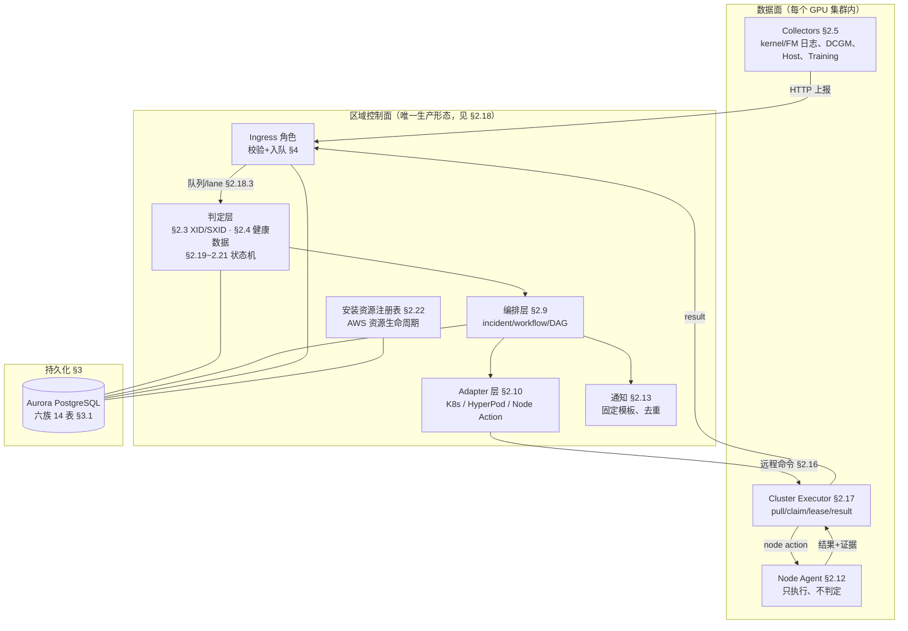
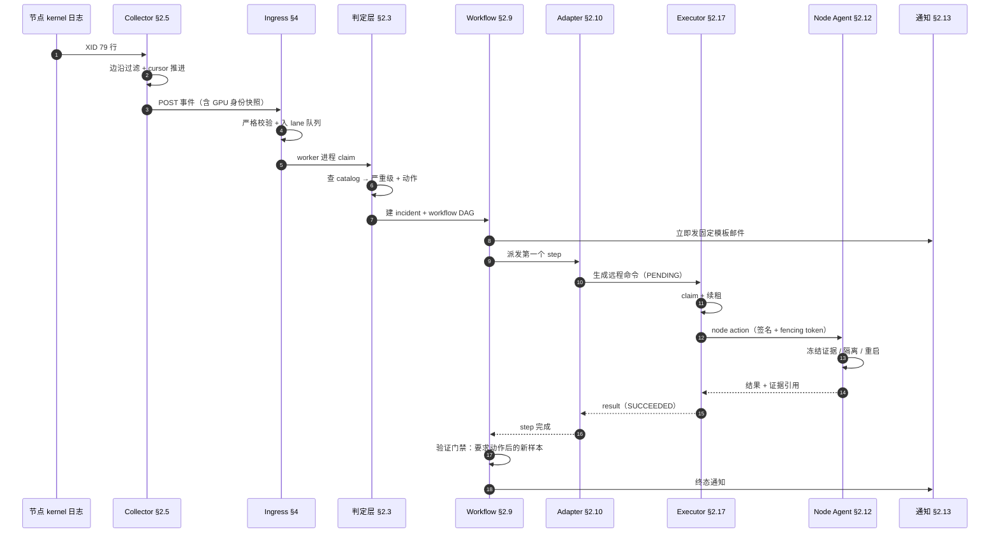
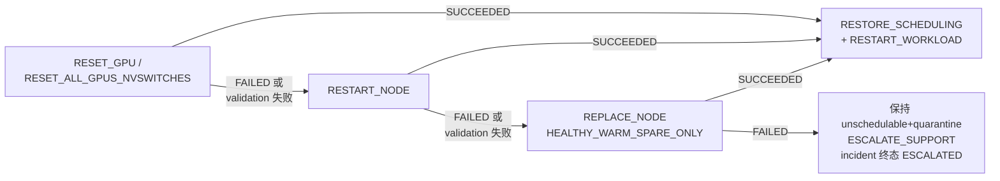
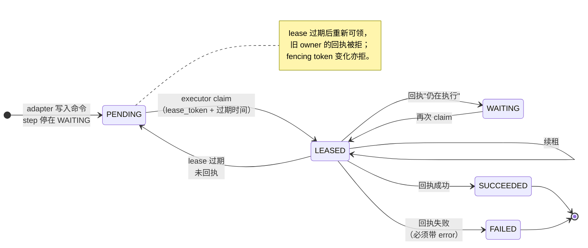
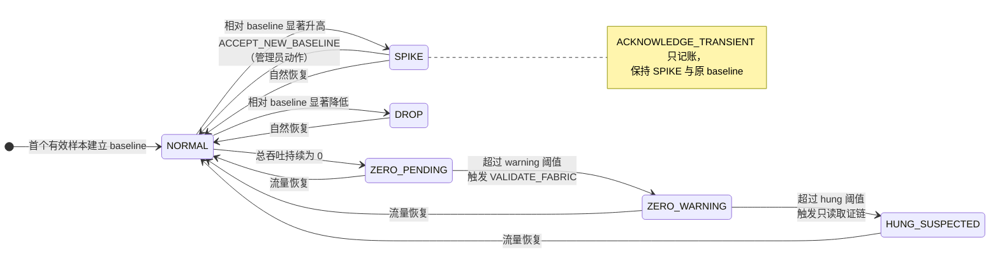
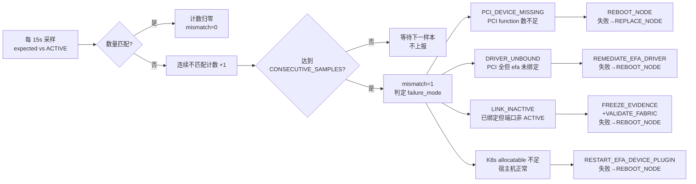
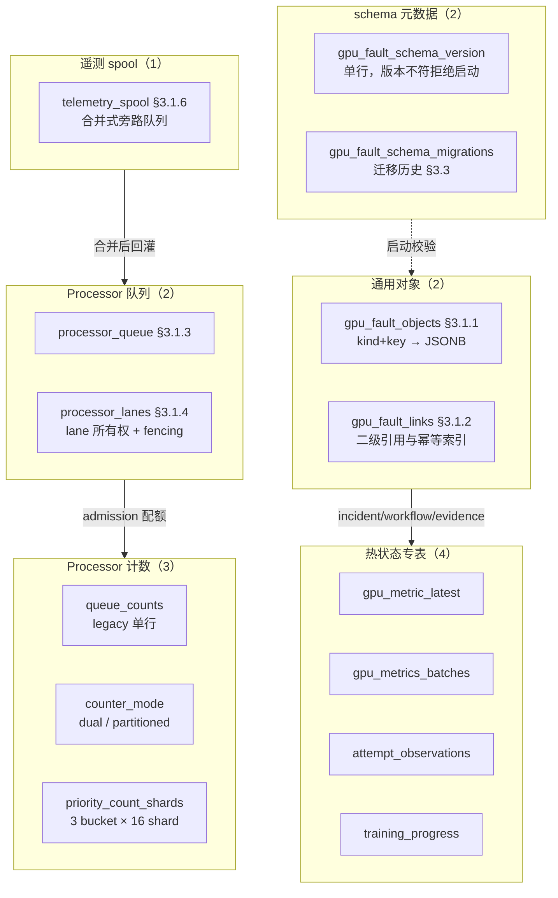

# GPU 故障处理系统详细设计

## 1. 设计基线

### 1.1 本文档的定位与阅读路径

本文是实现级文档：写给要改这套代码的开发者，逐模块说明数据结构、判定条件、
状态机、表结构和接口契约。它不重复《概要设计》里的目标、方案取舍和硬约束；两篇
文档的分工是——**概要设计回答"为什么这样设计"，本文回答"具体怎么实现"**。

阅读顺序建议按角色选择，不必从头读到尾：

| 你要做的事 | 建议阅读顺序 |
| --- | --- |
| 先建立整体印象 | §1.2 模块地图 → §1.3 生命周期 → §2.18 运行形态 |
| 改故障判定规则（XID/SXID/阈值） | §2.1 领域模型 → §2.3 XID/SXID 策略 → §2.4 健康数据 |
| 改采集器或 Node Agent | §2.5 采集器 → §2.12 Node Agent → §2.16 远程命令协议 |
| 改恢复动作或 workflow 编排 | §2.3.1 动作阶梯 → §2.9 workflow → §2.10 adapter |
| 改数据库表或迁移 | §3.1 表结构 → §3.3 迁移与一致性 → §3.2 保留与清理 |
| 改 API 或鉴权 | §4 API 设计（§4.4 鉴权分桶、§4.5 loopback 身份） |
| 定位线上问题 | §1.3 生命周期 → §2.18 运行形态 → §7 日志与指标 |

全文的两条通用约定：一是**所有动作强弱比较只用 §2.3.1 的唯一动作阶梯**，各模块
不另立顺序；二是**所有涉及破坏性动作的路径都 fail-closed**，证据缺失、身份不符、
租约过期一律拒绝执行而不是放行。

### 1.2 系统分层与模块地图

系统分四层：GPU 集群内的采集与执行、区域控制面的判定与编排、持久化、对外接口。
下图给出模块到本文小节的对应关系，可作为全文索引使用。



图 1-1 模块地图与小节索引

两点容易看错的地方：**判定只发生在控制面**，数据面的 collector 和 Node Agent 都
不做策略判断（Node Agent 甚至不知道自己为什么被要求重启）；**Adapter 不直接连
节点**，所有落到节点上的动作都要经过 §2.16 的远程命令协议由集群内 executor 拉取。

### 1.3 一次故障的完整生命周期

下图是最常见的一条路径（kernel 日志出现 XID，最终重启节点并恢复训练），用来把
后面各小节串起来。每一步右侧标注了负责该步的小节。



图 1-2 XID 触发到恢复完成的主路径

失败路径不在图中：任一 step 失败会按 §2.3.1 的动作阶梯升级，证据不足则终局化为
`BLOCKED_MISSING_EVIDENCE` 并附加隔离动作，绝不"因为查不清楚所以放行"。

### 1.4 版本与包入口

本文对应 `gpu-fault-control-plane 0.10.0`，最近一次按当前 `main` 源码、生成清单
和测试契约逐项核对的日期为 **2026-08-27**。包入口如下：

| 命令 | 入口 |
|---|---|
| `gpu-fault-api` | `gpu_fault.api:run` |
| `gpu-fault-collector` | `gpu_fault.collectors_cli:main` |
| `gpu-fault-node-agent` | `gpu_fault.node_agent:run` |
| `gpu-fault-restore-gpu-services` | `gpu_fault.node_agent:restore_gpu_services` |
| `gpu-fault-agent-config-digest` | `gpu_fault.node_agent:print_config_digest` |
| `gpu-fault-completion-watcher` | `gpu_fault.completion_controller:main` |
| `gpu-fault-hyperpod` | `gpu_fault.hyperpod_cli:main` |
| `gpu-fault-fleet` | `gpu_fault.fleet_cli:main` |
| `gpu-fault-cluster-executor` | `gpu_fault.cluster_executor:main` |
| `gpu-fault-cluster-executor-readiness` | `gpu_fault.cluster_executor:readiness_probe` |
| `gpu-fault-node-installer-reconciler` | `gpu_fault.node_installer_reconciler:main` |
| `gpu-fault-store-migrate` | `gpu_fault.store_migrate:main` |
| `gpu-fault-aurora-credential-refresh` | `gpu_fault.aurora_credential_refresh:main` |
| `gpu-fault-config` | `gpu_fault.config_cli:main` |
| `gpu-fault-admin` | `gpu_fault.admin.cli:main` |
| `gpu-fault-workload-annotate` | `gpu_fault.workload_annotate_cli:main` |
| `gpu-training-submit` | `gpu_fault.training_submit_cli:main` |

`gpu-fault-api` 是本地开发入口，监听地址由
`GPU_FAULT_API_HOST` / `GPU_FAULT_API_PORT` 控制。生产 Deployment 不调用该
console script，而是直接执行
`uvicorn gpu_fault.app:create_app --factory`，并显式带
`--no-proxy-headers`（loopback 身份判定依赖直连对端，见 §4.5）。同一个 wheel 按
`GPU_FAULT_SERVICE_ROLE` 在三个 Deployment 上分裂成 ingress/worker/spool-worker
三种角色进程，端口与副本数见 §2.18.1。

## 2. 模块设计

本章按数据流的顺序排列，不按包名字母序：先是所有模块共用的语言（§2.1 领域模型、
§2.2 能力编译），然后是判定（§2.3–§2.4）、采集（§2.5–§2.8）、编排与执行
（§2.9–§2.12）、周边服务（§2.13–§2.15）、区域协议（§2.16–§2.17）、运行形态
（§2.18），最后是三个独立的持续状态机（§2.19–§2.21）。
生产部署与卸载的 AWS 资源事实源单列在 §2.22；它不参与故障判定，但与区域控制面
共享 Store 和鉴权边界。

三个状态机之所以单独成节，是因为它们与前面的"一次事件 → 一次判定"模型不同：它们
对**持续观测量**做有状态判定，需要各自的 baseline、去抖计数和状态转换规则，且只在
状态**转换**时才产生 finding。

### 2.1 领域模型 `src/gpu_fault/models.py`

`StrictModel` 设置 `extra="forbid"`，所有 API 输入拒绝未定义字段。关键枚举如下：

- Environment：`ec2/eks/hyperpod-eks/hyperpod-slurm/kubernetes/slurm`。
- RecoveryAction：无动作、隔离、drain、停止/重启 workload、reset、reboot、replace、诊断、quarantine。
- WorkflowOperation：将恢复动作细分为可执行 step。
- CapabilityMode：`OWN/DELEGATE/AUGMENT/OBSERVE/DISABLED`。
- IncidentState：`DETECTED/ACTION_PENDING/SAFETY_PENDING/QUARANTINED/RECOVERED/ESCALATED`。

`TerminalEvent.event_key` 固定为：

```text
{cluster_id}/{attempt_id}/TrainingAttemptTerminal
```

重复终态返回原 decision，并设置 `duplicate=true`。

TerminalEvent 同时携带 `restart_budget`。`RestartBudgetState` 使用
`cluster_id + job_id` 作为键，保存不可变 budget、已预留次数和幂等 reservation ID。

### 2.2 能力编译 `src/gpu_fault/capabilities.py`

`compile_runtime_profile()` 执行：

1. 过滤 `DISABLED` claim。
2. 检测破坏性 capability 的重复 claim。
3. 拒绝破坏性 capability 使用 `AUGMENT`。
4. 要求 `OWN/DELEGATE` 指定 Adapter。
5. 根据 observed capability 判断 owner 是否可用。
6. 不可用时降级为 `OBSERVE`，不执行动作。

Profile 必须先通过 `POST /v1/runtime-profiles` 注册，事件中的 `runtime_profile_version` 必须能在 Store 中找到。

发布分类使用规范化 Profile 策略摘要：忽略 `cluster_id/profile_version`，并对
`claims/observed` 排序。模板切换为不可变快照或 YAML 字段重排不会改变该摘要，因此
不触发 `FULL` rollout；source/template 原始 SHA 仅用于审计和旧 release state 迁移。

区域 bootstrap 的 `bootstrap-cleaned` 是硬恢复边界：自动清理会把 CPU/GPU
Deployment 缩容到0，并清空已完成集群进度。再次执行同一部署命令时不得复用旧
`resume_phase`或把0副本Deployment判定为CPU已就绪，而是必须重新部署CPU控制面，
再从NLB、DNS/TLS和GPU数据面门禁继续。

区域 upgrade 将`preflight`、artifact上传、schema、registry、CPU、数据面和verify
进度写入release state。高层deploy看到同一未提交release处于`failed`或任一已持久化
upgrade checkpoint时，必须进入resume而不是按当前局部对象重新分类为NOOP。显式
`resume`从持久状态重建retry diff并与release ID、原diff和execution plan逐项校验；
不得省略diff后回退默认`FULL`，否则未变化的PostgreSQL schema会被误判为升级。
`rolled-back`和`complete`是终态，不复用旧transaction checkpoint。

previous只按execution plan捕获可能发生mutation的面。规范JSON经确定性gzip压缩后写入
不可变、内容寻址、最多512 KiB一块的ConfigMap；主release state只保存摘要、原始/压缩
大小和chunk引用。所有读取入口透明hydrate并逐块校验，旧内嵌格式继续兼容。组件
`STARTED/FAILED`立即持久化；同一GPU action中的组件先批量更新内存，再共用一次
checkpoint写入。`COMPLETED`由下一phase或cluster checkpoint合并落盘。

upgrade开始前还会把`executor_internal_error_total`写入previous snapshot。发布后verify
只拒绝该计数相对baseline新增，既保留终态command的审计与24小时retention，也不会让
已审计的历史错误永久阻断后续release；baseline缺失时仍按0处理并fail closed。

### 2.3 XID/SXID 策略 `src/gpu_fault/policy/`

XID 默认策略从包内 `data/nvidia-xid-catalog-610.generated.yaml` 加载。SXID 从
`data/nvidia-fabric-manager-sxid-2025-11-14.yaml` 加载，该文件固定覆盖 NVIDIA
Fabric Manager User Guide Tables 21-24 的 92 个 code。两类 `mapping_version`
都由策略名和摘要前 16 位组成：XID 使用 canonical 生成物摘要，SXID 使用固定
上游摘要。XID loader 会校验固定上游摘要、172/95/32 条数及
`metadata.generatedSha256`，手改规则不能沿用旧的 policy version。

XID 判断顺序：

1. 检查 XID 是否存在于固定 Catalog。
2. 校验 GPU product family。
3. 校验最低 driver branch 和 CUDA 报告版本。
4. 优先使用 XID 154 动态恢复动作。
5. 对 XID 144-150 解码 IntrInfo/Error Status。
6. 处理 XID 45 companion、XID 48/63/64、94/95 等特殊语义。
7. 映射到 `NO_ACTION/RESTART_WORKLOAD/RESET_GPU/REBOOT_NODE` 或官方 workflow。
8. 未知或证据不足时设置 blocked/site safety，不伪装为 NVIDIA 官方动作。

XID 在执行任何 action 前先检查固定 Catalog 的 `products`。具体 SKU 会映射到
Catalog 产品族列：H200/GH200 → H100，B200/B300 → B100，
GB200/GB300 → GB200。产品列不匹配时返回 `NOT_APPLICABLE`，不执行 Catalog action。
当前固定表中的关键代际边界：

- XID 74、80 仅 A100/H100；XID 136 仅 H100，因此不适用于 B/GB 系列。
- XID 126–135、139、144–150、155、159–166、170 仅 B100/GB200，
  因此不适用于 H100/H200/GH200。

上述集合有定向回归，并由完整 Catalog matrix 对全部规则/产品列做交叉验证。

已知 SXID 的 `Fatal/Non-fatal` classification 必须与固定 Catalog 一致；冲突时
`BLOCKED_MISSING_EVIDENCE`，只采集诊断并隔离，不 reset/reboot。日志正文中的
`Access/Trunk` 只是原始证据，不能授权恢复动作。SXID 要求明确的 fatal
classification 和可信 access/trunk scope。`UNKNOWN` scope 先由
`NvSwitchPortTopologyService` 查询最近五分钟内的可信
`nvswitch_port_topology` 遥测，按 node、switch ID 和 port 精确匹配。多个数据源结论
冲突、记录过期或身份不完整时继续 fail closed。H100/H200/H20 第三代单 baseboard
没有 trunk link；带明确 port 的普通 `FATAL` 可使用该平台拓扑约束补全为
`ACCESS`。B200/B300 不进入传统 SXID 流程。

Fabric Manager SXID message 只适用于 Hopper 及更早 GPU。运行时使用同一产品族
归一化：B100/B200/B300 归入 B100，GB200/GB300 归入 GB200；这两个
Blackwell family 均返回 `NOT_APPLICABLE`，不进入 SXID Catalog action。显式提供但
无法识别代际的产品返回 `BLOCKED_MISSING_EVIDENCE`，不得猜测为 Hopper。产品字段
缺失仍按兼容路径处理，但生产 collector 必须上报真实 product。

SXID Catalog 动作映射如下：

- 普通 `FATAL`：可信 `ACCESS` 执行参与 GPU reset，可信 `TRUNK` 执行本节点完整
  GPU/NVSwitch reset；scope 不可信时隔离。
- `10003/19084`：不依赖日志 scope，要求完整 inventory/partition 后执行本节点完整
  GPU/NVSwitch reset。
- Table 23 `ALWAYS_FATAL`：官方语义为 restart host 或 SBR/service VM；HyperPod
  裸金属映射为 `RESTART_NODE`，不伪装成 full-fabric reset。
- `11004/12028`：仅适用于 shared NVSwitch/vGPU 的 `RESTART_VM`；HyperPod 裸金属
  保持 blocked。
- `20012`：机械连接检查；`10004/10005`：散热或 thermal 状态检查。

同一 `event_id` 的重复请求返回已有 decision。HMA、kernel 和 DCGM 的跨源关联要求节点及错误码相同，并在双方都有 GPU UUID 或 PCI BDF 时要求交集。

NVLink catalog 在加载时校验每个 pattern 必须为 32 位 `0/1/-`，errorStatus 必须为
十六进制列表；畸形 catalog 阻止进程启动。

### 2.3.1 DCGM/XID/SXID 训练 attempt 身份与跨类型仲裁

当前版本采用“一个 GPU 节点同一时刻最多运行一个受管训练 attempt”的约束。
控制面从 Completion Watcher 持久化的 `AttemptObservation` 中查询事件节点最近
120 秒内的 `RUNNING/PENDING` attempt。只有候选集合中恰好存在一个
`job-id + attempt-id` 时，才将身份来源标记为
`SOLE_ACTIVE_ATTEMPT_ON_NODE` 并允许自动跨类型聚合。零候选标记
`NO_ACTIVE_MANAGED_ATTEMPT`；多个候选标记 `AMBIGUOUS_ACTIVE_ATTEMPTS`，均不猜测
训练任务，也不进入跨类型聚合。显式事件身份仍需与 AttemptObservation 一致。

聚合键为 `cluster-id + job-id + attempt-id`，不包含 metric 名、XID/SXID code 或
action。DCGM metric 只有 `new_findings` 状态边沿进入仲裁；持续 scrape 的相同 finding
不会重复创建 incident。
`GPU_FAULT_MULTI_NODE_AGGREGATION_WINDOW_SECONDS` 同时作为跨节点及跨类型 quiet
period；每个并入且尚未执行的事件都会刷新 workflow 的 `not_before`。到期后若同一
`cluster_id` 仍有 `PENDING/LEASED` processor 请求，dispatcher 暂缓领取 workflow；
固定的 `aggregation_max_deadline` 最多再等待
`GPU_FAULT_PROCESSOR_DRAIN_MAX_WAIT_SECONDS`（默认 30 秒），到期后强制放行，避免
持续遥测导致饥饿。其他集群和已完成请求不影响该 workflow。动作优先级为：

```text
RUN_DIAGNOSTICS < RESTART_WORKLOAD < RESET_GPU < RESET_ALL_GPUS_NVSWITCHES
< RESTART_NODE < DRAIN/QUARANTINE < REPLACE_NODE
< CHECK_MECHANICALS/ESCALATE_SUPPORT
```

该阶梯是全局唯一的动作强弱序，跨类型仲裁、workflow 合并、抢占和失败升级都用它
比较，不在各模块另写一份。

只有 GPU 类、携带 metric 名且策略来源为 DCGM/NVIDIA GPU Memory Error Management 的
`NodeHealthFinding` 才进入该故障组。CPU、文件系统、网络等普通 node-health finding
继续使用独立 workflow，避免时间接近但无因果关系的告警被误合并。每个原始事件和
evidence 仍分别保存；仲裁只统一 incident 与最终 workflow。

控制面还检查该 attempt 当前 workflow 状态：

- `PENDING` 且未被 claim：更高级 action 原地升级；相同 action 合并；低级 action
  只链接事件和证据。
- `RUNNING`：相同或低级 action 不重复执行；更高级 action 创建带
  `predecessor_workflow_id` 的 successor。
- predecessor 未进入 `SUCCEEDED/FAILED/BLOCKED` 前，Dispatcher 不执行 successor。
- 终态 workflow 收到相同或低级的旧 attempt 事件时不重复执行；更高级 action
  创建 successor。
- attempt ID 改变后使用新聚合键。控制面通过 `RESTART_WORKLOAD` step execution 中
  持久化的 `restart_attempt_id`，将新 attempt 精确关联到触发它的旧 workflow；
  `PENDING/RUNNING/SAFETY_PENDING` workflow 则按相同 `cluster-id + job-id`
  关联正在进行的恢复。

Completion Watcher 在 `AttemptObservation.started_at` 中上报当前 attempt 所有 Pod
最早的 `status.startTime`，字段缺失时回退 `metadata.creationTimestamp`。控制面统一按
`source_event_time > observed_at > collected_at > ingested_at` 选择故障实际发生时间。
当 `started_at` 晚于事件时间时，该事件属于前一 attempt generation：

- candidate action 等级小于或等于当前恢复 workflow 时，只把 event/evidence 链接到
  原 incident，并追加包含两个时间戳、attempt ID 和动作等级的固定审计 reason；不新建、
  不更新或重新执行 workflow。
- candidate action 等级严格更高时，创建以当前恢复 workflow 为 predecessor 的
  successor。即使 predecessor 已终态，也保留该依赖以形成完整审计链。
- `started_at` 不可信、找不到同 job 恢复 workflow 或事件时间不早于 attempt 启动时间时，
  不做时间忽略，保持原有 fail-safe 处理。

该代际栅栏也在 provider 已相关 incident 的快速返回路径执行，避免相关窗口提前吞掉
严格升级事件。

当事件时间晚于新 attempt 的 `started_at` 时，事件属于当前 generation，不能因为旧
workflow 的 action 等级更高而忽略。若相同 `cluster-id + job-id` 的上一轮 workflow
仍为 `PENDING/RUNNING/SAFETY_PENDING`，控制面保留新事件自己的 incident、action 和
attempt-id，并创建独立 workflow，将上一轮 workflow 写入
`predecessor_workflow_id`。Dispatcher 只在 predecessor 进入
`SUCCEEDED/FAILED/BLOCKED` 后执行新 workflow。该规则实现执行串行化，不参与动作降级
判断：例如运行中的 `RESTART_NODE` 后收到当前 generation 的 XID 11，XID 11 的
`RESTART_WORKLOAD` 不会被忽略，但必须等待 `RESTART_NODE` workflow 终态。

按 `cluster-id + job-id` 的串行化只覆盖同一训练任务的两个事件。空闲节点没有 job，
host 采集器上报的 finding 也不携带可信 job 归属，因此还需要一层与 job 无关的
按节点独占性的串行化，见 2.9.1。两层同时生效，取先命中的 predecessor。

该约束暂不支持同一 GPU 节点并行运行多个训练任务。未来支持该场景时，必须增加
`GPU UUID -> host PID -> cgroup/container ID -> Pod UID -> job/attempt` 所有权链路，
不能继续使用节点唯一 attempt 推断。

XID 45 不在请求线程内立即判定 solo。控制面先将事件和
`PENDING_CORRELATION` decision 写入共享 Store，并等待 Catalog 固定的 30 秒
companion 窗口闭合。所有副本都可观察 pending 记录，但只有取得 PostgreSQL
advisory-lock lease 的副本能够最终处理。关联要求 cluster、node 和 GPU 身份一致：
优先比较 GPU UUID，缺失时比较 PCI BDF；两者都缺失则 fail-closed，不关联。双方有
boot ID 时还必须一致。窗口闭合后发现 companion，XID 45 复用主 XID 的 incident
和 workflow；未发现时才生成 `RESTART_FM`。事件、pending 状态、lease 和最终
decision 均持久化，因此 API Pod 重启或请求落到不同副本不会丢失关联。

companion 窗口关闭后若 policy 仍返回 `PENDING_CORRELATION`，协调器将其终局化为
`BLOCKED_MISSING_EVIDENCE` 并附加 `QUARANTINE` safety action，完成 correlation
lease，避免永久重试。

XID 154 使用相同的共享 Store correlation lease。Kernel 原文只在明确匹配
`GPU recovery action changed ... to 0xN (<label>)` 时解析，允许的 label 固定为
`None`、`Drain P2P`、`Drain and Reset`、`GPU Reset Required` 和
`Node Reboot Required`；未知或缺失 label 必须 `BLOCKED_MISSING_EVIDENCE`，不能仅按
十六进制值猜测。关联要求同 cluster、node、GPU UUID/PCI BDF、boot ID 和 30 秒窗口。
XID 144-150 解码为 `XID_154_EVAL` 时等待窗口闭合：存在 XID 154 时执行动态动作，
不存在时才按 Catalog fallback 执行 `RESTART_APP`。Primary event 先于 XID 154 到达时
也不会提前创建错误 workflow；窗口关闭时先 finalize primary，再把 XID 154 链接到同一
incident，避免双重 reset/reboot。

XID 144-150 的生产 normalizer 按 NVIDIA Catalog 定义的 kernel message 边界解析：
只检查当前 XID 编号之后、下一个 XID 之前的括号载荷，并要求括号内恰好包含七个
32-bit 十六进制寄存器。第一个寄存器映射为 `intr_info`，第二个映射为
`error_status`；其余五个 debug data 保留在原始证据中。解析器接受带 `0x` 的
1-8 位十六进制值，以及不带前缀的固定八位十六进制值，字段可用空格或逗号分隔。
载荷不足、值超过 32 bit、位于其他 XID 后方或格式不唯一时不猜测字段，策略返回
`BLOCKED_MISSING_EVIDENCE` 并 quarantine。该提取逻辑由 Kernel、HMA CloudWatch 和
Fabric Manager 三种归一化入口共用。

Catalog 中已有生产 adapter 的专用动作直接编译为精确 workflow：

- `CONTACT_SUPPORT -> ESCALATE_SUPPORT`，不擅自 reset 或 reboot。
- `CHECK_MECHANICALS -> FREEZE_EVIDENCE -> CHECK_MECHANICALS`。该动作是人工调查，
  不自动 cordon 或停止健康 workload；step 发固定模板通知，并等待
  `gpu-fault.io/mechanical-inspection-complete=<incident_id>:<fencing_token>`
  annotation。后续 reset/reboot 必须是另一条显式、带新 fencing 的 workflow。
- `UPDATE_SWFW -> MARK_UNSCHEDULABLE -> [STOP_WORKLOADS] ->
  QUIESCE_GPU_SERVICES -> VERIFY_NO_GPU_CLIENTS -> UPDATE_SOFTWARE_FIRMWARE ->
  RESTORE_GPU_SERVICES -> validation/restore`。目标版本、命令和 SHA-256 缺失时阻塞。

XID 74 使用 NVIDIA Catalog `WORKFLOW_NVLINK_ERR` 的固定寄存器表。Kernel
normalizer 从 XID 编号之后提取全部 `0x...` 字段，必须恰好得到七个寄存器；PCI BDF
中的十六进制数字不会参与。Link 身份只从原始消息中明确的 `Link N` 或
`NVLink N` 字段提取，禁止由 GPU UUID、PCI BDF 或节点位置猜测。控制面只对
Hopper family（H100/H200）应用该表：

- 第一、三、四、五寄存器按官方 bit 分类为 safe、secondary、ECC/parity、
  mechanical/hardware、marginal channel、fabric reset 或 corrected threshold。
- 控制面在共享 Store 中按
  `(cluster, GPU UUID/节点 PCI BDF, Link, register, bit)` 保存永久计数状态；
  event ID 是幂等键。PostgreSQL 使用 transaction advisory lock，SQLite 使用
  `BEGIN IMMEDIATE`，多个控制面副本不能重复计数。
- 需要“same link/repeated”判定的 bit 缺少显式 Link 身份时
  `BLOCKED_MISSING_EVIDENCE` 并 fail closed，不使用原来的 GPU 级重复代理。
- 第二、六、七寄存器非零、任一未定义 bit、七寄存器全零，均不猜测，编译为
  evidence/support 流程。
- 只有 safe-ignore 和 corrected-threshold bit 时为 `MONITOR_ONLY`，不停止训练。
- ECC/parity bit 在同一 Link、同一寄存器位第 1、2 次只监控，第 3 次
  （`count > 2`）进入诊断和 `RESET_GPU`；reset 成功前不直接 support。
- `report_if_repeated` 在第 2 次进入诊断和 `RESET_GPU`；
  `field_diag_if_repeated` 在第 2 次顺序执行诊断包、NVIDIA Field Diagnostic 和
  reset。策略与 workflow 必须同时包含恢复动作，不能只生成 evidence step。
- mechanical/hardware 第 1 次直接执行隔离、quiesce、无客户端校验和
  `RESET_GPU`，不让人工检查阻塞可恢复动作；第 2 次视为 persistent，在 reset 前增加
  诊断包和 Field Diagnostic。reset/reboot 后仍持续出现时才进入人工硬件检查或支持。
- marginal-channel 执行隔离、Field Diagnostic、`RESET_GPU`、quarantine 和
  support，并在健康容量上恢复 workload；
  production-unexpected、secondary-only 直接进入 support。
- 第四寄存器 bit 18 的官方语义是 fabric reset。普通 XID 事件不携带完整本地
  NVSwitch partition inventory，因此保持隔离并发 support，绝不降级成单 GPU reset。
- A100 虽在 XID 74 产品范围内，但固定目录明确将这些寄存器定义为 Hopper 有效；
  A100 事件不会套用 Hopper bit decoder。

诊断包额外包含 `nvidia-smi nvlink --errorcounters` 和 `nvidia-smi topo --matrix`，manifest
保存 Link ID、bit 计数、七个寄存器、解码原因、PCI BDF、policy version 和原始
evidence reference。
直接 support 使用固定 `xid74-support-zh-v2` 邮件，不复用“自动恢复链已耗尽”模板。
`RUN_NVLINK74_WORKFLOW` 在达到官方 Field Diagnostic 条件时生成，并携带 Link ID、
寄存器和计数；生产 Runtime Profile 必须为 `nvlinkDiagnostics` 配置真实 owner，
否则 workflow 保持 safety pending。生产 owner 为 `gpu-fault-node-agent`：

- Node Agent 仅执行管理员预安装的绝对路径命令，不内置或下载 NVIDIA Field
  Diagnostic。
- 可执行文件 SHA-256 在 Agent 启动时校验；命令不经过 shell，只允许
  `{link_id}`、`{gpu_uuid}`、`{pci_bdf}` 三个占位符。
- `RUN_NVLINK74_WORKFLOW` 使用 link 专用命令；row-remap failure 使用独立
  `RUN_FIELD_DIAGNOSTIC` 和 `memoryDiagnostics` capability。内存诊断不要求 Link
  ID，也不会用空值冒充 Link ID。
- operation 仍受签名、fencing token、allowlist、命令 TTL 和幂等 ledger 保护。
- 执行前同时检查 NVML compute client 和 `/dev/nvidia*` device client；任一 client
  存在即失败，不启动 Field Diagnostic。

`mechanicalInspection` 的生产 owner 为 Kubernetes adapter。它读取 Node annotation
`gpu-fault.io/mechanical-inspection-complete`，值必须是当前
`<incident-id>:<fencing-token>`。未匹配时 step 保持 `WAITING`；旧 incident 的确认
不能复用。该能力用于 Catalog 明确给出 `CHECK_MECHANICALS` 的事件；XID 74 的
mechanical/hardware 分支采用 reset-first，不创建前置人工检查。需要人工检查的后续
升级在 Field Diagnostic 或自动恢复失败后保持 quarantine 并进入固定 support 流程。
机械检查首次进入 `WAITING` 时发送
`xid74-mechanical-zh-v1` 固定模板待办邮件；notification 和投递结果按 incident
幂等，不由大模型生成。

### 2.4 健康数据处理

#### 2.4.1 GPU Metrics `gpu_metrics.py`

支持温度、功耗、利用率、显存、ECC、retired page、row remap、PCIe、NVLink、violation 和 XID。Counter 按 Store 中 baseline 计算 delta，counter reset 不产生负增量。PCIe replay 进一步按前后样本时间计算每分钟 rate。

温度策略优先使用collector通过`nvidia-smi -q -x`读取的设备限制：

| 参数 | 默认值 |
|---|---:|
| GPU warning margin | slowdown/max-operating以下5 C |
| GPU shutdown margin | shutdown以下3 C |
| HBM warning margin | memory max-operating以下5 C |
| GPU fallback warning/critical | 85/90 C |
| HBM fallback warning/critical | 90/95 C |
| Thermal violation连续升级 | 2个增长样本 |
| PCIe replay rate warning | `>8/min` |
| NVLink error delta critical | `>=1` |

DCGM 的 XID gauge 首次只建立 baseline，后续值变化才产生 XidEvent；重复同值不反复报警。
row-remap 使用 correctable/uncorrectable remapped-row 字段；H200 等环境优先使用
`DCGM_FI_DEV_NVLINK_ERROR_DL_CRC/RECOVERY/REPLAY` 聚合字段。Collector 对
`N/A`、空值和设备不支持字段按缺失处理，不把它们强制转换成 0。

GPU metric finding 保存 `policy_source`、`policy_version`、
`policy_reference`、`official_action` 和 `automatic_action`。控制面转换为
`NodeHealthFinding` 和 incident 时保留这些字段：

- NVIDIA DCGM Health 的 warning 进入 diagnostics。
- NVIDIA DCGM Health 的 error 使用 `DRAIN`：停止受影响任务、隔离、采集诊断包和
  验证 GPU，不根据单个 raw counter 擅自 reset 或 replace。
- pending row remap 使用受控 reset workflow。
- row-remap failure 使用 drain/quarantine；只有 NVIDIA Field Diagnostic 验证后才能
  进入 RMA/替换判断。
- 设备温度限制派生规则使用`SITE_NVIDIA_DEVICE_LIMIT_DERIVED`；达到设备运行限制时
  使用`DRAIN`，固定温度只作为读取失败时的`SITE_DCGM_METRIC` fallback。
- thermal violation首次增长进入diagnostics，连续增长达到配置次数后升级为`DRAIN`。
- finding从warning升级到critical或自动动作改变时会再次产生`new_finding`，使既有
  attempt workflow能够原地升级或创建successor。

GPU/HBM 温度 warning 的 diagnostics 不是被动读取指标。控制面生成
`FREEZE_EVIDENCE -> RUN_DCGM_DIAGNOSTIC -> VALIDATE_GPU`，Node Agent 执行非破坏性的
`dcgmi diag -r 1 -j`，将原始 JSON、stderr、SHA-256 和结果状态写入 root-only 证据目录。
`PASS/WARN` 进入冷却观察；warning 在
`GPU_FAULT_TEMPERATURE_WARNING_GRACE_SECONDS`（默认 120 秒）内仍存在时 validation
保持 `WAITING`，清除后成功。`FAIL/INCONCLUSIVE` 或观察期结束后 warning 仍存在时，
原 workflow 失败并幂等升级为 `DRAIN`：禁止调度、停止受影响任务、隔离节点、采集完整
诊断包并验证 GPU。该升级不包含 `RESTORE_SCHEDULING` 或 `RESTART_WORKLOAD`，必须在
故障清除并经管理员处置后才能恢复。

DCGM JSON 解析采用有界结构化处理，最多把 100 条结果和每条 20 个、最长 512 字符的
消息写入 workflow；完整 stdout/stderr 只保存在证据文件。每条结果包含
`test_name/status/entities/error_codes/messages/result_path`。处置指导来自固定规则表，
不调用大模型：

| Action code | 匹配类别 | 固定处置方向 |
|---|---|---|
| `THERMAL_COOLING_INSPECTION` | thermal/temperature/cooling | 保持 drain，检查风道、风扇、散热器、环境温度和设备温度限制 |
| `NVLINK_NVSWITCH_INSPECTION` | NVLink/NVSwitch/fabric | 检查链路计数、拓扑和 Fabric Manager 日志 |
| `PCIE_AER_INSPECTION` | PCIe/AER | 检查 PCIe 链路、AER、replay counter 和主板连接 |
| `GPU_MEMORY_FIELD_DIAGNOSTIC` | memory/ECC/row-remap | 收集内存证据并运行已配置的 NVIDIA Field Diagnostic |
| `DRIVER_DCGM_REMEDIATION` | deployment/DCGM/driver/software | 检查版本兼容和服务，通过受控软件维护 workflow 修复 |
| `GPU_CLIENT_DRIVER_CHECK` | context/permission | 检查 GPU client、权限、driver 和容器 runtime |
| `GPU_FIELD_DIAGNOSTIC` | SM/compute/stress | 收集 bug report 并运行 NVIDIA Field Diagnostic |
| `DEEP_DIAGNOSTIC_REVIEW` | 未识别测试 | 保持 drain，人工审核证据并运行深度诊断 |
| `DCGM_EXECUTION_REVIEW` | 非零退出或 JSON 不可解析 | 检查 `dcgmi`/hostengine、stderr，并重新诊断 |

Node Agent 返回的 `diagnostic_findings`、`recommended_actions`、`evidence_ref`、SHA-256
和 control-plane action 会写入 step execution。诊断失败升级后的 incident reasons
同时保存证据 URI 和固定指导。每次诊断还生成一次幂等的
`dcgm-diagnostic-zh-v1` 邮件，邮件字段完全来自结构化结果和上述规则表。

#### 2.4.2 DCGM metric 联合分析状态机

单指标 finding 保持原有阈值和 NVIDIA/site provenance。每个 batch 完成单指标更新后，
控制面按 `cluster + node + GPU UUID/PCI BDF` 读取相关 active finding 和最新 metric，
在事件时间窗口内运行 `SITE_DCGM_CORRELATION` 状态机。默认窗口 45 秒；状态以
`composite:<rule-id>` 为 key 持久化，保存 active/clear、连续次数、severity 和 action。
重复样本不重新触发；warning 升级为 critical/action 改变时产生新状态边沿。

| Rule ID | 必需联合信号 | 结论和动作 |
|---|---|---|
| `THERMAL_STRESS` | GPU/HBM温度finding + thermal violation或thermal throttle bit | 首次diagnostics；默认连续2次后`DRAIN` |
| `POWER_LIMIT_THROTTLING` | power violation + power usage达到limit配置比例 + 高utilization + 无温度finding | 功耗限制上下文，diagnostics，不直接判硬件损坏 |
| `GPU_MEMORY_DEGRADATION` | DBE/uncorrectable remap + pending/failed repair或pending retired page | `DRAIN`、Field Diagnostic/RMA证据 |
| `PCIE_XID_LINK_FAILURE` | PCIe replay rate finding + 同GPU XID 32/79 | `DRAIN`并保留PCIe/XID联合证据 |
| `NVLINK_LINK_DEGRADATION` | 同GPU至少两类NVLink error finding | `DRAIN`并执行链路/fabric诊断 |
| `MULTI_GPU_NVLINK_FABRIC_FAILURE` | 同节点至少两个GPU有NVLink error finding | 生成一个节点级composite并`DRAIN` |
| `CORRECTABLE_MEMORY_DEGRADATION` | SBE、retired SBE page、correctable row-remap中至少两类同时增长 | 首次diagnostics；默认连续3次后`DRAIN` |

热降频使用 `DCGM_FI_DEV_CLOCK_THROTTLE_REASONS` 的 software/hardware thermal slowdown
位 `0x20/0x40`。`SM_CLOCK`、`MEM_CLOCK` 只作为性能影响上下文；单独低时钟可能来自
GPU idle、application clock 或 power cap，不产生 thermal finding。

violation 类计数器附带**量纲合理性闸门**。这类字段的语义是"处于违规状态的微秒数"，
因此每分钟增量不可能超过一分钟；`MAX_PLAUSIBLE_VIOLATION_US_PER_MINUTE`
取 `60_000_000 × 1.05`（多出的余量吸收采样偏斜）。`_throttle_decision` 在
delta 越过阈值后先检查 rate：超过该上界时**不产生 finding**，因为计数器声称的违规
时长长于已流逝的时间，说明它在这台机器上并不是这个量纲，不可解释的量不能作为判据。
这条闸门是必要的而不是保守的——thermal violation 连续 2 次越界即升级到 `DRAIN`，
在这里放过一个不可解释的速率会**驱逐健康节点**。功耗 finding 路径
（`POWER_LIMIT_THROTTLING`）不加此闸门：它本来就要求 power/limit 比值与高
utilization 同时成立，加闸门只会丢真阳性。

GPU validation 将 `gpu_temperature_c`、`memory_temperature_c`、
`thermal_violation_total_us`、`clock_throttle_reasons` 和
`composite:THERMAL_STRESS` 视为同一 thermal cooldown 集合。只有集合内所有 active
finding 都是 Warning 时才在 grace 内返回 `WAITING`；任一 finding 升级 Critical、
出现其他类别 finding，或 grace 到期后仍未清除，立即返回 `FAILED` 并触发既有
`DRAIN` 升级。这样首次 thermal throttle 不会绕过连续采样状态机。

Corrected-memory counter 使用相邻样本正增量，不使用累计绝对值误判旧错误：

- `ecc_sbe_volatile_total`、`ecc_sbe_aggregate_total`：增量达到配置值后 Warning。
- `retired_pages_sbe_total`：新增 corrected-ECC retired page 后 Warning。
- `row_remap_correctable_total`：新增 correctable remap 后 Warning。
- `retired_pages_dbe_total`：新增 uncorrectable-ECC retired page 后 Critical/DRAIN。

前三类 Warning 与 `CORRECTABLE_MEMORY_DEGRADATION` 使用独立的
`GPU_FAULT_TRANSIENT_GPU_WARNING_GRACE_SECONDS`。在 grace 内保持 `WAITING`，等待下一
完整 scrape 清除 transient delta；达到连续阈值升级 Critical、混入其他故障或 grace
到期仍未清除时 validation 失败。以上阈值和自动升级均为可配置站点策略，
`policy_source=SITE_DCGM_METRIC/SITE_DCGM_CORRELATION`，不声明为 NVIDIA 官方 RMA
阈值。

组合命中后，原始 component finding 继续保存并参与 validation，但其本次
`new_finding` 被标记到 `suppressed_finding_ids`，不各自创建 workflow。只有 composite
finding 进入 attempt 聚合和最高动作仲裁。Composite 保存 rule ID、component finding
ID、metric、evidence URI、受影响GPU和confidence；policy source固定为
`SITE_DCGM_CORRELATION`，不会声明为NVIDIA官方组合策略。XID/SXID/host事件仍由既有
attempt级跨来源仲裁聚合；本状态机不根据时间接近擅自推导未被规则证明的共同根因。

Exporter raw metrics 不能完整替代 `dcgmi health` 返回的 subsystem 和 error code；
本模块只对 NVIDIA 文档可由字段可靠重建的规则标记 NVIDIA 来源。

#### 2.4.3 Host Health `host_health.py`

采集和判断 CPU/load、MCE、内存、OOM、文件系统、Lustre、NIC、RDMA/EFA、服务状态和日志模式。Finding 转换为 marker，并进入独立 `SITE_NODE_HEALTH` incident。

Host collector只读取driver为`efa`的InfiniBand设备，mlx5等其他RDMA设备不进入EFA
计数、流量或错误基线。BMC状态`nc`表示non-critical，不计入
`bmc_critical_sensor`；只有`cr/critical/nr/non-recoverable`计数。SMART设备扫描忽略
空行和非`/dev/*`记录。

Node log一条消息可同时命中多条规则。策略先按`FATAL > CRITICAL > WARNING > INFO`
选择最高severity，再按全局RecoveryAction rank选择更强动作；完全同级时保留规则表中
更具体、位置更靠前的规则。因此包含OOM文本和EFA fatal的同一行最终判为RDMA
critical quarantine，而不是先命中的内存warning。

#### 2.4.4 Training Health `training_health.py`

每 rank heartbeat 包含 step、吞吐、loss、numerical error 和 checkpoint。检测：

- heartbeat timeout；
- startup grace 后无进度；
- step regression；
- 相对 peer 的 step lag；
- 吞吐比例过低；
- `numerical_error=true`。

状态转移以持久化 signal key 去重，多 API 副本不会重复产生同一 active finding。

### 2.5 采集器 `src/gpu_fault/collectors/`

`HttpEventSink` 将结构化事件提交到控制面。网络错误、429 和 5xx 有界重试，其他 4xx 立即失败。

当前实现 10 个 Collector 类（`gpu/`、`host/`、`logs/`、`cloud/` 四个子包加
`training_progress.py`），按实现类型计数，不把同一进程的多个逻辑通道重复计数：

| Collector | 输入 | 输出 API |
|---|---|---|
| KernelLogCollector | `/dev/kmsg` | `/v1/collector-events/nvidia-kernel` |
| FabricManagerLogCollector | Fabric Manager 日志文件/journal | `/v1/collector-events/fabric-manager` |
| DcgmMetricsCollector | Prometheus endpoint | `/v1/collector-events/gpu-metrics`、`/v1/collector-events/gpu-inventory` |
| NvidiaSmiMetricsCollector | `nvidia-smi` CSV | `/v1/collector-events/gpu-metrics`、`/v1/collector-events/gpu-inventory` |
| HostTelemetryCollector | `/proc`、`/sys`、命令 | `/v1/collector-events/host-telemetry` |
| NodeLogCollector | journal 与文件 | `/v1/collector-events/node-logs` |
| KubernetesNodeResourceCollector | Node `status.allocatable`（每集群单副本） | `/v1/collector-events/host-telemetry`（GPU/EFA allocatable 作为 host 样本上报） |
| KubernetesHmaNodeCollector | Node list/watch | `/v1/provider-events/hyperpod-hma/kubernetes-node` |
| CloudWatchHmaCollector | CloudWatch/SQS HMA 事件（`SqsHmaConsumer` 为其 SQS 桥） | `/v1/provider-events/hyperpod-hma/cloudwatch`、`/v1/provider-events/hyperpod-hma/node` |
| TrainingProgressCollector | 应用 JSON | `/v1/training-progress` |

`GPU_INVENTORY` 是 GPU metrics collector 进程内的第二条逻辑通道（
`src/gpu_fault/collectors/gpu/discovery.py::deliver_gpu_inventory`），不是独立
collector 进程。日志类 collector（kernel、Fabric Manager）另外周期上报
`/v1/collector-events/collector-health`，让控制面在无事件期间也能区分"没故障"和
"采集已死"。每节点默认启用的 systemd 单元、集群级副本数与默认禁用项见概要设计
§4.2 的生产状态列。

`gpu_fault.collector_sinks` entry point 注册两个 sink：`http`（`HttpEventSink`）和
`sqs`（`SqsEventSink`）。CollectorContext 公共字段包括 cluster、profile、GPU
product、driver、CUDA、workload 和 checkpoint。

#### 2.5.1 采集侧边沿过滤与 GPU 身份快照

DCGM collector 在节点侧维护指标基线和有限滚动历史。首个样本建立控制面基线；之后
仅在错误 counter 增长/重置、XID 变化、温度/retired page/row-remap/power 候选进入
或恢复、连续确认样本，以及周期健康摘要时发送完整批次。故障候选批次携带最近
`GPU_FAULT_DCGM_HISTORY_MAX_POINTS` 个历史点。控制面 processor 对同一节点尚未领取
的 telemetry 使用 latest-wins 合并；节点筛选和合并都不直接产生恢复动作，最终 finding
和 workflow 仍由版本化控制面策略决定。

GPU身份清单不依赖上述DCGM edge filter。节点metrics collector默认每60秒额外执行
一次只读`nvidia-smi --query-gpu=index,uuid,pci.bus_id,name`，通过
`/v1/collector-events/gpu-inventory`必发结构化snapshot。snapshot包含node、boot ID、
GPU index、UUID、PCI BDF和产品型号；Aurora按`cluster_id + node_id`仅保留最新值。
XID日志只有PCI地址时，控制面使用该snapshot补全GPU UUID；SXID需要参与GPU集合时使用
同一snapshot。snapshot默认有效期180秒，并要求事件boot ID与snapshot一致；缺失、过期
或boot不一致时fail-closed。旧`gpu_metric_latest`身份映射仅作为滚动升级期间的兼容
回退，不再作为正常路径。Node Agent在执行reset前仍重新读取本机实时inventory并校验
目标集合，因此控制面的身份snapshot不能绕过数据面的最终安全门禁。

DCGM edge candidate只有连续达到确认次数时才投递；一次性candidate及其恢复均被抑制，
硬件counter变化仍立即投递。previous value与candidate streak有配置上限，避免设备换代
后状态无限增长。Host edge同样只投递新出现、恢复和周期summary，持续相同edge不按15秒
重复写控制面。

violation 类 counter 参与 candidate 判定时先算占空比（增量微秒 ÷ 采样间隔微秒），
越过 `GPU_FAULT_DCGM_VIOLATION_DUTY_CYCLE_THRESHOLD`（默认 0.05）才算候选。
占空比高于 `DUTY_CYCLE_MAX_PLAUSIBLE`（1.05）时**不参与边沿判定**，并对该
device/字段打一次 WARNING：违规时长不可能长于流逝时间，超过说明该字段在这台机器上
不是微秒量纲。这条闸门直接防一类静默漏报——现网 H200 的
`DCGM_FI_DEV_POWER_VIOLATION` 在完全空闲时也以约 1.125e9 ns/s 前进，占空比恒定越界，
于是每张卡在启动后约 `GPU_FAULT_DCGM_EDGE_CONFIRMATION_SAMPLES` 个样本内就锁成
confirmed candidate；confirmed candidate 只在跳变时announce一次，此后**真实的功耗节流
再也产生不了投递沿**。拒绝给不可解释的占空比评级，既保住了去抖，又不让一个无法解读
的 counter 掩盖它本该暴露的故障。`GF-REGIONAL-COLLECT-002` 是这条闸门的真机判据。

#### 2.5.2 投递语义：Retry-After、退避与 outbox

Collector HTTP客户端把服务端`Retry-After`解释为最小等待时间：

```text
delay = Retry-After + small_jitter
```

没有该header时才使用指数退避区间。User-Agent版本来自包版本，当前为
`gpu-fault-collector/0.10.0`。

每个collector子命令使用独立的有界NDJSON outbox。429/5xx或网络重试耗尽的记录标记
为可重放；最新实时事件成功后先同步补交一个最多10条、最多5秒的批次。若该批次有
成功记录且仍有积压，同一sink只启动一个后台worker，继续按相同边界补交，不再等待
下一次采集周期；某轮零成功时停止，等待后续成功实时投递重新唤醒。实时事件不等待
后台worker，400/403/413等永久拒绝标记为不可重放dead-letter供审计。默认每个文件
最多1000条，路径为`/var/lib/gpu-fault/outbox/<collector>.ndjson`。

### 2.6 Completion Watcher

`watcher.py` 提供 runtime-neutral 状态机，`completion_controller.py` 实现 Kubernetes list/watch。

Attempt 状态：

```text
PENDING -> RUNNING -> FAILURE_DETECTED
                    -> TERMINAL_FAILED/TIMED_OUT
RUNNING -> TERMINAL_SUCCEEDED/STOPPED
```

ContainerObservation 以 Pod UID、container 和 rank 聚合。Allocation 完整性：

- `MISSING`：没有任何关键容器节点信息。
- `INCOMPLETE`：rank 数不足、节点或 GPU UUID 缺失。
- `COMPLETE`：关键 rank 数达到期望值且均有 node/GPU UUID。

首次失败只产生一次 `FREEZE_EVIDENCE` 和 `STOP_DISTRIBUTED_ATTEMPT`。终态生成条件为全部关键 rank 结束，或失败后的 cleanup timeout 到期。

控制面 failure endpoint 连续不可达超过
`GPU_FAULT_PASSIVE_STOP_FALLBACK_SECONDS` 时，Watcher 执行本地紧急
containment：

1. 读取训练容器日志；可用时将当前日志快照 gzip 上传 S3。
2. 把确定性的 passive failure incident、S3 URI、SHA256 和 bounded tail
   manifest 写入现存 Pod annotation。
3. 将 PyTorchJob `spec.runPolicy.suspend`、Job/JobSet `spec.suspend`
   设置为 `true`。
4. 控制面恢复或 Watcher 重启后，从 Pod annotation 重建
   `FailureDetectedEvent.workload_log_snapshots`，幂等补报同一 incident。

日志顺序为“上传 S3 -> 写 Pod annotation -> suspend”。完整训练日志的持续归档属于
训练平台日志系统；本控制面只保留故障时快照和 bounded tail。

Kubernetes Controller 从以下元数据识别训练：

```yaml
metadata:
  labels:
    gpu-fault.io/managed: "true"
    gpu-fault.io/job-id: train-123
    gpu-fault.io/attempt-id: train-123-a1
    gpu-fault.io/role: worker
    gpu-fault.io/critical: "true"
  annotations:
    gpu-fault.io/expected-critical-ranks: "8"
    gpu-fault.io/training-container: trainer
    gpu-fault.io/runtime-profile-version: regional-hyperpod-<digest12>
    gpu-fault.io/checkpoint-manifest: s3://bucket/path/manifest.json
```

建议 Pod `restartPolicy: Never`。Indexed Job 的 rank 来自 `batch.kubernetes.io/job-completion-index`；其他 workload 应显式提供 rank。

### 2.7 Completion Service `service.py`

终态处理逻辑：

1. 校验 profile，原子保存 event。
2. 若有 `termination_initiator_incident_id` 且发起者不是当前 attempt
   确定性的 passive failure incident，则返回 `NO_ACTION`，不递归恢复。
3. 用户主动 `STOPPED` 返回 `NO_ACTION`；由 passive failure incident 发起的
   `STOPPED/TIMED_OUT` 继续 triage/recovery。incident 尚未持久化时返回
   pending，不永久写入错误的 `NO_ACTION`。
4. 在终态前后 10 分钟窗口内匹配可信、active、未过期且 scope 与 allocation 相交的 marker。
5. 有 marker 时选择动作优先级最高者。
6. 已有主动 workflow 拥有 workload restart 时不创建第二次恢复。
7. 无 marker 且 allocation 存在时创建快速诊断请求。
8. allocation 缺失时创建阻断自动恢复的计划。

快速检查集合为 GPU 枚举、DCGM passive health、XID/SXID window、ECC/row-remap、NVLink/PCIe、RDMA/network、host MCE/OOM。

### 2.8 Planner 与 Passive Compiler

`PlanBuilder` 把 marker/triage 转换为 RecoveryPlan，并从 Effective Runtime Profile 解析每一步 owner。典型硬件动作计划：

```text
MARK_UNSCHEDULABLE
COLLECT_EVIDENCE
RESET_GPU | REBOOT_NODE | REPLACE_NODE
VALIDATE_NODE
RESTART_WORKLOAD
```

`PassiveWorkflowCompiler` 将 RecoveryAction 映射为 WorkflowOperation。GPU reset
固定编译为 `QUIESCE_GPU_SERVICES -> VERIFY_NO_GPU_CLIENTS -> RESET_GPU ->
RESTORE_GPU_SERVICES`。Node Agent 在同一 incident 没有持久化 `QUIESCED` 状态时
拒绝 reset。

### 2.9 Incident Orchestrator

主动事件进入 Orchestrator 后：

- 按 `event_id` 复用 incident；
- 将官方 action/workflow 转成 safety steps 和 official steps；
- 根据 workload state、allocation 和 capability 决定 `PENDING/SAFETY_PENDING/BLOCKED`；
- incident 与 workflow 共享 fencing token；
- reset 操作或其 validation 失败后升级为 reboot；
- reboot 操作或其 validation 失败后升级为健康 warm-spare replacement；
- replacement 操作或其 validation 失败后永久 quarantine，并创建厂商支持工单记录；
- 已完成 hardware remediation 的节点再次出现 DBE/retired page 时提高处置级别。

Orchestrator 本身不调用节点或云 API。

GPU 服务 quiesce 由签名 Node Agent 执行。Agent 在停服前记录原本 active 的服务并
创建 systemd transient timer，随后按反向依赖顺序停止 kubelet、DCGM 和 Fabric
Manager。timer 调用独立恢复入口，不依赖控制面或 kubelet；reset、Agent 请求或显式
restore 中途失败时，状态文件和 timer 保留并周期重试。恢复仅启动 quiesce 前 active
的服务，逐一验证 active 后取消 timer 并删除状态。服务名和进程名使用严格 allowlist
格式，所有命令均通过参数数组执行。

H200 的 code-specific SXID `10003/19084` 使用独立
`RESET_ALL_GPUS_NVSWITCHES` operation。控制面从同节点近期 GPU 指标生成完整 UUID
inventory，并将 fabric partition 固定到该节点本地 NVSwitch domain。Node Agent
重新执行 `nvidia-smi --query-gpu=uuid`；请求集合与本机集合必须完全相等，随后再次
验证无 compute/device client，并只执行一次不带 `-i` 的
`nvidia-smi --gpu-reset`。reset 前后 inventory 不一致、服务未 quiesce 或功能开关
未启用时均 fail closed。该实现不把跨 EFA 的多个 H200 节点误认为同一个本地
NVSwitch partition。

普通 fatal access/trunk SXID 与 code-specific full-reset SXID 使用相同的 attempt 聚合键：
`cluster_id + job_id + attempt_id + official_action`。聚合窗口内多个节点的 access
事件只形成一个 `RESET_GPU` workflow，按节点保存参与 GPU 映射，在全部故障节点完成
barrier/reset/validation 后仅重启一次完整训练任务。不同 attempt 或 access/trunk
动作不会混合。

所有 `FATAL/ALWAYS_FATAL` SXID workflow 在 drain、停任务或 reset 之前执行
`COLLECT_DIAGNOSTIC_BUNDLE`。Node Agent 使用固定命令采集 `nvidia-smi -q`、
NVLink 状态、DCGM level 1、Fabric Manager journal、kernel journal 和
`nvidia-bug-report.sh`，生成带命令返回码的 manifest 和 SHA-256 压缩包。单个诊断
命令失败会记录在 manifest 中，不阻止其余证据落盘。压缩包使用临时文件原子发布；
工作目录随后删除。未配置 S3 时返回节点本地 `file://` reference，生产应配置
`GPU_FAULT_DIAGNOSTIC_S3_URI` 形成控制面可访问的持久证据。

驱动和固件修复不使用内置 SXID 猜测表，默认不加入 workflow。站点只有显式配置
`GPU_FAULT_SXID_DRIVER_REMEDIATION_CODES` 或
`GPU_FAULT_SXID_FIRMWARE_UPDATE_CODES` 后才会在
`VERIFY_NO_GPU_CLIENTS` 与 reset 之间加入 `REMEDIATE_DRIVER` 或
`UPDATE_SOFTWARE_FIRMWARE`。控制面只发送签名覆盖的目标版本；节点只执行安装时配置
的绝对路径命令。更新命令及固件验证命令均要求 SHA-256 固定，且命令、SHA 和目标
版本计入 Agent config digest。执行前再次验证 quiesce 状态和零 GPU client，执行后
驱动要求所有 GPU 主版本分支一致，固件要求验证命令 stdout 与目标版本完全一致。
任一检查失败均令 workflow 失败并直接进入 quarantine/support，不继续 reset 或自动
reboot；因为此时软件或固件可能处于部分更新状态。节点不会恢复调度。

硬件恢复升级由 Dispatcher 对 `FAILED` workflow 幂等调用：

1. `RESET_GPU/RESET_ALL_GPUS_NVSWITCHES` 失败：创建 `RESTART_NODE` workflow。
2. `RESTART_NODE` 失败：创建带
   `replacement_strategy=HEALTHY_WARM_SPARE_ONLY` 的 `REPLACE_NODE` workflow。
3. replacement 只允许独立健康状态机验证通过且已原子预留的 warm spare；托管/provider
   replacement Adapter 会拒绝该策略。
4. replacement 失败：保持 unschedulable/quarantine，执行 `ESCALATE_SUPPORT`，
   创建稳定 ticket ID、持久化固定模板邮件并发送管理员通知。该 incident 终态为
   `ESCALATED`，不会标记成 `RECOVERED`。
5. 多节点 job DAG 中某一分支耗尽（`exhausted_branch_ids` 非空）时，workflow 以
   `node branch escalation exhausted: <branch>` 结束 FAILED，且该原因同时写入
   `terminal_failure_reason`；随后的硬件升级只覆盖**耗尽分支的节点**——另一分支
   即便曾有 FAILED 记录（如 `RESET_GPU` 失败后原地升级为 reboot 并已
   `RESTORE_SCHEDULING`），也不会被 support 后继 incident 再次隔离
   （`HardwareEscalationService._exhausted_branch_executions`）。



图 2-9-1 硬件恢复升级阶梯。每一级都由 Dispatcher 对 `FAILED` workflow 幂等触发；
升级方向与 §2.3.1 的动作阶梯一致，任何一级都不会跳级，也不会因失败而回退到更弱的
动作

`KernelLogCollector` 是当前 SXID 的生产主采集器。NVIDIA 官方说明 NVSwitch runtime
error 由驱动写入 OS kernel/event log；Collector 从 `/dev/kmsg` 读取
`nvidia-nvswitchN: SXid (PCI:<BDF>): <code>, <Fatal|Non-fatal>, Link ...`
摘要行并投递到 `/v1/collector-events/nvidia-kernel`。同一错误随后的 `Severity` 和
`Data` 行是诊断续行，不单独创建 SXID event 或 workflow。event 保留 kernel sequence、
boot ID、monotonic timestamp 和 `kmsg://` evidence reference。

所有进入统一 `ingest_sxid()` 且完成策略判定的 SXID 都生成一封固定
`sxid-event-zh-v1` 事件通知。该通知不依赖恢复动作，因此 `MONITOR_ONLY`、
`BLOCKED_MISSING_EVIDENCE`、`NOT_APPLICABLE` 和可执行事件都覆盖。Event ID 与模板
版本组成幂等键；后续机械检查、reset、reboot 或训练重启结果使用独立邮件。

`FabricManagerLogCollector` 是补充采集器。NVIDIA 文档说明 SXID 也可出现在 FM
clear-text log/syslog，但未定义另一种独立的 FM 原生 SXID 文本 convention；因此只对
符合上述 NVIDIA SXID convention 的记录形成事件。journald 模式校验
`_SYSTEMD_UNIT/SYSLOG_IDENTIFIER/_COMM` allowlist，文件模式按 device、inode 和 byte
offset 续传。默认 FM 配置的文件路径为 `/var/log/fabricmanager.log`，
`LOG_USE_SYSLOG=0`；实际部署必须读取节点
`/usr/share/nvidia/nvswitch/fabricmanager.cfg`。节点安装器在未显式传入文件 glob
时读取该配置；仅当 `LOG_USE_SYSLOG=0`、`LOG_FILE_NAME` 是安全的绝对路径且文件存在
时自动启用文件源。显式参数始终优先。

格式和日志配置依据 NVIDIA Fabric Manager User Guide：
<https://docs.nvidia.com/datacenter/tesla/fabric-manager-user-guide/index.html#runtime-nvswitch-and-gpu-errors>
及
<https://docs.nvidia.com/datacenter/tesla/fabric-manager-user-guide/index.html#logging-related-config-items>。

NVIDIA kernel 和 Fabric Manager collector 事件完成归一化、证据与 policy 写入后
立即唤醒 dispatcher。GPU metrics 同一 batch 的全部 node-health findings 一次性
进入批处理入口，保留批内通知和 DAG 合并上下文。

Fabric Manager collector不设置journal行数上限；cursor之后的记录按原顺序处理。
每条成功投递或明确跳过后立即持久化cursor/file offset，后续记录失败只重试未确认部分。
文件源首次出现、state缺失或state损坏时只把当前device、inode和EOF持久化为基线，
不摄入安装前的历史日志；只有后续append才形成事件。已有有效state时从已确认offset
继续，ISO时间戳作为`observed_at`；state临时文件和父目录都执行`fsync`。
systemd instance unit（例如`nvidia-fabricmanager@0.service`）属于合法来源。

### 2.9.1 执行期并发事件与因果判定

workflow 正在执行时，采集器仍在按固定周期采样，仍会把它认为的问题上报控制面。
其中相当一部分是**当前动作本身造成的**：`RESET_GPU` 期间 GPU 数量确实不是 8，
`STOP_WORKLOADS` 之后训练容器确实退出了。控制面**不依据时间先后推断因果**，
时间接近既可能是因果也可能是巧合。因果关系由四层**显式来源标记**承载，
每一层解决不同的问题。

**第一层：Marker —— 决策时刻固化"我为什么动手"。**
`NodeHealthFinding.marker()` 与策略侧 `decision.marker` 在做出判定的同一时刻写入
`NodeMarker`，包含 `marker_id`、`incident_id`、`scope`
（`node_ids` / `gpu_uuids` / `fabric_partitions`）、`observed_at` / `expires_at`
（node-health 类 TTL 默认 3600 秒）、`recommended_action`、`action_disposition`、
`raw_reason` 与 `raw_evidence_ref`。此后任何 `TerminalEvent` 进入
`service._matching_markers` 时，用**作用域交集 + 时间窗**匹配：要求 marker
`active` 且 `trusted`、`recommended_action` 非空、未过 TTL、
`|observed_at - ended_at|` 不超过 `marker_window`（默认 10 分钟），
并且 node / GPU / fabric partition 至少一项与该 attempt 的 allocation 相交。
判据是作用域，不是"时间上挨得近"。

marker 必须先于 incident 落库——在 ingest 决定归属之前，任何观察者都不允许
看到一台没有 marker 的故障节点，所以 `marker()` 只能先猜 `inc-<event_id>`。
但归属未必等于这个猜测：node-health 的分组（`NODE_HEALTH_GROUP`）和 XID 的
合并会把 finding 并入一条已经持有该 attempt 或该节点的 incident，后者保留
自己的 id。因此**ingest 拿到真正的 incident 后必须把 marker 重新指向它**
（`add_marker` 按 `marker_id` upsert，改写而非新增；SXID、distributed-XID 与
node-health 三条路径都做这件事）。marker 的 `incident_id` 悬空不是记账瑕疵：
`CompletionService.handle_terminal` 靠它读出"恢复已由该 incident 的 workflow
负责"才会返回 `NO_ACTION`，读不到就会为同一故障开出第二条替换 workflow；
`markers.marker_blocks_spare` 读不到时 fail-closed，会把已恢复的节点按满
TTL 挡在热备池外。

**第二层：Workflow 状态机 —— 谁在占着这台机器。**
决定"新事件现在能不能动手"的是 `status`、`predecessor_workflow_id`、
`fencing_token`、`not_before`、`aggregation_max_deadline`、
`completed_step_indexes`、`execution_owner_id` 与 `incident.state`。
Dispatcher 的门是：`predecessor_workflow_id` 为空，或 predecessor 已进入
`BLOCKED/SUCCEEDED/FAILED`，该 workflow 才允许执行。

串行化键是**节点独占性**，不是 `job_id`。含以下 operation 的 workflow
会取得主机的独占占有，因而阻塞后到的、指向同一节点的 workflow：

```text
QUIESCE_GPU_SERVICES  RESET_GPU  RESET_ALL_GPUS_NVSWITCHES
RESTORE_GPU_SERVICES  RESTART_FABRIC_MANAGER  RESTART_NODE
REPLACE_NODE  REMEDIATE_DRIVER  UPDATE_SOFTWARE_FIRMWARE
RESTORE_SCHEDULING
```

不能只按 `job_id` 串行：空闲节点没有 job，而 host 遥测样本携带的是采集器**恰好
采到**的负载状态。两个探测器对同一台机器的判断只要在"这是谁的 job"上不一致，
就会各自拿到空的 `predecessor_workflow_id`，于是 reboot 可能落在
`QUIESCE_GPU_SERVICES` 与 `RESTORE_GPU_SERVICES` 之间，把 fail-safe restore
定时器一起带走；或一个 workflow 的 `RESTORE_SCHEDULING` 把另一个还在 reset
的节点放回调度。四条入口（`ingest_node_health` 非分组路径、
`_ingest_grouped_node_replacement`、`_ingest_node_scoped_fault`、
`_ingest_grouped_fault`）都执行同一检查，检查范围是
`PENDING/SAFETY_PENDING/RUNNING` 且属于同一 `cluster_id`、节点集合相交的
workflow。

**反向也要成立：纯取证与校验的 workflow 不阻塞。**
`FREEZE_EVIDENCE + VALIDATE_FABRIC`、
`FREEZE_EVIDENCE + MARK_UNSCHEDULABLE + QUARANTINE`
这类组合既不占有主机、也不关心谁占有；让它们排队只会把证据拖老、
把节点多晾一段时间。所以判据是"是否含上表 operation"，不是"是否有 workflow 在跑"。

reset 执行中（`QUIESCE` 已完成、`RESET` 未完成）逐个注入采集器事件的实测行为：

| 采集器上报 | 判定动作 | predecessor | 占节点 |
| --- | --- | --- | --- |
| `gpu_inventory_mismatch` | `REBOOT_NODE` | 在跑的 reset | 是 |
| `efa_inventory_mismatch` | `REBOOT_NODE` | 上一个 reboot（传递成链）| 是 |
| `bmc_critical_sensor` | `QUARANTINE` | 空 | 否 |
| `rdma_link_down` | `RUN_DIAGNOSTICS` | 空 | 否 |
| `filesystem_used_percent` | `QUARANTINE` | 空 | 否 |

**可配置的高等级 workflow 抢占。**
`GPU_FAULT_ENABLE_WORKFLOW_PREEMPTION` 默认 `true`。只有相同 attempt，
或双方都没有 job 且节点相交时，严格更高 recovery rank 的 successor 才设置
`preempt_predecessor=true`。同 rank、低 rank、不同 job 均保持原串行语义。

抢占是 step-boundary cooperative preemption，不是终止线程：

- 尚未提交的 remote `PENDING` command 可原子置为
  `FAILED/status_source=workflow-preempted`。
- read-only remote `WAITING` 可取消；已经 `LEASED` 的 reset/reboot/replace
  不能谎报取消，因为物理动作可能正在执行。抢占请求继续有效，命令终态后立即截断
  低级 workflow，不再执行其剩余 validation/restart 链。
- QUIESCE 后低级 reset 尚未提交时，按照 successor action 做 handoff：
  reset→RESET_ALL 继承 node-wide quiesce，但重新 VERIFY 更大 GPU scope；
  reset→REBOOT 将 quiesce state 交给 successor，reboot 后由新 generation Agent
  执行清理型 RESTORE；无法接管 quiesce 的 successor 才使用 RESTORE fallback。
- predecessor 安全终止为 `SUPERSEDED`。Dispatcher 将其视为 predecessor terminal，
  但不触发失败升级。

Successor 只允许继承仍有效的 `MARK_UNSCHEDULABLE` 与 `STOP_WORKLOADS`。前者在
`RESTORE_SCHEDULING` 后失效，后者在 `RESTART_WORKLOAD` 后失效。继承通过
`completed_step_indexes`、`inherited_step_indexes` 和带
`inherited_from_workflow_id/preemption_reuse` 的 execution 明确持久化。
Evidence、checkpoint、verify、硬件动作、restore 和 validation 不按操作名推断复用。

如果 predecessor 执行期间 incident 已指向 successor，predecessor 终态事务只更新
自己的 workflow 行，不能用旧 incident 快照把 `workflow_request_id` 或 incident state
写回。这同时修复非抢占 successor 的既有指针竞争。

**Attempt DAG与资源域仲裁。**
同一`cluster/job/attempt`只有一组共享workload步骤：
`CHECKPOINT/STOP_WORKLOADS`执行一次，按物理节点保存独立恢复branch，全部branch
收敛后`RESTART_WORKLOAD`执行一次。不同节点branch可并行；同节点只比较该节点
branch的action、scope与step执行状态，其他节点的最高rank不得参与判断。

同节点同级`RESET_GPU`针对不同GPU时，reset尚未提交则扩大同一个step的GPU集合；
已提交command不可改写，新增GPU进入后续恢复阶段。仲裁不仅比较rank，还使用显式
operation dominance：`RESTART_NODE`覆盖reset/reset-all/fabric-manager restart，
`REPLACE_NODE`覆盖node lifecycle及GPU runtime修复；quarantine、机械检查和支持升级
不被视为已经修复其他故障域。

所谓“节点独占”实现为资源claim而不是整机全局锁：

- `GPU_RUNTIME_MUTATION`：quiesce/reset/driver/firmware/fabric-manager；
- `NODE_LIFECYCLE_MUTATION`：reboot/replace，与同节点所有mutation冲突；
- `SCHEDULER_MUTATION`：cordon/quarantine/readmission；
- CPU、内存、磁盘、EFA/RDMA、NCCL的只读evidence/validation不持有mutation claim，
  可与GPU runtime恢复并行。

collector持续采集的原始证据在事件到达前已经持久化。`FREEZE_EVIDENCE`只固定引用，
不会重新采集。共享STOP只等待证据冻结、调度隔离，以及显式
`capture_process_state=true`的短时运行中现场采集；普通bundle和host/fabric
validation不应阻塞STOP。若最终branch为无恢复计划的`QUARANTINE`，尚未执行的
readmission与共享restart均标记superseded，训练任务保持停止。

不同attempt不使用job ID串行，也不共享attempt DAG。本方案的调度前提是一个GPU节点
只属于一个active attempt；若两个attempt短时出现在同一节点，这是旧Pod退出、新Pod
启动、延迟事件或调度配置错误造成的不变量违例。控制面先使用generation fence和
ownership ambiguity检查；仍有两个节点mutation workflow时，resource predecessor只
作为防止物理动作交错的最后防线，并记录审计告警。

XID/SXID attempt group与node-replacement group的持久化key不同，但合并语义必须与
到达顺序无关。任一入口创建候选workflow时，若发现同cluster/job/attempt已有活动
recovery，应将其作为existing DAG进行branch-local仲裁；只有不同attempt才保持独立，
再由节点resource conflict判断是否需要物理串行。

Warm-spare failover确认成功时，执行器通过notification sink向控制面持久化固定成功
通知。通知按`incident/operation`去重，列出故障节点、spare节点和重绑定映射，并明确
未调用provider replacement API。区域executor没有本地store，因此HyperPod adapter与
Kubernetes adapter一样使用`RegionalFleetRegistry`作为notification sink。

HyperPod reboot完成并经过stabilization后，adapter主动下发幂等
`TRIGGER_HEALTH_SNAPSHOT` Node Agent命令，重启metrics/host collectors并生成新样本。
snapshot完成后才确认RESTART_NODE step，随后validation读取post-reboot样本；snapshot
失败时保留错误信息并退回正常collector freshness门禁。

Critical site quarantine属于终态调度安全结论。MCE、持久存储故障、EFA/RDMA
fatal、BMC critical等finding在存在active attempt时进入attempt DAG；否则按node
group并入该节点正在执行的mutation workflow。合并会保留所有故障原因，并将尚未执行
的readmission与workload restart标记superseded。

`MARK_UNSCHEDULABLE`与`QUARANTINE`持有`SCHEDULER_MUTATION`节点资源claim。
Kubernetes ownership takeover不能只检查旧workflow是否终态：若旧incident状态为
`QUARANTINED`，或旧workflow完成QUARANTINE但未完成RESTORE_SCHEDULING，则形成
`quarantine_hold`。自动reset/reboot workflow不得接管该节点并移除taint；只有自身也
保留终态QUARANTINE的workflow能够接管。区域executor通过incident ownership API读取
`incident_state/quarantine_hold`并保持fail-closed。

Warm-spare failover也是节点safety hold：即使incident因训练已在spare恢复而进入
`RECOVERED`，只要workflow execution记录`REPLACE_NODE/action=SPARE_FAILOVER`，
仍返回`quarantine_hold=true`。这保护被替换且Agent已REVOKED的旧节点，避免后来的
自动reset把它重新放回调度。

**合并组的两条边界。** 合并键（节点键、attempt 键）本身永不过期，因此还需要两个
显式判据，否则新故障会被静默吞掉：

- 组内 workflow 已进入 `SUCCEEDED/FAILED` 时**不再接受合并**。Dispatcher 永不
  重新拾取终态 workflow，往里改写步骤不会执行任何动作，而调用方会拿回一个
  `SUCCEEDED` workflow，像是新故障已被处置。此时另起 incident，
  并由节点独占检查决定是否需要排队。
- 只要有任一 `_NODE_ACTION_OPERATIONS` 步骤**已在 `completed_step_indexes` 中
  且未覆盖新 GPU**，也不接受合并。执行器按 step index 跳过已完成步骤，
  把一个已执行完的 `RESET_GPU` 加宽成两张卡，第二张卡不会被 reset，
  但 incident 与步骤都会声称覆盖了它，workflow 继续往下 validate 并 uncordon。
  此时同样另起 workflow 并串在在位者之后。

**第三层：节点对象上的归属注解 —— 跨进程的所有权判定。**
`src/gpu_fault/adapters/` 把归属写到 Kubernetes 节点对象：
`gpu-fault.io/incident-id`、`gpu-fault.io/fencing-token`、
`gpu-fault.io/previous-unschedulable`，以及 value 由 `incident_id` 派生的
`gpu-fault.io/quarantined` taint。`_node_isolation_patch` 在
`_can_take_over_node_isolation` 判定在位者未终结时直接拒绝
（`node is already isolated by another incident/token`）；
`_restore` 在注解不匹配时拒绝
（`node <id> isolation ownership does not match incident/fencing token`）。
即使状态机被绕过（另一个副本、人工操作），A workflow 也无法 uncordon
B workflow 占有的节点。这一层是状态机之外的兜底，不是状态机的重复。

**第四层：`termination_initiator_incident_id` —— 区分"我打死的"与"它自己死的"。**
`STOP_WORKLOADS` 在 suspend 之前把发起 incident 盖章到 source attempt 的现有
Pod 上（`gpu-fault.io/termination-initiator-incident-id`），Watcher 一路带进
`TerminalEvent`。`service.handle_terminal` 见到该字段且发起 incident 不是被动
containment 时，返回 `NO_ACTION`，reason 为
"termination was initiated by incident ...; continue that workflow without
recursive recovery"。这条专门阻断"停负载 → 负载退出 → 又触发一轮恢复"的递归。

**已知局限：inventory mismatch 在正常 reset 期间是真实的假阳性。**
`*_inventory_mismatch` 的去抖为 2 个采样周期（约 30 秒），而 `RESET_GPU`
的执行超时为 120 秒，因此**一次正常 reset 的中段必然满足 mismatch 判据**。
当前没有"in-flight 抑制"机制。方向上不危险：无论"卡真的掉了"还是"reset 失败了"，
`REBOOT_NODE` 都是正确动作，且经第二层串行化后它会排在 reset 之后、
不会插进 `QUIESCE` 与 `RESTORE` 之间；代价只是可能多一次无谓 reboot。
可选改进是在节点被 in-flight node-exclusive workflow 持有期间，
对 inventory 类判据加抑制或延长去抖。

### 2.10 Workflow Executor

`ProductionWorkflowExecutor` 按 step index 保存执行状态，而不是仅按 operation 名判断完成。执行器通过 Store claim workflow lease；PostgreSQL 每次接管递增 `execution_epoch`，旧副本后续写入被拒绝。

Adapter 返回：

- `SUCCEEDED`：记录回执并推进下一步。
- `WAITING`：保存 `adapter_operation_id`，等待可信 observer。
- `FAILED`：工作流失败，必要时触发升级。

执行 `RESTART_WORKLOAD` 前，Kubernetes Adapter 会：

1. 从失败 attempt allocation 的唯一 GPU UUID 得到源 GPU 数量。
2. 从 Job、PyTorchJob 或 JobSet Pod 模板的 NVIDIA resource request/limit 计算目标数量。
3. 数量不同或无法确认时返回 `WAITING`，保存并尝试发送管理员通知。
4. 管理员调整并行策略、global batch size、learning rate 等参数后，可在 workload
   上设置 `gpu-fault.io/approve-gpu-count-change="<源数量>:<目标数量>"`。
5. 数量一致或精确批准后，Store 才原子预留一次 restart budget。
6. 达到预算后返回 `FAILED`，不创建 workload，并生成预算耗尽通知。
7. Job、PyTorchJob 和 JobSet 使用 operation ID 生成确定性的新 attempt ID；新 ID、
   restart budget 和 restart count 同时写入 workload 与 Pod 模板。
8. `STOP_WORKLOADS` 在 suspend 前给 source attempt 的现有 Pod 写入 incident initiator；
   Completion Service 将这些退出判为已有 workflow 的结果，不创建递归恢复。
9. 已进入 `Failed/Succeeded` 终态的 PyTorchJob/JobSet 不通过简单
   `suspend=false` 复用；系统复制完整 spec、去除 UID/status，创建确定性命名的
   retry 对象。重复执行遇到同名对象视为幂等成功。
10. `ContainerObservation` 同时保存 GPU UUID 和 Pod template 声明的
    `nvidia.com/gpu` 数量。UUID用于故障归属；声明数量在容器已终止、无法再 exec
    `nvidia-smi` 时继续保护 restart GPU 数量一致性。
11. `STOP_WORKLOADS` 是幂等 containment：若目标 Job/PyTorchJob/JobSet 已被外部
    控制器或清理流程删除，Kubernetes `404` 记为
    `already_absent_workloads` 并成功，不得归类为
    `executor-internal-error`。`RESTART_WORKLOAD` 仍要求读取源对象以复制 spec，
    因而源对象缺失时继续 fail-closed。Adapter在预留restart budget前再次读取源对象，
    要求UID不变、未进入删除状态，并使用最新`resourceVersion`执行mutation；初次读取、
    最终复核或mutation阶段出现`404/410`，以及UID漂移，均返回结构化
    `RESTART_SOURCE_WORKLOAD_*`失败，不得落入`executor-internal-error`。
12. 原生 Job 的 restart 会保留已 suspend 的源 Job并创建确定性 retry Job；
    step details 必须通过 `restarted_workload_ids` 返回新对象 ID，不能只返回
    `suspended=false` 和 attempt ID。

同一 workflow operation ID 重试不会重复占用预算。相同 job 的多个 attempt 共享计数；
修改 annotation 不能提高已经建立的预算。

对于同一 `cluster_id/job_id/attempt_id` 的多个 `REPLACE_NODE` finding，Store 使用
SQLite `BEGIN IMMEDIATE` 或 PostgreSQL advisory transaction lock 原子合并故障节点。
workflow 的 `not_before` 在聚合窗口结束前阻止 dispatcher 执行。硬件步骤只作用于
故障节点集合，`STOP_WORKLOADS` 和 `RESTART_WORKLOAD` 各生成一次并覆盖完整 allocation。
窗口结束后到达的 finding 创建新 incident，不会写入已经可执行或正在执行的 workflow。
替换协调器一次申请等量 warm spare；任一 spare 健康检查或预留失败都会回滚本次已预留
节点，禁止部分替换。

attempt聚合quiet window按节点规模对数扩展：

```text
window = min(base_seconds * ceil(log2(max(2,node_count))), max_seconds)
```

默认base=5秒、max=30秒；1/2/8/512节点分别为5/5/15/30秒。硬截止固定为
max window加processor drain（默认60秒），持续抖动不能无限延迟执行。

Workflow step参数采用单一合并语义：runtime profile编译参数为基底，incident/action
运行时生成的权威字段覆盖同名键。STOP initiator、restart identity/budget、GPU scope、
SXID partition及driver/firmware目标均不得整体替换参数字典。

XID45 companion仲裁先为每个相关候选解析一次resolution，再同时用于severity排序和最终
动作；不会因递归重解析形成O(N²)重复policy计算。

不进入attempt/resource/replacement分组的node-health finding同样不依赖进程内锁。
控制面以`cluster_id + node_id`生成serialization key，在同一个Store事务中：

```text
检查event幂等link
→ 查询同节点在飞node-exclusive workflow
→ 计算predecessor/抢占关系
→ 写incident、workflow和incident_by_event link
```

PostgreSQL使用`pg_advisory_xact_lock`实现跨副本互斥；SQLite使用
`BEGIN IMMEDIATE`。不同节点使用不同serialization key，在PostgreSQL中仍可并行。

跨collector关联不比较自由文本reason。`NodeMarker`保存：

```text
fault_class
correlation_keys[]
```

GPU memory、GPU fabric、GPU inventory、GPU thermal、EFA/RDMA network fabric等
故障域分别建类；keys使用标准化的GPU UUID、PCI BDF、fabric partition、NVLink link、
switch/port或device身份。跨源事件只有在节点相交、fault class相同、设备身份相交且
落入5分钟窗口时才复用incident。同源kernel事件仍可在同boot内使用monotonic timestamp，
不受wall clock偏移影响。EFA与NVSwitch/SXID等不同故障域即使PCI或节点相同也不会合并。

关联候选由Store按目标节点、active状态和最近时间窗查询，默认最多1000条；同boot ID
作为monotonic关联的额外查询条件。PostgreSQL不再将全部历史marker加载到Python。

Warm-spare 健康控制器按节点独立隔离异常。读取 Node、解析健康状态、解析失败计数、
查询 incident/workflow 或写回 annotation 的任一步失败，只会把该节点本轮结果记为
`SUSPECT`并记录日志，不会终止同一轮其他 spare 的巡检。非法
`gpu-fault.io/spare-health`、负数或非整数 failure count、陈旧 incident 引用均采用
fail-closed 修复路径。

`UNAVAILABLE`不是永久终态。控制器写入：

```text
gpu-fault.io/spare-health-unavailable-at
gpu-fault.io/spare-health-last-alert-at
```

默认每3600秒重新执行完整健康检查；无健康原因时先进入`RECHECKING`，下一轮再次确认
后回到`HEALTHY/AVAILABLE`。硬件原因持续存在时保持cordon并从当前时刻开始下一轮复检；
配置或观测问题转为`SUSPECT`，只通知管理员，不提交reboot。持续不可用默认每86400秒
生成新的时间桶告警，避免同一spare永久沉默，同时不会在每30秒扫描周期重复发信。

Completion Watcher 优先读取 Pod 的 `gpu-fault.io/gpu-uuids`。字段缺失时，对运行中的
managed 训练容器通过 Kubernetes exec 执行固定参数的 `nvidia-smi` UUID 查询，并按
Pod UID 缓存。该查询要求 `pods/exec get/create` RBAC；失败时 allocation 保持不完整，
restart guard 必须阻止自动重启。

Dispatcher 默认每 5 秒最多扫描 100 条。单条失败被隔离，不阻塞同批其他工作流。

### 2.11 Runtime Adapters

| Adapter | Owner 默认值 | 能力 | 区域模式 |
|---|---|---|---|
| ControlPlaneEvidenceAdapter | `gpu-fault-control-plane` | 冻结证据 | 控制面侧执行 |
| KubernetesWorkflowAdapter | `gpu-fault-kubernetes-adapter` | 节点隔离/恢复、Job/PyTorchJob/JobSet 停止和恢复 | **控制面禁用**，委派集群执行器 |
| GpuValidationAdapter | `gpu-fault-validation-adapter` | GPU/host/fabric freshness 与健康门禁 | 控制面侧执行 |
| NodeActionWorkflowAdapter | `gpu-fault-node-agent` | client 检查、GPU reset | **控制面禁用**，委派集群执行器 |
| ManagedRecoveryObserverAdapter | `hyperpod-managed-*` | 观察托管恢复 | 控制面侧观察 |
| HyperPodLifecycleStepAdapter | `gpu-fault-hyperpod-adapter` | HyperPod reboot/replace | **控制面禁用**，委派集群执行器 |
| SupportEscalationAdapter | `gpu-fault-support-escalation` | `ESCALATE_SUPPORT`：生成稳定的合成 ticket ID，将其写入 workflow result 与持久通知，并发固定模板邮件；不对接外部工单系统 | 控制面侧执行 |
| RegionalRemoteWorkflowAdapter | 见 `GPU_FAULT_REMOTE_EXECUTION_OWNERS` | 把 step 转为远端命令 | **仅区域模式启用** |

除 `RegionalRemoteWorkflowAdapter` 外，上表的 Adapter 都通过
`gpu_fault.workflow_adapters` entry point 注册（键名 `control-plane-evidence`、
`kubernetes`、`gpu-validation`、`node-action`、`managed-recovery`、`hyperpod`、
`support`）。每个 Adapter 能处理哪些 `WorkflowOperation` 由
`src/gpu_fault/operation_registry.py` 的 `operations_for_adapter()` 单一真源给出，
不在 Adapter 里另写字面量：

| OperationAdapter | 覆盖的 operation 数 |
|---|---:|
| `control-plane` | 1（`FREEZE_EVIDENCE`） |
| `kubernetes` | 9 |
| `node-action` | 15 |
| `gpu-validation` | 3 |
| `hyperpod` | 2（`RESTART_NODE`、`REPLACE_NODE`） |
| `managed-recovery` | 4 |
| `support` | 1（`ESCALATE_SUPPORT`） |

`SupportEscalationAdapter` 按 incident 的 `official_action` 选择邮件 builder：
`WORKFLOW_NVLINK_ERR` 用 `Nvlink74SupportEmailBuilder`，其余用
`HardwareEscalationEmailBuilder`；ticket ID 由 incident ID 派生，因此重复执行同一
step 不会产生第二张工单。

SES路由把站点联系人、sender和recipient列表分开：`adminEmail`仍用于SNS运维告警，
`emailSender`必须对应已验证identity，`emailRecipients[]`允许多个SES接收者。
发送适配器统一把site、Region、AWS account和cluster加入Subject/正文上下文，模板
Builder只渲染事件、节点和Workflow字段。GPU数量审批命令使用必填
`GPU_FAULT_KUBE_CONTEXT`，不得隐式使用当前kubectl context。Support模板只列出实际
FAILED的operation；`vendor-ticket-*`是内部升级记录，不代表AWS Support Case已创建。
模板协议变化时提升`template_version`，生产模板测试同时拒绝具体节点名或fixture值。

Kubernetes mutation 使用 `resourceVersion` 和稳定 operation annotation。停止 workload 首次返回 `WAITING`，确认旧 Pod 数和 terminating 数均为 0 后才允许新 attempt。

GPU节点由`gpu-fault-gpu-persistence.service`持久启用
`nvidia-smi -pm 1`。该oneshot在`nvidia-persistenced`之后启动，并加入
quiesce/restore服务集合。这样DCGM deployment test不会因Persistence Mode disabled
产生CONFIG severity误报；reset/driver/firmware维护完成后也会重新应用配置。

区域模式（`GPU_FAULT_DEPLOYMENT_MODE=regional`）下以下三项在控制面启用会直接抛
`RuntimeError` 使进程启动失败，不是降级告警：

- in-cluster `KubernetesWorkflowAdapter`；
- HyperPod mutation adapter；
- in-cluster quick diagnostics。

`RegionalRemoteWorkflowAdapter` 的 owner 集合默认为
`gpu-fault-kubernetes-adapter,gpu-fault-node-agent,gpu-fault-hyperpod-adapter`，
由 `GPU_FAULT_REMOTE_EXECUTION_OWNERS` 覆盖；owner 集合为空时启动失败。

### 2.12 Node Agent `src/gpu_fault/node_agent/`

Node Agent 暴露：

- `GET /healthz`
- `POST /v1/node-actions`

安全校验包括：

1. HMAC 签名。
2. 命令时间窗默认五分钟。
3. 目标 node alias 匹配。
4. operation 在 Agent allowlist。
5. reset 总开关已开启。
6. Agent generation 与 registry 一致。
7. 本地 ledger 保证 idempotency。
8. reset 前调用 `nvidia-smi` 并检查 `/dev/nvidiaN` 持有者。

Node Agent 不主动停止 HMA、Fabric Manager、device plugin 或训练任务。

Node Agent 的无鉴权 `/healthz` 返回 `status`（账本不可写时为 `degraded` 并回 503）、
`ledger.writable`、heartbeat 本地视图（连续失败次数、上次成功距今秒数，仅供参考）和
`counters`（accepted/completed/failed/rejected）；能力、节点身份和 mutation
开关仅通过受认证 heartbeat 进入控制面。Node action 校验拒绝返回结构化
`code/message/retryable/requires_new_command`，使控制面可区分签名错误、目标错误、
过期命令、agent generation 和 fencing 拒绝。

Node Agent heartbeat可通过`GPU_FAULT_XID_POLICY_PATH`从外部挂载文件逐轮加载policy
version；ConfigMap原地更新无需重启Agent。DCGM JSON递归解析最大深度为64。
`GPU_FAULT_NODE_SINGLE_GPU_RESET_SUPPORTED=false`可对不支持单卡复位的拓扑在调用
`nvidia-smi`前fail-closed。config digest CLI会恢复它临时设置的所有环境变量，不污染
同进程后续调用。

节点安装器把实际落到 `/etc/systemd/system` 的
`gpu-fault-*.service/timer` 写入
`/opt/gpu-fault/installed-units.txt`。Node Agent 启动后第一次 heartbeat 发送完整
unit 清单和 SHA-256；清单不变时后续 heartbeat 只发送 digest，文件内容变化时重新发送
完整清单。控制面校验 digest 后把完整 inventory 存入 `AgentRecord`，因此 PostgreSQL/
Aurora 是正常运行期的中央视图。发送失败不确认 digest，下一次仍发送完整清单；控制面
记录丢失或 digest 不一致时要求 Agent 重发。旧 Agent 不带该字段时继续兼容，并保留
已有 inventory。

### 2.13 Fleet Registry

心跳上报：

- node、instance UID、boot ID、incarnation；
- Agent version、wheel SHA-256；
- policy version、Runtime Profile；
- 配置 digest、operation 能力、endpoint；
- systemd unit inventory digest；启动或清单变化时附完整 unit 列表；
- generation 和时间。

Readiness 必须同时满足 compatibility policy、心跳新鲜度和 lifecycle state。Agent 生命周期为 `ACTIVE -> DRAINING -> REVOKED -> ACTIVE`。

Fleet Deployment 按 `max_unavailable` 形成 wave。多节点 reset 使用 `PREPARE -> PREPARED -> COMMITTING -> COMMITTED/ABORTED/FAILED` barrier。

Aurora 中的 AgentRecord 只作为运行期资源事实源，不能作为 Aurora 自身销毁流程的
唯一进度存储。区域清理在停止 writer 前导出带 SHA-256 的外部
`cleanup-state.json`，后续阶段、原副本状态和最终 `AURORA_DELETED` 均只写该文件；
只有外部状态达到 `READY_TO_DELETE_AURORA/COMPLETED` 才允许删除数据库。

`QUIESCE_GPU_SERVICES` 成功后，控制面把各节点的 Agent generation、维护窗口开始时间和
截止时间写入该 workflow step 的持久化执行证据。由于 quiesce 可停止 kubelet，后续同一
workflow 的 `VERIFY_NO_GPU_CLIENTS`、GPU/NVSwitch reset 和
`RESTORE_GPU_SERVICES` 在窗口内使用固定 generation 解析原 endpoint，允许 heartbeat
和 lease 暂时过期。该例外不适用于未完成 quiesce 的 workflow；generation/incarnation
变化、Agent 非 `ACTIVE`、版本或配置不兼容、证据缺失、超过维护窗口均 fail closed。
多节点 barrier 的所有 participant 分别固定 generation，任一节点不满足条件即中止整个
barrier，不能只 reset 部分节点。

GPU/Fabric validation 只将当前 step GPU inventory 内的 GPU finding 和
`gpu_uuid=None` 的节点级 finding 作为门禁；其他 GPU 的历史 finding 不得阻断本次
恢复。Fabric reset 完成时立即生成固定模板邮件；若 quiesce 导致网络不可达，发送失败
结果会持久化，并在 `RESTORE_GPU_SERVICES` 成功后以同一 notification ID 自动重试。
已发送通知由 notification result 去重。

### 2.14 HyperPod

`HyperPodLifecycleAdapter` 通过 SageMaker API：

- `DescribeCluster`
- `ListClusterNodes`
- `DescribeClusterNode`
- `BatchRebootClusterNodes`
- `BatchReplaceClusterNodes`（**方案约束下永不调用**，见下方硬约束）

托管 reboot 之后 HyperPod 的节点自举会重写 Node 对象并清掉 `spec.unschedulable`
（审计日志中来自 `hyperpod-service-linked-role` / `bootstrap`），而归属注解保留。
`RESTART_NODE` 在 reboot 提交后的每一轮 WAITING 轮询里都会按提交时记录的
`observed_isolation` 复核：仍归属本 incident 却已可调度的节点会被重新 cordon，
并在 details 记 `isolation_reasserted`；节点在重启中读不到或补丁冲突则等下一轮。
否则节点在 `RESTORE_SCHEDULING` 之前会有数分钟可被调度，且 reboot 超时后升级出的
`REPLACE_NODE` 会因"未隔离"被安全检查拒绝。

#### 2.14.1 HyperPod 身份、权限与 preflight

节点生命周期动作使用 `NodeLogicalId` 作为 HyperPod API 主键。
`HyperPodIdentityRegistry` 可以从 NodeLogicalId、EC2 InstanceId、完整 private DNS
和短 hostname 解析同一节点，但不会把 replacement 后可能变化的 InstanceId 当作长期
主键。身份刷新同时保存 generation 与 retired aliases；warm-spare、fleet fencing 和
reboot 后 incarnation 验证都复用这份台账。

执行角色的最小 SageMaker 权限为：

```text
sagemaker:DescribeCluster
sagemaker:ListClusterNodes
sagemaker:DescribeClusterNode
sagemaker:BatchRebootClusterNodes
```

不得授予 `sagemaker:BatchReplaceClusterNodes`。只读发现阶段只需要前三项；
确认发现、身份映射和隔离流程后，才增加 reboot 权限。

provider 调用前必须同时满足：

1. cluster 状态为 `InService`；
2. orchestrator 为 EKS，`NodeRecovery=None`；
3. 目标节点属于该 cluster，状态为 `Running` 或 `Failure`；
4. 单批节点数不超过 25；
5. 每个节点都有可信的 scheduler isolation 回读，不能只相信请求声明；
6. operation 在 allowlist；
7. workflow/incident fencing token 一致；
8. `confirm_cluster_name` 与执行方环境中的目标集群一致；
9. idempotency key 已成功 reserve。

AWS API 返回成功只表示请求被接受，不表示节点已经恢复。后续 validation 必须确认
NodeLogicalId 经历预期状态迁移、节点回到 `Running`、Node Agent boot/incarnation
变化，并重新通过 GPU inventory、DCGM、NVLink/NVSwitch、EFA/RDMA 和 workload
collective 门禁，之后才能把 incident 标为 `RECOVERED`。

**硬约束（方案级，非可配置项）：受管 GPU 集群的 `NodeRecovery` 必须为 `None`，
且本方案在任何情况下都不调用 `BatchReplaceClusterNodes`。**
理由是 GPU 资源紧缺使 provider 侧同规格分配很可能失败——托管替换失败后
容量净减少，比不替换更糟；同时托管替换会引入本方案之外的第二个 lifecycle writer。
节点替换只能走 warm spare（客户自备热备节点，故障实例不销毁）。

停在池里的热备**必须保持 cordon**：`HyperPodSpareCoordinator` 会以
"unreserved spare is schedulable" 拒绝一个未预留却可调度的候选——普通 Pod
能落上去的节点无法完整交给一次 failover。这条不变量与发布引擎的
pre-node-mutation barrier 直接冲突过：barrier 把任何 cordon 读成"有人在排空或
修这台机器"，于是只要站点声明了热备池，每次升级都在 barrier 失败并回滚，
客户只能在"保留热备"和"接受修复"之间选一个。barrier 因此对未预留且
`gpu-fault.io/spare-pool-state=AVAILABLE` 的节点豁免 cordon 与派生的
`node.kubernetes.io/unschedulable` taint（`regional_release_node_preflight.py`）：
停放中的热备不承载 workload，且只有 node agent 保持 fleet-ready 才可被分配，
所以它必须随波次升级；node installer 已 tolerate cordon taint，rollout 不会
uncordon 任何节点。被预留、非 AVAILABLE 池状态、带 quarantine taint、未 Ready、
正在删除或 installer 仍在运行的节点照旧阻塞整个波次。

热备资格判定必须把**"已经判定为不可用"**与**"还没判定出来"**分开，二者的处置相反：
前者是短缺，必须让 `REPLACE_NODE` FAILED 并发 `hyperpod-spare-insufficient` 告警；
后者才允许 `SpareHealthPending` → `WorkflowStepOutcome.waiting` 等下一次 lease。
三条规则保证这个区分不会被下游环节抹掉：
1. `VERIFY_NO_GPU_CLIENTS` 的"等 GPU 客户端自己退出"重试语义**只属于故障节点**
   （本 workflow 已对它执行过 `QUIESCE_GPU_SERVICES`）。带
   `parameters.spare_health_check` 的同一操作是热备资格探测，node agent 回答
   "clients are still active" 即为确定性结论，直接 FAILED，不进入
   `verify_max_attempts` 重试循环（`adapters/node_action/step_execution.py`）。
   这与 `barriers.py` 对同一参数豁免 maintenance generation 继承出于同一理由。
2. `health_reasons` / `_reserve_and_activate` 只在**其余检查都通过**时才调用
   `gpu_client_checker`。该 checker 会抛 `SpareHealthPending`，而异常会丢弃此前
   已收集的全部 reason——一个已经被 "active GPU resource pods exist" 判死的候选
   若被改写成"尚未判定"，短缺就永远不会上报。后置的弱检查不得推翻前置的强结论。
3. 资格探测借用父步骤的 `step_index`，且其结果不会写回 `step_executions`，
   所以 `_verify_attempt` 读不到 `gpu_client_quiesce_attempt`，计数恒为 1、
   命令幂等键中的 `attempt-N` 恒不变。这在等待语义下会让引擎反复重放同一条
   **已完成**的 node command 记录（进程早已退出，回答仍逐字节复现），
   `verify_max_attempts` 永远不可达，`REPLACE_NODE` 只能等到
   `execution_deadline` 超时——期间故障节点持续隔离、训练作业持续挂起，
   而运维侧没有任何告警。因此确定性回答必须在产生处就终止等待。

上面第 3 条里"只能等到 `execution_deadline` 超时"这句话曾经是错的：**那个兜底当时
根本不可执行**。`execution_deadline` 唯一的执行者是 dispatcher 的
`_expire_stuck_workflows`，而它必须先 `claim_workflow` 才能动这条记录；store 在租约
有效期内拒绝其他 owner 的 claim（`WorkflowLeaseError`），被反复重新派发的 workflow
每 5 秒轮询就把租约续到 180 秒之后，于是 watchdog 每次都抢不到，`except
WorkflowLeaseError: continue` 静默跳过。watchdog 能收掉的只有 executor 已经不再触碰
的记录（进程死了、租约过期）；**真正在打转的 workflow——也就是这条 deadline 存在的
理由——对自己的 deadline 免疫**。2026-09-05 实测：一条 workflow 超期 10 分钟仍为
RUNNING，`execution_owner_id` 是活着的 executor，租约恒定指向 3 分钟之后。
这与 `_revoke_retired_generations` 早已记录过的困境是同一个：租约持有者就是这个派发
循环本身。

修复分两层，互不替代：

- **workflow 层**：deadline 由持租者自己执行（`execution/step_bounds.py`
  `workflow_deadline_failure`），并且以**当前 step FAILED** 的形式返回，而不是在
  watchdog 里直接置终态——只有走既有失败路径，未恢复的 quiesce 才会拿到补偿、
  incident 才会落到正确状态、dispatcher 才会把记录交给 failure handler。返回之前先
  `cancel_remote_commands_for_workflow`：remote command 的寿命长于 workflow 记录，
  先置终态会留下一条命令，被下一次 fence 评估放行。watchdog 保留，负责被遗弃的
  记录，并把"抢不到租约"从静默 `continue` 改为可告警的 warning。
- **step 层**：每个 step 有独立的等待上限 `GPU_FAULT_WORKFLOW_STEP_TIMEOUT_SECONDS`
  （默认 600）与告警阈值 `GPU_FAULT_WORKFLOW_STEP_WARNING_SECONDS`（默认 300）。
  它量的是**时间而不是次数**：所有 per-operation 计数（`verify_max_attempts`、
  `gpu_reset_commit_attempt`）都从 step execution 记录里读回来，一条键不前进的记录会
  把计数天花板一起带走——上面第 3 条就是这个形状。为此 `started_at` 改为跨重试保留
  （原先每次重试都重置，等于 `updated_at` 的一份副本，全仓无人读取）；对合并/分支
  继承来的记录，以本次执行窗口起点为下界，继承的时间只能推迟上限、不会提前触发。
  窗口起点必须从**只盖一次戳**的截止时间反推：单节点 workflow 用 `execution_deadline`
  减去 workflow 预算；job DAG 的 `execution_deadline` 由 `claim_deadlines` 在**每次**
  claim 时重新盖成 `now + 预算`（job 以生命周期为真正边界），从它反推会把起点钉在
  当前这次 claim 上、`step_waiting_seconds` 长期读 0，分档上限只可能在生命周期到期
  那一刻才达到，`REPLACE_NODE` 升级永远走不到；所以 DAG 用 `lifetime_deadline_at`
  减去生命周期预算（与 `claim_deadlines` 共用同一条 job/node 规则）。同一 index 换了
  operation（回落
  `safety_steps`）时不复用。超过告警阈值时在记录上落一个 `step_waiting_slow` 闩锁，
  日志只在跨越那一次出现，而不是每次重新派发都刷一行。
- **上限按 operation 分档**：默认 600 秒是按占绝大多数的动作（quiesce、verify、reset、
  restore）定的，它们在数秒到数分钟内完成。`REPLACE_NODE` / `RESTART_NODE` 不一样：控制面
  什么都不提交，只是看着 HyperPod 换机或重启，等的是 provider，所以它们的上限直接**取自**
  `GPU_FAULT_HYPERPOD_MANAGED_RECOVERY_TIMEOUT_SECONDS`（默认 1800），而不是另外配一个数。
  取自而非另配是因为两者一旦能各自漂移就会出现这样一种配置：1800 秒的上限挡在 2700 秒的
  观察窗口前面，于是合法的托管替换会在早 15 分钟被判成一次通用 step 失败，
  `HyperPodManagedRecoveryObserver` 的升级通知（含 AWS Support case 草稿）——这类超时唯一
  可执行的产物——根本不会发出。配置解析因此直接拒绝"分档上限低于默认上限"：分档存在的意义
  是为更慢的动作抬高天花板，低于默认只可能是配错。告警阈值同样按分档平移：保持
  `上限 − 告警阈值` 这个提前量不变（默认 300 秒），否则一个 5 分钟的固定阈值会在每一次
  正常的 15～25 分钟节点替换上响，等真卡住时已经没人看它了。
- **谁来报告放弃**：托管恢复窗口与 workflow 预算是分别配置的，默认值下两者等长，而
  workflow 在这个 step 之前已经花掉了时间，所以真正先到的是 workflow deadline。若不加处理，
  step 会走通用失败路径终结，上述升级通知照样不会发出。为此观察器把自己的截止时间夹到
  `workflow deadline − 60 秒`：无论哪个窗口先到，报告放弃的都是观察器。这 60 秒不是余量美学
  ——deadline 是在**派发一个 step 之前**检查的，恰好与 deadline 同时到期的观察永远轮不到执行；
  按默认 5 秒轮询，60 秒是 12 次派发机会。

两层各自暴露一个 gauge，对应 `docs/管理员日常运维.md` 里的两条告警：
`gpu_fault_workflow_step_waiting_seconds{operation}` 是非终态 workflow 中最老的
WAITING step 年龄（`GpuFaultWorkflowStepStalled`）；`gpu_fault_workflow_overdue_seconds`
是最超期的非终态 workflow 超出 deadline 的秒数（`GpuFaultWorkflowDeadlineNotEnforced`），
**它大于 0 本身就意味着有 deadline 没被执行**。两者都只统计非终态 workflow：终态
记录上留下的 WAITING 执行记录是历史，不是卡死。因为阈值按 operation 分档，年龄旁边还导出
一条同标签的 `gpu_fault_workflow_step_waiting_warning_seconds`，告警规则做减法而不是写死
某一档的数值；标签集必须完全一致，否则 PromQL 的向量匹配会静默丢掉本该告警的那个 step。
默认上限必须小于 workflow 预算，否则永不触发；配置解析对不可能的取值（非正、告警阈值大于
上限、分档上限低于默认上限）直接拒绝，对"默认上限 ≥ workflow 预算"只告警——为演练下调
workflow 预算是合法操作。这条只检查默认上限：分档上限属于自己拥有等待窗口的适配器，而该
适配器已经把截止时间夹在 workflow deadline 之内，两头都有界；若把它一并检查，出厂默认值
（托管窗口与 workflow 预算等长）就会让每个副本每次启动都刷一条 warning，而那正是让真告警
失去可信度的做法。

因此 `GPU_FAULT_ALLOW_HYPERPOD_REPLACE` 与
`GPU_FAULT_ALLOW_WITH_AUTOMATIC_NODE_RECOVERY` **恒为 `false`，是不变量而非默认值**，
不存在维护窗口内临时打开的合法场景；CloudTrail 中出现任何
`BatchReplaceClusterNodes` 一律视为异常，无论调用方是谁。
`BatchReplaceClusterNodes` 的 IAM 权限**不应授予**本方案的执行角色。

**同一条硬约束还要求禁用 HyperPod 的任务自动恢复**：受管训练任务不得设置
`sagemaker.amazonaws.com/enable-job-auto-resume=true`，Slurm 侧不得用
`srun --auto-resume=1`；训练任务的自动恢复完全由本方案接管，
runtime profile 的 `workloadStop` / `workloadRestart` 恒为 `OWN`，
不得 `DELEGATE` 给 `hyperpod-managed-job-recovery`。
理由是实现简洁性：托管任务恢复的控制循环在 AWS 托管侧，本方案看不到它的重试计数，
无法共享 restart budget 与 checkpoint 门禁，托管侧可能在 incident 仍为
`QUARANTINED` 时就把任务拉起来。该约束由部署期纳管前置检查与运行期
fail-closed 守卫两层落实（守卫细节见下）。
完整论证见 `docs/概要设计.md` §2.1 与 §2.3。

提交前校验集群状态、节点状态、隔离证据、batch 不超过 25、cluster 二次确认、fencing token 和 idempotency key。`GPU_FAULT_ALLOW_HYPERPOD_REBOOT` 和 `GPU_FAULT_ALLOW_HYPERPOD_REPLACE` 分别控制 provider reboot 与 replace；本方案只使用 reboot 一侧，replace 一侧恒关。旧的 `GPU_FAULT_ALLOW_HYPERPOD_MUTATION` 仅作为未配置独立开关时的兼容默认值。

cluster 二次确认（`confirm_cluster_name`）取自执行方自身的
`GPU_FAULT_HYPERPOD_CLUSTER`，不从被执行的请求/命令里读取；否则请求等于自我确认，
该门禁永不失败。区域模式下 executor 未配置该变量时，所有 reboot/replace 步骤直接
FAILED——这是不拥有 HyperPod 变更的 executor 的正确状态。

idempotency key 由持久化的 `HyperPodSubmissionRecord` 承载，不放在进程内存：
reboot/replace 经常重启提交它们的进程，内存记录必然在最需要它的场景下丢失。协议为
两阶段——调用 provider 前 `reserve` 写 `INTENDED`（只有登记成功者可提交），返回后写
`SUBMITTED` 或 `UNKNOWN`。`UNKNOWN` 与残留的 `INTENDED` 都对自动重试终止，要求
operator 先确认节点实际状态，避免二次 `BatchReplaceClusterNodes` 再销毁一台实例。
区域 executor 通过 `/v1/regional/executors/hyperpod-submissions{,/reserve,/outcome}`
读写控制面记录；单集群与 CLI 路径直接使用本地 store。

多 worker Pod 暴露的进程内 counter 必须携带稳定 `process_id` label。特别是
`gpu_fault_store_io_rejections_total`，否则同一 Pod 的 scrape 随机命中不同 uvicorn
进程时会把 0/非零值误拼成同一 counter，产生持续的虚假 rejection rate。

provider submission key 只由
`gpu_fault.hyperpod.hyperpod_submission_idempotency_key` 生成，格式为
`<workflow request_id>/<operation>/<step_index>`。它与 remote command 的
`<workflow request_id>/<step_index>/<operation>` 不是同一个字符串。Executor 在回执
`result_details.submission_idempotency_key` 中显式返回实际 submission key；查询和
重放必须使用该字段，或在旧回执/仍为 `LEASED` 时调用同一 helper 推导，禁止自行交换
字段顺序。任何 duplicate replay 都必须先按该 exact key 读到身份一致、带 result 的
`SUBMITTED` 记录；记录缺失时直接停止，不得调用 provider adapter。


**编译期 BLOCKED 的破坏性 workflow 与 `--mode compile-blocked`。** 还有一种记录连
上面两层都碰不到：Runtime Profile 缺少某项能力的执行 owner 时，`compile_steps` 在任何
步骤执行前就把 workflow 标为 `BLOCKED`（`blocked_reasons` 形如 `no executable owner for
efaDriverRemediation`）。它没有租约、没有 step execution、没有 remote command、没有
source plan，containment 前置动作也没跑，因此节点上没有它的隔离；对它的 incident 做验证
恢复会在 `RESTORE_SCHEDULING` 因节点无本 incident 隔离而失败（`_restore` 现已把"节点没有
任何 gpu-fault 隔离"视为幂等成功），`--mode restore` 因无 source plan 按设计拒绝，
`--mode retired-generation` 只收 `PENDING`/`RUNNING`。但它含破坏性操作，`workflow_safety`
preflight 与 Profile 切换 finalize 门都把它计为活跃，恰好挡住会补上该 owner 的发布。
`gpu_fault/admin/compile_blocked.py` 是为这一种形态准备的受审计关闭：与 `retired_generation`
同样以源码送入 CPU ingress Pod、针对**已部署**运行时执行（因此只能导入长期存在的模块），
plan 记录 `blocked_reasons`、零步执行、无 open command、incident 已 settled
（`ESCALATED`/`RECOVERED`），admin 侧再用 `kubectl` 证明节点无任何 gpu-fault 隔离；apply
重读记录、核对 fencing token 与 execution epoch 后以 `save_workflow` 写入 `SUPERSEDED`，
`preemption_reason` 携带 `--reference` 与原 `blocked_reasons`，不写 incident。操作步骤见
《管理员日常运维》§10.2。

**终态 workflow 遗留的 remote command 与 `--mode orphaned-commands`。** 旧版执行器在步骤
触及等待上限时只判步骤失败、不取消该步的 remote command（`execution/step_bounds.py` 现已先
取消再失败），于是一条 `FAILED` 的 `CHECK_MECHANICALS` 可把 command 永远留在 `WAITING`，而
升级门要求 open command 为 0。`gpu_fault/admin/orphaned_commands.py` 提供同样以源码送入
Pod 的受审计取消：只对终态 workflow（`FAILED`/`SUCCEEDED`/`BLOCKED`/`SUPERSEDED`）的 open
command 调用 Store 的 `cancel_remote_commands_for_workflow`，不动 workflow 与 incident；活
workflow 的 command 一律拒绝。步骤见《管理员日常运维》§10.3。

**节点重镜像与 installer boot id。** `node_installer_reconciler` 原先以注解 + Node UID 判定
节点是否 `current`，HyperPod `UpdateClusterSoftware` 原地重装系统盘时二者都不变，Agent 却
已消失（2026 年一次全节点更新使四个 Agent 租约同时过期而无人重装）。现在安装记录带
`gpu-fault.io/installer-boot-id`：boot id 变化 → TCP 探测 Agent 端口（HTTPS+mTLS，故只探
监听）→ 有应答重新盖 boot id；无应答且 Ready 超过 grace → `Retrying` 重装。见《管理员日常
运维》§4.0。

#### 2.14.2 HMA 信号边界

HyperPod HMA 只作为检测和 provider health isolation 的证据源，不改变生命周期动作
的单写者规则。控制面支持以下只读入口：

```text
POST /v1/provider-events/hyperpod-hma/kubernetes-node
POST /v1/provider-events/hyperpod-hma/cloudwatch
POST /v1/provider-events/hyperpod-hma/discovery
```

Kubernetes Node 信号读取
`sagemaker.amazonaws.com/node-health-status`、`fault-types`、`fault-reasons` 和
`fault-details`。恢复调度时只允许删除 `gpu-fault.io/*` 自有 taint；存在
`sagemaker.amazonaws.com/*` health/recovery taint 时保持隔离。

HMA CloudWatch timestamp 是 wall clock，kernel `/dev/kmsg` 通常提供 boot monotonic。
事件同时保存 source、monotonic、collected 和 ingested 时间；monotonic 只在 boot ID
相同时比较。跨 HMA/kernel 关联使用有限 wall-clock 窗口，并要求 node、XID/SXID
以及可用的 GPU UUID 或 PCI BDF 一致。HMA 未暴露可验证 metrics endpoint 时，连续
GPU 指标必须由独立 DCGM Collector 提供，不能从 HMA Pod Ready 推断指标可用。

当 `NodeRecovery=Automatic` 时默认禁止第二套 lifecycle writer。Managed Observer 定期刷新 Kubernetes node 到 HyperPod NodeLogicalId/InstanceId 的身份映射，并等待托管恢复完成。

该 fail-closed 判定在本方案的硬约束下**是纳管前置检查的兜底，不是运行形态**：
`NodeRecovery=Automatic` 的集群不在支持范围内，部署前置检查应先拒绝纳管。
Managed Observer 的**节点级**观测路径因此不应被触发。
任务级委派（`workloadRestart` 委派给 HyperPod auto-resume）在硬约束下
**同样不再是合规形态**，故 `ManagedRecoveryObserverAdapter` 的两条命中路径
在合规部署下都不应被触发；保留它的价值降级为 fail-closed 兜底——
若有人误把 profile 改成 `DELEGATE`，结果是"只观测、不动 Kubernetes"（安全侧失败），
而不是"没人处理"。`HyperPodIdentityRegistry` 的身份台账则与本约束无关，
在 warm spare 路径必须继续使用（`hyperpod_spares.py:339-352`）。

生产 profile 的 owner 由 `deploy/hyperpod/deploy.sh:1527-1530`
（`workloadRestart` 固定 `gpu-fault-kubernetes-adapter`）与 `:1579-1586`
（无条件 `"mode": "OWN"`）静态决定。在新约束下这个静态值
**正好等于唯一合规形态**，所以 profile 侧不需要改动。

**运行期违规检测**由 `KubernetesWorkflowAdapter._managed_job_recovery_conflict()`
承担：`_set_workloads()` 先 `_read_workload()` 把每个 workload 对象取回，
随即用 `hyperpod.py` 的 `from_eks_annotations()` 复判
`sagemaker.amazonaws.com/enable-job-auto-resume`；任一 workload 判成
`ENABLED` 就返回 `WorkflowStepOutcome.failed(...)`，details 含
`managed_job_recovery_workloads`（只列违规的那些）、`required_annotation`、
`required_annotation_value` 和逐条 `kubectl annotate … enable-job-auto-resume-`
的 `remediation_commands`。位置选在这里的两个理由：

1. 对象已在手上，不需要新 RBAC，也不多一次 API 调用；
2. 这一刻正是本方案将成为第二个 writer 的前一瞬——守卫排在
   `_mark_terminating_pods()` 与所有 patch 之前，`STOP_WORKLOADS` 与
   `RESTART_WORKLOAD` 共用该入口，两者都被覆盖。

**故意不提供 per-workload 豁免注解**：能违规打开 auto-resume 的一方同样能给
同一对象加豁免注解，那样的守卫等于没有守卫；唯一补救是移除违规 annotation。
另注意 `_annotations()` 返回 `dict(value or {})` 而非 `None`，
所以在该调用点 `from_eks_annotations()` 不会返回 `UNKNOWN`——
读不到 workload 表现为 `_read_workload()` 抛异常，守卫尚未执行。
手工 CLI `hyperpod_cli.py:67-83` 仍调用 `resolve_recovery_ownership()`
做纳管前核对，运行期守卫不依赖它。验收见 `GF-REGIONAL-DESTR-012`。

**保留但不启用的路径存在一处已知缺口**，记录以免日后重新引入托管替换时忘记：
HyperPod **自发**替换节点（本方案没有对应 workflow）时，后台身份刷新线程
（默认 20 秒一轮，`GPU_FAULT_HYPERPOD_IDENTITY_REFRESH_SECONDS`）会正确更新
`instance_id` / `generation` / `retired_aliases`，但 `_retire_old_agent()` 与
`_isolate_replacement()` **只在 `observe()` 内被调用**
（`managed_recovery.py:283`、`:291` 是唯一调用点），没有 workflow step 就都不发生。
后果：旧 agent 停在 `ACTIVE` 不被 fence，新节点不经本方案校验直接进调度池；
且若新实例上的 agent 沿用同一 `node_id` 注册，`fleet.py:392-424` 的
`same_instance_reboot` 因 `node_instance_id` 已变而为假，只要旧记录 lease 未过期且仍
`ACTIVE`，就会抛 `another agent incarnation holds the node lease`——
新 agent 注册被拒直到旧 lease 自然过期。该检查本身正确（防脑裂），
但它假定替换经过 `observe()` 从而旧 agent 已被 revoke。

### 2.15 区域集群注册 `regional.py`

`RegionalClusterRegistration` 字段：`cluster_id`、`region`、
`hyperpod_cluster_name`、`eks_cluster_arn`、`token_sha256`（固定 64 位，
`min_length=max_length=64`，且必须是合法十六进制）、`retiring_token_sha256`、
`token_rotation_expires_at`、`enabled`（默认 `True`）、
`allowed_namespaces`、`created_at`、`updated_at`。

认证走 `authenticates(token)`：对入参取 SHA-256，与当前被接受的每个摘要用
`secrets.compare_digest` 做常量时间比较，且 `enabled=False` 直接判否。
`cluster_token_sha256(token)` 是唯一的摘要入口，它拒绝短于 32 字符的 token——
注册期就挡住弱凭证，而不是等到认证期才发现。

被接受的摘要集合由 `accepted_token_slots(now)` 给出：始终包含 `token_sha256`
（`current`），在 `token_rotation_expires_at` 之前额外包含 `retiring_token_sha256`
（`retiring`）。这是 token 轮换的重叠窗口：新 token 写进 `token_sha256` 立即生效，旧摘要
降级为 `retiring` 并带一个相对 `updated_at` 不超过 `MAX_TOKEN_ROTATION_WINDOW`（7 天）
的期限，因此控制面先接受新 token、数据面后切换，中间没有 401 窗口。窗口自然过期只撤销
旧凭据，不影响已经切换的 Executor。

`matched_token_slot(token)` 返回命中的 slot 名，用于让控制面在仍有调用方持旧 token 时
留下 `authenticated with the retiring token` 警告——这是判断轮换是否可以收尾的唯一
运行时信号。比较不在首个命中处短路：短路会让响应时间说出调用方持有的是哪个 slot。

窗口边界用存储下来的 `updated_at` 而不是当前时间判定。registry revision 是持久且每次
加载都重新校验的对象，若边界依赖 wall clock，旧 revision 会在若干天后突然变成非法并让
控制面无法启动。同理，`retiring_token_sha256` 和 `token_rotation_expires_at` 为空时不进入
`regional_registry_content_sha256` 的摘要载荷，使字段引入之前发布的 revision 摘要保持可
校验。

控制面只持久化摘要，不持久化 token 明文。注册来源为
`GPU_FAULT_REGIONAL_CLUSTERS_JSON`，启动时解析并写入 Store；该变量缺失时区域模式
启动失败，且区域模式不接受单值 `GPU_FAULT_HYPERPOD_CLUSTER`。

每次请求都要求认证身份绑定的 `cluster_id` 与请求 payload 中的 `cluster_id` 一致，
不一致返回 403。这道校验独立于 token 校验：token 正确只证明"是某个已注册集群"，
不证明"是它声称的那个集群"。

### 2.16 Remote Command 协议 `regional.py`

区域控制面不主动连接 GPU 集群，也不持有集群内凭据。所有落到节点上的动作都写成
一条命令记录，由集群内 executor **主动拉取**并回执。本节定义这条命令的状态机、
自包含载荷和幂等键；执行侧行为见 §2.17。



图 2-16-1 远程命令五态。`PENDING/LEASED` 不是回执可写的状态

`RemoteCommandStatus` 为 `PENDING/LEASED/WAITING/SUCCEEDED/FAILED` 五态。
`RemoteActionCommand` 除 `command_id`、`cluster_id`、`workflow_request_id`、
`incident_id`、`step_index`、`fencing_token`、`idempotency_key` 外，
完整携带 `step`、`workflow`、`incident` 三个对象和可选 `restart_authorization`，
以及 lease 字段 `lease_owner`、`last_lease_owner`、`lease_token`、
`lease_expires_at`。executor 因此不需要回查控制面就能完成全部本地校验。

`RegionalRemoteWorkflowAdapter.execute` 的流程：

1. 按 incident 的 `cluster_id` 取注册记录，未注册直接 `FAILED`；
2. 校验 step 的每个 `workload_ids` 的 namespace 在该集群 `allowed_namespaces` 内；
3. 计算去重摘要作为 `command_id`，已存在则返回原命令；
4. 写入命令并让 step 停在 `WAITING`，由回执推进。

**`command_id` 摘要必须覆盖 `request_id`、`step_index`、`fencing_token`、
operation 和目标节点集合。** 只用前三者会在两处碰撞：`safety_steps` 与
`official_steps` 是两套独立的 index 空间；节点替换后的重绑定会改变目标节点集合。
任一碰撞都会让新目标节点被静默跳过——因为复用了一条已 `SUCCEEDED` 的旧命令。

`RemoteCommandClaimRequest`：`executor_id`、`execution_owners`
（`max_length=32`，元素必须非空、已 trim、互不重复）、`max_commands`
（1–25，默认 1）、`lease_seconds`（10–600，默认 60）。
`RemoteCommandClaim` 返回 `commands` 列表。

`RemoteCommandResult`：`lease_token`、`status`、可选 `status_source`、
`details`、`error`。validator 只接受 `WAITING/SUCCEEDED/FAILED`——`PENDING/LEASED`
不是回执可写的状态；`FAILED` 必须带 `error`。`status_source` 区分"executor 按规则
拒绝"（`executor-rejected`）与"executor 自身缺陷"，避免 operator 把
`AttributeError` 读成一次正当的恢复失败。

lease 过期、fencing token 变化或命令已终态时，回执被控制面拒绝；被拒绝的回执不影响
同批其他命令的回执提交。同一幂等键的重复回执不产生第二次副作用，包括不产生第二封
SES 投递。控制面侧的队列与 lane 仲裁见 §2.3.1。

**HyperPod 提交幂等不在本节重述。** §2.14 已写明完整语义：`confirm_cluster_name`
取自执行方自身的 `GPU_FAULT_HYPERPOD_CLUSTER`、`HyperPodSubmissionRecord` 的两阶段
`reserve`/outcome 协议、以及自动重试的终止条件。本节只列对应的传输模型：
`RemoteHyperPodSubmissionRequest`（`cluster_id` + `record`）、
`RemoteHyperPodSubmissionReservation`（`reserved` + `record`）。

spare 健康查询使用 `RemoteSpareHealthRequest`（`cluster_id`、
`node_aliases` 至少一个、可选 `incident_id`、可选 `observed_after`）与
`RemoteSpareHealthReport`（`ready` + `reasons`）。

### 2.17 Cluster Action Executor `cluster_executor.py`

进程入口 `gpu-fault-cluster-executor`，由 `executor_from_environment()` 装配后
进入 `ClusterActionExecutor.run_once()` 轮询循环。

`RegionalExecutorClient` 负责出向 HTTP：请求头带
`Authorization: Bearer <cluster-token>` 与 `X-GPU-Fault-Cluster-ID`，默认超时
15 秒。`base_url`/`cluster_id`/`token` 三个值在构造时经 `_clean_value` 校验——
空值或含控制字符直接抛 `ClusterExecutorError`。控制字符会被 HTTP 头拼接吞掉或截断，
必须在入口拒绝，而不是让它变成一个难以归因的 401。

`ClusterActionExecutor` 要求每个本地 Adapter 声明唯一 `owner`，否则构造即失败；
`execution_owners` 由这些 owner 排序去重后得出，作为 claim 的过滤条件。

`_execute` 的每条命令必经 `_validate` 三道门，任一不过即回 `FAILED` 且不执行：

1. 命令 `cluster_id` 与本 executor 的 `cluster_id` 相同；
2. `command.fencing_token` 同时等于 `command.workflow.fencing_token` 与
   `command.incident.fencing_token`——两个都比，只比其一无法发现半陈旧的命令；
3. step 的每个 `workload_ids` 的 namespace 在本地 `allowed_namespaces` 内。

三道门之后要求恰好一个本地 Adapter `supports(step)`，零个或多个都是 `FAILED`。
命令中已有的 `result_details` 会被回放为一次先前的 WAITING `WorkflowStepExecution`，
`adapter_operation_id` 取 `remote/{command_id}`，使跨轮次的等待型 step 能续上。

`confirm_cluster_name` 取自 executor 自身环境的 `GPU_FAULT_HYPERPOD_CLUSTER`，
绝不从命令里读——从命令读等于让请求自我确认，该门禁永不失败（见 §2.14）。

回执路径 fail-safe：单条回执被控制面拒绝（lease 陈旧、token 陈旧、已终态）时记录
日志并继续提交本批其余命令，不整批放弃——控制面才是"回执是否仍适用"的权威。

可观测性计数器 `claimed_total`、`reported_failures`、`unexpected_failures`、
`last_successful_claim_at`。`last_successful_claim_at` 在**每次成功往返**后刷新，
包括队列为空的往返：一次成功 claim 同时证明 token、TLS 信任链和控制面路由三者都通，
这是 executor 唯一有意义的存活信号；readiness marker 文件只能证明 pip install 跑过。

必需环境变量（缺失即启动失败）：`GPU_FAULT_CONTROL_PLANE_URL`、
`GPU_FAULT_CLUSTER_ID`、`GPU_FAULT_CONTROL_PLANE_TOKEN`。可选项含
`GPU_FAULT_CLUSTER_EXECUTOR_POLL_SECONDS`（默认 2）、
`GPU_FAULT_CLUSTER_EXECUTOR_LEASE_SECONDS`（默认 120）、
`GPU_FAULT_CLUSTER_EXECUTOR_BATCH_SIZE`（默认 5）、
`GPU_FAULT_ENABLE_NODE_ACTION_ADAPTER`、`GPU_FAULT_ENABLE_HYPERPOD_ADAPTER`、
`GPU_FAULT_HYPERPOD_CLUSTER`。

executor 默认 `GPU_FAULT_CLUSTER_EXECUTOR_REMOTE_STATE=true`，自身无数据库；
`RegionalFleetRegistry` 与 `RegionalHyperPodSubmissionStore` 都是对控制面端点的
远端代理。`RegionalFleetRegistry` 必须暴露 `now()`，否则
`HyperPodLifecycleStepAdapter` 会抛 `AttributeError`。

区域 executor 连续 claim 失败采用有上限指数退避，并只在首次及 2 的幂次失败输出
完整栈；中间失败输出单行 warning，避免把控制面短暂不可达刷成满屏堆栈。

### 2.18 控制面服务角色与 Processor 通道分级

#### 2.18.1 三个服务角色

同一个 wheel、同一个 `create_app()` 按 `GPU_FAULT_SERVICE_ROLE` 分裂成三种进程。
取值只允许 `all`/`ingress`/`worker`/`spool-worker`，其余值在装配期抛
`ValueError: GPU_FAULT_SERVICE_ROLE must be all, ingress, worker, or spool-worker`
（`src/gpu_fault/app/factory.py`）。生产不使用 `all`，`all` 只用于本地和测试。

| 角色 | Deployment | replicas | uvicorn `--workers` | 端口 | 后台线程 |
| --- | --- | --- | --- | --- | --- |
| `ingress` | `gpu-fault-api-ha` | 3 | 4 | 8080 | 只有 collector 指标快照 |
| `worker` | `gpu-fault-control-worker` | 6 | 4 | 8081 | 全部（见 §2.18.2） |
| `spool-worker` | `gpu-fault-telemetry-spool-worker` | 0 | 1 | 8082 | 只有 spool 重放两条 |

`background_services_enabled = service_role in {"all", "worker"}`，
`spool_only_services_enabled = service_role == "spool-worker"`。ingress 进程仍然
构造 Processor 对象（入队、admission、租约都要它），只是不启动任何消费线程——
所以"Pod 起来了"不等于"有人在消费队列"，判读时要看的是 worker 角色的副本数。

`spool-worker` 角色在装配期强制两个前提，缺一即
`ValueError: spool-worker role requires queued processor mode and GPU_FAULT_TELEMETRY_SPOOL=true`：
Processor 必须是 `active-active` 队列模式，且 `GPU_FAULT_TELEMETRY_SPOOL=true`。
生成清单里只有 spool-worker 的 telemetry ConfigMap 把该开关置 `true`，ingress 明确
置 `false`，control-worker 不设置（取应用默认 `false`）。`replicas: 0` 表示该角色
默认不启用：spool 是遥测洪峰时的泄压阀，要用时先把副本数调上去。

容量必须按"每进程 × 每进程线程数 × 副本数"算，不能按 Pod 数算。control-worker
的 `GPU_FAULT_PROCESSOR_WORKERS=24` 是**每进程**值，6 副本 × 4 uvicorn 进程 ×
24 = 576 个处理槽位；池内再按通道 pool 切分，默认子池为 `worker_count // 4`，
生成清单显式给了 `GPU_FAULT_PROCESSOR_FAULT_WORKERS=4`、
`GPU_FAULT_PROCESSOR_GPU_TELEMETRY_WORKERS=4`、
`GPU_FAULT_PROCESSOR_HOST_TELEMETRY_WORKERS=4` 和
`GPU_FAULT_PROCESSOR_OBSERVATION_WORKERS=2`。

#### 2.18.2 线程清单

`src/gpu_fault/app/lifespan_workers.py` 的 `start_processor_threads()` 在每个
worker 进程里起：`gpu-fault-processor-inbox`、`gpu-fault-periodic-services`、
`gpu-fault-workflow-dispatcher`、`gpu-fault-xid-correlation`，另加两个条件线程——
Store 有 `listen_processor_queue_notifications` 时加
`gpu-fault-processor-notifications`，`telemetry_spool_enabled` 时加
`gpu-fault-telemetry-spool`（以及 `-notifications`）。`active_consumers` 为假时
才在最前面插入 `gpu-fault-processor-leadership`；生产是 `active-active`，因此
**没有** leadership 线程，也没有单点 leader。

`start_spool_threads()` 只起 `gpu-fault-telemetry-spool-notifications` 与
`gpu-fault-telemetry-spool` 两条。`start_nonprocessor_workers()` 只在
`processor is None`（`direct` 模式）时才用，生产走不到。诊断发布线程
`gpu-fault-processor-diagnostics` 与通知派发线程
`gpu-fault-notification-dispatcher` 都只在 `background_services_enabled` 下启动，
后者还要求异步投递且 dispatcher 开关为真。`gpu-fault-collector-metrics-snapshot`
是唯一无条件启动的线程，三个角色都有。

#### 2.18.3 通道注册表

`src/gpu_fault/channel_registry.py` 是所有采集入口的单一真源：9 条通道，每条声明
优先级模式、admission pool、排队 lane 和一组行为标志。新增入口必须在此登记，
否则 `validate_channel_registry()` 在导入期失败——不能只在路由里加字面量。

| 通道路径 | priority_mode | priority | pool | lane | 标志 |
| --- | --- | --- | --- | --- | --- |
| `/v1/collector-events/nvidia-kernel` | FAULT | 0 | fault | NODE | receipt、correlated_fault |
| `/v1/collector-events/fabric-manager` | FAULT | 0 | fault | NODE | receipt、correlated_fault |
| `/v1/workload-observations` | EVIDENCE | 50 | observation | ATTEMPT | receipt |
| `/v1/training-progress` | ROUTINE | 100 | observation | ATTEMPT | receipt |
| `/v1/collector-events/gpu-inventory` | ROUTINE | 100 | gpu | GPU_INVENTORY | spoolable、batchable、latest_wins、snapshot_bypass、weight 1 |
| `/v1/collector-events/gpu-metrics` | EDGE_FILTERED | 100 | gpu | EDGE_SUMMARY | spoolable、batchable、latest_wins、weight 2 |
| `/v1/collector-events/host-telemetry` | EDGE_FILTERED | 100 | host | EDGE_SUMMARY | spoolable、batchable、latest_wins、weight 1 |
| `/v1/collector-events/node-logs` | EDGE_FILTERED | 100 | host | EDGE_SUMMARY | spoolable、batchable、latest_wins、weight 1 |
| `/v1/collector-events/collector-health` | ROUTINE | 100 | host | EDGE_SUMMARY | receipt、latest_wins |

`priority` 只有 0/50/100 三个值，与 §3.1.5 的 `priority_bucket` 一一对应。
`EDGE_FILTERED` 与 `ROUTINE` 同为 100，区别在于前者的 `routine_reasons`
（`health-summary`、`filter-disabled`、`initial-baseline`、`baseline`、前缀
`baseline:`）决定 `is_routine_payload()`：同一路径上带故障 reason 的载荷会被抬到
非 routine 处理路径。`node-logs` 的 `empty_reasons_are_routine=False`——空 reason
的日志批次不当作例行流量，其余 EDGE_FILTERED 通道相反。

`summary_lane_suffix` 让 EDGE_SUMMARY lane 再按来源细分
（`gpu-metrics-summary`、`host-summary`、`node-log-summary`、`collector-health`），
避免四类 300s 健康摘要互相排队。`snapshot_bypass` 只有 gpu-inventory 有：整机
inventory 快照允许绕过队列直接落热状态表。

只有 `spoolable=True` 的四条通道能进遥测 spool（§3.1.6）；故障通道
（nvidia-kernel、fabric-manager）与证据/训练通道永不进 spool，因为 spool 的
`spool_key` 会合并同键载荷，故障事件不能被合并掉。
`TELEMETRY_SPOOL_PATH_SCHEDULE` 是按 `spool_weight` 展开的定长 5 元组
（gpu-inventory 1、gpu-metrics 2、host-telemetry 1、node-logs 1），重放线程按它
轮转，使权重高的通道在同一轮里多取一次。

#### 2.18.4 admission 深度与拒绝码

入队前的两级限流在 `src/gpu_fault/app/admission_runtime.py`：

| 维度 | 环境变量 | 生成清单值 | 应用默认 |
| --- | --- | --- | --- |
| 全区域队列深度 | `GPU_FAULT_PROCESSOR_MAX_QUEUE_DEPTH` | 65536 | 10000 |
| 单集群队列深度 | `GPU_FAULT_PROCESSOR_MAX_CLUSTER_QUEUE_DEPTH` | 1024 | 1000 |
| 故障预留（全局） | `GPU_FAULT_PROCESSOR_FAULT_RESERVED_QUEUE_DEPTH` | 8192 | 深度的 2/5 |
| 故障预留（单集群） | `GPU_FAULT_PROCESSOR_FAULT_RESERVED_CLUSTER_DEPTH` | 128 | 深度的 2/5 |
| 并发闸门 | `GPU_FAULT_PROCESSOR_GLOBAL_ADMISSION_GUARD` | 256 | `min(256, 深度)` |
| 单请求字节 | `GPU_FAULT_PROCESSOR_MAX_REQUEST_BYTES` | 16 MiB | 16 MiB |

故障预留的意义是：例行遥测把队列填到 `深度 - 预留` 就开始被拒，故障通道仍有
8192 个位置。超深度返回 429 并带 `Retry-After: GPU_FAULT_PROCESSOR_RETRY_AFTER_SECONDS`
（生成清单 2 秒）。进程内 store I/O 排队满则是 `StoreIoCapacityExceeded` → 503，
这是压测里 accepted 停在 1.1~1.3 万的真正原因，与数据库 ACU 无关。

ingress 侧还有一层 asyncio 信号量：`GPU_FAULT_INGRESS_FAULT_CONCURRENCY`（256，
等 30 秒）与 `GPU_FAULT_INGRESS_NORMAL_CONCURRENCY`（1000，等 2 秒）。故障路径给
更小的并发但更长的等待，例行路径给更大的并发但几乎不等——例行流量宁可快速失败
让采集侧重试，故障流量宁可排队也不能丢。例行请求的端到端
`GPU_FAULT_REQUEST_BUDGET_SECONDS`为15秒；fault path使用独立的
`GPU_FAULT_FAULT_REQUEST_BUDGET_SECONDS=30`，避免30秒fault等待被例行15秒deadline
截断。并发、等待和两个request budget任一为负，或并发/等待非正时启动失败。

#### 2.18.5 无 leader 消费、lane 所有权与进程内 store I/O

前四小节说的是"有哪些进程、哪些线程、哪些通道、多深的队列"。这一小节说的是
这些进程之间**如何不打架**：没有 leader 选举，靠 lane 租约与 fencing 互斥。

worker 角色的每个 uvicorn 进程都是 active consumer，直接竞争 Aurora 共享队列
（6 副本 × 4 进程，见 §2.18.1）。每个 `ordering_key` 在
`gpu_fault_processor_lanes` 中保存独立的 owner、epoch、随机 token 和过期时间。
claim 在同一事务中使用 `FOR UPDATE SKIP LOCKED` 锁定可领取请求，再获取或接管 lane
lease；完成和释放同时校验 request 与 lane 的 token/epoch。旧 owner 失联后，新
consumer 在 lease 到期后接管，旧 owner 不能提交结果。该设计没有预分配的 cluster
partition，也没有单 processor leader 吞吐瓶颈。表结构见 §3.1.3–§3.1.4。

retryable 回放响应（408/425/429/5xx）在
`GPU_FAULT_PROCESSOR_RETRYABLE_RESPONSE_MAX_AGE_SECONDS=300` 范围内不会立即回到
claim 热循环。Processor 把 `retry_count` 加一，设置
`not_before = now + min(max_backoff, base_backoff × 2^min(previous_retry_count,16))`；
生产 `base_backoff=1s`、`max_backoff=30s`。`STRICT` 请求在 `not_before` 到期前
仍是该 ordering lane 的 barrier；只有 channel registry 中
`latest_wins=true` 且 priority=100 的请求创建为 `REORDERABLE`，允许同 lane 后续
安全快照越过。故障、证据和控制请求始终保持 `STRICT`。

同一 completion batch 先按 cluster 分组，每组仍在独立 PostgreSQL 事务中提交。
`GPU_FAULT_PROCESSOR_COMPLETION_CLUSTER_CONCURRENCY` 控制不同 cluster 组是否并行，
合法范围为 `1..min(8, pool_max_size)`；生产值为 1。值 2/4 只在 CAP-005 的真实
PostgreSQL deadlock、counter、fencing 与部分失败测试通过后灰度。该参数只缩短完成
事务的尾部，不改变 workflow/remote command 的修复并发语义。

消费循环还显式跟踪 `claimed-but-not-started` 请求。优雅停机时先停止继续 claim，
worker pool 结束后主动 release 这些请求并递增
`gpu_fault_processor_claimed_not_started_released_total`；已经开始执行业务 handler
的请求仍按正常 completion 或 lease/fencing 接管路径收敛。

控制面不选举全局 service leader。每个 worker 进程都运行 workflow dispatcher 和
XID correlation finalizer；前者由 workflow execution lease/fencing 仲裁，后者由
correlation lease 仲裁。Training health、spare health、HyperPod identity refresh
和 processor cleanup 使用不同 `task_key` 的 periodic task lease，任一任务的 owner
故障或执行缓慢不会阻塞其他周期任务。

XID/SXID、workflow 及管理变更按 `cluster_id` 串行；持续上报的 `gpu-metrics` 和
`host-telemetry` 按 `cluster_id + node_id + endpoint` 分 lane 并行，且领取优先级
低于故障控制事件（通道到 lane 的映射见 §2.18.3）。不同 lane 由多个进程动态并行
claim；跨节点 finding/workflow 合并仍由 Aurora attempt 事务锁保证原子性。
`/metrics` 提供队列深度、最老等待时间、每集群积压、处理耗时及拒绝计数，配套
PrometheusRule 对积压、延迟、拒绝和 p95 时延告警。

同步 psycopg transaction、Store-backed 领域服务和可能阻塞的外部 I/O 都不在 event
loop 上执行，而由每个进程独立的 `AsyncStoreExecutor` 承担。该 executor 使用固定
线程数和 in-flight semaphore，保留一个 endpoint 内完整的事务边界；admission 超时
返回 `503 Retry-After`，不会占用 event loop。`/metrics` 额外暴露 Store I/O
in-flight、配置容量和 rejection，PrometheusRule 对 90% 饱和及任何 rejection 告警。
压测中 accepted 停在 1.1~1.3 万的瓶颈就在这一层，不在数据库 ACU（见 §2.18.4）。

### 2.19 Host 资源持续隐患状态机

`HostTelemetryCollector` 每 15 秒采集以下节点级信号：

- `/proc/stat` 计算 `cpu_usage_percent`；
- `/proc/meminfo` 计算 `memory_free_percent`、`memory_available_percent` 和
  `page_cache_percent`；page cache 使用
  `Cached + SReclaimable - Shmem`，避免把共享内存重复计入；
- `nvidia-smi --query-gpu=uuid,utilization.gpu` 按 GPU UUID 生成
  `host_gpu_utilization_percent`；
- 对 `GPU_FAULT_FILESYSTEMS` 中的挂载点执行 `statvfs`，并根据
  `/proc/self/mountinfo` 排除 NFS、Lustre、CIFS、Ceph、EFS 和 S3FS 后生成
  `local_filesystem_used_percent`。

控制面使用 Aurora/SQLite/内存 Store 中的 `HealthSignalState` 保存
`active_since/notified`。只有连续异常达到配置时长才创建 finding；持续异常只通知一次，
恢复正常后清除 active 状态并重新布防。Aurora 使用 advisory transaction lock，避免
三个 API 副本重复发送邮件。

低 CPU/GPU 利用率只在控制面已将节点关联到 `ACTIVE` workload 时计时，避免空闲节点
误报。默认规则如下：

| 信号 | 默认阈值 | 持续时间 | 动作 |
| --- | ---: | ---: | --- |
| CPU 利用率接近 0 | `<=5%` | 300 秒 | `RUN_DIAGNOSTICS` |
| 单 GPU 利用率接近 0 | `<=5%` | 300 秒 | `RUN_DIAGNOSTICS` |
| `MemAvailable` 很低 | `<=5%` | 60 秒 | `RUN_DIAGNOSTICS` |
| page cache 很高 | `>=90%` | 300 秒 | `RUN_DIAGNOSTICS` |
| 本地文件系统使用率很高 | `>=90%` | 60 秒 | `RUN_DIAGNOSTICS` |

所有 finding 都是 `WARNING`，不会自动重启或隔离节点。控制面创建 incident 和诊断
workflow 后，立即使用固定 `host-resource-event-zh-v1` 模板发送管理员邮件；正文来自
结构化 finding、同批次指标、workload 和 workflow，不使用大模型。

### 2.20 EFA/RDMA 流量异常与训练 hung 检测

本节的输入是 EFA hardware counter，输出分三档：普通流量异常（发信、不动机器）、
管理员确认动作（改 baseline）、疑似 collective hang（只读深度取证）。三档共用同一
个按 `cluster/node/job/attempt` 存储的状态机。

#### 2.20.1 流量状态机与 baseline

`HostTelemetryCollector` 每 15 秒读取
`/sys/class/infiniband/<device>/ports/<port>/hw_counters`。生产实现优先使用
`rx_bytes + tx_bytes` 计算节点总流量；设备不提供这两个 counter 时，回退到
`send_bytes + recv_bytes`。read/write/send/recv 的操作数和字节数仍按设备、端口
作为独立遥测保存。Collector 首次采样只建立 counter baseline，counter 重置或
回绕按 0 增量处理。

控制面只对满足以下条件的节点总吞吐执行状态机：

1. workload 状态为 `ACTIVE`。
2. 节点只能关联到一个活跃的 `job-id/attempt-id`。
3. 当前 attempt 之前观察到过不低于最小有效流量的样本。

EFA traffic 遇到多个 active attempt 时记录包含候选 job/attempt 的 warning 并
fail-closed，不静默猜测归属——这是第 2 条前提的实现方式。

状态按 `cluster/node/job/attempt` 存入 InMemory、SQLite 或 PostgreSQL。Aurora
实现使用 PostgreSQL advisory transaction lock，保证多 API 副本不会重复推进
同一个状态。非异常样本按 EWMA 更新 baseline；spike、drop、zero warning 和
hung 只在状态转换时生成 finding。



只有状态**转换**才生成 finding 和邮件；停在同一状态的持续异常不重复上报。

RDMA 链路/错误 finding，以及 `SPIKE`、`DROP`、`ZERO_WARNING`、
`HUNG_SUSPECTED` EFA 流量 finding，会在 incident 和 workflow 创建后立即生成并
尝试投递固定 `efa-rdma-event-zh-v1` 管理员邮件。邮件字段来自结构化 finding、
attempt observation 和 workflow，不使用大模型。内容包括 metric、设备/端口、当前值、
流量状态和 baseline、job/attempt、策略动作、workflow steps 与证据引用。去重键由
Event ID 和模板版本组成；持续异常不重复生成 finding，同一事件重投也不会重复发信。

#### 2.20.2 管理员确认与 baseline 接管

模型的 baseline 是自适应的，但"这次升高是正常业务变化"只能由人判定。因此
`SPIKE` 的出口有一条显式的管理员通道。

管理员确认 SPIKE 后通过受
`X-GPU-Fault-Execution-Token` 保护的
`POST /v1/efa-traffic/admin-actions` 提交以下动作之一：

- `ACKNOWLEDGE_TRANSIENT`：记录 operator、reason 和确认时间，保持 `SPIKE` 及原
  baseline，不改变流量判定。
- `ACCEPT_NEW_BASELINE`：将该状态的 `last_bytes_per_second` 原子设为 baseline，
  将信号切换为 `NORMAL`。

状态保存当前活跃 SPIKE 的 Event ID。Store 在同一个状态事务中校验
`cluster/node/job/attempt`、信号仍为 `SPIKE` 且 Event ID 仍是活跃转换；SQLite 使用
写事务，PostgreSQL/Aurora 使用 advisory transaction lock。旧邮件、旧 attempt 或已经
自然恢复的事件返回 `409`，不能覆盖较新的状态。决策以 Event ID 和 action 组成幂等键，
并保存为 `ADMIN_ACTION` evidence。

#### 2.20.3 HUNG_SUSPECTED 的只读取证链

零流量是本节唯一会触发深度取证的分支。它的难点是"零流量既可能是 hang，也可能是
正常的数据加载或 checkpoint 区间"，所以整条链路只读、只取证，不动机器。

持续零流量先进入 `ZERO_PENDING`，超过 warning 阈值后执行 fabric validation；
超过 hung 阈值后进入 `HUNG_SUSPECTED`，workflow 为：

```text
0 FREEZE_EVIDENCE             all attempt nodes
1 COLLECT_HUNG_TRIAGE         all attempt nodes, depends_on=[0]
2 COLLECT_DIAGNOSTIC_BUNDLE  selected nodes/PIDs, depends_on=[1]
3 VALIDATE_FABRIC             all attempt nodes, depends_on=[1]
```

`HUNG_SUSPECTED` finding 从对应 `AttemptObservation` 固化全部未退出训练容器所在
节点、rank、host PID 及每节点 GPU UUID。`COLLECT_HUNG_TRIAGE` 是独立允许的只读
Node Agent operation，不停止服务、不修改驱动、不重启节点。它在每节点最多 10 秒内
完成以下轻量采集：

- 按 attempt GPU UUID 过滤 `nvidia-smi --query-compute-apps` 结果；
- 触发 PyTorch NCCL flight recorder dump，只回传最后一条和未完成条目的结构化摘要；
- 对每个 GPU compute PID 并行执行一轮 `py-spy dump --nonblocking`，栈签名忽略
  行号和参数；
- 对 `/proc/<pid>/{stat,wchan,status,task/*/stat}` 间隔一秒采样两次；
- 同步采集 GPU utilization/throttle 和 EFA hardware counter 增量。

单个节点不可达、pipe 未配置或 py-spy 失败只将该节点/rank标为 `undetermined`，不会使
triage step 卡在 `WAITING`。`VALIDATE_FABRIC` 只依赖 step 1，因此深度取证节点不可达
时仍可并行获得fabric结论。

执行器比较同一 process group 内的 collective sequence。少数落后rank或处于众数
sequence但kernel从未开始的rank判为 `CONFIRMED`；少数flight recorder缺失或Python栈
少数派判为 `PLAUSIBLE`；CPU/GPU行为反相判为 `WEAK`。超过5%的rank同时落后时判为
`FABRIC_SUSPECTED`，多数栈不含集合通信帧时判为 `NOT_COLLECTIVE_HANG`。多个候选按
对应节点最早进入 `ZERO_PENDING` 的时间排序。

triage step execution和step 2改写由持有workflow lease的执行器在同一次Store保存中
持久化。改写时 `dag_revision` 必须递增。`CONFIRMED/PLAUSIBLE/WEAK`仅选择最多3个
culprit rank并附加1个众数rank作为对照，设置精确的
`target_pids_by_node`，禁止cgroup扩展。其他结论使用轻量bundle并标记需要管理员升级。
任何情况下都不退回全节点全量strace。

对训练 Python 进程，Agent 还读取已确认 GPU PID 的 `/proc/<pid>/cgroup`，枚举同一
非 root container cgroup 中的其他 Python PID。因此不持有 CUDA context 的
`torchrun` launcher 也会被纳入，但其他 pod/cgroup 的 Python 服务不会被扫描。
Python stack 与 `strace` 使用相互独立的采样阶段。Agent 默认执行 3 轮 Python
stack 采样；每轮通过有界进程池并行覆盖全部关联 Python PID，等待该轮完成后再进入
下一轮，轮间默认间隔 2 秒。全部 Python stack 轮次结束后，才开始 `/proc` 和
`strace` 采样，因此 Python stack 的间隔不会被单个 PID 的 `strace` 窗口放大。每次
执行 `py-spy dump --nonblocking --pid <host-pid>`，输出为
`python-stack-<pid>-sample-NN.txt`。不使用 `--locals`，避免采集进程变量中的敏感
数据。Node Installer 只允许安装 binary wheel `py-spy==0.4.1`，安装后校验
`/opt/gpu-fault/tools/py-spy-<version>-<sha>/venv/bin/py-spy` 的固定 SHA-256；
版本或二进制不匹配会使节点安装失败。
工具缺失、ptrace 拒绝或超时均写入 manifest。默认 10 秒只用于限制单次命令异常
卡死，不是采样观察窗口。manifest 的 `python_stack_sampling.mode` 固定为
`round_parallel`，并记录采样次数、轮间隔、命令超时和关联进程数。

上述cgroup扩展仅用于普通诊断bundle。由hung triage重写的深度bundle优先使用
`target_pids_by_node`，不重新枚举或扩展到其他Python进程。

同一 HUNG bundle 还会现场执行 `rdma link show`，根据
`/sys/class/infiniband/<device>/device/net/*` 发现接口并逐个执行 `ethtool -S`。
Node Agent 将每个 device/port 的 `state`、`phys_state`、`counters/*` 和
`hw_counters/*` 保存为 `infiniband-counters.json`。命令输出分别保存为
`rdma-link-show.txt` 和 `ethtool-<interface>-statistics.txt`；命令不存在、超时或
sysfs 读取失败均作为 partial failure 写入 manifest。

该信号本身不会自动停止或重启训练，因为数据加载、checkpoint 和长计算区间也可能没有
EFA 流量。被选中的深度bundle保存进程树、socket、重复阻塞快照和 `strace -ff`、
DCGM level 1、NVLink、kernel/Fabric Manager 日志及 `nvidia-bug-report.sh`。
单项无权限或命令失败只记为partial failure，不丢弃其余证据。

### 2.21 GPU/EFA ACTIVE inventory 状态机

本节解决的是"卡还在不在、EFA 还通不通"这类**数量不匹配**问题。它与 §2.4 的阈值
判定不同：这里没有连续变量，只有"期望数量 vs 实际 ACTIVE 数量"。关键设计是把
EFA 的不匹配按栈的层次分档，因为同样的"少了一块 EFA"在不同层次上的正确动作
完全不同——PCI function 都消失只能重启或换机，而 driver 没绑定重装 driver 即可。



图 2-21-1 EFA inventory 不匹配的分层判定与首次动作（GPU mismatch 统一判
`CRITICAL + REBOOT_NODE`，不分层）

#### 2.21.1 采集和节点级配置

`HostTelemetryCollector.collect_once()` 每个周期将 GPU 和 EFA inventory 作为两个
独立采集步骤运行。GPU 步骤执行：

```text
nvidia-smi --query-gpu=uuid --format=csv,noheader,nounits
```

去重后的非空 UUID 数量是 `gpu_inventory_active_count`。EFA 步骤枚举
`/sys/bus/pci/devices` 中 Amazon vendor `0x1d0f` 且 device ID 为
`0xefa*` 的 PCI function，得到 `efa_inventory_discovered_count`；再枚举
`/sys/class/infiniband/<device>`，通过 `device/driver` symlink 或
`device/uevent` 的 `DRIVER=efa` 得到 `efa_inventory_driver_bound_count`。
mlx5 等其他 RDMA 设备被排除。已绑定设备的任一端口同时满足
`state=4: ACTIVE` 和 `phys_state=5: LinkUp` 时计入
`efa_inventory_active_count`。

因此 mismatch 带有明确的 `failure_mode`：

| failure mode | 判据 |
| --- | --- |
| `PCI_DEVICE_MISSING` | PCI discovered `< expected` |
| `DRIVER_UNBOUND` | PCI完整，但driver bound `< expected` |
| `LINK_INACTIVE` | driver完整，但ACTIVE/LinkUp `< expected` |
| `EXCESS_DEVICE` | ACTIVE数量大于节点不变量 |

期望值由节点本地 `GPU_FAULT_EXPECTED_GPU_COUNT` 和
`GPU_FAULT_EXPECTED_EFA_DEVICE_COUNT` 提供，不是控制面全局配置。HyperPod 安装器
从每个 Kubernetes Node 的 `node.kubernetes.io/instance-type` 解析下表；支持有无
`ml.` 前缀的名称：

| Instance type | GPU count | Maximum EFA interfaces |
| --- | ---: | ---: |
| `p5.4xlarge` | 1 | 1 |
| `p5.48xlarge` | 8 | 32 |
| `p5e.48xlarge` | 8 | 32 |
| `p5en.48xlarge` | 8 | 16 |
| `p6-b200.48xlarge` | 8 | 8 |
| `p6-b300.48xlarge` | 8 | 16 |

值来自 2026-07-27 核对的 AWS EC2 `DescribeInstanceTypes`。P6-B300 的
`NetworkCards` 为 17，但 `EfaInfo.MaximumEfaInterfaces` 为 16，本状态机检查后者。
未知类型要求部署者显式提供两个期望值。每个 sample labels 携带
`node_instance_type`，因此同一控制面处理异构节点时不共享 inventory 状态。

GPU 查询失败记录在 `HostTelemetryBatch.collection_errors`，不会伪造 0 卡样本；
GPU 与 EFA 步骤互相隔离，一方失败不会阻断另一方。

#### 2.21.2 去抖和指标

Collector 分别维护进程内 GPU/EFA 连续不匹配计数。正常样本将对应计数归零；
异常计数达到 `GPU_FAULT_INVENTORY_MISMATCH_CONSECUTIVE_SAMPLES` 后才将
`*_inventory_mismatch` 置为 1。服务重启后计数从零开始。

| Metric | 含义 |
| --- | --- |
| `*_inventory_expected_count` | 节点实例类型对应的期望数量 |
| `*_inventory_active_count` | 本轮 ACTIVE 数量 |
| `*_inventory_discovered_count` | 发现的 EFA device 数；GPU 不上报此项 |
| `*_inventory_missing_count` | `max(expected-active, 0)` |
| `*_inventory_excess_count` | `max(active-expected, 0)` |
| `*_inventory_mismatch` | 连续异常达到门限时为 1 |

labels 还固化 expected、observed、missing、excess、当前连续次数和要求次数，供
incident evidence 与固定邮件模板使用。

#### 2.21.3 控制面处置

`NodeHealthPolicy` 对 GPU mismatch 仍判为 `CRITICAL + REBOOT_NODE`；
EFA按故障层次处置：

| EFA故障层 | 首次动作 | 失败升级 |
| --- | --- | --- |
| PCI function缺失 | `REBOOT_NODE` | healthy warm-spare `REPLACE_NODE` |
| PCI存在但`efa`未绑定 | `REMEDIATE_EFA_DRIVER` | `REBOOT_NODE` |
| driver已绑定但端口inactive | `FREEZE_EVIDENCE + VALIDATE_FABRIC` | `REBOOT_NODE` |
| Host EFA正常但Node allocatable不足 | `RESTART_EFA_DEVICE_PLUGIN` | `REBOOT_NODE` |

`REMEDIATE_EFA_DRIVER`只在节点PCI inventory完整时运行。活动attempt先共享
`STOP_WORKLOADS`，Node Agent执行`modprobe efa`并只对未绑定的EFA PCI BDF写
`/sys/bus/pci/drivers/efa/bind`；它拒绝PCI缺失或已绑定其他driver的设备。
动作后必须用新HostTelemetry完成`VALIDATE_FABRIC`。

`gpu-fault-kubernetes-node-resource-collector`每15秒读取Node
`status.allocatable`，目前同时检查`vpc.amazonaws.com/efa`和
`nvidia.com/gpu`，按实例类型分别计算期望值并独立做连续两次去抖。它是每集群单副本的
Kubernetes控制面观察器，不向每节点Host collector分发cluster-wide RBAC。

宿主机设备健康但allocatable不足时，Kubernetes adapter删除目标节点对应的EFA或
NVIDIA device-plugin Pod；DaemonSet重建、Pod Ready、Node allocatable恢复后该step
才成功，随后主动触发Host/GPU telemetry snapshot再验证。该动作不停止正在运行的训练，
因为device plugin只负责资源注册；若恢复失败，升级到会先停止attempt的node reboot
workflow。
`claim_health_signal_transition` 的 key 包含 cluster、node、metric 和 device，只在
正常到异常的状态转换时创建 finding；不同训练任务、不同节点和不同实例类型不会串
状态。恢复正常后再次掉卡可以产生新事件。

#### 2.21.4 恢复 workflow 与验证门禁

该 finding 不携带可信 job 归属，因此其 workflow 与同节点在执行中的 reset/reboot
之间的串行化由节点独占性判定，不由 job 聚合键判定；`RESET_GPU` 执行期间
mismatch 判据会被满足，属已知假阳性。两者均见 2.9.1。

控制面先持久化 marker、incident 和 workflow，再用固定
`hardware-inventory-mismatch-zh-v1` 模板发信。正文包含 instance type、expected、
ACTIVE、discovered、missing/excess、连续异常次数、受影响 workload 和 workflow
steps，不调用大模型。模板按 event ID 和模板版本去重。

PCI缺失时的恢复 workflow 为：

```text
FREEZE_EVIDENCE
MARK_UNSCHEDULABLE
QUARANTINE
STOP_WORKLOADS                    # 仅 workload_state=ACTIVE
RESTART_NODE
VALIDATE_GPU
VALIDATE_FABRIC
RESTORE_SCHEDULING
RESTART_WORKLOAD                  # 仅存在 affected_workload_ids
```

`RESTART_NODE` 前必须完成证据冻结、unschedulable、quarantine 和 workload stop。
HyperPod preflight 还校验集群 `InService`、节点身份与状态、执行 allowlist、可信隔离
证据、fencing token、batch 上限，以及托管 NodeRecovery 不产生双 writer。

节点恢复后先确认 HyperPod 状态为 `Running`、Node Agent boot/incarnation 已变化且
ready，并等待配置的稳定期。每个 inventory finding 同时固化该节点 expected GPU 和
expected EFA 数。`VALIDATE_GPU` 要求晚于 reboot 完成时间的新
`gpu_inventory_active_count`，`VALIDATE_FABRIC` 同样要求新的
`efa_inventory_active_count`；两者分别与 expected count 比较。旧样本、任一缺失样本
都保持 `WAITING`；任一新样本数量不一致则 validation 为 `FAILED`。

该门禁不依赖原始事件类型。对于任何包含已完成 `RESTART_NODE` 或 `REPLACE_NODE`
的 workflow，Validation Adapter 都会从节点最新 telemetry 中读取已配置的
`gpu_inventory_expected_count` 和 `efa_inventory_expected_count`，自动要求动作完成后
的新 ACTIVE count。即使 reboot 由 XID、SXID、DCGM 或其他 Host 事件触发，掉卡也会
使 workflow 失败并进入统一升级器。

Dispatcher 的失败升级器随后创建 predecessor 已结束的 `REPLACE_NODE` workflow：

```text
FREEZE_EVIDENCE -> MARK_UNSCHEDULABLE -> QUARANTINE
-> STOP_WORKLOADS -> REPLACE_NODE(HEALTHY_WARM_SPARE_ONLY)
-> VALIDATE_GPU -> VALIDATE_FABRIC -> RESTORE_SCHEDULING
-> RESTART_WORKLOAD
```

替换后继承同一 inventory 门禁，再次验证成功后才恢复训练。多节点同时掉卡按同一
attempt 聚合；同规格健康 spare 数量不足时保持 blocked，不进行部分自动替换。训练
恢复仍受 restart budget、attempt 前序依赖和 GPU 数量一致性门禁约束。

### 2.22 安装资源注册表

`src/gpu_fault/installation_resources.py` 与
`src/gpu_fault/admin/resource_registry.py` 管理生产部署产生或接管的 AWS 资源。
它不参与故障闭环判定，而是区域部署、加集群、移除集群和全站卸载共同使用的资源
事实源，解决“脚本知道创建过什么，但后续进程不知道哪些资源可删”的问题。

`InstallationResource` 的稳定键是 `site_id + resource_key`，核心字段分三组：

| 组 | 字段 | 约束 |
|---|---|---|
| 不可变身份 | `provider`、`resource_type`、`resource_id`、`resource_arn`、`region`、`account_id`、`ownership`、`delete_policy`、`dependencies` | 同一稳定键再次保存时必须与原身份完全一致，否则抛 `installation resource identity cannot change` |
| 可推进状态 | `status`、`updated_at`、`error` | 状态集合为 `PLANNED/CREATING/ACTIVE/DELETE_PENDING/DELETED/DETACHED/PRESERVED/FAILED` |
| 非敏感说明 | `attributes` | key 命中 `secret/token/password/private key/credential` 时拒绝，注册表不得成为凭据存储 |

ownership 为 `CREATED/REUSED/EXTERNAL`，删除策略为
`DELETE/DETACH/PRESERVE`。`REUSED` 只保留给旧版或接管清单兼容；新资源应明确是方案
创建还是外部资源。`InstallationResourceSnapshot` 要求同一站点内
`resource_key` 唯一，并可带 `source_sha256`；摘要覆盖按 key 排序后的完整资源列表，
导出文件被修改后会在重新加载时失败。

三个 Store 后端实现同一契约。PostgreSQL 以
`gpu_fault_objects(kind='installation_resource', key='<site>/<resource>')` 保存，
并用 `_state_transaction("installation_resource/<key>")` 保护身份检查与更新；
SQLite 和内存后端保持相同的不可变身份语义。

区域 API 全部属于 `execution-token` 桶：

| 方法 | 路径 | 语义 |
|---|---|---|
| POST | `/v1/installation-resources/sync` | 批量写入一个经过摘要校验的站点快照 |
| GET | `/v1/installation-resources?site_id=...` | 查询全部资源或单站点资源，按站点和 key 稳定排序 |
| PUT | `/v1/installation-resources/{site_id}/{resource_key:path}` | 推进单条状态；路径身份与 body 不一致返回 409 |

部署成功或接管旧环境后，`gpu-fault-admin` 从 bootstrap state、线上 NLB/网络对象和
ownership 标签生成快照并同步 Aurora。卸载开始前先把待处理项改为
`DELETE_PENDING` 并导出带 SHA-256 的外部快照；非 Aurora 资源验证结束后才允许删除
Aurora，最终快照只能包含 `DELETED/DETACHED/PRESERVED`。资源依赖决定删除顺序，
所有权不明确、线上状态与注册表冲突或最终残留非零时均 fail closed。

单元与集成测试覆盖模型校验、身份不可变、三后端契约、execution-token 鉴权、
部署/接管同步、集群移除和全站卸载续跑，主要位于
`tests/store/test_installation_resources.py`、`tests/regional/test_api.py` 与
`tests/admin/test_admin_*`。

## 3. Store 设计 `src/gpu_fault/store/`

Store 对外提供事件、profile、marker、decision、diagnostic、plan、incident、workflow、
Agent、fleet、barrier、安装资源、指标 baseline、finding、collector status、evidence
和 training progress 的持久化接口。

Remote command 的只读检查统一使用 `get_remote_command()` 与
`list_remote_commands()`。内存、SQLite 和 PostgreSQL 后端保持同一契约；测试和
诊断代码不得读取 `_remote_commands` 等后端内部容器。工作流合并判定的单元测试
直接针对公共 `WorkflowMergeService.disposition()`，不再穿透
`IncidentOrchestrator` 的私有代理方法。

### 3.1 Aurora PostgreSQL 物理表

生产 Aurora 使用 PostgreSQL。物理 schema 由
`src/gpu_fault/store/postgres/ddl.py` 的 `create_postgres_schema()` 一次建全，
应用一共创建 **14 张 base table**，按职责分为六组。这里不把 PostgreSQL 系统表、
TOAST 表和索引计入表数量。

分组的依据是访问模式，不是业务概念：通用对象表是"低频写、按 kind/key 点查"，热状态
专表是"高频覆盖写、按维度定向查"，队列与计数表是"极高频写 + 行级争用"。把它们放在
一张表里会让高频写放大低频读的膨胀，因此物理上必须分开。



图 3-1 六族 14 表与访问模式分组

| 组 | 表 | 主键/核心列 | 用途 |
|---|---|---|---|
| schema 元数据 | `gpu_fault_schema_version` | `singleton BOOLEAN PRIMARY KEY CHECK(singleton)`；`version`、`updated_at` | 单行记录当前 schema 版本，启动时与代码内注册表比对，不一致直接拒绝启动。 |
| schema 元数据 | `gpu_fault_schema_migrations` | `version PRIMARY KEY`；`name UNIQUE`、`checksum`（`length=64`）、`applied_at` | 版本化迁移历史，见 §3.3。 |
| 通用对象 | `gpu_fault_objects` | `PRIMARY KEY(kind, key)`；`payload JSONB NOT NULL` | 通用领域对象存储。incident、workflow、notification、event、marker、evidence、fleet、regional command、`installation_resource` 等通过 `kind` 区分。 |
| 通用对象 | `gpu_fault_links` | `PRIMARY KEY(kind, key)`；`value TEXT NOT NULL` | 二级引用和幂等索引。保存 event→incident、notification dedup、attempt event 和 fault group→incident 的映射。 |
| 热状态专表 | `gpu_fault_gpu_metric_latest` | `key PRIMARY KEY`；`cluster_id`、`node_id`、`observed_at`、`payload` | 每 GPU/节点最新指标快照，替代对通用表的 kind 扫描。 |
| 热状态专表 | `gpu_fault_gpu_metrics_batches` | `key PRIMARY KEY`；`cluster_id`、`node_id`、`created_at`、`payload` | GPU 指标批次，按 `created_at` 做有界保留。 |
| 热状态专表 | `gpu_fault_attempt_observations` | `key PRIMARY KEY`；`cluster_id`、`attempt_id`、`observed_at`、`payload` | attempt 级 workload observation。 |
| 热状态专表 | `gpu_fault_training_progress` | `key PRIMARY KEY`；`cluster_id`、`attempt_id`、`rank`、`observed_at`、`payload` | 每 rank 训练进度，按 `cluster_id + attempt_id + rank` 定向查询。 |
| Processor 队列 | `gpu_fault_processor_queue` | `PRIMARY KEY(request_id)`；状态、cluster、ordering key、correlation key、priority、lease/fencing、响应回放列和完整 JSONB payload | Processor 的高频持久队列。支持 admission、按 lane 串行、跨 lane 并行、claim、响应回放和 completed retention。 |
| Processor 队列 | `gpu_fault_processor_lanes` | `PRIMARY KEY(ordering_key)`；`owner_id`、`epoch`、`lease_token`、`lease_expires_at` | 每个 ordering lane 的分布式所有权和 fencing 状态，防止多个 processor 进程同时处理同一串行域。 |
| Processor 计数 | `gpu_fault_processor_queue_counts` | `cluster_id PRIMARY KEY`；`incomplete_count CHECK(>=0)` | legacy 单集群未完成计数，admission 配额的旧事实源。 |
| Processor 计数 | `gpu_fault_processor_counter_mode` | 单行；`mode CHECK(mode IN ('dual','partitioned'))` | 计数事实源的切换开关，绿地初始化播种为 `dual`，见 §3.1.5。 |
| Processor 计数 | `gpu_fault_processor_priority_count_shards` | `PRIMARY KEY(cluster_id, priority_bucket, shard_id)`；`priority_bucket CHECK IN (0,50,100)`、`shard_id CHECK 0..15`、`incomplete_count CHECK(>=0)` | 按优先级 bucket × 16 shard 分片的未完成计数，避免不同优先级争同一 counter 行。 |
| 遥测 spool | `gpu_fault_telemetry_spool` | `spool_key PRIMARY KEY`；`path`、`request_id`、`revision`、`attempts`、`lease_owner`、`available_at`、`payload` | routine 遥测的合并式旁路队列，见 §3.1.6。 |

热状态四张专表只在 `GPU_FAULT_POSTGRES_HOT_STATE_MODE` 为 `dual`/`dedicated`
时参与读写路径；
`dedicated` 模式启动时会校验四张表存在且 backfill 已完成，否则拒绝启动
（`src/gpu_fault/store/postgres/schema_state.py`）。生产为 `dedicated`。

Processor 对 PENDING 请求执行路径级时效判断。XID、SXID、Kernel/Fabric Manager
故障、failure/terminal 和管理员动作属于安全与审计事件，永不因排队年龄丢弃。
GPU inventory、无 edge/error 的 GPU/Host 健康摘要，以及已有更新快照的
Observation/Training Progress 可以显式完成为 `STALE_SUPERSEDED`。该处理保留
request ID、receipt 和完成原因，并释放 lane/counter；不会直接删除队列记录。
coalesced 请求按 payload 中的 `observed_at` 判断年龄，而不是按最早 request 的
`created_at` 判断。

XID/SXID 等Fault事件本身不按队列TTL删除。自动恢复另有代际门禁：destructive
action要求事件年龄不超过`GPU_FAULT_FAULT_ACTION_MAX_AGE_SECONDS`，且事件携带
`source_boot_id`时必须与当前fresh/ACTIVE Agent的boot ID一致。previous-boot、
超龄或无法确认当前Agent代际的事件仍保存policy decision、incident、通知和官方
action，但marker被停用，workflow仅执行`FREEZE_EVIDENCE`后进入BLOCKED；不会基于
陈旧证据reset/reboot当前节点。

周期Collector使用稳定相位避免安装、节点重启或进程滚动造成同步波峰：

```text
phase = hash(cluster_id, node_id, channel) % interval
```

普通启动时GPU/Host首次采集在默认15秒startup窗口内错峰；后续GPU inventory按
60秒周期，GPU metrics、Host telemetry及Kubernetes GPU/EFA allocatable summary按
300秒周期分别错峰。channel不包含attempt ID，因此训练重启不会改变节点相位。
XID/SXID、edge/recovered和failure/terminal不参与phase，仍立即上报。

Kubernetes GPU/EFA allocatable summary的投递理由按**状态跳变**取值，而不是只看
当前是否mismatch：首次观测为`baseline:<资源>`，进入持续mismatch为
`threshold:<资源>_kubernetes_allocatable_mismatch`，从持续mismatch恢复为
`recovered:<资源>`，而**健康且与上次相同、只因summary周期到期而投递**的批次为
`health-summary`。这一点直接决定容量：`app/ingest/telemetry.py`只在有finding、有
采集错误或投递理由不只`health-summary`时才写raw evidence，所以把未变化的健康投递
标成`recovered:`会让每个健康节点每个summary周期各写一条evidence且永不停止（实测
一个空闲节点40分钟17条，efa/gpu交替约150秒一条）。
`TRIGGER_HEALTH_SNAPSHOT`在`/var/lib/gpu-fault/health-snapshot/`写入GPU与Host请求
文件后重启Collector，Collector检测到请求文件时跳过startup phase，成功采样后删除
文件。

线上快照仅用于容量基线，数值会随运行变化；`pg_total_relation_size` 包含主表、索引和
TOAST。下表是 2026-08-11 对当时仅有的四张表的实查结果，之后新增的热状态专表、
计数表和 spool 表没有对应快照，容量评估必须重新实测：

| 表 | 2026-08-11 实查行数 | 总大小 |
|---|---:|---:|
| `gpu_fault_objects` | 34,300 | 435,077,120 bytes，约 415 MiB |
| `gpu_fault_links` | 1,432 | 876,544 bytes，约 856 KiB |
| `gpu_fault_processor_queue` | 19 | 13,099,008 bytes，约 12.5 MiB |
| `gpu_fault_processor_lanes` | 24 | 98,304 bytes，约 96 KiB |

#### 3.1.1 `gpu_fault_objects`

表结构：

```sql
CREATE TABLE gpu_fault_objects (
    kind TEXT NOT NULL,
    key TEXT NOT NULL,
    payload JSONB NOT NULL,
    PRIMARY KEY (kind, key)
);
```

`kind + key` 是对象的稳定身份，`payload` 由对应 Pydantic model 编解码。主要 kind
分为：

- 故障与恢复审计：`incident`、`workflow`、`event`、`decision`、`marker`、
  `diagnostic`、`triage`、`plan`。
- 邮件：`notification`、`notification_delivery`、`notification_result`、
  `notification_watermark`。
- 遥测与健康：`gpu_metric_latest`、`gpu_metrics_batch`、`gpu_finding_state`、
  `gpu_finding_history`、`telemetry_metric_latest`、`health_signal_state`、
  `collector_status`、`raw_evidence`、`efa_traffic_state`。
- 作业身份：`attempt_observation`、`restart_budget`。
- Fleet/区域执行：`agent`、`hyperpod_node_identity`、`hyperpod_submission`、
  `regional_cluster`、`regional_registry_head`、`regional_registry_revision`、
  `regional_registry_member`、`remote_command`。
- Processor 和周期任务兼容对象：`processor_request`、`processor_leadership`、
  `periodic_task_lease` 以及 partition/member 状态。
- XID 关联：`xid_correlation_event`、`xid_policy_decision`、
  `xid_correlation`。

`processor_request` 同时写入 `gpu_fault_processor_queue` 和
`gpu_fault_objects`。前者是当前高频 claim 的权威路径；后者用于滚动升级期间兼容仍
读取旧通用对象格式的副本。completed cleanup 会同时删除两份记录。

针对热查询建立 partial/expression index：

- `gpu_fault_active_workflow_scope`：只索引
  `PENDING/RUNNING/SAFETY_PENDING` workflow。
- `gpu_fault_incident_scope`：按 cluster/job 查询 incident。
- `gpu_fault_incident_nodes`：对 `incident.payload.node_ids` 使用 GIN。
- `gpu_fault_remote_command_claim`：只索引 open remote command。
- `gpu_fault_remote_command_terminal`：支持终态 command retention 删除。
- `gpu_fault_raw_evidence_lookup`：按 cluster/node/time 查询 evidence。
- `gpu_fault_xid_correlation_lookup`：按 cluster/node/time 查询 XID 关联窗口。
- `gpu_fault_failed_workflow_updated`：只索引尚未记录
  `failure_handled_at` 的 `FAILED` workflow。dispatcher 按有界批次读取，
  成功处理失败升级后写入 `failure_handled_at`，避免每个扫描周期重复处理
  全部历史失败记录。
- `gpu_fault_active_marker_action`：只索引 active、trusted marker 的动作和
  observed time。
- `gpu_fault_active_marker_nodes`：对 active、trusted marker 的
  `scope.node_ids` 使用 GIN。warm-spare 巡检按候选节点和会阻断恢复的动作做
  定向查询，不再加载全部历史 marker。

通用 JSONB 设计使新增 model 不需要每次创建物理表，但数据库没有针对 JSON 内引用的
外键。跨对象一致性由 Store 事务、advisory lock、fencing token 和运维删除脚本共同
维护；不得绕过 Store 随意单表删除。

#### 3.1.2 `gpu_fault_links`

表结构：

```sql
CREATE TABLE gpu_fault_links (
    kind TEXT NOT NULL,
    key TEXT NOT NULL,
    value TEXT NOT NULL,
    PRIMARY KEY (kind, key)
);
```

当前主要 link kind：

- `incident_by_event`：原始 event ID → incident ID，保证事件重放幂等。
- `notification_dedup`：邮件 deduplication key → notification ID。
- `sxid_fault_group`：attempt/node/fabric 分组键 → 当前 incident ID；名字为历史遗留，
  不只用于 SXID。
- `replacement_fault_group`：replacement 聚合键 → incident ID。
- `attempt_event`：attempt 侧事件关联。

`PRIMARY KEY(kind, key)` 使同一个幂等键只能对应一个 value。link 与目标 object 必须在
同一事务创建或删除，否则会出现“link 存在但 object 不存在”的悬空引用。

#### 3.1.3 `gpu_fault_processor_queue`

该表将 processor 热路径从 JSONB 全表扫描中拆出。核心列：

- 路由：`cluster_id`、`ordering_key`、`correlation_key`。
- 调度：`status`、`priority`、`created_at`、`updated_at`。
- 延迟重试：`not_before`、`retry_count`、`lane_policy`；后者只允许
  `STRICT/REORDERABLE`，默认 `STRICT`。
- 租约/fencing：`lease_owner`、`leader_epoch`、`lease_token`、
  `lease_expires_at`。
- 回放：`response_status`、`response_content_type`、`response_body_base64` 三个
  规范化列保存完成响应，`payload JSONB` 保存完整请求。三列由
  `ALTER TABLE ... ADD COLUMN IF NOT EXISTS` 追加，支持滚动升级。

`status IN ('PENDING','LEASED')` 的 partial index 分别覆盖全局 priority claim
（`..._priority_claim`）、按 endpoint 分池 claim（`..._path_priority_claim`，索引
`payload->>'path'` 表达式）、cluster backlog（`..._cluster`、
`..._incomplete_cluster`）、lane busy 检查（`..._lane`）和 correlation 提升
（`..._correlation_scopes`）；`..._completed` 只索引 `COMPLETED` 行供清理使用。
`gpu_fault_processor_queue_available(status, not_before, priority, created_at,
request_id)` 为延迟重试提供可用性扫描入口。
claim 使用 `FOR UPDATE SKIP LOCKED`；完成写入必须同时校验 request lease 与 lane
epoch/token。周期清理任务按
`GPU_FAULT_PROCESSOR_COMPLETED_RETENTION_SECONDS` 删除，生产值为 600 秒。

`AFTER INSERT OR UPDATE OF status` 行触发器
`gpu_fault_processor_queue_notify_pending_trigger` 在行进入 `PENDING` 时
`pg_notify('gpu_fault_processor_queue', {priority, path, request_id})`，让 worker
在无活时靠通知唤醒而不是空转轮询；轮询仍作为兜底保留。

#### 3.1.4 `gpu_fault_processor_lanes`

每个 `ordering_key` 一行。`owner_id + epoch + lease_token` 表示当前 processor
所有者，`lease_expires_at` 允许 owner 故障后由其他 Pod 接管。请求完成或释放时必须
同时校验 lane 与 request 的 fencing 字段。

`gpu_fault_processor_lanes_expiry` 索引用于过期 lease 接管。expiry 是所有权租约，
不是数据 TTL；lane 行会被后续请求复用和更新。lane 表只增不删，行数上界是历史出现
过的 ordering key 数量。

#### 3.1.5 admission 计数：legacy 行与优先级分片

admission 配额需要"当前未完成请求数"。最初只有
`gpu_fault_processor_queue_counts` 一行一集群，因此 routine 遥测的计数事务会与
priority=0 的故障请求争同一行锁。当前实现改为按优先级 bucket 分片：

```text
gpu_fault_processor_priority_count_shards
  PRIMARY KEY (cluster_id, priority_bucket, shard_id)
  priority_bucket ∈ {0, 50, 100}
  shard_id        ∈ [0, 16)
```

`gpu_fault_processor_counter_mode` 单行保存事实源模式：

| mode | 行为 |
|---|---|
| `dual` | 触发器同时维护 legacy 行与三 bucket 分片，读取仍以 legacy 行为事实源。绿地初始化播种为该值，也是滚动升级期间新旧代码混跑的唯一安全模式。 |
| `partitioned` | 分片成为事实源。必须在全部副本完成滚动、module digest 一致后由 `gpu-fault-store-migrate --finalize-processor-counter-shards` 切换。 |

计数由语句级触发器（`_create_processor_triggers`）和优先级同步函数
`gpu_fault_processor_priority_count_sync()` 的 insert/update/delete 三个触发器维护，
不在应用侧另算一份。`--restore-legacy-processor-counters` 是回滚方向，
`--processor-counter-shard-status` 打印当前 mode 与两侧计数用于对账。

#### 3.1.6 `gpu_fault_telemetry_spool`

启用 `GPU_FAULT_TELEMETRY_SPOOL=true` 后，routine 遥测不进主队列，而是写入合并式
spool 旁路（`src/gpu_fault/store/postgres/ddl_spool.py`）：

```sql
CREATE TABLE gpu_fault_telemetry_spool (
    spool_key TEXT PRIMARY KEY,
    cluster_id TEXT,
    path TEXT NOT NULL,
    request_id TEXT NOT NULL,
    revision BIGINT NOT NULL DEFAULT 0,
    attempts INTEGER NOT NULL DEFAULT 0,
    lease_owner TEXT,
    available_at TIMESTAMPTZ NOT NULL,
    created_at TIMESTAMPTZ NOT NULL,
    updated_at TIMESTAMPTZ NOT NULL,
    payload JSONB NOT NULL
);
```

与主队列的差别是有意的，不是简化：

- 没有 lane 行、没有 counter 触发器、没有 `COMPLETED` 墓碑。处理完成即删除行，
  因此 spool 深度等于真实待处理量。
- 租约就是把 `available_at` 推到未来，配合 `lease_owner`；不需要独立 lease 表。
- 合并靠 `spool_key` 主键 `INSERT ... ON CONFLICT`：同一 `cluster/node/endpoint`
  的新样本直接覆盖旧样本并递增 `revision`，只保留最新一份。
- 只有 `spoolable` 通道可以进 spool（见 §2.18）。这些通道在 `observed_at` 比较下
  幂等、latest-wins，且不参与 XID/SXID 关联，覆盖旧样本不会丢证据。

索引为 `..._available (available_at, spool_key)`、
`..._path_available (path, available_at, spool_key)` 和 `..._cluster (cluster_id)`；
`AFTER INSERT OR UPDATE OF available_at, revision` 行触发器
`pg_notify('gpu_fault_telemetry_spool', {path})` 唤醒 spool worker，轮询只作兜底。

#### 3.1.7 索引与触发器总量

`create_postgres_schema()` 当前声明 59 个 `CREATE INDEX IF NOT EXISTS`
（55 个来自 `ddl.py`、1 个来自 `ddl_processor_retry.py`、3 个来自
`ddl_spool.py`）、6 个 plpgsql 函数和 8 个触发器。v12 新增 6 个：
`gpu_fault_workflow_status_count`、`gpu_fault_incident_state_count`、
`gpu_fault_decision_status_count`（/metrics 三条计数聚合改为按枚举值逐个 `count(*)`，
因为 PostgreSQL 不会对表达式索引做 Index Only Scan）、`gpu_fault_remote_command_workflow_all`
（全状态的 `workflow_request_id` 查找，取代只含未终态行的 `gpu_fault_remote_command_workflow`）、
`gpu_fault_workflow_incident`（workflow 按 `incident_id` 反查）、
`gpu_fault_executable_workflow_dispatch_order`（派发分页游标的表达式索引，此前只在测试里临时建）。
每条声明都经 `_declare_index()` 先查 `to_regclass`，已存在时不发语句，所以无变化的 `--ensure-schema` 只持有 AccessShareLock：

| 触发器 | 级别 | 作用 |
|---|---|---|
| `gpu_fault_processor_queue_count_insert/update/delete` | `FOR EACH STATEMENT` + transition table | 维护 `gpu_fault_processor_queue_counts` 的 legacy 计数 |
| `gpu_fault_processor_priority_count_insert/update/delete` | `FOR EACH STATEMENT` + transition table | 维护优先级分片计数 |
| `gpu_fault_processor_queue_notify_pending_trigger` | `FOR EACH ROW` | PENDING 行的 `pg_notify` 唤醒 |
| `gpu_fault_telemetry_spool_notify_available_trigger` | `FOR EACH ROW` | spool 行可用时的 `pg_notify` 唤醒 |

计数触发器必须是语句级：批量入队/完成一次只跑一遍聚合，行级实现会把每行都变成一次
counter 行更新。历史上的 `gpu_fault_processor_queue_claim`、`..._partition_claim`、
`..._path_claim` 只保留 `DROP INDEX IF EXISTS`：它们已被更窄的 claim 索引取代，
重复索引只剩写放大。

### 3.2 保留与删除

Aurora/PostgreSQL 没有内建 TTL，所有过期均由应用层完成：

- raw evidence 默认 24 小时，并受每节点最大记录数限制；
- completed processor request 生产保留 600 秒；
- `SUCCEEDED/FAILED` remote command 默认保留 86,400 秒；
- incident、workflow、plan、marker、notification 及 delivery/result 当前无自动
  TTL，作为审计记录持续保留。

raw evidence 查询按 `expires_at` 过滤；此外持有 periodic-task lease 的控制面副本
按 processor cleanup 周期调用 `cleanup_expired_raw_evidence()` 做物理删除，不依赖
后续 evidence 写入。`WORKLOAD_LOG` tail 同样遵循该 24 小时保留期；S3快照由bucket
lifecycle独立保留30天。

核心incident审计记录使用archive-first保留，不使用裸TTL。后台只选择全部workflow
终态、无open remote command、无外部successor且超过保留期的incident。它先将相关
object/link按稳定顺序导出为gzip NDJSON并写S3；随后在PostgreSQL advisory lock和
SERIALIZABLE事务中重新导出，只有SHA一致才删除相同键集合。上传后内容发生变化或
workflow重新活跃时拒绝删除。

生产默认保留365天，每小时由持有`control-record-archive`周期任务租约的单一副本扫描。
需要提前或人工删除审计记录时，仍使用《部署和运维手册》§8.4 的预览、导出和事务删除流程。

HostTelemetry只有被恢复验证或拓扑解析消费的latest指标进入Aurora：
GPU/EFA expected/active inventory和NVSwitch port topology。CPU、内存、磁盘、网络等
规则样本仍实时判定并维护transition状态，但不再逐样本写latest对象。

Aurora凭证刷新验证新DSN后更新Secret，并滚动所有显式配置的消费者Deployment。
失败使用有界指数重试；最终失败创建Kubernetes Warning Event，避免CronJob静默失败。

Collector健康模型区分producer和channel。`GPU_INVENTORY`与`GPU_METRICS`的producer均为
`DCGM_METRICS_COLLECTOR`；Prometheus标签和邮件正文同时携带两者。控制面内置静默扫描
直接走AdvisoryNotification，因此无AMP区域仍具备邮件告警能力。

Aurora backup retention 与行级保留是两个概念：live table 删除不会立即删除自动备份
或手工快照中的历史数据。

### 3.3 Schema 版本化迁移、bootstrap 与一致性

schema 有独立的版本化迁移注册表 `src/gpu_fault/schema_migrations.py`。每个条目是
`SchemaMigration(version, name, ddl_checksum, apply, legacy_checksum)`；
`POSTGRES_SCHEMA_MIGRATIONS` 当前有 **12 个版本**（v12 `store-review-hot-query-indexes`），`LATEST_POSTGRES_SCHEMA_VERSION`
取最后一个版本号。三条守卫在**模块导入时**由 `validate_migration_registry()` 执行，
不是运行期可选检查：

1. 版本号必须从 1 开始且连续，name 必须唯一，checksum 必须是 64 位 SHA-256；
2. 已发布版本的 checksum 冻结——已应用条目改一个字符即报
   `schema migration checksum mismatch`；
3. `postgres_ddl_source_checksum()` 对 `src/gpu_fault/store/postgres/ddl*.py`
   的文件名与内容求 SHA-256，必须等于**最新**迁移条目的 `ddl_checksum`。
   改 DDL 不登记新版本会直接抛
   `PostgreSQL DDL changed without a new schema migration`，因此 schema 漂移在
   import 阶段就被挡住。

当前 v7 `processor-retry-schedule-and-lane-policy` 通过
`ddl_processor_retry.py` 幂等增加 `not_before`、非负 `retry_count`、
`STRICT/REORDERABLE lane_policy` 与 `gpu_fault_processor_queue_available` 索引。
`retry_count` 和 `lane_policy` 使用非空默认值，保证旧版本 insert 不提供新列时仍能
成功；新增列的兼容要求是“旧代码可写、可读”，不等价于所有列都必须可空。

迁移的应用与校验分两条路径（`src/gpu_fault/store/postgres/schema_state.py`）：

| 路径 | 触发条件 | 行为 |
|---|---|---|
| `_bootstrap_schema()` | `initialize_schema=True`（`gpu-fault-store-migrate --ensure-schema`、Job `deploy/migrations/postgres-schema-ensure-job.yaml`，以及未设 `GPU_FAULT_POSTGRES_AUTO_SCHEMA_INIT=false` 的开发环境；应用裸默认为 `true`） | 设 `statement_timeout`/`lock_timeout`（默认 540s/60s），取 `pg_advisory_xact_lock(hashtextextended('gpu_fault_schema_bootstrap', 0))`，执行幂等 DDL，按序写 `gpu_fault_schema_migrations`（历史条目缺失时才调用其 `apply` 回调），最后 upsert `gpu_fault_schema_version` |
| `_validate_existing_schema()` | `GPU_FAULT_POSTGRES_AUTO_SCHEMA_INIT=false`，即三层控制面全部生产进程 | 只读校验：10 张关键 relation、3 个 plpgsql 函数、2 个 notify 触发器、3 个优先级计数触发器都存在；迁移历史逐行等于代码内注册表；`gpu_fault_schema_version.version` 等于 `LATEST_POSTGRES_SCHEMA_VERSION`；`dedicated` 热状态模式下再以 `hot_state_backfill_gaps()`（每类一条 `EXISTS`，不做 `count(*)`）确认 backfill 无缺口。任一不符抛 `RuntimeError`，提示先跑 `--ensure-schema` |

生成的三层清单把 `GPU_FAULT_POSTGRES_AUTO_SCHEMA_INIT` 全部设为 `false`，因此
**生产业务进程不自行建表**：schema 由一次性 Job 建好，ingress/worker 只做
fail-closed 校验，DDL 的 `LOCK`/`statement_timeout` 不会出现在请求路径上。
DDL 本身仍保持幂等（`CREATE TABLE/INDEX IF NOT EXISTS`、
`ALTER TABLE ... ADD COLUMN IF NOT EXISTS`），使 ensure Job 可以重复执行，也使
滚动升级期间新旧代码能共存。

迁移是**只进不退**的：注册表里没有 down migration，回滚靠部署侧的双写/双读模式
（`gpu_fault_processor_counter_mode` 的 `dual`、`GPU_FAULT_POSTGRES_HOT_STATE_MODE`
的 `dual`）和 `gpu-fault-store-migrate` 的对账/回退子命令完成，而不是靠反向 DDL。
`deploy/migrations/` 下的 Job 清单覆盖 schema ensure、counter shards finalize 与
rollback、SQLite→PostgreSQL 与 PostgreSQL→Aurora 数据迁移。

一致性策略：

- event ID 和 terminal event key 唯一；
- PostgreSQL 更新 counter baseline 时锁定 metric key；
- claim workflow 时锁行并写 owner、lease、epoch；
- workflow 和 incident 终态同事务更新；
- Agent heartbeat 使用 CAS/事务锁更新 generation；
- evidence 写入时执行 TTL 与每节点上限清理。

SQLite 到 PostgreSQL 或 PostgreSQL 到 PostgreSQL 迁移必须停止源端所有 writer，并要求目标为空。

## 4. API 设计

`create_app()` 当前始终挂载 **87 条应用路由**；区域模式
（`GPU_FAULT_DEPLOYMENT_MODE=regional`）额外安装五桶默认拒绝鉴权中间件。路由按
实现模块分布：

| 模块 | 路由数 |
|---|---|
| `src/gpu_fault/app/routes/fleet.py` | 14 |
| `src/gpu_fault/app/routes/regional.py` | 14 |
| `src/gpu_fault/app/routes/regional_registry.py` | 3 |
| `src/gpu_fault/app/routes/collector_events.py` | 10 |
| `src/gpu_fault/app/routes/completion.py` | 9 |
| `src/gpu_fault/app/routes/gpu_events.py` | 8 |
| `src/gpu_fault/app/routes/telemetry.py` | 8 |
| `src/gpu_fault/app/routes/incidents.py` | 5 |
| `src/gpu_fault/app/routes/workflows.py` | 4 |
| `src/gpu_fault/app/routes/admin.py` | 3 |
| `src/gpu_fault/app/routes/configuration.py` | 5 |
| `src/gpu_fault/app/routes/processor.py` | 2 |
| `src/gpu_fault/app/metrics.py` | 2 |

授权桶分布：`execution-token` 39、`cluster-token` 36、`dual-credential` 7、
`metrics` 1、`public` 1（模型见 §4.5）。清点路由必须用真实装配的 app（
`create_app()` 后遍历 `iter_api_routes(app.routes)`），不能数装饰器——`/metrics`
和文档路由不在 `routes/` 目录下。

### 4.1 运维与配置

| 方法 | 路径 | 桶 | 说明 |
|---|---|---|---|
| GET | `/healthz` | public | executor、dispatcher、registry 状态 |
| GET | `/metrics` | metrics | Prometheus 文本；loopback 免鉴权，非 loopback 要 execution token |
| GET | `/v1/version` | execution-token | 版本、`module_digest`、Agent/Profile/区域 Executor protocol pin |
| POST | `/v1/runtime-profiles` | execution-token | 编译并注册 profile |
| POST | `/v1/markers` | execution-token | 写入外部可信 marker |
| POST | `/v1/installation-resources/sync` | execution-token | 批量同步带摘要的 AWS 安装资源快照 |
| GET | `/v1/installation-resources` | execution-token | 按可选 `site_id` 查询安装资源 |
| PUT | `/v1/installation-resources/{site_id}/{resource_key:path}` | execution-token | 推进资源状态；路径与 body 身份不一致返回 409 |
| GET | `/v1/capabilities/operations` | execution-token | operation registry 的实际能力集 |
| GET | `/v1/processor/status` | execution-token | 队列深度、lane、owner |
| POST | `/v1/internal/processor/telemetry-batch` | execution-token | 内部遥测批提交（见 §2.18.3） |
| GET | `/v1/internal/metrics/collector-silence` | execution-token | 静默采集器明细 |
| POST | `/v1/admin/test/node-replacement` | execution-token | 演练用节点替换注入 |
| POST | `/v1/efa-traffic/admin-actions` | execution-token | EFA/RDMA 人工处置 |

`/v1/internal/*` 的 `internal` 只表示"不面向集群侧"，鉴权仍是 operator execution
token；它不是免鉴权路径，也不能直接暴露给采集侧。

### 4.2 集群侧事件入口（`cluster-token`，共 36）

以下 23 条是采集侧和节点侧入口，全部要求 `X-GPU-Fault-Cluster-ID` 与匹配的每集群
token；另外 13 条是 §4.4 的 executor 接口。

| 方法 | 路径 | 通道/用途 |
|---|---|---|
| POST | `/v1/gpu-events/xid` | 单节点 XID |
| POST | `/v1/gpu-events/xid/distributed` | 跨节点 XID 批 |
| POST | `/v1/gpu-events/sxid` | NVSwitch SXID |
| GET | `/v1/gpu-events/xid/{event_id}/correlation` | XID 关联进度回查 |
| POST | `/v1/provider-events/hyperpod-hma/cloudwatch` | HMA CloudWatch |
| POST | `/v1/provider-events/hyperpod-hma/node` | HMA 节点事件 |
| POST | `/v1/provider-events/hyperpod-hma/kubernetes-node` | K8s Node 条件 |
| POST | `/v1/provider-events/hyperpod-hma/discovery` | HMA 能力发现 |
| POST | `/v1/collector-events/nvidia-kernel` | FAULT 通道 |
| POST | `/v1/collector-events/fabric-manager` | FAULT 通道 |
| POST | `/v1/collector-events/gpu-inventory` | ROUTINE，snapshot_bypass |
| POST | `/v1/collector-events/gpu-metrics` | EDGE_FILTERED |
| POST | `/v1/collector-events/host-telemetry` | EDGE_FILTERED |
| POST | `/v1/collector-events/node-logs` | EDGE_FILTERED |
| POST | `/v1/collector-events/collector-health` | ROUTINE，采集器自检 |
| POST | `/v1/workload-observations` | EVIDENCE 通道 |
| POST | `/v1/training-progress` | ROUTINE 通道 |
| GET | `/v1/training-progress/{cluster_id}/{attempt_id}` | 节点侧回查最新进度 |
| POST | `/v1/attempts/failure-detected` | attempt 失败上报 |
| POST | `/v1/attempts/terminal` | attempt 终态上报 |
| POST | `/v1/triage-results` | 节点自检结论 |
| POST | `/v1/fleet/agents/heartbeat` | Node Agent 心跳（30s） |
| GET | `/v1/processor/requests/{request_id}` | 入队回执查询（receipt 通道） |

心跳是稳态 QPS 的主导项，不是采集：单节点约 0.04 req/s 的采集量对 30s 一次心跳，
算容量时先算心跳。

### 4.3 查询、工作流与 fleet

operator 侧（`execution-token`，26 条）：

| 方法 | 路径 |
|---|---|
| GET | `/v1/incidents/{incident_id}` |
| POST | `/v1/incidents/{incident_id}/advisory-notifications` |
| GET | `/v1/workflows/{request_id}` |
| POST | `/v1/workflows/{request_id}/simulate` |
| POST | `/v1/workflows/{request_id}/execute` |
| POST | `/v1/workflows/dispatch` |
| GET | `/v1/recovery-plans/{plan_id}` |
| POST | `/v1/recovery-plans/{plan_id}/simulate` |
| GET | `/v1/attempts/{cluster_id}/{attempt_id}/decision` |
| GET | `/v1/diagnostic-requests/{request_id}` |
| GET | `/v1/evidence/{cluster_id}` |
| GET | `/v1/collector-status/{cluster_id}` |
| GET | `/v1/collector-readiness/{cluster_id}` |
| GET | `/v1/gpu-health-findings/{cluster_id}/{node_id}` |
| GET | `/v1/restart-budgets/{cluster_id}/{job_id}` |
| POST | `/v1/training-health/{cluster_id}/scan` |
| POST | `/v1/advisory-notifications/dispatch` |
| GET | `/v1/advisory-notifications/{notification_id}` |
| POST | `/v1/advisory-notifications/{notification_id}/send` |
| GET | `/v1/fleet/barriers` |
| GET | `/v1/fleet/barriers/{barrier_id:path}` |
| GET | `/v1/fleet/deployments` |
| POST | `/v1/fleet/deployments` |
| GET | `/v1/fleet/deployments/{deployment_id}` |
| POST | `/v1/fleet/deployments/{deployment_id}/next-wave` |
| POST | `/v1/fleet/deployments/{deployment_id}/nodes/{node_id}` |

双凭据（`dual-credential`，7 条）——按请求实际携带的凭据判定：带
`X-GPU-Fault-Execution-Token` 时按 operator execution token，只带
`Authorization: Bearer` + `X-GPU-Fault-Cluster-ID` 时按每集群 token，两者都没有时
仍按 execution token 拒绝：

| 方法 | 路径 |
|---|---|
| GET | `/v1/fleet/agents` |
| GET | `/v1/fleet/agents/{cluster_id}/{node_id}` |
| POST | `/v1/fleet/agents/{cluster_id}/{node_id}/drain` |
| POST | `/v1/fleet/agents/{cluster_id}/{node_id}/reactivate` |
| POST | `/v1/fleet/agents/{cluster_id}/{node_id}/revoke` |
| POST | `/v1/fleet/readiness` |
| GET | `/v1/gpu-metrics/{cluster_id}/{node_id}/latest` |

这七条既是节点自身的读写口（节点只能带自己集群的 token），也是运维的查询口，所以
不能归入单一桶。

### 4.4 区域 executor 接口

共 **14 个端点**，全部在 `src/gpu_fault/app/routes/regional.py`。router 在非
regional 本地/测试模式中也会挂载，但只有 regional 模式是受支持的
生产语义，并由 cluster-token/execution-token 中间件完整保护：

| 方法 | 路径 | 桶 | 源码函数 |
|---|---|---|---|
| GET | `/v1/regional/clusters` | execution-token | `list_regional_clusters` |
| POST | `/v1/regional/executors/claim` | cluster-token | `claim_remote_commands` |
| POST | `/v1/regional/executors/{command_id}/renew` | cluster-token | `renew_remote_command` |
| POST | `/v1/regional/executors/{command_id}/result` | cluster-token | `complete_remote_command` |
| POST | `/v1/regional/executors/readiness` | cluster-token | `regional_executor_readiness` |
| GET | `/v1/regional/executors/incident-ownership` | cluster-token | `get_remote_incident_ownership` |
| POST | `/v1/regional/executors/hyperpod-submissions/reserve` | cluster-token | `reserve_remote_hyperpod_submission` |
| GET | `/v1/regional/executors/hyperpod-submissions` | cluster-token | `get_remote_hyperpod_submission` |
| POST | `/v1/regional/executors/hyperpod-submissions/outcome` | cluster-token | `record_remote_hyperpod_submission` |
| POST | `/v1/regional/executors/spares/health` | cluster-token | `regional_spare_health` |
| POST | `/v1/regional/executors/agents/{node_id}/drain` | cluster-token | `regional_drain_agent` |
| POST | `/v1/regional/executors/agents/{node_id}/revoke` | cluster-token | `regional_revoke_agent` |
| POST | `/v1/regional/executors/evidence` | cluster-token | `regional_capture_evidence` |
| POST | `/v1/regional/executors/advisory-notifications` | cluster-token | `regional_save_advisory_notification` |

`GET /v1/regional/clusters` 返回注册列表，`token_sha256` 与 `retiring_token_sha256`
脱敏为 `*_present`/`*_length`；`token_rotation_expires_at` 原样返回，管理员据此判断轮换
窗口剩余时间。
`{command_id}/renew` 是 executor 续租；缺了它，长时间等待型 step 会因租约过期被
重新分派。`regional_capture_evidence` 与 `regional_save_advisory_notification` 让
集群侧 executor 把证据和通知写回控制面——集群侧没有数据库（见 §2.17）。

### 4.5 授权模型：显式桶 + 默认拒绝

授权不再靠路径前缀白名单，而是**每条路由显式声明桶**
（`src/gpu_fault/app/authorization.py`）：

```python
AUTHORIZATION_BUCKETS = frozenset({
    "public", "metrics", "cluster-token", "dual-credential", "execution-token",
})
```

`@authorization_bucket("...")` 装饰端点把桶写在函数属性上，
`ExplicitAuthorizationRegistry.load()` 在装配期遍历所有 `/v1/*`、`/healthz`、
`/metrics` 路由，任一条没有声明就抛
`RuntimeError: route {path} has no explicit authorization bucket`——**新增路由忘记
归类是启动失败，不是默默放行**。前缀匹配做不到这一点：一个新前缀会静默落入
"其余全部"，而拼写接近某个已有前缀的新路径会静默落入错误的桶。

| 桶 | 判定 |
|---|---|
| `public` | 免鉴权。只有 `/healthz`，加上 `declared()` 兜底放行的 `/openapi.json`、`/docs`、`/docs/oauth2-redirect`、`/redoc` |
| `metrics` | 客户端是 `127.0.0.1`/`::1`/`localhost` 时视为 `public`，否则要 execution token（额外接受 `Authorization: Bearer`，因为多数 Prometheus 抓取端只会发这个头） |
| `cluster-token` | `X-GPU-Fault-Cluster-ID` + 该集群注册 token，`secrets.compare_digest` 比较 |
| `dual-credential` | 按请求携带的凭据判定：有 execution token 头按 `execution-token`；只有 `Authorization: Bearer` + 集群头按 `cluster-token`；都没有时按 `execution-token` fail closed。集群头只是路由提示，不是凭据，单独发它不能选桶 |
| `execution-token` | operator `X-GPU-Fault-Execution-Token` |

中间件 `regional_default_deny_authorization` 拿不到桶（`effective()` 返回
`None`）时直接 403 `regional route has no declared authorization bucket`，因此运行
期同样 fail closed。区域控制面在面向公网的 NLB 之后，这条兜底不可省。

loopback 判定依赖**直连 socket 对端**，所以
`validate_direct_client_identity_environment()` 禁止 `FORWARDED_ALLOW_IPS` 和
`GPU_FAULT_PROXY_HEADERS_ENABLED=true`：一旦信任代理头，任何请求都能自称
loopback 从而免鉴权读 `/metrics`，Processor replay 的对端校验也会一起失效。

`cluster-token` 端点在通过认证之后还要校验 payload 里的 `cluster_id` 与认证身份
一致，不一致返回 403——否则集群 A 的合法 token 可以给集群 B 写事件。请求体解码有
上界，超限/超时分别是 413/503，解码失败 400。

非 regional 模式（`all` 单进程本地运行）不安装这套中间件，只保留各路由自身的
execution token 依赖；它不是生产形态，不能用它的鉴权行为推断生产行为。

## 5. 配置优先级

1. CLI 显式参数。
2. 对应环境变量。
3. 代码默认值。

Runtime Profile 控制“谁能执行”，`GPU_FAULT_ALLOWED_OPERATIONS` 控制“该进程允许运行什么”，Node Agent allowlist 和 reset 开关控制“节点最终允许什么”。三层必须同时允许，任一层拒绝即停止。

## 6. 异常与重试

- Collector：网络、429、5xx 有界重试；坏请求不无限重试。
- API：模型错误返回 422；冲突和 fencing 错误主要返回 409；token 错误返回 403。
- Processor replay：408/425/429/5xx 在 300 秒年龄内写回持久化延迟，
  `retry_count` 每次加一，退避为 `min(30s, 1s × 2^min(previous_retry_count,16))`；
  `STRICT` 请求保持 lane 顺序，`REORDERABLE` 只用于 latest-wins P100 快照。
- Dispatcher：单 workflow 捕获异常并继续扫描。
- Kubernetes：resourceVersion 冲突不视为成功。
- Provider：提交返回仅进入 WAITING，observer 负责确认。
- Node Agent：回执持久化，重放同 command ID 返回已有结果。
- 未知/不完整证据：`INCONCLUSIVE/BLOCKED/QUARANTINED`，不降级为 PASS。

节点本地 Collector 使用 `nvidia-smi --query-gpu=index,uuid,name` 发现实际 GPU
产品。实现校验全部可见 GPU 的 UUID 和规范化型号，不使用 AWS instance type 推断产品。
混合型号或显式配置冲突属于配置/硬件证据错误并阻止 Collector 启动；命令不可用时是否
允许显式 fallback 由 `GPU_FAULT_GPU_PRODUCT_DISCOVERY` 控制。

## 7. 日志、指标与审计

当前运行日志使用 Python logging、uvicorn 日志和 systemd journal。Store 保存：

- collector 最近成功/失败及错误；
- incident/workflow 状态；
- step 回执和 adapter operation ID；
- Agent generation、心跳和兼容性；
- notification 状态；
- 短期 raw evidence。

XID policy 返回 `NOT_APPLICABLE` 时，控制面在 incident 和 safety workflow 创建后，
使用固定 `xid-not-applicable-zh-v1` 模板创建通知。模板字段来自 `XidEvent`、
`FaultPolicyDecision`、incident、workflow 和 evidence reference；不使用生成式内容。
通知通过统一 notifier 立即尝试投递，并通过 incident、XID 和 policy version 组合键去重。

`GET /metrics` 输出 Prometheus 文本。除下列 processor/telemetry 基础指标外，
当前还导出 workflow 终态、step outcome、闭环 milestone、修复预算等待、
notification result/outbox 和 stale Agent：

| 前缀 | 族数 | 覆盖内容 |
|---|---:|---|
| `gpu_fault_processor_*` | 89 | 队列深度、claim、lane 等待/持有、延迟重试、已 claim 未开始、优雅停机释放、admission、租约、清理与计数模式 |
| `gpu_fault_telemetry_*` | 39 | spool 深度、合并/取代、租约字节、重放耗时、通道新鲜度与通知回退 |
| `gpu_fault_ingress_*` | 5 | 每 lane 在飞数、等待时长、worker 数与背压拒绝 |
| `gpu_fault_remote_command_*` | 4 | 命令状态、最老未领取、过期未领取与执行器内部错误 |
| `gpu_fault_request_decode_*` | 4 | 解码并发、等待与拒绝 |
| `gpu_fault_store_io_*` | 4 | Store I/O 并发、等待与拒绝 |
| 其他单例 | 4 | event-loop lag、PostgreSQL pool checkout、未知产品、attempt 归属歧义 |

仍未导出的主要闭环指标是统一 signal→finding latency、误隔离率和事件丢失率分母。
API 端到端 latency 仍主要由响应头和压测端统计。

## 8. 测试设计

`tests/` 按领域分目录，`tests/regional/` 是其中最大的一组，其余按 execution、store、
orchestration、admin、processor、node_agent、collectors、hyperpod、metrics、completion
与 host_health 划分，顶层 `tests/` 放跨领域契约与门禁测试。文件数不写死在本文：
`scripts/check-doc-facts.py` 禁止字面量计数，只守卫「regional 最大」这一结构断言。
策略、XID/SXID、分布式 reset、API、Watcher、Completion、Executor、
PostgreSQL、Fleet、Agent、HMA、指标、证据与通知都在其中。

`make check` 是提交门禁，串联格式与静态检查、`compileall`、
`scripts/check-*.py` 结构守卫（含 `scripts/check-lazy-exports.py` 解析每张
`_EXPORTS` 惰性导出表与 Lambda `Handler`）、`make docs-check`（含
`scripts/check-doc-facts.py`）、清单与 YAML/Shell 检查、
`make artifact-check`（重建 wheel 并证明它就是当前源码），最后跑全量 `pytest`。
`artifact-check`接受解释器命令名或显式路径；命令名通过当前`PATH`解析。因此按根
README激活`.venv`后直接运行`make check`时，默认`python3`必须解析到该虚拟环境，
不存在的解释器会在构建制品前明确失败。
纯文档改动也必须跑 `make docs-check`。`make coverage`要求真实
`GPU_FAULT_TEST_POSTGRES_URL`：先用4个worker采集非PostgreSQL覆盖率，再串行追加
PostgreSQL backend覆盖率并统一强制78%下限。锁竞争压力档使用
`make test-postgres-stress`，固定为 8 workers × 40 rounds；CAP-005 的正式入口
`scripts/e2e/regional/run_cap005_postgres_suite.py` 从 `GPU_FAULT_STORE_URL` 创建隔离
database，生成 JUnit 后要求零 skip，并在结束时删除 database。

`make docs-check` 本身是七个生成物/引用一致性检查
（doc-impact、env-doc、case-index、manual-command-order、doc-reference、
doc-anchor、fault-evidence）加 10 个文档契约测试文件。`doc-anchor` 解析每篇公开
Markdown 的 `](路径#锚点)` 链接，按渲染站点的 slug 规则核对目标文件与锚点：锚点断链
不会渲染成错误，读者只会被静默留在文档开头，所以只能靠门禁拦。生成类文档
（`docs/环境变量参考.md`、`docs/区域用例索引.md`）和
`deploy/control-plane/regional/generated/` 由渲染器产出，手改会被这些检查拦下。

验证层级：

1. `make check`（含 `pytest` 全量）；
2. `make test-postgres`（真实 PostgreSQL 的快速 store/claim/重连契约）；
3. `make test-postgres-stress` 或 CAP-005 runner（8×40 锁竞争、completion
   cluster concurrency 2/4、counter/fencing/deadlock 门禁）；
4. simulation 模式的 API 与策略验证；
5. 节点 `/opt/gpu-fault/verify`；
6. 区域形态非破坏性 passive closed-loop E2E；
7. 维护窗口内逐项启用 reset/reboot，并验证 fencing 和回滚（replace 恒禁用，
   见概要设计 §2.1）。
